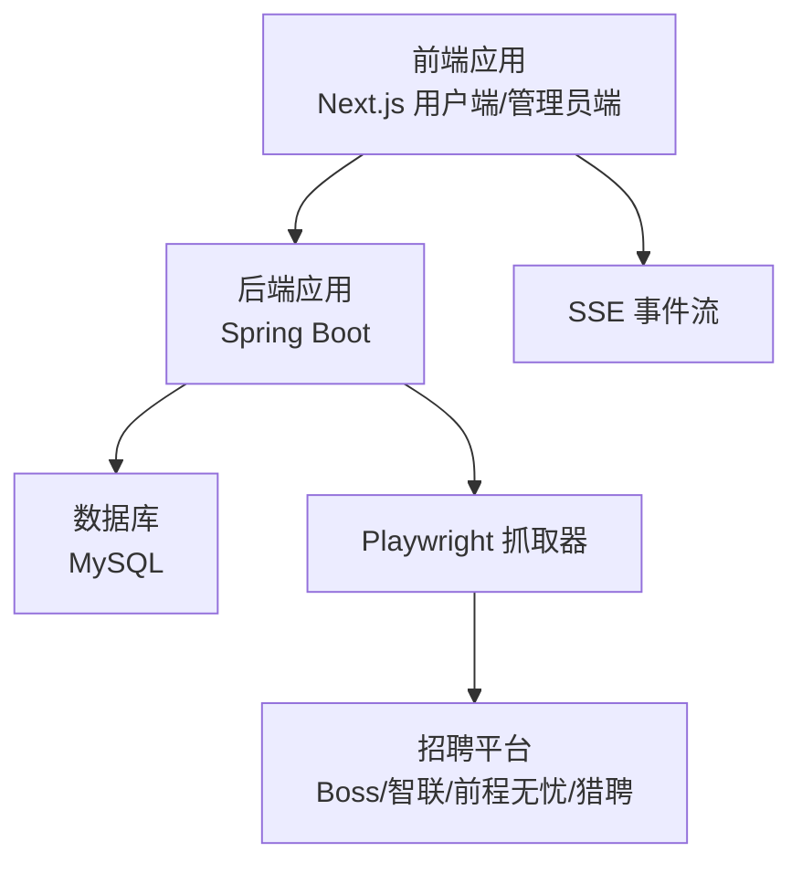
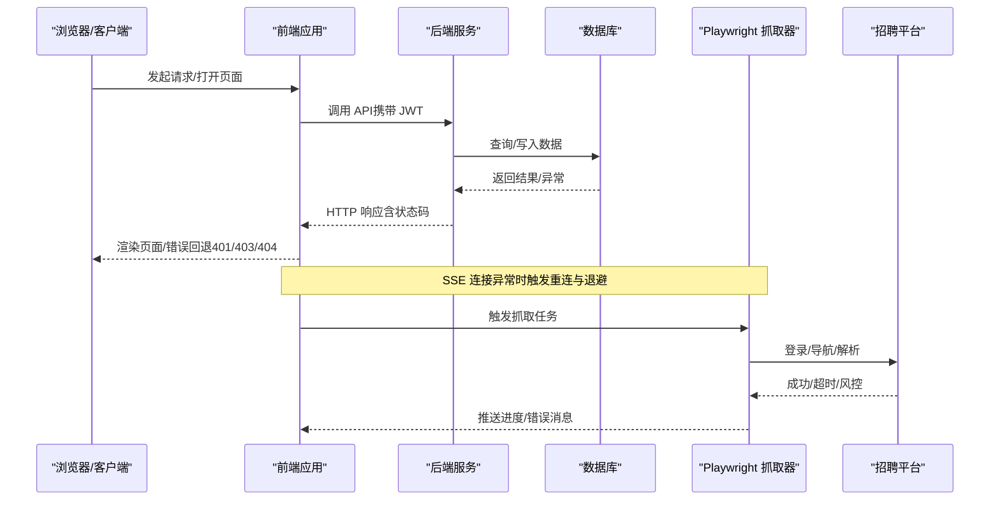
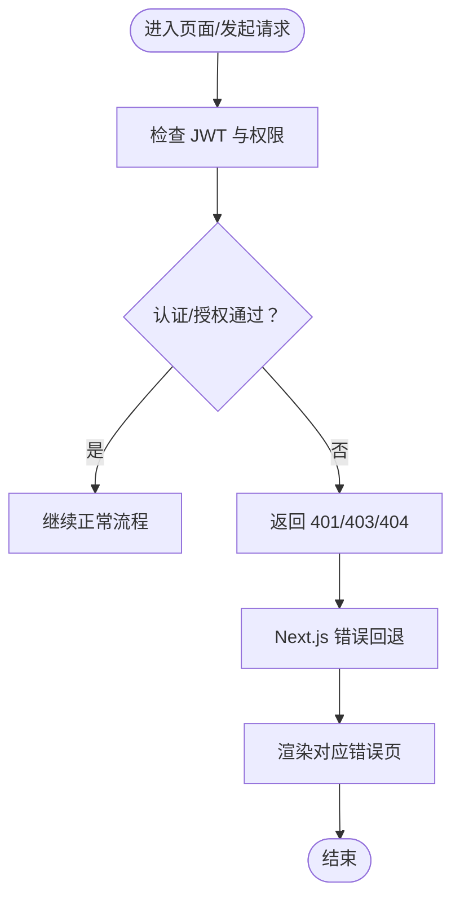
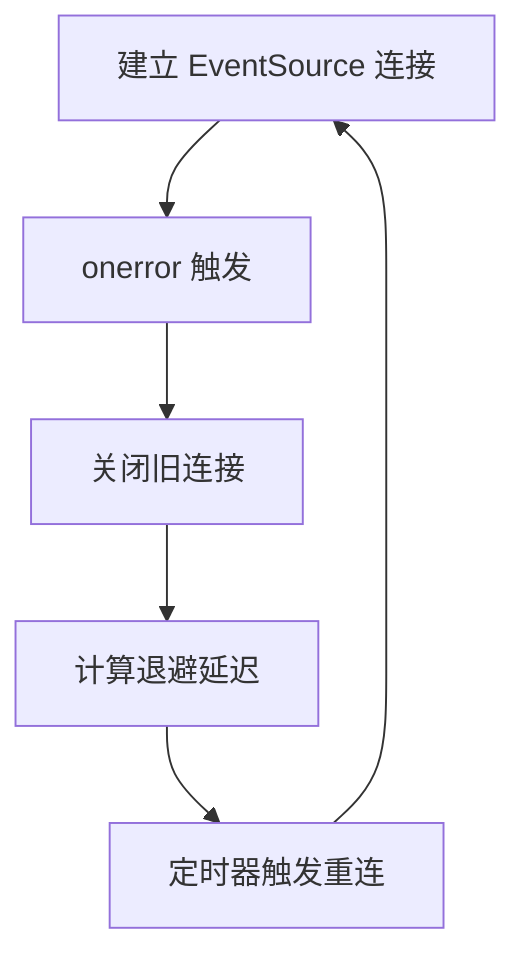
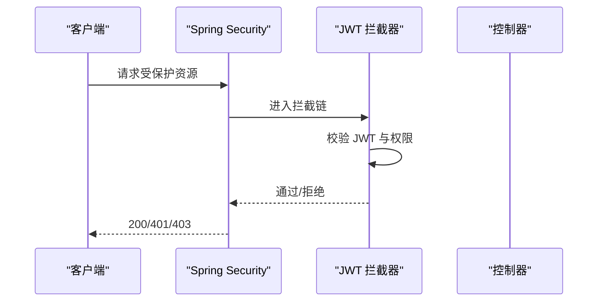
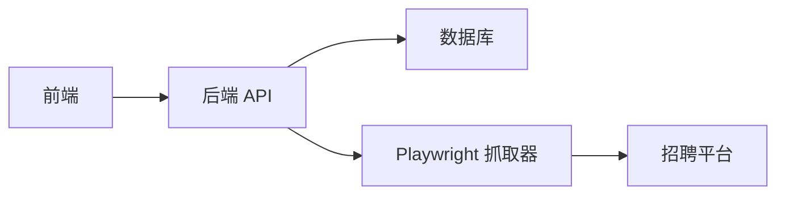

# 错误码说明

<cite>
**本文引用的文件**
- [application.yaml](file://backend/src/main/resources/application.yaml)
- [WebConfig.java](file://backend/src/main/java/com/getjobs/application/config/WebConfig.java)
- [SecurityConfig.java](file://backend/src/main/java/com/getjobs/application/config/SecurityConfig.java)
- [CorsConfig.java](file://backend/src/main/java/com/getjobs/application/config/CorsConfig.java)
- [HTTPAccessErrorStatus 定义（前端）](file://front/.next/dev/static/chunks/59315_next_dist_client_66cf20c2._.js)
- [HTTPAccessErrorStatus 定义（前端管理员）](file://front-admin/.next/dev/static/chunks/e50e5_next_dist_client_72bbceaf._.js)
- [Next.js HTTP 错误回退机制（前端）](file://front/.next/dev/server/chunks/ssr/[root-of-the-server]__6ede2137._.js)
- [Next.js HTTP 错误回退机制（前端管理员）](file://front-admin/.next/dev/server/chunks/ssr/[root-of-the-server]__b6288063._.js)
- [EventSource 重连与错误处理（前端）](file://front/.next/dev/static/chunks/_78a43346._.js)
</cite>

## 目录
1. [简介](#简介)
2. [项目结构](#项目结构)
3. [核心组件](#核心组件)
4. [架构总览](#架构总览)
5. [详细组件分析](#详细组件分析)
6. [依赖关系分析](#依赖关系分析)
7. [性能考量](#性能考量)
8. [故障排查指南](#故障排查指南)
9. [结论](#结论)
10. [附录](#附录)

## 简介
本文件面向开发者与技术支持人员，系统化梳理 GetJobs 项目的错误码体系，覆盖以下范围：
- HTTP 状态码：用于标识网络层与服务端返回的通用错误状态
- 业务逻辑错误码：用于标识业务流程中的具体失败原因
- 平台特定错误码：针对不同招聘平台（Boss、智联、前程无忧、猎聘）在抓取或登录过程中的异常
- 错误日志格式与解析方法：帮助快速定位问题根因
- 错误码查询表与快速定位指南：便于一线排障与开发对照

说明：
- 当前仓库未发现集中式的“错误码枚举/字典”文件；本文依据现有代码与配置，对可观察到的错误类型进行归类与说明，并给出建议的标准化实践路径。

## 项目结构
GetJobs 前后端分离，前端包含用户端与管理员端两套 Next.js 应用，后端为 Spring Boot 应用，负责 API 提供与数据访问。错误码涉及三层：
- 前端层：Next.js 内置的 HTTP 错误回退、SSE 连接错误与重连策略
- 后端层：Spring Security/CORS 配置、拦截器与数据库访问配置
- 平台层：Playwright 抓取器对各招聘平台的超时与稳定性参数

图表来源
- [application.yaml:1-91](file://backend/src/main/resources/application.yaml#L1-L91)
- [WebConfig.java:1-37](file://backend/src/main/java/com/getjobs/application/config/WebConfig.java#L1-L37)
- [SecurityConfig.java:1-68](file://backend/src/main/java/com/getjobs/application/config/SecurityConfig.java#L1-L68)
- [CorsConfig.java:1-40](file://backend/src/main/java/com/getjobs/application/config/CorsConfig.java#L1-L40)

章节来源
- [application.yaml:1-91](file://backend/src/main/resources/application.yaml#L1-L91)
- [WebConfig.java:1-37](file://backend/src/main/java/com/getjobs/application/config/WebConfig.java#L1-L37)
- [SecurityConfig.java:1-68](file://backend/src/main/java/com/getjobs/application/config/SecurityConfig.java#L1-L68)
- [CorsConfig.java:1-40](file://backend/src/main/java/com/getjobs/application/config/CorsConfig.java#L1-L40)

## 核心组件
- HTTP 状态码与错误回退（前端）
  - Next.js 对 401/403/404 的内置错误回退机制，用于捕获路由级访问错误并渲染对应错误页
  - 通过错误对象的 digest 字段识别是否为 HTTP 错误回退
- SSE 事件流错误与重连（前端）
  - EventSource 连接异常时自动关闭旧连接，计算退避延迟后重连
  - 支持 onError 回调，便于记录重试次数与延迟
- 后端安全与跨域（后端）
  - Spring Security 禁用默认认证与 CSRF，启用 CORS，允许凭据传递
  - WebConfig 注册 JWT 认证拦截器，排除健康检查与登录注册等公开接口
- 数据库与日志（后端）
  - 数据源配置、MyBatis Plus 全局配置、控制台与文件日志格式与滚动策略

章节来源
- [HTTPAccessErrorStatus 定义（前端）:1916-1959](file://front/.next/dev/static/chunks/59315_next_dist_client_66cf20c2._.js#L1916-L1959)
- [HTTPAccessErrorStatus 定义（前端管理员）:271-314](file://front-admin/.next/dev/static/chunks/e50e5_next_dist_client_72bbceaf._.js#L271-L314)
- [Next.js HTTP 错误回退机制（前端）:129-155](file://front/.next/dev/server/chunks/ssr/[root-of-the-server]__6ede2137._.js#L129-L155)
- [Next.js HTTP 错误回退机制（前端管理员）:701-744](file://front-admin/.next/dev/server/chunks/ssr/[root-of-the-server]__b6288063._.js#L701-L744)
- [EventSource 重连与错误处理（前端）:42-92](file://front/.next/dev/static/chunks/_78a43346._.js#L42-L92)
- [WebConfig.java:1-37](file://backend/src/main/java/com/getjobs/application/config/WebConfig.java#L1-L37)
- [SecurityConfig.java:1-68](file://backend/src/main/java/com/getjobs/application/config/SecurityConfig.java#L1-L68)
- [CorsConfig.java:1-40](file://backend/src/main/java/com/getjobs/application/config/CorsConfig.java#L1-L40)
- [application.yaml:1-91](file://backend/src/main/resources/application.yaml#L1-L91)

## 架构总览
下图展示错误码在系统中的流转与呈现位置：

图表来源
- [application.yaml:1-91](file://backend/src/main/resources/application.yaml#L1-L91)
- [WebConfig.java:1-37](file://backend/src/main/java/com/getjobs/application/config/WebConfig.java#L1-L37)
- [SecurityConfig.java:1-68](file://backend/src/main/java/com/getjobs/application/config/SecurityConfig.java#L1-L68)
- [CorsConfig.java:1-40](file://backend/src/main/java/com/getjobs/application/config/CorsConfig.java#L1-L40)
- [EventSource 重连与错误处理（前端）:42-92](file://front/.next/dev/static/chunks/_78a43346._.js#L42-L92)

## 详细组件分析

### 组件一：HTTP 状态码与错误回退（前端）
- 定义与用途
  - 401 未授权：认证失败或令牌无效
  - 403 禁止访问：权限不足或被拒绝
  - 404 未找到：资源不存在
  - NEXT_HTTP_ERROR_FALLBACK：Next.js 路由级错误回退标识
- 触发条件
  - 路由访问受保护资源且未通过鉴权
  - 服务端返回上述状态码
- 行为表现
  - 前端根据状态码渲染对应错误页
  - 通过错误对象的 digest 字段判断是否为 HTTP 错误回退
- 解决建议
  - 确认 JWT 令牌有效与过期时间
  - 检查后端拦截器与权限配置
  - 核对资源路径与权限映射

图表来源
- [HTTPAccessErrorStatus 定义（前端）:1916-1959](file://front/.next/dev/static/chunks/59315_next_dist_client_66cf20c2._.js#L1916-L1959)
- [HTTPAccessErrorStatus 定义（前端管理员）:271-314](file://front-admin/.next/dev/static/chunks/e50e5_next_dist_client_72bbceaf._.js#L271-L314)
- [Next.js HTTP 错误回退机制（前端）:129-155](file://front/.next/dev/server/chunks/ssr/[root-of-the-server]__6ede2137._.js#L129-L155)
- [Next.js HTTP 错误回退机制（前端管理员）:701-744](file://front-admin/.next/dev/server/chunks/ssr/[root-of-the-server]__b6288063._.js#L701-L744)

章节来源
- [HTTPAccessErrorStatus 定义（前端）:1916-1959](file://front/.next/dev/static/chunks/59315_next_dist_client_66cf20c2._.js#L1916-L1959)
- [HTTPAccessErrorStatus 定义（前端管理员）:271-314](file://front-admin/.next/dev/static/chunks/e50e5_next_dist_client_72bbceaf._.js#L271-L314)
- [Next.js HTTP 错误回退机制（前端）:129-155](file://front/.next/dev/server/chunks/ssr/[root-of-the-server]__6ede2137._.js#L129-L155)
- [Next.js HTTP 错误回退机制（前端管理员）:701-744](file://front-admin/.next/dev/server/chunks/ssr/[root-of-the-server]__b6288063._.js#L701-L744)

### 组件二：SSE 事件流错误与重连（前端）
- 定义与用途
  - EventSource 用于接收后端推送的任务进度/状态
  - 连接异常时自动关闭旧连接并按退避策略重连
- 触发条件
  - 网络中断、后端重启、SSE 通道异常
- 行为表现
  - onerror 回调触发，记录尝试次数与延迟
  - 自动延时重连，避免频繁重试导致压力
- 解决建议
  - 检查后端 SSE 实现与连接存活
  - 前端 onError 回调中记录重试次数与延迟，辅助定位
  - 控制最大重试次数与最大延迟，防止无限重试

图表来源
- [EventSource 重连与错误处理（前端）:42-92](file://front/.next/dev/static/chunks/_78a43346._.js#L42-L92)

章节来源
- [EventSource 重连与错误处理（前端）:42-92](file://front/.next/dev/static/chunks/_78a43346._.js#L42-L92)

### 组件三：后端安全与跨域（后端）
- 定义与用途
  - Spring Security 禁用默认认证与 CSRF，启用 CORS，允许凭据
  - WebConfig 注册 JWT 认证拦截器，排除公开接口
- 触发条件
  - 访问受保护接口未携带有效 JWT 或权限不足
- 行为表现
  - 未通过拦截器的请求可能被拒绝或重定向到鉴权流程
  - CORS 配置允许跨域与凭据传递
- 解决建议
  - 确保前端正确携带 Authorization 头
  - 核对白名单与预检缓存设置
  - 检查 JWT 过期时间与签发者配置

图表来源
- [WebConfig.java:1-37](file://backend/src/main/java/com/getjobs/application/config/WebConfig.java#L1-L37)
- [SecurityConfig.java:1-68](file://backend/src/main/java/com/getjobs/application/config/SecurityConfig.java#L1-L68)
- [CorsConfig.java:1-40](file://backend/src/main/java/com/getjobs/application/config/CorsConfig.java#L1-L40)

章节来源
- [WebConfig.java:1-37](file://backend/src/main/java/com/getjobs/application/config/WebConfig.java#L1-L37)
- [SecurityConfig.java:1-68](file://backend/src/main/java/com/getjobs/application/config/SecurityConfig.java#L1-L68)
- [CorsConfig.java:1-40](file://backend/src/main/java/com/getjobs/application/config/CorsConfig.java#L1-L40)

### 组件四：数据库与日志（后端）
- 定义与用途
  - 数据源配置、MyBatis Plus 全局配置、日志输出与滚动策略
- 触发条件
  - 数据库连接异常、SQL 执行失败、事务回滚
- 行为表现
  - 控制台与文件日志输出，包含时间戳、线程、级别、类名与消息
  - 日志文件按大小与历史天数滚动
- 解决建议
  - 检查连接池配置与超时设置
  - 关注 SQL 异常堆栈与慢查询
  - 合理设置日志级别与滚动策略

章节来源
- [application.yaml:1-91](file://backend/src/main/resources/application.yaml#L1-L91)

### 组件五：平台特定错误与稳定性（后端）
- 定义与用途
  - Playwright 抓取器对不同平台设置差异化超时与重试策略
- 触发条件
  - 页面导航超时、登录检测失败、资源阻断、浏览器不健康
- 行为表现
  - 超时后按指数退避重试，超过最大重试次数则标记失败
  - 空闲页面回收与资源阻断开关影响稳定性
- 解决建议
  - 根据平台差异调整超时与重试参数
  - 开启健康检查与页面池复用，减少不稳定因素
  - 监控 Cookie 刷新与过期时间，避免登录失效

章节来源
- [application.yaml:60-91](file://backend/src/main/resources/application.yaml#L60-L91)

## 依赖关系分析
- 前端依赖后端提供的 API 与 SSE 通道
- 后端依赖数据库与外部平台（通过 Playwright）
- 跨域与认证策略由后端统一配置，前端需遵循

图表来源
- [application.yaml:1-91](file://backend/src/main/resources/application.yaml#L1-L91)
- [WebConfig.java:1-37](file://backend/src/main/java/com/getjobs/application/config/WebConfig.java#L1-L37)
- [SecurityConfig.java:1-68](file://backend/src/main/java/com/getjobs/application/config/SecurityConfig.java#L1-L68)
- [CorsConfig.java:1-40](file://backend/src/main/java/com/getjobs/application/config/CorsConfig.java#L1-L40)

章节来源
- [application.yaml:1-91](file://backend/src/main/resources/application.yaml#L1-L91)
- [WebConfig.java:1-37](file://backend/src/main/java/com/getjobs/application/config/WebConfig.java#L1-L37)
- [SecurityConfig.java:1-68](file://backend/src/main/java/com/getjobs/application/config/SecurityConfig.java#L1-L68)
- [CorsConfig.java:1-40](file://backend/src/main/java/com/getjobs/application/config/CorsConfig.java#L1-L40)

## 性能考量
- SSE 重连退避：避免频繁重试造成后端压力，建议设置最大重试次数与最大延迟
- Playwright 超时与重试：根据平台差异合理设置，平衡成功率与响应时间
- 日志滚动：控制文件大小与历史天数，避免磁盘占用过高
- CORS 预检缓存：适当延长 MaxAge，减少重复预检请求

## 故障排查指南
- HTTP 401/403/404
  - 确认前端是否携带有效 JWT，核对过期时间与签发者
  - 检查后端拦截器与权限映射
  - 使用 Next.js 错误回退页面定位路由级问题
- SSE 连接异常
  - 查看前端 onError 回调记录的重试次数与延迟
  - 检查后端 SSE 实现与连接存活
- 数据库异常
  - 查看日志文件与控制台输出，定位 SQL 异常与慢查询
  - 检查连接池配置与超时设置
- 平台抓取失败
  - 调整导航超时与重试参数
  - 监控 Cookie 刷新与登录状态
  - 开启健康检查与页面池复用

章节来源
- [HTTPAccessErrorStatus 定义（前端）:1916-1959](file://front/.next/dev/static/chunks/59315_next_dist_client_66cf20c2._.js#L1916-L1959)
- [Next.js HTTP 错误回退机制（前端）:129-155](file://front/.next/dev/server/chunks/ssr/[root-of-the-server]__6ede2137._.js#L129-L155)
- [EventSource 重连与错误处理（前端）:42-92](file://front/.next/dev/static/chunks/_78a43346._.js#L42-L92)
- [application.yaml:1-91](file://backend/src/main/resources/application.yaml#L1-L91)

## 结论
本文件基于现有代码与配置，对 GetJobs 项目的错误码与错误处理进行了系统化梳理。由于当前仓库未发现集中式的错误码字典，建议后续引入统一的错误码规范与错误码枚举，以提升可维护性与一致性。同时，结合本文的排查流程与性能建议，可有效降低线上故障率并加速定位与修复。

## 附录

### 错误码查询表（按类别）
- HTTP 状态码（前端错误回退）
  - 401：未授权
  - 403：禁止访问
  - 404：未找到
  - NEXT_HTTP_ERROR_FALLBACK：Next.js HTTP 错误回退标识
- 网络连接错误码（前端 SSE）
  - 连接异常：onerror 触发，记录尝试次数与延迟
  - 退避重连：按指数退避策略重连
- 平台特定错误码（后端 Playwright）
  - 导航超时：不同平台设置差异化超时
  - 登录检测失败：登录状态异常
  - 资源阻断：资源拦截导致加载缓慢
  - 浏览器不健康：健康检查失败
  - 最大重试次数：超过阈值标记失败
  - 空闲页面回收：空闲超时回收页面
  - Cookie 刷新：过期前刷新 Cookie

章节来源
- [HTTPAccessErrorStatus 定义（前端）:1916-1959](file://front/.next/dev/static/chunks/59315_next_dist_client_66cf20c2._.js#L1916-L1959)
- [EventSource 重连与错误处理（前端）:42-92](file://front/.next/dev/static/chunks/_78a43346._.js#L42-L92)
- [application.yaml:60-91](file://backend/src/main/resources/application.yaml#L60-L91)

### 快速定位指南
- 前端路由级错误
  - 检查 401/403/404 是否触发 Next.js 错误回退
  - 核对错误对象 digest 字段
- SSE 连接问题
  - 查看前端 onError 回调与退避日志
  - 检查后端 SSE 实现与连接存活
- 后端认证与跨域
  - 确认 JWT 有效性与拦截器配置
  - 核对 CORS 预检与凭据设置
- 数据库问题
  - 查看日志文件与控制台输出
  - 检查连接池与 SQL 异常
- 平台抓取问题
  - 调整超时与重试参数
  - 监控 Cookie 刷新与登录状态

章节来源
- [HTTPAccessErrorStatus 定义（前端）:1916-1959](file://front/.next/dev/static/chunks/59315_next_dist_client_66cf20c2._.js#L1916-L1959)
- [Next.js HTTP 错误回退机制（前端）:129-155](file://front/.next/dev/server/chunks/ssr/[root-of-the-server]__6ede2137._.js#L129-L155)
- [EventSource 重连与错误处理（前端）:42-92](file://front/.next/dev/static/chunks/_78a43346._.js#L42-L92)
- [WebConfig.java:1-37](file://backend/src/main/java/com/getjobs/application/config/WebConfig.java#L1-L37)
- [SecurityConfig.java:1-68](file://backend/src/main/java/com/getjobs/application/config/SecurityConfig.java#L1-L68)
- [CorsConfig.java:1-40](file://backend/src/main/java/com/getjobs/application/config/CorsConfig.java#L1-L40)
- [application.yaml:1-91](file://backend/src/main/resources/application.yaml#L1-L91)