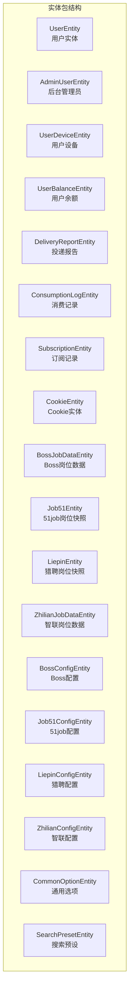
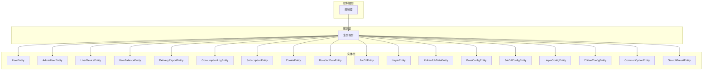
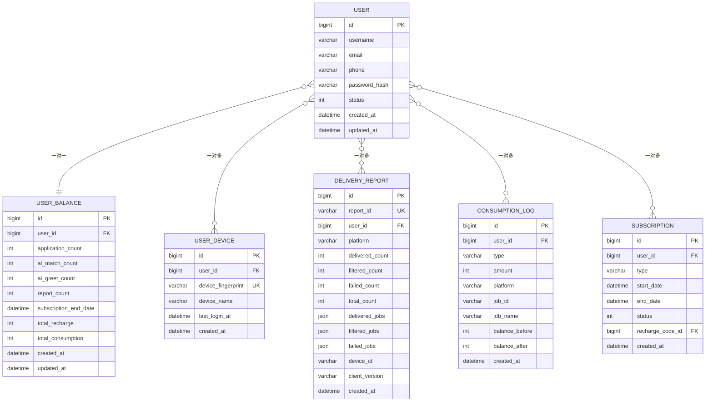

# 实体模型设计

<cite>
**本文引用的文件**
- [UserEntity.java](file://backend/src/main/java/com/getjobs/application/entity/UserEntity.java)
- [CookieEntity.java](file://backend/src/main/java/com/getjobs/application/entity/CookieEntity.java)
- [BossJobDataEntity.java](file://backend/src/main/java/com/getjobs/application/entity/BossJobDataEntity.java)
- [Job51Entity.java](file://backend/src/main/java/com/getjobs/application/entity/Job51Entity.java)
- [LiepinEntity.java](file://backend/src/main/java/com/getjobs/application/entity/LiepinEntity.java)
- [ZhilianJobDataEntity.java](file://backend/src/main/java/com/getjobs/application/entity/ZhilianJobDataEntity.java)
- [AdminUserEntity.java](file://backend/src/main/java/com/getjobs/application/entity/AdminUserEntity.java)
- [UserDeviceEntity.java](file://backend/src/main/java/com/getjobs/application/entity/UserDeviceEntity.java)
- [UserBalanceEntity.java](file://backend/src/main/java/com/getjobs/application/entity/UserBalanceEntity.java)
- [DeliveryReportEntity.java](file://backend/src/main/java/com/getjobs/application/entity/DeliveryReportEntity.java)
- [ConsumptionLogEntity.java](file://backend/src/main/java/com/getjobs/application/entity/ConsumptionLogEntity.java)
- [SubscriptionEntity.java](file://backend/src/main/java/com/getjobs/application/entity/SubscriptionEntity.java)
- [BossConfigEntity.java](file://backend/src/main/java/com/getjobs/application/entity/BossConfigEntity.java)
- [Job51ConfigEntity.java](file://backend/src/main/java/com/getjobs/application/entity/Job51ConfigEntity.java)
- [LiepinConfigEntity.java](file://backend/src/main/java/com/getjobs/application/entity/LiepinConfigEntity.java)
- [ZhilianConfigEntity.java](file://backend/src/main/java/com/getjobs/application/entity/ZhilianConfigEntity.java)
- [CommonOptionEntity.java](file://backend/src/main/java/com/getjobs/application/entity/CommonOptionEntity.java)
- [SearchPresetEntity.java](file://backend/src/main/java/com/getjobs/application/entity/SearchPresetEntity.java)
</cite>

## 目录
1. [简介](#简介)
2. [项目结构](#项目结构)
3. [核心组件](#核心组件)
4. [架构总览](#架构总览)
5. [详细组件分析](#详细组件分析)
6. [依赖分析](#依赖分析)
7. [性能考虑](#性能考虑)
8. [故障排查指南](#故障排查指南)
9. [结论](#结论)
10. [附录](#附录)

## 简介
本文件面向后端开发者与数据库设计者，系统化梳理 GetJobs 的实体模型设计，重点覆盖以下方面：
- 核心实体类的设计思路与字段定义：用户、Cookie、各平台求职数据、后台管理、设备与余额、投递报告与消费记录、订阅、平台配置、通用选项与搜索预设。
- 字段类型、业务含义、约束条件与索引设计建议。
- 实体间关系映射（一对一、一对多、多对多）及其实现方式。
- Lombok 注解与实体生命周期管理策略。
- 使用示例与最佳实践、数据验证与业务约束。

## 项目结构
实体位于后端模块的 entity 包中，采用 MyBatis-Plus 注解进行表映射与主键策略配置，配合 Lombok 自动生成 getter/setter/toString 等方法，提升开发效率与可读性。

图表来源
- [UserEntity.java:1-41](file://backend/src/main/java/com/getjobs/application/entity/UserEntity.java#L1-L41)
- [AdminUserEntity.java:1-35](file://backend/src/main/java/com/getjobs/application/entity/AdminUserEntity.java#L1-L35)
- [UserDeviceEntity.java:1-35](file://backend/src/main/java/com/getjobs/application/entity/UserDeviceEntity.java#L1-L35)
- [UserBalanceEntity.java:1-50](file://backend/src/main/java/com/getjobs/application/entity/UserBalanceEntity.java#L1-L50)
- [DeliveryReportEntity.java:1-59](file://backend/src/main/java/com/getjobs/application/entity/DeliveryReportEntity.java#L1-L59)
- [ConsumptionLogEntity.java:1-47](file://backend/src/main/java/com/getjobs/application/entity/ConsumptionLogEntity.java#L1-L47)
- [SubscriptionEntity.java:1-41](file://backend/src/main/java/com/getjobs/application/entity/SubscriptionEntity.java#L1-L41)
- [CookieEntity.java:1-54](file://backend/src/main/java/com/getjobs/application/entity/CookieEntity.java#L1-L54)
- [BossJobDataEntity.java:1-108](file://backend/src/main/java/com/getjobs/application/entity/BossJobDataEntity.java#L1-L108)
- [Job51Entity.java:1-76](file://backend/src/main/java/com/getjobs/application/entity/Job51Entity.java#L1-L76)
- [LiepinEntity.java:1-81](file://backend/src/main/java/com/getjobs/application/entity/LiepinEntity.java#L1-L81)
- [ZhilianJobDataEntity.java:1-64](file://backend/src/main/java/com/getjobs/application/entity/ZhilianJobDataEntity.java#L1-L64)
- [BossConfigEntity.java:1-57](file://backend/src/main/java/com/getjobs/application/entity/BossConfigEntity.java#L1-L57)
- [Job51ConfigEntity.java:1-31](file://backend/src/main/java/com/getjobs/application/entity/Job51ConfigEntity.java#L1-L31)
- [LiepinConfigEntity.java:1-32](file://backend/src/main/java/com/getjobs/application/entity/LiepinConfigEntity.java#L1-L32)
- [ZhilianConfigEntity.java:1-31](file://backend/src/main/java/com/getjobs/application/entity/ZhilianConfigEntity.java#L1-L31)
- [CommonOptionEntity.java:1-29](file://backend/src/main/java/com/getjobs/application/entity/CommonOptionEntity.java#L1-L29)
- [SearchPresetEntity.java:1-35](file://backend/src/main/java/com/getjobs/application/entity/SearchPresetEntity.java#L1-L35)

章节来源
- [UserEntity.java:1-41](file://backend/src/main/java/com/getjobs/application/entity/UserEntity.java#L1-L41)
- [CookieEntity.java:1-54](file://backend/src/main/java/com/getjobs/application/entity/CookieEntity.java#L1-L54)

## 核心组件
本节概述关键实体及其职责边界，并给出字段类型、约束与索引建议。

- 用户实体（UserEntity）
  - 业务含义：商业化系统的用户账户，包含认证与状态信息。
  - 关键字段：用户名、邮箱、手机号、密码哈希、状态、创建/更新时间。
  - 约束与索引：建议在用户名、邮箱、手机号建立唯一索引；状态字段用于快速筛选启用用户。
  - 生命周期：创建时填充 createdAt，更新时更新 updatedAt。

- Cookie 实体（CookieEntity）
  - 业务含义：存储各平台 Cookie，便于自动化抓取与登录态维护。
  - 关键字段：平台名称、Cookie 值、备注、创建/更新时间。
  - 约束与索引：建议按平台建立唯一索引以避免重复；必要时按平台+备注组合索引。
  - 生命周期：同上。

- Boss 岗位数据（BossJobDataEntity）
  - 业务含义：Boss 直聘岗位快照，记录岗位、公司、HR、投递状态等。
  - 关键字段：加密岗位/用户 ID、公司/岗位/地点/经验/学历、HR 信息、投递状态、岗位描述/链接、招聘状态、公司地址/行业/融资/规模、创建/更新时间。
  - 约引与索引：建议对 encryptId、jobName、location、deliveryStatus 建立索引；对 createdAt/updatedAt 建立时间索引。
  - 生命周期：同上。

- 51job 岗位数据（Job51Entity）
  - 业务含义：51job 搜索结果快照，聚焦岗位标题、链接、薪资、地区、学历/经验、HR 信息与投递状态。
  - 关键字段：岗位 ID、标题、链接、薪资文本、地区、学历/经验、发布时间、公司/HR 信息、投递状态、创建/更新时间。
  - 约束与索引：建议对 jobId、jobTitle、jobArea、delivered 建立索引；对 createdAt 建立时间索引。
  - 生命周期：同上。

- 猎聘岗位数据（LiepinEntity）
  - 业务含义：猎聘搜索结果快照，包含岗位、公司、HR 与投递状态。
  - 关键字段：岗位 ID、标题、链接、薪资文本、地区、学历/经验、刷新/发布时间、公司/HR 信息、IM ID、投递状态、创建/更新时间。
  - 约束与索引：建议对 jobId、jobTitle、jobArea、delivered 建立索引；对 createdAt 建立时间索引。
  - 生命周期：同上。

- 智联岗位数据（ZhilianJobDataEntity）
  - 业务含义：智联岗位快照，包含岗位 ID、标题、链接、薪资、地点、经验/学历、公司名称、投递状态、创建/更新时间。
  - 关键字段：自增 ID、岗位 ID、标题、链接、薪资、地点、经验/学历、公司名称、投递状态、创建/更新时间。
  - 约束与索引：建议对 jobId、jobTitle、location、deliveryStatus 建立索引；对 createdAt 建立时间索引。
  - 生命周期：同上。

- 后台管理员（AdminUserEntity）
  - 业务含义：后台管理系统用户，权限控制基础。
  - 关键字段：用户名、密码哈希、状态、创建/更新时间。
  - 约束与索引：建议对用户名建立唯一索引；状态字段用于快速筛选启用管理员。
  - 生命周期：同上。

- 用户设备（UserDeviceEntity）
  - 业务含义：用户设备绑定，用于设备指纹识别与登录审计。
  - 关键字段：用户 ID、设备指纹、设备名称、最后登录时间、创建时间。
  - 约束与索引：建议对 deviceFingerprint 建立唯一索引；对 userId 建立索引。
  - 生命周期：同上。

- 用户余额（UserBalanceEntity）
  - 业务含义：用户可用额度与订阅状态，支撑业务消费与功能限制。
  - 关键字段：用户 ID、剩余投递次数、AI 匹配/打招呼次数、数据报告次数、订阅结束时间、累计充值/消费次数、创建/更新时间。
  - 约束与索引：建议对 userId 建立唯一索引；对 subscriptionEndDate 建立索引以便到期检查。
  - 生命周期：同上。

- 投递报告（DeliveryReportEntity）
  - 业务含义：客户端上报的投递结果统计与明细（JSON），用于运营分析与对账。
  - 关键字段：报告 ID、用户 ID、平台、成功/被过滤/失败/总计数、成功/被过滤/失败的职位详情（JSON）、设备 ID、客户端版本、创建时间。
  - 约束与索引：建议对 reportId 唯一；对 userId、platform、createdAt 建立索引。
  - 生命周期：同上。

- 消费记录（ConsumptionLogEntity）
  - 业务含义：用户每次消费的明细流水，支持对账与审计。
  - 关键字段：用户 ID、消费类型（投递/AI 匹配/AI 打招呼/数据报告）、数量、平台、岗位 ID/名称、消费前后余额、创建时间。
  - 约束与索引：建议对 userId、type、platform、jobId 建立索引；对 createdAt 建立时间索引。
  - 生命周期：同上。

- 订阅记录（SubscriptionEntity）
  - 业务含义：用户的订阅生命周期记录，支持到期与状态管理。
  - 关键字段：用户 ID、订阅类型、开始/结束时间、状态（未激活/有效/已过期/已取消）、关联充值码 ID、创建时间。
  - 约束与索引：建议对 userId、endDate、status 建立索引；对 rechargeCodeId 建立索引。
  - 生命周期：同上。

- 平台配置（BossConfigEntity、Job51ConfigEntity、LiepinConfigEntity、ZhilianConfigEntity）
  - 业务含义：各平台的采集/投递配置参数，如关键词、城市、薪资、经验、学历、是否启用 AI、是否过滤不在线 HR 等。
  - 关键字段：调试模式、等待时间、关键词、城市/区域/薪资/经验/学历/规模/阶段、默认打招呼语、期望薪资上下限、AI 开关、图片简历开关、过滤不在线 HR、HR 不在线状态列表、创建/更新时间。
  - 约束与索引：配置实体通常按用户维度查询，建议对 userId（若扩展）建立索引；对 createdAt 建立时间索引。
  - 生命周期：同上。

- 通用选项（CommonOptionEntity）
  - 业务含义：跨平台/跨模块的通用枚举/选项，支持前端选择器。
  - 关键字段：类型、显示标签、选项值、排序顺序、创建/更新时间。
  - 约束与索引：建议对 type/value 建立组合索引；对 sort_order 建立索引。
  - 生命周期：同上。

- 搜索预设（SearchPresetEntity）
  - 业务含义：用户保存的搜索条件模板，便于快速复用。
  - 关键字段：名称、关键词、城市、创建/更新时间。
  - 约束与索引：建议对 name、keywords、city 建立索引。
  - 生命周期：同上。

章节来源
- [UserEntity.java:10-40](file://backend/src/main/java/com/getjobs/application/entity/UserEntity.java#L10-L40)
- [CookieEntity.java:11-53](file://backend/src/main/java/com/getjobs/application/entity/CookieEntity.java#L11-L53)
- [BossJobDataEntity.java:11-107](file://backend/src/main/java/com/getjobs/application/entity/BossJobDataEntity.java#L11-L107)
- [Job51Entity.java:10-75](file://backend/src/main/java/com/getjobs/application/entity/Job51Entity.java#L10-L75)
- [LiepinEntity.java:10-80](file://backend/src/main/java/com/getjobs/application/entity/LiepinEntity.java#L10-L80)
- [ZhilianJobDataEntity.java:11-63](file://backend/src/main/java/com/getjobs/application/entity/ZhilianJobDataEntity.java#L11-L63)
- [AdminUserEntity.java:10-34](file://backend/src/main/java/com/getjobs/application/entity/AdminUserEntity.java#L10-L34)
- [UserDeviceEntity.java:10-34](file://backend/src/main/java/com/getjobs/application/entity/UserDeviceEntity.java#L10-L34)
- [UserBalanceEntity.java:10-49](file://backend/src/main/java/com/getjobs/application/entity/UserBalanceEntity.java#L10-L49)
- [DeliveryReportEntity.java:10-58](file://backend/src/main/java/com/getjobs/application/entity/DeliveryReportEntity.java#L10-L58)
- [ConsumptionLogEntity.java:10-46](file://backend/src/main/java/com/getjobs/application/entity/ConsumptionLogEntity.java#L10-L46)
- [SubscriptionEntity.java:10-40](file://backend/src/main/java/com/getjobs/application/entity/SubscriptionEntity.java#L10-L40)
- [BossConfigEntity.java:10-56](file://backend/src/main/java/com/getjobs/application/entity/BossConfigEntity.java#L10-L56)
- [Job51ConfigEntity.java:10-30](file://backend/src/main/java/com/getjobs/application/entity/Job51ConfigEntity.java#L10-L30)
- [LiepinConfigEntity.java:10-31](file://backend/src/main/java/com/getjobs/application/entity/LiepinConfigEntity.java#L10-L31)
- [ZhilianConfigEntity.java:10-30](file://backend/src/main/java/com/getjobs/application/entity/ZhilianConfigEntity.java#L10-L30)
- [CommonOptionEntity.java:10-27](file://backend/src/main/java/com/getjobs/application/entity/CommonOptionEntity.java#L10-L27)
- [SearchPresetEntity.java:10-34](file://backend/src/main/java/com/getjobs/application/entity/SearchPresetEntity.java#L10-L34)

## 架构总览
实体层通过 MyBatis-Plus 注解与数据库表进行映射，Lombok 提升代码简洁性。业务层通过服务与控制器调用实体，结合配置实体与通用选项支撑动态行为与前端展示。

图表来源
- [UserEntity.java:1-41](file://backend/src/main/java/com/getjobs/application/entity/UserEntity.java#L1-L41)
- [AdminUserEntity.java:1-35](file://backend/src/main/java/com/getjobs/application/entity/AdminUserEntity.java#L1-L35)
- [UserDeviceEntity.java:1-35](file://backend/src/main/java/com/getjobs/application/entity/UserDeviceEntity.java#L1-L35)
- [UserBalanceEntity.java:1-50](file://backend/src/main/java/com/getjobs/application/entity/UserBalanceEntity.java#L1-L50)
- [DeliveryReportEntity.java:1-59](file://backend/src/main/java/com/getjobs/application/entity/DeliveryReportEntity.java#L1-L59)
- [ConsumptionLogEntity.java:1-47](file://backend/src/main/java/com/getjobs/application/entity/ConsumptionLogEntity.java#L1-L47)
- [SubscriptionEntity.java:1-41](file://backend/src/main/java/com/getjobs/application/entity/SubscriptionEntity.java#L1-L41)
- [CookieEntity.java:1-54](file://backend/src/main/java/com/getjobs/application/entity/CookieEntity.java#L1-L54)
- [BossJobDataEntity.java:1-108](file://backend/src/main/java/com/getjobs/application/entity/BossJobDataEntity.java#L1-L108)
- [Job51Entity.java:1-76](file://backend/src/main/java/com/getjobs/application/entity/Job51Entity.java#L1-L76)
- [LiepinEntity.java:1-81](file://backend/src/main/java/com/getjobs/application/entity/LiepinEntity.java#L1-L81)
- [ZhilianJobDataEntity.java:1-64](file://backend/src/main/java/com/getjobs/application/entity/ZhilianJobDataEntity.java#L1-L64)
- [BossConfigEntity.java:1-57](file://backend/src/main/java/com/getjobs/application/entity/BossConfigEntity.java#L1-L57)
- [Job51ConfigEntity.java:1-31](file://backend/src/main/java/com/getjobs/application/entity/Job51ConfigEntity.java#L1-L31)
- [LiepinConfigEntity.java:1-32](file://backend/src/main/java/com/getjobs/application/entity/LiepinConfigEntity.java#L1-L32)
- [ZhilianConfigEntity.java:1-31](file://backend/src/main/java/com/getjobs/application/entity/ZhilianConfigEntity.java#L1-L31)
- [CommonOptionEntity.java:1-29](file://backend/src/main/java/com/getjobs/application/entity/CommonOptionEntity.java#L1-L29)
- [SearchPresetEntity.java:1-35](file://backend/src/main/java/com/getjobs/application/entity/SearchPresetEntity.java#L1-L35)

## 详细组件分析

### 用户实体（UserEntity）
- 设计要点
  - 使用注解声明表名与主键自增策略。
  - 字段覆盖认证与状态管理所需的关键信息。
  - 时间字段遵循统一命名规范。
- 字段与约束
  - 主键：Long id（自增）
  - 唯一性：username、email、phone 建议唯一索引
  - 状态：Integer status（0-禁用，1-启用）
  - 时间：createdAt、updatedAt
- 生命周期
  - 创建：设置 createdAt；更新：设置 updatedAt
- 使用示例与最佳实践
  - 查询启用用户：按 status=1 过滤
  - 唯一性校验：注册时对 username/email/phone 做去重检查
  - 安全：仅存储密码哈希，不落库明文

章节来源
- [UserEntity.java:10-40](file://backend/src/main/java/com/getjobs/application/entity/UserEntity.java#L10-L40)

### Cookie 实体（CookieEntity）
- 设计要点
  - 平台维度存储 Cookie，便于按平台切换与清理
  - 字段命名清晰，便于前端与后端协作
- 字段与约束
  - 主键：Long id（自增）
  - 平台：String platform（boss/zhilian/job51/liepin）
  - 唯一性：建议按 platform 建立唯一索引
  - 时间：createdAt、updatedAt
- 生命周期
  - 创建：设置 createdAt；更新：设置 updatedAt
- 使用示例与最佳实践
  - 获取平台 Cookie：按 platform 查询
  - 定期轮换：根据平台反爬策略定期更换

章节来源
- [CookieEntity.java:11-53](file://backend/src/main/java/com/getjobs/application/entity/CookieEntity.java#L11-L53)

### Boss 岗位数据（BossJobDataEntity）
- 设计要点
  - 字段覆盖岗位、公司、HR、投递状态与描述
  - 采用加密 ID 保护敏感标识
- 字段与约束
  - 主键：Long id（自增）
  - 唯一性：encryptId 建议唯一索引
  - 状态：deliveryStatus（未投递/已投递/已过滤/投递失败）
  - 时间：createdAt、updatedAt
- 生命周期
  - 创建：设置 createdAt；更新：设置 updatedAt
- 使用示例与最佳实践
  - 快照存储：搜索结果入库，便于后续分析与去重
  - 状态追踪：按 deliveryStatus 分类统计

章节来源
- [BossJobDataEntity.java:11-107](file://backend/src/main/java/com/getjobs/application/entity/BossJobDataEntity.java#L11-L107)

### 51job 岗位数据（Job51Entity）
- 设计要点
  - 聚焦岗位标题、链接、薪资、地区、学历/经验、HR 信息与投递状态
- 字段与约束
  - 主键：Long jobId（岗位 ID）
  - 状态：Integer delivered（0-未投递，1-已投递）
  - 时间：createdAt、updatedAt
- 生命周期
  - 创建：设置 createdAt；更新：设置 updatedAt
- 使用示例与最佳实践
  - 去重：以 jobId 作为唯一标识
  - 筛选：按 jobArea、jobEduReq、jobExpReq、delivered 过滤

章节来源
- [Job51Entity.java:10-75](file://backend/src/main/java/com/getjobs/application/entity/Job51Entity.java#L10-L75)

### 猎聘岗位数据（LiepinEntity）
- 设计要点
  - 包含 HR 即时通讯 ID，便于后续沟通
- 字段与约束
  - 主键：Long jobId（岗位 ID）
  - 状态：Integer delivered（0-未投递，1-已投递）
  - 时间：createdAt、updatedAt
- 生命周期
  - 创建：设置 createdAt；更新：设置 updatedAt
- 使用示例与最佳实践
  - 去重：以 jobId 作为唯一标识
  - 筛选：按 jobArea、jobEduReq、jobExpReq、delivered 过滤

章节来源
- [LiepinEntity.java:10-80](file://backend/src/main/java/com/getjobs/application/entity/LiepinEntity.java#L10-L80)

### 智联岗位数据（ZhilianJobDataEntity）
- 设计要点
  - 采用字符串岗位 ID，兼容平台差异
- 字段与约束
  - 主键：Long id（自增）
  - 状态：deliveryStatus（未投递/已投递/已过滤/投递失败）
  - 时间：createdAt、updatedAt
- 生命周期
  - 创建：设置 createdAt；更新：设置 updatedAt
- 使用示例与最佳实践
  - 去重：以 jobId 作为唯一标识
  - 筛选：按 jobTitle、location、deliveryStatus 过滤

章节来源
- [ZhilianJobDataEntity.java:11-63](file://backend/src/main/java/com/getjobs/application/entity/ZhilianJobDataEntity.java#L11-L63)

### 后台管理员（AdminUserEntity）
- 设计要点
  - 管理员账户与用户账户分离，便于权限控制
- 字段与约束
  - 主键：Long id（自增）
  - 唯一性：username 建议唯一索引
  - 状态：Integer status（0-禁用，1-启用）
  - 时间：createdAt、updatedAt
- 生命周期
  - 创建：设置 createdAt；更新：设置 updatedAt
- 使用示例与最佳实践
  - 登录鉴权：按 status=1 与唯一用户名查询
  - 权限分级：结合角色表扩展

章节来源
- [AdminUserEntity.java:10-34](file://backend/src/main/java/com/getjobs/application/entity/AdminUserEntity.java#L10-L34)

### 用户设备（UserDeviceEntity）
- 设计要点
  - 设备指纹识别与登录审计
- 字段与约束
  - 主键：Long id（自增）
  - 唯一性：deviceFingerprint 建议唯一索引
  - 时间：lastLoginAt、createdAt
- 生命周期
  - 创建：设置 createdAt；更新：设置 lastLoginAt
- 使用示例与最佳实践
  - 登录风控：按 deviceFingerprint 识别异常设备
  - 设备绑定：按 userId 与 deviceFingerprint 建立映射

章节来源
- [UserDeviceEntity.java:10-34](file://backend/src/main/java/com/getjobs/application/entity/UserDeviceEntity.java#L10-L34)

### 用户余额（UserBalanceEntity）
- 设计要点
  - 支撑业务消费与功能限制
- 字段与约束
  - 主键：Long id（自增）
  - 唯一性：userId 建议唯一索引
  - 订阅：subscriptionEndDate 用于到期检查
  - 时间：createdAt、updatedAt
- 生命周期
  - 创建：设置 createdAt；更新：设置 updatedAt
- 使用示例与最佳实践
  - 额度校验：投递前检查 applicationCount
  - 订阅到期：按 endDate 与 status 判定有效期

章节来源
- [UserBalanceEntity.java:10-49](file://backend/src/main/java/com/getjobs/application/entity/UserBalanceEntity.java#L10-L49)

### 投递报告（DeliveryReportEntity）
- 设计要点
  - 客户端上报的投递结果统计与明细（JSON）
- 字段与约束
  - 主键：Long id（自增）
  - 唯一性：reportId 建议唯一索引
  - 平台：platform（boss/liepin/job51/zhilian）
  - 时间：createdAt
- 生命周期
  - 创建：设置 createdAt
- 使用示例与最佳实践
  - 对账：按 reportId 与平台核对投递明细
  - 统计：按 platform、createdAt 聚合

章节来源
- [DeliveryReportEntity.java:10-58](file://backend/src/main/java/com/getjobs/application/entity/DeliveryReportEntity.java#L10-L58)

### 消费记录（ConsumptionLogEntity）
- 设计要点
  - 每次消费的明细流水，支持对账与审计
- 字段与约束
  - 主键：Long id（自增）
  - 类型：type（application/ai_match/ai_greet/report）
  - 时间：createdAt
- 生命周期
  - 创建：设置 createdAt
- 使用示例与最佳实践
  - 对账：按 userId、type、platform、jobId 核对
  - 审计：按 createdAt 排序查看流水

章节来源
- [ConsumptionLogEntity.java:10-46](file://backend/src/main/java/com/getjobs/application/entity/ConsumptionLogEntity.java#L10-L46)

### 订阅记录（SubscriptionEntity）
- 设计要点
  - 用户订阅生命周期记录
- 字段与约束
  - 主键：Long id（自增）
  - 状态：status（0-未激活，1-有效，2-已过期，3-已取消）
  - 时间：startDate、endDate、createdAt
- 生命周期
  - 创建：设置 createdAt；到期检查：按 endDate 与 status 判定
- 使用示例与最佳实践
  - 功能开关：按 status=1 判定是否开放功能
  - 到期提醒：定时任务扫描即将到期的订阅

章节来源
- [SubscriptionEntity.java:10-40](file://backend/src/main/java/com/getjobs/application/entity/SubscriptionEntity.java#L10-L40)

### 平台配置（BossConfigEntity、Job51ConfigEntity、LiepinConfigEntity、ZhilianConfigEntity）
- 设计要点
  - 各平台的采集/投递配置参数，支持动态调整
- 字段与约束
  - 主键：Long id（自增）
  - 参数：关键词、城市/区域/薪资、经验/学历/规模/阶段、AI 开关、过滤策略等
  - 时间：createdAt、updatedAt
- 生命周期
  - 创建：设置 createdAt；更新：设置 updatedAt
- 使用示例与最佳实践
  - 动态配置：按用户维度加载配置，支持热更新
  - 参数校验：对列表参数做格式校验与长度限制

章节来源
- [BossConfigEntity.java:10-56](file://backend/src/main/java/com/getjobs/application/entity/BossConfigEntity.java#L10-L56)
- [Job51ConfigEntity.java:10-30](file://backend/src/main/java/com/getjobs/application/entity/Job51ConfigEntity.java#L10-L30)
- [LiepinConfigEntity.java:10-31](file://backend/src/main/java/com/getjobs/application/entity/LiepinConfigEntity.java#L10-L31)
- [ZhilianConfigEntity.java:10-30](file://backend/src/main/java/com/getjobs/application/entity/ZhilianConfigEntity.java#L10-L30)

### 通用选项（CommonOptionEntity）
- 设计要点
  - 跨模块的通用枚举/选项，支持前端选择器
- 字段与约束
  - 主键：Long id（自增）
  - 唯一性：type/value 建议组合索引
  - 排序：sortOrder
  - 时间：createdAt、updatedAt
- 生命周期
  - 创建：设置 createdAt；更新：设置 updatedAt
- 使用示例与最佳实践
  - 下拉选择：按 type 分组查询 value-label
  - 排序展示：按 sortOrder 升序

章节来源
- [CommonOptionEntity.java:10-27](file://backend/src/main/java/com/getjobs/application/entity/CommonOptionEntity.java#L10-L27)

### 搜索预设（SearchPresetEntity）
- 设计要点
  - 用户保存的搜索条件模板，便于快速复用
- 字段与约束
  - 主键：Long id（自增）
  - 唯一性：name 建议唯一索引
  - 时间：createdAt、updatedAt
- 生命周期
  - 创建：设置 createdAt；更新：设置 updatedAt
- 使用示例与最佳实践
  - 快速搜索：按 name 加载关键词与城市
  - 模板管理：支持编辑与删除

章节来源
- [SearchPresetEntity.java:10-34](file://backend/src/main/java/com/getjobs/application/entity/SearchPresetEntity.java#L10-L34)

## 依赖分析
- 实体与注解
  - MyBatis-Plus 注解：@TableName、@TableId、@TableField、IdType（AUTO）
  - Lombok 注解：@Data（自动生成 getter/setter/toString）
- 实体间关系
  - 一对一：UserEntity 与 UserBalanceEntity（通过 userId 唯一关联）
  - 一对多：UserEntity 与 UserDeviceEntity（一个用户可绑定多个设备）
  - 一对多：UserEntity 与 DeliveryReportEntity（一个用户可产生多个报告）
  - 一对多：UserEntity 与 ConsumptionLogEntity（一个用户有多条消费记录）
  - 一对多：UserEntity 与 SubscriptionEntity（一个用户有多条订阅记录）
  - 多对多：通过中间表或 JSON 字段实现（如投递报告中的职位详情 JSON）
- 外键与索引
  - 建议在外键字段（如 userId、deviceId、rechargeCodeId）建立索引
  - 建议在状态字段（status）、时间字段（createdAt/updatedAt）建立索引
- 循环依赖
  - 实体之间无直接循环依赖；服务层通过 Mapper/Repository 解耦

图表来源
- [UserEntity.java:10-40](file://backend/src/main/java/com/getjobs/application/entity/UserEntity.java#L10-L40)
- [UserBalanceEntity.java:10-49](file://backend/src/main/java/com/getjobs/application/entity/UserBalanceEntity.java#L10-L49)
- [UserDeviceEntity.java:10-34](file://backend/src/main/java/com/getjobs/application/entity/UserDeviceEntity.java#L10-L34)
- [DeliveryReportEntity.java:10-58](file://backend/src/main/java/com/getjobs/application/entity/DeliveryReportEntity.java#L10-L58)
- [ConsumptionLogEntity.java:10-46](file://backend/src/main/java/com/getjobs/application/entity/ConsumptionLogEntity.java#L10-L46)
- [SubscriptionEntity.java:10-40](file://backend/src/main/java/com/getjobs/application/entity/SubscriptionEntity.java#L10-L40)

## 性能考虑
- 索引策略
  - 唯一键：用户名、邮箱、手机号、deviceFingerprint、reportId 建议唯一索引
  - 常用过滤：platform、status、jobId、userId、jobTitle、location、deliveryStatus 建议建立普通索引
  - 时间索引：createdAt、updatedAt 建议建立索引以便分页与统计
- 查询优化
  - 分页查询：按时间倒序分页，避免全表扫描
  - 聚合统计：按平台/状态/日期聚合，减少联表
- 写入优化
  - 批量写入：岗位快照与日志可批量插入
  - 去重策略：按唯一键先查后插，避免重复
- 缓存策略
  - 配置类实体可缓存于内存，降低数据库压力
  - 通用选项可缓存热点数据

## 故障排查指南
- 常见问题
  - 重复插入：检查唯一索引冲突（用户名/邮箱/手机号、deviceFingerprint、reportId）
  - 状态异常：检查 status 字段是否正确更新（启用/禁用、有效/过期）
  - 时间错乱：检查 createdAt/updatedAt 是否正确赋值
  - 报告不一致：核对投递报告中的 JSON 明细与实际记录
- 排查步骤
  - 核对唯一键：定位重复数据
  - 核对状态：按状态字段过滤异常数据
  - 核对时间：按时间范围筛选异常记录
  - 核对平台：按 platform 过滤特定平台数据
- 日志与监控
  - 消费记录与投递报告可用于对账与审计
  - 订阅到期与余额不足应触发告警

章节来源
- [DeliveryReportEntity.java:10-58](file://backend/src/main/java/com/getjobs/application/entity/DeliveryReportEntity.java#L10-L58)
- [ConsumptionLogEntity.java:10-46](file://backend/src/main/java/com/getjobs/application/entity/ConsumptionLogEntity.java#L10-L46)
- [SubscriptionEntity.java:10-40](file://backend/src/main/java/com/getjobs/application/entity/SubscriptionEntity.java#L10-L40)

## 结论
本实体模型围绕用户、设备、余额、投递与消费、订阅以及各平台岗位数据展开，辅以配置与通用选项，形成完整的求职自动化与商业化闭环。通过合理的字段设计、约束与索引策略，以及生命周期管理，能够满足高并发场景下的稳定性与可维护性需求。建议在生产环境中持续完善索引与缓存策略，并加强数据一致性与安全防护。

## 附录
- 最佳实践清单
  - 唯一键：确保用户名/邮箱/手机号、deviceFingerprint、reportId 唯一
  - 状态管理：统一状态枚举与更新流程
  - 时间字段：统一 createdAt/updatedAt 规范
  - 配置管理：按用户维度加载配置，支持热更新
  - 对账与审计：消费记录与投递报告双轨校验
  - 性能优化：按需建立索引，合理分页与聚合