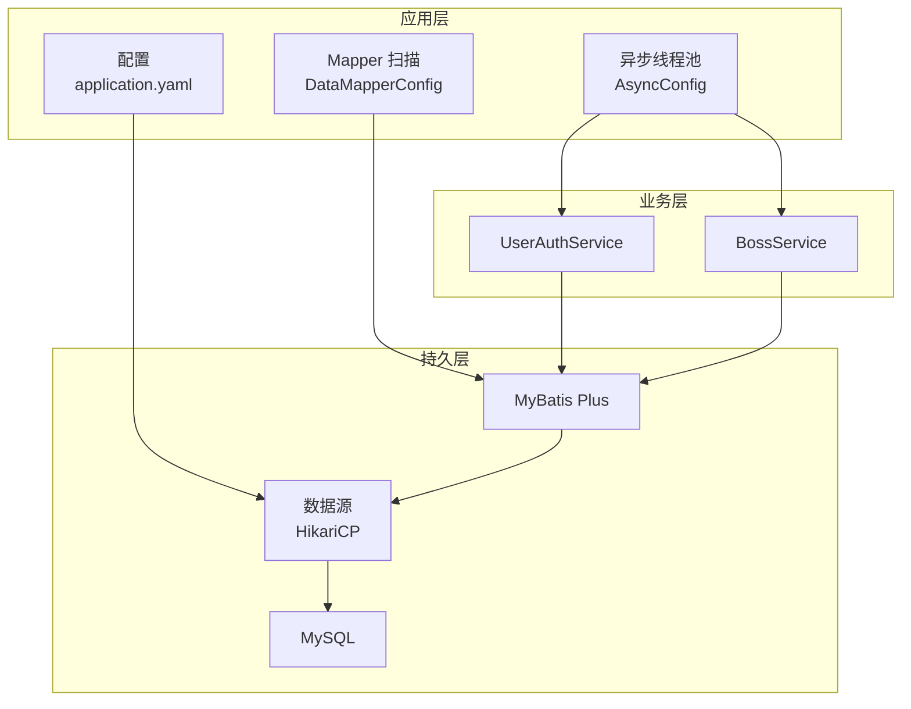
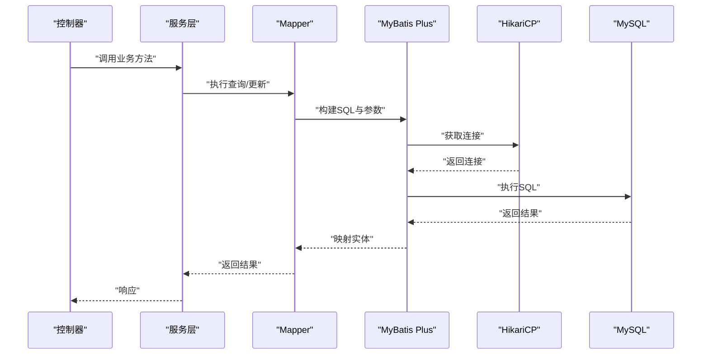
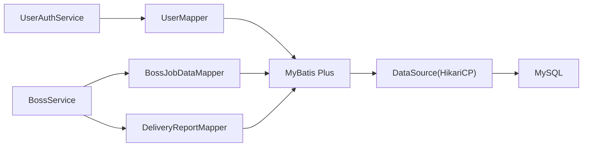

# 性能优化策略

<cite>
**本文引用的文件**
- [application.yaml](file://backend/src/main/resources/application.yaml)
- [DataMapperConfig.java](file://backend/src/main/java/com/getjobs/application/config/DataMapperConfig.java)
- [AsyncConfig.java](file://backend/src/main/java/com/getjobs/application/config/AsyncConfig.java)
- [UserMapper.java](file://backend/src/main/java/com/getjobs/application/mapper/UserMapper.java)
- [BossJobDataMapper.java](file://backend/src/main/java/com/getjobs/application/mapper/BossJobDataMapper.java)
- [DeliveryReportMapper.java](file://backend/src/main/java/com/getjobs/application/mapper/DeliveryReportMapper.java)
- [UserAuthService.java](file://backend/src/main/java/com/getjobs/application/service/UserAuthService.java)
- [BossService.java](file://backend/src/main/java/com/getjobs/application/service/BossService.java)
</cite>

## 目录
1. [简介](#简介)
2. [项目结构](#项目结构)
3. [核心组件](#核心组件)
4. [架构总览](#架构总览)
5. [详细组件分析](#详细组件分析)
6. [依赖分析](#依赖分析)
7. [性能考量](#性能考量)
8. [故障排查指南](#故障排查指南)
9. [结论](#结论)
10. [附录](#附录)

## 简介
本文件面向数据库性能工程师与高级开发者，围绕 GetJobs 项目的数据库性能优化展开系统化技术文档。内容涵盖查询优化、索引设计、缓存机制、连接池与事务管理、并发控制、慢查询分析、执行计划优化、数据库参数调优、MyBatis Plus 性能优化（批量操作、预编译语句、结果集映射）、数据库监控与瓶颈定位、读写分离与分库分表、分布式事务策略，以及不同数据库引擎的性能特点与适用场景。

## 项目结构
后端采用 Spring Boot + MyBatis Plus 架构，数据库通过 HikariCP 连接池连接 MySQL。配置集中在 application.yaml 中，MyBatis Plus Mapper 扫描通过 DataMapperConfig 完成，异步任务线程池通过 AsyncConfig 配置。业务层服务通过 Mapper 访问数据库，部分统计分析使用原生 SQL 直连数据源。

**图示来源**
- [application.yaml:13-26](file://backend/src/main/resources/application.yaml#L13-L26)
- [DataMapperConfig.java:10-12](file://backend/src/main/java/com/getjobs/application/config/DataMapperConfig.java#L10-L12)
- [AsyncConfig.java:24-54](file://backend/src/main/java/com/getjobs/application/config/AsyncConfig.java#L24-L54)

**章节来源**
- [application.yaml:13-62](file://backend/src/main/resources/application.yaml#L13-L62)
- [DataMapperConfig.java:10-12](file://backend/src/main/java/com/getjobs/application/config/DataMapperConfig.java#L10-L12)
- [AsyncConfig.java:24-54](file://backend/src/main/java/com/getjobs/application/config/AsyncConfig.java#L24-L54)

## 核心组件
- 数据源与连接池：HikariCP，最大池大小、空闲超时、最大生存时间等参数在 application.yaml 中集中配置。
- MyBatis Plus：开启下划线转驼峰映射，扫描 mapper 包，全局 ID 自增策略。
- Mapper 层：通过注解定义简单查询，复用通用 BaseMapper 的批量与条件构造能力。
- 服务层：UserAuthService 执行事务边界内的多表写入；BossService 在统计分析中使用原生 SQL 与数据源直连。

**章节来源**
- [application.yaml:13-62](file://backend/src/main/resources/application.yaml#L13-L62)
- [UserAuthService.java:49-113](file://backend/src/main/java/com/getjobs/application/service/UserAuthService.java#L49-L113)
- [BossService.java:696-794](file://backend/src/main/java/com/getjobs/application/service/BossService.java#L696-L794)

## 架构总览
GetJobs 的数据库访问路径为：Controller → Service → Mapper → MyBatis Plus → HikariCP → MySQL。统计分析模块在 BossService 中通过 javax.sql.DataSource 直接获取连接执行原生 SQL，以降低 ORM 开销并提升复杂聚合查询效率。

**图示来源**
- [UserAuthService.java:122-168](file://backend/src/main/java/com/getjobs/application/service/UserAuthService.java#L122-L168)
- [UserMapper.java:18-33](file://backend/src/main/java/com/getjobs/application/mapper/UserMapper.java#L18-L33)
- [application.yaml:13-26](file://backend/src/main/resources/application.yaml#L13-L26)

## 详细组件分析

### 数据库连接池与配置
- 连接池参数：最大池大小、空闲超时、最大生存时间、测试查询等在 application.yaml 的 hikari 节点中配置，直接影响并发连接利用率与资源占用。
- 密码加密：数据库密码采用 ENC(...) 包裹，结合 Jasypt 配置进行解密，确保生产环境敏感信息安全。
- 日志与滚动策略：日志级别、输出格式、文件滚动策略在 application.yaml 中配置，便于性能问题定位与审计。

优化建议
- 根据 QPS 与平均事务持续时间估算并发连接需求，逐步调优 maximum-pool-size。
- 合理设置 idle-timeout 与 max-lifetime，避免连接泄漏与频繁重建。
- 对慢查询与高并发场景，考虑启用连接池监控指标（如 HikariCP Metrics）。

**章节来源**
- [application.yaml:13-26](file://backend/src/main/resources/application.yaml#L13-L26)
- [application.yaml:28-35](file://backend/src/main/resources/application.yaml#L28-L35)
- [application.yaml:42-52](file://backend/src/main/resources/application.yaml#L42-L52)

### MyBatis Plus 配置与优化
- Mapper 扫描：通过 @MapperScan("com.getjobs.application.mapper") 自动注册 Mapper 接口。
- 映射策略：开启 map-underscore-to-camel-case，减少字段命名不一致带来的映射成本。
- 全局配置：ID 类型自增，简化主键生成策略。
- Mapper 定义：UserMapper 使用注解定义简单查询，BossJobDataMapper、DeliveryReportMapper 继承 BaseMapper，复用批量与条件构造能力。

优化建议
- 批量操作：使用 BaseMapper 的 insertBatchSomeRecords/updateBatchById 等方法，减少网络往返与解析开销。
- 预编译语句：MyBatis Plus 默认使用 PreparedStatement，避免 SQL 注入同时提升执行效率。
- 结果集映射：保持实体字段与数据库一致命名风格，必要时使用 @TableName/@TableField 指定映射，减少反射成本。

**章节来源**
- [DataMapperConfig.java:10-12](file://backend/src/main/java/com/getjobs/application/config/DataMapperConfig.java#L10-L12)
- [application.yaml:54-61](file://backend/src/main/resources/application.yaml#L54-L61)
- [UserMapper.java:12-33](file://backend/src/main/java/com/getjobs/application/mapper/UserMapper.java#L12-L33)
- [BossJobDataMapper.java:7-9](file://backend/src/main/java/com/getjobs/application/mapper/BossJobDataMapper.java#L7-L9)
- [DeliveryReportMapper.java:10-12](file://backend/src/main/java/com/getjobs/application/mapper/DeliveryReportMapper.java#L10-L12)

### 事务管理与并发控制
- 事务边界：UserAuthService.register 与 updateUserProfile、changePassword 使用 @Transactional，保证注册与更新的原子性。
- 并发冲突：注册流程对用户名/邮箱/手机号进行唯一性校验，避免重复写入引发的锁竞争与回滚。
- 异步执行：AsyncConfig 提供独立线程池，隔离耗时任务，降低对数据库连接池的压力。

优化建议
- 将幂等性检查前置到单次请求内，减少跨事务重试。
- 对热点写入（如用户资料更新）采用乐观锁版本号或行级锁策略。
- 异步任务队列容量与拒绝策略需与数据库写入能力匹配，防止堆积导致内存压力。

**章节来源**
- [UserAuthService.java:49-113](file://backend/src/main/java/com/getjobs/application/service/UserAuthService.java#L49-L113)
- [UserAuthService.java:249-273](file://backend/src/main/java/com/getjobs/application/service/UserAuthService.java#L249-L273)
- [UserAuthService.java:283-309](file://backend/src/main/java/com/getjobs/application/service/UserAuthService.java#L283-L309)
- [AsyncConfig.java:24-54](file://backend/src/main/java/com/getjobs/application/config/AsyncConfig.java#L24-L54)

### 查询优化与索引设计
- 简单查询：UserMapper 通过注解定义按用户名、邮箱、手机号查询，建议在对应列建立单列索引或复合索引（如 username/email/phone 的联合索引）。
- 条件查询：BossService 使用 QueryWrapper/LambdaQueryWrapper 构建条件，建议为常用过滤字段（如 encrypt_id、encrypt_user_id、delivery_status、created_at）建立合适索引。
- 复杂统计：BossService.getBossStats 使用原生 SQL 进行分组聚合，建议为分组字段与过滤字段建立复合索引，避免全表扫描。

优化建议
- 使用 EXPLAIN 分析关键 SQL 的执行计划，关注 key、rows、Extra 字段。
- 避免 SELECT *，仅查询必要字段，减少网络与解析开销。
- 对高频过滤字段建立覆盖索引，减少回表。

**章节来源**
- [UserMapper.java:18-33](file://backend/src/main/java/com/getjobs/application/mapper/UserMapper.java#L18-L33)
- [BossService.java:101-130](file://backend/src/main/java/com/getjobs/application/service/BossService.java#L101-L130)
- [BossService.java:627-647](file://backend/src/main/java/com/getjobs/application/service/BossService.java#L627-L647)
- [BossService.java:696-794](file://backend/src/main/java/com/getjobs/application/service/BossService.java#L696-L794)

### 缓存机制
- 应用层缓存：可引入 Redis 缓存热点数据（如用户基本信息、配置项、黑名单），降低数据库读压力。
- MyBatis 二级缓存：在需要的 Mapper 上启用二级缓存，注意缓存失效策略与一致性。
- 页面与静态资源：前端与静态资源由 Next.js 管理，减少后端压力。

优化建议
- 对读多写少的数据采用 LRU 或 TTL 策略，定期淘汰过期数据。
- 写操作先更新数据库，再删除缓存，避免脏读。

**章节来源**
- [application.yaml:13-26](file://backend/src/main/resources/application.yaml#L13-L26)

### 慢查询分析与执行计划优化
- 慢查询采集：开启 MySQL 慢查询日志，设置 long_query_time 与 slow_query_log_file，定期分析。
- 执行计划：使用 EXPLAIN/EXPLAIN ANALYZE 分析 SQL，关注索引使用、扫描行数与临时表。
- 参数调优：根据业务特征调整 innodb_buffer_pool_size、innodb_log_file_size、sort_buffer_size 等参数。

优化建议
- 对聚合查询（如 BossService.getBossStats）拆分维度，使用物化视图或汇总表。
- 减少隐式转换与函数包裹在索引列上。

**章节来源**
- [BossService.java:696-794](file://backend/src/main/java/com/getjobs/application/service/BossService.java#L696-L794)

### 数据库参数调优
- 连接参数：根据连接池配置与实例规格设置 max_connections、wait_timeout、interactive_timeout。
- 存储引擎：InnoDB 支持行级锁与外键，适用于高并发写入；MyISAM 适用于只读场景。
- 日志与备份：合理设置 binlog、redo log 与归档策略，平衡一致性与性能。

优化建议
- 通过压测确定最佳 buffer pool 与日志大小。
- 对长事务与死锁进行监控与告警。

**章节来源**
- [application.yaml:13-26](file://backend/src/main/resources/application.yaml#L13-L26)

### 读写分离、分库分表与分布式事务
- 读写分离：主库写入，从库读取；通过路由规则将查询分散至只读副本，降低主库压力。
- 分库分表：按用户 ID 或时间维度水平切分，结合一致性哈希或范围路由；对跨分片查询使用中间件或应用层合并。
- 分布式事务：强一致场景采用 TCC/ saga；最终一致场景使用消息队列补偿。

优化建议
- 评估写放大与跨分片 Join 成本，优先单表写入与就近查询。
- 对分布式事务采用本地消息表或可靠消息服务，确保一致性。

**章节来源**
- [application.yaml:13-26](file://backend/src/main/resources/application.yaml#L13-L26)

### 不同数据库引擎的性能特点与适用场景
- InnoDB：默认引擎，支持事务、行级锁、外键，适合高并发写入与强一致场景。
- MyISAM：不支持事务与行级锁，适合只读或报表场景。
- Memory：内存引擎，速度最快但易丢失，适合临时表与中间结果。

优化建议
- 写多读少：优先 InnoDB；报表类查询可考虑冷数据迁移至归档库。

**章节来源**
- [application.yaml:13-26](file://backend/src/main/resources/application.yaml#L13-L26)

## 依赖分析
- 组件耦合：服务层依赖多个 Mapper，Mapper 依赖 MyBatis Plus 与 HikariCP；BossService 通过 DataSource 直连数据库执行统计。
- 外部依赖：MySQL 驱动、HikariCP、MyBatis Plus、Jasypt 加密。

**图示来源**
- [UserAuthService.java:30-34](file://backend/src/main/java/com/getjobs/application/service/UserAuthService.java#L30-L34)
- [BossService.java:31-36](file://backend/src/main/java/com/getjobs/application/service/BossService.java#L31-L36)
- [UserMapper.java:3-6](file://backend/src/main/java/com/getjobs/application/mapper/UserMapper.java#L3-L6)
- [BossJobDataMapper.java:3-5](file://backend/src/main/java/com/getjobs/application/mapper/BossJobDataMapper.java#L3-L5)
- [DeliveryReportMapper.java:3-5](file://backend/src/main/java/com/getjobs/application/mapper/DeliveryReportMapper.java#L3-L5)

**章节来源**
- [UserAuthService.java:30-34](file://backend/src/main/java/com/getjobs/application/service/UserAuthService.java#L30-L34)
- [BossService.java:31-36](file://backend/src/main/java/com/getjobs/application/service/BossService.java#L31-L36)

## 性能考量
- 连接池：根据峰值并发与平均事务时长设定最大池大小，避免过度扩容导致 GC 压力。
- 查询：优先使用索引覆盖与条件下推，减少排序与临时表。
- 批量：使用批量插入/更新，降低网络往返。
- 缓存：热点数据缓存，写后失效，避免脏读。
- 监控：埋点慢查询、连接池等待时间、事务失败率与错误堆栈。

[本节为通用指导，无需列出具体文件来源]

## 故障排查指南
- 连接池耗尽：检查 maximum-pool-size 与事务持续时间，观察连接等待与拒绝策略。
- 慢查询：定位慢 SQL，分析执行计划，补充索引或改写查询。
- 事务冲突：检查锁等待与死锁日志，缩短事务、降低锁粒度。
- 加密配置：确认 Jasypt 密钥来源（环境变量/JVM 参数/配置文件），避免启动失败。

**章节来源**
- [application.yaml:13-26](file://backend/src/main/resources/application.yaml#L13-L26)
- [application.yaml:28-35](file://backend/src/main/resources/application.yaml#L28-L35)
- [UserAuthService.java:49-113](file://backend/src/main/java/com/getjobs/application/service/UserAuthService.java#L49-L113)

## 结论
通过合理的连接池配置、查询与索引优化、缓存策略、事务与并发控制、慢查询与执行计划分析，以及针对业务场景的读写分离与分库分表规划，可显著提升 GetJobs 的数据库性能与稳定性。建议在生产环境中持续监控关键指标，结合压测与灰度发布迭代优化。

[本节为总结性内容，无需列出具体文件来源]

## 附录
- 关键 SQL 与索引建议
  - 用户查询：username/email/phone 建立联合索引或单列索引，避免全表扫描。
  - BossJobData：encrypt_id、encrypt_user_id、delivery_status 建立复合索引，加速去重与状态统计。
  - 统计分析：按 group by 字段建立覆盖索引，减少回表与临时表。

**章节来源**
- [UserMapper.java:18-33](file://backend/src/main/java/com/getjobs/application/mapper/UserMapper.java#L18-L33)
- [BossService.java:627-647](file://backend/src/main/java/com/getjobs/application/service/BossService.java#L627-L647)
- [BossService.java:696-794](file://backend/src/main/java/com/getjobs/application/service/BossService.java#L696-L794)