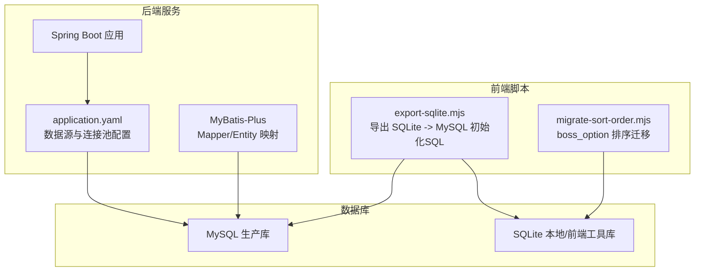
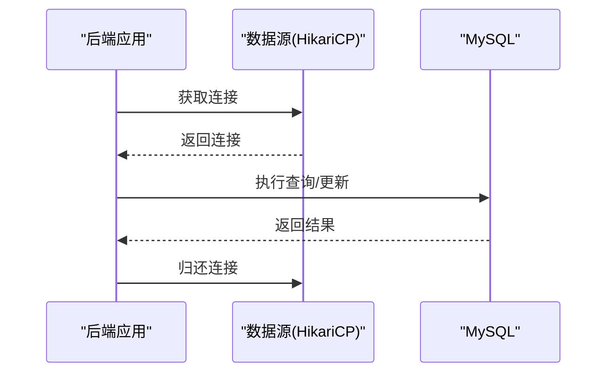
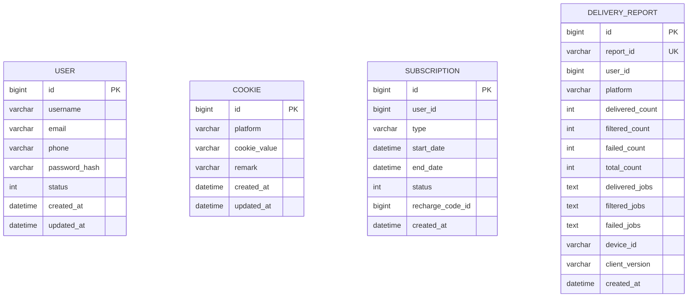
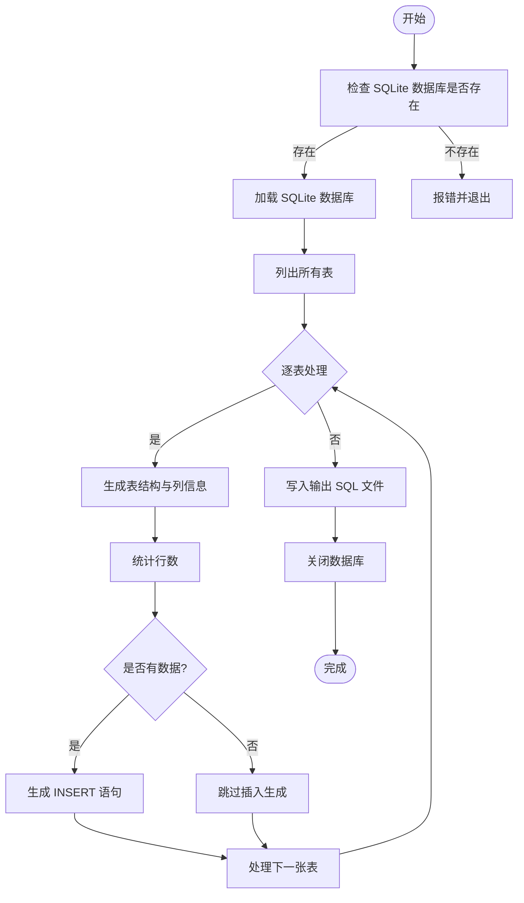
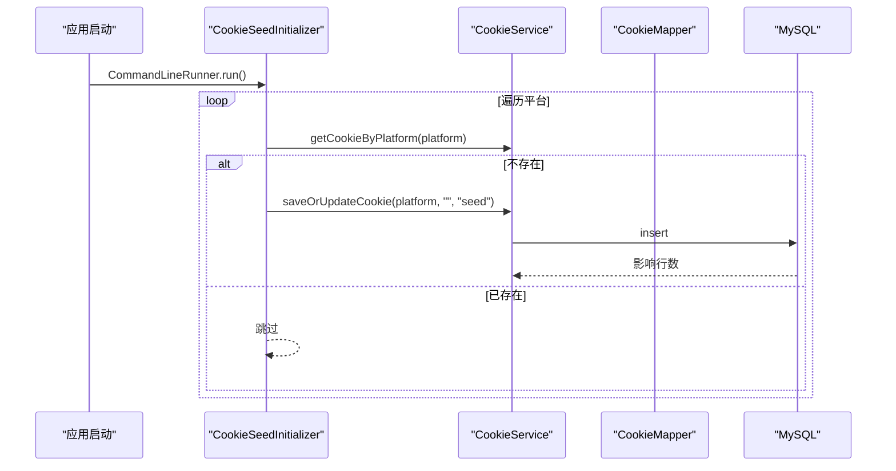
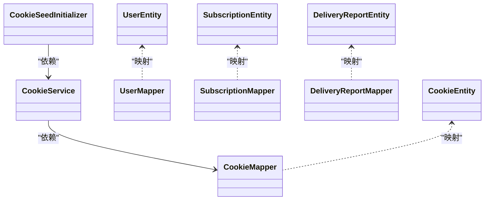

# 数据库架构

<cite>
**本文引用的文件**
- [application.yaml](file://backend/src/main/resources/application.yaml)
- [application.yaml.template](file://scripts/application.yaml.template)
- [001_create_delivery_report.sql](file://scripts/migration/001_create_delivery_report.sql)
- [CookieEntity.java](file://backend/src/main/java/com/getjobs/application/entity/CookieEntity.java)
- [UserEntity.java](file://backend/src/main/java/com/getjobs/application/entity/UserEntity.java)
- [SubscriptionEntity.java](file://backend/src/main/java/com/getjobs/application/entity/SubscriptionEntity.java)
- [DeliveryReportEntity.java](file://backend/src/main/java/com/getjobs/application/entity/DeliveryReportEntity.java)
- [CookieMapper.java](file://backend/src/main/java/com/getjobs/application/mapper/CookieMapper.java)
- [UserMapper.java](file://backend/src/main/java/com/getjobs/application/mapper/UserMapper.java)
- [SubscriptionMapper.java](file://backend/src/main/java/com/getjobs/application/mapper/SubscriptionMapper.java)
- [DeliveryReportMapper.java](file://backend/src/main/java/com/getjobs/application/mapper/DeliveryReportMapper.java)
- [CookieService.java](file://backend/src/main/java/com/getjobs/application/service/CookieService.java)
- [CookieSeedInitializer.java](file://backend/src/main/java/com/getjobs/application/init/CookieSeedInitializer.java)
- [BossService.java](file://backend/src/main/java/com/getjobs/application/service/BossService.java)
- [export-sqlite.mjs](file://front/scripts/export-sqlite.mjs)
- [migrate-sort-order.mjs](file://front/scripts/migrate-sort-order.mjs)
</cite>

## 目录
1. [简介](#简介)
2. [项目结构](#项目结构)
3. [核心组件](#核心组件)
4. [架构总览](#架构总览)
5. [详细组件分析](#详细组件分析)
6. [依赖分析](#依赖分析)
7. [性能考虑](#性能考虑)
8. [故障排查指南](#故障排查指南)
9. [结论](#结论)
10. [附录](#附录)

## 简介
本文件面向数据库管理员与系统架构师，系统化梳理 GetJobs 的数据库架构与实现细节。项目采用“MySQL + SQLite 双数据库”策略：后端服务通过 Spring Boot 连接 MySQL 作为生产数据库，前端工具链与本地开发环境使用 SQLite 存储静态配置与选项数据。本文将从整体架构、核心表结构、索引与查询优化、迁移与版本管理、连接池与事务、并发控制、备份与监控到不同数据库引擎的使用场景与性能差异等方面进行全面说明。

## 项目结构
- 后端服务使用 Spring Boot + MyBatis-Plus，通过 application.yaml 配置 MySQL 连接与 HikariCP 连接池参数。
- 前端脚本包含 SQLite 数据导出与迁移工具，支持将 SQLite 数据转换为 MySQL 初始化脚本，以及对 boss_option 表的排序字段迁移。
- 实体与 Mapper 层定义了用户、Cookie、订阅、投递报告等核心业务表的映射与查询方法。

图表来源
- [application.yaml:13-22](file://backend/src/main/resources/application.yaml#L13-L22)
- [export-sqlite.mjs:10-133](file://front/scripts/export-sqlite.mjs#L10-L133)
- [migrate-sort-order.mjs:12-92](file://front/scripts/migrate-sort-order.mjs#L12-L92)

章节来源
- [application.yaml:1-91](file://backend/src/main/resources/application.yaml#L1-L91)
- [application.yaml.template:1-45](file://scripts/application.yaml.template#L1-L45)
- [export-sqlite.mjs:10-133](file://front/scripts/export-sqlite.mjs#L10-L133)
- [migrate-sort-order.mjs:12-92](file://front/scripts/migrate-sort-order.mjs#L12-L92)

## 核心组件
- 数据源与连接池：后端通过 HikariCP 提供高性能连接池，默认最大连接数、空闲超时与生命周期在配置中明确。
- ORM 映射：MyBatis-Plus 自动映射实体与表，驼峰命名自动转换，Mapper 接口提供基础 CRUD 与自定义查询。
- 业务实体：用户、Cookie、订阅、投递报告等核心模型定义清晰，字段覆盖业务关键维度。
- 初始化与迁移：应用启动时为各平台创建 Cookie 种子记录；SQLite 工具负责导出与迁移。

章节来源
- [application.yaml:13-22](file://backend/src/main/resources/application.yaml#L13-L22)
- [application.yaml.template:14-41](file://scripts/application.yaml.template#L14-L41)
- [UserEntity.java:14-40](file://backend/src/main/java/com/getjobs/application/entity/UserEntity.java#L14-L40)
- [CookieEntity.java:15-53](file://backend/src/main/java/com/getjobs/application/entity/CookieEntity.java#L15-L53)
- [SubscriptionEntity.java:14-40](file://backend/src/main/java/com/getjobs/application/entity/SubscriptionEntity.java#L14-L40)
- [DeliveryReportEntity.java:15-59](file://backend/src/main/java/com/getjobs/application/entity/DeliveryReportEntity.java#L15-L59)
- [UserMapper.java:12-34](file://backend/src/main/java/com/getjobs/application/mapper/UserMapper.java#L12-L34)
- [CookieMapper.java:9-10](file://backend/src/main/java/com/getjobs/application/mapper/CookieMapper.java#L9-L10)
- [SubscriptionMapper.java:15-41](file://backend/src/main/java/com/getjobs/application/mapper/SubscriptionMapper.java#L15-L41)
- [DeliveryReportMapper.java:10-11](file://backend/src/main/java/com/getjobs/application/mapper/DeliveryReportMapper.java#L10-L11)
- [CookieSeedInitializer.java:16-46](file://backend/src/main/java/com/getjobs/application/init/CookieSeedInitializer.java#L16-L46)
- [CookieService.java:16-96](file://backend/src/main/java/com/getjobs/application/service/CookieService.java#L16-L96)

## 架构总览
后端服务通过 HikariCP 连接 MySQL，ORM 层负责实体与表的映射及查询。前端工具链负责 SQLite 数据的导出与迁移，确保本地/前端数据与生产库的一致性与可维护性。

图表来源
- [application.yaml:13-22](file://backend/src/main/resources/application.yaml#L13-L22)

## 详细组件分析

### 数据库连接与连接池
- 连接池参数：最大连接数、空闲超时、最大生命周期、连接测试查询等均在配置中明确，便于在高并发场景下稳定运行。
- 配置来源：生产配置与模板配置分别位于资源目录与脚本模板中，便于部署与本地开发区分。

章节来源
- [application.yaml:13-22](file://backend/src/main/resources/application.yaml#L13-L22)
- [application.yaml.template:14-41](file://scripts/application.yaml.template#L14-L41)

### 核心表结构与设计原则
- 用户表（user）：存储用户名、邮箱、手机号、密码哈希、状态与时间戳，支持按邮箱/手机快速检索。
- Cookie 表（cookie）：按平台分组存储 Cookie 值与备注，支持按平台查询最新记录。
- 订阅表（subscription）：记录用户订阅类型、起止时间、状态与关联充值码，支持查询有效订阅与历史记录。
- 投递报告表（delivery_report）：记录客户端上报的投递统计与明细（JSON 字段），包含唯一报告 ID 与多维索引。

图表来源
- [UserEntity.java:14-40](file://backend/src/main/java/com/getjobs/application/entity/UserEntity.java#L14-L40)
- [CookieEntity.java:15-53](file://backend/src/main/java/com/getjobs/application/entity/CookieEntity.java#L15-L53)
- [SubscriptionEntity.java:14-40](file://backend/src/main/java/com/getjobs/application/entity/SubscriptionEntity.java#L14-L40)
- [DeliveryReportEntity.java:15-59](file://backend/src/main/java/com/getjobs/application/entity/DeliveryReportEntity.java#L15-L59)
- [001_create_delivery_report.sql:4-24](file://scripts/migration/001_create_delivery_report.sql#L4-L24)

章节来源
- [UserEntity.java:14-40](file://backend/src/main/java/com/getjobs/application/entity/UserEntity.java#L14-L40)
- [CookieEntity.java:15-53](file://backend/src/main/java/com/getjobs/application/entity/CookieEntity.java#L15-L53)
- [SubscriptionEntity.java:14-40](file://backend/src/main/java/com/getjobs/application/entity/SubscriptionEntity.java#L14-L40)
- [DeliveryReportEntity.java:15-59](file://backend/src/main/java/com/getjobs/application/entity/DeliveryReportEntity.java#L15-L59)
- [001_create_delivery_report.sql:4-24](file://scripts/migration/001_create_delivery_report.sql#L4-L24)

### 索引策略与查询优化
- delivery_report 表：
  - 唯一索引：report_id，保证报告去重。
  - 普通索引：user_id、platform、created_at，支撑按用户、平台与时间范围的查询。
- subscription 表：
  - 通过 Mapper 提供按用户与状态的查询，建议在 user_id、status、end_date 上建立复合索引以提升有效性判断效率。
- cookie 表：
  - 建议在 platform 上建立索引，支撑按平台查询最新记录。
- user 表：
  - Mapper 提供按邮箱/手机查询，建议在 email、phone 上建立索引以提升登录/注册查询性能。

章节来源
- [001_create_delivery_report.sql:20-23](file://scripts/migration/001_create_delivery_report.sql#L20-L23)
- [SubscriptionMapper.java:21-28](file://backend/src/main/java/com/getjobs/application/mapper/SubscriptionMapper.java#L21-L28)
- [CookieMapper.java:9-10](file://backend/src/main/java/com/getjobs/application/mapper/CookieMapper.java#L9-L10)
- [UserMapper.java:26-33](file://backend/src/main/java/com/getjobs/application/mapper/UserMapper.java#L26-L33)

### 数据迁移机制与版本管理
- 迁移脚本命名规范：scripts/migration 下以数字序号开头的 SQL 文件，如 001_create_delivery_report.sql，表示迁移顺序。
- 执行顺序：按文件名自然排序依次执行，确保表结构演进的确定性。
- SQLite 导出与迁移：
  - export-sqlite.mjs：从 SQLite 读取表结构与数据，生成 MySQL 初始化 SQL，便于将本地数据导入生产库。
  - migrate-sort-order.mjs：为 boss_option 表添加 sort_order 字段并设置城市显示顺序，完成后持久化回 SQLite 文件。

图表来源
- [export-sqlite.mjs:10-133](file://front/scripts/export-sqlite.mjs#L10-L133)

章节来源
- [001_create_delivery_report.sql:1-29](file://scripts/migration/001_create_delivery_report.sql#L1-L29)
- [export-sqlite.mjs:10-133](file://front/scripts/export-sqlite.mjs#L10-L133)
- [migrate-sort-order.mjs:12-92](file://front/scripts/migrate-sort-order.mjs#L12-L92)

### 事务管理与并发控制
- 事务管理：后端基于 Spring 声明式事务与 MyBatis-Plus 的 Mapper 操作，结合 HikariCP 连接池实现高并发下的连接复用与隔离。
- 并发控制：通过连接池的最大连接数与空闲超时限制并发峰值；业务层使用乐观锁字段（如更新时间）保障更新一致性。
- SQLite 特殊处理：BossService 在 SQLite 场景下执行列顺序校验与 VACUUM 优化，确保数据页整理与 WAL 切换。

章节来源
- [application.yaml:18-22](file://backend/src/main/resources/application.yaml#L18-L22)
- [BossService.java:538-569](file://backend/src/main/java/com/getjobs/application/service/BossService.java#L538-L569)
- [BossService.java:1038-1063](file://backend/src/main/java/com/getjobs/application/service/BossService.java#L1038-L1063)

### Cookie 种子初始化与平台一致性
- CookieSeedInitializer 在应用启动时为 boss、liepin、51job、zhilian 四个平台创建“种子记录”，确保后续保存操作总是更新同一记录，避免“无记录无法更新”的边界问题。
- CookieService 提供按平台查询、保存/更新、清空、删除与全量查询能力，配合种子初始化形成稳定的 Cookie 生命周期管理。

图表来源
- [CookieSeedInitializer.java:27-45](file://backend/src/main/java/com/getjobs/application/init/CookieSeedInitializer.java#L27-L45)
- [CookieService.java:27-61](file://backend/src/main/java/com/getjobs/application/service/CookieService.java#L27-L61)
- [CookieMapper.java:9-10](file://backend/src/main/java/com/getjobs/application/mapper/CookieMapper.java#L9-L10)

章节来源
- [CookieSeedInitializer.java:16-46](file://backend/src/main/java/com/getjobs/application/init/CookieSeedInitializer.java#L16-L46)
- [CookieService.java:16-96](file://backend/src/main/java/com/getjobs/application/service/CookieService.java#L16-L96)

### 投递报告与客户端统计
- delivery_report 表用于记录客户端上报的投递统计与明细（JSON 字段），包含报告 ID、用户 ID、平台、设备 ID、客户端版本与时间戳。
- 建议对 report_id 建立唯一索引，对 user_id、platform、created_at 建立普通索引，支撑高频查询与去重。

章节来源
- [DeliveryReportEntity.java:15-59](file://backend/src/main/java/com/getjobs/application/entity/DeliveryReportEntity.java#L15-L59)
- [001_create_delivery_report.sql:4-24](file://scripts/migration/001_create_delivery_report.sql#L4-L24)

## 依赖分析
- 实体与 Mapper：各实体通过 MyBatis-Plus 注解映射到对应表，Mapper 接口继承 BaseMapper，获得通用 CRUD 能力。
- 业务服务：CookieService、SubscriptionMapper 等通过 Mapper 访问数据库，提供业务级查询与更新。
- 初始化器：CookieSeedInitializer 在启动阶段确保 Cookie 种子记录存在，降低后续业务异常风险。

图表来源
- [UserEntity.java:14-40](file://backend/src/main/java/com/getjobs/application/entity/UserEntity.java#L14-L40)
- [CookieEntity.java:15-53](file://backend/src/main/java/com/getjobs/application/entity/CookieEntity.java#L15-L53)
- [SubscriptionEntity.java:14-40](file://backend/src/main/java/com/getjobs/application/entity/SubscriptionEntity.java#L14-L40)
- [DeliveryReportEntity.java:15-59](file://backend/src/main/java/com/getjobs/application/entity/DeliveryReportEntity.java#L15-L59)
- [UserMapper.java:12-34](file://backend/src/main/java/com/getjobs/application/mapper/UserMapper.java#L12-L34)
- [CookieMapper.java:9-10](file://backend/src/main/java/com/getjobs/application/mapper/CookieMapper.java#L9-L10)
- [SubscriptionMapper.java:15-41](file://backend/src/main/java/com/getjobs/application/mapper/SubscriptionMapper.java#L15-L41)
- [DeliveryReportMapper.java:10-11](file://backend/src/main/java/com/getjobs/application/mapper/DeliveryReportMapper.java#L10-L11)
- [CookieService.java:16-96](file://backend/src/main/java/com/getjobs/application/service/CookieService.java#L16-L96)
- [CookieSeedInitializer.java:16-46](file://backend/src/main/java/com/getjobs/application/init/CookieSeedInitializer.java#L16-L46)

章节来源
- [UserMapper.java:12-34](file://backend/src/main/java/com/getjobs/application/mapper/UserMapper.java#L12-L34)
- [CookieMapper.java:9-10](file://backend/src/main/java/com/getjobs/application/mapper/CookieMapper.java#L9-L10)
- [SubscriptionMapper.java:15-41](file://backend/src/main/java/com/getjobs/application/mapper/SubscriptionMapper.java#L15-L41)
- [DeliveryReportMapper.java:10-11](file://backend/src/main/java/com/getjobs/application/mapper/DeliveryReportMapper.java#L10-L11)
- [CookieService.java:16-96](file://backend/src/main/java/com/getjobs/application/service/CookieService.java#L16-L96)
- [CookieSeedInitializer.java:16-46](file://backend/src/main/java/com/getjobs/application/init/CookieSeedInitializer.java#L16-L46)

## 性能考虑
- 连接池参数：根据业务并发峰值调整 maximum-pool-size，合理设置 idle-timeout 与 max-lifetime，避免连接泄漏与抖动。
- 索引设计：围绕高频查询字段建立合适索引，减少全表扫描；对 JSON 字段避免在查询中直接使用函数或模糊匹配。
- 查询优化：使用 Mapper 的条件构造器与原生 SQL 结合，尽量减少 N+1 查询；对大结果集分页查询。
- SQLite 优化：定期执行 VACUUM 与 WAL checkpoint，确保数据页整理与日志清理，提升查询稳定性。

章节来源
- [application.yaml:18-22](file://backend/src/main/resources/application.yaml#L18-L22)
- [001_create_delivery_report.sql:20-23](file://scripts/migration/001_create_delivery_report.sql#L20-L23)
- [BossService.java:1038-1063](file://backend/src/main/java/com/getjobs/application/service/BossService.java#L1038-L1063)

## 故障排查指南
- 连接失败：检查 MySQL 地址、端口、账号密码与网络连通性；确认 HikariCP 参数与防火墙策略。
- 初始化失败：查看 schema 初始化模式与脚本路径，确认脚本语法与字符集设置。
- 查询慢：检查索引覆盖与执行计划；对热点表进行分区或物化视图优化。
- SQLite 异常：确认 SQLite 文件权限与路径；执行 VACUUM 与 WAL checkpoint；必要时重建数据库文件。
- Cookie 种子问题：确认初始化器是否执行；检查平台标识一致性；验证 Cookie 表索引与更新逻辑。

章节来源
- [application.yaml:13-22](file://backend/src/main/resources/application.yaml#L13-L22)
- [application.yaml.template:33-41](file://scripts/application.yaml.template#L33-L41)
- [CookieSeedInitializer.java:27-45](file://backend/src/main/java/com/getjobs/application/init/CookieSeedInitializer.java#L27-L45)
- [BossService.java:1038-1063](file://backend/src/main/java/com/getjobs/application/service/BossService.java#L1038-L1063)

## 结论
GetJobs 的数据库架构以 MySQL 为核心生产库，结合 HikariCP 连接池与 MyBatis-Plus ORM，实现了稳定高效的业务访问。前端工具链提供了 SQLite 数据导出与迁移能力，保障本地与生产的协同一致性。通过合理的索引设计、事务与并发控制策略，以及定期的数据库维护，系统能够在高并发场景下保持良好性能与可靠性。

## 附录
- 配置文件位置与用途
  - 生产配置：backend/src/main/resources/application.yaml
  - 配置模板：scripts/application.yaml.template
- 迁移脚本位置与命名
  - scripts/migration/001_create_delivery_report.sql
- 前端脚本
  - 导出：front/scripts/export-sqlite.mjs
  - 迁移：front/scripts/migrate-sort-order.mjs