# 数据库设计

<cite>
**本文引用的文件**
- [application.yaml](file://backend/src/main/resources/application.yaml)
- [application.yaml.template](file://scripts/application.yaml.template)
- [UserEntity.java](file://backend/src/main/java/com/getjobs/application/entity/UserEntity.java)
- [CookieEntity.java](file://backend/src/main/java/com/getjobs/application/entity/CookieEntity.java)
- [DeliveryReportEntity.java](file://backend/src/main/java/com/getjobs/application/entity/DeliveryReportEntity.java)
- [BossJobDataEntity.java](file://backend/src/main/java/com/getjobs/application/entity/BossJobDataEntity.java)
- [ZhilianJobDataEntity.java](file://backend/src/main/java/com/getjobs/application/entity/ZhilianJobDataEntity.java)
- [LiepinEntity.java](file://backend/src/main/java/com/getjobs/application/entity/LiepinEntity.java)
- [Job51Entity.java](file://backend/src/main/java/com/getjobs/application/entity/Job51Entity.java)
- [DataMapperConfig.java](file://backend/src/main/java/com/getjobs/application/config/DataMapperConfig.java)
- [AsyncConfig.java](file://backend/src/main/java/com/getjobs/application/config/AsyncConfig.java)
- [001_create_delivery_report.sql](file://scripts/migration/001_create_delivery_report.sql)
- [export-sqlite.mjs](file://front/scripts/export-sqlite.mjs)
- [README_PACKAGE.txt](file://README_PACKAGE.txt)
</cite>

## 目录
1. [简介](#简介)
2. [项目结构](#项目结构)
3. [核心组件](#核心组件)
4. [架构总览](#架构总览)
5. [详细组件分析](#详细组件分析)
6. [依赖分析](#依赖分析)
7. [性能考虑](#性能考虑)
8. [故障排查指南](#故障排查指南)
9. [结论](#结论)
10. [附录](#附录)

## 简介
本文件面向数据库管理员与后端开发者，系统化梳理 GetJobs 项目的数据库设计与实现要点，涵盖核心数据模型、实体关系、连接池与事务、性能优化、迁移与升级、备份恢复与监控、MySQL 与 SQLite 的使用场景与配置差异，以及数据安全与隐私保护的实现路径。内容以代码与配置为依据，辅以图示帮助理解。

## 项目结构
后端采用 Spring Boot + MyBatis-Plus 架构，数据库配置集中在 application.yaml；实体类位于 application.entity 包中，Mapper 接口扫描通过 DataMapperConfig 配置；异步任务线程池在 AsyncConfig 中定义；迁移脚本位于 scripts/migration；SQLite 导出工具位于 front/scripts。

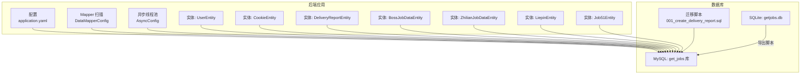

**图表来源**
- [application.yaml:13-22](file://backend/src/main/resources/application.yaml#L13-L22)
- [DataMapperConfig.java:10-12](file://backend/src/main/java/com/getjobs/application/config/DataMapperConfig.java#L10-L12)
- [AsyncConfig.java:24-54](file://backend/src/main/java/com/getjobs/application/config/AsyncConfig.java#L24-L54)
- [UserEntity.java:14-39](file://backend/src/main/java/com/getjobs/application/entity/UserEntity.java#L14-L39)
- [CookieEntity.java:15-52](file://backend/src/main/java/com/getjobs/application/entity/CookieEntity.java#L15-L52)
- [DeliveryReportEntity.java:15-58](file://backend/src/main/java/com/getjobs/application/entity/DeliveryReportEntity.java#L15-L58)
- [BossJobDataEntity.java:15-107](file://backend/src/main/java/com/getjobs/application/entity/BossJobDataEntity.java#L15-L107)
- [ZhilianJobDataEntity.java:15-63](file://backend/src/main/java/com/getjobs/application/entity/ZhilianJobDataEntity.java#L15-L63)
- [LiepinEntity.java:15-80](file://backend/src/main/java/com/getjobs/application/entity/LiepinEntity.java#L15-L80)
- [Job51Entity.java:15-75](file://backend/src/main/java/com/getjobs/application/entity/Job51Entity.java#L15-L75)
- [001_create_delivery_report.sql:4-24](file://scripts/migration/001_create_delivery_report.sql#L4-L24)
- [export-sqlite.mjs:10-133](file://front/scripts/export-sqlite.mjs#L10-L133)

**章节来源**
- [application.yaml:13-22](file://backend/src/main/resources/application.yaml#L13-L22)
- [DataMapperConfig.java:10-12](file://backend/src/main/java/com/getjobs/application/config/DataMapperConfig.java#L10-L12)
- [AsyncConfig.java:24-54](file://backend/src/main/java/com/getjobs/application/config/AsyncConfig.java#L24-L54)

## 核心组件
- 数据源与连接池
  - 数据源：MySQL，驱动为 com.mysql.cj.jdbc.Driver，HikariCP 连接池参数包括最大池大小、空闲超时、最大生命周期、连接测试查询等。
  - 参考路径：[application.yaml:13-22](file://backend/src/main/resources/application.yaml#L13-L22)
- MyBatis-Plus 配置
  - 开启下划线转驼峰映射，全局 ID 自增策略，Mapper 扫描路径。
  - 参考路径：[application.yaml:44-51](file://backend/src/main/resources/application.yaml#L44-L51)，[DataMapperConfig.java:10-12](file://backend/src/main/java/com/getjobs/application/config/DataMapperConfig.java#L10-L12)
- 异步任务线程池
  - 核心/最大线程数、队列容量、拒绝策略、优雅停机等待时间等。
  - 参考路径：[AsyncConfig.java:24-54](file://backend/src/main/java/com/getjobs/application/config/AsyncConfig.java#L24-L54)

**章节来源**
- [application.yaml:13-22](file://backend/src/main/resources/application.yaml#L13-L22)
- [application.yaml:44-51](file://backend/src/main/resources/application.yaml#L44-L51)
- [DataMapperConfig.java:10-12](file://backend/src/main/java/com/getjobs/application/config/DataMapperConfig.java#L10-L12)
- [AsyncConfig.java:24-54](file://backend/src/main/java/com/getjobs/application/config/AsyncConfig.java#L24-L54)

## 架构总览
GetJobs 的数据库层围绕 MySQL 展开，通过 HikariCP 提供连接池能力，MyBatis-Plus 负责 ORM 映射与 SQL 执行，实体类定义数据模型，迁移脚本负责表结构演进，SQLite 作为开发/测试辅助存储，导出脚本用于从 SQLite 生成 MySQL 初始化数据。

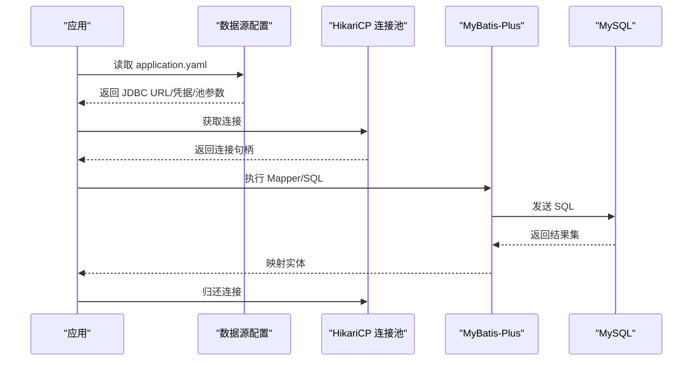

**图表来源**
- [application.yaml:13-22](file://backend/src/main/resources/application.yaml#L13-L22)
- [application.yaml:44-51](file://backend/src/main/resources/application.yaml#L44-L51)
- [DataMapperConfig.java:10-12](file://backend/src/main/java/com/getjobs/application/config/DataMapperConfig.java#L10-L12)

## 详细组件分析

### 用户实体 UserEntity
- 设计要点
  - 主键自增，包含用户名、邮箱、手机号、密码哈希、状态、创建/更新时间等字段。
  - 适用于用户认证与权限控制的基础数据。
- 关系与约束
  - 无外键约束，状态字段用于逻辑启用/禁用。
- 复杂度与性能
  - 建议对常用查询字段建立索引（如 username/email），避免全表扫描。
- 安全建议
  - 密码字段应仅存储哈希值，不落库明文；结合后端鉴权流程实现安全登录。

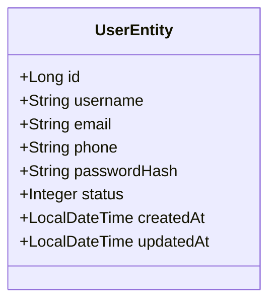

**图表来源**
- [UserEntity.java:14-39](file://backend/src/main/java/com/getjobs/application/entity/UserEntity.java#L14-L39)

**章节来源**
- [UserEntity.java:14-39](file://backend/src/main/java/com/getjobs/application/entity/UserEntity.java#L14-L39)

### Cookie 实体 CookieEntity
- 设计要点
  - 主键自增，记录平台名称、Cookie 值、备注、创建/更新时间。
  - 支持多平台（boss/zhilian/job51/liepin）统一管理。
- 关系与约束
  - 无外键，平台字段用于区分来源。
- 性能与安全
  - 建议按平台与创建时间建立索引；Cookie 值敏感，需加密存储与最小化暴露。

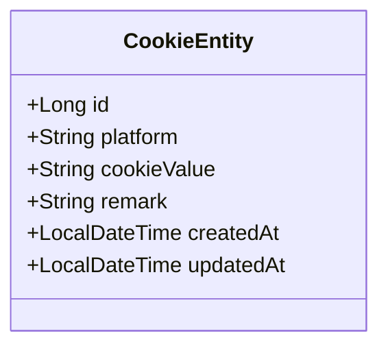

**图表来源**
- [CookieEntity.java:15-52](file://backend/src/main/java/com/getjobs/application/entity/CookieEntity.java#L15-L52)

**章节来源**
- [CookieEntity.java:15-52](file://backend/src/main/java/com/getjobs/application/entity/CookieEntity.java#L15-L52)

### 投递报告实体 DeliveryReportEntity
- 设计要点
  - 主键自增，报告 ID 唯一，记录用户、平台、各类统计计数、设备与客户端版本、创建时间。
  - JSON 字段用于存储成功/过滤/失败的职位详情，便于后续分析。
- 关系与约束
  - 与用户表存在逻辑关联（用户ID），迁移脚本为 boss_data 表新增关联字段。
- 性能与扩展
  - 建议为 report_id、user_id、platform、created_at 建立索引；JSON 字段不宜频繁更新，必要时拆分或归档。

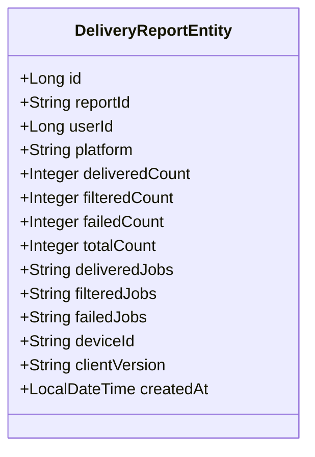

**图表来源**
- [DeliveryReportEntity.java:15-58](file://backend/src/main/java/com/getjobs/application/entity/DeliveryReportEntity.java#L15-L58)
- [001_create_delivery_report.sql:4-24](file://scripts/migration/001_create_delivery_report.sql#L4-L24)

**章节来源**
- [DeliveryReportEntity.java:15-58](file://backend/src/main/java/com/getjobs/application/entity/DeliveryReportEntity.java#L15-L58)
- [001_create_delivery_report.sql:4-24](file://scripts/migration/001_create_delivery_report.sql#L4-L24)

### Boss 直聘岗位数据实体 BossJobDataEntity
- 设计要点
  - 主键自增，包含加密岗位/用户 ID、公司名称、岗位名称、薪资、地点、经验、学历、HR 信息、投递状态、描述、链接、招聘状态、公司地址、行业、介绍、融资阶段、公司规模、创建/更新时间。
- 关系与约束
  - 与投递报告存在潜在关联（迁移脚本新增 report_id/client_id 字段）。
- 性能与分析
  - 建议对 encrypt_id、delivery_status、created_at 建立索引；高频查询字段可考虑冗余或物化视图。

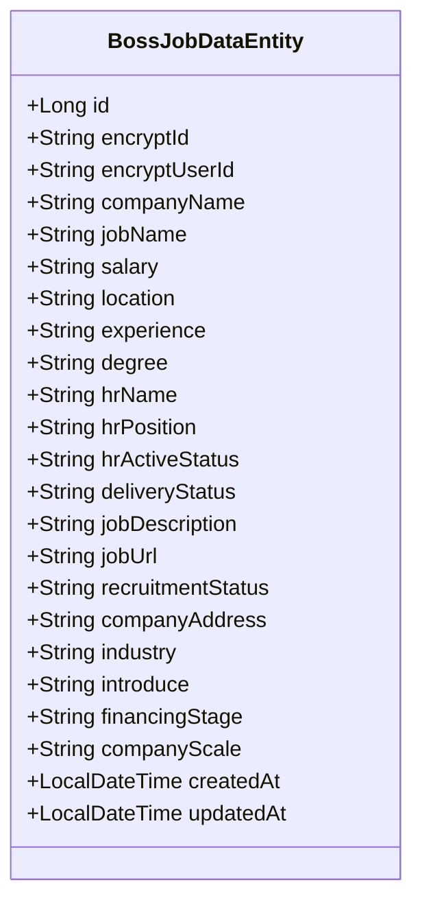

**图表来源**
- [BossJobDataEntity.java:15-107](file://backend/src/main/java/com/getjobs/application/entity/BossJobDataEntity.java#L15-L107)
- [001_create_delivery_report.sql:26-28](file://scripts/migration/001_create_delivery_report.sql#L26-L28)

**章节来源**
- [BossJobDataEntity.java:15-107](file://backend/src/main/java/com/getjobs/application/entity/BossJobDataEntity.java#L15-L107)
- [001_create_delivery_report.sql:26-28](file://scripts/migration/001_create_delivery_report.sql#L26-L28)

### 智联招聘岗位数据实体 ZhilianJobDataEntity
- 设计要点
  - 主键自增，岗位 ID、标题、链接、薪资、地点、经验、学历、公司名称、投递状态、创建/更新时间。
- 关系与约束
  - 与投递报告存在潜在关联（迁移脚本新增关联字段）。
- 性能与分析
  - 建议对 jobId、delivery_status、created_at 建立索引；JSON 字段避免频繁写入。

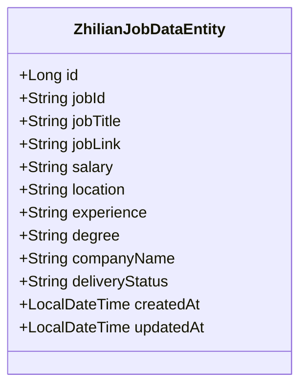

**图表来源**
- [ZhilianJobDataEntity.java:15-63](file://backend/src/main/java/com/getjobs/application/entity/ZhilianJobDataEntity.java#L15-L63)
- [001_create_delivery_report.sql:26-28](file://scripts/migration/001_create_delivery_report.sql#L26-L28)

**章节来源**
- [ZhilianJobDataEntity.java:15-63](file://backend/src/main/java/com/getjobs/application/entity/ZhilianJobDataEntity.java#L15-L63)
- [001_create_delivery_report.sql:26-28](file://scripts/migration/001_create_delivery_report.sql#L26-L28)

### 猎聘岗位数据实体 LiepinEntity
- 设计要点
  - 主键为 jobId，岗位/公司/HR 字段齐全，投递状态为整型布尔，创建/更新时间。
- 关系与约束
  - 与投递报告存在潜在关联（迁移脚本新增关联字段）。
- 性能与分析
  - 建议对 jobId、delivered、created_at 建立索引；避免大字段频繁更新。

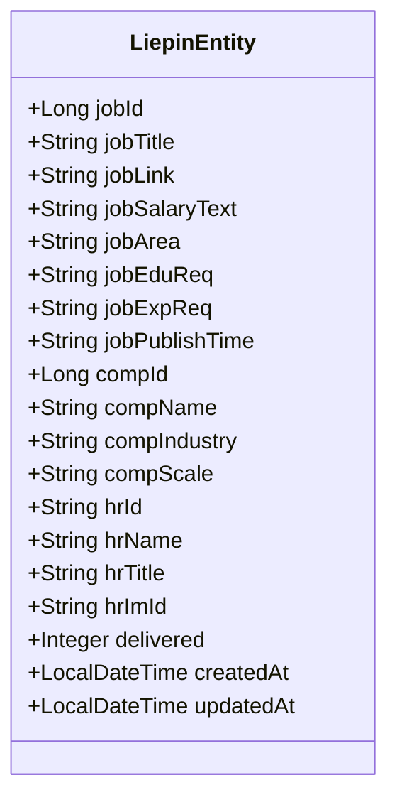

**图表来源**
- [LiepinEntity.java:15-80](file://backend/src/main/java/com/getjobs/application/entity/LiepinEntity.java#L15-L80)
- [001_create_delivery_report.sql:26-28](file://scripts/migration/001_create_delivery_report.sql#L26-L28)

**章节来源**
- [LiepinEntity.java:15-80](file://backend/src/main/java/com/getjobs/application/entity/LiepinEntity.java#L15-L80)
- [001_create_delivery_report.sql:26-28](file://scripts/migration/001_create_delivery_report.sql#L26-L28)

### 51job 岗位数据实体 Job51Entity
- 设计要点
  - 主键为 jobId，岗位/公司/HR 字段齐全，投递状态为整型布尔，创建/更新时间。
- 关系与约束
  - 与投递报告存在潜在关联（迁移脚本新增关联字段）。
- 性能与分析
  - 建议对 jobId、delivered、created_at 建立索引；避免大字段频繁更新。

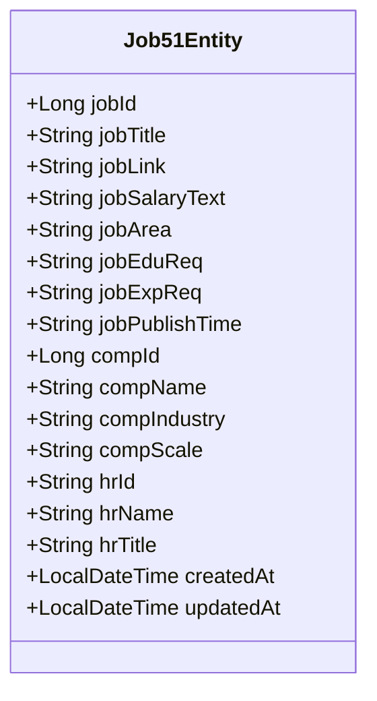

**图表来源**
- [Job51Entity.java:15-75](file://backend/src/main/java/com/getjobs/application/entity/Job51Entity.java#L15-L75)
- [001_create_delivery_report.sql:26-28](file://scripts/migration/001_create_delivery_report.sql#L26-L28)

**章节来源**
- [Job51Entity.java:15-75](file://backend/src/main/java/com/getjobs/application/entity/Job51Entity.java#L15-L75)
- [001_create_delivery_report.sql:26-28](file://scripts/migration/001_create_delivery_report.sql#L26-L28)

### 数据迁移与升级策略
- 版本管理机制
  - 迁移脚本以顺序编号命名（如 001_...），明确演进顺序。
  - 脚本内包含建表、索引、字段补充等操作，确保结构与业务需求同步。
- 升级策略
  - 生产环境建议先在测试库验证脚本，再灰度到生产；对大表变更采用在线 DDL 或分批处理。
  - 对 JSON 字段的频繁更新，建议评估拆分或归档策略，降低锁竞争。

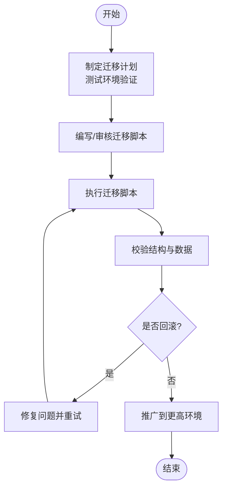

**图表来源**
- [001_create_delivery_report.sql:1-29](file://scripts/migration/001_create_delivery_report.sql#L1-L29)

**章节来源**
- [001_create_delivery_report.sql:1-29](file://scripts/migration/001_create_delivery_report.sql#L1-L29)

### SQLite 与 MySQL 的使用场景与配置差异
- 使用场景
  - SQLite：本地开发/测试、离线数据导出、小规模数据快速验证。
  - MySQL：生产环境，高并发、可靠性与扩展性更强。
- 配置差异
  - MySQL：通过 application.yaml 配置 JDBC URL、用户名、密码、HikariCP 参数。
  - SQLite：通过 export-sqlite.mjs 读取本地数据库，生成 MySQL INSERT 脚本，便于导入。
- 导出流程
  - 脚本自动遍历 SQLite 表，生成 INSERT 语句，输出到指定文件，便于批量导入 MySQL。

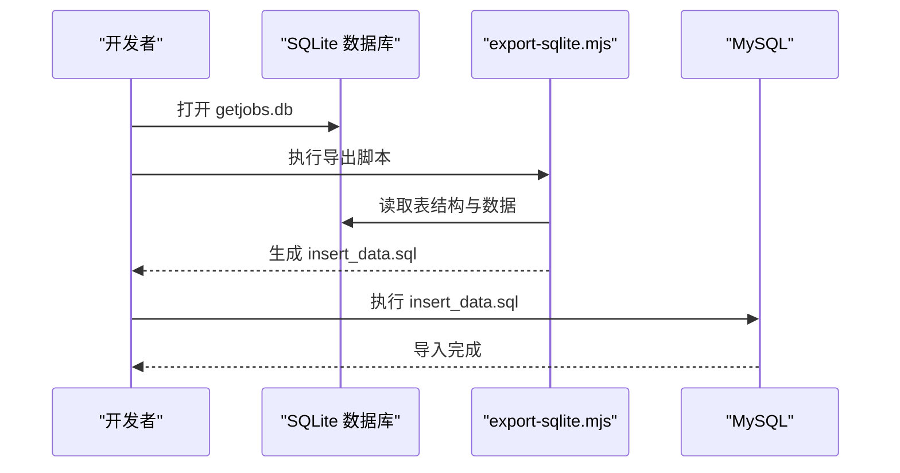

**图表来源**
- [export-sqlite.mjs:10-133](file://front/scripts/export-sqlite.mjs#L10-L133)

**章节来源**
- [application.yaml:13-22](file://backend/src/main/resources/application.yaml#L13-L22)
- [export-sqlite.mjs:10-133](file://front/scripts/export-sqlite.mjs#L10-L133)

### 数据安全、访问控制与隐私保护
- 连接安全
  - 使用 SSL/TLS 连接数据库（生产环境建议开启），避免明文传输。
  - 严格限制数据库账户权限，最小化授权范围。
- 敏感字段保护
  - 密码字段仅存储哈希值；Cookie 值等敏感信息需加密存储与访问控制。
  - JSON 字段避免存储个人敏感信息，或进行脱敏处理。
- 访问控制
  - 结合后端 JWT 与过滤器实现用户身份认证与授权；数据库层面配合 IP 白名单与审计日志。
- 隐私合规
  - 对用户数据的采集、存储、使用遵循最小化原则，并提供删除与导出功能以满足用户权利。

[本节为通用实践指导，无需特定文件引用]

## 依赖分析
- 组件耦合
  - 实体类与数据库表一一对应，通过 MyBatis-Plus 映射；Mapper 接口由 DataMapperConfig 统一扫描。
  - 异步线程池与数据库访问解耦，避免阻塞主线程。
- 外部依赖
  - MySQL 驱动与 HikariCP；MyBatis-Plus 提供 ORM 能力；Spring Boot 自动装配。
- 潜在风险
  - 迁移脚本执行顺序错误可能导致结构不一致；异步任务过多可能放大数据库压力。

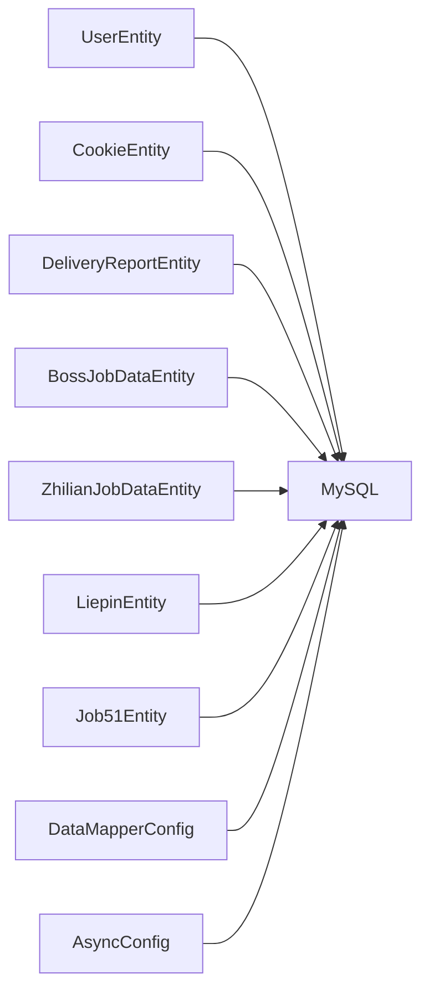

**图表来源**
- [DataMapperConfig.java:10-12](file://backend/src/main/java/com/getjobs/application/config/DataMapperConfig.java#L10-L12)
- [AsyncConfig.java:24-54](file://backend/src/main/java/com/getjobs/application/config/AsyncConfig.java#L24-L54)
- [UserEntity.java:14-39](file://backend/src/main/java/com/getjobs/application/entity/UserEntity.java#L14-L39)
- [CookieEntity.java:15-52](file://backend/src/main/java/com/getjobs/application/entity/CookieEntity.java#L15-L52)
- [DeliveryReportEntity.java:15-58](file://backend/src/main/java/com/getjobs/application/entity/DeliveryReportEntity.java#L15-L58)
- [BossJobDataEntity.java:15-107](file://backend/src/main/java/com/getjobs/application/entity/BossJobDataEntity.java#L15-L107)
- [ZhilianJobDataEntity.java:15-63](file://backend/src/main/java/com/getjobs/application/entity/ZhilianJobDataEntity.java#L15-L63)
- [LiepinEntity.java:15-80](file://backend/src/main/java/com/getjobs/application/entity/LiepinEntity.java#L15-L80)
- [Job51Entity.java:15-75](file://backend/src/main/java/com/getjobs/application/entity/Job51Entity.java#L15-L75)

**章节来源**
- [DataMapperConfig.java:10-12](file://backend/src/main/java/com/getjobs/application/config/DataMapperConfig.java#L10-L12)
- [AsyncConfig.java:24-54](file://backend/src/main/java/com/getjobs/application/config/AsyncConfig.java#L24-L54)

## 性能考虑
- 连接池优化
  - 合理设置最大池大小、空闲超时与最大生命周期，避免连接泄漏与资源浪费。
  - 使用连接测试查询确保连接有效性。
- 索引策略
  - 为高频查询字段（如 report_id、user_id、platform、created_at、jobId、delivery_status）建立索引。
  - 避免过度索引导致写入性能下降。
- SQL 优化
  - 使用分页查询与条件裁剪；避免 SELECT *；对 JSON 字段的解析尽量在应用层完成。
- 异步与并发
  - 异步线程池参数需与数据库吞吐匹配，防止过载；对批量写入采用批处理与事务合并。
- 缓存与归档
  - 对历史报表与静态数据引入缓存；对长期未访问数据进行归档或冷存储。

[本节为通用性能指导，无需特定文件引用]

## 故障排查指南
- 数据库连接失败
  - 检查 MySQL 服务状态、数据库是否存在、用户名/密码是否正确、网络与防火墙设置。
  - 参考路径：[README_PACKAGE.txt:116-121](file://README_PACKAGE.txt#L116-L121)
- 迁移脚本执行异常
  - 在测试环境先行验证；确认脚本顺序与依赖；关注索引与字段补充的兼容性。
  - 参考路径：[001_create_delivery_report.sql:1-29](file://scripts/migration/001_create_delivery_report.sql#L1-L29)
- 导出脚本报错
  - 确认 SQLite 数据库文件存在且可读；检查导出脚本依赖的模块加载路径。
  - 参考路径：[export-sqlite.mjs:18-30](file://front/scripts/export-sqlite.mjs#L18-L30)
- 端口冲突
  - 修改 application.yaml 中的 server.port 配置。
  - 参考路径：[README_PACKAGE.txt:112-114](file://README_PACKAGE.txt#L112-L114)

**章节来源**
- [README_PACKAGE.txt:112-121](file://README_PACKAGE.txt#L112-L121)
- [001_create_delivery_report.sql:1-29](file://scripts/migration/001_create_delivery_report.sql#L1-L29)
- [export-sqlite.mjs:18-30](file://front/scripts/export-sqlite.mjs#L18-L30)

## 结论
GetJobs 的数据库设计以 MySQL 为核心，结合 HikariCP 与 MyBatis-Plus 实现高效稳定的持久化能力；实体模型覆盖用户、Cookie、投递报告及各招聘平台岗位数据，迁移脚本保障结构演进有序可控；SQLite 与导出脚本为开发与测试提供了便利。通过合理的索引、异步并发与连接池配置，可在保证性能的同时提升可用性。建议在生产环境中强化访问控制、加密与审计，确保数据安全与隐私合规。

## 附录
- 配置模板参考
  - application.yaml 模板包含数据源、初始化模式与 SQL 脚本位置等关键项。
  - 参考路径：[application.yaml.template:10-42](file://scripts/application.yaml.template#L10-L42)

**章节来源**
- [application.yaml.template:10-42](file://scripts/application.yaml.template#L10-L42)