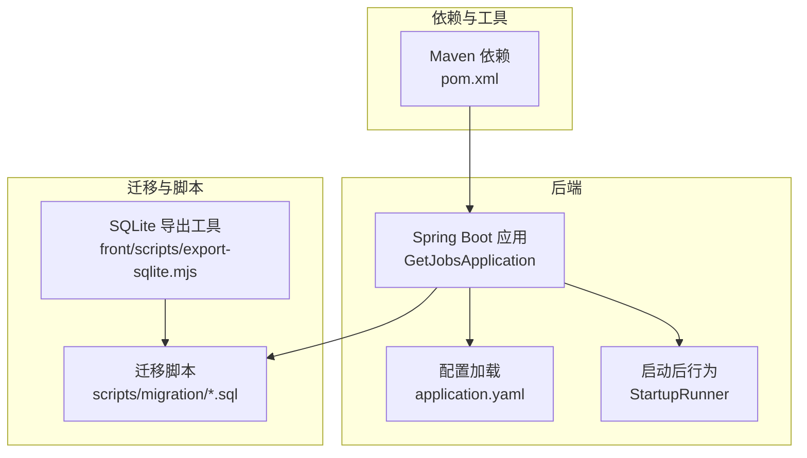
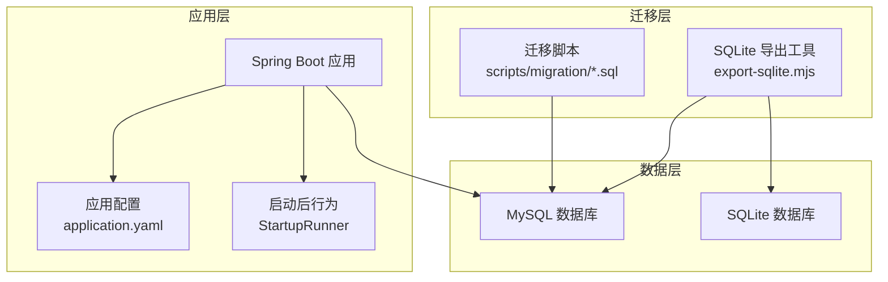
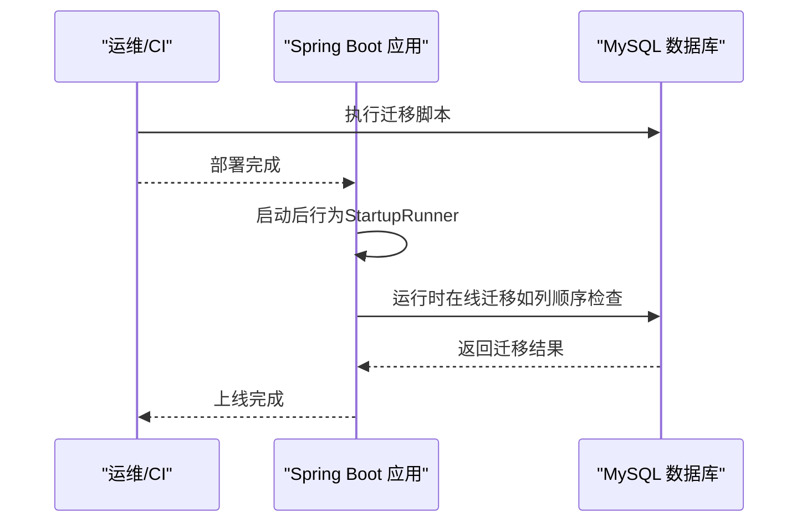
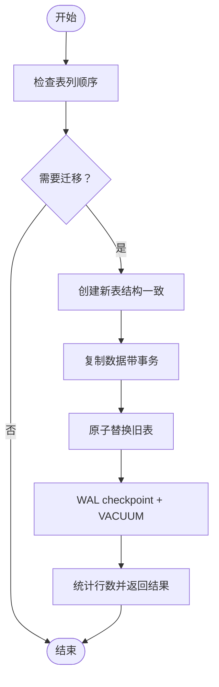
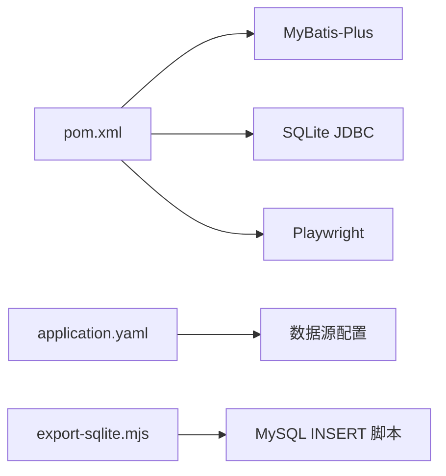

# 数据迁移管理

<cite>
**本文引用的文件**
- [application.yaml](file://backend/src/main/resources/application.yaml)
- [GetJobsApplication.java](file://backend/src/main/java/com/getjobs/GetJobsApplication.java)
- [StartupRunner.java](file://backend/src/main/java/com/getjobs/application/config/StartupRunner.java)
- [001_create_delivery_report.sql](file://scripts/migration/001_create_delivery_report.sql)
- [export-sqlite.mjs](file://front/scripts/export-sqlite.mjs)
- [BossService.java](file://backend/src/main/java/com/getjobs/application/service/BossService.java)
- [pom.xml](file://backend/pom.xml)
</cite>

## 目录
1. [简介](#简介)
2. [项目结构](#项目结构)
3. [核心组件](#核心组件)
4. [架构总览](#架构总览)
5. [详细组件分析](#详细组件分析)
6. [依赖分析](#依赖分析)
7. [性能考虑](#性能考虑)
8. [故障排查指南](#故障排查指南)
9. [结论](#结论)
10. [附录](#附录)

## 简介
本文件面向数据库管理员与运维工程师，系统化梳理 GetJobs 项目的数据库迁移管理实践，覆盖迁移脚本编写规范、命名约定、版本控制策略、执行机制（自动与手动）、数据完整性校验、回滚策略与错误处理、生产与开发差异、迁移前后验证流程，以及针对数据结构变更、索引优化与性能调优的迁移需求建议。文档同时结合仓库中现有的迁移脚本与工具，给出可操作的实施路径与最佳实践。

## 项目结构
- 后端 Spring Boot 应用负责应用启动、配置加载与业务服务，数据库连接与 MyBatis-Plus 配置位于应用配置文件中。
- 前端脚本目录包含 SQLite 导出工具，用于从本地 SQLite 数据库生成 MySQL INSERT 初始化脚本。
- 迁移脚本目录包含 SQL 迁移文件，用于创建表、索引与字段等结构变更。
- 工具链通过 Maven 管理依赖，包含 MyBatis-Plus、SQLite JDBC、Playwright 等。

**图表来源**
- [GetJobsApplication.java:1-22](file://backend/src/main/java/com/getjobs/GetJobsApplication.java#L1-L22)
- [application.yaml:1-101](file://backend/src/main/resources/application.yaml#L1-L101)
- [StartupRunner.java:1-155](file://backend/src/main/java/com/getjobs/application/config/StartupRunner.java#L1-L155)
- [001_create_delivery_report.sql:1-29](file://scripts/migration/001_create_delivery_report.sql#L1-L29)
- [export-sqlite.mjs:1-134](file://front/scripts/export-sqlite.mjs#L1-L134)
- [pom.xml:1-200](file://backend/pom.xml#L1-L200)

**章节来源**
- [GetJobsApplication.java:1-22](file://backend/src/main/java/com/getjobs/GetJobsApplication.java#L1-L22)
- [application.yaml:1-101](file://backend/src/main/resources/application.yaml#L1-L101)
- [StartupRunner.java:1-155](file://backend/src/main/java/com/getjobs/application/config/StartupRunner.java#L1-L155)
- [001_create_delivery_report.sql:1-29](file://scripts/migration/001_create_delivery_report.sql#L1-L29)
- [export-sqlite.mjs:1-134](file://front/scripts/export-sqlite.mjs#L1-L134)
- [pom.xml:1-200](file://backend/pom.xml#L1-L200)

## 核心组件
- 应用启动与配置
  - Spring Boot 启动类负责应用入口与组件扫描。
  - 应用配置文件定义数据源、MyBatis-Plus、日志、Jasypt 加密等关键参数。
- 迁移脚本
  - 迁移脚本采用 SQL 文件形式，按序号命名，包含表结构、索引与字段变更。
- SQLite 导出工具
  - 将本地 SQLite 数据库导出为 MySQL INSERT 初始化脚本，便于批量导入。
- 业务服务中的在线迁移
  - 针对特定表的列顺序与结构进行在线迁移与优化，确保数据一致性与性能。

**章节来源**
- [GetJobsApplication.java:1-22](file://backend/src/main/java/com/getjobs/GetJobsApplication.java#L1-L22)
- [application.yaml:1-101](file://backend/src/main/resources/application.yaml#L1-L101)
- [001_create_delivery_report.sql:1-29](file://scripts/migration/001_create_delivery_report.sql#L1-L29)
- [export-sqlite.mjs:1-134](file://front/scripts/export-sqlite.mjs#L1-L134)
- [BossService.java:538-1063](file://backend/src/main/java/com/getjobs/application/service/BossService.java#L538-L1063)

## 架构总览
下图展示迁移管理在系统中的位置与交互关系：应用启动加载配置，迁移脚本在部署阶段执行，SQLite 导出工具用于历史数据迁移，业务服务在运行时执行必要的在线迁移与优化。

**图表来源**
- [GetJobsApplication.java:1-22](file://backend/src/main/java/com/getjobs/GetJobsApplication.java#L1-L22)
- [application.yaml:1-101](file://backend/src/main/resources/application.yaml#L1-L101)
- [StartupRunner.java:1-155](file://backend/src/main/java/com/getjobs/application/config/StartupRunner.java#L1-L155)
- [001_create_delivery_report.sql:1-29](file://scripts/migration/001_create_delivery_report.sql#L1-L29)
- [export-sqlite.mjs:1-134](file://front/scripts/export-sqlite.mjs#L1-L134)

## 详细组件分析

### 迁移脚本与命名规范
- 命名约定
  - 使用序号前缀（如 001_）保证执行顺序，避免依赖关系混乱。
  - 文件名应简洁描述变更内容，便于审查与回溯。
- 结构与内容
  - 脚本应包含幂等性判断（如 IF NOT EXISTS），避免重复执行导致异常。
  - 明确新增索引、唯一键、外键约束与字段注释，提升可维护性。
  - 对于大表变更，建议拆分为多步迁移（结构变更 + 数据填充/更新 + 索引重建）。
- 版本控制策略
  - 每个脚本对应一个版本，合并到主分支前需通过代码评审。
  - 变更记录应包含变更原因、影响范围与回滚步骤。

示例：现有迁移脚本展示了表创建与字段补充的典型模式。

**章节来源**
- [001_create_delivery_report.sql:1-29](file://scripts/migration/001_create_delivery_report.sql#L1-L29)

### 执行机制：自动迁移与手动迁移
- 自动迁移
  - 应用启动后行为由 StartupRunner 控制，主要用于打开管理页面与初始化外部组件，不直接执行数据库迁移。
  - 数据库迁移通常在部署阶段通过 CI/CD 或运维脚本执行，确保在应用启动前完成。
- 手动迁移
  - 对于业务驱动的在线迁移（如列顺序调整），可在服务内触发，确保运行时数据一致性。
  - 示例：BossService 中的列顺序检查与在线迁移逻辑，包含 WAL checkpoint 与 VACUUM 优化。

**图表来源**
- [StartupRunner.java:1-155](file://backend/src/main/java/com/getjobs/application/config/StartupRunner.java#L1-L155)
- [BossService.java:538-1063](file://backend/src/main/java/com/getjobs/application/service/BossService.java#L538-L1063)

**章节来源**
- [StartupRunner.java:1-155](file://backend/src/main/java/com/getjobs/application/config/StartupRunner.java#L1-L155)
- [BossService.java:538-1063](file://backend/src/main/java/com/getjobs/application/service/BossService.java#L538-L1063)

### 数据完整性检查与回滚策略
- 完整性检查
  - 结构层面：核对表、索引、唯一键是否存在，字段类型与长度是否符合预期。
  - 数据层面：统计关键表行数、采样校验关键字段（如 report_id、user_id）。
  - 索引层面：确认新增索引生效，执行 EXPLAIN 分析查询计划。
- 回滚策略
  - 采用“逆向脚本”或“版本回退”策略：保留上一版本脚本，按相反顺序回滚。
  - 对于不可逆变更（如删除列），需提前备份并制定数据恢复方案。
  - 在 CI/CD 中引入“预演环境”，先行演练迁移与回滚流程。

### 生产环境与开发环境的差异
- 数据源与凭据
  - 生产环境使用加密配置与独立凭据，开发环境可使用明文或本地凭据。
  - 配置项包含数据库 URL、驱动、连接池参数与日志级别。
- 运行时行为
  - 生产环境严格限制自动打开浏览器等调试行为，开发环境可启用辅助功能。
- 工具链差异
  - 生产环境依赖 MySQL，开发环境可使用 SQLite 作为本地数据源。
  - SQLite 导出工具用于将本地数据迁移到 MySQL，支持批量 INSERT 生成。

**章节来源**
- [application.yaml:1-101](file://backend/src/main/resources/application.yaml#L1-L101)
- [export-sqlite.mjs:1-134](file://front/scripts/export-sqlite.mjs#L1-L134)

### 迁移前、中、后的标准流程
- 迁移前
  - 备份数据库（全量快照与增量日志）。
  - 评估变更影响范围与停机窗口，制定回滚预案。
  - 在预演环境验证脚本与业务逻辑。
- 迁移中
  - 通过 CI/CD 执行迁移脚本，记录开始/结束时间与执行日志。
  - 对大表变更分批执行，监控锁等待与慢查询。
  - 记录关键指标（如行数、索引大小、查询耗时）。
- 迁移后
  - 执行完整性校验与抽样回归测试。
  - 观察应用日志与数据库性能指标，确认无异常。
  - 更新部署文档与变更记录。

### 数据结构变更、索引优化与性能调优的迁移需求
- 数据结构变更
  - 新增字段：使用 DEFAULT 与注释明确含义；必要时分步添加索引。
  - 删除字段：先迁移数据至新结构，再删除旧字段；保留逆向脚本。
  - 字段类型变更：先在备用列写入新值，验证后再切换。
- 索引优化
  - 新增索引前评估查询模式，避免冗余索引导致写入性能下降。
  - 大表重建索引时选择低峰时段，必要时使用在线 DDL 工具。
- 性能调优
  - 使用 EXPLAIN 分析关键查询，识别慢查询与缺失索引。
  - 对热点表进行分区或归档，减少扫描范围。
  - 业务侧配合（如缓存、异步处理）降低数据库压力。

### 运行时在线迁移与优化（示例：BossService）
- 在线迁移场景
  - 当检测到表列顺序不符合预期时，执行在线迁移：创建新表、复制数据、替换旧表。
  - 迁移完成后执行 WAL checkpoint 与 VACUUM 优化，释放空间并提升查询性能。
- 关键点
  - 事务边界与锁粒度控制，尽量缩短写锁时间。
  - 失败重试与告警，确保迁移失败时可快速回退。

**图表来源**
- [BossService.java:538-1063](file://backend/src/main/java/com/getjobs/application/service/BossService.java#L538-L1063)

**章节来源**
- [BossService.java:538-1063](file://backend/src/main/java/com/getjobs/application/service/BossService.java#L538-L1063)

## 依赖分析
- 应用配置
  - 数据源、连接池、MyBatis-Plus、日志与加密配置集中于应用配置文件。
- 工具链
  - Maven 管理 MyBatis-Plus、SQLite JDBC、Playwright 等依赖，支撑迁移与业务功能。
- 迁移工具
  - SQLite 导出工具用于生成 MySQL INSERT 脚本，便于批量导入。

**图表来源**
- [pom.xml:1-200](file://backend/pom.xml#L1-L200)
- [application.yaml:1-101](file://backend/src/main/resources/application.yaml#L1-L101)
- [export-sqlite.mjs:1-134](file://front/scripts/export-sqlite.mjs#L1-L134)

**章节来源**
- [pom.xml:1-200](file://backend/pom.xml#L1-L200)
- [application.yaml:1-101](file://backend/src/main/resources/application.yaml#L1-L101)
- [export-sqlite.mjs:1-134](file://front/scripts/export-sqlite.mjs#L1-L134)

## 性能考虑
- 迁移窗口规划
  - 选择业务低峰时段执行大表结构变更与索引重建。
- 锁与并发
  - 使用最小锁粒度与分批处理，避免长时间阻塞写入。
- 监控与回滚
  - 实时监控慢查询、锁等待与复制延迟，准备快速回滚方案。
- 业务配合
  - 对热点接口进行限流或降级，减少迁移期间的业务波动。

## 故障排查指南
- 迁移失败
  - 检查日志与错误码，定位具体 SQL 语法或权限问题。
  - 使用逆向脚本回滚至上一版本，修复后再重试。
- 数据不一致
  - 对比迁移前后关键表行数与采样数据，确认数据完整性。
  - 重新执行缺失步骤（如索引重建、字段补全）。
- 性能异常
  - 使用 EXPLAIN 分析查询计划，补充缺失索引或优化 SQL。
  - 观察慢查询日志与锁等待，必要时调整迁移策略。

## 结论
GetJobs 的迁移管理实践以“脚本化、可回滚、可观测”为核心原则：通过有序的 SQL 脚本与工具链支持，结合运行时在线迁移与性能优化手段，实现从开发到生产的稳定演进。建议在团队内固化迁移流程与评审机制，持续完善监控与回滚预案，确保数据安全与业务连续性。

## 附录
- 迁移脚本示例路径
  - [001_create_delivery_report.sql:1-29](file://scripts/migration/001_create_delivery_report.sql#L1-L29)
- SQLite 导出工具
  - [export-sqlite.mjs:1-134](file://front/scripts/export-sqlite.mjs#L1-L134)
- 应用配置与依赖
  - [application.yaml:1-101](file://backend/src/main/resources/application.yaml#L1-L101)
  - [pom.xml:1-200](file://backend/pom.xml#L1-L200)
- 运行时迁移参考
  - [BossService.java:538-1063](file://backend/src/main/java/com/getjobs/application/service/BossService.java#L538-L1063)