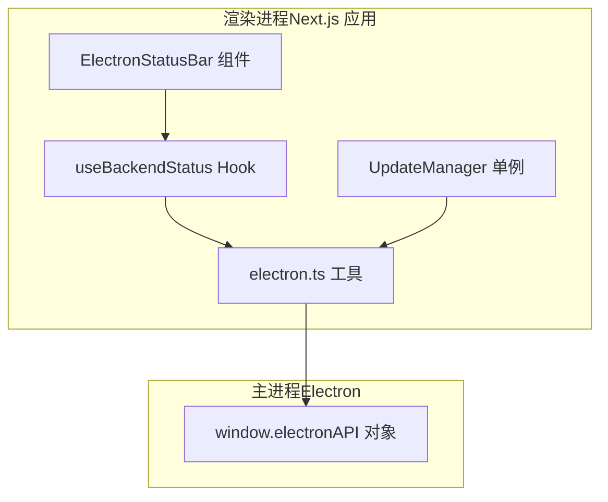
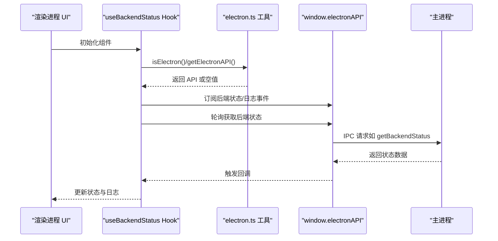
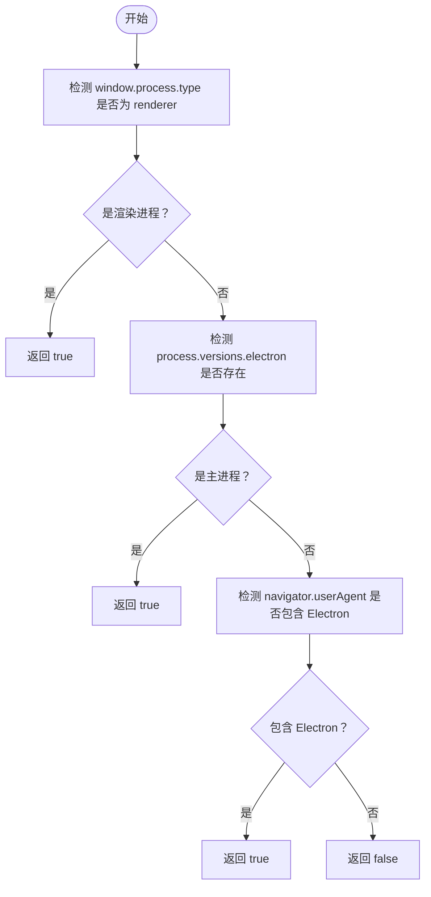
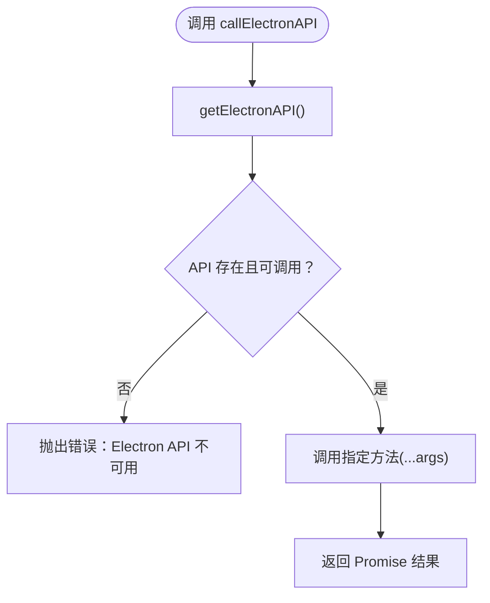
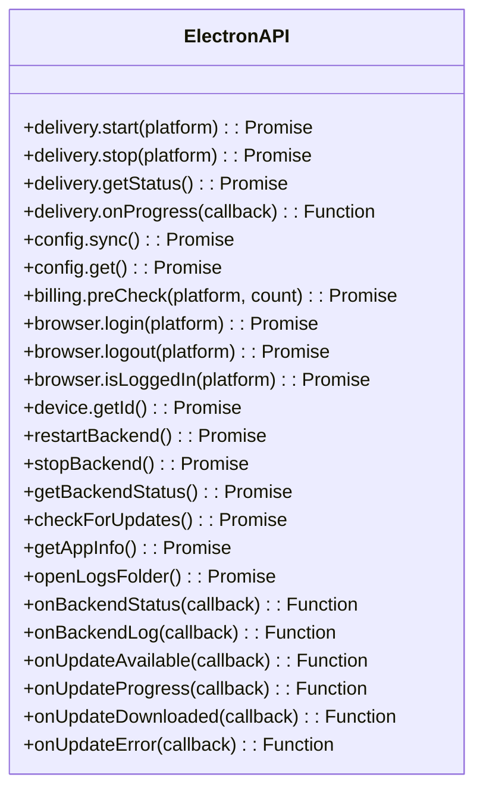
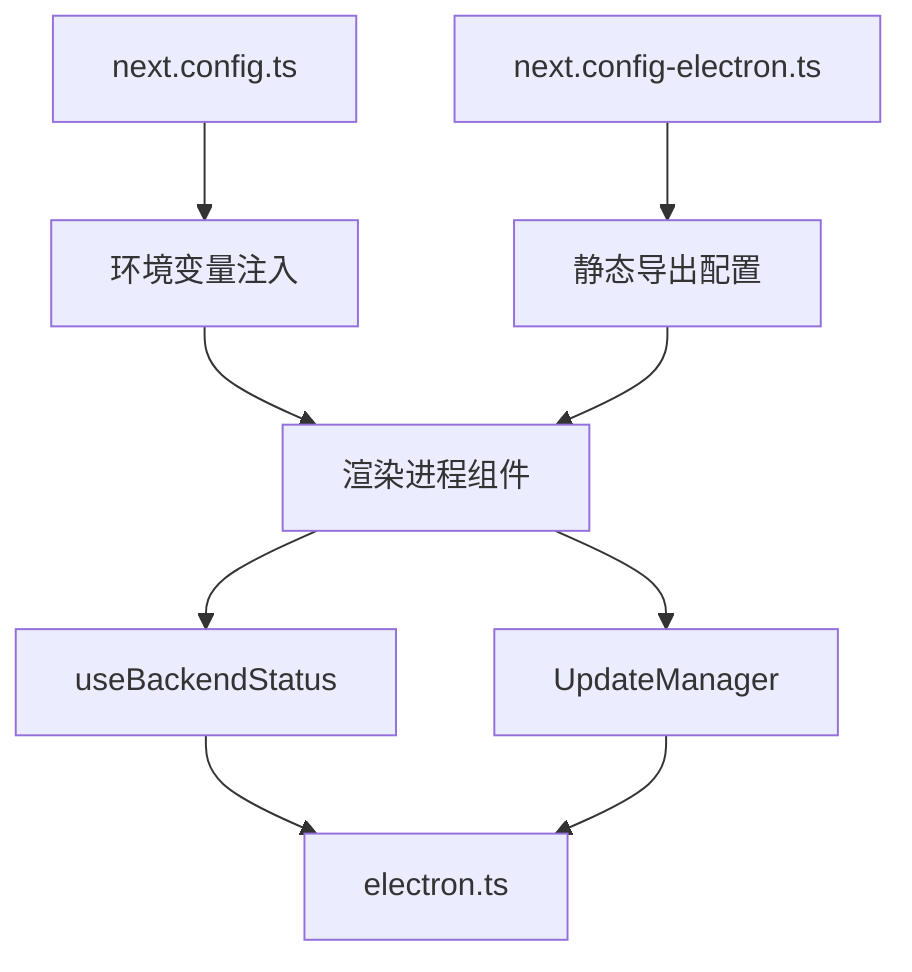
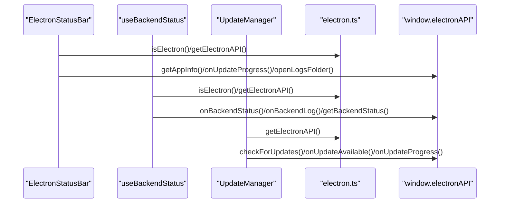
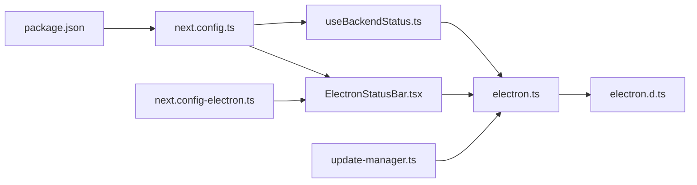

# Electron 架构设计

<cite>
**本文引用的文件**
- [front/lib/electron.ts](file://front/lib/electron.ts)
- [front/types/electron.d.ts](file://front/types/electron.d.ts)
- [front/app/components/ElectronStatusBar.tsx](file://front/app/components/ElectronStatusBar.tsx)
- [front/hooks/useBackendStatus.ts](file://front/hooks/useBackendStatus.ts)
- [front/lib/update-manager.ts](file://front/lib/update-manager.ts)
- [front/next.config.ts](file://front/next.config.ts)
- [front/next.config-electron.ts](file://front/next.config-electron.ts)
- [front/package.json](file://front/package.json)
</cite>

## 目录
1. [简介](#简介)
2. [项目结构](#项目结构)
3. [核心组件](#核心组件)
4. [架构总览](#架构总览)
5. [详细组件分析](#详细组件分析)
6. [依赖关系分析](#依赖关系分析)
7. [性能考量](#性能考量)
8. [故障排查指南](#故障排查指南)
9. [结论](#结论)
10. [附录](#附录)

## 简介
本技术文档围绕 Electron 架构设计展开，重点阐释以下内容：
- Electron 双进程架构（主进程与渲染进程）在本项目中的落地方式与职责边界
- 进程间通信（IPC）的设计原理与实现要点，结合项目中的 API 封装与类型定义
- 环境检测机制（isElectron）的三种检测方法及其适用场景
- 安全调用机制（callElectronAPI）的实现原理与错误处理策略
- Electron API 的封装、类型定义与与 Next.js 应用的集成方案
- 跨平台兼容性处理与进程隔离下的安全考虑

## 项目结构
前端采用 Next.js 作为应用框架，并通过独立的 Electron 包装层实现桌面端能力。项目中与 Electron 相关的关键目录与文件如下：
- front/lib/electron.ts：环境检测、API 获取与安全调用的工具函数
- front/types/electron.d.ts：Electron API 的 TypeScript 类型声明
- front/app/components/ElectronStatusBar.tsx：渲染进程中的 UI 组件，展示后端状态、日志与更新进度
- front/hooks/useBackendStatus.ts：渲染进程中的 React Hook，负责订阅后端状态与日志事件
- front/lib/update-manager.ts：渲染进程中的更新管理器，封装更新检查与事件监听
- front/next.config.ts 与 front/next.config-electron.ts：Next.js 构建配置，支持静态导出与 Electron 场景
- front/package.json：前端依赖与脚本，包含开发与构建流程

图表来源
- [front/app/components/ElectronStatusBar.tsx:1-159](file://front/app/components/ElectronStatusBar.tsx#L1-L159)
- [front/hooks/useBackendStatus.ts:1-101](file://front/hooks/useBackendStatus.ts#L1-L101)
- [front/lib/update-manager.ts:1-95](file://front/lib/update-manager.ts#L1-L95)
- [front/lib/electron.ts:1-49](file://front/lib/electron.ts#L1-L49)

章节来源
- [front/next.config.ts:1-23](file://front/next.config.ts#L1-L23)
- [front/next.config-electron.ts:1-11](file://front/next.config-electron.ts#L1-L11)
- [front/package.json:1-43](file://front/package.json#L1-L43)

## 核心组件
本节聚焦于 Electron 架构中的关键组件与职责划分。

- 环境检测与安全调用
  - isElectron：提供三段式检测逻辑，分别针对渲染进程、主进程与用户代理，确保在不同配置下均能正确识别 Electron 环境
  - getElectronAPI：从 window 对象安全获取 electronAPI，避免直接访问不存在的对象导致异常
  - callElectronAPI：统一的安全调用入口，校验方法存在性并抛出明确错误，便于上层捕获与提示

- API 类型定义
  - electron.d.ts 提供完整的 electronAPI 接口声明，覆盖投递、配置、计费、浏览器、设备、后端管理、更新、应用信息与日志等模块，配合严格的类型约束提升开发体验与可维护性

- 渲染进程集成
  - ElectronStatusBar：在 Electron 环境中渲染状态栏，展示后端状态、日志、版本信息与更新进度，并提供查看日志、检查更新、重启后端等交互
  - useBackendStatus：封装后端状态与日志的订阅、轮询与清理，提供 restartBackend/stopBackend 等操作
  - UpdateManager：封装更新检查与事件监听，提供单例模式与监听器移除能力

章节来源
- [front/lib/electron.ts:1-49](file://front/lib/electron.ts#L1-L49)
- [front/types/electron.d.ts:1-191](file://front/types/electron.d.ts#L1-L191)
- [front/app/components/ElectronStatusBar.tsx:1-159](file://front/app/components/ElectronStatusBar.tsx#L1-L159)
- [front/hooks/useBackendStatus.ts:1-101](file://front/hooks/useBackendStatus.ts#L1-L101)
- [front/lib/update-manager.ts:1-95](file://front/lib/update-manager.ts#L1-L95)

## 架构总览
Electron 在本项目中的架构遵循“渲染进程承载 UI 与业务逻辑，主进程提供系统级能力”的经典模式。渲染进程通过 window.electronAPI 与主进程进行 IPC 通信；主进程负责后端服务管理、系统更新、日志输出与设备信息等。

图表来源
- [front/app/components/ElectronStatusBar.tsx:14-33](file://front/app/components/ElectronStatusBar.tsx#L14-L33)
- [front/hooks/useBackendStatus.ts:20-61](file://front/hooks/useBackendStatus.ts#L20-L61)
- [front/lib/electron.ts:32-37](file://front/lib/electron.ts#L32-L37)

## 详细组件分析

### 环境检测机制（isElectron）
- 渲染进程检测：通过 window.process.type === 'renderer' 判断当前为渲染进程
- 主进程检测：通过 process.versions.electron 判断当前为主进程
- 用户代理检测：通过 navigator.userAgent 是否包含 Electron 字样，适用于未启用 nodeIntegration 的场景

适用场景
- 在渲染进程中进行条件渲染或功能开关
- 在需要调用主进程能力前进行前置校验
- 在开发与生产环境中保持一致的行为

图表来源
- [front/lib/electron.ts:6-27](file://front/lib/electron.ts#L6-L27)

章节来源
- [front/lib/electron.ts:6-27](file://front/lib/electron.ts#L6-L27)

### 安全调用机制（callElectronAPI）
- 功能：统一的安全调用入口，先获取 electronAPI，再校验方法是否存在，最后执行并返回结果
- 错误处理：当 API 或方法不可用时抛出明确错误，便于上层捕获与提示

图表来源
- [front/lib/electron.ts:42-48](file://front/lib/electron.ts#L42-L48)

章节来源
- [front/lib/electron.ts:42-48](file://front/lib/electron.ts#L42-L48)

### Electron API 封装与类型定义
- 类型声明：electron.d.ts 提供完整的接口定义，涵盖投递、配置、计费、浏览器、设备、后端管理、更新、应用信息与日志等模块
- 使用方式：渲染进程通过 window.electronAPI 调用，具备强类型提示与编译期校验

图表来源
- [front/types/electron.d.ts:3-71](file://front/types/electron.d.ts#L3-L71)

章节来源
- [front/types/electron.d.ts:1-191](file://front/types/electron.d.ts#L1-L191)

### 与 Next.js 应用的集成方案
- 构建配置：next.config.ts 与 next.config-electron.ts 支持静态导出与图片优化关闭，满足 Electron 打包与分发需求
- 环境变量：通过 next.config.ts 将服务器配置暴露到客户端环境变量，便于渲染进程使用
- 组件与 Hook：ElectronStatusBar、useBackendStatus、UpdateManager 等组件与 Hook 在渲染进程中按需加载与使用

图表来源
- [front/next.config.ts:6-20](file://front/next.config.ts#L6-L20)
- [front/next.config-electron.ts:2-8](file://front/next.config-electron.ts#L2-L8)
- [front/app/components/ElectronStatusBar.tsx:14-33](file://front/app/components/ElectronStatusBar.tsx#L14-L33)

章节来源
- [front/next.config.ts:1-23](file://front/next.config.ts#L1-L23)
- [front/next.config-electron.ts:1-11](file://front/next.config-electron.ts#L1-L11)
- [front/package.json:5-11](file://front/package.json#L5-L11)

### 渲染进程组件与 Hook 分析
- ElectronStatusBar
  - 条件渲染：仅在 isElectron() 为真时显示
  - 功能：展示后端状态、日志、版本信息与更新进度；提供查看日志、检查更新、重启后端等操作
  - 事件监听：订阅 onUpdateProgress 与 onUpdateDownloaded 等事件，实时更新 UI

- useBackendStatus
  - 订阅：onBackendStatus 与 onBackendLog 事件，持续接收状态与日志
  - 轮询：定时刷新后端状态，避免事件丢失
  - 清理：组件卸载时移除事件监听器，防止内存泄漏

- UpdateManager
  - 单例：getInstance 提供全局唯一实例
  - 事件：封装 onUpdateAvailable、onUpdateProgress、onUpdateDownloaded、onUpdateError 等事件监听
  - 安全：在非 Electron 环境或 API 不可用时直接返回或忽略

图表来源
- [front/app/components/ElectronStatusBar.tsx:14-59](file://front/app/components/ElectronStatusBar.tsx#L14-L59)
- [front/hooks/useBackendStatus.ts:20-61](file://front/hooks/useBackendStatus.ts#L20-L61)
- [front/lib/update-manager.ts:19-43](file://front/lib/update-manager.ts#L19-L43)
- [front/lib/electron.ts:32-37](file://front/lib/electron.ts#L32-L37)

章节来源
- [front/app/components/ElectronStatusBar.tsx:1-159](file://front/app/components/ElectronStatusBar.tsx#L1-L159)
- [front/hooks/useBackendStatus.ts:1-101](file://front/hooks/useBackendStatus.ts#L1-L101)
- [front/lib/update-manager.ts:1-95](file://front/lib/update-manager.ts#L1-L95)

## 依赖关系分析
- 渲染进程依赖
  - electron.ts：提供环境检测、API 获取与安全调用
  - electron.d.ts：提供强类型 API 声明
  - ElectronStatusBar、useBackendStatus、UpdateManager：基于 electron.ts 与 electron.d.ts 实现具体功能
- 构建配置依赖
  - next.config.ts：注入环境变量与静态导出配置
  - next.config-electron.ts：针对 Electron 的静态导出优化
  - package.json：定义脚本与依赖，支撑开发与构建流程

图表来源
- [front/lib/electron.ts:1-49](file://front/lib/electron.ts#L1-L49)
- [front/types/electron.d.ts:1-191](file://front/types/electron.d.ts#L1-L191)
- [front/app/components/ElectronStatusBar.tsx:1-159](file://front/app/components/ElectronStatusBar.tsx#L1-L159)
- [front/hooks/useBackendStatus.ts:1-101](file://front/hooks/useBackendStatus.ts#L1-L101)
- [front/lib/update-manager.ts:1-95](file://front/lib/update-manager.ts#L1-L95)
- [front/next.config.ts:1-23](file://front/next.config.ts#L1-L23)
- [front/next.config-electron.ts:1-11](file://front/next.config-electron.ts#L1-L11)
- [front/package.json:1-43](file://front/package.json#L1-L43)

章节来源
- [front/next.config.ts:1-23](file://front/next.config.ts#L1-L23)
- [front/next.config-electron.ts:1-11](file://front/next.config-electron.ts#L1-L11)
- [front/package.json:1-43](file://front/package.json#L1-L43)

## 性能考量
- 事件监听与清理
  - 在组件卸载或钩子销毁时移除事件监听器，避免内存泄漏与重复订阅
- 轮询频率控制
  - 合理设置轮询间隔，避免频繁请求造成资源浪费
- 异步调用与错误处理
  - 对所有 IPC 调用进行异步处理与错误捕获，保证 UI 无阻塞与用户体验稳定
- 构建优化
  - 使用静态导出与关闭图片优化，减少打包体积与启动时间

## 故障排查指南
- 环境检测失败
  - 检查 isElectron 的三种检测路径是否符合当前 Electron 配置
  - 确认渲染进程是否启用了必要的权限或用户代理设置
- API 不可用
  - 使用 getElectronAPI 检查 window.electronAPI 是否存在
  - 确认主进程是否正确注入了 electronAPI 并暴露到渲染进程
- 调用异常
  - 使用 callElectronAPI 统一调用，捕获并记录错误信息
  - 检查 electron.d.ts 中的方法签名与实际实现是否一致
- 事件未触发
  - 确认事件监听器是否在正确的生命周期内注册与移除
  - 检查主进程是否正确触发了对应事件

章节来源
- [front/lib/electron.ts:32-48](file://front/lib/electron.ts#L32-L48)
- [front/hooks/useBackendStatus.ts:56-61](file://front/hooks/useBackendStatus.ts#L56-L61)
- [front/lib/update-manager.ts:84-92](file://front/lib/update-manager.ts#L84-L92)

## 结论
本项目以 Electron 为核心，结合 Next.js 的现代前端能力，实现了清晰的双进程架构与完善的 IPC 封装。通过强类型的 API 声明、安全的调用机制与完善的事件监听体系，既保证了开发效率，也提升了系统的稳定性与可维护性。建议在后续迭代中持续关注事件监听的生命周期管理与性能优化，确保在多平台环境下的一致体验。

## 附录
- 关键文件清单
  - front/lib/electron.ts：环境检测、API 获取与安全调用
  - front/types/electron.d.ts：Electron API 类型定义
  - front/app/components/ElectronStatusBar.tsx：状态栏 UI 组件
  - front/hooks/useBackendStatus.ts：后端状态与日志 Hook
  - front/lib/update-manager.ts：更新管理器
  - front/next.config.ts 与 front/next.config-electron.ts：构建配置
  - front/package.json：依赖与脚本