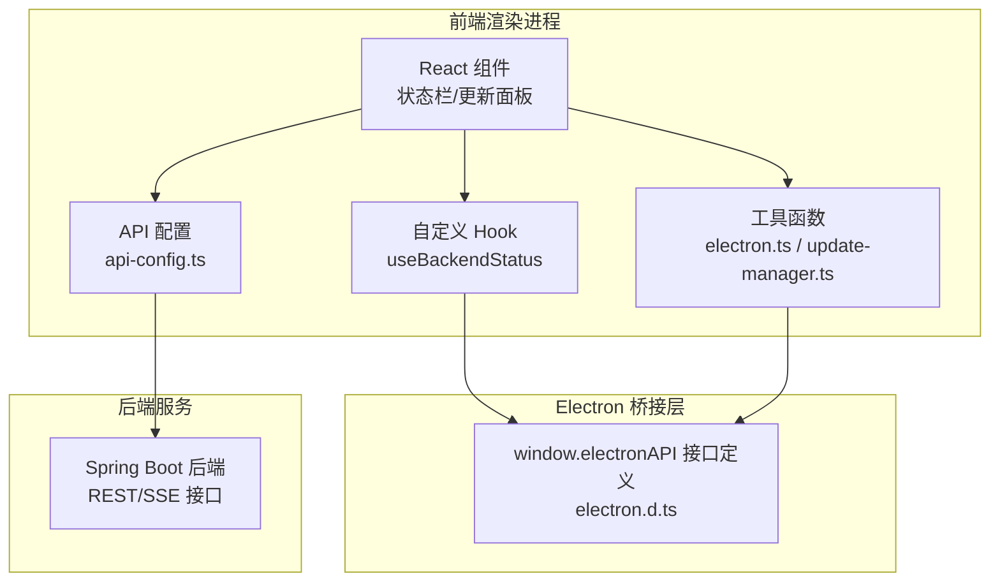
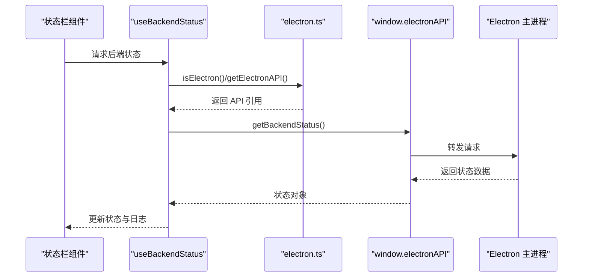
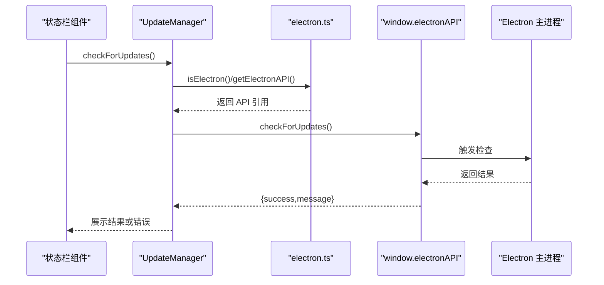
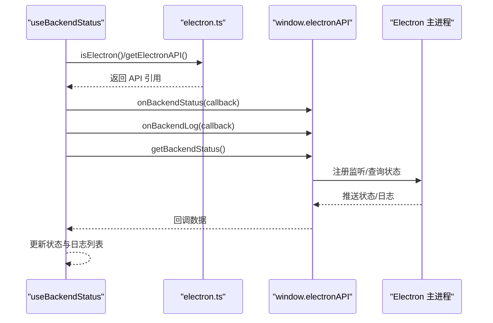
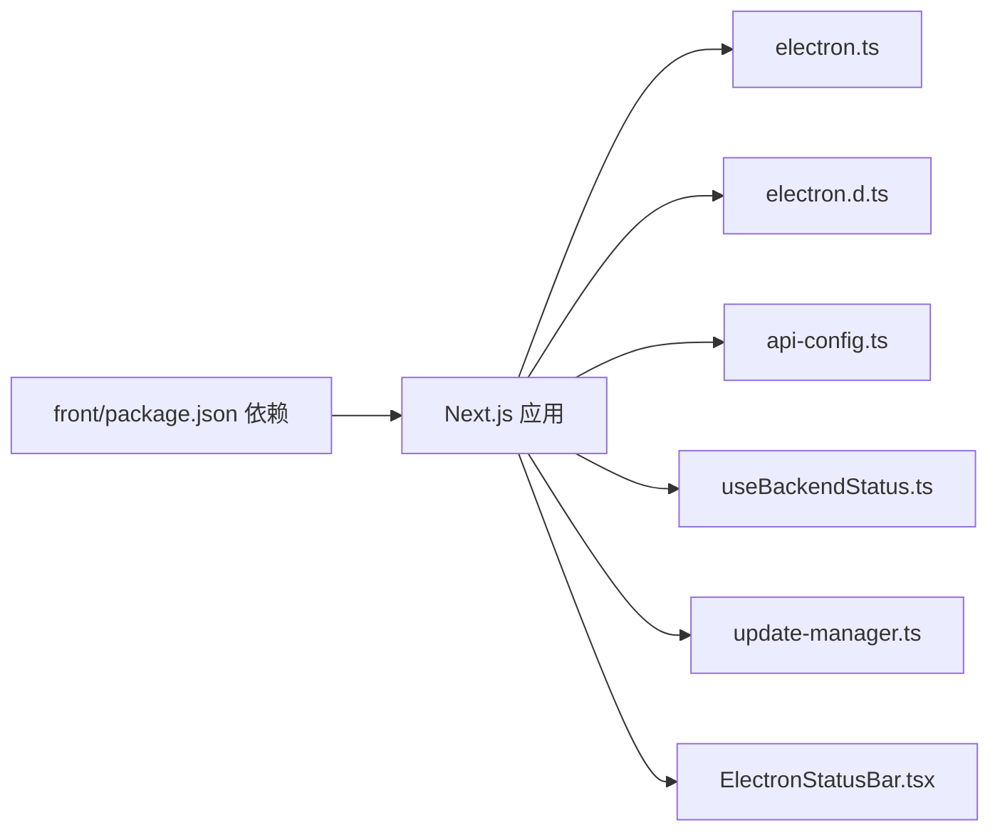

# 桌面客户端

<cite>
**本文引用的文件**
- [front/lib/electron.ts](file://front/lib/electron.ts)
- [front/types/electron.d.ts](file://front/types/electron.d.ts)
- [front/lib/update-manager.ts](file://front/lib/update-manager.ts)
- [front/app/components/ElectronStatusBar.tsx](file://front/app/components/ElectronStatusBar.tsx)
- [front/hooks/useBackendStatus.ts](file://front/hooks/useBackendStatus.ts)
- [front/lib/api-config.ts](file://front/lib/api-config.ts)
- [front/next.config-electron.ts](file://front/next.config-electron.ts)
- [front/package.json](file://front/package.json)
- [scripts/windows/start.bat](file://scripts/windows/start.bat)
- [scripts/windows/stop.bat](file://scripts/windows/stop.bat)
- [scripts/application.yaml.template](file://scripts/application.yaml.template)
</cite>

## 目录
1. [简介](#简介)
2. [项目结构](#项目结构)
3. [核心组件](#核心组件)
4. [架构总览](#架构总览)
5. [详细组件分析](#详细组件分析)
6. [依赖关系分析](#依赖关系分析)
7. [性能考虑](#性能考虑)
8. [故障排查指南](#故障排查指南)
9. [结论](#结论)
10. [附录](#附录)

## 简介
本技术文档面向桌面应用开发者与系统集成人员，围绕基于 Electron 的 GetJobs 桌面客户端进行系统化说明。内容涵盖应用架构、状态栏集成、系统托盘与桌面通知机制、自动更新与版本管理、热更新实现、跨平台兼容性、窗口管理与用户交互优化、打包分发与安装流程、与后端服务的通信机制以及本地存储策略，并提供性能优化与资源监控的最佳实践。

## 项目结构
桌面客户端由前端 Next.js 应用与 Electron 主进程桥接组成。前端通过统一的 Electron API 接口访问系统能力（如投递控制、配置同步、计费预检、浏览器登录登出、设备信息、后端管理、更新管理、应用信息、日志打开等），并在渲染进程中以 React 组件呈现状态栏与更新面板；同时，前端通过统一的 API 配置模块对接后端服务，支持健康检查、SSE 登录状态流、Cookie 管理、平台配置与统计等。

图表来源
- [front/app/components/ElectronStatusBar.tsx](file://front/app/components/ElectronStatusBar.tsx)
- [front/hooks/useBackendStatus.ts](file://front/hooks/useBackendStatus.ts)
- [front/lib/electron.ts](file://front/lib/electron.ts)
- [front/lib/update-manager.ts](file://front/lib/update-manager.ts)
- [front/lib/api-config.ts](file://front/lib/api-config.ts)
- [front/types/electron.d.ts](file://front/types/electron.d.ts)

章节来源
- [front/next.config-electron.ts](file://front/next.config-electron.ts)
- [front/package.json](file://front/package.json)

## 核心组件
- Electron 环境检测与安全调用：提供 isElectron、getElectronAPI、callElectronAPI，确保在非 Electron 环境下不会误用桥接接口。
- Electron API 类型定义：集中声明 window.electronAPI 的完整接口契约，包括投递、配置、计费、浏览器、设备、后端管理、更新、应用信息、日志与事件监听等。
- 自动更新管理器：封装 UpdateManager，负责检查更新、监听更新事件（可用、进度、下载完成、错误）、移除监听器等。
- 后端状态钩子：useBackendStatus 提供后端状态查询、日志订阅、定时刷新、重启与停止后端的能力。
- API 配置：统一管理 API 基础地址与各业务路径，支持环境变量覆盖。
- 状态栏组件：在 Electron 环境下展示后端状态、版本信息、更新进度与手动检查更新按钮。

章节来源
- [front/lib/electron.ts](file://front/lib/electron.ts)
- [front/types/electron.d.ts](file://front/types/electron.d.ts)
- [front/lib/update-manager.ts](file://front/lib/update-manager.ts)
- [front/hooks/useBackendStatus.ts](file://front/hooks/useBackendStatus.ts)
- [front/lib/api-config.ts](file://front/lib/api-config.ts)
- [front/app/components/ElectronStatusBar.tsx](file://front/app/components/ElectronStatusBar.tsx)

## 架构总览
桌面客户端采用“前端 Next.js + Electron 桥接”的双层架构。前端通过 window.electronAPI 与主进程通信，实现系统级能力（如自动更新、后端生命周期管理、日志打开等）。前端还通过统一 API 配置模块与后端服务交互，使用 REST 与 SSE 进行数据与状态同步。

图表来源
- [front/hooks/useBackendStatus.ts](file://front/hooks/useBackendStatus.ts)
- [front/lib/electron.ts](file://front/lib/electron.ts)
- [front/types/electron.d.ts](file://front/types/electron.d.ts)

## 详细组件分析

### 环境检测与桥接工具
- 功能要点
  - isElectron：在渲染进程、主进程与用户代理三种方式下识别 Electron 环境。
  - getElectronAPI：安全获取 window.electronAPI，不存在则返回空。
  - callElectronAPI：对指定方法进行安全调用，避免在非 Electron 环境抛错。
- 使用建议
  - 在渲染进程中调用任何 electronAPI 方法前，先执行 isElectron() 判断。
  - 对外暴露的 UI 组件应具备“非 Electron 环境降级”逻辑。

章节来源
- [front/lib/electron.ts](file://front/lib/electron.ts)

### Electron API 类型定义
- 功能要点
  - 统一声明 window.electronAPI 的接口契约，涵盖投递、配置、计费、浏览器、设备、后端管理、更新、应用信息、日志与事件监听。
  - 定义 ProgressMessage、DeliveryStatus、CloudConfig、AiConfig、PreCheckResult、BillingInfo、BackendStatus、AppInfo 等核心数据模型。
- 使用建议
  - 作为 TypeScript 类型约束，确保主进程实现与前端调用一致。
  - 新增接口时，同步更新类型定义与前端调用点。

章节来源
- [front/types/electron.d.ts](file://front/types/electron.d.ts)

### 自动更新管理器
- 功能要点
  - 单例模式封装，持有 electronAPI 引用。
  - 提供 checkForUpdates、onUpdateAvailable、onUpdateProgress、onUpdateDownloaded、onUpdateError、removeAllListeners 等方法。
- 使用建议
  - 在状态栏组件中触发检查更新，并绑定进度与完成回调。
  - 下载完成后提示用户重启应用以应用更新。

图表来源
- [front/lib/update-manager.ts](file://front/lib/update-manager.ts)
- [front/lib/electron.ts](file://front/lib/electron.ts)
- [front/types/electron.d.ts](file://front/types/electron.d.ts)

章节来源
- [front/lib/update-manager.ts](file://front/lib/update-manager.ts)
- [front/app/components/ElectronStatusBar.tsx](file://front/app/components/ElectronStatusBar.tsx)

### 后端状态钩子
- 功能要点
  - useBackendStatus：封装后端状态获取、日志订阅、定时刷新、重启与停止后端。
  - 通过 onBackendStatus 与 onBackendLog 监听主进程推送的状态与日志。
- 使用建议
  - 在页面加载时初始化监听，在卸载时移除监听，避免内存泄漏。
  - 结合状态栏组件展示后端运行状态与端口信息。

图表来源
- [front/hooks/useBackendStatus.ts](file://front/hooks/useBackendStatus.ts)
- [front/lib/electron.ts](file://front/lib/electron.ts)
- [front/types/electron.d.ts](file://front/types/electron.d.ts)

章节来源
- [front/hooks/useBackendStatus.ts](file://front/hooks/useBackendStatus.ts)

### 状态栏组件（Electron 集成）
- 功能要点
  - 条件渲染：仅在 Electron 环境显示。
  - 展示后端状态（含运行状态、PID、端口）、版本信息、更新进度与手动检查更新按钮。
  - 提供“重启后端”“查看日志”等快捷操作。
- 使用建议
  - 将该组件置于全局布局的底部，保证用户随时可见。
  - 对于非 Electron 环境，可提供替代占位或隐藏逻辑。

章节来源
- [front/app/components/ElectronStatusBar.tsx](file://front/app/components/ElectronStatusBar.tsx)

### API 配置与后端通信
- 功能要点
  - API_BASE_URL 支持通过环境变量覆盖，默认指向本地后端端口。
  - 统一管理健康检查、SSE 登录状态流、Cookie 管理、平台配置与统计、用户认证、计费与充值、订阅状态等路径。
- 使用建议
  - 生产环境务必通过环境变量设置正确的 API_BASE_URL。
  - SSE 流连接需在组件卸载时正确关闭，避免资源泄漏。

章节来源
- [front/lib/api-config.ts](file://front/lib/api-config.ts)

## 依赖关系分析
- 前端 Next.js 依赖
  - React、Next.js、TailwindCSS、Chart.js、Radix UI 等，用于界面与可视化。
  - 通过 next.config-electron.ts 设置静态导出与图片优化策略，适配 Electron 打包。
- Electron 桥接
  - electron.ts 与 electron.d.ts 形成桥接层，确保前端调用安全且类型受控。
- 自动更新与后端管理
  - update-manager.ts 与 useBackendStatus.ts 依赖 electron.d.ts 中的接口契约。

图表来源
- [front/package.json](file://front/package.json)
- [front/next.config-electron.ts](file://front/next.config-electron.ts)
- [front/lib/electron.ts](file://front/lib/electron.ts)
- [front/types/electron.d.ts](file://front/types/electron.d.ts)
- [front/lib/api-config.ts](file://front/lib/api-config.ts)
- [front/hooks/useBackendStatus.ts](file://front/hooks/useBackendStatus.ts)
- [front/lib/update-manager.ts](file://front/lib/update-manager.ts)
- [front/app/components/ElectronStatusBar.tsx](file://front/app/components/ElectronStatusBar.tsx)

章节来源
- [front/package.json](file://front/package.json)
- [front/next.config-electron.ts](file://front/next.config-electron.ts)

## 性能考虑
- 渲染进程资源管理
  - 合理使用 React.memo 与 useMemo/useCallback，减少不必要的重渲染。
  - 在组件卸载时移除所有 Electron 事件监听，避免内存泄漏。
- 状态与日志
  - useBackendStatus 对日志列表进行截断，限制历史长度，降低内存占用。
- 网络与 SSE
  - SSE 连接应在组件卸载时主动关闭；对频繁轮询的场景，合理设置刷新间隔。
- 图像与静态资源
  - 使用静态导出模式，结合 Tailwind CSS 与按需组件，减小首屏体积。
- 数据库与迁移
  - 若使用 SQLite（如 getjobs.db），注意批量写入与事务提交，避免频繁 I/O；迁移脚本应幂等并记录日志。

## 故障排查指南
- 无法检测到 Electron 环境
  - 确认 isElectron() 判断逻辑是否被正确调用；在非 Electron 环境下避免调用 electronAPI。
- 调用 electronAPI 抛错
  - 使用 callElectronAPI 或在调用前检查 getElectronAPI 是否存在；确认主进程已注入 window.electronAPI。
- 后端状态不更新
  - 检查 onBackendStatus 与 onBackendLog 是否注册成功；确认定时刷新与卸载清理逻辑。
- 更新检查无响应
  - 确认 update-manager 的监听器已绑定；检查网络与更新服务器可达性。
- 日志目录无法打开
  - 确认 openLogsFolder 的实现与权限；在不同操作系统上验证路径差异。
- 打包与启动问题
  - Windows：使用 scripts/windows/start.bat/stop.bat 管理后端进程；确保 API_BASE_URL 指向正确端口。
  - 配置模板：application.yaml.template 提供后端配置模板，部署时按需替换参数。

章节来源
- [front/lib/electron.ts](file://front/lib/electron.ts)
- [front/lib/update-manager.ts](file://front/lib/update-manager.ts)
- [front/hooks/useBackendStatus.ts](file://front/hooks/useBackendStatus.ts)
- [scripts/windows/start.bat](file://scripts/windows/start.bat)
- [scripts/windows/stop.bat](file://scripts/windows/stop.bat)
- [scripts/application.yaml.template](file://scripts/application.yaml.template)

## 结论
GetJobs 桌面客户端通过清晰的桥接层与统一的类型定义，实现了前端与 Electron 主进程的稳定通信；通过状态栏组件与自动更新管理器，提供了良好的用户体验与运维能力。配合统一的 API 配置与合理的资源管理策略，可在多平台上实现一致的功能表现与性能表现。建议在后续迭代中持续完善事件监听的生命周期管理与错误恢复机制，并补充系统托盘与桌面通知的具体实现细节。

## 附录

### 自动更新与版本管理（实现要点）
- 检查更新：前端通过 UpdateManager 调用 checkForUpdates，主进程触发检查并返回结果。
- 进度与完成：监听 update-progress 与 update-downloaded，驱动 UI 展示下载进度与完成提示。
- 错误处理：监听 update-error 并提示用户或重试。
- 版本信息：通过 getAppInfo 获取当前版本与平台信息，用于状态栏展示。

章节来源
- [front/lib/update-manager.ts](file://front/lib/update-manager.ts)
- [front/types/electron.d.ts](file://front/types/electron.d.ts)

### 系统托盘与桌面通知（实现要点）
- 系统托盘：建议在主进程中创建 Tray 实例，绑定点击与菜单事件，实现最小化到托盘与状态提示。
- 桌面通知：使用 Notification API 或 Electron 的 Notification 模块，结合后端状态与更新事件推送用户提示。
- 注意事项：不同平台的通知权限与样式存在差异，需做兼容性处理与用户偏好设置。

### 跨平台兼容性处理
- 平台差异：Windows/macOS/Linux 在路径、权限、通知与托盘行为上存在差异，需分别测试与适配。
- 打包导出：使用静态导出模式（next.config-electron.ts）便于 Electron 打包；注意资源路径与图标配置。
- 窗口管理：根据平台特性调整窗口大小、边框与任务栏行为，提升用户体验。

章节来源
- [front/next.config-electron.ts](file://front/next.config-electron.ts)

### 窗口管理与用户交互优化
- 窗口生命周期：在主进程中处理窗口创建、最小化、关闭与退出逻辑，避免后台残留进程。
- 交互反馈：在状态栏与操作按钮上提供即时反馈（加载态、禁用态、成功/失败提示）。
- 快捷操作：提供“重启后端”“查看日志”等快捷入口，降低运维成本。

章节来源
- [front/app/components/ElectronStatusBar.tsx](file://front/app/components/ElectronStatusBar.tsx)
- [front/hooks/useBackendStatus.ts](file://front/hooks/useBackendStatus.ts)

### 打包、分发与安装指南
- 打包步骤
  - 构建前端：执行构建脚本生成静态资源。
  - 复制资源：使用 copy-dist.mjs 将前端产物复制至 Electron 打包目录。
  - 打包应用：使用 Electron 打包工具（如 electron-builder 或 electron-packager）生成安装包。
- 分发与安装
  - Windows：提供 .exe 安装包与便携版；通过 start.bat/stop.bat 管理后端进程。
  - macOS/Linux：提供 DMG/ZIP 包与 AppImage/RPM/DEB 包；注意签名与权限配置。
- 配置模板
  - application.yaml.template 提供后端配置模板，部署时按需替换参数并放置于应用配置目录。

章节来源
- [front/package.json](file://front/package.json)
- [scripts/windows/start.bat](file://scripts/windows/start.bat)
- [scripts/windows/stop.bat](file://scripts/windows/stop.bat)
- [scripts/application.yaml.template](file://scripts/application.yaml.template)

### 与后端服务的通信机制
- REST 接口：通过 API 配置模块统一管理各业务路径，支持环境变量覆盖。
- SSE：登录状态流通过 SSE 推送，组件卸载时需主动关闭连接。
- 健康检查：提供 /api/health 与 /actuator/health 两个健康检查端点，便于前端与运维监控。

章节来源
- [front/lib/api-config.ts](file://front/lib/api-config.ts)

### 本地存储策略
- SQLite 数据库：使用 sql.js 在前端侧进行数据库读写与迁移（如城市排序字段迁移），注意事务与 I/O 优化。
- 本地配置：通过 electronAPI.config.sync 与 get 与云端配置同步与读取，避免重复同步。
- 日志与缓存：日志目录通过 openLogsFolder 打开；对高频读取的数据建立轻量缓存，减少重复请求。

章节来源
- [front/lib/api-config.ts](file://front/lib/api-config.ts)
- [front/types/electron.d.ts](file://front/types/electron.d.ts)