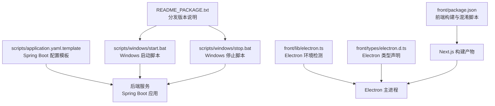
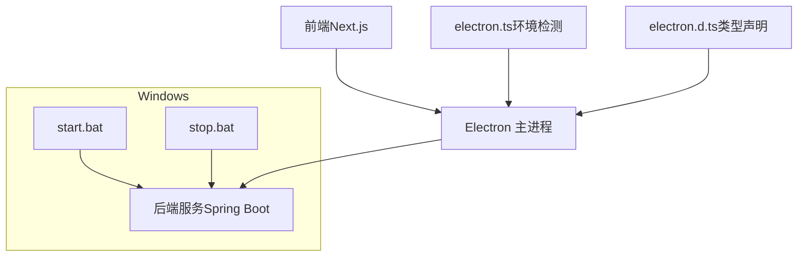
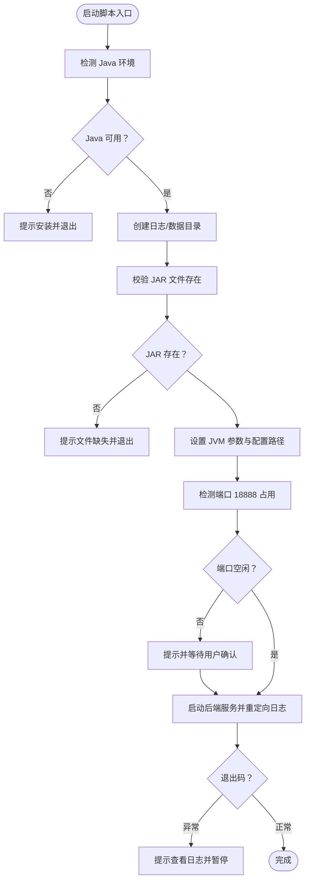
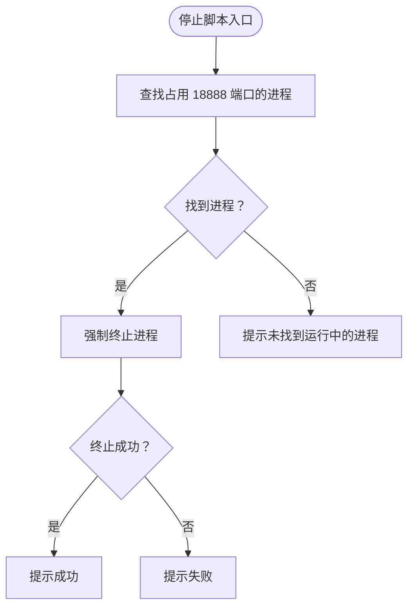
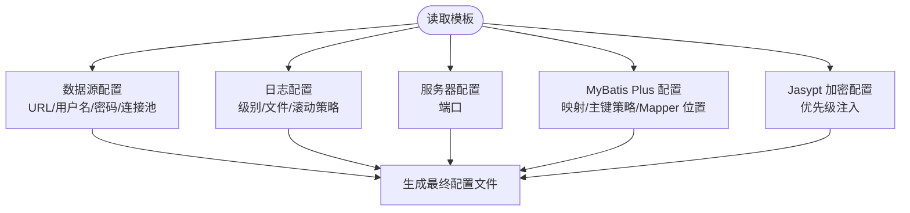
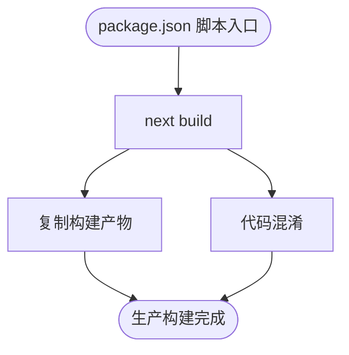
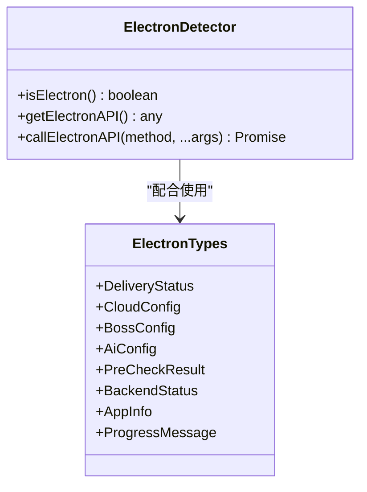
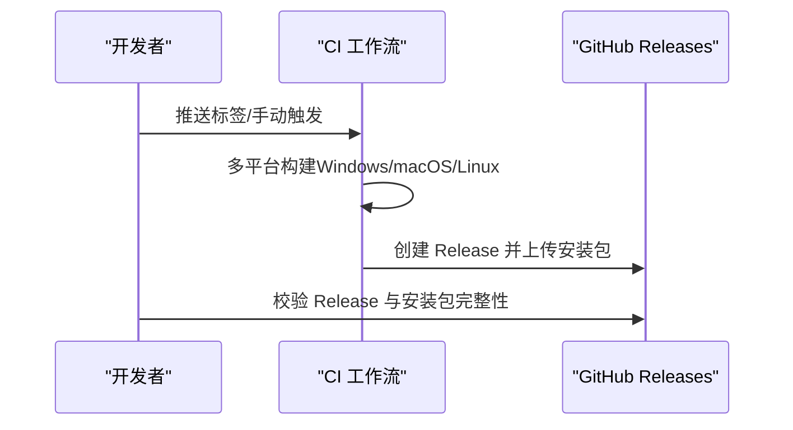
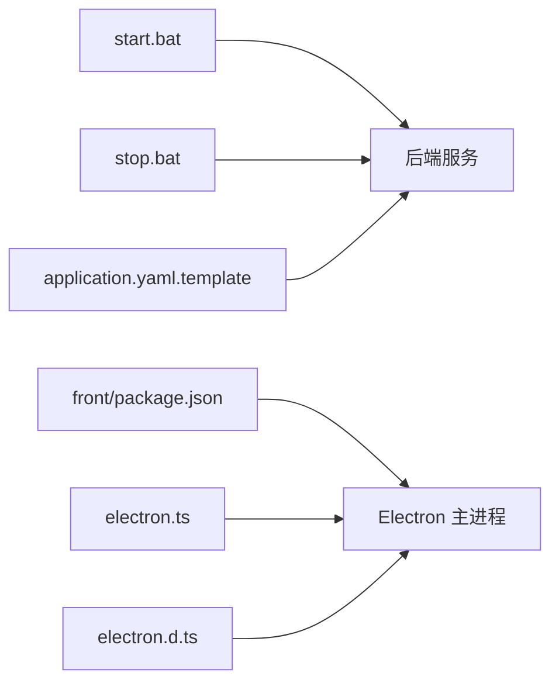

# 桌面应用打包

<cite>
**本文引用的文件**
- [README_PACKAGE.txt](file://README_PACKAGE.txt)
- [RELEASE_GUIDE.md](file://RELEASE_GUIDE.md)
- [scripts/windows/start.bat](file://scripts/windows/start.bat)
- [scripts/windows/stop.bat](file://scripts/windows/stop.bat)
- [scripts/application.yaml.template](file://scripts/application.yaml.template)
- [front/package.json](file://front/package.json)
- [front/lib/electron.ts](file://front/lib/electron.ts)
- [front/types/electron.d.ts](file://front/types/electron.d.ts)
</cite>

## 目录
1. [简介](#简介)
2. [项目结构](#项目结构)
3. [核心组件](#核心组件)
4. [架构总览](#架构总览)
5. [详细组件分析](#详细组件分析)
6. [依赖关系分析](#依赖关系分析)
7. [性能考量](#性能考量)
8. [故障排查指南](#故障排查指南)
9. [结论](#结论)
10. [附录](#附录)

## 简介
本指南面向软件工程师与 DevOps 团队，围绕桌面应用打包提供系统化操作手册。重点覆盖：
- Electron 应用的构建流程与开发/生产环境配置
- Windows 平台的启动/停止脚本与安装程序生成
- 跨平台打包策略（macOS 与 Linux）与注意事项
- 应用签名、代码混淆与资源优化最佳实践
- 常见问题排查与解决方案
- 持续集成与自动化打包配置思路
- 分发渠道选择与发布流程

## 项目结构
本项目采用前后端分离与多脚本协同的方式组织打包与运行：
- 分发版本（含后端与脚本）：README_PACKAGE.txt 描述了 Windows 与 Unix 平台的安装与运行步骤，包含启动/停止脚本、配置文件与目录结构。
- 发布流程：RELEASE_GUIDE.md 给出了版本号规范、测试构建、发布方式与发布后验证流程。
- 脚本与配置：scripts/windows/start.bat、scripts/windows/stop.bat 提供 Windows 启停逻辑；scripts/application.yaml.template 提供 Spring Boot 配置模板。
- 前端与 Electron：front/package.json 定义前端构建与混淆脚本；front/lib/electron.ts 与 front/types/electron.d.ts 提供 Electron 环境检测与类型声明。

**图表来源**
- [README_PACKAGE.txt:1-131](file://README_PACKAGE.txt#L1-L131)
- [scripts/windows/start.bat:1-98](file://scripts/windows/start.bat#L1-L98)
- [scripts/windows/stop.bat:1-31](file://scripts/windows/stop.bat#L1-L31)
- [scripts/application.yaml.template:1-102](file://scripts/application.yaml.template#L1-L102)
- [front/package.json:1-48](file://front/package.json#L1-L48)
- [front/lib/electron.ts:1-49](file://front/lib/electron.ts#L1-L49)
- [front/types/electron.d.ts:1-191](file://front/types/electron.d.ts#L1-L191)

**章节来源**
- [README_PACKAGE.txt:1-131](file://README_PACKAGE.txt#L1-L131)
- [RELEASE_GUIDE.md:1-211](file://RELEASE_GUIDE.md#L1-L211)

## 核心组件
- Windows 启动脚本：负责 Java 环境检测、目录创建、JVM 参数设置、端口占用检查、启动后端服务与日志输出。
- Windows 停止脚本：基于端口查找进程并强制终止，便于快速停止服务。
- Spring Boot 配置模板：提供数据库连接、日志、Banner、MyBatis Plus 等配置项，支持加密密码与环境变量注入。
- 前端构建与混淆：通过 front/package.json 的脚本实现 Next.js 构建与资源混淆，辅助安全与体积优化。
- Electron 集成：通过 front/lib/electron.ts 检测运行环境，front/types/electron.d.ts 定义 API 类型，支撑桌面端能力。

**章节来源**
- [scripts/windows/start.bat:1-98](file://scripts/windows/start.bat#L1-L98)
- [scripts/windows/stop.bat:1-31](file://scripts/windows/stop.bat#L1-L31)
- [scripts/application.yaml.template:1-102](file://scripts/application.yaml.template#L1-L102)
- [front/package.json:1-48](file://front/package.json#L1-L48)
- [front/lib/electron.ts:1-49](file://front/lib/electron.ts#L1-L49)
- [front/types/electron.d.ts:1-191](file://front/types/electron.d.ts#L1-L191)

## 架构总览
桌面应用由前端（Next.js）、后端（Spring Boot）与 Electron 主进程协同组成。Windows 启动脚本负责后端服务的启动与日志输出；停止脚本负责进程清理；前端构建产物由 Electron 主进程托管运行；Electron 类型声明与环境检测保障 API 可用性与类型安全。

**图表来源**
- [scripts/windows/start.bat:1-98](file://scripts/windows/start.bat#L1-L98)
- [scripts/windows/stop.bat:1-31](file://scripts/windows/stop.bat#L1-L31)
- [front/lib/electron.ts:1-49](file://front/lib/electron.ts#L1-L49)
- [front/types/electron.d.ts:1-191](file://front/types/electron.d.ts#L1-L191)

## 详细组件分析

### Windows 启动脚本（start.bat）
- 功能要点
  - 检测 Java 环境与版本，提示安装路径与下载地址
  - 自动创建日志与数据目录
  - 校验 JAR 文件存在性
  - 设置 JVM 默认参数（内存、编码、配置路径）
  - 检测端口占用并提示风险
  - 启动后端服务并将日志输出到文件
  - 异常退出时提示查看日志并暂停
- 关键行为
  - 使用 UTF-8 编码与 Spring 配置路径参数
  - 默认端口为 18888，可通过配置文件调整
  - 输出控制台日志至 logs/console.log，应用日志至 logs/get-jobs.log

**图表来源**
- [scripts/windows/start.bat:15-98](file://scripts/windows/start.bat#L15-L98)

**章节来源**
- [scripts/windows/start.bat:1-98](file://scripts/windows/start.bat#L1-L98)

### Windows 停止脚本（stop.bat）
- 功能要点
  - 通过 netstat 查找占用 18888 端口的进程
  - 使用 taskkill 强制终止进程
  - 若未找到进程则提示未运行
- 关键行为
  - 以 PID 为依据进行进程终止
  - 成功/失败分别输出提示信息

**图表来源**
- [scripts/windows/stop.bat:12-29](file://scripts/windows/stop.bat#L12-L29)

**章节来源**
- [scripts/windows/stop.bat:1-31](file://scripts/windows/stop.bat#L1-L31)

### Spring Boot 配置模板（application.yaml.template）
- 功能要点
  - 数据源配置（MySQL、驱动、连接池参数）
  - Banner、日志级别与滚动策略
  - 服务器端口（默认 18888）
  - MyBatis Plus 配置（映射、主键策略、Mapper 位置）
  - Jasypt 加密配置（优先级：环境变量 > JVM 参数 > 默认值）
- 关键行为
  - 支持密码加密与环境变量注入
  - 日志文件与控制台输出分离
  - 连接池参数可调，满足不同负载场景

**图表来源**
- [scripts/application.yaml.template:10-102](file://scripts/application.yaml.template#L10-L102)

**章节来源**
- [scripts/application.yaml.template:1-102](file://scripts/application.yaml.template#L1-L102)

### 前端构建与混淆（front/package.json）
- 功能要点
  - 开发与生产构建脚本
  - 资源复制与代码混淆脚本
  - 依赖包含 Next.js、React、TailwindCSS、混淆工具与压缩工具
- 关键行为
  - 生产构建后可执行资源复制与混淆流程
  - 便于减小体积与提升安全性

**图表来源**
- [front/package.json:5-14](file://front/package.json#L5-L14)

**章节来源**
- [front/package.json:1-48](file://front/package.json#L1-L48)

### Electron 集成（front/lib/electron.ts 与 front/types/electron.d.ts）
- 功能要点
  - 环境检测：区分渲染进程、主进程与用户代理
  - 安全调用：封装 Electron API 调用，避免不可用时报错
  - 类型声明：定义投递、配置、计费、浏览器、设备、后端管理、更新、应用信息、日志与事件回调等接口
- 关键行为
  - 通过全局 window.electronAPI 访问桌面端能力
  - 提供统一的错误处理与回调注册机制

**图表来源**
- [front/lib/electron.ts:6-48](file://front/lib/electron.ts#L6-L48)
- [front/types/electron.d.ts:4-191](file://front/types/electron.d.ts#L4-L191)

**章节来源**
- [front/lib/electron.ts:1-49](file://front/lib/electron.ts#L1-L49)
- [front/types/electron.d.ts:1-191](file://front/types/electron.d.ts#L1-L191)

### 跨平台打包策略（macOS 与 Linux）
- 策略概述
  - 使用统一的构建脚本与配置模板，适配 Unix 系统差异
  - 通过 README_PACKAGE.txt 的目录结构与脚本权限说明，指导安装与运行
  - 结合 RELEASE_GUIDE.md 的平台构建与发布流程，实现多平台一致性
- 注意事项
  - macOS 需关注代码签名与公证流程
  - Linux 需关注 AppImage 与 Deb 包的依赖与权限
  - 所有平台均应验证自动更新与日志输出

**章节来源**
- [README_PACKAGE.txt:22-39](file://README_PACKAGE.txt#L22-L39)
- [RELEASE_GUIDE.md:46-89](file://RELEASE_GUIDE.md#L46-L89)

### 应用签名、代码混淆与资源优化最佳实践
- 应用签名
  - macOS：使用 Apple Developer 证书进行签名与公证，确保 Gatekeeper 放行
  - Windows：使用受信任的代码签名证书，启用时间戳与双算法签名
- 代码混淆
  - 前端：利用 front/package.json 中的混淆脚本，结合压缩工具减小体积
  - 后端：通过构建工具与打包插件进行资源优化与依赖裁剪
- 资源优化
  - 图片与静态资源：使用 Next.js 图像优化与懒加载
  - 第三方依赖：定期审计与升级，移除未使用模块
  - 日志与缓存：合理配置日志滚动与缓存策略，避免磁盘压力

**章节来源**
- [front/package.json:9-11](file://front/package.json#L9-L11)
- [RELEASE_GUIDE.md:153-177](file://RELEASE_GUIDE.md#L153-L177)

### 持续集成与自动化打包
- 自动化发布
  - 使用 Git Tag 触发 CI 工作流，自动在 Windows、macOS、Linux 平台构建并上传安装包
  - 支持手动触发工作流与本地手动发布两种模式
- 验证流程
  - 构建后验证安装包、应用启动、后端启动与基本功能
  - 发布后验证 GitHub Release 与自动更新

**图表来源**
- [RELEASE_GUIDE.md:48-61](file://RELEASE_GUIDE.md#L48-L61)
- [RELEASE_GUIDE.md:68-75](file://RELEASE_GUIDE.md#L68-L75)
- [RELEASE_GUIDE.md:77-89](file://RELEASE_GUIDE.md#L77-L89)

**章节来源**
- [RELEASE_GUIDE.md:1-211](file://RELEASE_GUIDE.md#L1-L211)

### 分发渠道与发布流程
- 渠道选择
  - GitHub Releases：官方发布与自动更新
  - 应用商店（视平台而定）：补充分发渠道
- 发布流程
  - 更新版本号与更新日志
  - 本地测试构建与多平台验证
  - 创建 Release 并上传安装包
  - 发布后验证自动更新与下载测试

**章节来源**
- [RELEASE_GUIDE.md:91-126](file://RELEASE_GUIDE.md#L91-L126)
- [RELEASE_GUIDE.md:128-152](file://RELEASE_GUIDE.md#L128-L152)

## 依赖关系分析
- 组件耦合
  - Windows 启动/停止脚本与后端服务强耦合，需保证端口与路径一致
  - 前端构建产物与 Electron 主进程解耦，通过类型声明与环境检测对接
  - 配置模板与后端服务弱耦合，通过文件路径与环境变量注入
- 外部依赖
  - Java 运行时、MySQL 数据库、Electron 生态与 Next.js 生态

**图表来源**
- [scripts/windows/start.bat:81-84](file://scripts/windows/start.bat#L81-L84)
- [scripts/windows/stop.bat:15-25](file://scripts/windows/stop.bat#L15-L25)
- [scripts/application.yaml.template:10-102](file://scripts/application.yaml.template#L10-L102)
- [front/package.json:7-10](file://front/package.json#L7-L10)
- [front/lib/electron.ts:32-37](file://front/lib/electron.ts#L32-L37)
- [front/types/electron.d.ts:4-69](file://front/types/electron.d.ts#L4-L69)

**章节来源**
- [scripts/windows/start.bat:1-98](file://scripts/windows/start.bat#L1-L98)
- [scripts/windows/stop.bat:1-31](file://scripts/windows/stop.bat#L1-L31)
- [scripts/application.yaml.template:1-102](file://scripts/application.yaml.template#L1-L102)
- [front/package.json:1-48](file://front/package.json#L1-L48)
- [front/lib/electron.ts:1-49](file://front/lib/electron.ts#L1-L49)
- [front/types/electron.d.ts:1-191](file://front/types/electron.d.ts#L1-L191)

## 性能考量
- 启动性能
  - JVM 参数（堆大小、编码）直接影响启动速度与稳定性
  - 端口占用检测避免冲突带来的启动失败
- 运行性能
  - 日志滚动策略与文件大小限制防止磁盘压力
  - 连接池参数与数据库查询优化提升响应速度
- 构建性能
  - 前端构建与混淆脚本在生产环境执行，建议并行与缓存策略
  - 资源压缩与懒加载减少首屏加载时间

[本节为通用指导，无需列出具体文件来源]

## 故障排查指南
- Java 环境问题
  - 现象：启动脚本报错未找到 Java
  - 处理：安装 Java 21+ 并配置 JAVA_HOME，检查版本输出
- 端口占用问题
  - 现象：端口 18888 被占用导致启动失败
  - 处理：使用停止脚本终止进程或修改配置文件端口
- JAR 文件缺失
  - 现象：找不到 get-jobs.jar
  - 处理：确认分发包完整性与 lib 目录结构
- 日志定位
  - 控制台日志：logs/console.log
  - 应用日志：logs/get-jobs.log
- 自动更新问题
  - 现象：自动更新不生效
  - 处理：检查发布状态、Token 权限与日志输出

**章节来源**
- [scripts/windows/start.bat:15-23](file://scripts/windows/start.bat#L15-L23)
- [scripts/windows/start.bat:64-71](file://scripts/windows/start.bat#L64-L71)
- [scripts/windows/start.bat:41-48](file://scripts/windows/start.bat#L41-L48)
- [scripts/windows/start.bat:86-93](file://scripts/windows/start.bat#L86-L93)
- [RELEASE_GUIDE.md:153-177](file://RELEASE_GUIDE.md#L153-L177)

## 结论
本指南基于现有脚本与文档，提供了从开发到发布的全流程打包方案。通过规范的启动/停止脚本、配置模板与前端构建流程，结合跨平台打包与自动化发布，可稳定交付高质量的桌面应用。建议在实际落地中进一步完善 CI/CD 与监控体系，持续优化性能与用户体验。

[本节为总结性内容，无需列出具体文件来源]

## 附录
- 快速参考
  - Windows 启动：双击 start.bat 或命令行执行
  - Windows 停止：双击 stop.bat 或命令行执行
  - Unix 权限：chmod +x start.sh stop.sh
  - 配置文件：config/application.yaml
  - 日志目录：logs/

**章节来源**
- [README_PACKAGE.txt:16-39](file://README_PACKAGE.txt#L16-L39)
- [scripts/windows/start.bat:20-22](file://scripts/windows/start.bat#L20-L22)
- [scripts/windows/stop.bat:28-30](file://scripts/windows/stop.bat#L28-L30)