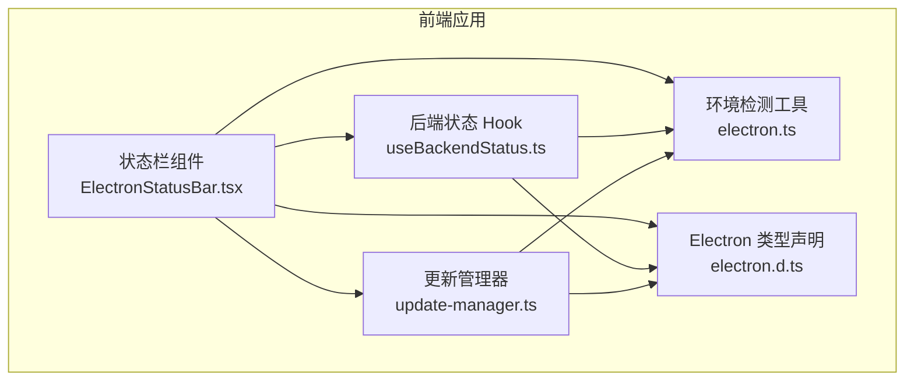
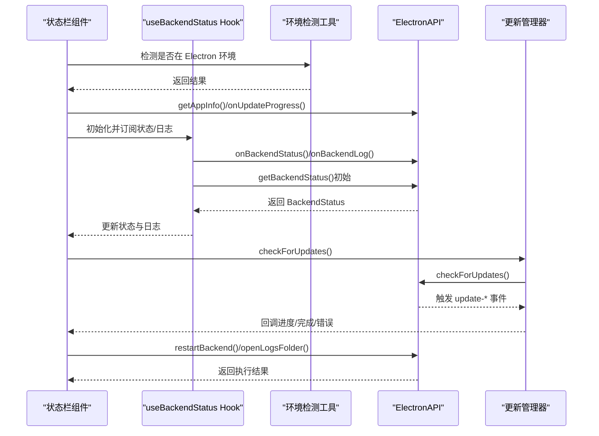
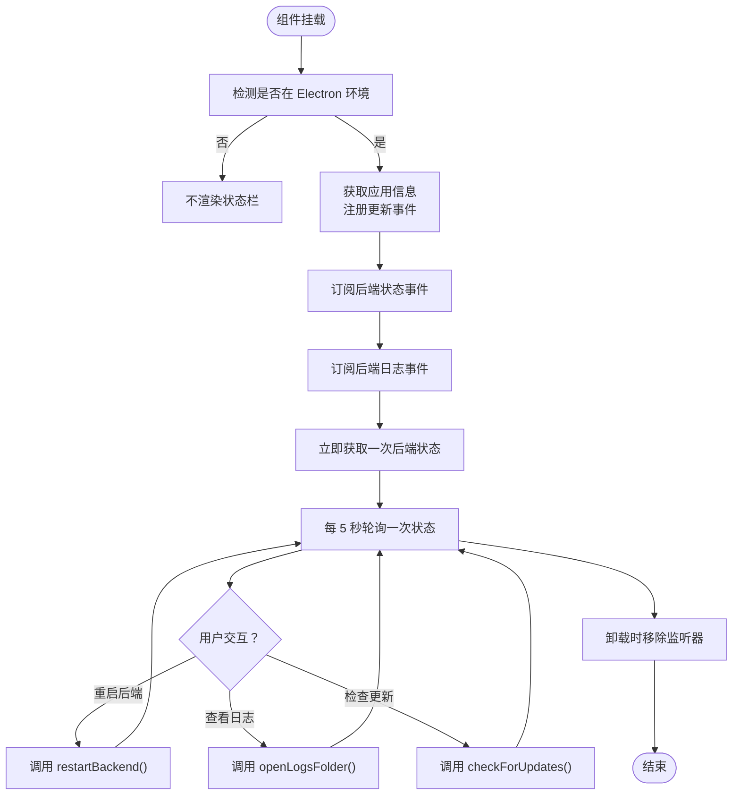
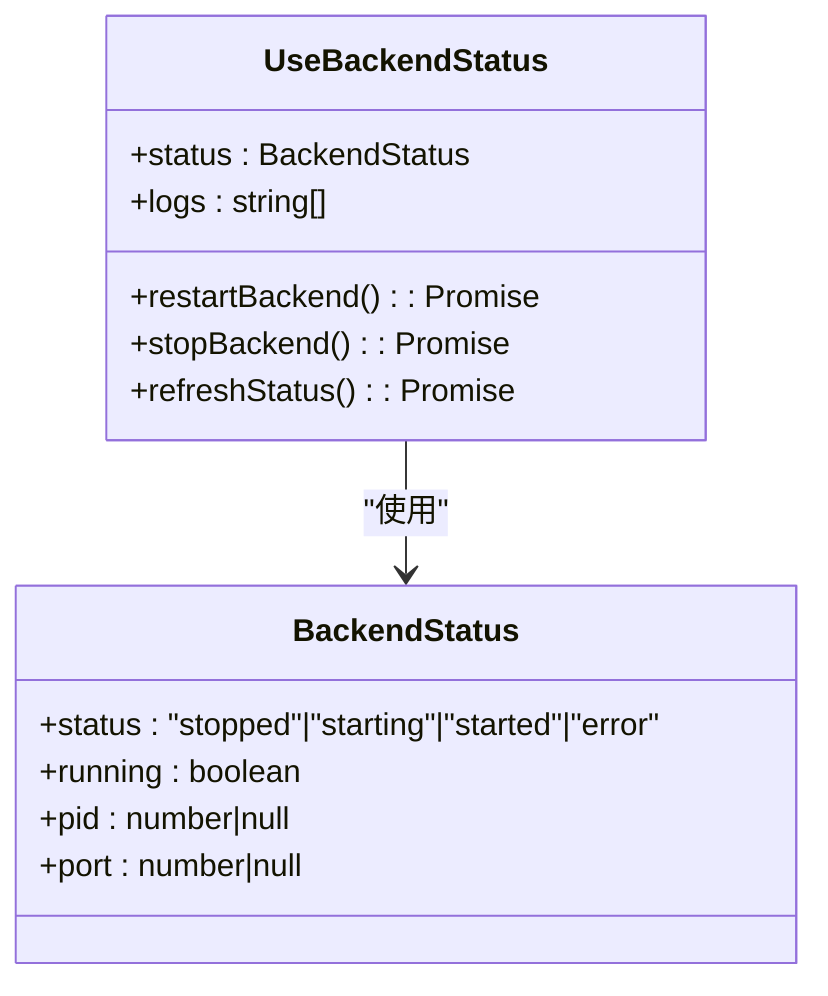
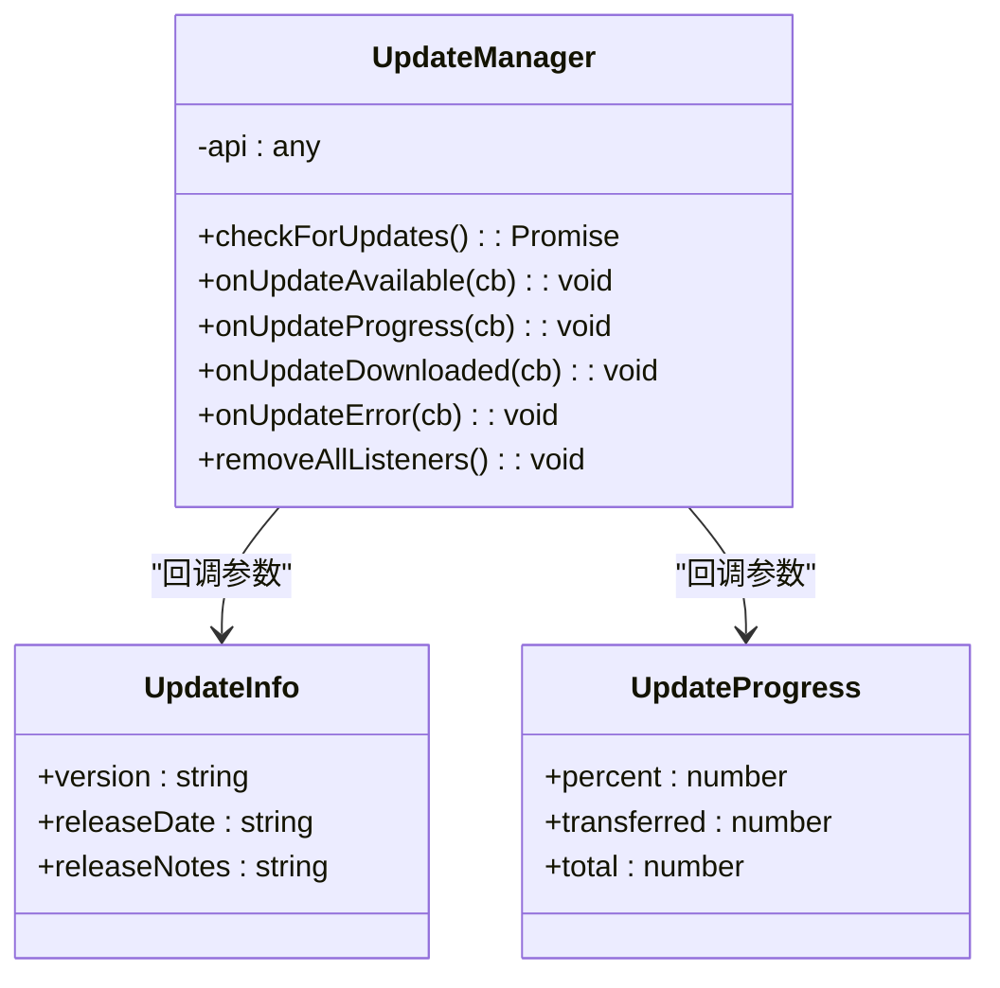
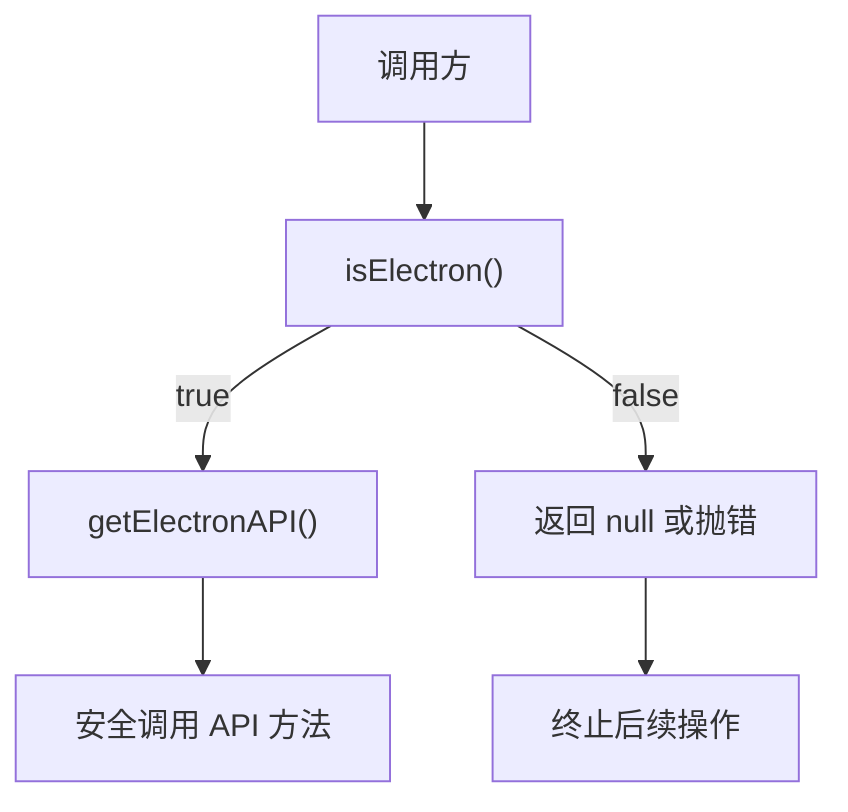
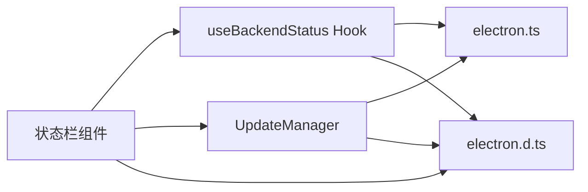

# 状态栏集成

<cite>
**本文引用的文件**
- [ElectronStatusBar.tsx](file://front/app/components/ElectronStatusBar.tsx)
- [electron.ts](file://front/lib/electron.ts)
- [useBackendStatus.ts](file://front/hooks/useBackendStatus.ts)
- [update-manager.ts](file://front/lib/update-manager.ts)
- [electron.d.ts](file://front/types/electron.d.ts)
</cite>

## 目录
1. [简介](#简介)
2. [项目结构](#项目结构)
3. [核心组件](#核心组件)
4. [架构总览](#架构总览)
5. [组件详解](#组件详解)
6. [依赖关系分析](#依赖关系分析)
7. [性能考量](#性能考量)
8. [故障排查指南](#故障排查指南)
9. [结论](#结论)
10. [附录](#附录)

## 简介
本技术文档围绕 Electron 状态栏集成展开，重点说明前端状态栏组件的实现架构、生命周期管理与事件处理机制；深入解析状态栏与后端服务的实时通信流程（健康检查、系统状态监控、用户会话状态显示逻辑）；阐述响应式设计与主题适配策略；解释状态栏图标、文本与交互元素的动态更新方式；并给出在 Windows、macOS、Linux 上的表现差异与适配建议，以及自定义与扩展的最佳实践。

## 项目结构
状态栏功能由前端 Next.js 应用中的组件与 Hook 共同实现，并通过类型声明对接 Electron 主进程提供的 API。核心文件如下：
- 组件层：状态栏 UI 组件负责渲染与交互
- Hook 层：封装后端状态拉取、事件监听与定时刷新
- 工具层：环境检测与安全调用封装
- 类型层：统一声明 Electron API 的接口契约

图表来源
- [ElectronStatusBar.tsx:1-159](file://front/app/components/ElectronStatusBar.tsx#L1-L159)
- [useBackendStatus.ts:1-101](file://front/hooks/useBackendStatus.ts#L1-L101)
- [update-manager.ts:1-95](file://front/lib/update-manager.ts#L1-L95)
- [electron.ts:1-49](file://front/lib/electron.ts#L1-L49)
- [electron.d.ts:1-191](file://front/types/electron.d.ts#L1-L191)

章节来源
- [ElectronStatusBar.tsx:1-159](file://front/app/components/ElectronStatusBar.tsx#L1-L159)
- [useBackendStatus.ts:1-101](file://front/hooks/useBackendStatus.ts#L1-L101)
- [update-manager.ts:1-95](file://front/lib/update-manager.ts#L1-L95)
- [electron.ts:1-49](file://front/lib/electron.ts#L1-L49)
- [electron.d.ts:1-191](file://front/types/electron.d.ts#L1-L191)

## 核心组件
- 状态栏组件：在 Electron 渲染进程中固定于页面底部，展示后端运行状态、端口信息、日志打开入口、更新进度与版本信息，并提供“重启后端”“检查更新”等交互按钮。
- 后端状态 Hook：负责向 Electron API 请求后端状态、订阅状态变更事件、拉取日志、定时刷新，并暴露重启与停止后端的方法。
- 更新管理器：封装检查更新、监听更新事件（可用、进度、完成、错误）、移除监听器等能力。
- 环境检测工具：统一判断是否处于 Electron 环境，并安全访问 window.electronAPI。
- 类型声明：定义 ElectronAPI 的完整接口契约，确保 TS 侧类型安全。

章节来源
- [ElectronStatusBar.tsx:8-159](file://front/app/components/ElectronStatusBar.tsx#L8-L159)
- [useBackendStatus.ts:11-101](file://front/hooks/useBackendStatus.ts#L11-L101)
- [update-manager.ts:15-95](file://front/lib/update-manager.ts#L15-L95)
- [electron.ts:6-49](file://front/lib/electron.ts#L6-L49)
- [electron.d.ts:4-71](file://front/types/electron.d.ts#L4-L71)

## 架构总览
状态栏的运行时交互链路如下：
- 组件初始化时检测 Electron 环境，获取应用信息与注册更新进度监听。
- Hook 在挂载时订阅后端状态与日志事件，初始拉取一次状态，并每 5 秒轮询一次。
- 用户操作触发对应 API 调用（如重启后端、打开日志、检查更新），并在回调中更新 UI。
- 类型声明确保前后端接口一致，避免运行期错误。

图表来源
- [ElectronStatusBar.tsx:14-60](file://front/app/components/ElectronStatusBar.tsx#L14-L60)
- [useBackendStatus.ts:34-61](file://front/hooks/useBackendStatus.ts#L34-L61)
- [update-manager.ts:33-43](file://front/lib/update-manager.ts#L33-L43)
- [electron.d.ts:5-71](file://front/types/electron.d.ts#L5-L71)

## 组件详解

### 状态栏组件生命周期与事件处理
- 生命周期
  - 挂载阶段：检测 Electron 环境，若非 Electron 环境则不渲染。
  - 初始化：获取应用信息；注册更新进度与下载完成事件。
  - 清理：卸载时移除所有事件监听。
- 事件处理
  - 后端状态：订阅后端状态变更事件，实时更新 UI。
  - 后端日志：订阅日志事件，限制保留最近 100 条日志。
  - 定时刷新：每 5 秒主动拉取一次后端状态，保证 UI 与实际状态一致。
  - 用户交互：提供“重启后端”“查看日志”“检查更新”等按钮，分别调用对应 API。

图表来源
- [ElectronStatusBar.tsx:14-60](file://front/app/components/ElectronStatusBar.tsx#L14-L60)
- [useBackendStatus.ts:34-61](file://front/hooks/useBackendStatus.ts#L34-L61)

章节来源
- [ElectronStatusBar.tsx:14-60](file://front/app/components/ElectronStatusBar.tsx#L14-L60)
- [useBackendStatus.ts:34-61](file://front/hooks/useBackendStatus.ts#L34-L61)

### 后端状态与日志管理
- 数据模型
  - BackendStatus：包含状态枚举、是否运行、进程 ID、端口等字段。
  - 日志数组：最多保留最近 100 条日志，便于调试与问题定位。
- 事件与轮询
  - 事件驱动：订阅后端状态与日志事件，保证实时性。
  - 轮询兜底：每 5 秒一次主动拉取，避免网络或事件丢失导致的状态不一致。
- 方法导出
  - restartBackend：重启后端服务。
  - stopBackend：停止后端服务。
  - refreshStatus：手动刷新状态。

图表来源
- [useBackendStatus.ts:4-19](file://front/hooks/useBackendStatus.ts#L4-L19)
- [electron.d.ts:179-184](file://front/types/electron.d.ts#L179-L184)

章节来源
- [useBackendStatus.ts:4-19](file://front/hooks/useBackendStatus.ts#L4-L19)
- [electron.d.ts:179-184](file://front/types/electron.d.ts#L179-L184)

### 更新管理与下载进度
- 单例模式：UpdateManager 以单例提供全局一致的更新能力。
- 事件监听：支持“可用更新”“下载进度”“下载完成”“更新错误”等事件。
- 安全调用：仅在 Electron 环境且 API 可用时执行。
- 进度展示：状态栏根据 onUpdateProgress 的回调动态更新下载百分比条。

图表来源
- [update-manager.ts:15-95](file://front/lib/update-manager.ts#L15-L95)
- [electron.d.ts:3-71](file://front/types/electron.d.ts#L3-L71)

章节来源
- [update-manager.ts:15-95](file://front/lib/update-manager.ts#L15-L95)
- [electron.d.ts:3-71](file://front/types/electron.d.ts#L3-L71)

### 环境检测与安全调用
- 多场景检测：区分渲染进程、主进程与无 nodeIntegration 的浏览器环境。
- 安全访问：通过 getElectronAPI 获取 window.electronAPI，不存在时抛出明确错误，避免直接调用导致异常。
- 统一入口：所有与 Electron 的交互均通过该工具进行，降低耦合度。

图表来源
- [electron.ts:6-49](file://front/lib/electron.ts#L6-L49)

章节来源
- [electron.ts:6-49](file://front/lib/electron.ts#L6-L49)

### 类型契约与接口一致性
- 类型声明集中定义了 electronAPI 的所有方法签名、事件回调参数与数据结构，确保前后端契约一致。
- 关键接口包括：后端管理、更新管理、应用信息、日志、事件监听等。
- 使用 TypeScript 编译期校验，减少运行期错误。

章节来源
- [electron.d.ts:4-71](file://front/types/electron.d.ts#L4-L71)
- [electron.d.ts:179-191](file://front/types/electron.d.ts#L179-L191)

## 依赖关系分析
- 组件依赖 Hook：状态栏组件依赖 useBackendStatus 提供的状态与方法。
- Hook 依赖工具：useBackendStatus 依赖 electron.ts 进行环境检测与 API 访问。
- 组件依赖类型：组件与 Hook 均依赖 electron.d.ts 的类型定义。
- 更新管理器独立：update-manager 作为独立模块，通过 electron.ts 间接依赖类型声明。

图表来源
- [ElectronStatusBar.tsx:3-6](file://front/app/components/ElectronStatusBar.tsx#L3-L6)
- [useBackendStatus.ts:1-3](file://front/hooks/useBackendStatus.ts#L1-L3)
- [update-manager.ts:1-2](file://front/lib/update-manager.ts#L1-L2)
- [electron.ts:1-2](file://front/lib/electron.ts#L1-L2)
- [electron.d.ts:1-2](file://front/types/electron.d.ts#L1-L2)

章节来源
- [ElectronStatusBar.tsx:3-6](file://front/app/components/ElectronStatusBar.tsx#L3-L6)
- [useBackendStatus.ts:1-3](file://front/hooks/useBackendStatus.ts#L1-L3)
- [update-manager.ts:1-2](file://front/lib/update-manager.ts#L1-L2)
- [electron.ts:1-2](file://front/lib/electron.ts#L1-L2)
- [electron.d.ts:1-2](file://front/types/electron.d.ts#L1-L2)

## 性能考量
- 轮询频率：每 5 秒一次状态轮询，平衡实时性与资源消耗。可根据业务需求调整间隔。
- 日志截断：日志数组最多保留 100 条，避免内存膨胀。
- 事件去抖：在高频事件（如下载进度）场景下，可考虑节流或防抖策略，减少 UI 重绘压力。
- 渲染优化：状态栏采用固定定位，层级较高但仅在 Electron 环境渲染，避免对网页布局造成额外负担。
- 网络与事件可靠性：事件驱动为主、轮询兜底，确保在网络异常或事件丢失时仍能保持状态一致。

## 故障排查指南
- 无法渲染状态栏
  - 检查是否在 Electron 环境中，非 Electron 环境下组件不会渲染。
  - 章节来源: [ElectronStatusBar.tsx:61-63](file://front/app/components/ElectronStatusBar.tsx#L61-L63)
- 后端状态不更新
  - 确认事件监听是否正常注册与清理。
  - 章节来源: [useBackendStatus.ts:40-61](file://front/hooks/useBackendStatus.ts#L40-L61)
- 重启/停止后端失败
  - 查看控制台错误日志，确认 API 是否可用。
  - 章节来源: [useBackendStatus.ts:63-91](file://front/hooks/useBackendStatus.ts#L63-L91)
- 检查更新无响应
  - 确认 UpdateManager 实例化与事件监听是否生效。
  - 章节来源: [update-manager.ts:19-28](file://front/lib/update-manager.ts#L19-L28)
- 下载进度不显示
  - 确认 onUpdateProgress 事件是否被触发，以及 UI 是否正确绑定百分比。
  - 章节来源: [ElectronStatusBar.tsx:25-32](file://front/app/components/ElectronStatusBar.tsx#L25-L32)

## 结论
本状态栏集成方案以 React 组件为核心，结合自研 Hook 与工具模块，实现了与 Electron 主进程的稳定通信。通过事件驱动与轮询兜底相结合的方式，保障了后端状态与日志的实时性；通过类型声明确保接口一致性；通过单例更新管理器简化了更新流程。整体架构清晰、职责分离、易于扩展与维护。

## 附录

### 响应式设计与主题适配
- 颜色语义：根据后端状态映射不同颜色（运行中/启动中/错误/已停止），并配合脉冲动画提示活跃状态。
- 深色模式：使用暗色边框与文字色值，适配深色主题。
- 版本信息：显示应用版本与开发标识，便于区分构建环境。
- 章节来源: [ElectronStatusBar.tsx:65-89](file://front/app/components/ElectronStatusBar.tsx#L65-L89), [ElectronStatusBar.tsx:140-145](file://front/app/components/ElectronStatusBar.tsx#L140-L145)

### 跨平台表现与适配建议
- Windows/macOS/Linux
  - 状态栏固定在页面底部，跨平台一致。
  - 图标与文本采用通用样式，避免平台特定资源。
  - 若需平台差异化外观，可在样式层面按平台变量覆盖。
- 章节来源: [ElectronStatusBar.tsx:91-157](file://front/app/components/ElectronStatusBar.tsx#L91-L157)

### 自定义与扩展最佳实践
- 新增状态项
  - 在 BackendStatus 中扩展字段，并在 Hook 与组件中相应更新。
  - 章节来源: [useBackendStatus.ts:4-19](file://front/hooks/useBackendStatus.ts#L4-L19), [electron.d.ts:179-184](file://front/types/electron.d.ts#L179-L184)
- 新增事件
  - 在 electron.d.ts 中补充类型定义，在主进程实现对应事件与回调。
  - 章节来源: [electron.d.ts:5-71](file://front/types/electron.d.ts#L5-L71)
- 新增交互
  - 在组件中新增按钮与回调，确保仅在 Electron 环境启用。
  - 章节来源: [ElectronStatusBar.tsx:106-121](file://front/app/components/ElectronStatusBar.tsx#L106-L121)
- 性能优化
  - 对高频事件（如下载进度）增加节流/防抖；合理设置轮询间隔。
  - 章节来源: [useBackendStatus.ts:54-58](file://front/hooks/useBackendStatus.ts#L54-L58)