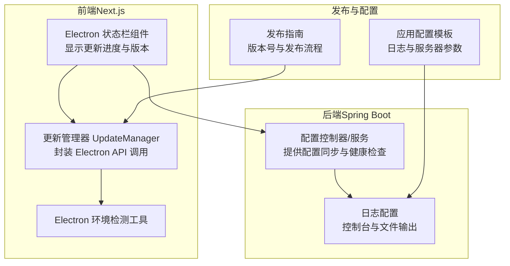
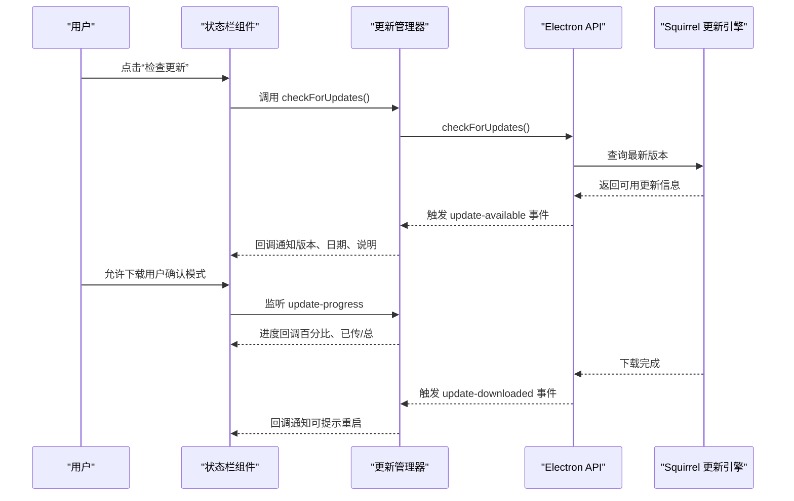
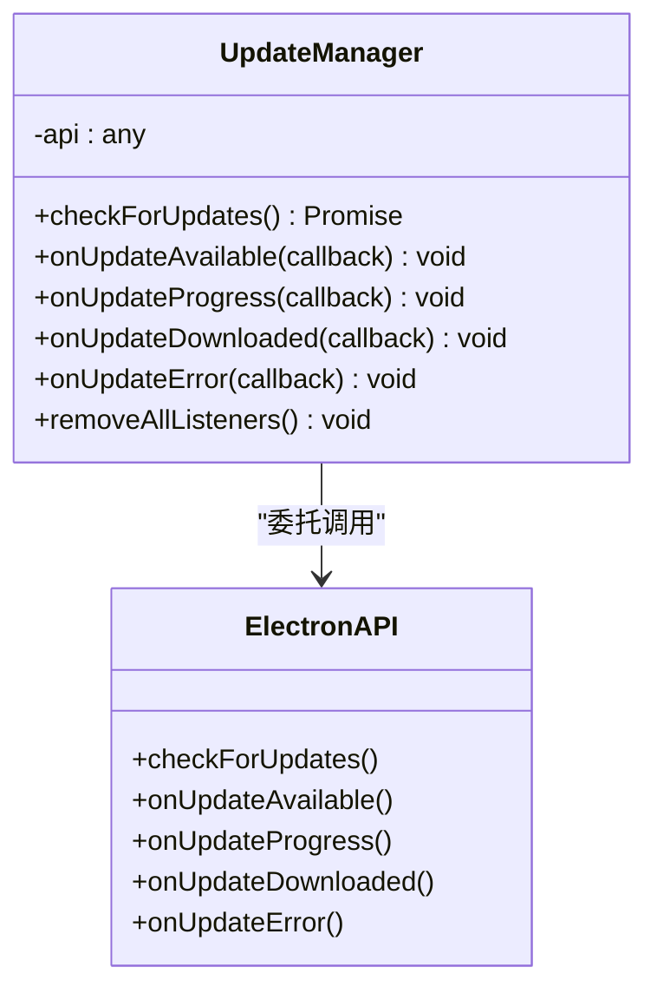
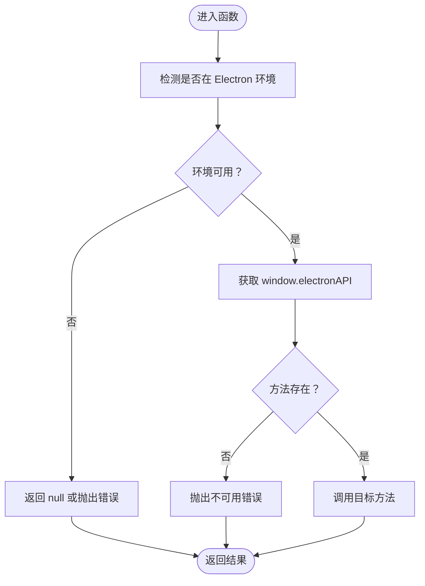
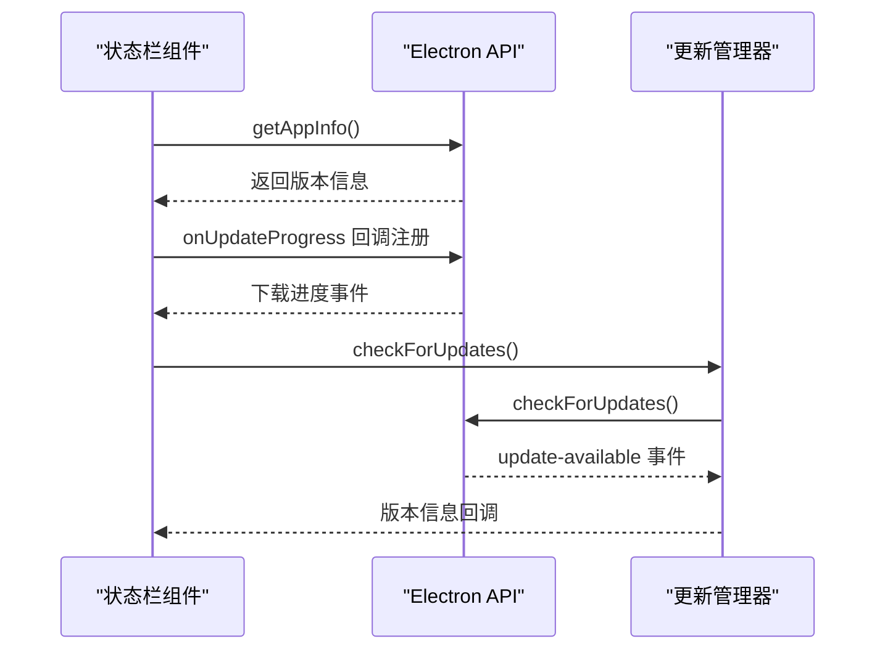
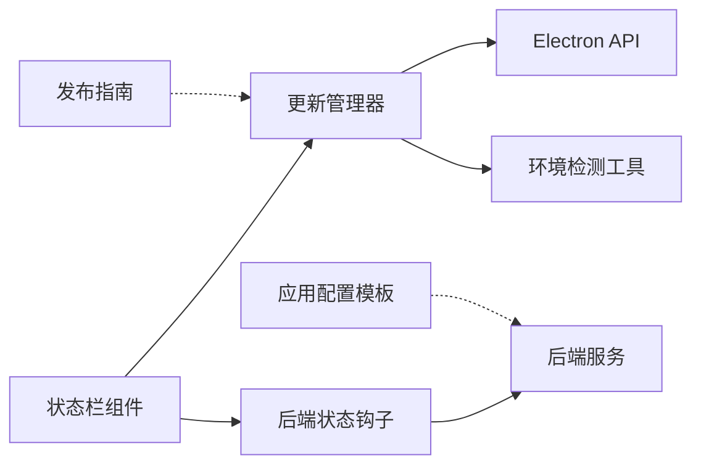

# 自动更新系统

<cite>
**本文引用的文件**
- [update-manager.ts](file://front/lib/update-manager.ts)
- [electron.ts](file://front/lib/electron.ts)
- [ElectronStatusBar.tsx](file://front/app/components/ElectronStatusBar.tsx)
- [useBackendStatus.ts](file://front/hooks/useBackendStatus.ts)
- [application.yaml.template](file://scripts/application.yaml.template)
- [RELEASE_GUIDE.md](file://RELEASE_GUIDE.md)
</cite>

## 目录
1. [简介](#简介)
2. [项目结构](#项目结构)
3. [核心组件](#核心组件)
4. [架构总览](#架构总览)
5. [详细组件分析](#详细组件分析)
6. [依赖关系分析](#依赖关系分析)
7. [性能考量](#性能考量)
8. [故障排查指南](#故障排查指南)
9. [结论](#结论)
10. [附录](#附录)

## 简介
本技术文档面向系统管理员与 DevOps 工程师，围绕基于 Squirrel Framework 的自动更新机制进行深入解析。内容涵盖更新检测、下载与安装全流程；更新管理器实现原理（版本比较、增量更新策略、回滚机制）；更新包签名验证、完整性校验与安全传输保障；静默更新与用户确认更新两种模式及适用场景；更新失败的错误处理、重试与用户通知策略；更新服务器配置要求与发布流程；以及与应用启动流程的集成与更新时机选择。

## 项目结构
本仓库包含前后端分离架构：
- 前端（Next.js + React）位于 front/，负责用户界面与更新状态展示，通过 Electron API 与桌面层交互。
- 后端（Spring Boot）位于 backend/，提供业务服务与配置管理等能力。
- 脚本与发布流程位于 scripts/ 与根目录 RELEASE_GUIDE.md，定义了版本号管理、CI/CD 触发与发布验证步骤。

图表来源
- [ElectronStatusBar.tsx:1-159](file://front/app/components/ElectronStatusBar.tsx#L1-L159)
- [update-manager.ts:1-94](file://front/lib/update-manager.ts#L1-L94)
- [electron.ts:1-49](file://front/lib/electron.ts#L1-L49)
- [ConfigController.java:156-170](file://backend/src/main/java/com/getjobs/application/controller/ConfigController.java#L156-L170)
- [application.yaml.template:65-102](file://scripts/application.yaml.template#L65-L102)
- [RELEASE_GUIDE.md:1-211](file://RELEASE_GUIDE.md#L1-L211)

章节来源
- [ElectronStatusBar.tsx:1-159](file://front/app/components/ElectronStatusBar.tsx#L1-L159)
- [update-manager.ts:1-94](file://front/lib/update-manager.ts#L1-L94)
- [electron.ts:1-49](file://front/lib/electron.ts#L1-L49)
- [application.yaml.template:65-102](file://scripts/application.yaml.template#L65-L102)
- [RELEASE_GUIDE.md:1-211](file://RELEASE_GUIDE.md#L1-L211)

## 核心组件
- 更新管理器 UpdateManager：封装 Electron 环境下的更新检查、事件监听与清理逻辑，屏蔽底层 API 差异。
- Electron 环境检测工具：统一判断是否运行在 Electron 环境并安全获取 window.electronAPI。
- Electron 状态栏组件：在底部状态栏展示后端状态、日志入口、更新进度与版本信息，并提供“检查更新”按钮。
- 后端状态钩子：提供后端进程状态、日志与重启能力，便于更新前后协调。
- 应用配置模板：定义日志输出、服务器端口等基础运行参数，支撑更新过程中的可观测性。
- 发布指南：定义版本号策略、发布流程与常见问题排查，确保更新发布的稳定性与可追溯性。

章节来源
- [update-manager.ts:1-94](file://front/lib/update-manager.ts#L1-L94)
- [electron.ts:1-49](file://front/lib/electron.ts#L1-L49)
- [ElectronStatusBar.tsx:1-159](file://front/app/components/ElectronStatusBar.tsx#L1-L159)
- [useBackendStatus.ts:1-100](file://front/hooks/useBackendStatus.ts#L1-L100)
- [application.yaml.template:65-102](file://scripts/application.yaml.template#L65-L102)
- [RELEASE_GUIDE.md:1-211](file://RELEASE_GUIDE.md#L1-L211)

## 架构总览
自动更新系统采用“前端触发 + 桌面层执行 + 后端协同”的分层设计：
- 前端负责用户交互与状态展示，通过 UpdateManager 调用 Electron API 触发更新检查。
- 桌面层（基于 Squirrel）负责下载、安装与回滚，前端通过事件回调感知进度与结果。
- 后端提供配置同步与健康检查，更新前后通过状态钩子与日志进行协同与观测。

图表来源
- [update-manager.ts:30-91](file://front/lib/update-manager.ts#L30-L91)
- [ElectronStatusBar.tsx:25-44](file://front/app/components/ElectronStatusBar.tsx#L25-L44)

## 详细组件分析

### 更新管理器 UpdateManager
- 单例模式：保证全局唯一实例，避免重复监听与资源浪费。
- 事件封装：提供 onUpdateAvailable、onUpdateProgress、onUpdateDownloaded、onUpdateError 等事件监听方法，屏蔽底层 API 细节。
- 环境校验：在非 Electron 环境或 API 不可用时返回明确错误信息，避免异常传播。
- 清理机制：支持移除指定事件的所有监听器，防止内存泄漏。

图表来源
- [update-manager.ts:15-92](file://front/lib/update-manager.ts#L15-L92)

章节来源
- [update-manager.ts:15-92](file://front/lib/update-manager.ts#L15-L92)

### Electron 环境检测工具
- isElectron：通过 window.process、process.versions、navigator.userAgent 三种方式综合判断 Electron 环境。
- getElectronAPI：安全获取 window.electronAPI，避免直接访问 undefined 导致异常。
- callElectronAPI：统一的 API 调用入口，提供方法存在性检查与错误抛出。

图表来源
- [electron.ts:6-49](file://front/lib/electron.ts#L6-L49)

章节来源
- [electron.ts:6-49](file://front/lib/electron.ts#L6-L49)

### Electron 状态栏组件
- 展示后端状态（启动中/运行中/错误）、端口、日志入口与“重启后端”按钮。
- 监听更新进度与下载完成事件，动态更新底部进度条与百分比。
- 提供“检查更新”按钮，调用 UpdateManager 触发更新检查。

图表来源
- [ElectronStatusBar.tsx:14-44](file://front/app/components/ElectronStatusBar.tsx#L14-L44)
- [update-manager.ts:33-43](file://front/lib/update-manager.ts#L33-L43)

章节来源
- [ElectronStatusBar.tsx:1-159](file://front/app/components/ElectronStatusBar.tsx#L1-L159)
- [update-manager.ts:33-43](file://front/lib/update-manager.ts#L33-L43)

### 后端状态钩子
- 提供后端状态轮询、日志监听与重启能力，便于在更新前后进行进程协调。
- 通过定时器定期刷新状态，监听关键事件并在组件卸载时清理监听器。

章节来源
- [useBackendStatus.ts:1-100](file://front/hooks/useBackendStatus.ts#L1-L100)

### 应用配置模板
- 日志配置：控制台输出格式、文件输出路径、滚动策略（最大历史天数、单文件大小）。
- 服务器端口：定义后端监听端口，便于前端健康检查与状态联动。

章节来源
- [application.yaml.template:65-102](file://scripts/application.yaml.template#L65-L102)

### 发布指南
- 版本号策略：遵循语义化版本，定义 Patch/Minor/Major 的发布频率与场景。
- 发布流程：Git Tag 触发 CI/CD、手动触发工作流、本地发布三种方式。
- 发布后验证：检查 Release、测试自动更新、下载安装包验证。
- 常见问题：构建失败、自动更新不工作、平台构建失败的排查要点。

章节来源
- [RELEASE_GUIDE.md:1-211](file://RELEASE_GUIDE.md#L1-L211)

## 依赖关系分析
- 前端组件依赖 UpdateManager 与 Electron 环境检测工具，以实现跨平台的更新能力。
- UpdateManager 依赖 Electron API，后者由桌面层注入到 window.electronAPI。
- 状态栏组件依赖后端状态钩子，实现更新前后进程状态的可视化与可控。
- 发布指南与配置模板共同保障更新流程的稳定性与可观测性。

图表来源
- [update-manager.ts:1-94](file://front/lib/update-manager.ts#L1-L94)
- [electron.ts:1-49](file://front/lib/electron.ts#L1-L49)
- [ElectronStatusBar.tsx:1-159](file://front/app/components/ElectronStatusBar.tsx#L1-L159)
- [useBackendStatus.ts:1-100](file://front/hooks/useBackendStatus.ts#L1-L100)
- [RELEASE_GUIDE.md:1-211](file://RELEASE_GUIDE.md#L1-L211)
- [application.yaml.template:65-102](file://scripts/application.yaml.template#L65-L102)

章节来源
- [update-manager.ts:1-94](file://front/lib/update-manager.ts#L1-L94)
- [electron.ts:1-49](file://front/lib/electron.ts#L1-L49)
- [ElectronStatusBar.tsx:1-159](file://front/app/components/ElectronStatusBar.tsx#L1-L159)
- [useBackendStatus.ts:1-100](file://front/hooks/useBackendStatus.ts#L1-L100)
- [RELEASE_GUIDE.md:1-211](file://RELEASE_GUIDE.md#L1-L211)
- [application.yaml.template:65-102](file://scripts/application.yaml.template#L65-L102)

## 性能考量
- 事件驱动：通过 onUpdateProgress 与 onUpdateDownloaded 等事件回调，避免轮询带来的 CPU 开销。
- 单例管理：UpdateManager 单例减少重复监听与资源占用。
- 环境检测：在非 Electron 环境直接短路，避免无效调用。
- 日志滚动：合理配置日志文件大小与保留天数，平衡磁盘占用与排障需求。

## 故障排查指南
- 自动更新不工作
  - 检查 package.json 中的 publish 配置与 GitHub Token 权限。
  - 确认 Release 为正式发布（非 Draft），并查看应用日志（electron-log）。
  - 在前端控制台观察 UpdateManager 的错误回调与事件触发情况。
- 构建失败
  - Windows：检查 NSIS 配置与图标资源。
  - macOS：检查代码签名配置。
  - Linux：检查依赖与权限。
- 更新失败
  - 检查网络连通性与代理设置。
  - 校验更新包完整性与签名（如启用）。
  - 观察下载进度事件，定位卡顿阶段。
- 用户确认更新
  - 若采用用户确认模式，需在 update-available 事件后弹窗确认再开始下载。
  - 静默更新模式适用于后台自动下载与重启，但需谨慎评估对用户体验的影响。

章节来源
- [RELEASE_GUIDE.md:153-177](file://RELEASE_GUIDE.md#L153-L177)
- [update-manager.ts:72-79](file://front/lib/update-manager.ts#L72-L79)

## 结论
该自动更新系统通过前端 UpdateManager 与 Electron API 的解耦设计，结合 Squirrel Framework 的桌面层能力，实现了稳定、可观测且可扩展的更新机制。配合完善的发布流程与日志配置，系统管理员与 DevOps 工程师可在不同场景下灵活选择静默更新或用户确认更新模式，并在出现问题时快速定位与恢复。

## 附录
- 版本比较与增量更新策略
  - 版本比较：遵循语义化版本规则，主版本不兼容、次版本向下兼容、修订版兼容修复。
  - 增量更新：建议在 Squirrel 层启用差异包（delta）以降低带宽与时间成本。
  - 回滚机制：Squirrel 默认提供回滚能力，建议在更新失败时自动回滚至上一个稳定版本。
- 安全与完整性
  - 签名验证：对发布包进行签名，确保来源可信。
  - 完整性校验：在下载完成后进行哈希校验，防止篡改与损坏。
  - 安全传输：使用 HTTPS 与受信的发布源，避免中间人攻击。
- 更新时机与集成
  - 应用启动后首次检查更新，避免阻塞启动。
  - 在用户空闲时段或后台任务中触发下载，提升体验。
  - 与后端健康检查与日志系统集成，确保更新前后进程状态一致。