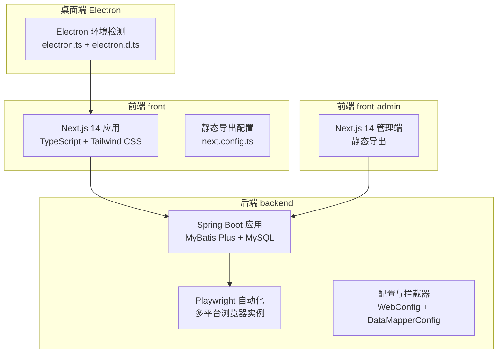
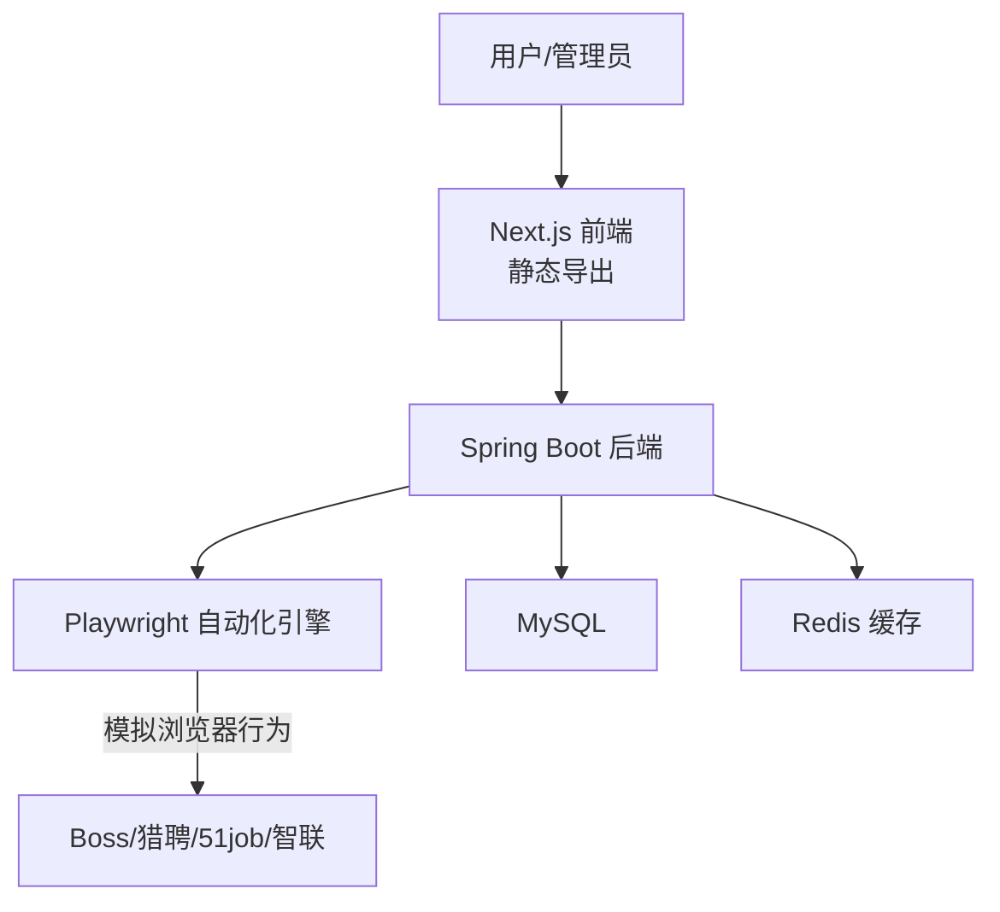
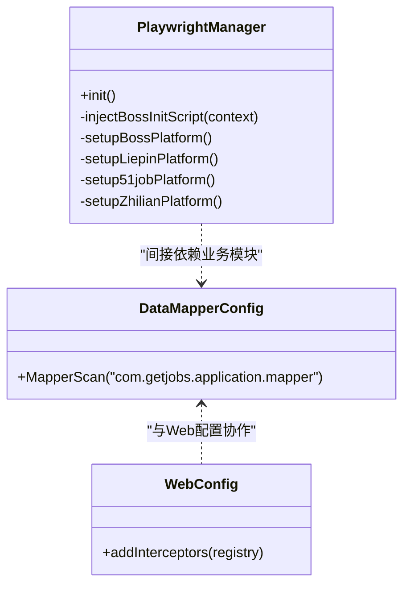
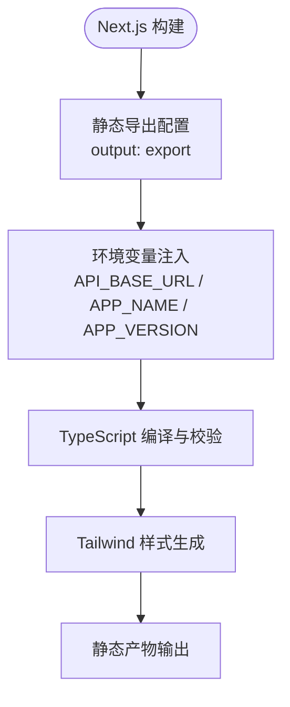
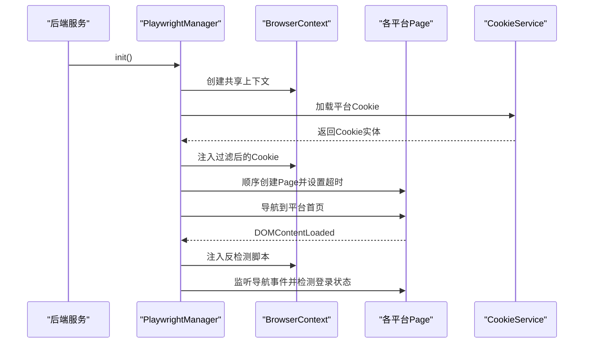
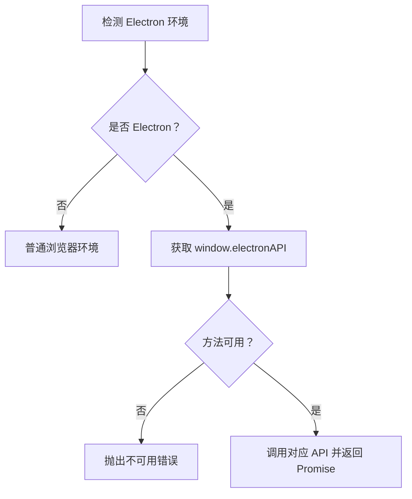
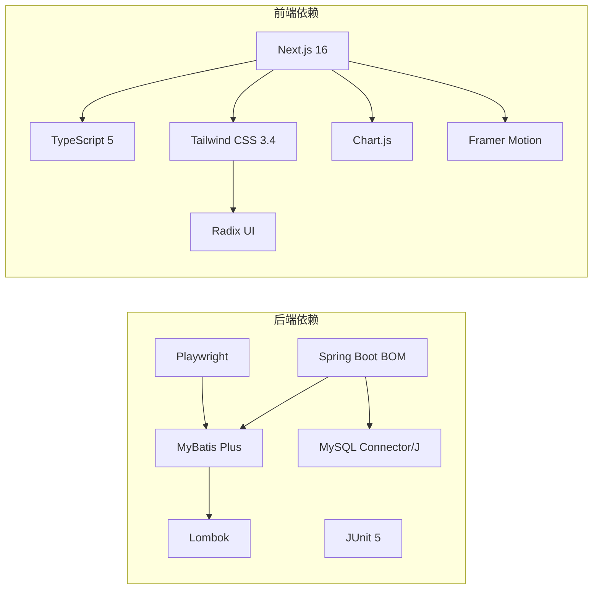

# 技术栈选型

<cite>
**本文引用的文件**
- [backend/pom.xml](file://backend/pom.xml)
- [backend/src/main/resources/application.yaml](file://backend/src/main/resources/application.yaml)
- [backend/src/main/java/com/getjobs/application/config/DataMapperConfig.java](file://backend/src/main/java/com/getjobs/application/config/DataMapperConfig.java)
- [backend/src/main/java/com/getjobs/application/config/WebConfig.java](file://backend/src/main/java/com/getjobs/application/config/WebConfig.java)
- [backend/src/main/java/com/getjobs/worker/manager/PlaywrightManager.java](file://backend/src/main/java/com/getjobs/worker/manager/PlaywrightManager.java)
- [front/package.json](file://front/package.json)
- [front/next.config.ts](file://front/next.config.ts)
- [front/tailwind.config.ts](file://front/tailwind.config.ts)
- [front/tsconfig.json](file://front/tsconfig.json)
- [front/lib/electron.ts](file://front/lib/electron.ts)
- [front/types/electron.d.ts](file://front/types/electron.d.ts)
- [front-admin/package.json](file://front-admin/package.json)
- [front-admin/next.config.ts](file://front-admin/next.config.ts)
</cite>

## 目录
1. [引言](#引言)
2. [项目结构](#项目结构)
3. [核心组件](#核心组件)
4. [架构总览](#架构总览)
5. [详细组件分析](#详细组件分析)
6. [依赖分析](#依赖分析)
7. [性能考虑](#性能考虑)
8. [故障排查指南](#故障排查指南)
9. [结论](#结论)
10. [附录](#附录)

## 引言
本技术栈选型文档面向 GetJobs 系统，系统采用前后端分离架构，后端以 Spring Boot 3.x + MyBatis Plus + MySQL + Redis 为核心，前端以 Next.js 14 + TypeScript + Tailwind CSS 为主，自动化能力通过 Playwright 1.x 实现，桌面端集成 Electron 以提供本地化体验。本文将从技术选型理由、版本兼容性、生态优势、替代方案取舍、依赖版本管理、构建工具配置、开发环境要求、升级路径与维护策略等方面进行系统阐述，帮助技术团队评估与选择合适的技术方案。

## 项目结构
GetJobs 仓库采用多模块结构：
- backend：基于 Spring Boot 的后端服务，负责业务 API、数据持久化、定时任务、Playwright 自动化等
- front：用户端前端（Next.js 14），静态导出部署
- front-admin：管理端前端（Next.js 14），静态导出部署
- scripts：迁移脚本与启动批处理
- 脚本与配置：Maven、YAML、Next/Tailwind/TypeScript 等配置文件

图示来源
- [backend/src/main/java/com/getjobs/application/config/WebConfig.java:14-36](file://backend/src/main/java/com/getjobs/application/config/WebConfig.java#L14-L36)
- [backend/src/main/java/com/getjobs/application/config/DataMapperConfig.java:10-13](file://backend/src/main/java/com/getjobs/application/config/DataMapperConfig.java#L10-L13)
- [backend/src/main/java/com/getjobs/worker/manager/PlaywrightManager.java:40-221](file://backend/src/main/java/com/getjobs/worker/manager/PlaywrightManager.java#L40-L221)
- [front/next.config.ts:6-20](file://front/next.config.ts#L6-L20)
- [front-admin/next.config.ts:3-9](file://front-admin/next.config.ts#L3-L9)
- [front/lib/electron.ts:6-27](file://front/lib/electron.ts#L6-L27)
- [front/types/electron.d.ts:3-71](file://front/types/electron.d.ts#L3-L71)

章节来源
- [backend/pom.xml:8-40](file://backend/pom.xml#L8-L40)
- [backend/src/main/resources/application.yaml:1-91](file://backend/src/main/resources/application.yaml#L1-L91)
- [front/package.json:1-43](file://front/package.json#L1-L43)
- [front-admin/package.json:1-41](file://front-admin/package.json#L1-L41)

## 核心组件
- 后端框架与持久化
  - Spring Boot 3.5.7（Java 21）+ MyBatis Plus 3.5.9：提供现代化依赖管理、自动配置与代码生成能力，适配 Java 21 与 Spring 3.x 生态
  - 数据源与连接池：HikariCP（maximum-pool-size、idle-timeout、max-lifetime 等配置）
  - 数据库：MySQL（驱动与连接字符串在 YAML 中配置）
  - Redis：作为缓存与会话存储（在 YAML 中声明，具体使用见业务模块）
- 自动化与浏览器控制
  - Playwright 1.51.0：多平台共享 BrowserContext、Cookie 管理、超时与重试策略、资源拦截、反检测脚本注入
- 前端框架与样式
  - Next.js 16.0.1（用户端与管理端均使用）：App Router、静态导出、TypeScript、Tailwind CSS
  - Tailwind CSS 3.4.17：原子化样式、暗色模式、自定义主题与阴影系统
  - TypeScript 5：严格类型检查与工程化配置
- 桌面端集成
  - Electron 环境检测与 API 调用封装：isElectron、getElectronAPI、callElectronAPI；类型定义覆盖投递、配置、计费、设备、后端状态、更新管理等

章节来源
- [backend/pom.xml:43-188](file://backend/pom.xml#L43-L188)
- [backend/src/main/resources/application.yaml:13-91](file://backend/src/main/resources/application.yaml#L13-L91)
- [backend/src/main/java/com/getjobs/worker/manager/PlaywrightManager.java:40-221](file://backend/src/main/java/com/getjobs/worker/manager/PlaywrightManager.java#L40-L221)
- [front/package.json:12-41](file://front/package.json#L12-L41)
- [front-admin/package.json:11-40](file://front-admin/package.json#L11-L40)
- [front/tailwind.config.ts:1-138](file://front/tailwind.config.ts#L1-L138)
- [front/tsconfig.json:1-47](file://front/tsconfig.json#L1-L47)
- [front/lib/electron.ts:6-49](file://front/lib/electron.ts#L6-L49)
- [front/types/electron.d.ts:3-191](file://front/types/electron.d.ts#L3-L191)

## 架构总览
系统采用“后端 API + 前端静态导出 + 桌面端 Electron”的分层架构。后端提供 REST 接口与 Playwright 自动化能力，前端通过 Next.js 静态导出部署，桌面端通过 Electron 提供本地化交互与系统集成。

图示来源
- [backend/src/main/resources/application.yaml:13-22](file://backend/src/main/resources/application.yaml#L13-L22)
- [backend/src/main/java/com/getjobs/worker/manager/PlaywrightManager.java:40-221](file://backend/src/main/java/com/getjobs/worker/manager/PlaywrightManager.java#L40-L221)
- [front/next.config.ts:6-20](file://front/next.config.ts#L6-L20)

## 详细组件分析

### 后端技术栈（Spring Boot 3.x + MyBatis Plus + MySQL + Redis）
- Spring Boot 3.5.7（Java 21）
  - 使用 spring-boot-starter-parent 管理依赖版本，配合 Maven 插件链路（Boot Maven Plugin、Compiler、Surefire）
  - 通过 application.yaml 配置数据源、日志、MyBatis Plus、JWT、Playwright 参数等
- MyBatis Plus 3.5.9
  - Mapper 扫描配置在 DataMapperConfig 中统一管理
  - YAML 中开启下划线转驼峰、全局 Banner、Mapper XML 路径等
- 数据库与连接池
  - MySQL Connector/J 8.0.28，HikariCP 连接池参数在 YAML 中集中配置
- 安全与拦截
  - WebConfig 注册 JWT 拦截器，排除健康检查、登录注册、Actuator 等路径
- 自动化与浏览器
  - Playwright 1.51.0：共享 BrowserContext、多平台标签页、Cookie 管理、超时与重试、资源拦截、反检测脚本注入
- 缓存
  - Redis 在 YAML 中声明，结合业务模块实现缓存与会话存储

图示来源
- [backend/src/main/java/com/getjobs/application/config/DataMapperConfig.java:10-13](file://backend/src/main/java/com/getjobs/application/config/DataMapperConfig.java#L10-L13)
- [backend/src/main/java/com/getjobs/application/config/WebConfig.java:14-36](file://backend/src/main/java/com/getjobs/application/config/WebConfig.java#L14-L36)
- [backend/src/main/java/com/getjobs/worker/manager/PlaywrightManager.java:40-221](file://backend/src/main/java/com/getjobs/worker/manager/PlaywrightManager.java#L40-L221)

章节来源
- [backend/pom.xml:8-40](file://backend/pom.xml#L8-L40)
- [backend/src/main/resources/application.yaml:13-91](file://backend/src/main/resources/application.yaml#L13-L91)
- [backend/src/main/java/com/getjobs/application/config/DataMapperConfig.java:10-13](file://backend/src/main/java/com/getjobs/application/config/DataMapperConfig.java#L10-L13)
- [backend/src/main/java/com/getjobs/application/config/WebConfig.java:14-36](file://backend/src/main/java/com/getjobs/application/config/WebConfig.java#L14-L36)
- [backend/src/main/java/com/getjobs/worker/manager/PlaywrightManager.java:40-221](file://backend/src/main/java/com/getjobs/worker/manager/PlaywrightManager.java#L40-L221)

### 前端技术栈（Next.js 14 + TypeScript + Tailwind CSS）
- Next.js 16.0.1（用户端与管理端一致）
  - 用户端：静态导出（output: export），禁用图片优化（images.unoptimized: true）
  - 管理端：静态导出，trailingSlash: true
  - 通过 next.config.ts 暴露 API 基础地址、应用名称与版本到客户端环境变量
- TypeScript 5
  - tsconfig.json 启用严格模式、ESNext 模块解析、React JSX、路径别名 @/*
- Tailwind CSS 3.4.17
  - 自定义主题色、圆角、阴影、字体与间距，支持暗色模式与动画插件

图示来源
- [front/next.config.ts:6-20](file://front/next.config.ts#L6-L20)
- [front-admin/next.config.ts:3-9](file://front-admin/next.config.ts#L3-L9)
- [front/tsconfig.json:25-29](file://front/tsconfig.json#L25-L29)
- [front/tailwind.config.ts:1-138](file://front/tailwind.config.ts#L1-L138)

章节来源
- [front/package.json:12-41](file://front/package.json#L12-L41)
- [front/next.config.ts:6-20](file://front/next.config.ts#L6-L20)
- [front-admin/package.json:11-40](file://front-admin/package.json#L11-L40)
- [front-admin/next.config.ts:3-9](file://front-admin/next.config.ts#L3-L9)
- [front/tsconfig.json:1-47](file://front/tsconfig.json#L1-L47)
- [front/tailwind.config.ts:1-138](file://front/tailwind.config.ts#L1-L138)

### 自动化技术栈（Playwright 1.x）
- 多平台共享 BrowserContext 与标签页，统一注入反检测脚本
- Cookie 管理：从数据库加载 Cookie 并注入上下文，支持按域过滤
- 超时与重试：平台差异化超时、最大重试次数、基础与最大退避延迟
- 资源拦截：可选启用，降低内存占用
- 登录状态监控：监听导航事件，动态检测登录状态变化

图示来源
- [backend/src/main/java/com/getjobs/worker/manager/PlaywrightManager.java:114-221](file://backend/src/main/java/com/getjobs/worker/manager/PlaywrightManager.java#L114-L221)
- [backend/src/main/resources/application.yaml:60-91](file://backend/src/main/resources/application.yaml#L60-L91)

章节来源
- [backend/src/main/java/com/getjobs/worker/manager/PlaywrightManager.java:40-221](file://backend/src/main/java/com/getjobs/worker/manager/PlaywrightManager.java#L40-L221)
- [backend/src/main/resources/application.yaml:60-91](file://backend/src/main/resources/application.yaml#L60-L91)

### 桌面端技术栈（Electron）
- 环境检测：isElectron 判断渲染进程、主进程与用户代理
- API 封装：getElectronAPI 获取 window.electronAPI，callElectronAPI 安全调用
- 类型定义：electron.d.ts 提供投递、配置、计费、浏览器、设备、后端状态、更新、日志等完整接口定义

图示来源
- [front/lib/electron.ts:6-49](file://front/lib/electron.ts#L6-L49)
- [front/types/electron.d.ts:3-71](file://front/types/electron.d.ts#L3-L71)

章节来源
- [front/lib/electron.ts:6-49](file://front/lib/electron.ts#L6-L49)
- [front/types/electron.d.ts:3-191](file://front/types/electron.d.ts#L3-L191)

## 依赖分析
- 后端依赖管理
  - Spring Boot BOM：统一管理 Spring 生态依赖
  - MyBatis Plus：代码生成器与 ORM 能力
  - Playwright：浏览器自动化
  - MySQL Connector/J：数据库驱动
  - Lombok：注解简化（provided）
  - JUnit 5：测试框架
- 前端依赖管理
  - Next.js 16.0.1、React 19、TypeScript 5
  - Tailwind CSS 3.4.17、Radix UI、Lucide React、Chart.js、Framer Motion
  - ESLint、PostCSS、Autoprefixer

图示来源
- [backend/pom.xml:43-188](file://backend/pom.xml#L43-L188)
- [front/package.json:12-41](file://front/package.json#L12-L41)
- [front-admin/package.json:11-40](file://front-admin/package.json#L11-L40)

章节来源
- [backend/pom.xml:43-188](file://backend/pom.xml#L43-L188)
- [front/package.json:12-41](file://front/package.json#L12-L41)
- [front-admin/package.json:11-40](file://front-admin/package.json#L11-L40)

## 性能考虑
- 后端
  - HikariCP 连接池参数（最大池大小、空闲超时、最大生命周期）直接影响数据库连接性能与稳定性
  - MyBatis Plus 代码生成与 XML Mapper 有助于减少手写 SQL 的开销
  - Playwright 资源拦截可降低内存占用，但需权衡网络请求完整性
- 前端
  - 静态导出减少运行时渲染压力，提升首屏性能
  - Tailwind 原子化样式与 Tree Shaking 配合，建议在生产构建中启用最小化
- 自动化
  - 平台差异化超时与重试策略可提高稳定性，但会增加整体耗时
  - 登录状态监控与 Cookie 刷新策略需避免频繁 IO 与网络请求

## 故障排查指南
- Playwright 初始化失败
  - 检查 Chromium 路径与安装状态，确保执行 npx playwright install chromium
  - 关注慢动作（slow-mo）与导航超时配置，必要时调整
- 登录状态检测异常
  - 平台选择器与元素可见性变化可能导致检测失败，建议增加健壮性判断与重试
- 数据库连接问题
  - 核对 application.yaml 中的 JDBC URL、驱动类名、用户名与密码
  - 检查 HikariCP 连接池参数与最大连接数
- 前端静态导出
  - images.unoptimized: true 与静态导出不兼容，需保持该配置
  - 确保 next.config.ts 中的环境变量正确注入

章节来源
- [backend/src/main/java/com/getjobs/worker/manager/PlaywrightManager.java:127-136](file://backend/src/main/java/com/getjobs/worker/manager/PlaywrightManager.java#L127-L136)
- [backend/src/main/resources/application.yaml:13-22](file://backend/src/main/resources/application.yaml#L13-L22)
- [front/next.config.ts:14-19](file://front/next.config.ts#L14-L19)

## 结论
GetJobs 技术栈在后端、前端与自动化方面形成了清晰的分工与互补：Spring Boot 3.x + MyBatis Plus + MySQL + Redis 提供稳定的服务端基础设施；Next.js 14 + TypeScript + Tailwind CSS 实现高性能静态前端；Playwright 1.x 实现跨平台浏览器自动化；Electron 提供桌面端集成能力。该选型兼顾了开发效率、运行性能与可维护性，适合中小规模到中等规模的业务场景。后续升级应关注 Java LTS（Java 21）与 Spring Boot 3.x 生态演进，以及 Next.js 与 Playwright 的版本兼容性。

## 附录

### 版本兼容性与生态优势
- Spring Boot 3.5.7（Java 21）
  - 生态成熟，依赖管理完善，与 MyBatis Plus 3.5.9 兼容良好
- MyBatis Plus 3.5.9
  - 代码生成器与 XML Mapper 丰富，与 Spring Boot 3.x 集成顺畅
- MySQL Connector/J 8.0.28
  - 与 MySQL 8.x 兼容，连接池参数可调
- Playwright 1.51.0
  - 多平台支持、稳定的 API 与强大的调试能力
- Next.js 16.0.1 + TypeScript 5 + Tailwind CSS 3.4
  - App Router 与静态导出结合，TypeScript 提供强类型保障，Tailwind 原子化样式提升开发效率

章节来源
- [backend/pom.xml:12-12](file://backend/pom.xml#L12-L12)
- [backend/pom.xml:32-34](file://backend/pom.xml#L32-L34)
- [backend/pom.xml:54-55](file://backend/pom.xml#L54-L55)
- [backend/pom.xml:82-87](file://backend/pom.xml#L82-L87)
- [front/package.json:21-21](file://front/package.json#L21-L21)
- [front/package.json:40-40](file://front/package.json#L40-L40)
- [front/package.json:39-39](file://front/package.json#L39-L39)

### 替代方案与取舍
- 后端
  - Spring Boot vs Micronaut/Quarkus：前者生态成熟、学习成本低；后者在启动速度与资源占用上有优势
  - MyBatis vs Hibernate/JPA：MyBatis 对复杂 SQL 更友好；JPA 开发效率更高但定制性较弱
- 前端
  - Next.js vs Nuxt/Vite：Next.js 在 SSR/静态导出与 App Router 方面成熟；Nuxt 适合 Vue 生态；Vite 更轻量
- 自动化
  - Playwright vs Selenium：Playwright 在多浏览器、稳定性与调试能力上更优；Selenium 生态广泛但配置复杂
- 桌面端
  - Electron vs Tauri：Electron 社区成熟、生态丰富；Tauri 更轻量、更安全

### 依赖版本管理与构建工具
- Maven
  - 使用 spring-boot-starter-parent 管理 Spring 生态版本，properties 统一管理非 BOM 依赖版本
  - maven-compiler-plugin 配置 Java 21、Lombok APT 与编码
  - spring-boot-maven-plugin 打包可执行 JAR 与 build-info
- npm/pnpm
  - package.json scripts 定义 dev/build/start/lint
  - next.config.ts 暴露环境变量，静态导出配置
  - tsconfig.json 启用严格模式与 ESNext 解析

章节来源
- [backend/pom.xml:24-40](file://backend/pom.xml#L24-L40)
- [backend/pom.xml:224-243](file://backend/pom.xml#L224-L243)
- [backend/pom.xml:194-221](file://backend/pom.xml#L194-L221)
- [front/package.json:5-11](file://front/package.json#L5-L11)
- [front/next.config.ts:6-20](file://front/next.config.ts#L6-L20)
- [front/tsconfig.json:1-47](file://front/tsconfig.json#L1-L47)

### 开发环境要求
- 后端
  - JDK 21、Maven、MySQL、Redis（可选）
  - Playwright 依赖 Chromium，首次运行需执行 npx playwright install chromium
- 前端
  - Node.js（推荐使用 pnpm）、Next.js 16、TypeScript 5、Tailwind CLI
- 桌面端
  - Electron 环境（可选），确保 window.electronAPI 可用

章节来源
- [backend/src/main/resources/application.yaml:13-22](file://backend/src/main/resources/application.yaml#L13-L22)
- [backend/src/main/java/com/getjobs/worker/manager/PlaywrightManager.java:127-136](file://backend/src/main/java/com/getjobs/worker/manager/PlaywrightManager.java#L127-L136)
- [front/package.json:12-41](file://front/package.json#L12-L41)
- [front-admin/package.json:11-40](file://front-admin/package.json#L11-L40)

### 升级路径与维护策略
- 后端
  - Spring Boot：跟随 LTS（Java 21）与 Spring Boot 3.x 主版本演进，逐步升级 MyBatis Plus 与数据库驱动
  - Playwright：关注新版本 API 变更与浏览器兼容性，保留平台差异化超时配置
- 前端
  - Next.js：关注 App Router 与静态导出的变更，保持 TypeScript 严格模式
  - Tailwind：关注新版本的原子类与暗色模式特性，避免过时类名
- 自动化
  - 增加重试与超时策略的可观测性指标，定期评估平台选择器稳定性
- 桌面端
  - Electron：关注主进程与渲染进程 API 变更，保持 isElectron 与 API 封装的向后兼容