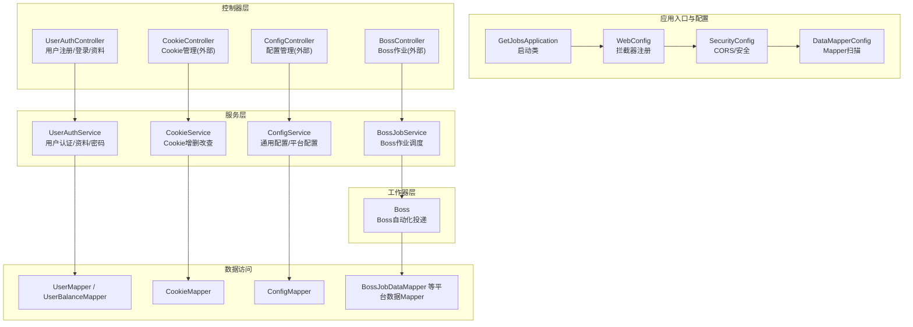
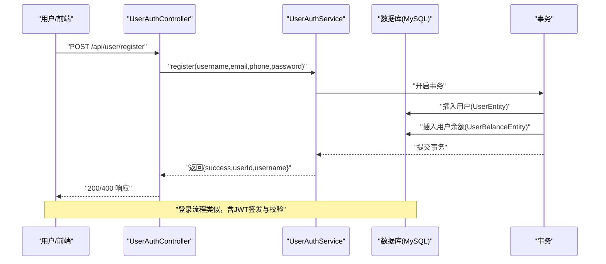
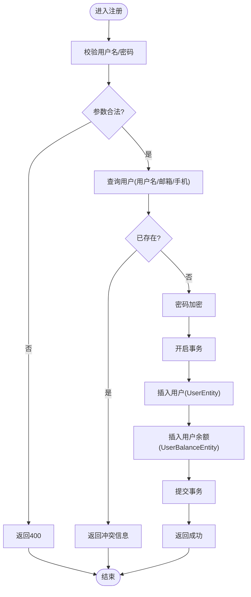
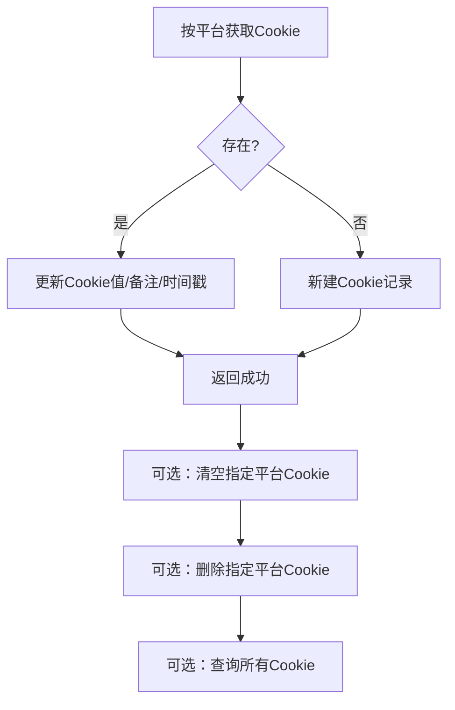
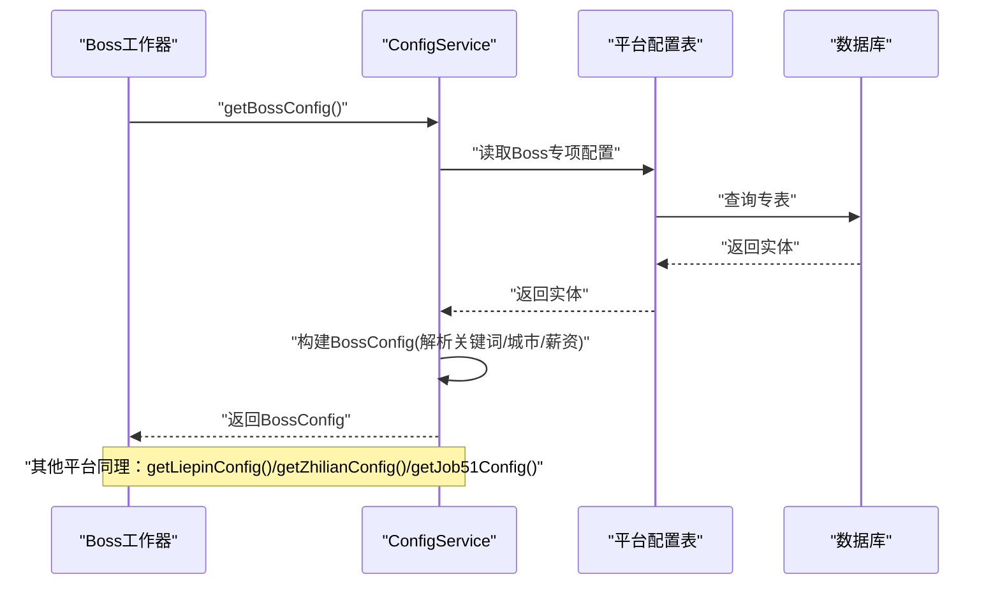
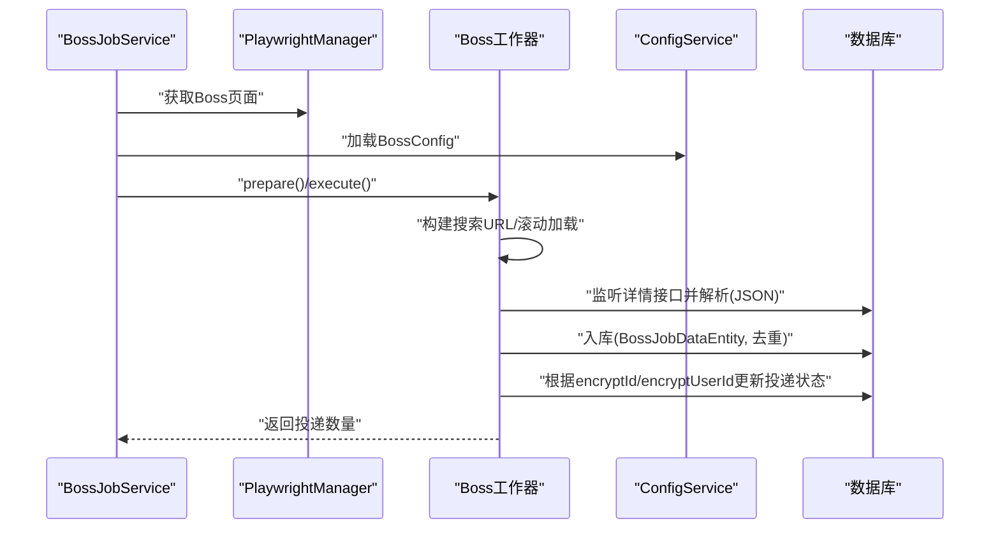
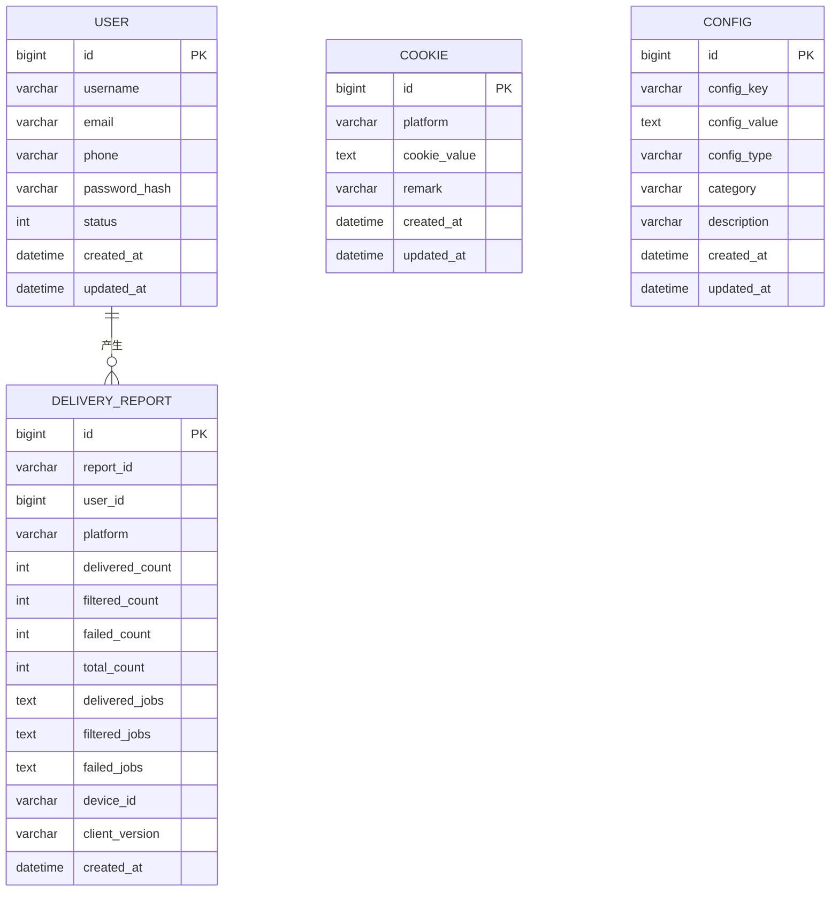
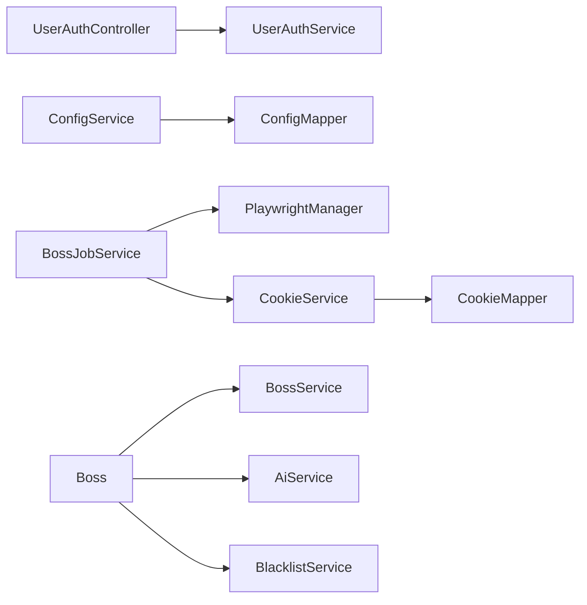

# 数据流设计

<cite>
**本文引用的文件**
- [GetJobsApplication.java](file://backend/src/main/java/com/getjobs/GetJobsApplication.java)
- [application.yaml](file://backend/src/main/resources/application.yaml)
- [WebConfig.java](file://backend/src/main/java/com/getjobs/application/config/WebConfig.java)
- [SecurityConfig.java](file://backend/src/main/java/com/getjobs/application/config/SecurityConfig.java)
- [DataMapperConfig.java](file://backend/src/main/java/com/getjobs/application/config/DataMapperConfig.java)
- [UserAuthController.java](file://backend/src/main/java/com/getjobs/application/controller/UserAuthController.java)
- [UserAuthService.java](file://backend/src/main/java/com/getjobs/application/service/UserAuthService.java)
- [CookieService.java](file://backend/src/main/java/com/getjobs/application/service/CookieService.java)
- [ConfigService.java](file://backend/src/main/java/com/getjobs/application/service/ConfigService.java)
- [UserEntity.java](file://backend/src/main/java/com/getjobs/application/entity/UserEntity.java)
- [CookieEntity.java](file://backend/src/main/java/com/getjobs/application/entity/CookieEntity.java)
- [ConfigEntity.java](file://backend/src/main/java/com/getjobs/application/entity/ConfigEntity.java)
- [DeliveryReportEntity.java](file://backend/src/main/java/com/getjobs/application/entity/DeliveryReportEntity.java)
- [Boss.java](file://backend/src/main/java/com/getjobs/worker/boss/Boss.java)
- [BossJobService.java](file://backend/src/main/java/com/getjobs/worker/service/BossJobService.java)
</cite>

## 目录
1. [简介](#简介)
2. [项目结构](#项目结构)
3. [核心组件](#核心组件)
4. [架构总览](#架构总览)
5. [详细组件分析](#详细组件分析)
6. [依赖分析](#依赖分析)
7. [性能考虑](#性能考虑)
8. [故障排查指南](#故障排查指南)
9. [结论](#结论)
10. [附录](#附录)

## 简介
本文件面向数据架构师与后端开发者，系统化梳理 GetJobs 系统的数据流设计。重点覆盖以下方面：
- 用户数据生命周期：注册、登录、资料与计费信息的流转与持久化
- Cookie 数据：平台 Cookie 的采集、存储、更新与清理
- 配置数据：通用配置与平台专项配置的读取、构建与同步
- 求职记录数据：自动化引擎抓取、过滤、入库与投递状态更新
- 数据一致性与并发控制：事务边界、幂等与并发安全
- 数据流向图、数据模型关系图与事务处理流程图

## 项目结构
后端采用 Spring Boot + MyBatis-Plus 架构，核心模块划分如下：
- 应用入口与配置：应用启动类、Web MVC 与安全配置、MyBatis Mapper 扫描
- 控制器层：用户认证、Cookie、配置、平台作业等 API
- 服务层：用户认证、Cookie、配置、平台作业调度与执行
- 工作器层：Playwright 驱动的各平台自动化投递实现
- 实体与映射：用户、Cookie、配置、投递报告等实体与 Mapper

图表来源
- [GetJobsApplication.java:15-21](file://backend/src/main/java/com/getjobs/GetJobsApplication.java#L15-L21)
- [WebConfig.java:26-35](file://backend/src/main/java/com/getjobs/application/config/WebConfig.java#L26-L35)
- [SecurityConfig.java:25-44](file://backend/src/main/java/com/getjobs/application/config/SecurityConfig.java#L25-L44)
- [DataMapperConfig.java:10-13](file://backend/src/main/java/com/getjobs/application/config/DataMapperConfig.java#L10-L13)
- [UserAuthController.java:15-20](file://backend/src/main/java/com/getjobs/application/controller/UserAuthController.java#L15-L20)
- [CookieService.java:16-21](file://backend/src/main/java/com/getjobs/application/service/CookieService.java#L16-L21)
- [ConfigService.java:24-32](file://backend/src/main/java/com/getjobs/application/service/ConfigService.java#L24-L32)
- [BossJobService.java:23-31](file://backend/src/main/java/com/getjobs/worker/service/BossJobService.java#L23-L31)
- [Boss.java:41-45](file://backend/src/main/java/com/getjobs/worker/boss/Boss.java#L41-L45)

章节来源
- [GetJobsApplication.java:15-21](file://backend/src/main/java/com/getjobs/GetJobsApplication.java#L15-L21)
- [application.yaml:13-27](file://backend/src/main/resources/application.yaml#L13-L27)
- [WebConfig.java:26-35](file://backend/src/main/java/com/getjobs/application/config/WebConfig.java#L26-L35)
- [SecurityConfig.java:25-44](file://backend/src/main/java/com/getjobs/application/config/SecurityConfig.java#L25-L44)
- [DataMapperConfig.java:10-13](file://backend/src/main/java/com/getjobs/application/config/DataMapperConfig.java#L10-L13)

## 核心组件
- 用户认证与资料：UserAuthController 提供注册、登录、获取/更新资料、修改密码；UserAuthService 负责业务逻辑与事务控制
- Cookie 管理：CookieService 提供按平台读取、保存/更新、清空、删除与全量查询
- 配置管理：ConfigService 提供通用配置读取、批量更新、平台专项配置构建（如 Boss/Liepin/Zhilian/Job51）
- 平台作业调度：BossJobService 负责获取页面实例、加载配置、执行投递并回调进度
- 自动化引擎：Boss 工作器负责页面交互、数据抓取、过滤、入库与投递状态更新

章节来源
- [UserAuthController.java:25-167](file://backend/src/main/java/com/getjobs/application/controller/UserAuthController.java#L25-L167)
- [UserAuthService.java:49-311](file://backend/src/main/java/com/getjobs/application/service/UserAuthService.java#L49-L311)
- [CookieService.java:27-96](file://backend/src/main/java/com/getjobs/application/service/CookieService.java#L27-L96)
- [ConfigService.java:38-287](file://backend/src/main/java/com/getjobs/application/service/ConfigService.java#L38-L287)
- [BossJobService.java:37-143](file://backend/src/main/java/com/getjobs/worker/service/BossJobService.java#L37-L143)
- [Boss.java:112-125](file://backend/src/main/java/com/getjobs/worker/boss/Boss.java#L112-L125)

## 架构总览
系统采用“控制器-服务-工作器-数据访问”的分层架构，配合 Playwright 进行浏览器自动化，数据通过 MyBatis-Plus 持久化到 MySQL。

图表来源
- [UserAuthController.java:28-56](file://backend/src/main/java/com/getjobs/application/controller/UserAuthController.java#L28-L56)
- [UserAuthService.java:49-113](file://backend/src/main/java/com/getjobs/application/service/UserAuthService.java#L49-L113)
- [UserEntity.java:14-40](file://backend/src/main/java/com/getjobs/application/entity/UserEntity.java#L14-L40)

## 详细组件分析

### 用户注册与登录数据流
- 注册：校验参数合法性 → 查询用户名/邮箱/手机是否存在 → 密码加密 → 插入用户与余额记录 → 返回成功
- 登录：按用户名/邮箱/手机查询用户 → 验证密码与状态 → 生成 JWT → 返回令牌与用户信息
- 资料与密码：支持获取、更新资料、修改密码，均在事务内完成

图表来源
- [UserAuthController.java:28-56](file://backend/src/main/java/com/getjobs/application/controller/UserAuthController.java#L28-L56)
- [UserAuthService.java:49-113](file://backend/src/main/java/com/getjobs/application/service/UserAuthService.java#L49-L113)

章节来源
- [UserAuthController.java:28-167](file://backend/src/main/java/com/getjobs/application/controller/UserAuthController.java#L28-L167)
- [UserAuthService.java:112-311](file://backend/src/main/java/com/getjobs/application/service/UserAuthService.java#L112-L311)

### Cookie 数据流
- 读取：按平台取最新一条 Cookie
- 写入：若存在则更新，否则新建
- 清空：按平台清空 Cookie 值并更新备注
- 删除：按平台删除
- 查询：全量列出

图表来源
- [CookieService.java:27-96](file://backend/src/main/java/com/getjobs/application/service/CookieService.java#L27-L96)
- [CookieEntity.java:14-53](file://backend/src/main/java/com/getjobs/application/entity/CookieEntity.java#L14-L53)

章节来源
- [CookieService.java:27-96](file://backend/src/main/java/com/getjobs/application/service/CookieService.java#L27-L96)
- [CookieEntity.java:14-53](file://backend/src/main/java/com/getjobs/application/entity/CookieEntity.java#L14-L53)

### 配置数据流与同步机制
- 通用配置：读取为 Map、按分类查询、批量更新（不存在则创建）
- 平台专项配置：从各平台专表读取并构建对应 Config 对象（如 Boss/Liepin/Zhilian/Job51）
- 同步策略：服务层集中暴露统一读取方法，工作器按需拉取，避免分散配置源

图表来源
- [ConfigService.java:217-287](file://backend/src/main/java/com/getjobs/application/service/ConfigService.java#L217-L287)
- [BossJobService.java:65-87](file://backend/src/main/java/com/getjobs/worker/service/BossJobService.java#L65-L87)

章节来源
- [ConfigService.java:38-287](file://backend/src/main/java/com/getjobs/application/service/ConfigService.java#L38-L287)
- [BossJobService.java:65-87](file://backend/src/main/java/com/getjobs/worker/service/BossJobService.java#L65-L87)

### 求职记录数据流（自动化引擎）
- 页面准备：加载黑名单、调整表结构、准备页面
- 搜索与加载：按城市/关键词构建搜索 URL，滚动加载岗位卡片
- 详情解析与入库：监听岗位详情接口，解析 JSON，构建实体并入库（去重）
- 过滤策略：黑名单、HR活跃度、公共黑名单等
- 投递与状态更新：AI 打招呼/图片简历，成功/失败后更新投递状态

图表来源
- [BossJobService.java:37-104](file://backend/src/main/java/com/getjobs/worker/service/BossJobService.java#L37-L104)
- [Boss.java:112-125](file://backend/src/main/java/com/getjobs/worker/boss/Boss.java#L112-L125)
- [Boss.java:439-532](file://backend/src/main/java/com/getjobs/worker/boss/Boss.java#L439-L532)
- [Boss.java:747-777](file://backend/src/main/java/com/getjobs/worker/boss/Boss.java#L747-L777)

章节来源
- [BossJobService.java:37-143](file://backend/src/main/java/com/getjobs/worker/service/BossJobService.java#L37-L143)
- [Boss.java:112-125](file://backend/src/main/java/com/getjobs/worker/boss/Boss.java#L112-L125)
- [Boss.java:439-532](file://backend/src/main/java/com/getjobs/worker/boss/Boss.java#L439-L532)
- [Boss.java:747-777](file://backend/src/main/java/com/getjobs/worker/boss/Boss.java#L747-L777)

### 数据模型关系图

图表来源
- [UserEntity.java:14-40](file://backend/src/main/java/com/getjobs/application/entity/UserEntity.java#L14-L40)
- [CookieEntity.java:14-53](file://backend/src/main/java/com/getjobs/application/entity/CookieEntity.java#L14-L53)
- [ConfigEntity.java:14-65](file://backend/src/main/java/com/getjobs/application/entity/ConfigEntity.java#L14-L65)
- [DeliveryReportEntity.java:14-59](file://backend/src/main/java/com/getjobs/application/entity/DeliveryReportEntity.java#L14-L59)

## 依赖分析
- 控制器依赖服务：UserAuthController 依赖 UserAuthService；BossJobService 作为平台作业调度入口
- 服务依赖数据访问：UserAuthService 依赖 UserMapper/UserBalanceMapper；CookieService 依赖 CookieMapper；ConfigService 依赖 ConfigMapper 与各平台服务
- 工作器依赖服务：Boss 依赖 BossService/AiService/BlacklistService；BossJobService 依赖 PlaywrightManager 与 ConfigService
- 配置依赖：application.yaml 提供数据库、Jasypt 加密、JWT、Playwright Agent 等全局配置

图表来源
- [UserAuthController.java:19-23](file://backend/src/main/java/com/getjobs/application/controller/UserAuthController.java#L19-L23)
- [UserAuthService.java:31-34](file://backend/src/main/java/com/getjobs/application/service/UserAuthService.java#L31-L34)
- [CookieService.java:20](file://backend/src/main/java/com/getjobs/application/service/CookieService.java#L20)
- [ConfigService.java:28-32](file://backend/src/main/java/com/getjobs/application/service/ConfigService.java#L28-L32)
- [BossJobService.java:28-30](file://backend/src/main/java/com/getjobs/worker/service/BossJobService.java#L28-L30)
- [Boss.java:47-49](file://backend/src/main/java/com/getjobs/worker/boss/Boss.java#L47-L49)

章节来源
- [application.yaml:13-101](file://backend/src/main/resources/application.yaml#L13-L101)
- [WebConfig.java:26-35](file://backend/src/main/java/com/getjobs/application/config/WebConfig.java#L26-L35)
- [SecurityConfig.java:25-44](file://backend/src/main/java/com/getjobs/application/config/SecurityConfig.java#L25-L44)
- [DataMapperConfig.java:10-13](file://backend/src/main/java/com/getjobs/application/config/DataMapperConfig.java#L10-L13)

## 性能考虑
- 数据库连接池与超时：HikariCP 最大池大小、空闲/最大生存时间、连接测试查询
- Playwright 资源管理：最大页面数、空闲回收、超时与重试策略
- 事务边界：用户注册/更新资料/修改密码等关键操作使用事务，确保原子性
- 并发控制：Boss 投递任务运行状态与停止标志为 volatile，避免竞态；页面共享时暂停后台监控，避免并发访问同一 Page
- 缓存策略：当前未见显式缓存组件，建议对高频读取的配置与黑名单进行本地缓存与定期刷新

## 故障排查指南
- 用户认证
  - 参数校验失败：检查控制器参数校验与返回消息
  - 密码错误/账户禁用：检查 UserAuthService 登录逻辑与状态判断
  - JWT 生成/校验异常：检查密钥与过期时间配置
- Cookie 管理
  - 平台 Cookie 为空：确认保存/更新流程与平台字段
  - 清空/删除异常：检查更新条件与返回值
- 配置管理
  - 必填配置缺失：ConfigService.requireConfigValue 抛出异常，需补齐配置
  - 平台配置解析失败：检查关键词/城市/薪资映射逻辑
- 自动化引擎
  - 页面未初始化/未登录：BossJobService 在执行前进行校验并提示
  - 投递失败：检查聊天按钮定位、输入框可见性与发送按钮逻辑
  - 投递状态未更新：核对 encryptId/encryptUserId 提取与去重策略

章节来源
- [UserAuthController.java:35-80](file://backend/src/main/java/com/getjobs/application/controller/UserAuthController.java#L35-L80)
- [UserAuthService.java:122-168](file://backend/src/main/java/com/getjobs/application/service/UserAuthService.java#L122-L168)
- [CookieService.java:42-87](file://backend/src/main/java/com/getjobs/application/service/CookieService.java#L42-L87)
- [ConfigService.java:95-101](file://backend/src/main/java/com/getjobs/application/service/ConfigService.java#L95-L101)
- [BossJobService.java:44-56](file://backend/src/main/java/com/getjobs/worker/service/BossJobService.java#L44-L56)
- [Boss.java:613-777](file://backend/src/main/java/com/getjobs/worker/boss/Boss.java#L613-L777)

## 结论
本设计文档从数据流视角梳理了 GetJobs 系统的关键路径：用户数据、Cookie 数据、配置数据与求职记录数据的采集、验证、转换、存储与查询。通过明确的事务边界、并发控制与平台专项配置的集中管理，系统在保证数据一致性的同时，提供了可扩展的自动化投递能力。建议后续引入配置与黑名单的本地缓存、完善异常监控与重试策略，持续优化性能与稳定性。

## 附录
- 安全与跨域：禁用默认表单登录与 CSRF，使用 JWT 过滤器；CORS 允许凭据与预检缓存
- 数据库与加密：MySQL 连接配置与 Jasypt 加密密钥管理
- Playwright Agent：超时、重试、页面资源与 Cookie 刷新策略

章节来源
- [SecurityConfig.java:25-66](file://backend/src/main/java/com/getjobs/application/config/SecurityConfig.java#L25-L66)
- [application.yaml:13-101](file://backend/src/main/resources/application.yaml#L13-L101)