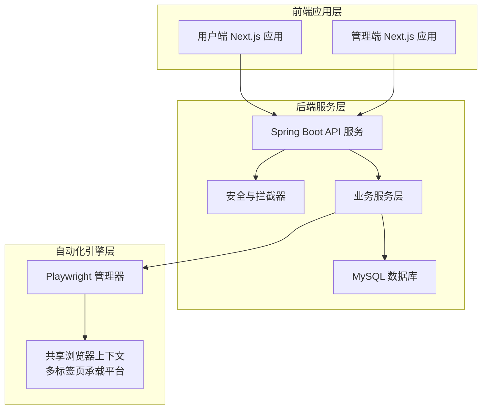
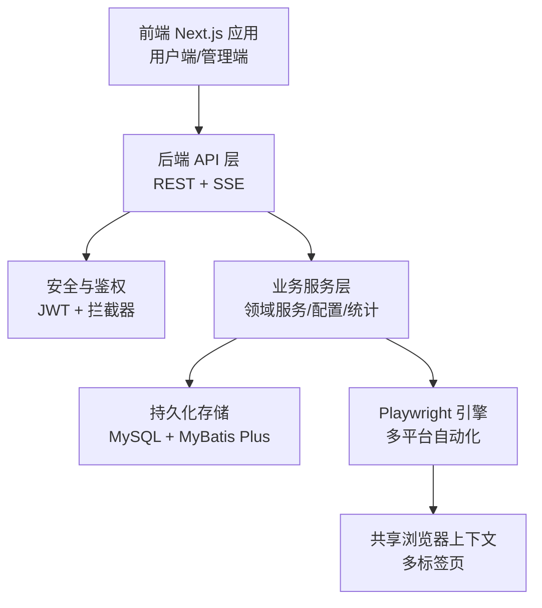
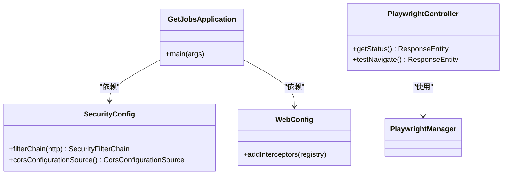
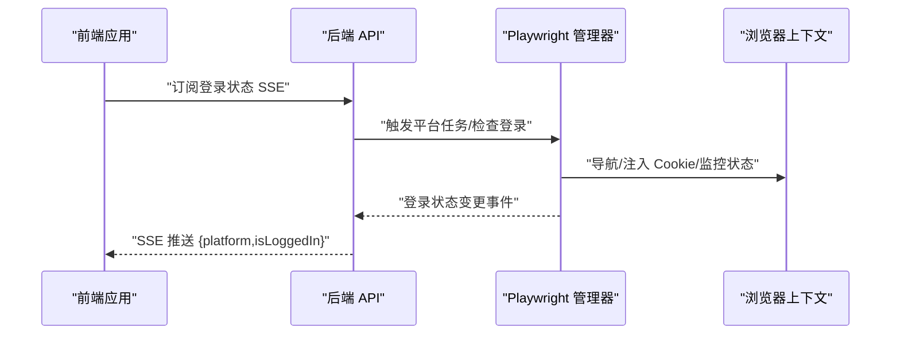
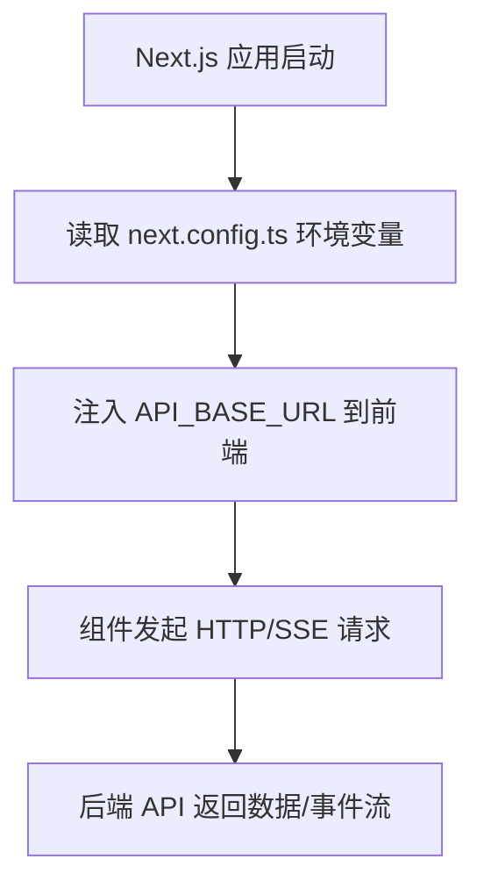
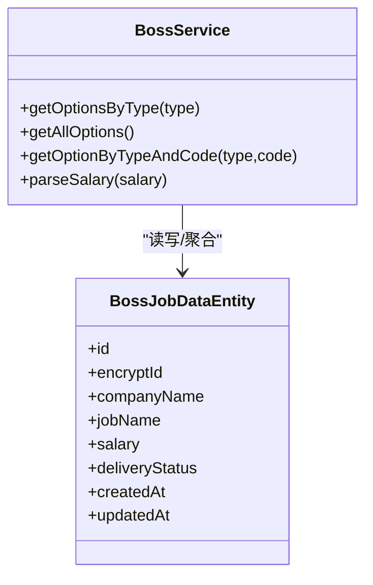
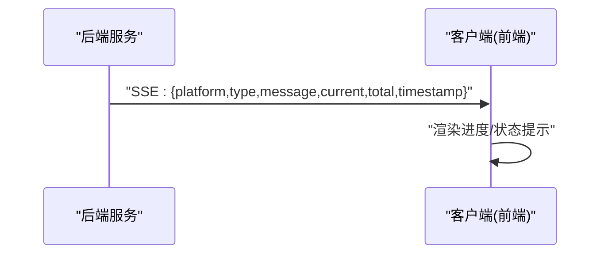
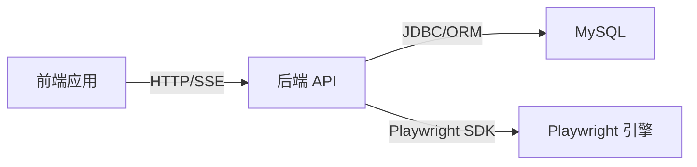

# 整体架构设计

<cite>
**本文引用的文件**
- [GetJobsApplication.java](file://backend/src/main/java/com/getjobs/GetJobsApplication.java)
- [application.yaml](file://backend/src/main/resources/application.yaml)
- [SecurityConfig.java](file://backend/src/main/java/com/getjobs/application/config/SecurityConfig.java)
- [WebConfig.java](file://backend/src/main/java/com/getjobs/application/config/WebConfig.java)
- [PlaywrightManager.java](file://backend/src/main/java/com/getjobs/worker/manager/PlaywrightManager.java)
- [PlaywrightController.java](file://backend/src/main/java/com/getjobs/application/controller/PlaywrightController.java)
- [BossService.java](file://backend/src/main/java/com/getjobs/application/service/BossService.java)
- [BossJobDataEntity.java](file://backend/src/main/java/com/getjobs/application/entity/BossJobDataEntity.java)
- [JobProgressMessage.java](file://backend/src/main/java/com/getjobs/worker/dto/JobProgressMessage.java)
- [api-config.ts](file://front/lib/api-config.ts)
- [layout.tsx（front）](file://front/app/layout.tsx)
- [layout.tsx（front-admin）](file://front-admin/app/layout.tsx)
- [package.json（front）](file://front/package.json)
- [package.json（front-admin）](file://front-admin/package.json)
- [next.config.ts](file://front/next.config.ts)
- [README.md](file://README.md)
</cite>

## 目录
1. [引言](#引言)
2. [项目结构](#项目结构)
3. [核心组件](#核心组件)
4. [架构总览](#架构总览)
5. [详细组件分析](#详细组件分析)
6. [依赖分析](#依赖分析)
7. [性能考量](#性能考量)
8. [故障排查指南](#故障排查指南)
9. [结论](#结论)
10. [附录](#附录)

## 引言
本设计文档面向架构师与技术负责人，系统化阐述 GetJobs 的三层架构设计：后端服务层（Spring Boot）、前端应用层（Next.js）、自动化引擎层（Playwright）。文档覆盖系统边界、组件划分、模块化理念、数据与控制流、时序与序列图、微服务演进思路、性能与安全考量，帮助读者快速把握系统顶层设计与实施要点。

## 项目结构
系统采用前后端分离与自动化引擎协同的三层架构：
- 后端服务层（Spring Boot）：提供 REST API、安全与鉴权、业务服务、持久化与定时调度。
- 前端应用层（Next.js）：用户界面与交互，包含用户端与管理端两个独立应用。
- 自动化引擎层（Playwright）：跨平台浏览器自动化，统一管理多求职平台的登录状态与任务执行。

图表来源
- [GetJobsApplication.java:15-22](file://backend/src/main/java/com/getjobs/GetJobsApplication.java#L15-L22)
- [application.yaml:28-29](file://backend/src/main/resources/application.yaml#L28-L29)
- [PlaywrightManager.java:40-84](file://backend/src/main/java/com/getjobs/worker/manager/PlaywrightManager.java#L40-L84)

章节来源
- [GetJobsApplication.java:15-22](file://backend/src/main/java/com/getjobs/GetJobsApplication.java#L15-L22)
- [application.yaml:1-91](file://backend/src/main/resources/application.yaml#L1-L91)
- [package.json（front）:1-43](file://front/package.json#L1-L43)
- [package.json（front-admin）:1-41](file://front-admin/package.json#L1-L41)
- [next.config.ts:1-23](file://front/next.config.ts#L1-L23)

## 核心组件
- 后端启动与配置
  - 启动类启用调度与异步能力，统一扫描包路径，作为服务层入口。
  - 应用配置集中于 YAML，涵盖数据库连接池、日志、MyBatis Plus、JWT、Playwright 引擎参数等。
- 安全与拦截
  - 基于 Spring Security 的 CORS 与禁用默认表单/CSRF，结合自定义 JWT 拦截器对 /api/** 路由进行鉴权。
- 自动化引擎
  - Playwright 管理器负责浏览器生命周期、共享上下文、多平台页面注册、Cookie 注入与登录状态监控、资源拦截与超时策略。
- 前端应用
  - 用户端与管理端分别打包与运行，通过统一的 API 基础地址与路由映射进行通信。

章节来源
- [GetJobsApplication.java:15-22](file://backend/src/main/java/com/getjobs/GetJobsApplication.java#L15-L22)
- [application.yaml:13-91](file://backend/src/main/resources/application.yaml#L13-L91)
- [SecurityConfig.java:20-68](file://backend/src/main/java/com/getjobs/application/config/SecurityConfig.java#L20-L68)
- [WebConfig.java:13-37](file://backend/src/main/java/com/getjobs/application/config/WebConfig.java#L13-L37)
- [PlaywrightManager.java:40-221](file://backend/src/main/java/com/getjobs/worker/manager/PlaywrightManager.java#L40-L221)
- [api-config.ts:1-99](file://front/lib/api-config.ts#L1-L99)
- [layout.tsx（front）:16-52](file://front/app/layout.tsx#L16-L52)
- [layout.tsx（front-admin）:13-25](file://front-admin/app/layout.tsx#L13-L25)

## 架构总览
三层架构边界清晰：
- 边界一：前端 Next.js 应用与后端 API 的 HTTP/SSE 交互。
- 边界二：后端服务与 Playwright 引擎的内部协作边界。
- 边界三：后端服务与数据库的数据边界。

图表来源
- [PlaywrightController.java:16-64](file://backend/src/main/java/com/getjobs/application/controller/PlaywrightController.java#L16-L64)
- [PlaywrightManager.java:114-221](file://backend/src/main/java/com/getjobs/worker/manager/PlaywrightManager.java#L114-L221)
- [SecurityConfig.java:25-44](file://backend/src/main/java/com/getjobs/application/config/SecurityConfig.java#L25-L44)
- [WebConfig.java:25-35](file://backend/src/main/java/com/getjobs/application/config/WebConfig.java#L25-L35)

## 详细组件分析

### 后端服务层（Spring Boot）
- 启动与扫描
  - 启动类启用调度与异步注解，扫描包路径为 com.getjobs，作为服务层入口。
- 配置与数据源
  - 数据源指向 MySQL，Hikari 连接池参数、MyBatis Plus 映射与驼峰规则、Mapper XML 路径均在 YAML 中集中配置。
- 安全与鉴权
  - 禁用默认表单登录与 CSRF，开启 CORS 并允许凭据；拦截器对 /api/** 路由生效，排除健康检查与登录注册等公开接口。
- 控制器与引擎对接
  - Playwright 控制器提供状态查询与导航测试接口，便于前端与运维验证引擎可用性。

图表来源
- [GetJobsApplication.java:15-22](file://backend/src/main/java/com/getjobs/GetJobsApplication.java#L15-L22)
- [SecurityConfig.java:20-68](file://backend/src/main/java/com/getjobs/application/config/SecurityConfig.java#L20-L68)
- [WebConfig.java:13-37](file://backend/src/main/java/com/getjobs/application/config/WebConfig.java#L13-L37)
- [PlaywrightController.java:16-64](file://backend/src/main/java/com/getjobs/application/controller/PlaywrightController.java#L16-L64)

章节来源
- [GetJobsApplication.java:15-22](file://backend/src/main/java/com/getjobs/GetJobsApplication.java#L15-L22)
- [application.yaml:13-52](file://backend/src/main/resources/application.yaml#L13-L52)
- [SecurityConfig.java:25-44](file://backend/src/main/java/com/getjobs/application/config/SecurityConfig.java#L25-L44)
- [WebConfig.java:25-35](file://backend/src/main/java/com/getjobs/application/config/WebConfig.java#L25-L35)
- [PlaywrightController.java:26-62](file://backend/src/main/java/com/getjobs/application/controller/PlaywrightController.java#L26-L62)

### 自动化引擎层（Playwright）
- 组件职责
  - 浏览器生命周期管理、共享上下文与多标签页、平台 Cookie 注入、登录状态监控、导航与超时策略、资源拦截与性能调优。
- 关键特性
  - 平台差异化超时配置、重试策略、空闲页面回收、Cookie 刷新策略、反检测脚本注入。
  - 登录状态变更通过 SSE 推送至前端，前端通过 EventSource 订阅。

图表来源
- [PlaywrightManager.java:254-331](file://backend/src/main/java/com/getjobs/worker/manager/PlaywrightManager.java#L254-L331)
- [PlaywrightManager.java:393-465](file://backend/src/main/java/com/getjobs/worker/manager/PlaywrightManager.java#L393-L465)
- [PlaywrightManager.java:584-686](file://backend/src/main/java/com/getjobs/worker/manager/PlaywrightManager.java#L584-L686)
- [application.yaml:60-91](file://backend/src/main/resources/application.yaml#L60-L91)

章节来源
- [PlaywrightManager.java:40-221](file://backend/src/main/java/com/getjobs/worker/manager/PlaywrightManager.java#L40-L221)
- [application.yaml:60-91](file://backend/src/main/resources/application.yaml#L60-L91)

### 前端应用层（Next.js）
- 用户端与管理端
  - 两套独立应用，分别打包与运行；用户端通过静态导出适配离线使用。
- API 配置与路由
  - 统一的 API 基础地址与路由映射，便于前端与后端协作；管理端布局封装通用 UI 结构。
- 安全与主题
  - 主题切换与用户上下文提供，动态导入 Electron 状态栏组件以适配桌面端场景。

图表来源
- [next.config.ts:6-20](file://front/next.config.ts#L6-L20)
- [api-config.ts:4-99](file://front/lib/api-config.ts#L4-L99)
- [layout.tsx（front）:16-52](file://front/app/layout.tsx#L16-L52)
- [layout.tsx（front-admin）:13-25](file://front-admin/app/layout.tsx#L13-L25)

章节来源
- [package.json（front）:1-43](file://front/package.json#L1-L43)
- [package.json（front-admin）:1-41](file://front-admin/package.json#L1-L41)
- [next.config.ts:1-23](file://front/next.config.ts#L1-L23)
- [api-config.ts:1-99](file://front/lib/api-config.ts#L1-L99)
- [layout.tsx（front）:16-52](file://front/app/layout.tsx#L16-L52)
- [layout.tsx（front-admin）:13-25](file://front-admin/app/layout.tsx#L13-L25)

### 业务服务与数据模型（示例：Boss 相关）
- 服务层职责
  - 统一管理 Boss 相关的选项、行业、配置与岗位数据，提供解析薪资、默认项维护、排序与查询等能力。
- 数据模型
  - BossJobDataEntity 描述岗位数据字段，包含公司、岗位、薪资、HR 信息、投递状态、创建/更新时间等。

图表来源
- [BossService.java:26-130](file://backend/src/main/java/com/getjobs/application/service/BossService.java#L26-L130)
- [BossJobDataEntity.java:14-108](file://backend/src/main/java/com/getjobs/application/entity/BossJobDataEntity.java#L14-L108)

章节来源
- [BossService.java:26-130](file://backend/src/main/java/com/getjobs/application/service/BossService.java#L26-L130)
- [BossJobDataEntity.java:14-108](file://backend/src/main/java/com/getjobs/application/entity/BossJobDataEntity.java#L14-L108)

### 任务进度消息与 SSE
- DTO 设计
  - JobProgressMessage 定义平台、类型（info/progress/success/error/warning）、消息内容、当前/总数、时间戳等字段。
- 前后端协作
  - 后端通过 SSE 推送登录状态与任务进度；前端通过 EventSource 订阅并渲染。

图表来源
- [JobProgressMessage.java:11-80](file://backend/src/main/java/com/getjobs/worker/dto/JobProgressMessage.java#L11-L80)

章节来源
- [JobProgressMessage.java:11-80](file://backend/src/main/java/com/getjobs/worker/dto/JobProgressMessage.java#L11-L80)

## 依赖分析
- 组件耦合与内聚
  - 后端服务层围绕业务域聚合，控制器、服务、持久层职责清晰；Playwright 管理器作为外部引擎的受控接入点，避免业务层直接耦合浏览器细节。
- 外部依赖
  - MySQL、MyBatis Plus、Playwright、Spring Security、Next.js 生态。
- 潜在风险
  - 前后端通过 API 基础地址耦合，需统一管理；SSE 连接断开需健壮处理。

图表来源
- [application.yaml:13-22](file://backend/src/main/resources/application.yaml#L13-L22)
- [PlaywrightController.java:20-24](file://backend/src/main/java/com/getjobs/application/controller/PlaywrightController.java#L20-L24)

章节来源
- [application.yaml:13-22](file://backend/src/main/resources/application.yaml#L13-L22)
- [PlaywrightController.java:20-24](file://backend/src/main/java/com/getjobs/application/controller/PlaywrightController.java#L20-L24)

## 性能考量
- 数据库与连接池
  - Hikari 最大池大小、空闲与生命周期参数需结合并发与资源限制评估；SQL 映射与分页策略避免全表扫描。
- 自动化引擎
  - 平台差异化超时、重试与慢动作参数平衡稳定性与吞吐；资源拦截可降低内存占用；页面池与空闲回收提升复用效率。
- 前端静态导出
  - 静态产物部署减少后端压力，适合离线或边缘场景；动态路由与 SSR 可按需扩展。

章节来源
- [application.yaml:18-22](file://backend/src/main/resources/application.yaml#L18-L22)
- [application.yaml:60-91](file://backend/src/main/resources/application.yaml#L60-L91)
- [next.config.ts:14-20](file://front/next.config.ts#L14-L20)

## 故障排查指南
- 登录状态异常
  - 通过 Playwright 控制器的状态查询与导航测试接口快速定位；检查浏览器上下文 Cookie 注入与登录监控逻辑。
- SSE 连接断开
  - 后端对断连进行清理与日志记录；前端使用指数退避重连策略，确保弱网环境下的可用性。
- 数据一致性
  - 校验业务服务层的默认项维护与排序逻辑，避免 UI 选项异常；核对实体字段映射与时间戳更新。

章节来源
- [PlaywrightController.java:29-62](file://backend/src/main/java/com/getjobs/application/controller/PlaywrightController.java#L29-L62)
- [PlaywrightManager.java:152-221](file://backend/src/main/java/com/getjobs/worker/manager/PlaywrightManager.java#L152-L221)
- [BossService.java:101-130](file://backend/src/main/java/com/getjobs/application/service/BossService.java#L101-L130)

## 结论
本架构以 Spring Boot 为核心，结合 Playwright 实现跨平台自动化，前后端通过 REST/SSE 解耦协作。通过统一的安全策略、配置中心与任务进度消息机制，系统在易用性、可观测性与可扩展性方面具备良好基础。未来可考虑引入事件驱动与微服务拆分、容器化与可观测性增强，以支撑更大规模与更高可用性的生产环境。

## 附录
- 端口与环境
  - 后端固定端口 18888；前端用户端与管理端分别运行于不同端口或静态导出；Playwright 调试端口固定。
- 技术选型动机
  - Spring Boot 提供稳定的服务框架与生态；Next.js 适合现代 Web 交付；Playwright 保障多平台一致性与抗检测能力。
- 微服务演进思路
  - 按业务域拆分服务（用户、配置、任务、统计、计费），引入消息队列与事件溯源，逐步过渡到容器化与服务网格。

章节来源
- [application.yaml:28-29](file://backend/src/main/resources/application.yaml#L28-L29)
- [package.json（front）:6-11](file://front/package.json#L6-L11)
- [package.json（front-admin）:6-10](file://front-admin/package.json#L6-L10)
- [README.md:169-173](file://README.md#L169-L173)