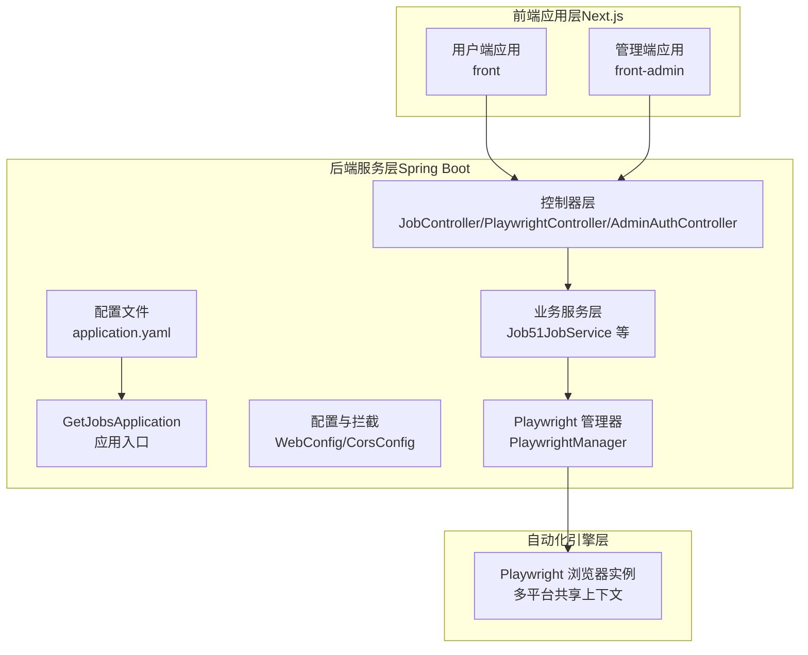
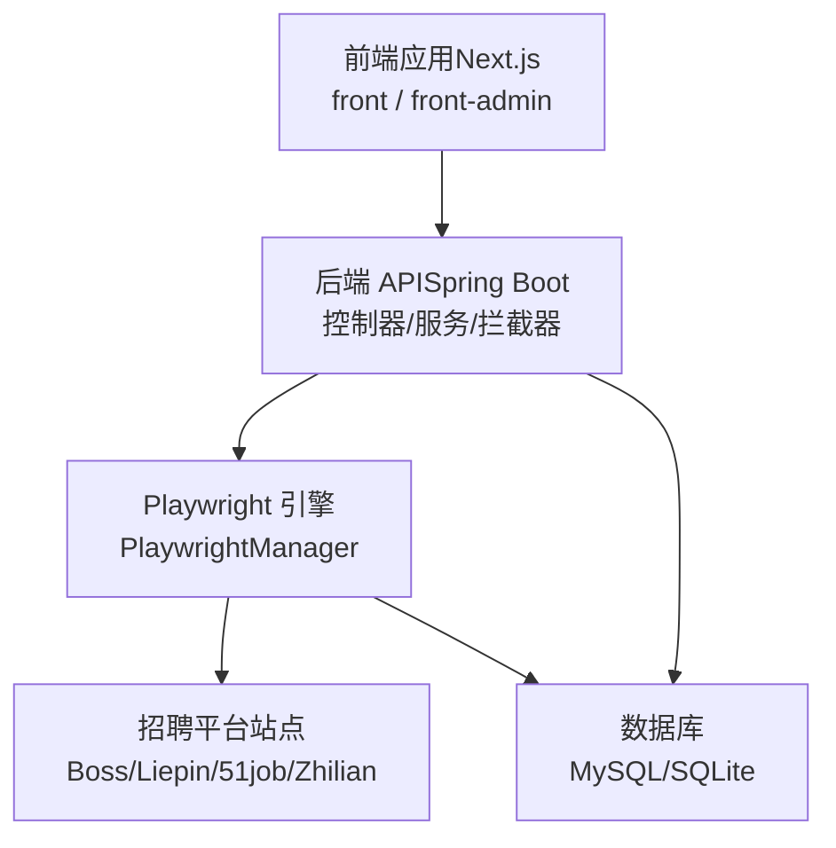
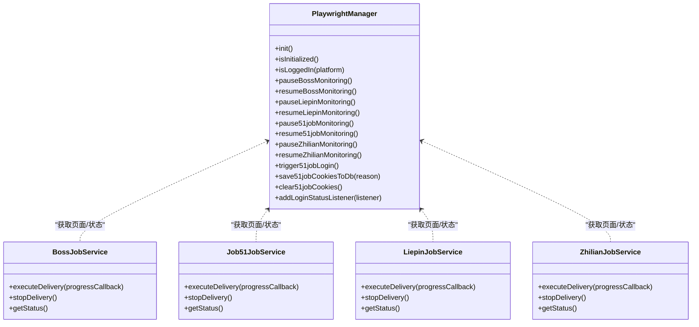
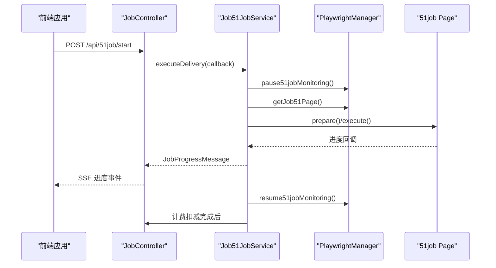
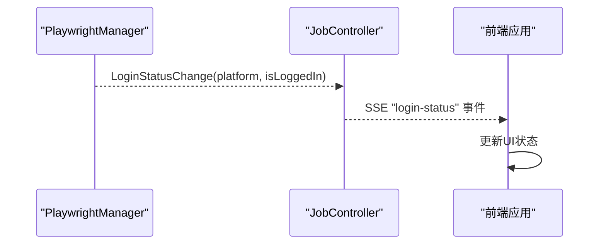
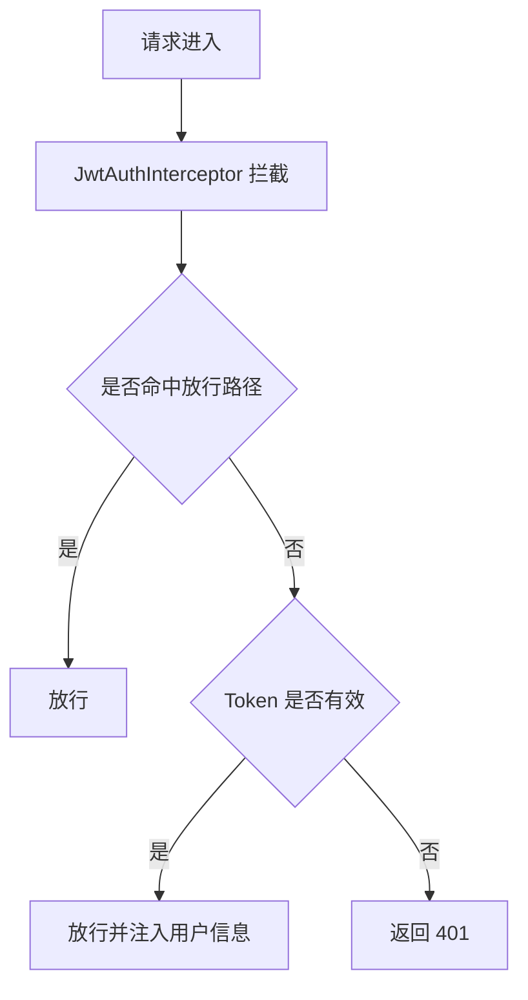
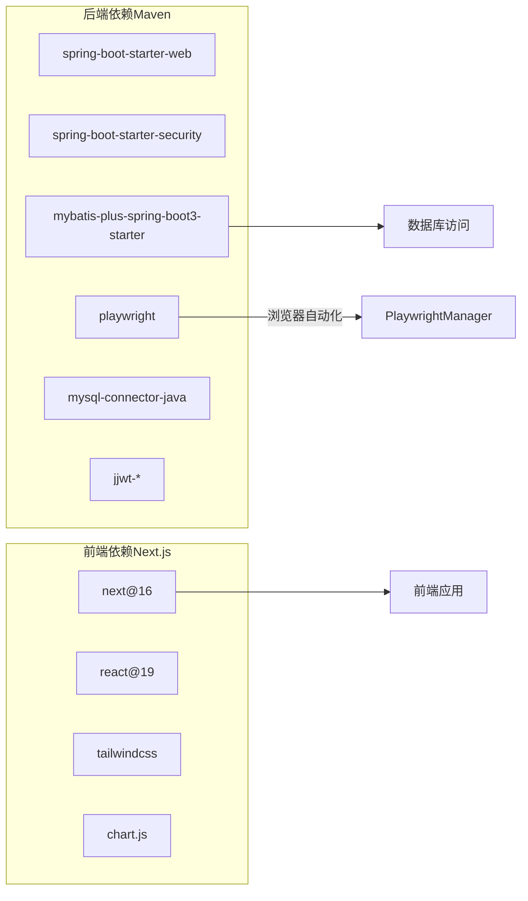

# 系统架构

<cite>
**本文引用的文件**   
- [GetJobsApplication.java](file://backend/src/main/java/com/getjobs/GetJobsApplication.java)
- [application.yaml](file://backend/src/main/resources/application.yaml)
- [pom.xml](file://backend/pom.xml)
- [PlaywrightManager.java](file://backend/src/main/java/com/getjobs/worker/manager/PlaywrightManager.java)
- [BossJobService.java](file://backend/src/main/java/com/getjobs/worker/service/BossJobService.java)
- [Job51JobService.java](file://backend/src/main/java/com/getjobs/worker/service/Job51JobService.java)
- [LiepinJobService.java](file://backend/src/main/java/com/getjobs/worker/service/LiepinJobService.java)
- [ZhilianJobService.java](file://backend/src/main/java/com/getjobs/worker/service/ZhilianJobService.java)
- [PlaywrightController.java](file://backend/src/main/java/com/getjobs/application/controller/PlaywrightController.java)
- [JobController.java](file://backend/src/main/java/com/getjobs/application/controller/JobController.java)
- [AdminAuthController.java](file://backend/src/main/java/com/getjobs/application/controller/AdminAuthController.java)
- [WebConfig.java](file://backend/src/main/java/com/getjobs/application/config/WebConfig.java)
- [CorsConfig.java](file://backend/src/main/java/com/getjobs/application/config/CorsConfig.java)
- [package.json（前端）](file://front/package.json)
- [package.json（前端管理）](file://front-admin/package.json)
</cite>

## 目录
1. [引言](#引言)
2. [项目结构](#项目结构)
3. [核心组件](#核心组件)
4. [架构总览](#架构总览)
5. [详细组件分析](#详细组件分析)
6. [依赖分析](#依赖分析)
7. [性能考虑](#性能考虑)
8. [故障排查指南](#故障排查指南)
9. [结论](#结论)
10. [附录](#附录)

## 引言
本架构文档面向 GetJobs 系统，围绕“三层架构”进行系统化梳理：后端服务层（Spring Boot）、前端应用层（Next.js）、自动化引擎层（Playwright）。重点阐述 PlaywrightManager 作为核心自动化引擎的设计理念与实现细节，解释各层之间的交互关系与数据流向，并总结前后端分离架构在独立开发、部署与扩展方面的优势。同时给出系统边界、外部依赖与集成点说明，以及架构决策的技术考量与权衡。

## 项目结构
系统采用多模块布局：
- backend：Spring Boot 后端，提供 REST API、业务服务、Playwright 自动化引擎与数据库访问。
- front：用户端 Next.js 应用，负责求职平台数据展示与交互。
- front-admin：管理端 Next.js 应用，负责后台运营与管理。
- scripts：部署与迁移脚本。
- 其他目录包含构建脚本与配置模板。

**图示来源**
- [GetJobsApplication.java:15-22](file://backend/src/main/java/com/getjobs/GetJobsApplication.java#L15-L22)
- [application.yaml:1-91](file://backend/src/main/resources/application.yaml#L1-L91)
- [WebConfig.java:14-37](file://backend/src/main/java/com/getjobs/application/config/WebConfig.java#L14-L37)
- [CorsConfig.java:12-40](file://backend/src/main/java/com/getjobs/application/config/CorsConfig.java#L12-L40)
- [JobController.java:38-43](file://backend/src/main/java/com/getjobs/application/controller/JobController.java#L38-L43)
- [PlaywrightController.java:16-24](file://backend/src/main/java/com/getjobs/application/controller/PlaywrightController.java#L16-L24)
- [AdminAuthController.java:14-20](file://backend/src/main/java/com/getjobs/application/controller/AdminAuthController.java#L14-L20)
- [PlaywrightManager.java:40-221](file://backend/src/main/java/com/getjobs/worker/manager/PlaywrightManager.java#L40-L221)

**章节来源**
- [GetJobsApplication.java:15-22](file://backend/src/main/java/com/getjobs/GetJobsApplication.java#L15-L22)
- [application.yaml:1-91](file://backend/src/main/resources/application.yaml#L1-L91)
- [WebConfig.java:14-37](file://backend/src/main/java/com/getjobs/application/config/WebConfig.java#L14-L37)
- [CorsConfig.java:12-40](file://backend/src/main/java/com/getjobs/application/config/CorsConfig.java#L12-L40)

## 核心组件
- 应用入口与启动：Spring Boot 应用入口启用调度与异步能力，扫描指定包路径。
- 配置体系：application.yaml 提供数据库、日志、MyBatis、Playwright 参数等集中配置。
- 控制器层：提供用户端与管理端 API，包括登录状态、SSE 推送、任务控制、配置管理等。
- 业务服务层：封装各平台投递任务的生命周期与状态管理，协调 PlaywrightManager。
- 自动化引擎：PlaywrightManager 统一管理浏览器实例、上下文与页面池，实现多平台登录状态监控与任务执行隔离。
- 前端应用：用户端与管理端分别提供独立的 Next.js 应用，通过后端 API 交互。

**章节来源**
- [GetJobsApplication.java:15-22](file://backend/src/main/java/com/getjobs/GetJobsApplication.java#L15-L22)
- [application.yaml:1-91](file://backend/src/main/resources/application.yaml#L1-L91)
- [PlaywrightManager.java:40-221](file://backend/src/main/java/com/getjobs/worker/manager/PlaywrightManager.java#L40-L221)
- [JobController.java:38-43](file://backend/src/main/java/com/getjobs/application/controller/JobController.java#L38-L43)
- [BossJobService.java:22-102](file://backend/src/main/java/com/getjobs/worker/service/BossJobService.java#L22-L102)
- [Job51JobService.java:22-109](file://backend/src/main/java/com/getjobs/worker/service/Job51JobService.java#L22-L109)
- [LiepinJobService.java:22-99](file://backend/src/main/java/com/getjobs/worker/service/LiepinJobService.java#L22-L99)
- [ZhilianJobService.java:22-101](file://backend/src/main/java/com/getjobs/worker/service/ZhilianJobService.java#L22-L101)

## 架构总览
系统采用前后端分离的三层架构：
- 前端层：用户端与管理端 Next.js 应用，负责界面与交互。
- 后端层：Spring Boot 提供 REST API、业务编排、SSE 推送与安全拦截。
- 自动化引擎层：PlaywrightManager 统一驱动浏览器，实现多平台登录状态监控与任务执行。

**图示来源**
- [JobController.java:38-43](file://backend/src/main/java/com/getjobs/application/controller/JobController.java#L38-L43)
- [PlaywrightController.java:16-24](file://backend/src/main/java/com/getjobs/application/controller/PlaywrightController.java#L16-L24)
- [PlaywrightManager.java:40-221](file://backend/src/main/java/com/getjobs/worker/manager/PlaywrightManager.java#L40-L221)
- [application.yaml:13-22](file://backend/src/main/resources/application.yaml#L13-L22)

## 详细组件分析

### PlaywrightManager：自动化引擎核心
设计理念：
- 单例与延迟初始化：在首次使用时创建 Playwright 实例，避免启动开销。
- 共享上下文与页面池：同一浏览器窗口内多标签页承载不同平台，降低资源消耗并提升登录状态一致性。
- 登录状态监控：针对各平台注册导航事件监听，实时检测登录状态变化并通过 SSE 推送。
- 配置驱动：通过 application.yaml 的 playwright.* 参数动态调整超时、重试与资源拦截策略。
- 任务隔离：在执行投递任务期间暂停后台监控，避免并发访问同一页面导致的竞争。

实现要点：
- 初始化流程：创建浏览器、上下文、页面并注入反检测脚本；并发初始化各平台页面；从数据库加载 Cookie 并注入上下文。
- 登录检测：针对 Boss、猎聘、51job、智联分别实现登录状态判断与必要引导（如二维码登录）。
- 任务执行：业务服务在执行前暂停对应平台监控，执行完毕恢复监控。
- 健康检查与资源管理：定时健康检查、页面空闲回收、可选资源拦截以降低内存占用。

**图示来源**
- [PlaywrightManager.java:40-221](file://backend/src/main/java/com/getjobs/worker/manager/PlaywrightManager.java#L40-L221)
- [BossJobService.java:22-102](file://backend/src/main/java/com/getjobs/worker/service/BossJobService.java#L22-L102)
- [Job51JobService.java:22-109](file://backend/src/main/java/com/getjobs/worker/service/Job51JobService.java#L22-L109)
- [LiepinJobService.java:22-99](file://backend/src/main/java/com/getjobs/worker/service/LiepinJobService.java#L22-L99)
- [ZhilianJobService.java:22-101](file://backend/src/main/java/com/getjobs/worker/service/ZhilianJobService.java#L22-L101)

**章节来源**
- [PlaywrightManager.java:40-221](file://backend/src/main/java/com/getjobs/worker/manager/PlaywrightManager.java#L40-L221)
- [application.yaml:60-91](file://backend/src/main/resources/application.yaml#L60-L91)

### 控制器与业务服务：任务编排与状态推送
- JobController：提供 SSE 进度与登录状态推送、平台配置与 Cookie 管理、任务启动/停止与状态查询、健康检查与分析接口。
- 各平台 JobService：封装平台特定的投递流程，协调 PlaywrightManager 获取页面与登录状态，暂停/恢复后台监控，回调进度消息，最终在完成后进行计费扣减。

**图示来源**
- [JobController.java:386-443](file://backend/src/main/java/com/getjobs/application/controller/JobController.java#L386-L443)
- [Job51JobService.java:37-109](file://backend/src/main/java/com/getjobs/worker/service/Job51JobService.java#L37-L109)
- [PlaywrightManager.java:60-221](file://backend/src/main/java/com/getjobs/worker/manager/PlaywrightManager.java#L60-L221)

**章节来源**
- [JobController.java:38-43](file://backend/src/main/java/com/getjobs/application/controller/JobController.java#L38-L43)
- [JobController.java:59-134](file://backend/src/main/java/com/getjobs/application/controller/JobController.java#L59-L134)
- [JobController.java:386-443](file://backend/src/main/java/com/getjobs/application/controller/JobController.java#L386-L443)
- [Job51JobService.java:37-109](file://backend/src/main/java/com/getjobs/worker/service/Job51JobService.java#L37-L109)

### 登录状态监控与 SSE 推送
- PlaywrightManager 注册登录状态监听器，当任一平台登录状态变化时，通过 SSE 推送给前端。
- JobController 提供 /api/jobs/login-status/stream，前端可订阅并接收平台登录状态变更事件。

**图示来源**
- [PlaywrightManager.java:376-388](file://backend/src/main/java/com/getjobs/worker/manager/PlaywrightManager.java#L376-L388)
- [JobController.java:91-134](file://backend/src/main/java/com/getjobs/application/controller/JobController.java#L91-L134)

**章节来源**
- [PlaywrightManager.java:376-388](file://backend/src/main/java/com/getjobs/worker/manager/PlaywrightManager.java#L376-L388)
- [JobController.java:91-134](file://backend/src/main/java/com/getjobs/application/controller/JobController.java#L91-L134)

### 管理端认证与拦截
- AdminAuthController：提供管理员登录与 Token 校验。
- WebConfig：注册 JWT 拦截器，对 /api/** 路径进行鉴权。
- CorsConfig：全局 CORS 配置，允许任意来源、方法与头，支持凭证。

**图示来源**
- [WebConfig.java:24-35](file://backend/src/main/java/com/getjobs/application/config/WebConfig.java#L24-L35)
- [AdminAuthController.java:14-20](file://backend/src/main/java/com/getjobs/application/controller/AdminAuthController.java#L14-L20)

**章节来源**
- [AdminAuthController.java:14-20](file://backend/src/main/java/com/getjobs/application/controller/AdminAuthController.java#L14-L20)
- [WebConfig.java:14-37](file://backend/src/main/java/com/getjobs/application/config/WebConfig.java#L14-L37)
- [CorsConfig.java:12-40](file://backend/src/main/java/com/getjobs/application/config/CorsConfig.java#L12-L40)

## 依赖分析
- 后端依赖：Spring Boot Web、Security、MyBatis-Plus、Playwright、Apache HttpClient5、SQLite JDBC、JWT 等。
- 前端依赖：Next.js 16、React 19、TailwindCSS、Chart.js、Radix UI 等。
- 配置与构建：Maven 管理后端依赖，前端使用 pnpm/Next.js 脚本。

**图示来源**
- [pom.xml:43-188](file://backend/pom.xml#L43-L188)
- [package.json（前端）:12-29](file://front/package.json#L12-L29)
- [package.json（前端管理）:11-28](file://front-admin/package.json#L11-L28)

**章节来源**
- [pom.xml:43-188](file://backend/pom.xml#L43-L188)
- [package.json（前端）:12-29](file://front/package.json#L12-L29)
- [package.json（前端管理）:11-28](file://front-admin/package.json#L11-L28)

## 性能考虑
- 浏览器资源管理：通过 application.yaml 的 playwright.* 参数控制慢动作、导航超时、最大重试、页面空闲回收与资源拦截，平衡稳定性与性能。
- 页面池与并发：PagePool 统一管理页面生命周期，避免频繁创建销毁带来的开销。
- SSE 心跳：定时 ping 保活，及时清理断连连接，降低内存泄漏风险。
- 数据库连接池：HikariCP 配置最大连接数、空闲超时与生命周期，保障高并发下的稳定性。
- 前端构建优化：Next.js 生产构建与静态资源缓存策略，结合 TailwindCSS 按需裁剪样式。

**章节来源**
- [application.yaml:60-91](file://backend/src/main/resources/application.yaml#L60-L91)
- [PlaywrightManager.java:60-221](file://backend/src/main/java/com/getjobs/worker/manager/PlaywrightManager.java#L60-L221)
- [JobController.java:186-232](file://backend/src/main/java/com/getjobs/application/controller/JobController.java#L186-L232)
- [application.yaml:13-22](file://backend/src/main/resources/application.yaml#L13-L22)

## 故障排查指南
- Playwright 初始化失败：检查 Chromium 是否正确安装与路径是否可达，确认 slow-mo 与启动参数配置。
- 登录状态异常：确认各平台 Cookie 是否成功注入与刷新，检查登录状态监听是否启用。
- SSE 断连：关注心跳与异常捕获逻辑，定位客户端断开或网络问题。
- 任务卡顿：检查页面池与监控暂停/恢复逻辑，避免并发访问同一页面。
- 数据库连接问题：核对 HikariCP 参数与连接字符串，确认 MySQL 可达性。

**章节来源**
- [PlaywrightManager.java:114-221](file://backend/src/main/java/com/getjobs/worker/manager/PlaywrightManager.java#L114-L221)
- [JobController.java:136-184](file://backend/src/main/java/com/getjobs/application/controller/JobController.java#L136-L184)
- [application.yaml:13-22](file://backend/src/main/resources/application.yaml#L13-L22)

## 结论
GetJobs 采用前后端分离的三层架构，后端以 Spring Boot 为核心，前端以 Next.js 构建，自动化引擎以 PlaywrightManager 为中心，实现了多平台登录状态监控与任务编排。该架构具备良好的独立开发、部署与扩展能力，通过配置驱动与 SSE 推送提升了可观测性与用户体验。PlaywrightManager 的设计在稳定性与性能之间取得平衡，适合在复杂反检测场景下长期运行。

## 附录
- 系统边界：前端仅通过后端 API 交互，后端通过 PlaywrightManager 与外部招聘平台交互，数据库作为持久化存储。
- 外部依赖：MySQL/SQLite、Playwright 浏览器、JWT、CORS。
- 集成点：SSE 推送、Cookie 管理、计费服务钩子、平台特定的登录与投递流程。