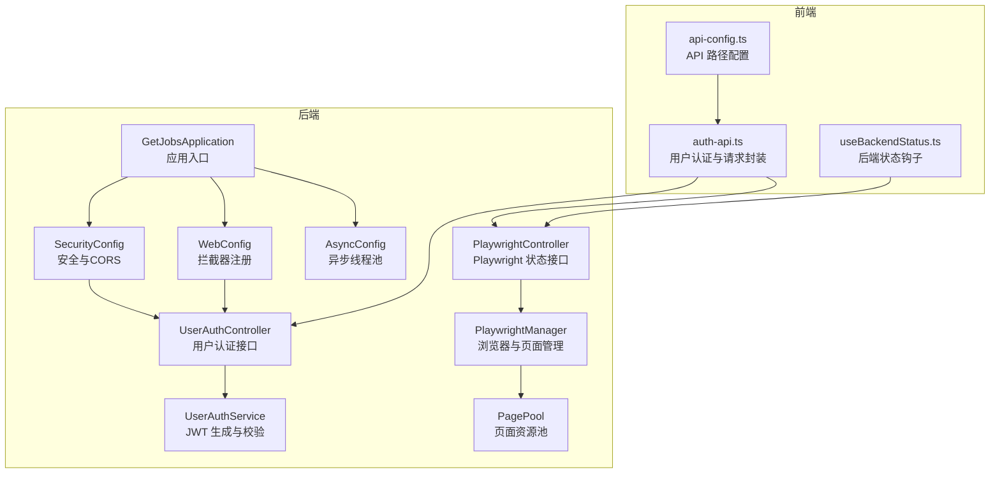
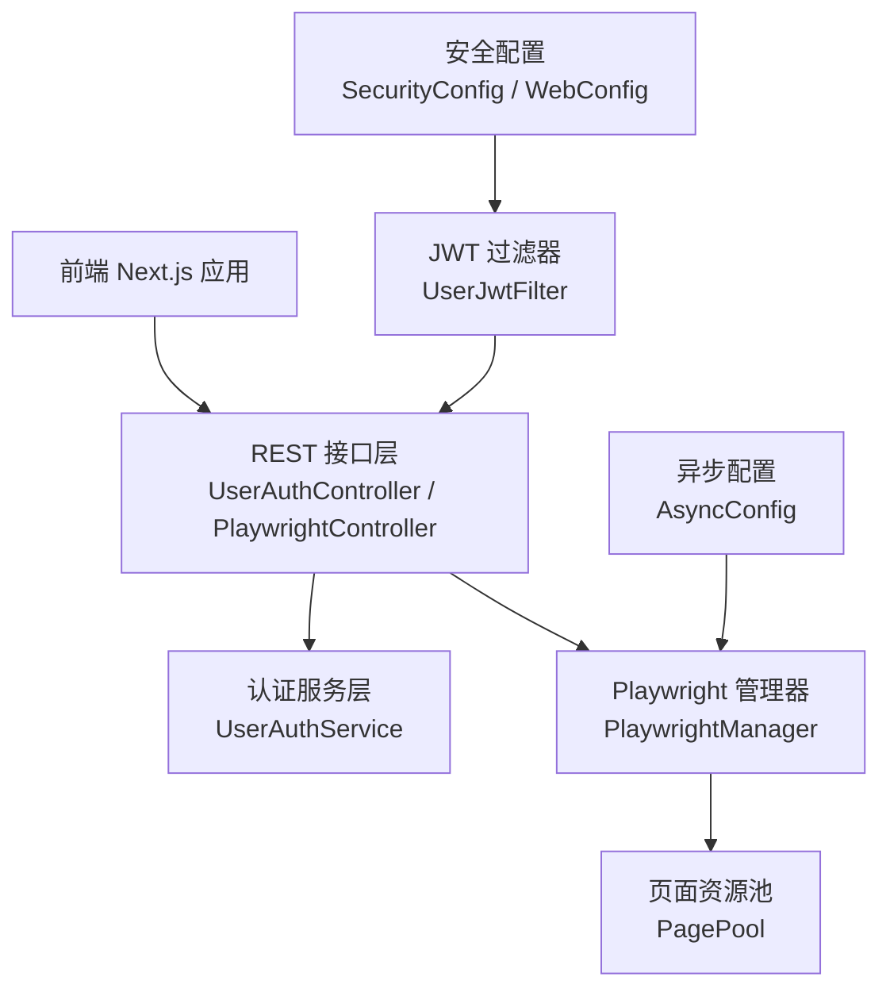
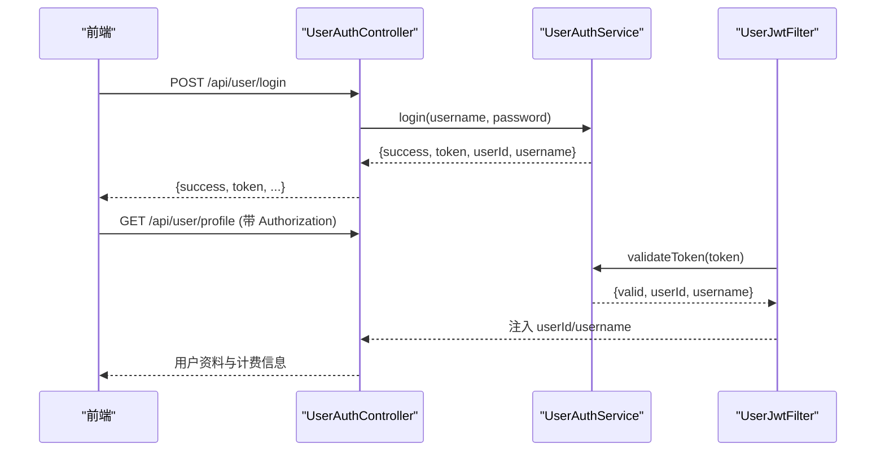
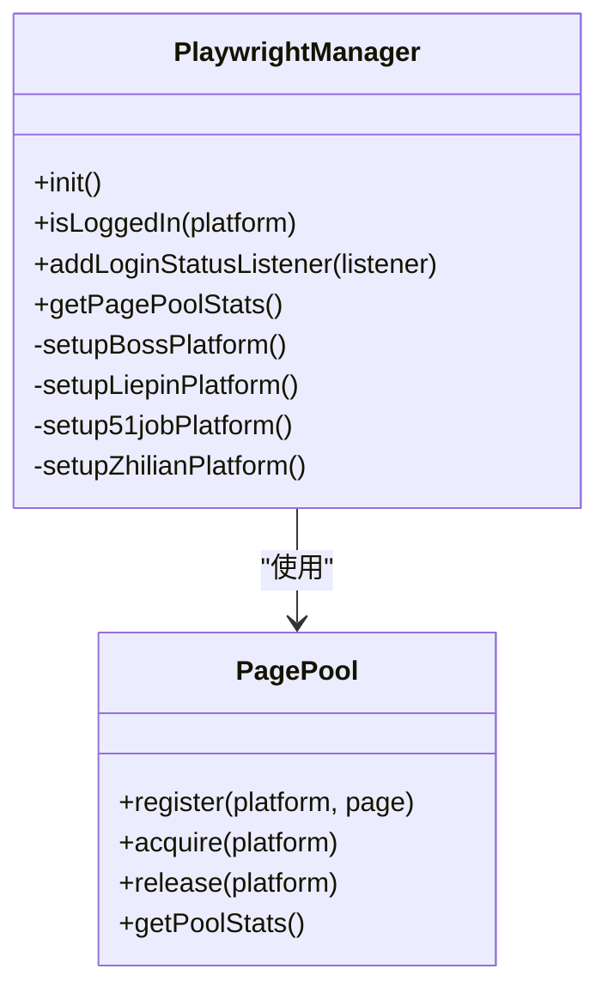
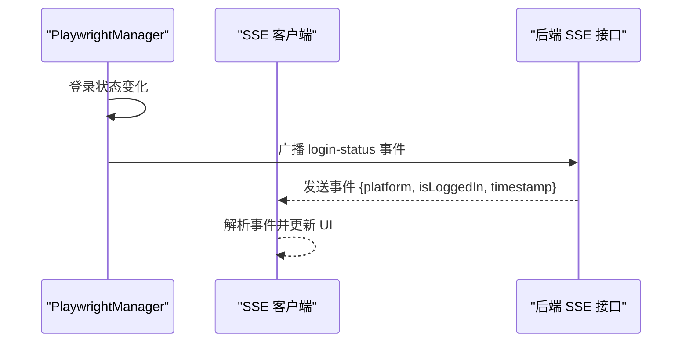
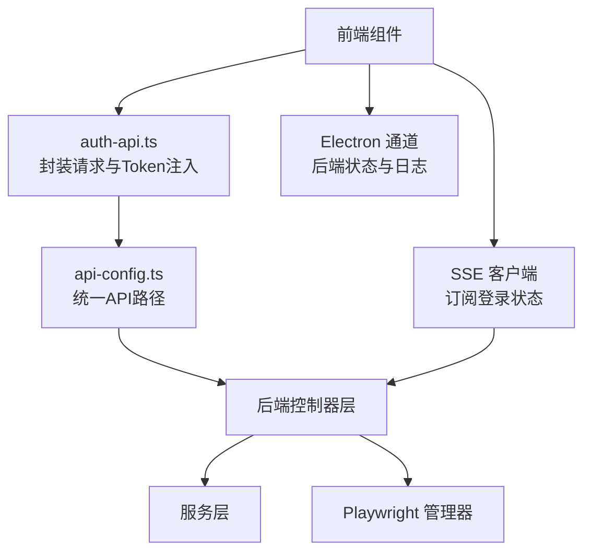
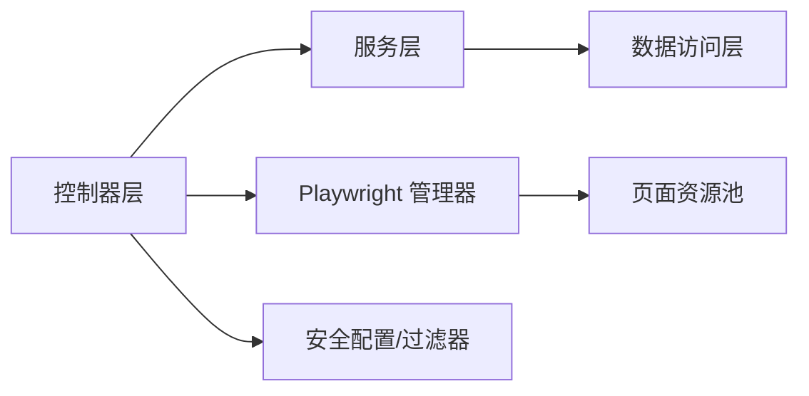

# 组件交互关系

<cite>
**本文引用的文件**
- [GetJobsApplication.java](file://backend/src/main/java/com/getjobs/GetJobsApplication.java)
- [SecurityConfig.java](file://backend/src/main/java/com/getjobs/application/config/SecurityConfig.java)
- [WebConfig.java](file://backend/src/main/java/com/getjobs/application/config/WebConfig.java)
- [AsyncConfig.java](file://backend/src/main/java/com/getjobs/application/config/AsyncConfig.java)
- [UserJwtFilter.java](file://backend/src/main/java/com/getjobs/application/filter/UserJwtFilter.java)
- [UserAuthController.java](file://backend/src/main/java/com/getjobs/application/controller/UserAuthController.java)
- [UserAuthService.java](file://backend/src/main/java/com/getjobs/application/service/UserAuthService.java)
- [PlaywrightManager.java](file://backend/src/main/java/com/getjobs/worker/manager/PlaywrightManager.java)
- [PagePool.java](file://backend/src/main/java/com/getjobs/worker/utils/PagePool.java)
- [PlaywrightController.java](file://backend/src/main/java/com/getjobs/application/controller/PlaywrightController.java)
- [application.yaml](file://backend/src/main/resources/application.yaml)
- [auth-api.ts](file://front/lib/auth-api.ts)
- [api-config.ts](file://front/lib/api-config.ts)
- [useBackendStatus.ts](file://front/hooks/useBackendStatus.ts)
</cite>

## 目录
1. [引言](#引言)
2. [项目结构](#项目结构)
3. [核心组件](#核心组件)
4. [架构总览](#架构总览)
5. [详细组件分析](#详细组件分析)
6. [依赖分析](#依赖分析)
7. [性能考虑](#性能考虑)
8. [故障排查指南](#故障排查指南)
9. [结论](#结论)
10. [附录](#附录)

## 引言
本文件面向开发者，系统梳理 GetJobs 系统的组件交互关系，覆盖后端控制器层、服务层、数据访问层的调用链路与数据传递机制；解释前端组件与后端 API 的交互模式（RESTful API、SSE 实时推送）；阐述 PlaywrightManager 与各平台适配器的协作与任务调度；描述用户认证流程中 JWT 令牌的传递与验证；并给出组件间依赖注入关系、事件传播机制与错误处理策略。文档同时提供交互时序图与调用链路图，帮助快速理解系统内部通信机制。

## 项目结构
系统采用前后端分离架构：
- 后端基于 Spring Boot，采用分层设计：控制器层、服务层、数据访问层（MyBatis Mapper）、工作器层（Playwright 自动化与任务调度）。
- 前端基于 Next.js，通过统一 API 配置文件调用后端 REST 接口，并通过 SSE 订阅登录状态变更事件。
- 配置集中于 application.yaml，包含数据库、MyBatis、安全、定时与 Playwright 参数等。

图表来源
- [GetJobsApplication.java:15-22](file://backend/src/main/java/com/getjobs/GetJobsApplication.java#L15-L22)
- [SecurityConfig.java:24-44](file://backend/src/main/java/com/getjobs/application/config/SecurityConfig.java#L24-L44)
- [WebConfig.java:26-35](file://backend/src/main/java/com/getjobs/application/config/WebConfig.java#L26-L35)
- [AsyncConfig.java:24-54](file://backend/src/main/java/com/getjobs/application/config/AsyncConfig.java#L24-L54)
- [UserAuthController.java:15-80](file://backend/src/main/java/com/getjobs/application/controller/UserAuthController.java#L15-L80)
- [UserAuthService.java:27-40](file://backend/src/main/java/com/getjobs/application/service/UserAuthService.java#L27-L40)
- [PlaywrightController.java:16-39](file://backend/src/main/java/com/getjobs/application/controller/PlaywrightController.java#L16-L39)
- [PlaywrightManager.java:40-110](file://backend/src/main/java/com/getjobs/worker/manager/PlaywrightManager.java#L40-L110)
- [PagePool.java:25-50](file://backend/src/main/java/com/getjobs/worker/utils/PagePool.java#L25-L50)

章节来源
- [GetJobsApplication.java:15-22](file://backend/src/main/java/com/getjobs/GetJobsApplication.java#L15-L22)
- [application.yaml:1-91](file://backend/src/main/resources/application.yaml#L1-L91)

## 核心组件
- 应用入口与配置
  - 应用入口启用调度与异步能力，扫描指定包路径。
  - 安全配置禁用默认表单登录与 CSRF，启用 CORS，统一放行请求（自定义 JWT 过滤器接管鉴权）。
  - Web 配置注册 JWT 认证拦截器，排除健康检查、登录注册等路径。
  - 异步配置提供线程池，拒绝策略为调用线程处理，保证任务不丢失。
- 认证与授权
  - 用户认证控制器提供注册、登录、获取/更新资料、改密等接口。
  - 用户认证服务负责用户查询、密码校验、JWT 生成与校验。
  - 用户 JWT 过滤器从请求头提取 Bearer Token，调用服务校验并写入请求属性。
- 自动化与任务调度
  - Playwright 管理器负责浏览器实例、共享上下文、页面池与多平台初始化。
  - 页面资源池跟踪页面使用情况，提供统计与空闲检测。
  - Playwright 控制器提供状态查询与导航测试接口。
- 前端集成
  - 统一 API 配置导出各模块 REST 路径，包含登录状态 SSE。
  - 认证 API 封装请求头注入、响应体解析与错误抛出。
  - 后端状态钩子通过 Electron 通道监听后端进程状态与日志。

章节来源
- [UserAuthController.java:15-167](file://backend/src/main/java/com/getjobs/application/controller/UserAuthController.java#L15-L167)
- [UserAuthService.java:27-311](file://backend/src/main/java/com/getjobs/application/service/UserAuthService.java#L27-L311)
- [UserJwtFilter.java:21-83](file://backend/src/main/java/com/getjobs/application/filter/UserJwtFilter.java#L21-L83)
- [PlaywrightManager.java:40-221](file://backend/src/main/java/com/getjobs/worker/manager/PlaywrightManager.java#L40-L221)
- [PagePool.java:25-134](file://backend/src/main/java/com/getjobs/worker/utils/PagePool.java#L25-L134)
- [PlaywrightController.java:16-63](file://backend/src/main/java/com/getjobs/application/controller/PlaywrightController.java#L16-L63)
- [auth-api.ts:41-90](file://front/lib/auth-api.ts#L41-L90)
- [api-config.ts:12-13](file://front/lib/api-config.ts#L12-L13)

## 架构总览
后端采用分层架构，前端通过 REST 与 SSE 与后端交互。认证流程以 JWT 为核心，贯穿请求生命周期。自动化任务由 PlaywrightManager 统一调度，页面资源池保障稳定性。

图表来源
- [SecurityConfig.java:24-44](file://backend/src/main/java/com/getjobs/application/config/SecurityConfig.java#L24-L44)
- [WebConfig.java:26-35](file://backend/src/main/java/com/getjobs/application/config/WebConfig.java#L26-L35)
- [UserJwtFilter.java:27-81](file://backend/src/main/java/com/getjobs/application/filter/UserJwtFilter.java#L27-L81)
- [UserAuthController.java:15-80](file://backend/src/main/java/com/getjobs/application/controller/UserAuthController.java#L15-L80)
- [UserAuthService.java:192-216](file://backend/src/main/java/com/getjobs/application/service/UserAuthService.java#L192-L216)
- [PlaywrightController.java:29-39](file://backend/src/main/java/com/getjobs/application/controller/PlaywrightController.java#L29-L39)
- [PlaywrightManager.java:114-221](file://backend/src/main/java/com/getjobs/worker/manager/PlaywrightManager.java#L114-L221)
- [PagePool.java:58-85](file://backend/src/main/java/com/getjobs/worker/utils/PagePool.java#L58-L85)

## 详细组件分析

### 认证与授权流程（JWT）
- 前端登录成功后，本地存储 token 与用户信息。
- 后续请求自动在请求头附加 Authorization: Bearer token。
- 过滤器校验 token，失败返回 401；成功将用户信息注入请求属性，供控制器使用。

图表来源
- [auth-api.ts:75-90](file://front/lib/auth-api.ts#L75-L90)
- [UserAuthController.java:61-108](file://backend/src/main/java/com/getjobs/application/controller/UserAuthController.java#L61-L108)
- [UserAuthService.java:122-168](file://backend/src/main/java/com/getjobs/application/service/UserAuthService.java#L122-L168)
- [UserJwtFilter.java:57-81](file://backend/src/main/java/com/getjobs/application/filter/UserJwtFilter.java#L57-L81)

章节来源
- [auth-api.ts:41-90](file://front/lib/auth-api.ts#L41-L90)
- [UserAuthController.java:61-108](file://backend/src/main/java/com/getjobs/application/controller/UserAuthController.java#L61-L108)
- [UserAuthService.java:192-216](file://backend/src/main/java/com/getjobs/application/service/UserAuthService.java#L192-L216)
- [UserJwtFilter.java:27-81](file://backend/src/main/java/com/getjobs/application/filter/UserJwtFilter.java#L27-L81)

### PlaywrightManager 与平台适配器协作
- PlaywrightManager 负责：
  - 初始化 Playwright、浏览器、共享 BrowserContext。
  - 并发初始化各平台页面，注入反检测脚本，加载 Cookie。
  - 监控页面导航事件，检测登录状态变化，维护状态映射与监听器列表。
  - 通过 PagePool 管理页面生命周期与统计。
- 页面池 PagePool 提供注册、获取、释放与统计能力，便于资源观测与未来回收扩展。

图表来源
- [PlaywrightManager.java:114-221](file://backend/src/main/java/com/getjobs/worker/manager/PlaywrightManager.java#L114-L221)
- [PlaywrightManager.java:254-331](file://backend/src/main/java/com/getjobs/worker/manager/PlaywrightManager.java#L254-L331)
- [PlaywrightManager.java:393-465](file://backend/src/main/java/com/getjobs/worker/manager/PlaywrightManager.java#L393-L465)
- [PlaywrightManager.java:584-686](file://backend/src/main/java/com/getjobs/worker/manager/PlaywrightManager.java#L584-L686)
- [PagePool.java:58-85](file://backend/src/main/java/com/getjobs/worker/utils/PagePool.java#L58-L85)

章节来源
- [PlaywrightManager.java:114-221](file://backend/src/main/java/com/getjobs/worker/manager/PlaywrightManager.java#L114-L221)
- [PagePool.java:58-134](file://backend/src/main/java/com/getjobs/worker/utils/PagePool.java#L58-L134)

### 登录状态实时推送（SSE）
- 后端通过 SSE 向前端推送登录状态变更事件，前端使用带退避重连的 SSE 客户端订阅。
- 当平台登录状态变化时，后端遍历 SSE 连接并发送事件，自动清理断开的连接。

图表来源
- [PlaywrightManager.java:159-184](file://backend/src/main/java/com/getjobs/worker/manager/PlaywrightManager.java#L159-L184)
- [api-config.ts:12-13](file://front/lib/api-config.ts#L12-L13)

章节来源
- [PlaywrightManager.java:159-184](file://backend/src/main/java/com/getjobs/worker/manager/PlaywrightManager.java#L159-L184)
- [api-config.ts:12-13](file://front/lib/api-config.ts#L12-L13)

### 前端与后端 API 交互模式
- RESTful API：统一通过 api-config.ts 导出的路径访问，auth-api.ts 封装请求头注入与错误处理。
- SSE：订阅登录状态流，前端使用带退避重连的客户端，自动处理连接断开与恢复。
- 后端状态：Electron 环境下，通过 useBackendStatus.ts 监听后端进程状态与日志。

图表来源
- [auth-api.ts:41-63](file://front/lib/auth-api.ts#L41-L63)
- [api-config.ts:7-95](file://front/lib/api-config.ts#L7-L95)
- [useBackendStatus.ts:11-61](file://front/hooks/useBackendStatus.ts#L11-L61)

章节来源
- [auth-api.ts:41-142](file://front/lib/auth-api.ts#L41-L142)
- [api-config.ts:1-99](file://front/lib/api-config.ts#L1-L99)
- [useBackendStatus.ts:1-101](file://front/hooks/useBackendStatus.ts#L1-L101)

## 依赖分析
- 组件耦合与内聚
  - 控制器层仅负责参数接收与结果封装，业务逻辑集中在服务层，符合高内聚低耦合。
  - PlaywrightManager 与 PagePool 通过组合关系协作，职责清晰。
  - 前端通过统一配置文件与后端解耦，便于替换后端地址与路径。
- 外部依赖与集成点
  - 数据库：MySQL + MyBatis Plus，配置于 application.yaml。
  - 安全：Spring Security + JWT + 自定义过滤器。
  - 自动化：Playwright，支持多平台共享上下文与页面池。
- 循环依赖
  - 未见循环依赖迹象；控制器依赖服务，服务依赖 Mapper，管理器独立。

图表来源
- [UserAuthController.java:15-80](file://backend/src/main/java/com/getjobs/application/controller/UserAuthController.java#L15-L80)
- [UserAuthService.java:27-40](file://backend/src/main/java/com/getjobs/application/service/UserAuthService.java#L27-L40)
- [PlaywrightController.java:20-24](file://backend/src/main/java/com/getjobs/application/controller/PlaywrightController.java#L20-L24)
- [PlaywrightManager.java:90-110](file://backend/src/main/java/com/getjobs/worker/manager/PlaywrightManager.java#L90-L110)
- [PagePool.java:25-50](file://backend/src/main/java/com/getjobs/worker/utils/PagePool.java#L25-L50)

章节来源
- [application.yaml:13-51](file://backend/src/main/resources/application.yaml#L13-L51)

## 性能考虑
- 异步执行：通过 AsyncConfig 提供线程池，拒绝策略为调用线程处理，避免丢弃任务。
- 页面复用：共享 BrowserContext 与页面池，减少资源创建成本。
- 超时与重试：Playwright 配置默认与平台差异化超时，支持重试策略。
- 资源拦截：可选启用资源拦截降低内存占用（默认关闭）。

章节来源
- [AsyncConfig.java:24-54](file://backend/src/main/java/com/getjobs/application/config/AsyncConfig.java#L24-L54)
- [application.yaml:60-91](file://backend/src/main/resources/application.yaml#L60-L91)

## 故障排查指南
- 认证失败
  - 检查请求头是否包含正确的 Authorization: Bearer token。
  - 核对过滤器排除规则与拦截器注册路径。
- 登录状态不同步
  - 确认前端 SSE 客户端正确订阅登录状态流。
  - 检查后端是否正确广播 login-status 事件并清理断开连接。
- Playwright 初始化失败
  - 检查 Chromium 路径与安装状态，确认浏览器启动参数与调试端口。
  - 查看页面池统计与空闲回收策略。
- 数据库连接问题
  - 核对 application.yaml 中的数据库连接参数与连接池配置。

章节来源
- [UserJwtFilter.java:57-81](file://backend/src/main/java/com/getjobs/application/filter/UserJwtFilter.java#L57-L81)
- [PlaywrightManager.java:122-150](file://backend/src/main/java/com/getjobs/worker/manager/PlaywrightManager.java#L122-L150)
- [PagePool.java:116-134](file://backend/src/main/java/com/getjobs/worker/utils/PagePool.java#L116-L134)
- [application.yaml:13-22](file://backend/src/main/resources/application.yaml#L13-L22)

## 结论
本系统通过清晰的分层设计与统一的配置管理，实现了前后端高效协作。认证采用 JWT 与自定义过滤器，自动化任务由 PlaywrightManager 统一调度并结合页面池提升稳定性。前端通过 REST 与 SSE 实现与后端的实时交互，整体架构具备良好的可维护性与扩展性。

## 附录
- 关键配置项参考
  - 数据源与 MyBatis：application.yaml 中 datasource 与 mybatis-plus 配置。
  - 安全与 CORS：SecurityConfig 与 WebConfig。
  - 异步线程池：AsyncConfig。
  - Playwright 参数：application.yaml 中 playwright.* 配置。

章节来源
- [application.yaml:13-91](file://backend/src/main/resources/application.yaml#L13-L91)
- [SecurityConfig.java:24-66](file://backend/src/main/java/com/getjobs/application/config/SecurityConfig.java#L24-L66)
- [WebConfig.java:26-35](file://backend/src/main/java/com/getjobs/application/config/WebConfig.java#L26-L35)
- [AsyncConfig.java:24-54](file://backend/src/main/java/com/getjobs/application/config/AsyncConfig.java#L24-L54)