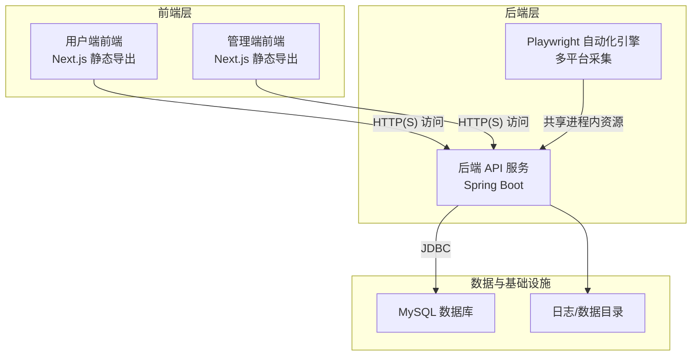
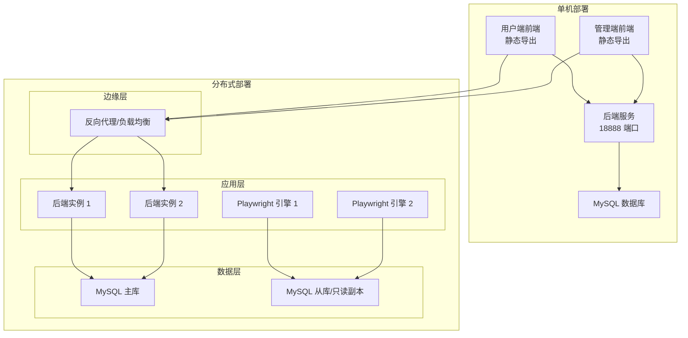
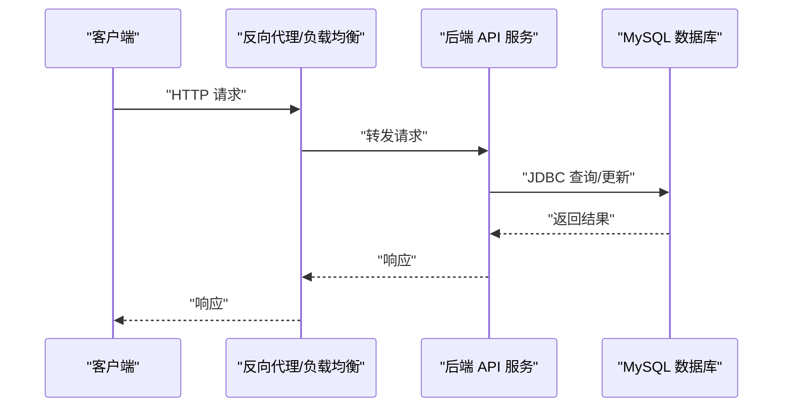
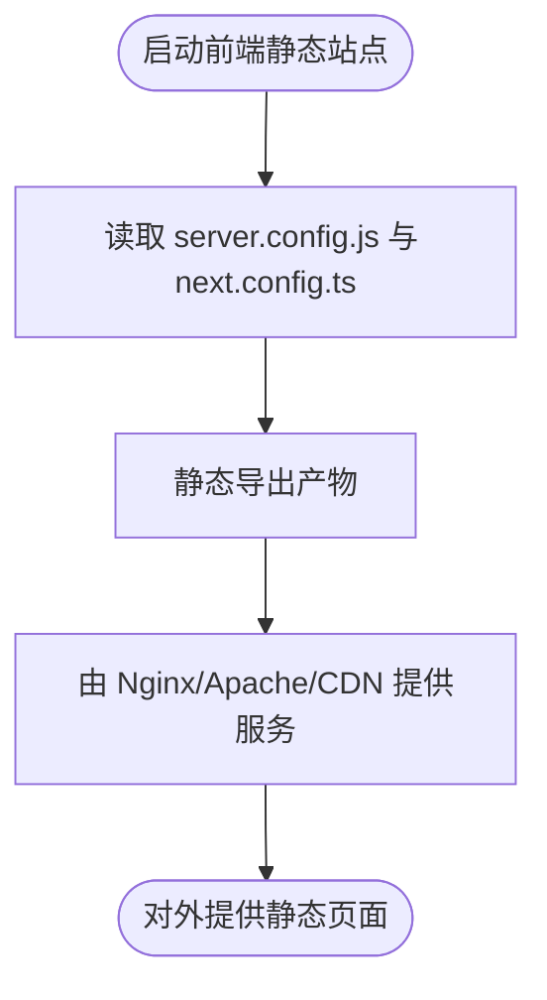
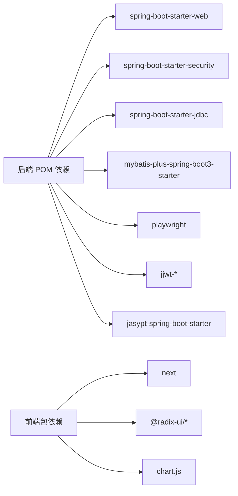
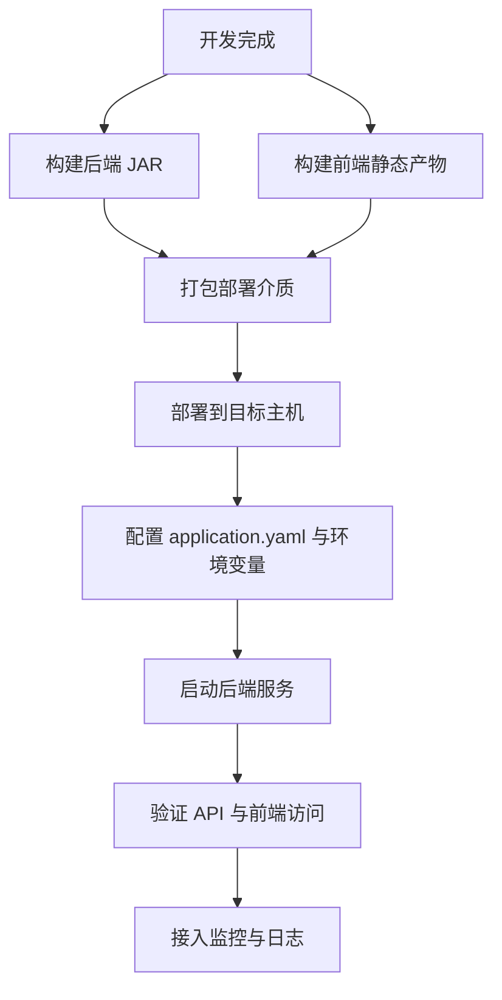

# 部署拓扑

<cite>
**本文引用的文件**
- [application.yaml（后端）](file://backend/src/main/resources/application.yaml)
- [application.yaml 模板](file://scripts/application.yaml.template)
- [Windows 启动脚本](file://scripts/windows/start.bat)
- [Windows 停止脚本](file://scripts/windows/stop.bat)
- [前端 Next 配置](file://front/next.config.ts)
- [前端服务配置](file://front/server.config.js)
- [前端包配置](file://front/package.json)
- [前端管理端 Next 配置](file://front-admin/next.config.ts)
- [前端管理端包配置](file://front-admin/package.json)
- [后端 Maven 构建配置](file://backend/pom.xml)
- [加密指南（安全建议与故障排除）](file://ENCRYPTION_GUIDE.md)
</cite>

## 目录
1. [简介](#简介)
2. [项目结构](#项目结构)
3. [核心组件](#核心组件)
4. [架构总览](#架构总览)
5. [详细组件分析](#详细组件分析)
6. [依赖分析](#依赖分析)
7. [性能考虑](#性能考虑)
8. [故障排查指南](#故障排查指南)
9. [结论](#结论)
10. [附录](#附录)

## 简介
本文件面向运维工程师与系统管理员，提供 GetJobs 系统的生产级部署拓扑与实施指南。内容覆盖单机部署与分布式部署两种模式，明确后端服务、前端应用、数据库与自动化引擎的部署位置与网络关系；对比容器化（Docker）与传统部署方案的优缺点；阐述负载均衡、高可用与故障转移机制；给出部署流程图、环境配置要点、监控告警建议以及不同规模部署的推荐配置与性能调优建议。

## 项目结构
GetJobs 采用前后端分离架构：
- 后端：Spring Boot 应用，提供 REST API、定时任务与浏览器自动化（Playwright）能力，使用 MySQL 作为主数据存储。
- 前端：Next.js 应用（用户端与管理端），静态导出后由反向代理或静态服务器提供。
- 自动化引擎：基于 Playwright 的多平台职位采集服务，运行于后端进程中，受配置参数控制并发与稳定性。
- 部署介质：提供 Windows 批处理脚本与 Unix 启停脚本，支持以可执行 JAR 方式部署。

图表来源
- [application.yaml（后端）:13-24](file://backend/src/main/resources/application.yaml#L13-L24)
- [Windows 启动脚本:50-84](file://scripts/windows/start.bat#L50-L84)
- [前端服务配置:28-31](file://front/server.config.js#L28-L31)
- [前端 Next 配置:6-20](file://front/next.config.ts#L6-L20)
- [后端 Maven 构建配置:47-101](file://backend/pom.xml#L47-L101)

章节来源
- [application.yaml（后端）:1-101](file://backend/src/main/resources/application.yaml#L1-L101)
- [application.yaml 模板:1-102](file://scripts/application.yaml.template#L1-L102)
- [Windows 启动脚本:1-98](file://scripts/windows/start.bat#L1-L98)
- [Windows 停止脚本:1-31](file://scripts/windows/stop.bat#L1-L31)
- [前端 Next 配置:1-23](file://front/next.config.ts#L1-L23)
- [前端服务配置:1-39](file://front/server.config.js#L1-L39)
- [前端包配置:1-48](file://front/package.json#L1-L48)
- [前端管理端 Next 配置:1-12](file://front-admin/next.config.ts#L1-L12)
- [前端管理端包配置:1-41](file://front-admin/package.json#L1-L41)
- [后端 Maven 构建配置:1-309](file://backend/pom.xml#L1-L309)

## 核心组件
- 后端 API 服务
  - 监听端口：固定 18888
  - 数据库：MySQL（Hikari 连接池）
  - 安全：Spring Security + JWT（后台管理）
  - 日志：Logback 滚动日志
  - 配置：application.yaml（支持 Jasypt 加密）
- Playwright 自动化引擎
  - 并发页数上限、重试策略、导航超时、Cookie 刷新等参数可调
  - 与后端同进程运行，共享 JVM 资源
- 前端应用
  - 用户端与管理端均为 Next.js 静态导出
  - 运行端口分别为 6866（用户端）、6867（管理端）
  - 通过环境变量注入 API 基础地址
- 部署介质
  - 可执行 JAR 包 + Windows/Unix 启停脚本
  - 支持额外配置目录（spring.config.additional-location）

章节来源
- [application.yaml（后端）:37-101](file://backend/src/main/resources/application.yaml#L37-L101)
- [Windows 启动脚本:50-84](file://scripts/windows/start.bat#L50-L84)
- [前端服务配置:28-31](file://front/server.config.js#L28-L31)
- [前端 Next 配置:6-20](file://front/next.config.ts#L6-L20)
- [前端管理端 Next 配置:3-9](file://front-admin/next.config.ts#L3-L9)

## 架构总览
GetJobs 的生产部署可采用“单机”或“分布式”两种模式：
- 单机模式：后端、数据库、前端静态文件在同一主机上运行，适合小规模场景。
- 分布式模式：后端 API 与 Playwright 引擎可横向扩展，数据库独立部署，前端静态文件由反向代理统一分发，适合中大型场景。

图表来源
- [application.yaml（后端）:13-24](file://backend/src/main/resources/application.yaml#L13-L24)
- [Windows 启动脚本:50-84](file://scripts/windows/start.bat#L50-L84)
- [前端服务配置:28-31](file://front/server.config.js#L28-L31)

## 详细组件分析

### 后端服务（Spring Boot）
- 网络与端口
  - 固定监听端口 18888，便于反向代理与防火墙策略统一
- 数据库与连接池
  - 使用 HikariCP，最大连接数、空闲超时、最大生命周期等参数可按容量调整
  - 支持 ENC(...) 密码加密，结合 Jasypt 从环境变量注入密钥
- 安全与认证
  - 后台管理使用 JWT，密钥与过期时间可配置
  - Spring Security 提供基础安全能力
- 日志与可观测性
  - 控制台与文件日志，滚动策略可配置
- 自动化引擎（Playwright）
  - 页面并发上限、重试次数与延迟、导航超时、Cookie 刷新等参数可调
  - 健康检查与空闲回收策略保障稳定性

图表来源
- [application.yaml（后端）:13-24](file://backend/src/main/resources/application.yaml#L13-L24)
- [Windows 启动脚本:50-84](file://scripts/windows/start.bat#L50-L84)

章节来源
- [application.yaml（后端）:1-101](file://backend/src/main/resources/application.yaml#L1-L101)
- [后端 Maven 构建配置:47-168](file://backend/pom.xml#L47-L168)

### 前端应用（Next.js 静态导出）
- 用户端与管理端均采用静态导出，便于 CDN 分发与低延迟访问
- 运行端口：用户端 6866、管理端 6867
- API 基础地址通过环境变量注入，构建时固化，减少运行时配置复杂度
- 图片优化在静态导出场景禁用，避免兼容性问题

图表来源
- [前端服务配置:1-39](file://front/server.config.js#L1-L39)
- [前端 Next 配置:6-20](file://front/next.config.ts#L6-L20)
- [前端管理端 Next 配置:3-9](file://front-admin/next.config.ts#L3-L9)

章节来源
- [前端服务配置:1-39](file://front/server.config.js#L1-L39)
- [前端 Next 配置:1-23](file://front/next.config.ts#L1-L23)
- [前端包配置:1-48](file://front/package.json#L1-L48)
- [前端管理端 Next 配置:1-12](file://front-admin/next.config.ts#L1-L12)
- [前端管理端包配置:1-41](file://front-admin/package.json#L1-L41)

### 数据库（MySQL）
- 主库负责读写，建议配合只读副本或从库满足查询压力
- 连接池参数需根据并发与实例数量进行扩容
- 生产环境建议启用 SSL、备份策略与只读副本

章节来源
- [application.yaml（后端）:13-24](file://backend/src/main/resources/application.yaml#L13-L24)
- [application.yaml 模板:14-44](file://scripts/application.yaml.template#L14-L44)

### 自动化引擎（Playwright）
- 并发页数上限与空闲回收时间决定资源占用与吞吐
- 导航超时与重试策略影响稳定性与成功率
- Cookie 管理与刷新策略保障平台登录有效性

章节来源
- [application.yaml（后端）:70-101](file://backend/src/main/resources/application.yaml#L70-L101)

## 依赖分析
- 后端依赖
  - Web、Security、JDBC、MyBatis-Plus、Playwright、Jasypt、JWT 等
- 前端依赖
  - Next.js、Radix UI、Chart.js、Tailwind 等
- 部署依赖
  - Java 21 运行时、可执行 JAR、配置文件、日志/数据目录

图表来源
- [后端 Maven 构建配置:47-168](file://backend/pom.xml#L47-L168)
- [前端包配置:15-32](file://front/package.json#L15-L32)
- [前端管理端包配置:11-28](file://front-admin/package.json#L11-L28)

章节来源
- [后端 Maven 构建配置:1-309](file://backend/pom.xml#L1-L309)
- [前端包配置:1-48](file://front/package.json#L1-L48)
- [前端管理端包配置:1-41](file://front-admin/package.json#L1-L41)

## 性能考虑
- 后端
  - 连接池：根据 QPS 与数据库性能调优 maximum-pool-size、idle-timeout、max-lifetime
  - JVM：根据并发与内存占用设置 -Xms/-Xmx，避免频繁 GC
  - 日志：合理设置滚动策略，避免磁盘 IO 抖动
- 前端
  - 静态导出 + CDN 分发，降低服务器带宽与 CPU 压力
  - 关闭图片优化，提升静态导出兼容性
- 自动化引擎
  - 并发页数与重试策略需平衡吞吐与稳定性
  - 导航超时按平台差异配置，避免全局过长导致资源浪费
- 数据库
  - 主从分离、只读副本、慢查询分析与索引优化
  - 连接池与查询优化双管齐下

## 故障排查指南
- 启动报错：解密失败
  - 现象：Jasypt 解密异常
  - 原因：加密密钥不正确或 ENC() 格式错误
  - 处理：确认 JASYPT_ENCRYPTOR_PASSWORD 环境变量，重新加密配置
- 端口冲突
  - 现象：端口 18888 被占用
  - 处理：停止占用进程或修改 server.port
- 进程管理
  - 使用提供的 Windows/Unix 启停脚本进行启停与状态检查
- 数据库连接
  - 检查 JDBC URL、用户名、密码与网络连通性
  - 核对 Hikari 连接池参数与数据库最大连接限制

章节来源
- [加密指南（安全建议与故障排除）:165-247](file://ENCRYPTION_GUIDE.md#L165-L247)
- [Windows 启动脚本:64-84](file://scripts/windows/start.bat#L64-L84)
- [Windows 停止脚本:12-26](file://scripts/windows/stop.bat#L12-L26)
- [application.yaml（后端）:13-24](file://backend/src/main/resources/application.yaml#L13-L24)

## 结论
GetJobs 的部署拓扑清晰、组件边界明确。单机模式适合起步与小规模场景，分布式模式通过反向代理、水平扩展与主从数据库实现高可用与弹性伸缩。建议在生产环境中优先采用容器化（Docker）方案，结合配置中心与密钥管理服务，进一步提升安全性与可维护性。同时，完善监控告警与变更流程，确保系统稳定运行。

## 附录

### 部署流程图（概念示意）

### 环境配置示例（要点）
- 后端
  - server.port：18888
  - spring.datasource：JDBC URL、用户名、密码（建议 ENC(...) + JASYPT_ENCRYPTOR_PASSWORD）
  - logging：控制台与文件滚动策略
  - admin.jwt：密钥与过期时间
  - playwright：并发页数、重试策略、导航超时、Cookie 刷新
- 前端
  - next.config.ts.env：API 基础地址
  - server.config.js：端口、主机名、开发/生产行为
- 部署介质
  - Windows：start.bat、stop.bat
  - Unix：参考 start.sh、stop.sh（仓库存在对应脚本文件）

章节来源
- [application.yaml（后端）:37-101](file://backend/src/main/resources/application.yaml#L37-L101)
- [application.yaml 模板:65-101](file://scripts/application.yaml.template#L65-L101)
- [前端 Next 配置:6-20](file://front/next.config.ts#L6-L20)
- [前端服务配置:6-31](file://front/server.config.js#L6-L31)
- [Windows 启动脚本:50-84](file://scripts/windows/start.bat#L50-L84)
- [Windows 停止脚本:12-26](file://scripts/windows/stop.bat#L12-L26)

### 监控告警建议
- 后端
  - 健康检查：/health（如提供）
  - 指标：CPU、内存、GC、连接池使用率、请求耗时与错误率
  - 日志：异常堆栈、解密失败、数据库连接异常
- 前端
  - 健康检查：静态首页可达性
  - 指标：4xx/5xx 错误率、首屏渲染时间
- 数据库
  - 指标：连接数、慢查询、锁等待、只读副本延迟
- 自动化引擎
  - 指标：页面并发、重试次数、导航超时、Cookie 刷新成功率

### 不同规模部署推荐
- 小规模（单机）
  - 后端单实例 + 内置/本地数据库（开发/测试）
  - 前端静态导出部署至 Nginx/Apache
  - 使用 ENC() + JASYPT_ENCRYPTOR_PASSWORD 管理敏感配置
- 中规模（单机扩展）
  - 后端多实例 + MySQL 主从 + 反向代理
  - 前端静态文件由 CDN 分发
  - 启用连接池扩容与 JVM 参数调优
- 大规模（分布式）
  - 后端无状态实例池 + 有状态数据库集群
  - 自动化引擎按平台拆分实例，独立只读副本
  - 容器化部署 + 配置中心 + 密钥管理 + CI/CD

### 容器化部署方案（Docker）对比
- 优点
  - 环境一致性、快速扩缩容、资源隔离、配置集中管理
- 缺点
  - 需要容器编排与镜像管理、网络与存储策略设计
- 对比传统部署
  - 传统部署：直接 JAR + 启停脚本，运维简单但弹性差
  - 容器化：标准化强、可移植性好，但需要额外的编排与监控体系