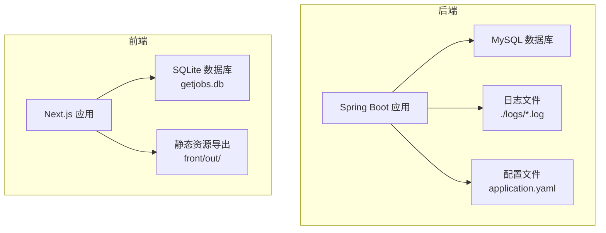
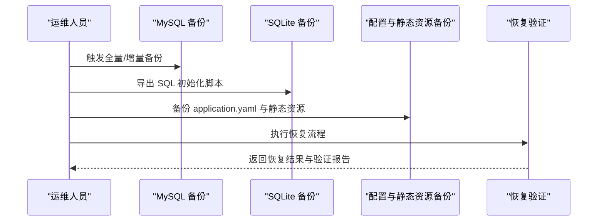
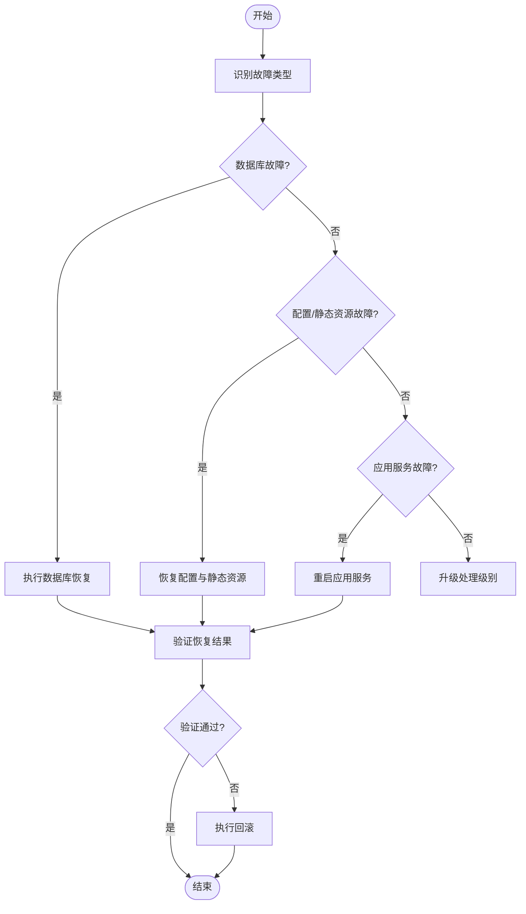
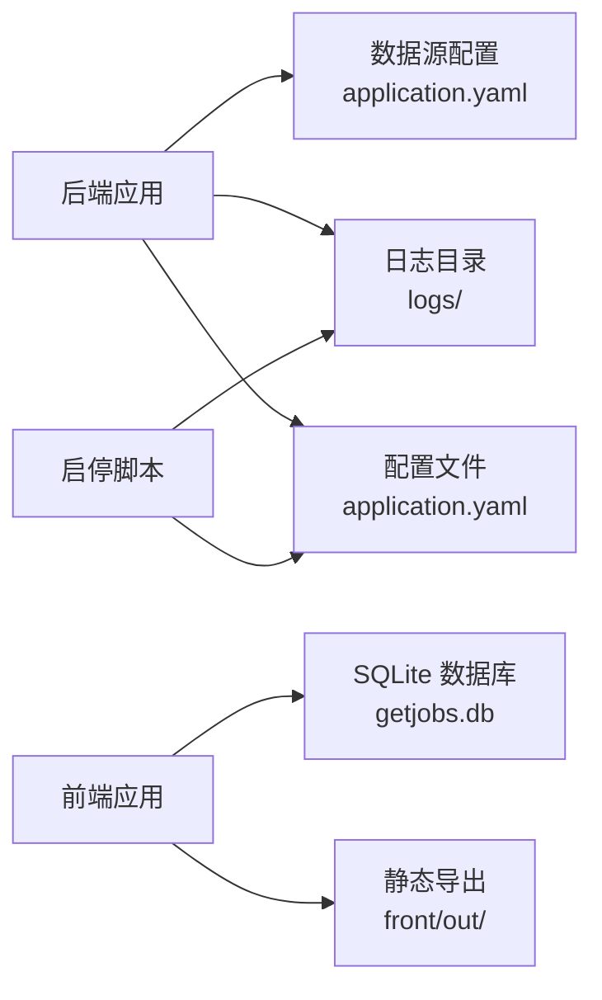

# 备份与恢复

<cite>
**本文引用的文件**
- [application.yaml](file://backend/src/main/resources/application.yaml)
- [application.yaml.template](file://scripts/application.yaml.template)
- [001_create_delivery_report.sql](file://scripts/migration/001_create_delivery_report.sql)
- [start.bat](file://scripts/windows/start.bat)
- [stop.bat](file://scripts/windows/stop.bat)
- [start.sh](file://scripts/unix/start.sh)
- [stop.sh](file://scripts/unix/stop.sh)
- [StaticResourceConfiguration.java](file://backend/src/main/java/com/getjobs/application/config/StaticResourceConfiguration.java)
- [StaticServerConfiguration.java](file://backend/src/main/java/com/getjobs/application/config/StaticServerConfiguration.java)
- [encrypt-config.bat](file://encrypt-config.bat)
- [build-obfuscated.bat](file://build-obfuscated.bat)
- [export-sqlite.mjs](file://front/scripts/export-sqlite.mjs)
- [migrate-sort-order.mjs](file://front/scripts/migrate-sort-order.mjs)
</cite>

## 目录
1. [简介](#简介)
2. [项目结构](#项目结构)
3. [核心组件](#核心组件)
4. [架构总览](#架构总览)
5. [详细组件分析](#详细组件分析)
6. [依赖关系分析](#依赖关系分析)
7. [性能考虑](#性能考虑)
8. [故障排查指南](#故障排查指南)
9. [结论](#结论)
10. [附录](#附录)

## 简介
本文件面向 GetJobs 项目的运维与平台工程团队，提供一套完整的“备份与恢复”方案。内容覆盖：
- 数据库备份策略：MySQL 全量/增量备份与 SQLite 数据导出
- 配置文件与静态资源备份方法
- 灾难恢复计划与故障切换流程
- 备份存储策略与保留周期管理
- 自动化备份脚本与监控告警建议
- 恢复测试与演练方案

## 项目结构
GetJobs 由后端 Spring Boot 应用、前端 Next.js 应用、SQLite 数据库与若干运维脚本组成。关键备份对象包括：
- MySQL 数据库：由后端通过 JDBC 连接，配置位于 application.yaml
- SQLite 数据库：位于前端项目目录，用于本地选项与排序等数据
- 配置文件：application.yaml 及其模板
- 静态资源：后端内置静态资源与前端导出的静态文件
- 日志文件：后端日志输出至 logs 目录

**图表来源**
- [application.yaml:13-24](file://backend/src/main/resources/application.yaml#L13-L24)
- [start.bat:34-40](file://scripts/windows/start.bat#L34-L40)
- [start.sh:36-40](file://scripts/unix/start.sh#L36-L40)
- [export-sqlite.mjs:14-16](file://front/scripts/export-sqlite.mjs#L14-L16)

**章节来源**
- [application.yaml:13-24](file://backend/src/main/resources/application.yaml#L13-L24)
- [application.yaml.template:14-45](file://scripts/application.yaml.template#L14-L45)
- [start.bat:34-40](file://scripts/windows/start.bat#L34-L40)
- [start.sh:36-40](file://scripts/unix/start.sh#L36-L40)
- [export-sqlite.mjs:14-16](file://front/scripts/export-sqlite.mjs#L14-L16)

## 核心组件
- 数据库层
  - MySQL：生产环境连接地址、凭据、连接池参数均在 application.yaml 中配置；开发/测试模板在 application.yaml.template 中提供
  - SQLite：前端项目内存在 getjobs.db，另有导出脚本 export-sqlite.mjs 可生成 MySQL 初始化脚本
- 配置与静态资源
  - application.yaml 作为运行时配置，支持外部目录挂载与加密密钥注入
  - 静态资源由后端静态资源配置统一暴露，支持 dist 与 static 目录
- 运维脚本
  - 启停脚本负责端口占用检查、日志输出与进程管理
  - 加密脚本提供 Jasypt 密文生成
  - 构建脚本负责打包与混淆产物输出

**章节来源**
- [application.yaml:13-24](file://backend/src/main/resources/application.yaml#L13-L24)
- [application.yaml.template:14-45](file://scripts/application.yaml.template#L14-L45)
- [StaticResourceConfiguration.java:28-74](file://backend/src/main/java/com/getjobs/application/config/StaticResourceConfiguration.java#L28-L74)
- [StaticServerConfiguration.java:25-41](file://backend/src/main/java/com/getjobs/application/config/StaticServerConfiguration.java#L25-L41)
- [start.bat:64-71](file://scripts/windows/start.bat#L64-L71)
- [start.sh:66-76](file://scripts/unix/start.sh#L66-L76)
- [encrypt-config.bat:12-18](file://encrypt-config.bat#L12-L18)
- [build-obfuscated.bat:108-124](file://build-obfuscated.bat#L108-L124)

## 架构总览
备份与恢复涉及以下关键流程：
- MySQL 备份：全量与增量结合，结合 binlog/逻辑备份策略
- SQLite 备份：导出为 SQL 初始化脚本，便于跨平台迁移
- 配置与静态资源：集中备份 application.yaml 与静态资源目录
- 恢复验证：服务重启、数据校验、功能回归

[本图为概念性流程图，无需图表来源]

## 详细组件分析

### MySQL 数据库备份策略
- 生产连接与凭据
  - 连接地址、驱动、用户名、密码、连接池参数均在 application.yaml 中定义
  - 开发/测试模板在 application.yaml.template 中提供，便于复制与调整
- 备份方案
  - 全量备份：建议每日凌晨执行，使用逻辑备份工具生成 SQL 文件
  - 增量备份：基于二进制日志（binlog）进行增量捕获，按小时归档
  - 校验与压缩：备份完成后进行校验与压缩，上传至对象存储或本地归档盘
- 恢复流程
  - 选择最近一次全量备份与后续增量备份进行恢复
  - 在隔离环境先做恢复演练，再进行生产切换
- 备份保留周期
  - 全量：保留 14 天
  - 增量：保留 7 天
  - 归档：超过 30 天的全量备份可归档至低成本存储

**章节来源**
- [application.yaml:13-24](file://backend/src/main/resources/application.yaml#L13-L24)
- [application.yaml.template:14-45](file://scripts/application.yaml.template#L14-L45)

### SQLite 数据库备份策略
- 数据位置
  - SQLite 数据库文件位于前端项目根目录下的 getjobs.db
- 备份方案
  - 导出为 SQL 初始化脚本：使用 export-sqlite.mjs 将 SQLite 表结构与数据导出为 MySQL 可导入的 INSERT 脚本
  - 直接复制数据库文件：作为快速备份手段，配合导出脚本进行一致性校验
- 恢复流程
  - 将导出的 SQL 脚本导入目标数据库（MySQL）
  - 或直接替换 getjobs.db 文件，并在前端重新启动
- 备份保留周期
  - 建议保留最近 30 天的导出脚本与数据库文件副本

**章节来源**
- [export-sqlite.mjs:14-16](file://front/scripts/export-sqlite.mjs#L14-L16)
- [export-sqlite.mjs:42-73](file://front/scripts/export-sqlite.mjs#L42-L73)
- [migrate-sort-order.mjs:38-50](file://front/scripts/migrate-sort-order.mjs#L38-L50)

### 配置文件与静态资源备份
- 配置文件
  - application.yaml 支持外部目录挂载，启动脚本会自动加载 config 目录下的配置
  - 加密密钥通过环境变量注入，避免明文存储
- 静态资源
  - 后端静态资源配置支持 dist 与 static 目录，同时支持类路径资源
  - 前端构建产物导出至 front/out/ 目录，可用于离线部署
- 备份范围
  - application.yaml 及其依赖的密钥文件
  - 静态资源目录（dist、static）与前端导出产物
- 备份保留周期
  - 建议保留最近 90 天的配置与静态资源快照

**章节来源**
- [StaticResourceConfiguration.java:28-74](file://backend/src/main/java/com/getjobs/application/config/StaticResourceConfiguration.java#L28-L74)
- [StaticServerConfiguration.java:25-41](file://backend/src/main/java/com/getjobs/application/config/StaticServerConfiguration.java#L25-L41)
- [start.bat:55-62](file://scripts/windows/start.bat#L55-L62)
- [start.sh:57-64](file://scripts/unix/start.sh#L57-L64)
- [encrypt-config.bat:12-18](file://encrypt-config.bat#L12-L18)

### 灾难恢复计划与故障切换流程
- 故障分类
  - 数据库故障：MySQL 无法连接或数据损坏
  - 配置/静态资源故障：application.yaml 丢失或静态资源缺失
  - 应用服务故障：后端进程异常退出
- 切换流程
  - 快速评估：确认故障类型与影响范围
  - 服务降级：启用备用节点或回退到上一个稳定版本
  - 数据恢复：根据备份类型选择对应恢复策略
  - 服务重启：使用启动脚本启动后端服务，检查端口占用与日志
  - 验证步骤：接口连通性、关键业务数据校验、静态资源可用性
- 回滚策略
  - 若恢复后出现异常，回退至上一稳定版本与备份数据

[本图为概念性流程图，无需图表来源]

### 备份存储策略与保留周期管理
- 存储介质
  - 本地磁盘：短期备份与快速恢复
  - 对象存储：长期归档与异地容灾
- 保留策略
  - 全量备份：14 天
  - 增量备份：7 天
  - 归档备份：30 天以上
- 清理策略
  - 定期扫描过期备份并删除
  - 删除前进行二次确认与审计

[本节为通用策略说明，无需章节来源]

### 自动化备份脚本与监控告警
- 自动化脚本建议
  - MySQL 全量/增量备份脚本：定时任务触发，输出带时间戳的备份文件
  - SQLite 导出脚本：在备份窗口执行，生成 SQL 初始化脚本
  - 配置与静态资源备份：对 application.yaml 与静态资源目录进行压缩归档
- 监控告警
  - 备份成功率与耗时监控
  - 备份文件完整性校验失败告警
  - 恢复演练失败告警

[本节为通用方案说明，无需章节来源]

### 恢复测试与演练方案
- 演练频率
  - 每月至少一次全量恢复演练
  - 每季度一次跨介质（本地/对象存储）恢复演练
- 演练内容
  - 从备份到服务可用的全流程验证
  - 关键业务数据一致性校验
  - 静态资源与配置正确性核验
- 演练记录
  - 记录演练过程、问题与改进措施
  - 更新应急预案与操作手册

[本节为通用方案说明，无需章节来源]

## 依赖关系分析
- 后端应用依赖 MySQL 数据源配置
- 启停脚本依赖日志与数据目录的存在
- 静态资源配置依赖 dist 与 static 目录
- 加密脚本依赖 Jasypt 密钥注入

**图表来源**
- [application.yaml:13-24](file://backend/src/main/resources/application.yaml#L13-L24)
- [start.bat:34-40](file://scripts/windows/start.bat#L34-L40)
- [start.sh:36-40](file://scripts/unix/start.sh#L36-L40)
- [export-sqlite.mjs:14-16](file://front/scripts/export-sqlite.mjs#L14-L16)

**章节来源**
- [application.yaml:13-24](file://backend/src/main/resources/application.yaml#L13-L24)
- [start.bat:34-40](file://scripts/windows/start.bat#L34-L40)
- [start.sh:36-40](file://scripts/unix/start.sh#L36-L40)
- [export-sqlite.mjs:14-16](file://front/scripts/export-sqlite.mjs#L14-L16)

## 性能考虑
- 备份窗口规划：避开业务高峰期，减少对在线服务的影响
- 增量备份与压缩：降低网络传输与存储成本
- 恢复演练：在低负载时段进行，缩短业务中断时间

[本节为通用指导，无需章节来源]

## 故障排查指南
- 端口占用
  - 启动前检查 18888 端口占用情况，必要时释放或调整端口
- 日志定位
  - 查看 logs 目录下的日志文件，定位异常原因
- 配置校验
  - 确认 application.yaml 的数据源与加密密钥配置正确
- 静态资源
  - 确认 dist 与 static 目录存在且可读，避免 404

**章节来源**
- [start.bat:64-71](file://scripts/windows/start.bat#L64-L71)
- [start.sh:66-76](file://scripts/unix/start.sh#L66-L76)
- [StaticResourceConfiguration.java:34-53](file://backend/src/main/java/com/getjobs/application/config/StaticResourceConfiguration.java#L34-L53)

## 结论
通过制定 MySQL 全量/增量备份与 SQLite 导出备份策略，配合配置与静态资源的集中备份，以及完善的灾难恢复与演练机制，GetJobs 项目可以实现高可靠的数据与服务保障。建议尽快落地自动化脚本与监控告警，并持续优化备份与恢复流程。

## 附录
- 关键文件清单
  - MySQL 配置：application.yaml
  - 开发模板：application.yaml.template
  - 启停脚本：start.bat、start.sh、stop.bat、stop.sh
  - 加密工具：encrypt-config.bat
  - 构建脚本：build-obfuscated.bat
  - SQLite 导出：export-sqlite.mjs
  - SQLite 迁移：migrate-sort-order.mjs
  - 静态资源配置：StaticResourceConfiguration.java、StaticServerConfiguration.java
- 建议的备份命令与流程（示例）
  - MySQL 全量：mysqldump -h host -P port -u user -p database > backup_$(date +%Y%m%d_%H%M%S).sql
  - MySQL 增量：基于 binlog 导出指定时间段变更
  - SQLite 导出：node export-sqlite.mjs
  - 配置与静态资源：tar -czf config_static_$(date +%Y%m%d_%H%M%S).tar.gz application.yaml dist/ static/ front/out/

[本节为通用附录，无需章节来源]