# 安全运维

<cite>
**本文引用的文件**
- [SecurityConfig.java](file://backend/src/main/java/com/getjobs/application/config/SecurityConfig.java)
- [CorsConfig.java](file://backend/src/main/java/com/getjobs/application/config/CorsConfig.java)
- [AdminJwtFilter.java](file://backend/src/main/java/com/getjobs/application/filter/AdminJwtFilter.java)
- [UserJwtFilter.java](file://backend/src/main/java/com/getjobs/application/filter/UserJwtFilter.java)
- [WebConfig.java](file://backend/src/main/java/com/getjobs/application/config/WebConfig.java)
- [AdminAuthService.java](file://backend/src/main/java/com/getjobs/application/service/AdminAuthService.java)
- [UserAuthService.java](file://backend/src/main/java/com/getjobs/application/service/UserAuthService.java)
- [AdminAuthController.java](file://backend/src/main/java/com/getjobs/application/controller/AdminAuthController.java)
- [UserAuthController.java](file://backend/src/main/java/com/getjobs/application/controller/UserAuthController.java)
- [JasyptConfig.java](file://backend/src/main/java/com/getjobs/application/config/JasyptConfig.java)
- [SecureHttpClientFactory.java](file://backend/src/main/java/com/getjobs/application/config/SecureHttpClientFactory.java)
- [AntiDebugCheck.java](file://backend/src/main/java/com/getjobs/application/security/AntiDebugCheck.java)
- [SignatureValidator.java](file://backend/src/main/java/com/getjobs/application/security/SignatureValidator.java)
- [HardwareFingerprint.java](file://backend/src/main/java/com/getjobs/application/utils/HardwareFingerprint.java)
- [SignedRequestInterceptor.java](file://backend/src/main/java/com/getjobs/application/interceptor/SignedRequestInterceptor.java)
- [application.yaml](file://backend/src/main/resources/application.yaml)
- [application-secure.yml](file://backend/src/main/resources/application-secure.yml)
- [ENCRYPTION_GUIDE.md](file://ENCRYPTION_GUIDE.md)
- [001_create_delivery_report.sql](file://scripts/migration/001_create_delivery_report.sql)
- [StartupRunner.java](file://backend/src/main/java/com/getjobs/application/config/StartupRunner.java)
</cite>

## 更新摘要
**所做更改**
- 新增 Jasypt 加密配置章节，详细说明敏感配置加密机制
- 新增安全 HTTP 客户端工厂章节，介绍签名验证和防重放攻击
- 新增反调试检查章节，涵盖多维度环境检测机制
- 新增签名验证章节，说明 JAR 文件完整性保护
- 新增硬件指纹识别章节，介绍设备绑定和防盗用机制
- 新增签名请求拦截器章节，详细说明外发请求安全防护
- 更新安全配置架构图，反映新增的安全增强功能
- 完善安全审计检查清单，增加新的安全控制项

## 目录
1. [简介](#简介)
2. [项目结构](#项目结构)
3. [核心组件](#核心组件)
4. [架构总览](#架构总览)
5. [详细组件分析](#详细组件分析)
6. [依赖分析](#依赖分析)
7. [性能考虑](#性能考虑)
8. [故障排查指南](#故障排查指南)
9. [结论](#结论)
10. [附录](#附录)

## 简介
本安全运维文档面向 GetJobs 项目的后端与数据库侧安全配置与运维实践，重点覆盖以下方面：
- 应用安全配置：JWT 令牌管理、CORS 跨域配置、CSRF 防护策略
- 数据库安全最佳实践：连接加密、凭据管理、访问控制
- 网络安全配置：防火墙规则、端口管理、SSL/TLS 证书配置（概念性指导）
- 用户认证与授权：角色权限管理、会话管理
- 安全审计与合规：配置加密、日志与监控、合规检查清单
- 常见威胁防护与应急响应预案

**更新** 新增多项安全增强功能，包括 Jasypt 加密配置、安全 HTTP 客户端工厂、反调试检查、签名验证、硬件指纹识别和签名请求拦截器等。

## 项目结构
后端采用 Spring Boot + Spring Security 架构，安全相关配置集中在配置类与过滤器中；JWT 由服务层负责签发与校验；数据库连接与加密通过 Jasypt 实现；新增安全增强功能包括反调试检测、签名验证、硬件指纹识别和安全通信等。

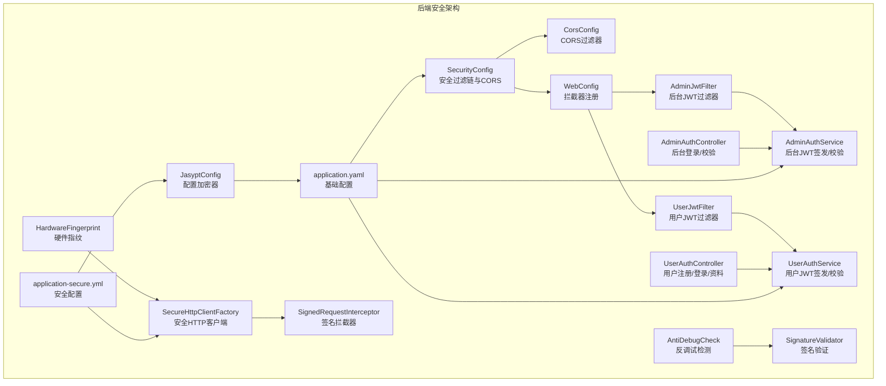

**图表来源**
- [SecurityConfig.java:24-66](file://backend/src/main/java/com/getjobs/application/config/SecurityConfig.java#L24-L66)
- [CorsConfig.java:15-38](file://backend/src/main/java/com/getjobs/application/config/CorsConfig.java#L15-L38)
- [WebConfig.java:25-35](file://backend/src/main/java/com/getjobs/application/config/WebConfig.java#L25-L35)
- [AdminJwtFilter.java:23-70](file://backend/src/main/java/com/getjobs/application/filter/AdminJwtFilter.java#L23-L70)
- [UserJwtFilter.java:26-81](file://backend/src/main/java/com/getjobs/application/filter/UserJwtFilter.java#L26-L81)
- [AdminAuthController.java:24-53](file://backend/src/main/java/com/getjobs/application/controller/AdminAuthController.java#L24-L53)
- [UserAuthController.java:28-80](file://backend/src/main/java/com/getjobs/application/controller/UserAuthController.java#L28-L80)
- [AdminAuthService.java:56-97](file://backend/src/main/java/com/getjobs/application/service/AdminAuthService.java#L56-L97)
- [UserAuthService.java:122-184](file://backend/src/main/java/com/getjobs/application/service/UserAuthService.java#L122-L184)
- [JasyptConfig.java:17-46](file://backend/src/main/java/com/getjobs/application/config/JasyptConfig.java#L17-L46)
- [SecureHttpClientFactory.java:24-152](file://backend/src/main/java/com/getjobs/application/config/SecureHttpClientFactory.java#L24-152)
- [AntiDebugCheck.java:16-231](file://backend/src/main/java/com/getjobs/application/security/AntiDebugCheck.java#L16-231)
- [SignatureValidator.java:19-125](file://backend/src/main/java/com/getjobs/application/security/SignatureValidator.java#L19-125)
- [HardwareFingerprint.java:16-227](file://backend/src/main/java/com/getjobs/application/utils/HardwareFingerprint.java#L16-227)
- [SignedRequestInterceptor.java:23-96](file://backend/src/main/java/com/getjobs/application/interceptor/SignedRequestInterceptor.java#L23-96)
- [application.yaml:13-35](file://backend/src/main/resources/application.yaml#L13-L35)
- [application-secure.yml:7-51](file://backend/src/main/resources/application-secure.yml#L7-L51)

**章节来源**
- [SecurityConfig.java:24-66](file://backend/src/main/java/com/getjobs/application/config/SecurityConfig.java#L24-L66)
- [CorsConfig.java:15-38](file://backend/src/main/java/com/getjobs/application/config/CorsConfig.java#L15-L38)
- [WebConfig.java:25-35](file://backend/src/main/java/com/getjobs/application/config/WebConfig.java#L25-L35)
- [application.yaml:13-35](file://backend/src/main/resources/application.yaml#L13-L35)
- [application-secure.yml:7-51](file://backend/src/main/resources/application-secure.yml#L7-L51)

## 核心组件
- 安全过滤链与 CORS：统一禁用表单登录与 CSRF，启用 CORS 并允许凭据
- JWT 过滤器：分别针对后台与用户接口进行令牌校验与放行
- 认证控制器与服务：提供登录、令牌校验、用户资料与密码修改等能力
- 配置与加密：数据库连接、JWT 密钥、Jasypt 加密密钥管理
- **新增** 安全通信：HTTP 客户端签名、请求拦截、防重放攻击
- **新增** 环境保护：反调试检测、JAR 签名验证、硬件指纹识别
- **新增** 配置管理：分离敏感配置文件、环境变量注入

**章节来源**
- [SecurityConfig.java:24-66](file://backend/src/main/java/com/getjobs/application/config/SecurityConfig.java#L24-L66)
- [AdminJwtFilter.java:23-70](file://backend/src/main/java/com/getjobs/application/filter/AdminJwtFilter.java#L23-L70)
- [UserJwtFilter.java:26-81](file://backend/src/main/java/com/getjobs/application/filter/UserJwtFilter.java#L26-L81)
- [AdminAuthService.java:56-97](file://backend/src/main/java/com/getjobs/application/service/AdminAuthService.java#L56-L97)
- [UserAuthService.java:122-184](file://backend/src/main/java/com/getjobs/application/service/UserAuthService.java#L122-L184)
- [JasyptConfig.java:17-46](file://backend/src/main/java/com/getjobs/application/config/JasyptConfig.java#L17-L46)
- [SecureHttpClientFactory.java:24-152](file://backend/src/main/java/com/getjobs/application/config/SecureHttpClientFactory.java#L24-152)
- [AntiDebugCheck.java:16-231](file://backend/src/main/java/com/getjobs/application/security/AntiDebugCheck.java#L16-231)
- [SignatureValidator.java:19-125](file://backend/src/main/java/com/getjobs/application/security/SignatureValidator.java#L19-125)
- [HardwareFingerprint.java:16-227](file://backend/src/main/java/com/getjobs/application/utils/HardwareFingerprint.java#L16-227)
- [SignedRequestInterceptor.java:23-96](file://backend/src/main/java/com/getjobs/application/interceptor/SignedRequestInterceptor.java#L23-96)
- [application.yaml:13-35](file://backend/src/main/resources/application.yaml#L13-L35)
- [application-secure.yml:7-51](file://backend/src/main/resources/application-secure.yml#L7-L51)

## 架构总览
下图展示从客户端到后端的安全流程：CORS 配置、JWT 过滤器、控制器与服务层之间的交互，以及新增的安全增强功能。

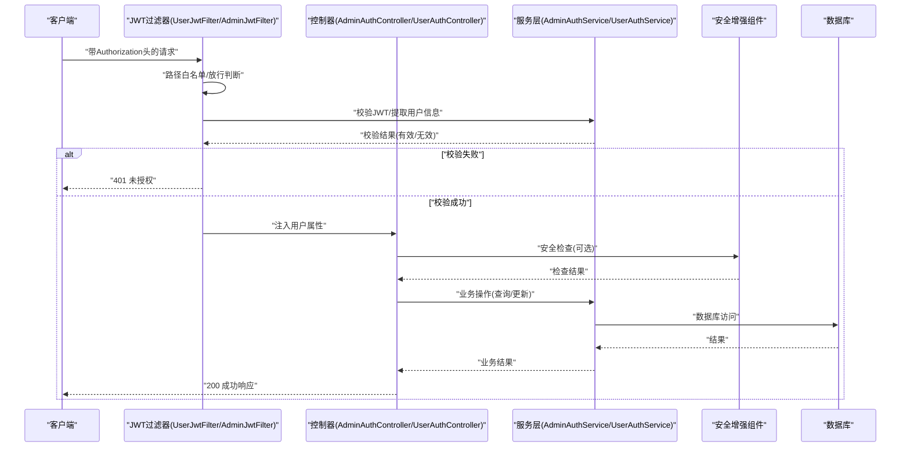

**图表来源**
- [UserJwtFilter.java:26-81](file://backend/src/main/java/com/getjobs/application/filter/UserJwtFilter.java#L26-L81)
- [AdminJwtFilter.java:23-70](file://backend/src/main/java/com/getjobs/application/filter/AdminJwtFilter.java#L23-L70)
- [UserAuthController.java:61-80](file://backend/src/main/java/com/getjobs/application/controller/UserAuthController.java#L61-L80)
- [AdminAuthController.java:24-53](file://backend/src/main/java/com/getjobs/application/controller/AdminAuthController.java#L24-L53)
- [UserAuthService.java:192-216](file://backend/src/main/java/com/getjobs/application/service/UserAuthService.java#L192-L216)
- [AdminAuthService.java:105-116](file://backend/src/main/java/com/getjobs/application/service/AdminAuthService.java#L105-116)

## 详细组件分析

### JWT 令牌管理
- 后台 JWT：密钥、过期时间、签发者来自配置文件；登录成功签发令牌；过滤器校验并注入用户信息
- 用户 JWT：登录成功签发令牌；过滤器校验并注入用户信息；部分路径需认证（如配置同步）

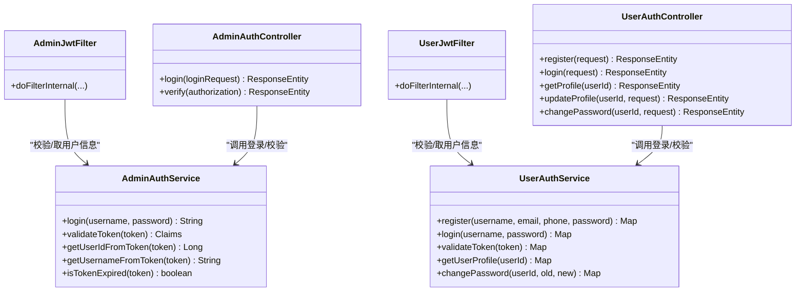

**图表来源**
- [AdminAuthService.java:56-144](file://backend/src/main/java/com/getjobs/application/service/AdminAuthService.java#L56-L144)
- [UserAuthService.java:122-310](file://backend/src/main/java/com/getjobs/application/service/UserAuthService.java#L122-L310)
- [AdminJwtFilter.java:23-70](file://backend/src/main/java/com/getjobs/application/filter/AdminJwtFilter.java#L23-L70)
- [UserJwtFilter.java:26-81](file://backend/src/main/java/com/getjobs/application/filter/UserJwtFilter.java#L26-L81)
- [AdminAuthController.java:24-85](file://backend/src/main/java/com/getjobs/application/controller/AdminAuthController.java#L24-L85)
- [UserAuthController.java:28-166](file://backend/src/main/java/com/getjobs/application/controller/UserAuthController.java#L28-L166)

**章节来源**
- [AdminAuthService.java:56-144](file://backend/src/main/java/com/getjobs/application/service/AdminAuthService.java#L56-L144)
- [UserAuthService.java:122-310](file://backend/src/main/java/com/getjobs/application/service/UserAuthService.java#L122-L310)
- [AdminJwtFilter.java:23-70](file://backend/src/main/java/com/getjobs/application/filter/AdminJwtFilter.java#L23-L70)
- [UserJwtFilter.java:26-81](file://backend/src/main/java/com/getjobs/application/filter/UserJwtFilter.java#L26-L81)
- [AdminAuthController.java:24-85](file://backend/src/main/java/com/getjobs/application/controller/AdminAuthController.java#L24-L85)
- [UserAuthController.java:28-166](file://backend/src/main/java/com/getjobs/application/controller/UserAuthController.java#L28-L166)

### CORS 跨域配置
- 安全配置类统一启用 CORS，并允许任意来源、方法、头，允许携带凭据，预检缓存 1 小时
- 另有独立 CORS 过滤器配置，作用域与上述一致

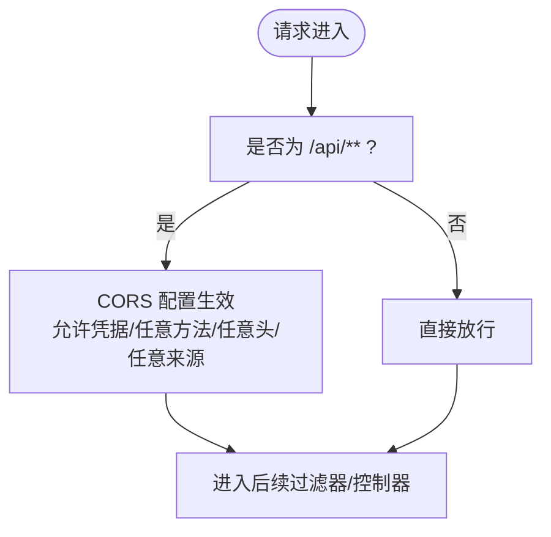

**图表来源**
- [SecurityConfig.java:28-66](file://backend/src/main/java/com/getjobs/application/config/SecurityConfig.java#L28-L66)
- [CorsConfig.java:15-38](file://backend/src/main/java/com/getjobs/application/config/CorsConfig.java#L15-L38)

**章节来源**
- [SecurityConfig.java:28-66](file://backend/src/main/java/com/getjobs/application/config/SecurityConfig.java#L28-L66)
- [CorsConfig.java:15-38](file://backend/src/main/java/com/getjobs/application/config/CorsConfig.java#L15-L38)

### CSRF 防护策略
- 已显式禁用 CSRF（基于 JWT 的无状态认证场景）
- 建议：若未来引入表单登录或需要 CSRF 保护，应启用并配置同源策略与令牌绑定

**章节来源**
- [SecurityConfig.java:29-36](file://backend/src/main/java/com/getjobs/application/config/SecurityConfig.java#L29-L36)

### Jasypt 加密配置
**新增** Jasypt 是一个开源的 Java 加密框架，为 GetJobs 提供了强大的配置加密能力。

- **加密算法**：使用 PBEWithMD5AndDES 算法，提供基础的对称加密保护
- **密钥管理**：支持多级密钥来源，优先级从高到低为环境变量 → JVM 参数 → 配置文件默认值
- **连接池配置**：单线程池设计，确保加密操作的线程安全性
- **盐值生成**：使用 RandomSaltGenerator 生成随机盐值，增强抗彩虹表攻击能力
- **输出格式**：Base64 编码输出，便于存储和传输

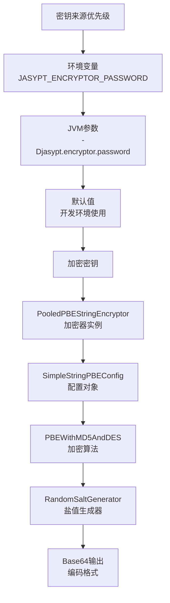

**图表来源**
- [JasyptConfig.java:20-45](file://backend/src/main/java/com/getjobs/application/config/JasyptConfig.java#L20-L45)

**章节来源**
- [JasyptConfig.java:17-46](file://backend/src/main/java/com/getjobs/application/config/JasyptConfig.java#L17-L46)
- [application-secure.yml:33-37](file://backend/src/main/resources/application-secure.yml#L33-L37)

### 安全 HTTP 客户端工厂
**新增** SecureHttpClientFactory 提供了完整的 HTTP 请求安全防护机制，防止抓包重放攻击。

- **签名机制**：为每个请求生成时间戳、随机数和签名，确保请求的完整性和时效性
- **API 密钥**：支持通过环境变量配置 API 密钥，增强请求身份验证
- **连接优化**：使用 HTTP/2 协议，30 秒连接超时，提升性能和安全性
- **缓存机制**：为常用端点提供专用客户端实例，提高并发处理能力

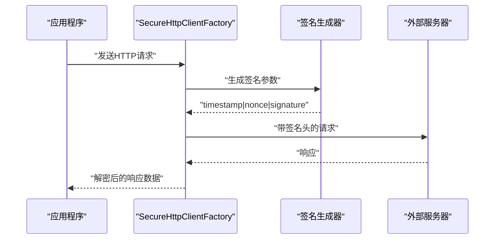

**图表来源**
- [SecureHttpClientFactory.java:84-151](file://backend/src/main/java/com/getjobs/application/config/SecureHttpClientFactory.java#L84-L151)

**章节来源**
- [SecureHttpClientFactory.java:24-152](file://backend/src/main/java/com/getjobs/application/config/SecureHttpClientFactory.java#L24-152)
- [application-secure.yml:8-13](file://backend/src/main/resources/application-secure.yml#L8-L13)

### 反调试检查
**新增** AntiDebugCheck 提供了多维度的反调试和反虚拟化检测机制。

- **调试器检测**：检测 JDWP 调试器附加、调试端口监听、调试挂起模式
- **IDE 环境检测**：识别 IntelliJ IDEA、Eclipse、VS Code、NetBeans 等开发环境
- **虚拟机检测**：检测 Docker、VirtualBox、VMware、KVM 等虚拟化环境
- **可疑属性检测**：监控安全相关的系统属性和安全管理器状态
- **开发模式控制**：支持通过 DEV_MODE 环境变量跳过安全检查

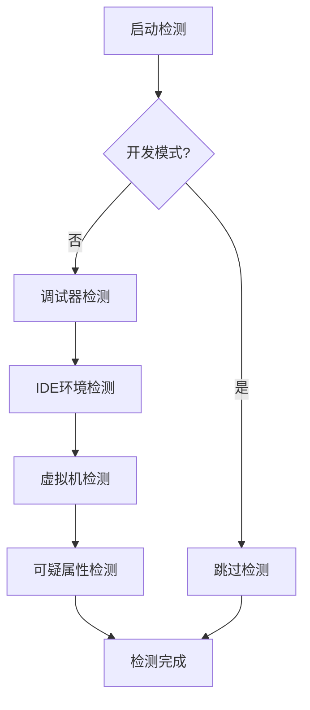

**图表来源**
- [AntiDebugCheck.java:24-38](file://backend/src/main/java/com/getjobs/application/security/AntiDebugCheck.java#L24-L38)

**章节来源**
- [AntiDebugCheck.java:16-231](file://backend/src/main/java/com/getjobs/application/security/AntiDebugCheck.java#L16-231)
- [application-secure.yml:39-43](file://backend/src/main/resources/application-secure.yml#L39-L43)

### 签名验证
**新增** SignatureValidator 负责验证 JAR 文件的完整性和真实性。

- **JAR 签名检测**：检查 META-INF 目录下的 RSA、SF 等签名文件
- **安全属性设置**：禁用 JDK Attach 机制，防止通过 attach 注入 agent
- **安全管理器限制**：通过 package.access 属性限制对 sun.misc 包的访问
- **ProGuard 兼容性**：支持混淆后的 JAR 文件，兼容性良好

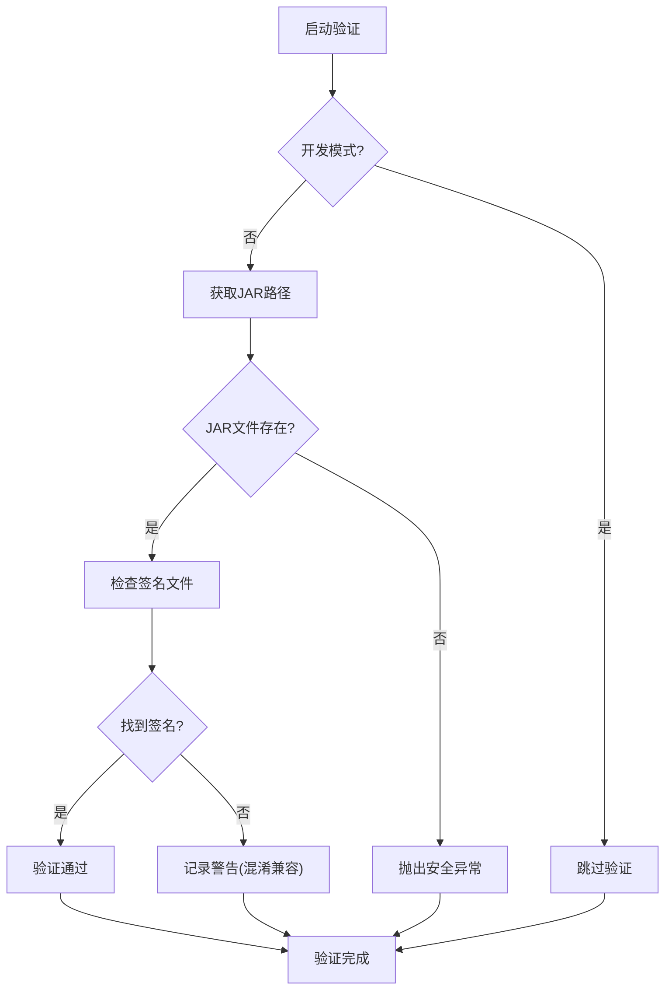

**图表来源**
- [SignatureValidator.java:45-76](file://backend/src/main/java/com/getjobs/application/security/SignatureValidator.java#L45-L76)

**章节来源**
- [SignatureValidator.java:19-125](file://backend/src/main/java/com/getjobs/application/security/SignatureValidator.java#L19-125)

### 硬件指纹识别
**新增** HardwareFingerprint 提供了设备级别的唯一标识生成能力。

- **多平台支持**：Windows、Linux、macOS 平台的硬件信息获取
- **硬件信息收集**：CPU 序列号、主板序列号、MAC 地址组合
- **降级机制**：当硬件信息不可用时，使用系统属性生成稳定 ID
- **UUID 生成**：使用 UUID.nameUUIDFromBytes 确保唯一性和稳定性

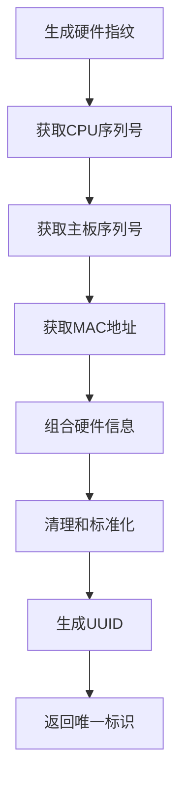

**图表来源**
- [HardwareFingerprint.java:25-39](file://backend/src/main/java/com/getjobs/application/utils/HardwareFingerprint.java#L25-L39)

**章节来源**
- [HardwareFingerprint.java:16-227](file://backend/src/main/java/com/getjobs/application/utils/HardwareFingerprint.java#L16-227)

### 签名请求拦截器
**新增** SignedRequestInterceptor 为所有外发 HTTP 请求自动添加安全签名。

- **自动签名**：拦截所有 HTTP 请求，自动添加 API Key、时间戳、随机数和签名
- **请求追踪**：添加 X-Request-ID 头部，便于分布式追踪
- **内容摘要**：对请求体进行 SHA-256 摘要计算，确保内容完整性
- **环境适配**：支持无 API Key 环境的请求跳过签名

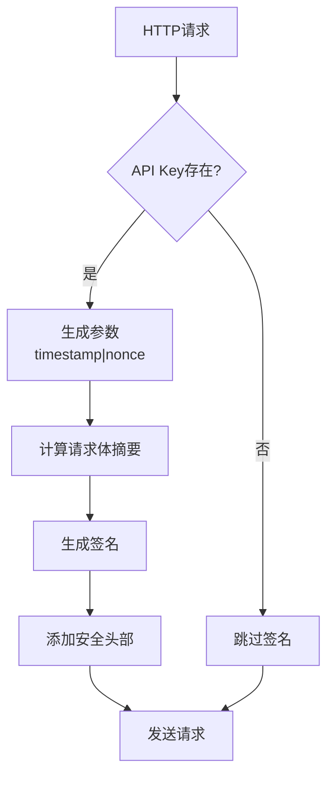

**图表来源**
- [SignedRequestInterceptor.java:32-58](file://backend/src/main/java/com/getjobs/application/interceptor/SignedRequestInterceptor.java#L32-L58)

**章节来源**
- [SignedRequestInterceptor.java:23-96](file://backend/src/main/java/com/getjobs/application/interceptor/SignedRequestInterceptor.java#L23-96)

### 数据库安全最佳实践
- 连接加密：数据库 URL 已禁用 SSL（配置注释明确）；生产环境建议开启 SSL 并配置 TLS
- 凭据管理：使用 Jasypt 对数据库密码进行加密存储，密钥通过环境变量注入
- 访问控制：最小权限原则、网络隔离、只暴露必要端口；对敏感表建立索引与审计字段

**章节来源**
- [application.yaml:13-18](file://backend/src/main/resources/application.yaml#L13-L18)
- [ENCRYPTION_GUIDE.md:84-112](file://ENCRYPTION_GUIDE.md#L84-L112)
- [001_create_delivery_report.sql:4-24](file://scripts/migration/001_create_delivery_report.sql#L4-L24)

### 网络安全配置指南
- 防火墙规则：仅开放后端 API 端口与必要的管理端口，限制来源 IP
- 端口管理：固定后端端口，避免动态端口带来的运维复杂度
- SSL/TLS：为对外暴露的 API 与管理界面配置证书，强制 HTTPS

（本节为通用指导，不直接对应具体源码）

### 用户认证与授权机制
- 角色权限：后台与用户两类 JWT，过滤器按路径区分放行与校验
- 会话管理：无服务端会话，基于 JWT 无状态认证；注意令牌过期与刷新策略

**章节来源**
- [WebConfig.java:25-35](file://backend/src/main/java/com/getjobs/application/config/WebConfig.java#L25-L35)
- [AdminJwtFilter.java:29-43](file://backend/src/main/java/com/getjobs/application/filter/AdminJwtFilter.java#L29-L43)
- [UserJwtFilter.java:32-55](file://backend/src/main/java/com/getjobs/application/filter/UserJwtFilter.java#L32-L55)

## 依赖分析
- 安全配置类依赖 Spring Security 与 CORS
- JWT 过滤器依赖对应认证服务进行令牌校验
- 控制器依赖服务层完成业务逻辑
- application.yaml 提供数据库、Jasypt 与 JWT 配置
- **新增** 安全增强组件相互协作，形成完整的安全防护体系

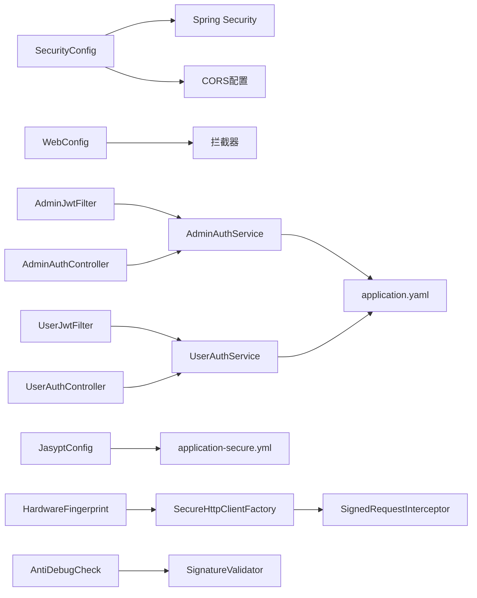

**图表来源**
- [SecurityConfig.java:24-66](file://backend/src/main/java/com/getjobs/application/config/SecurityConfig.java#L24-L66)
- [WebConfig.java:25-35](file://backend/src/main/java/com/getjobs/application/config/WebConfig.java#L25-L35)
- [AdminJwtFilter.java:20-21](file://backend/src/main/java/com/getjobs/application/filter/AdminJwtFilter.java#L20-L21)
- [UserJwtFilter.java:23-24](file://backend/src/main/java/com/getjobs/application/filter/UserJwtFilter.java#L23-L24)
- [AdminAuthController.java:18-19](file://backend/src/main/java/com/getjobs/application/controller/AdminAuthController.java#L18-L19)
- [UserAuthController.java:19-23](file://backend/src/main/java/com/getjobs/application/controller/UserAuthController.java#L19-L23)
- [application.yaml:13-35](file://backend/src/main/resources/application.yaml#L13-L35)
- [application-secure.yml:7-51](file://backend/src/main/resources/application-secure.yml#L7-L51)

**章节来源**
- [SecurityConfig.java:24-66](file://backend/src/main/java/com/getjobs/application/config/SecurityConfig.java#L24-L66)
- [WebConfig.java:25-35](file://backend/src/main/java/com/getjobs/application/config/WebConfig.java#L25-L35)
- [application.yaml:13-35](file://backend/src/main/resources/application.yaml#L13-L35)
- [application-secure.yml:7-51](file://backend/src/main/resources/application-secure.yml#L7-L51)

## 性能考虑
- CORS 预检缓存：1 小时可减少重复预检请求
- 连接池参数：最大连接数、空闲超时、最大生命周期已在配置中设定
- JWT 校验：基于内存解析，避免频繁远程校验，注意密钥长度与算法选择
- **新增** Jasypt 加密：单线程池设计，适合配置读取场景，不影响运行时性能
- **新增** HTTP 客户端：连接复用和缓存机制，减少重复握手开销

**章节来源**
- [SecurityConfig.java:60-61](file://backend/src/main/java/com/getjobs/application/config/SecurityConfig.java#L60-L61)
- [application.yaml:19-23](file://backend/src/main/resources/application.yaml#L19-L23)
- [JasyptConfig.java:37-38](file://backend/src/main/java/com/getjobs/application/config/JasyptConfig.java#L37-L38)
- [SecureHttpClientFactory.java:30-31](file://backend/src/main/java/com/getjobs/application/config/SecureHttpClientFactory.java#L30-L31)

## 故障排查指南
- 启动报解密错误：检查 Jasypt 密钥是否通过环境变量正确注入
- JWT 401：确认 Authorization 头格式、令牌是否过期、签发者与密钥是否匹配
- CORS 问题：确认来源、方法、头是否符合配置，是否携带凭据
- 自动打开管理页失败：检查前端服务或静态资源是否存在
- **新增** Jasypt 解密失败：检查 JASYPT_ENCRYPTOR_PASSWORD 环境变量设置
- **新增** HTTP 请求失败：检查 API_KEY 配置和签名生成逻辑
- **新增** 反调试阻断：检查 DEV_MODE 环境变量和安全检测日志
- **新增** 硬件指纹异常：检查系统权限和硬件信息获取命令执行情况

**章节来源**
- [ENCRYPTION_GUIDE.md:215-261](file://ENCRYPTION_GUIDE.md#L215-L261)
- [AdminJwtFilter.java:47-63](file://backend/src/main/java/com/getjobs/application/filter/AdminJwtFilter.java#L47-L63)
- [UserJwtFilter.java:57-74](file://backend/src/main/java/com/getjobs/application/filter/UserJwtFilter.java#L57-L74)
- [StartupRunner.java:31-47](file://backend/src/main/java/com/getjobs/application/config/StartupRunner.java#L31-L47)
- [JasyptConfig.java:26](file://backend/src/main/java/com/getjobs/application/config/JasyptConfig.java#L26)
- [SecureHttpClientFactory.java:32-35](file://backend/src/main/java/com/getjobs/application/config/SecureHttpClientFactory.java#L32-L35)
- [AntiDebugCheck.java:25-27](file://backend/src/main/java/com/getjobs/application/security/AntiDebugCheck.java#L25-L27)
- [HardwareFingerprint.java:35-38](file://backend/src/main/java/com/getjobs/application/utils/HardwareFingerprint.java#L35-L38)

## 结论
GetJobs 项目在后端实现了基于 JWT 的无状态认证与 CORS 统一配置，辅以 Jasypt 对敏感配置进行加密存储。**新增的安全增强功能**包括反调试检测、签名验证、硬件指纹识别、安全 HTTP 通信等，形成了多层次的安全防护体系。建议在生产环境中进一步强化数据库连接加密、密钥轮换与访问控制，并完善日志与审计体系，确保整体安全与合规。

## 附录

### 安全审计与合规检查清单
- [ ] 数据库连接是否启用 SSL/TLS
- [ ] Jasypt 加密密钥是否通过环境变量注入
- [ ] JWT 密钥是否定期轮换
- [ ] CORS 配置是否收敛为最小必要范围
- [ ] 是否启用访问日志与异常审计
- [ ] 是否对敏感表建立审计字段与索引
- [ ] 是否限制对外暴露端口与来源 IP
- **新增** [ ] Jasypt 加密配置是否正确加载
- **新增** [ ] API 密钥是否安全存储和传输
- **新增** [ ] 反调试检测是否正常工作
- **新增** [ ] JAR 文件签名是否有效
- **新增** [ ] 硬件指纹识别是否稳定可靠
- **新增** [ ] HTTP 请求签名机制是否生效

### 常见威胁防护与应急响应预案
- 令牌泄露：立即撤销受影响令牌、轮换密钥、检查日志
- 配置泄露：回滚配置、重置密钥、扫描公开仓库
- 数据库入侵：断网隔离、变更凭据、恢复备份、追踪攻击路径
- **新增** 代码篡改：验证 JAR 签名、检查硬件指纹、启动反调试检测
- **新增** API 重放攻击：检查请求签名、验证时间戳、实施限流策略
- **新增** 调试攻击：启用反调试检测、限制开发环境、加强日志监控
- **新增** 设备盗用：验证硬件指纹、实施设备绑定、定期检查设备列表

### 安全配置最佳实践
- **密钥管理**：使用环境变量存储敏感配置，定期轮换密钥
- **日志安全**：避免记录敏感信息，实施日志脱敏和访问控制
- **监控告警**：建立安全事件监控和告警机制，及时响应安全威胁
- **定期审计**：定期进行安全配置审计和渗透测试，持续改进安全防护
- **新增** **配置分离**：将敏感配置放入 application-secure.yml，不在代码库中存储
- **新增** **多层防护**：结合多种安全机制，形成纵深防御体系
- **新增** **环境隔离**：开发、测试、生产环境采用不同的安全配置和密钥