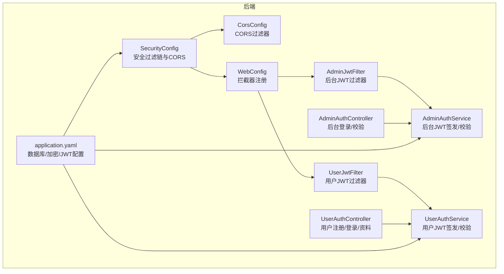
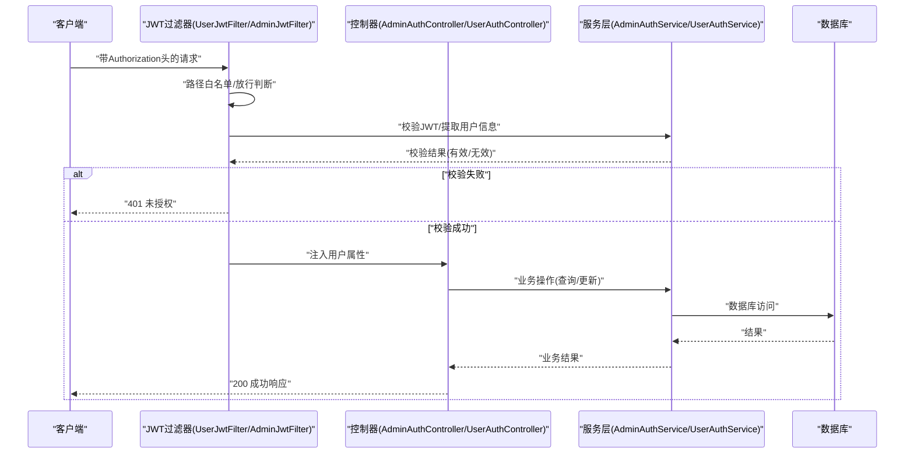
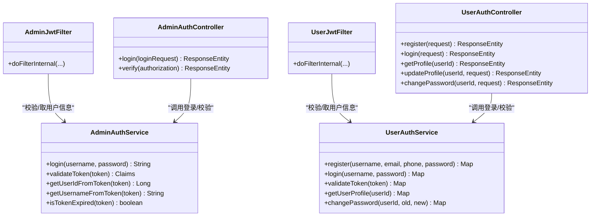
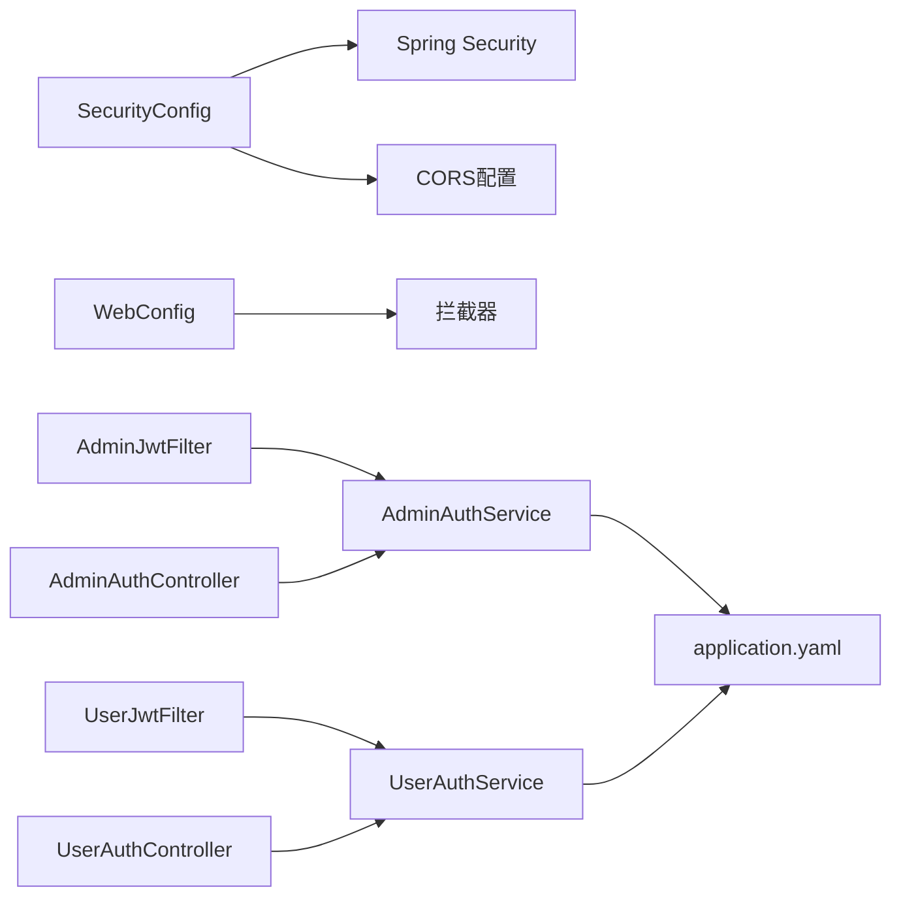

# 安全运维

<cite>
**本文引用的文件**
- [SecurityConfig.java](file://backend/src/main/java/com/getjobs/application/config/SecurityConfig.java)
- [CorsConfig.java](file://backend/src/main/java/com/getjobs/application/config/CorsConfig.java)
- [AdminJwtFilter.java](file://backend/src/main/java/com/getjobs/application/filter/AdminJwtFilter.java)
- [UserJwtFilter.java](file://backend/src/main/java/com/getjobs/application/filter/UserJwtFilter.java)
- [WebConfig.java](file://backend/src/main/java/com/getjobs/application/config/WebConfig.java)
- [AdminAuthService.java](file://backend/src/main/java/com/getjobs/application/service/AdminAuthService.java)
- [UserAuthService.java](file://backend/src/main/java/com/getjobs/application/service/UserAuthService.java)
- [AdminAuthController.java](file://backend/src/main/java/com/getjobs/application/controller/AdminAuthController.java)
- [UserAuthController.java](file://backend/src/main/java/com/getjobs/application/controller/UserAuthController.java)
- [application.yaml](file://backend/src/main/resources/application.yaml)
- [ENCRYPTION_GUIDE.md](file://ENCRYPTION_GUIDE.md)
- [001_create_delivery_report.sql](file://scripts/migration/001_create_delivery_report.sql)
- [StartupRunner.java](file://backend/src/main/java/com/getjobs/application/config/StartupRunner.java)
</cite>

## 目录
1. [简介](#简介)
2. [项目结构](#项目结构)
3. [核心组件](#核心组件)
4. [架构总览](#架构总览)
5. [详细组件分析](#详细组件分析)
6. [依赖分析](#依赖分析)
7. [性能考虑](#性能考虑)
8. [故障排查指南](#故障排查指南)
9. [结论](#结论)
10. [附录](#附录)

## 简介
本安全运维文档面向 GetJobs 项目的后端与数据库侧安全配置与运维实践，重点覆盖以下方面：
- 应用安全配置：JWT 令牌管理、CORS 跨域配置、CSRF 防护策略
- 数据库安全最佳实践：连接加密、凭据管理、访问控制
- 网络安全配置：防火墙规则、端口管理、SSL/TLS 证书配置（概念性指导）
- 用户认证与授权：角色权限管理、会话管理
- 安全审计与合规：配置加密、日志与监控、合规检查清单
- 常见威胁防护与应急响应预案

## 项目结构
后端采用 Spring Boot + Spring Security 架构，安全相关配置集中在配置类与过滤器中；JWT 由服务层负责签发与校验；数据库连接与加密通过 Jasypt 实现。

图表来源
- [SecurityConfig.java:24-66](file://backend/src/main/java/com/getjobs/application/config/SecurityConfig.java#L24-L66)
- [CorsConfig.java:15-38](file://backend/src/main/java/com/getjobs/application/config/CorsConfig.java#L15-L38)
- [WebConfig.java:25-35](file://backend/src/main/java/com/getjobs/application/config/WebConfig.java#L25-L35)
- [AdminJwtFilter.java:23-70](file://backend/src/main/java/com/getjobs/application/filter/AdminJwtFilter.java#L23-L70)
- [UserJwtFilter.java:26-81](file://backend/src/main/java/com/getjobs/application/filter/UserJwtFilter.java#L26-L81)
- [AdminAuthController.java:24-53](file://backend/src/main/java/com/getjobs/application/controller/AdminAuthController.java#L24-L53)
- [UserAuthController.java:28-80](file://backend/src/main/java/com/getjobs/application/controller/UserAuthController.java#L28-L80)
- [AdminAuthService.java:56-97](file://backend/src/main/java/com/getjobs/application/service/AdminAuthService.java#L56-L97)
- [UserAuthService.java:122-184](file://backend/src/main/java/com/getjobs/application/service/UserAuthService.java#L122-L184)
- [application.yaml:13-35](file://backend/src/main/resources/application.yaml#L13-L35)

章节来源
- [SecurityConfig.java:24-66](file://backend/src/main/java/com/getjobs/application/config/SecurityConfig.java#L24-L66)
- [CorsConfig.java:15-38](file://backend/src/main/java/com/getjobs/application/config/CorsConfig.java#L15-L38)
- [WebConfig.java:25-35](file://backend/src/main/java/com/getjobs/application/config/WebConfig.java#L25-L35)
- [application.yaml:13-35](file://backend/src/main/resources/application.yaml#L13-L35)

## 核心组件
- 安全过滤链与 CORS：统一禁用表单登录与 CSRF，启用 CORS 并允许凭据
- JWT 过滤器：分别针对后台与用户接口进行令牌校验与放行
- 认证控制器与服务：提供登录、令牌校验、用户资料与密码修改等能力
- 配置与加密：数据库连接、JWT 密钥、Jasypt 加密密钥管理

章节来源
- [SecurityConfig.java:24-66](file://backend/src/main/java/com/getjobs/application/config/SecurityConfig.java#L24-L66)
- [AdminJwtFilter.java:23-70](file://backend/src/main/java/com/getjobs/application/filter/AdminJwtFilter.java#L23-L70)
- [UserJwtFilter.java:26-81](file://backend/src/main/java/com/getjobs/application/filter/UserJwtFilter.java#L26-L81)
- [AdminAuthService.java:56-97](file://backend/src/main/java/com/getjobs/application/service/AdminAuthService.java#L56-L97)
- [UserAuthService.java:122-184](file://backend/src/main/java/com/getjobs/application/service/UserAuthService.java#L122-L184)
- [application.yaml:13-35](file://backend/src/main/resources/application.yaml#L13-L35)

## 架构总览
下图展示从客户端到后端的安全流程：CORS 配置、JWT 过滤器、控制器与服务层之间的交互。

图表来源
- [UserJwtFilter.java:26-81](file://backend/src/main/java/com/getjobs/application/filter/UserJwtFilter.java#L26-L81)
- [AdminJwtFilter.java:23-70](file://backend/src/main/java/com/getjobs/application/filter/AdminJwtFilter.java#L23-L70)
- [UserAuthController.java:61-80](file://backend/src/main/java/com/getjobs/application/controller/UserAuthController.java#L61-L80)
- [AdminAuthController.java:24-53](file://backend/src/main/java/com/getjobs/application/controller/AdminAuthController.java#L24-L53)
- [UserAuthService.java:192-216](file://backend/src/main/java/com/getjobs/application/service/UserAuthService.java#L192-L216)
- [AdminAuthService.java:105-116](file://backend/src/main/java/com/getjobs/application/service/AdminAuthService.java#L105-L116)

## 详细组件分析

### JWT 令牌管理
- 后台 JWT：密钥、过期时间、签发者来自配置文件；登录成功签发令牌；过滤器校验并注入用户信息
- 用户 JWT：登录成功签发令牌；过滤器校验并注入用户信息；部分路径需认证（如配置同步）

图表来源
- [AdminAuthService.java:56-144](file://backend/src/main/java/com/getjobs/application/service/AdminAuthService.java#L56-L144)
- [UserAuthService.java:122-310](file://backend/src/main/java/com/getjobs/application/service/UserAuthService.java#L122-L310)
- [AdminJwtFilter.java:23-70](file://backend/src/main/java/com/getjobs/application/filter/AdminJwtFilter.java#L23-L70)
- [UserJwtFilter.java:26-81](file://backend/src/main/java/com/getjobs/application/filter/UserJwtFilter.java#L26-L81)
- [AdminAuthController.java:24-85](file://backend/src/main/java/com/getjobs/application/controller/AdminAuthController.java#L24-L85)
- [UserAuthController.java:28-166](file://backend/src/main/java/com/getjobs/application/controller/UserAuthController.java#L28-L166)

章节来源
- [AdminAuthService.java:56-144](file://backend/src/main/java/com/getjobs/application/service/AdminAuthService.java#L56-L144)
- [UserAuthService.java:122-310](file://backend/src/main/java/com/getjobs/application/service/UserAuthService.java#L122-L310)
- [AdminJwtFilter.java:23-70](file://backend/src/main/java/com/getjobs/application/filter/AdminJwtFilter.java#L23-L70)
- [UserJwtFilter.java:26-81](file://backend/src/main/java/com/getjobs/application/filter/UserJwtFilter.java#L26-L81)
- [AdminAuthController.java:24-85](file://backend/src/main/java/com/getjobs/application/controller/AdminAuthController.java#L24-L85)
- [UserAuthController.java:28-166](file://backend/src/main/java/com/getjobs/application/controller/UserAuthController.java#L28-L166)

### CORS 跨域配置
- 安全配置类统一启用 CORS，并允许任意来源、方法、头，允许携带凭据，预检缓存 1 小时
- 另有独立 CORS 过滤器配置，作用域与上述一致

图表来源
- [SecurityConfig.java:28-66](file://backend/src/main/java/com/getjobs/application/config/SecurityConfig.java#L28-L66)
- [CorsConfig.java:15-38](file://backend/src/main/java/com/getjobs/application/config/CorsConfig.java#L15-L38)

章节来源
- [SecurityConfig.java:28-66](file://backend/src/main/java/com/getjobs/application/config/SecurityConfig.java#L28-L66)
- [CorsConfig.java:15-38](file://backend/src/main/java/com/getjobs/application/config/CorsConfig.java#L15-L38)

### CSRF 防护策略
- 已显式禁用 CSRF（基于 JWT 的无状态认证场景）
- 建议：若未来引入表单登录或需要 CSRF 保护，应启用并配置同源策略与令牌绑定

章节来源
- [SecurityConfig.java:29-36](file://backend/src/main/java/com/getjobs/application/config/SecurityConfig.java#L29-L36)

### 数据库安全最佳实践
- 连接加密：数据库 URL 已禁用 SSL（配置注释明确）；生产环境建议开启 SSL 并配置 TLS
- 凭据管理：使用 Jasypt 对数据库密码进行加密存储，密钥通过环境变量注入
- 访问控制：最小权限原则、网络隔离、只暴露必要端口；对敏感表建立索引与审计字段

章节来源
- [application.yaml:13-18](file://backend/src/main/resources/application.yaml#L13-L18)
- [ENCRYPTION_GUIDE.md:84-112](file://ENCRYPTION_GUIDE.md#L84-L112)
- [001_create_delivery_report.sql:4-24](file://scripts/migration/001_create_delivery_report.sql#L4-L24)

### 网络安全配置指南
- 防火墙规则：仅开放后端 API 端口与必要的管理端口，限制来源 IP
- 端口管理：固定后端端口，避免动态端口带来的运维复杂度
- SSL/TLS：为对外暴露的 API 与管理界面配置证书，强制 HTTPS

（本节为通用指导，不直接对应具体源码）

### 用户认证与授权机制
- 角色权限：后台与用户两类 JWT，过滤器按路径区分放行与校验
- 会话管理：无服务端会话，基于 JWT 无状态认证；注意令牌过期与刷新策略

章节来源
- [WebConfig.java:25-35](file://backend/src/main/java/com/getjobs/application/config/WebConfig.java#L25-L35)
- [AdminJwtFilter.java:29-43](file://backend/src/main/java/com/getjobs/application/filter/AdminJwtFilter.java#L29-L43)
- [UserJwtFilter.java:32-55](file://backend/src/main/java/com/getjobs/application/filter/UserJwtFilter.java#L32-L55)

## 依赖分析
- 安全配置类依赖 Spring Security 与 CORS
- JWT 过滤器依赖对应认证服务进行令牌校验
- 控制器依赖服务层完成业务逻辑
- application.yaml 提供数据库、Jasypt 与 JWT 配置

图表来源
- [SecurityConfig.java:24-66](file://backend/src/main/java/com/getjobs/application/config/SecurityConfig.java#L24-L66)
- [WebConfig.java:25-35](file://backend/src/main/java/com/getjobs/application/config/WebConfig.java#L25-L35)
- [AdminJwtFilter.java:20-21](file://backend/src/main/java/com/getjobs/application/filter/AdminJwtFilter.java#L20-L21)
- [UserJwtFilter.java:23-24](file://backend/src/main/java/com/getjobs/application/filter/UserJwtFilter.java#L23-L24)
- [AdminAuthController.java:18-19](file://backend/src/main/java/com/getjobs/application/controller/AdminAuthController.java#L18-L19)
- [UserAuthController.java:19-23](file://backend/src/main/java/com/getjobs/application/controller/UserAuthController.java#L19-L23)
- [application.yaml:13-35](file://backend/src/main/resources/application.yaml#L13-L35)

章节来源
- [SecurityConfig.java:24-66](file://backend/src/main/java/com/getjobs/application/config/SecurityConfig.java#L24-L66)
- [WebConfig.java:25-35](file://backend/src/main/java/com/getjobs/application/config/WebConfig.java#L25-L35)
- [application.yaml:13-35](file://backend/src/main/resources/application.yaml#L13-L35)

## 性能考虑
- CORS 预检缓存：1 小时可减少重复预检请求
- 连接池参数：最大连接数、空闲超时、最大生命周期已在配置中设定
- JWT 校验：基于内存解析，避免频繁远程校验，注意密钥长度与算法选择

章节来源
- [SecurityConfig.java:60-61](file://backend/src/main/java/com/getjobs/application/config/SecurityConfig.java#L60-L61)
- [application.yaml:19-23](file://backend/src/main/resources/application.yaml#L19-L23)

## 故障排查指南
- 启动报解密错误：检查 Jasypt 密钥是否通过环境变量正确注入
- JWT 401：确认 Authorization 头格式、令牌是否过期、签发者与密钥是否匹配
- CORS 问题：确认来源、方法、头是否符合配置，是否携带凭据
- 自动打开管理页失败：检查前端服务或静态资源是否存在

章节来源
- [ENCRYPTION_GUIDE.md:215-261](file://ENCRYPTION_GUIDE.md#L215-L261)
- [AdminJwtFilter.java:47-63](file://backend/src/main/java/com/getjobs/application/filter/AdminJwtFilter.java#L47-L63)
- [UserJwtFilter.java:57-74](file://backend/src/main/java/com/getjobs/application/filter/UserJwtFilter.java#L57-L74)
- [StartupRunner.java:31-47](file://backend/src/main/java/com/getjobs/application/config/StartupRunner.java#L31-L47)

## 结论
GetJobs 项目在后端实现了基于 JWT 的无状态认证与 CORS 统一配置，辅以 Jasypt 对敏感配置进行加密存储。建议在生产环境中进一步强化数据库连接加密、密钥轮换与访问控制，并完善日志与审计体系，确保整体安全与合规。

## 附录

### 安全审计与合规检查清单
- [ ] 数据库连接是否启用 SSL/TLS
- [ ] Jasypt 加密密钥是否通过环境变量注入
- [ ] JWT 密钥是否定期轮换
- [ ] CORS 配置是否收敛为最小必要范围
- [ ] 是否启用访问日志与异常审计
- [ ] 是否对敏感表建立审计字段与索引
- [ ] 是否限制对外暴露端口与来源 IP

### 常见威胁防护与应急响应预案
- 令牌泄露：立即撤销受影响令牌、轮换密钥、检查日志
- 配置泄露：回滚配置、重置密钥、扫描公开仓库
- 数据库入侵：断网隔离、变更凭据、恢复备份、追踪攻击路径