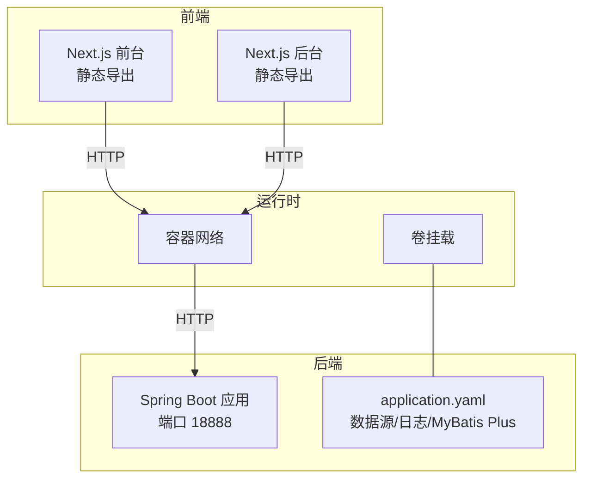
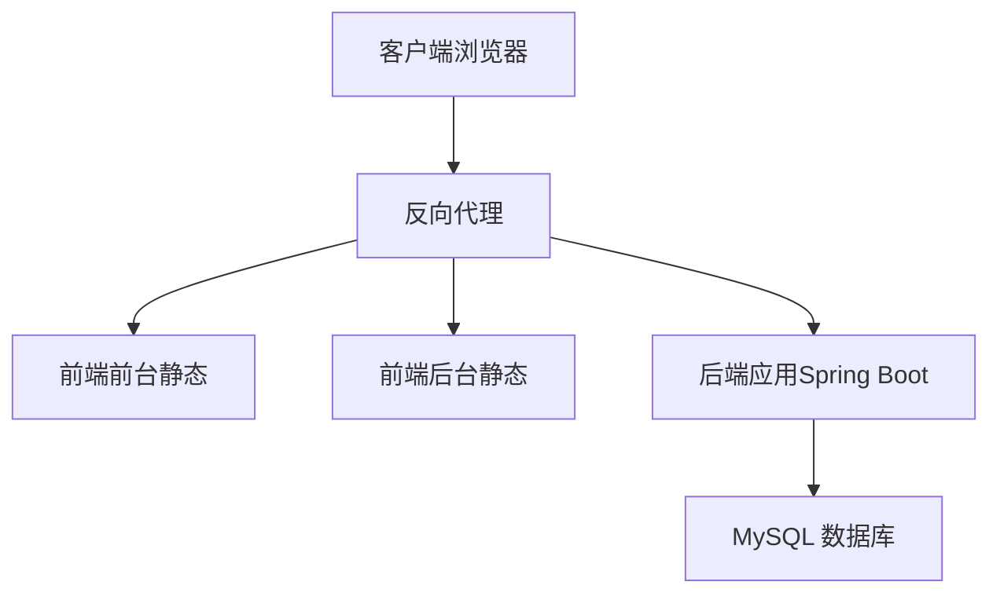
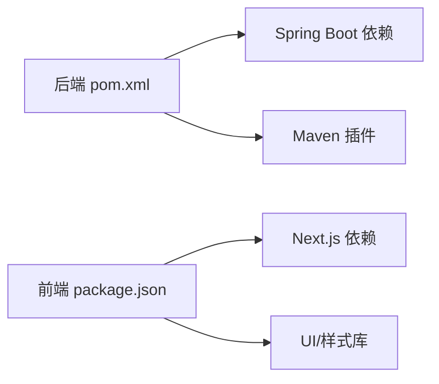

# 容器化部署

<cite>
**本文引用的文件**
- [backend/pom.xml](file://backend/pom.xml)
- [backend/src/main/resources/application.yaml](file://backend/src/main/resources/application.yaml)
- [scripts/application.yaml.template](file://scripts/application.yaml.template)
- [backend/src/main/java/com/getjobs/application/controller/HealthController.java](file://backend/src/main/java/com/getjobs/application/controller/HealthController.java)
- [backend/src/main/java/com/getjobs/application/config/StaticServerConfiguration.java](file://backend/src/main/java/com/getjobs/application/config/StaticServerConfiguration.java)
- [front/package.json](file://front/package.json)
- [front/next.config.ts](file://front/next.config.ts)
- [front/server.config.js](file://front/server.config.js)
- [front-admin/package.json](file://front-admin/package.json)
- [front-admin/next.config.ts](file://front-admin/next.config.ts)
</cite>

## 目录
1. [简介](#简介)
2. [项目结构](#项目结构)
3. [核心组件](#核心组件)
4. [架构总览](#架构总览)
5. [详细组件分析](#详细组件分析)
6. [依赖关系分析](#依赖关系分析)
7. [性能考量](#性能考量)
8. [故障排查指南](#故障排查指南)
9. [结论](#结论)
10. [附录](#附录)

## 简介
本文件面向 GetJobs 项目的容器化部署，覆盖后端 Spring Boot 应用与前端 Next.js 应用的镜像构建、docker-compose 编排、网络与卷配置、环境变量传递、健康检查与重启策略、资源限制以及安全加固建议。文档同时提供多阶段构建思路以减小镜像体积并提升构建效率。

## 项目结构
- 后端采用 Spring Boot 3（Java 21），使用 Maven 构建，提供 REST API 与静态资源服务。
- 前端包含两套 Next.js 应用：用户前台与后台管理，均采用静态导出模式，便于独立部署与反向代理。
- 配置文件通过 application.yaml 管理数据库、日志、MyBatis Plus、Playwright 等运行参数；前端通过 next.config.ts 与 server.config.js 注入运行时配置。

**章节来源**
- [backend/src/main/resources/application.yaml:1-91](file://backend/src/main/resources/application.yaml#L1-L91)
- [front/next.config.ts:1-23](file://front/next.config.ts#L1-L23)
- [front-admin/next.config.ts:1-12](file://front-admin/next.config.ts#L1-L12)

## 核心组件
- 后端服务
  - Spring Boot 应用，监听 18888 端口，提供 /api/health 健康检查接口。
  - 数据源配置指向外部 MySQL，连接池参数在 application.yaml 中集中管理。
  - 日志输出至文件，便于容器内持久化与采集。
- 前端应用
  - 用户前台与后台管理均采用静态导出（output: export），无需 Node.js 运行时即可部署。
  - 前端通过 next.config.ts 将 API 基础地址注入环境变量，server.config.js 提供开发/生产端口与主机名等配置。
- 静态资源服务
  - 当未检测到前端开发服务时，后端内置静态资源服务在 6866 端口提供静态文件，便于本地联调。

**章节来源**
- [backend/src/main/java/com/getjobs/application/controller/HealthController.java:1-32](file://backend/src/main/java/com/getjobs/application/controller/HealthController.java#L1-L32)
- [backend/src/main/resources/application.yaml:13-29](file://backend/src/main/resources/application.yaml#L13-L29)
- [backend/src/main/resources/application.yaml:32-43](file://backend/src/main/resources/application.yaml#L32-L43)
- [backend/src/main/java/com/getjobs/application/config/StaticServerConfiguration.java:1-41](file://backend/src/main/java/com/getjobs/application/config/StaticServerConfiguration.java#L1-L41)
- [front/next.config.ts:6-20](file://front/next.config.ts#L6-L20)
- [front/server.config.js:27-31](file://front/server.config.js#L27-L31)

## 架构总览
容器化部署建议采用三容器模型：
- 反向代理（Nginx/traefik/caddy）：统一入口、静态资源分发、TLS 终止与路由转发。
- 后端应用：Spring Boot，提供 API 与静态资源回退能力。
- 前端静态站点：Next.js 静态导出产物，由反向代理直接提供。

[本图为概念性架构示意，不对应具体源码文件]

## 详细组件分析

### 后端镜像构建（Spring Boot）
- 基础镜像选择
  - 推荐使用官方 OpenJDK 21 运行时镜像作为基础，确保与项目 Java 版本一致。
- 构建流程
  - 使用 Maven 插件生成可执行 JAR，并在 CI 中缓存依赖以加速构建。
  - 可选：在构建阶段进行代码混淆（如使用 proguard-maven-plugin），但需评估对调试与热修复的影响。
- 多阶段构建建议
  - 阶段一：使用 maven:3.9-openjdk-21 作为构建环境，执行 mvn package 生成 JAR。
  - 阶段二：使用 openjdk:21-jre-slim 作为运行环境，复制 JAR 至只读目录，设置非 root 用户运行，禁用不必要的系统包。
  - 阶段三：可选，将 JAR 进一步打包为最小镜像（如 distroless），进一步缩小体积。
- 关键配置映射
  - 数据库连接：通过环境变量覆盖 application.yaml 中的 spring.datasource.* 字段。
  - 日志路径：将日志文件输出到 /app/logs，结合卷挂载实现持久化。
  - 端口暴露：EXPOSE 18888，配合容器编排的健康检查与探针。
- 健康检查
  - 对外暴露 /api/health，返回 UP 状态，作为容器健康探针的依据。
- 安全加固
  - 非 root 用户运行，最小权限原则。
  - 禁用不必要的系统工具与包，避免镜像膨胀与攻击面扩大。
  - 仅开放必要端口，使用只读根文件系统（部分场景可接受）。

**章节来源**
- [backend/pom.xml:190-292](file://backend/pom.xml#L190-L292)
- [backend/src/main/resources/application.yaml:13-29](file://backend/src/main/resources/application.yaml#L13-L29)
- [backend/src/main/resources/application.yaml:32-43](file://backend/src/main/resources/application.yaml#L32-L43)
- [backend/src/main/java/com/getjobs/application/controller/HealthController.java:24-31](file://backend/src/main/java/com/getjobs/application/controller/HealthController.java#L24-L31)

### 前端镜像构建（Next.js）
- 构建流程
  - 使用 Node.js 运行时安装依赖并执行 next build，随后静态导出（next export）。
  - 建议在 CI 中缓存 node_modules，提升构建速度。
- 多阶段构建建议
  - 阶段一：node:21-alpine 作为构建环境，执行 npm ci 与 next build。
  - 阶段二：使用 nginx:alpine 或 caddy:alpine 作为静态服务镜像，将导出产物拷贝至 /usr/share/nginx/html 或 Caddy 的静态目录。
  - 阶段三：可选，使用更轻量的静态服务（如 tiny-http）仅提供静态文件，进一步缩小镜像。
- 关键配置映射
  - API 基础地址：通过 next.config.ts 注入环境变量，运行时由前端读取。
  - 图片优化：静态导出模式下禁用图片优化，避免运行时依赖。
- 安全加固
  - 构建阶段使用只读文件系统，避免构建时写入。
  - 运行阶段使用非 root 用户与最小化镜像。

**章节来源**
- [front/package.json:5-14](file://front/package.json#L5-L14)
- [front/next.config.ts:6-20](file://front/next.config.ts#L6-L20)
- [front/server.config.js:27-31](file://front/server.config.js#L27-L31)
- [front-admin/package.json:5-10](file://front-admin/package.json#L5-L10)
- [front-admin/next.config.ts:3-9](file://front-admin/next.config.ts#L3-L9)

### docker-compose 编排
- 服务定义
  - 反向代理：提供 HTTPS 终止、静态资源分发与后端路由转发。
  - 后端应用：Spring Boot，挂载 application.yaml（或通过环境变量覆盖），暴露 18888。
  - 前端静态：Next.js 静态导出产物，由反向代理提供。
  - 数据库：外部 MySQL 实例（或使用 mysql:8 镜像，按需选择）。
- 网络与卷
  - 自定义桥接网络，隔离服务间通信。
  - 卷挂载：后端日志目录、配置文件（application.yaml）、静态资源目录。
- 环境变量传递
  - 使用 .env 或 compose 的 environment/env_file，覆盖数据库连接、JWT 密钥、日志级别等。
- 健康检查与重启策略
  - 后端：基于 /api/health 的 HTTP 健康检查，重启策略为 on-failure 或 unless-stopped。
  - 前端：静态服务通常无需健康检查，但可配置探针以验证 200 OK。
- 资源限制
  - 限制内存与 CPU，防止资源争用影响整体稳定性。

**章节来源**
- [backend/src/main/java/com/getjobs/application/controller/HealthController.java:24-31](file://backend/src/main/java/com/getjobs/application/controller/HealthController.java#L24-L31)
- [backend/src/main/resources/application.yaml:13-29](file://backend/src/main/resources/application.yaml#L13-L29)

### 多阶段构建优化
- 后端
  - 构建阶段：maven:3.9-openjdk-21，缓存依赖，生成可执行 JAR。
  - 运行阶段：openjdk:21-jre-slim，非 root 用户，只读根文件系统，最小化运行时。
  - 可选：distroless 或 alpine 基础镜像，进一步压缩体积。
- 前端
  - 构建阶段：node:21-alpine，缓存依赖，静态导出。
  - 运行阶段：nginx:alpine 或 caddy:alpine，提供静态文件服务。
- 效果
  - 减少镜像层数与体积，降低拉取与启动时间，提升安全性。

**章节来源**
- [backend/pom.xml:190-292](file://backend/pom.xml#L190-L292)
- [front/package.json:5-14](file://front/package.json#L5-L14)

### 容器网络、卷与环境变量
- 网络
  - 使用自定义桥接网络，服务间通过服务名访问；后端与前端通过反向代理互通。
- 卷
  - 日志目录：/app/logs（后端）。
  - 配置文件：挂载 application.yaml 或通过环境变量覆盖。
  - 静态资源：前端导出目录挂载至反向代理静态目录。
- 环境变量
  - 数据库连接：spring.datasource.url、username、password。
  - JWT 密钥：admin.jwt.secret。
  - 日志级别：logging.level.root。
  - 前端 API 基础地址：通过 next.config.ts 注入的 API_BASE_URL。

**章节来源**
- [backend/src/main/resources/application.yaml:13-29](file://backend/src/main/resources/application.yaml#L13-L29)
- [backend/src/main/resources/application.yaml:53-58](file://backend/src/main/resources/application.yaml#L53-L58)
- [front/next.config.ts:6-12](file://front/next.config.ts#L6-L12)
- [front/server.config.js:27-31](file://front/server.config.js#L27-L31)

### 健康检查、重启策略与资源限制
- 健康检查
  - 后端：/api/health 返回 UP，作为 HTTP GET 健康探针。
  - 前端：静态服务返回 200 OK。
- 重启策略
  - on-failure：在异常退出时自动重启。
  - unless-stopped：除非手动停止，否则持续重启。
- 资源限制
  - 设置 memory limit 与 cpu shares，避免资源争用。
  - 为数据库与应用分别设置合理的资源上限与下限。

**章节来源**
- [backend/src/main/java/com/getjobs/application/controller/HealthController.java:24-31](file://backend/src/main/java/com/getjobs/application/controller/HealthController.java#L24-L31)

## 依赖关系分析
- 后端依赖
  - Spring Web、Security、JDBC、MyBatis-Plus、Playwright、Dotenv 等。
  - 构建插件：spring-boot-maven-plugin、maven-compiler-plugin、maven-surefire-plugin、proguard-maven-plugin。
- 前端依赖
  - Next.js、React、TailwindCSS、Chart.js 等。
  - 构建脚本：dev/build/start/lint 等。

**图示来源**
- [backend/pom.xml:42-188](file://backend/pom.xml#L42-L188)
- [front/package.json:15-46](file://front/package.json#L15-L46)
- [front-admin/package.json:11-39](file://front-admin/package.json#L11-L39)

**章节来源**
- [backend/pom.xml:42-188](file://backend/pom.xml#L42-L188)
- [front/package.json:15-46](file://front/package.json#L15-L46)
- [front-admin/package.json:11-39](file://front-admin/package.json#L11-L39)

## 性能考量
- 构建阶段
  - 缓存 Maven/Node 依赖，减少重复下载。
  - 使用多阶段构建，分离构建与运行环境。
- 运行阶段
  - 后端：JVM 参数调优（堆大小、GC 策略），连接池参数合理配置。
  - 前端：静态导出减少运行时开销；CDN 加速静态资源。
- 网络与存储
  - 反向代理缓存静态资源；数据库连接复用与超时控制。
  - 日志与配置文件使用卷挂载，避免频繁 I/O。

[本节为通用性能建议，不直接分析具体文件]

## 故障排查指南
- 健康检查失败
  - 检查 /api/health 是否可达，确认后端端口 18888 是否正确暴露与映射。
  - 查看后端日志文件（/app/logs）定位异常。
- 数据库连接异常
  - 校验环境变量 spring.datasource.url/username/password 是否正确。
  - 确认数据库实例可达与防火墙策略。
- 前端无法访问
  - 确认静态导出产物已正确挂载至反向代理静态目录。
  - 检查 next.config.ts 中 API 基础地址是否与后端一致。
- 静态资源回退
  - 若前端开发服务未运行，后端会提供静态资源服务（6866 端口），可用于联调验证。

**章节来源**
- [backend/src/main/java/com/getjobs/application/controller/HealthController.java:24-31](file://backend/src/main/java/com/getjobs/application/controller/HealthController.java#L24-L31)
- [backend/src/main/resources/application.yaml:13-29](file://backend/src/main/resources/application.yaml#L13-L29)
- [backend/src/main/java/com/getjobs/application/config/StaticServerConfiguration.java:24-41](file://backend/src/main/java/com/getjobs/application/config/StaticServerConfiguration.java#L24-L41)
- [front/next.config.ts:6-12](file://front/next.config.ts#L6-L12)

## 结论
通过多阶段构建与最小化运行时镜像，结合 docker-compose 的网络、卷与环境变量管理，GetJobs 项目可在容器环境中实现高效、稳定与安全的部署。建议优先采用静态导出的前端方案，配合反向代理统一入口与健康检查机制，确保线上运行质量。

## 附录
- 配置模板参考
  - application.yaml 模板提供了数据库、日志、MyBatis Plus 等关键配置项，便于在容器环境中覆盖。
- 前端运行时配置
  - next.config.ts 将 API 基础地址注入环境变量，server.config.js 提供开发/生产端口与主机名等配置。

**章节来源**
- [scripts/application.yaml.template:10-90](file://scripts/application.yaml.template#L10-L90)
- [front/next.config.ts:6-20](file://front/next.config.ts#L6-L20)
- [front/server.config.js:27-31](file://front/server.config.js#L27-L31)