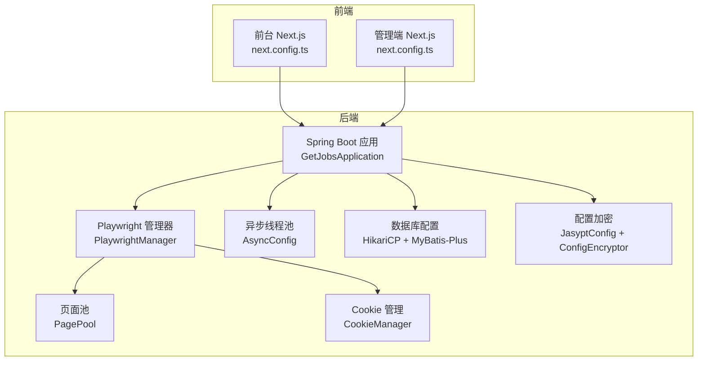
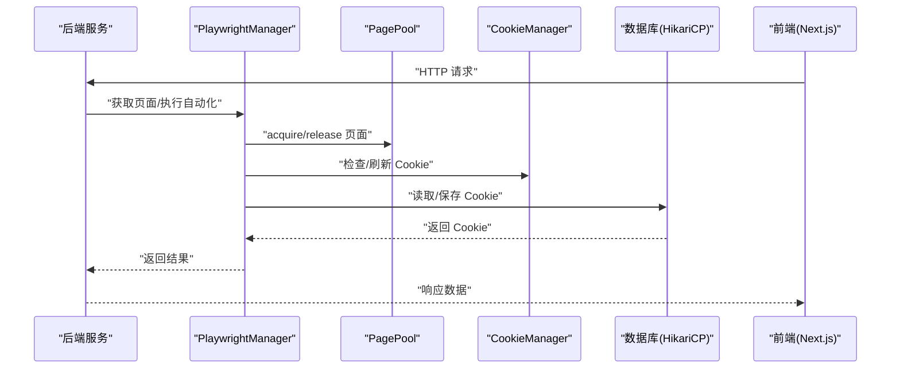
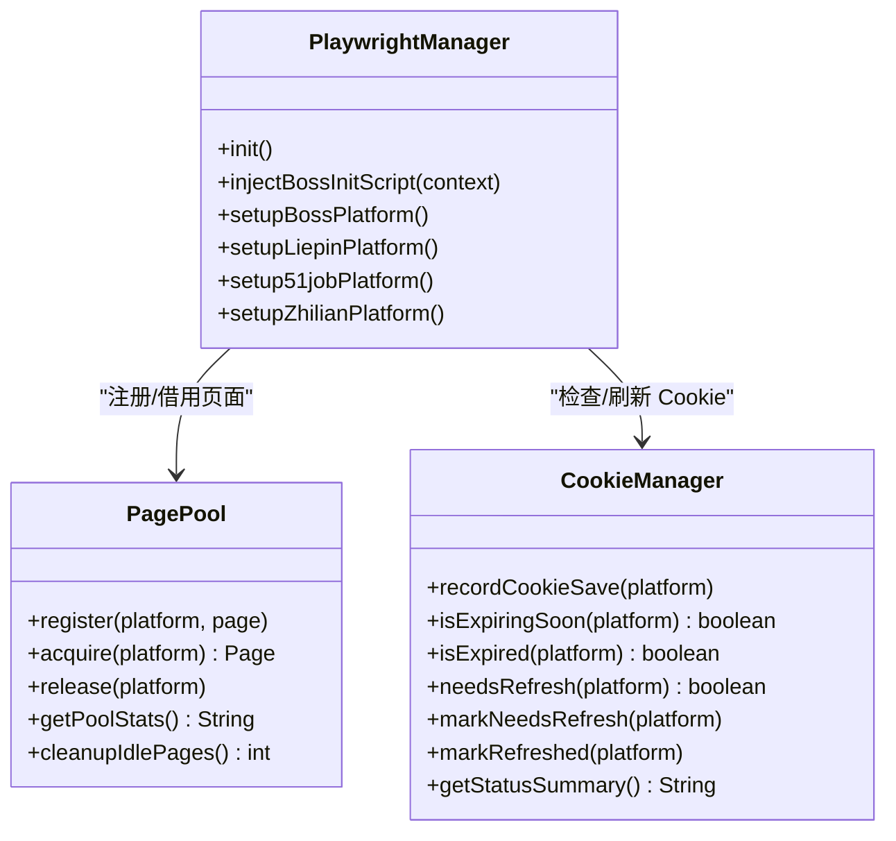
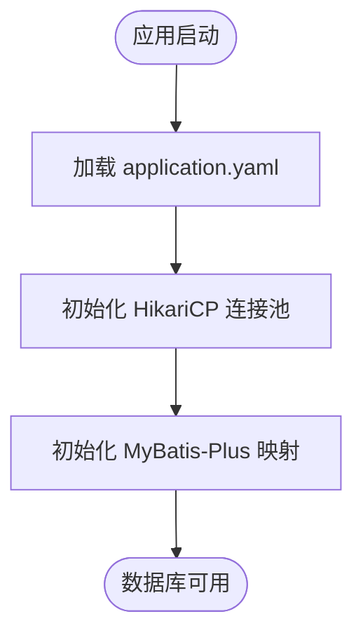
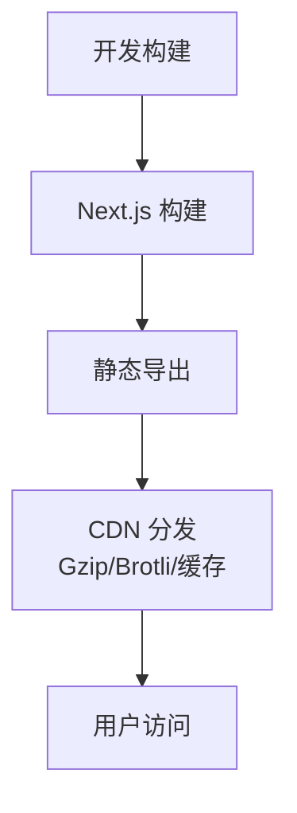
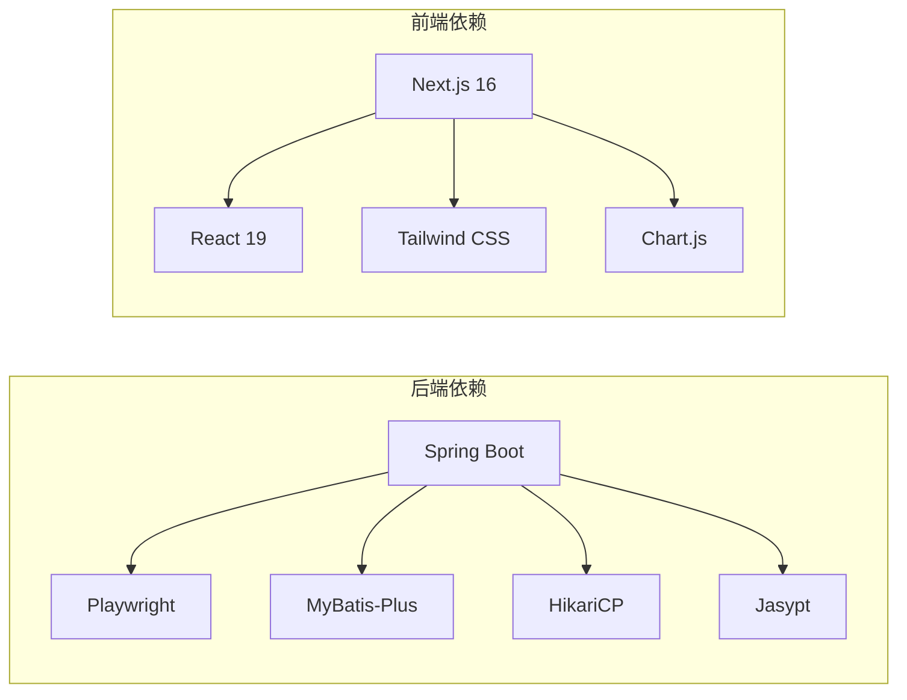

# 性能优化

<cite>
**本文引用的文件**
- [application.yaml](file://backend/src/main/resources/application.yaml)
- [GetJobsApplication.java](file://backend/src/main/java/com/getjobs/GetJobsApplication.java)
- [pom.xml](file://backend/pom.xml)
- [PlaywrightManager.java](file://backend/src/main/java/com/getjobs/worker/manager/PlaywrightManager.java)
- [PagePool.java](file://backend/src/main/java/com/getjobs/worker/utils/PagePool.java)
- [CookieManager.java](file://backend/src/main/java/com/getjobs/worker/utils/CookieManager.java)
- [AsyncConfig.java](file://backend/src/main/java/com/getjobs/application/config/AsyncConfig.java)
- [WebConfig.java](file://backend/src/main/java/com/getjobs/application/config/WebConfig.java)
- [JasyptConfig.java](file://backend/src/main/java/com/getjobs/application/config/JasyptConfig.java)
- [ConfigEncryptor.java](file://backend/src/main/java/com/getjobs/common/util/ConfigEncryptor.java)
- [application.yaml.template](file://scripts/application.yaml.template)
- [next.config.ts（前台）](file://front/next.config.ts)
- [next.config.ts（前台管理端）](file://front-admin/next.config.ts)
- [package.json（前台）](file://front/package.json)
- [package.json（前台管理端）](file://front-admin/package.json)
</cite>

## 目录
1. [简介](#简介)
2. [项目结构](#项目结构)
3. [核心组件](#核心组件)
4. [架构总览](#架构总览)
5. [详细组件分析](#详细组件分析)
6. [依赖分析](#依赖分析)
7. [性能考虑](#性能考虑)
8. [故障排查指南](#故障排查指南)
9. [结论](#结论)
10. [附录](#附录)

## 简介
本文件面向 GetJobs 项目的性能优化，覆盖后端 JVM 与数据库、Playwright 自动化引擎、前端构建与运行时性能、负载均衡与水平扩展、性能监控与瓶颈分析以及性能测试与基准方案。目标是帮助开发者与运维人员以系统化方式提升系统整体吞吐、稳定性与响应能力。

## 项目结构
- 后端采用 Spring Boot 3 + MyBatis-Plus，使用 HikariCP 连接池与 Jasypt 加密配置，Playwright 管理多平台自动化。
- 前端使用 Next.js 16，前台与管理端分别导出静态产物，便于 CDN 分发与边缘加速。
- 配置文件集中于 application.yaml，支持模板化部署与加密配置。

**图表来源**
- [GetJobsApplication.java:18-22](file://backend/src/main/java/com/getjobs/GetJobsApplication.java#L18-L22)
- [PlaywrightManager.java:40-221](file://backend/src/main/java/com/getjobs/worker/manager/PlaywrightManager.java#L40-L221)
- [PagePool.java:25-134](file://backend/src/main/java/com/getjobs/worker/utils/PagePool.java#L25-L134)
- [CookieManager.java:31-197](file://backend/src/main/java/com/getjobs/worker/utils/CookieManager.java#L31-L197)
- [AsyncConfig.java:18-54](file://backend/src/main/java/com/getjobs/application/config/AsyncConfig.java#L18-L54)
- [application.yaml:13-27](file://backend/src/main/resources/application.yaml#L13-L27)
- [JasyptConfig.java:17-37](file://backend/src/main/java/com/getjobs/application/config/JasyptConfig.java#L17-L37)
- [ConfigEncryptor.java:15-39](file://backend/src/main/java/com/getjobs/common/util/ConfigEncryptor.java#L15-L39)
- [next.config.ts（前台）:6-20](file://front/next.config.ts#L6-L20)
- [next.config.ts（前台管理端）:3-9](file://front-admin/next.config.ts#L3-L9)

**章节来源**
- [GetJobsApplication.java:18-22](file://backend/src/main/java/com/getjobs/GetJobsApplication.java#L18-L22)
- [application.yaml:13-27](file://backend/src/main/resources/application.yaml#L13-L27)
- [next.config.ts（前台）:6-20](file://front/next.config.ts#L6-L20)
- [next.config.ts（前台管理端）:3-9](file://front-admin/next.config.ts#L3-L9)

## 核心组件
- Playwright 管理器：负责浏览器实例、上下文、页面生命周期与登录状态监控，支持资源拦截与超时配置。
- 页面池：对 Page 进行注册、借用、释放与统计，支持空闲超时与活跃度追踪。
- Cookie 管理：记录 Cookie 保存时间、预测过期与刷新阈值，提供刷新触发与状态摘要。
- 异步线程池：限制并发任务规模，避免线程风暴，保障后台作业稳定。
- 数据库与配置：HikariCP 连接池、MyBatis-Plus 映射、Jasypt 加密配置，模板化部署。

**章节来源**
- [PlaywrightManager.java:40-221](file://backend/src/main/java/com/getjobs/worker/manager/PlaywrightManager.java#L40-L221)
- [PagePool.java:25-134](file://backend/src/main/java/com/getjobs/worker/utils/PagePool.java#L25-L134)
- [CookieManager.java:31-197](file://backend/src/main/java/com/getjobs/worker/utils/CookieManager.java#L31-L197)
- [AsyncConfig.java:18-54](file://backend/src/main/java/com/getjobs/application/config/AsyncConfig.java#L18-L54)
- [application.yaml:13-27](file://backend/src/main/resources/application.yaml#L13-L27)
- [JasyptConfig.java:17-37](file://backend/src/main/java/com/getjobs/application/config/JasyptConfig.java#L17-L37)
- [ConfigEncryptor.java:15-39](file://backend/src/main/java/com/getjobs/common/util/ConfigEncryptor.java#L15-L39)

## 架构总览
后端通过 PlaywrightManager 统一管理浏览器资源，PagePool 对页面进行池化复用，CookieManager 管理登录态生命周期，AsyncConfig 控制异步任务并发，数据库通过 HikariCP 提供连接池能力。前后端通过 API 交互，前端采用静态导出以提升分发效率。

**图表来源**
- [PlaywrightManager.java:114-221](file://backend/src/main/java/com/getjobs/worker/manager/PlaywrightManager.java#L114-L221)
- [PagePool.java:74-99](file://backend/src/main/java/com/getjobs/worker/utils/PagePool.java#L74-L99)
- [CookieManager.java:62-153](file://backend/src/main/java/com/getjobs/worker/utils/CookieManager.java#L62-L153)
- [application.yaml:13-27](file://backend/src/main/resources/application.yaml#L13-L27)

## 详细组件分析

### Playwright 自动化引擎性能优化
- 页面池管理
  - 通过 PagePool 注册与统计页面使用情况，记录访问次数、空闲时间与生命周期，便于识别资源浪费与回收时机。
  - 当前实现为“仅观测”，建议在后续阶段实现“空闲回收”与“动态池大小调整”，以降低内存占用与提高并发能力。
- 并发控制
  - PlaywrightManager 在初始化时并发创建页面并并行初始化各平台，减少总体启动时间。
  - 登录状态监控通过事件驱动，避免轮询带来的 CPU 占用。
- 资源使用优化
  - 支持资源拦截开关，可在高负载场景下减少非必要资源下载，降低内存与网络压力。
  - 通过超时配置与重试策略平衡稳定性与性能。
- Cookie 生命周期
  - CookieManager 基于平台预期有效期与刷新阈值，提前触发刷新，避免登录失效导致的重试风暴。

**图表来源**
- [PlaywrightManager.java:40-221](file://backend/src/main/java/com/getjobs/worker/manager/PlaywrightManager.java#L40-L221)
- [PagePool.java:25-134](file://backend/src/main/java/com/getjobs/worker/utils/PagePool.java#L25-L134)
- [CookieManager.java:31-197](file://backend/src/main/java/com/getjobs/worker/utils/CookieManager.java#L31-L197)

**章节来源**
- [PlaywrightManager.java:40-221](file://backend/src/main/java/com/getjobs/worker/manager/PlaywrightManager.java#L40-L221)
- [PagePool.java:25-134](file://backend/src/main/java/com/getjobs/worker/utils/PagePool.java#L25-L134)
- [CookieManager.java:31-197](file://backend/src/main/java/com/getjobs/worker/utils/CookieManager.java#L31-L197)

### 数据库与连接池优化
- HikariCP 连接池
  - 最大连接数、空闲超时与最大生命周期已在配置中设定，建议结合慢查询日志与连接池指标进行调优。
- MyBatis-Plus
  - 开启下划线转驼峰映射，规范 SQL 与实体字段命名，减少 ORM 层转换成本。
- 配置加密
  - 使用 Jasypt 与模板化配置，避免明文密码，同时通过环境变量与 JVM 参数灵活注入密钥。

**图表来源**
- [application.yaml:13-27](file://backend/src/main/resources/application.yaml#L13-L27)
- [application.yaml.template:14-40](file://scripts/application.yaml.template#L14-L40)
- [JasyptConfig.java:17-37](file://backend/src/main/java/com/getjobs/application/config/JasyptConfig.java#L17-L37)
- [ConfigEncryptor.java:15-39](file://backend/src/main/java/com/getjobs/common/util/ConfigEncryptor.java#L15-L39)

**章节来源**
- [application.yaml:13-27](file://backend/src/main/resources/application.yaml#L13-L27)
- [application.yaml.template:14-40](file://scripts/application.yaml.template#L14-L40)
- [JasyptConfig.java:17-37](file://backend/src/main/java/com/getjobs/application/config/JasyptConfig.java#L17-L37)
- [ConfigEncryptor.java:15-39](file://backend/src/main/java/com/getjobs/common/util/ConfigEncryptor.java#L15-L39)

### 前端性能优化指南
- 静态资源压缩与导出
  - 前台与管理端均采用静态导出，禁用图片优化以适配静态分发场景，建议配合 CDN 启用 Gzip/Brotli 压缩与缓存头。
- 构建与打包
  - Next.js 16 默认开启生产优化，建议在 CI 中启用 Terser/最小化与 Tree Shaking。
- 懒加载与路由
  - 使用 React.lazy 与 Suspense 对重型组件进行懒加载；利用 Next.js 的动态路由与增量静态再生（ISR）优化热点页面。
- 样式与脚本
  - Tailwind CSS 与 Radix UI 组件按需引入，减少首屏 JS 体积；第三方库尽量使用 ESM 并配合外部化策略。

**图表来源**
- [next.config.ts（前台）:6-20](file://front/next.config.ts#L6-L20)
- [next.config.ts（前台管理端）:3-9](file://front-admin/next.config.ts#L3-L9)
- [package.json（前台）:15-46](file://front/package.json#L15-L46)
- [package.json（前台管理端）:11-40](file://front-admin/package.json#L11-L40)

**章节来源**
- [next.config.ts（前台）:6-20](file://front/next.config.ts#L6-L20)
- [next.config.ts（前台管理端）:3-9](file://front-admin/next.config.ts#L3-L9)
- [package.json（前台）:15-46](file://front/package.json#L15-L46)
- [package.json（前台管理端）:11-40](file://front-admin/package.json#L11-L40)

### 负载均衡与水平扩展策略
- 后端扩展
  - 通过多实例横向扩展，使用反向代理（Nginx/Traefik）进行请求分发；结合健康检查与熔断策略提升可用性。
  - 异步任务线程池限制并发，避免单实例过载；数据库连接池上限与慢查询治理共同保障数据库稳定。
- 前端扩展
  - 静态导出产物部署至 CDN，边缘节点就近响应；结合缓存策略与压缩算法提升首屏与二次访问体验。
- 配置与密钥
  - 使用模板化配置与 Jasypt 加密，结合环境变量注入，确保不同环境一致性与安全性。

**章节来源**
- [AsyncConfig.java:18-54](file://backend/src/main/java/com/getjobs/application/config/AsyncConfig.java#L18-L54)
- [application.yaml:13-27](file://backend/src/main/resources/application.yaml#L13-L27)
- [application.yaml.template:14-40](file://scripts/application.yaml.template#L14-L40)
- [JasyptConfig.java:17-37](file://backend/src/main/java/com/getjobs/application/config/JasyptConfig.java#L17-L37)

## 依赖分析
- 后端依赖
  - Playwright 1.51.0、MyBatis-Plus、HikariCP、Jasypt、Spring Security、Jackson YAML、Apache HttpClient5。
- 前端依赖
  - Next.js 16、React 19、Tailwind CSS、Chart.js、Radix UI 等，构建工具链包含 Terser、PostCSS、TypeScript。

**图表来源**
- [pom.xml:42-177](file://backend/pom.xml#L42-L177)
- [package.json（前台）:15-46](file://front/package.json#L15-L46)
- [package.json（前台管理端）:11-40](file://front-admin/package.json#L11-L40)

**章节来源**
- [pom.xml:42-177](file://backend/pom.xml#L42-L177)
- [package.json（前台）:15-46](file://front/package.json#L15-L46)
- [package.json（前台管理端）:11-40](file://front-admin/package.json#L11-L40)

## 性能考虑
- JVM 参数优化（建议）
  - 堆大小：根据业务峰值 QPS 与对象分配速率设定初始与最大堆；结合 GC 日志分析停顿。
  - GC 策略：优先使用 G1GC 或 ZGC（JDK 11+），开启自适应尺寸与并行回收；针对长时间停顿场景评估 G1 的目标停顿时间。
  - JIT 优化：启用 TieredCompilation，结合 AOT（如 GraalVM Native Image）进一步降低冷启动。
  - 其他：线程栈大小、元空间、直接内存与文件句柄上限。
- 数据库查询优化（建议）
  - 慢查询日志与 EXPLAIN 分析，索引覆盖与查询重写；批量写入与事务拆分；连接池参数与超时设置。
- 缓存策略（建议）
  - Redis/Memcached 作为热点数据缓存；基于 TTL 与 LFU/LRU 策略；分布式锁与缓存一致性。
- 前端性能（建议）
  - 图片与字体压缩、HTTP/2 多路复用、Service Worker 缓存、骨架屏与占位符；首屏关键路径最小化。
- 负载均衡（建议）
  - 健康检查、权重轮询/最少连接/IP 哈希；灰度发布与金丝雀；限流与熔断。
- 监控与告警（建议）
  - 指标：CPU、内存、GC、QPS、P95/P99、错误率、数据库连接池使用率、页面池空闲率、Cookie 刷新频率。
  - 日志：结构化日志、采样与聚合；异常链路追踪。
- 性能测试与基准（建议）
  - 压力测试：JMeter/Locust/K6；数据库压测：sysbench；前端压测：Lighthouse/Calibre。
  - 基准方案：固定场景与数据集，对比不同 JVM/GC/连接池/缓存配置下的指标变化。

[本节为通用指导，不直接分析具体文件，故无“章节来源”]

## 故障排查指南
- Playwright 初始化失败
  - 检查 Chromium 安装路径与权限；确认 slow-mo 与启动参数合理；查看调试端口与日志。
- 页面池统计异常
  - 关注空闲超时与活跃度统计，定位是否存在页面泄漏或未正确释放。
- Cookie 刷新频繁
  - 检查平台预期有效期与刷新阈值配置，确认登录状态监控是否触发误判。
- 数据库连接不足
  - 观察连接池指标与慢查询，适当提升最大连接数与队列容量。
- 前端静态导出问题
  - 确认 images.unoptimized 与静态导出配置；检查 CDN 缓存与压缩策略。

**章节来源**
- [PlaywrightManager.java:114-221](file://backend/src/main/java/com/getjobs/worker/manager/PlaywrightManager.java#L114-L221)
- [PagePool.java:116-134](file://backend/src/main/java/com/getjobs/worker/utils/PagePool.java#L116-L134)
- [CookieManager.java:175-197](file://backend/src/main/java/com/getjobs/worker/utils/CookieManager.java#L175-L197)
- [application.yaml:13-27](file://backend/src/main/resources/application.yaml#L13-L27)
- [next.config.ts（前台）:6-20](file://front/next.config.ts#L6-L20)
- [next.config.ts（前台管理端）:3-9](file://front-admin/next.config.ts#L3-L9)

## 结论
通过合理的 JVM/GC/连接池调优、Playwright 页面池化与 Cookie 生命周期管理、前端静态导出与 CDN 加速、以及完善的监控与压测体系，GetJobs 可在保证稳定性的同时显著提升性能与用户体验。建议以渐进式方式落地各项优化，并持续以指标驱动迭代。

[本节为总结，不直接分析具体文件，故无“章节来源”]

## 附录
- 关键配置项参考
  - 数据库连接池：maximum-pool-size、idle-timeout、max-lifetime
  - Playwright：slow-mo、navigation-timeout、max-pages、idle-page-timeout、resource-blocking-enabled
  - Cookie：cookie-refresh-before-expiry
  - 日志：logback rollingpolicy、文件路径
- 建议的性能基线
  - QPS、P95/P99 响应时间、GC 停顿、数据库连接池使用率、页面池空闲率、Cookie 刷新成功率

**章节来源**
- [application.yaml:13-27](file://backend/src/main/resources/application.yaml#L13-L27)
- [application.yaml:70-101](file://backend/src/main/resources/application.yaml#L70-L101)
- [application.yaml.template:14-40](file://scripts/application.yaml.template#L14-L40)
- [next.config.ts（前台）:6-20](file://front/next.config.ts#L6-L20)
- [next.config.ts（前台管理端）:3-9](file://front-admin/next.config.ts#L3-L9)