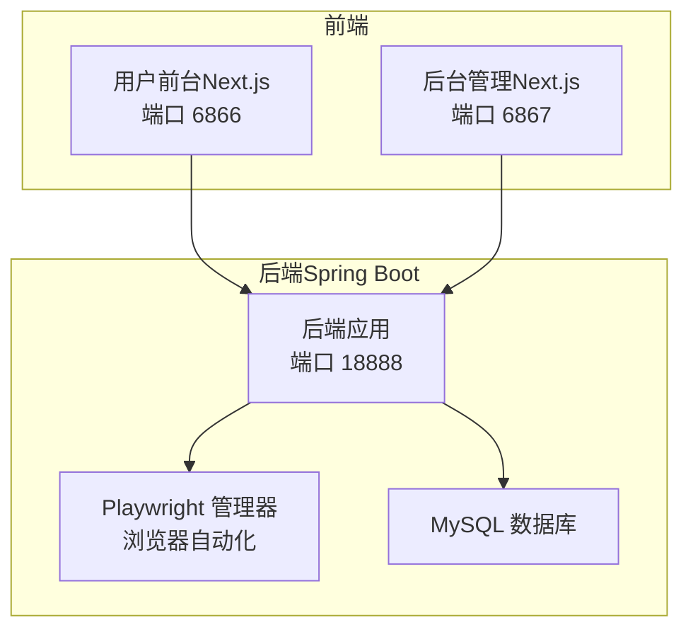
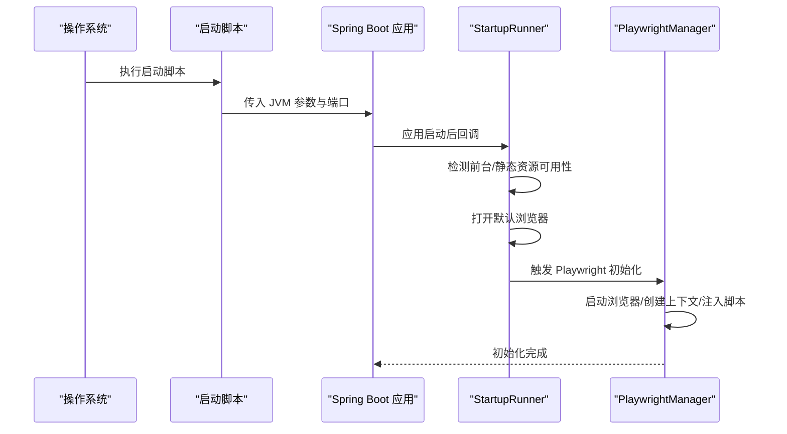
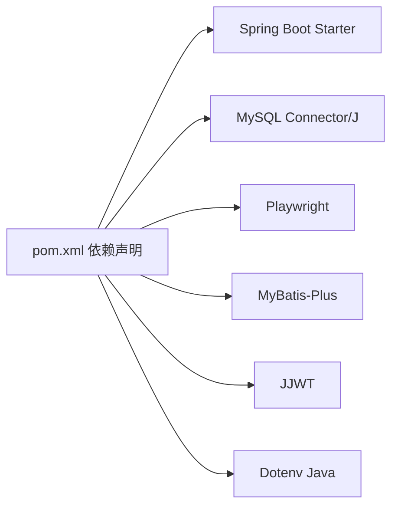

# 环境搭建

<cite>
**本文引用的文件**
- [application.yaml](file://backend/src/main/resources/application.yaml)
- [application.yaml.template](file://scripts/application.yaml.template)
- [pom.xml](file://backend/pom.xml)
- [package.json（前端）](file://front/package.json)
- [package.json（前端管理）](file://front-admin/package.json)
- [start.bat（Windows）](file://scripts/windows/start.bat)
- [start.sh（Unix/Mac）](file://scripts/unix/start.sh)
- [PlaywrightManager.java](file://backend/src/main/java/com/getjobs/worker/manager/PlaywrightManager.java)
- [anti-detection.js](file://backend/src/main/resources/anti-detection.js)
- [001_create_delivery_report.sql](file://scripts/migration/001_create_delivery_report.sql)
- [StartupRunner.java](file://backend/src/main/java/com/getjobs/application/config/StartupRunner.java)
- [README.md](file://README.md)
</cite>

## 目录
1. [简介](#简介)
2. [项目结构](#项目结构)
3. [核心组件](#核心组件)
4. [架构总览](#架构总览)
5. [详细组件分析](#详细组件分析)
6. [依赖关系分析](#依赖关系分析)
7. [性能注意事项](#性能注意事项)
8. [故障排除指南](#故障排除指南)
9. [结论](#结论)
10. [附录](#附录)

## 简介
本文件面向 GetJobs 项目的开发者与运维人员，提供从零搭建开发与生产环境的完整指南。内容覆盖系统要求、Java 与 Node.js 版本、MySQL 数据库、Playwright 依赖安装与配置、Maven 与 npm 依赖安装、数据库初始化与配置文件模板使用、环境变量与端口配置、跨平台安装步骤、配置文件结构与关键参数说明、环境验证与故障排除等。

## 项目结构
GetJobs 采用前后端分离架构：
- 后端基于 Spring Boot 3.5.7，使用 Java 21（工程属性中声明），提供 REST API 与浏览器自动化能力。
- 前端包含两个 Next.js 应用：用户前台与后台管理，分别运行在不同端口。
- 脚本目录提供跨平台启动脚本与配置模板，便于快速部署。

图表来源
- [StartupRunner.java:23-27](file://backend/src/main/java/com/getjobs/application/config/StartupRunner.java#L23-L27)
- [start.sh（Unix/Mac）:86-89](file://scripts/unix/start.sh#L86-L89)
- [start.bat（Windows）:81-84](file://scripts/windows/start.bat#L81-L84)

章节来源
- [pom.xml:24-40](file://backend/pom.xml#L24-L40)
- [package.json（前端）:1-43](file://front/package.json#L1-L43)
- [package.json（前端管理）:1-41](file://front-admin/package.json#L1-L41)

## 核心组件
- 后端配置与运行
  - Spring Boot 应用通过 Maven 构建，使用 Java 21，监听端口 18888。
  - 启动脚本负责检查 Java、端口占用、创建日志与数据目录，并以 JVM 参数加载外部配置。
- 前端应用
  - 用户前台与后台管理分别在 6866 与 6867 端口运行，支持开发与生产构建。
- 浏览器自动化
  - PlaywrightManager 负责启动浏览器、创建共享上下文与多页面、注入反检测脚本、加载 Cookie 并监控登录状态。
- 数据库
  - 使用 MySQL，提供初始化 SQL 脚本，包含投递报告表与相关字段迁移。

章节来源
- [application.yaml:13-29](file://backend/src/main/resources/application.yaml#L13-L29)
- [start.sh（Unix/Mac）:21-32](file://scripts/unix/start.sh#L21-L32)
- [start.bat（Windows）:15-28](file://scripts/windows/start.bat#L15-L28)
- [PlaywrightManager.java:114-221](file://backend/src/main/java/com/getjobs/worker/manager/PlaywrightManager.java#L114-L221)
- [001_create_delivery_report.sql:1-29](file://scripts/migration/001_create_delivery_report.sql#L1-L29)

## 架构总览
后端启动后会尝试打开前端管理页面（优先级：前台 > 后端静态资源），随后初始化 Playwright 浏览器自动化引擎。前端通过 HTTP 请求与后端交互，后端通过 Playwright 访问招聘平台并进行登录状态管理与数据抓取。

图表来源
- [StartupRunner.java:31-47](file://backend/src/main/java/com/getjobs/application/config/StartupRunner.java#L31-L47)
- [PlaywrightManager.java:114-221](file://backend/src/main/java/com/getjobs/worker/manager/PlaywrightManager.java#L114-L221)
- [start.sh（Unix/Mac）:86-89](file://scripts/unix/start.sh#L86-L89)
- [start.bat（Windows）:81-84](file://scripts/windows/start.bat#L81-L84)

## 详细组件分析

### 系统要求与依赖安装
- Java 与 Maven
  - 工程属性声明 Java 版本为 21，使用 Maven 构建。
  - 安装 JDK 21+ 与 Maven，确保命令行可用。
- Node.js 与 npm/pnpm
  - 前端使用 Next.js 16 与 React 19，依赖 pnpm 或 npm。
  - 安装 Node.js 与 npm/pnpm，确保命令行可用。
- MySQL
  - 后端配置使用 MySQL，需提前安装并准备数据库实例。
- Playwright 依赖
  - 后端依赖 Playwright，需安装对应浏览器二进制（脚本中提示使用 npx playwright install chromium）。

章节来源
- [pom.xml:24-40](file://backend/pom.xml#L24-L40)
- [package.json（前端）:1-43](file://front/package.json#L1-L43)
- [package.json（前端管理）:1-41](file://front-admin/package.json#L1-L41)
- [PlaywrightManager.java:127-136](file://backend/src/main/java/com/getjobs/worker/manager/PlaywrightManager.java#L127-L136)

### Maven 与 npm 依赖安装步骤
- Maven 依赖
  - 在后端目录执行构建命令，自动解析并下载依赖（含 Playwright、MyBatis-Plus、MySQL 驱动等）。
- npm/pnpm 依赖
  - 在前端与前端管理目录分别安装依赖，确保 Next.js 与相关 UI 依赖可用。

章节来源
- [pom.xml:43-188](file://backend/pom.xml#L43-L188)
- [package.json（前端）:12-41](file://front/package.json#L12-L41)
- [package.json（前端管理）:11-40](file://front-admin/package.json#L11-L40)

### 数据库初始化与配置文件模板
- 数据库初始化
  - 使用提供的 SQL 脚本创建投递报告表，并为 boss_data 表增加关联字段。
- 配置文件模板
  - 使用模板复制为 application.yaml，放置于 config/ 目录下，脚本会自动加载额外配置。
  - 后端默认配置包含数据源、日志、MyBatis Plus、JWT 与 Playwright 参数等。

章节来源
- [application.yaml.template:10-90](file://scripts/application.yaml.template#L10-L90)
- [application.yaml:13-91](file://backend/src/main/resources/application.yaml#L13-L91)
- [001_create_delivery_report.sql:1-29](file://scripts/migration/001_create_delivery_report.sql#L1-L29)

### 环境变量与端口配置
- 环境变量
  - 后端通过 Spring 配置加载环境变量（如 ADMIN_JWT_SECRET），可在启动时或系统环境设置。
- 端口
  - 后端固定端口 18888；前端前台 6866、后台管理 6867。
- 启动脚本
  - Windows 与 Unix/Mac 启动脚本均会检查端口占用并提示是否继续。

章节来源
- [application.yaml:54-58](file://backend/src/main/resources/application.yaml#L54-L58)
- [start.sh（Unix/Mac）:66-76](file://scripts/unix/start.sh#L66-L76)
- [start.bat（Windows）:64-71](file://scripts/windows/start.bat#L64-L71)

### 跨平台安装指南

#### Windows
- 步骤
  - 安装 JDK 21+、Maven、Node.js、npm/pnpm、MySQL。
  - 在后端目录执行 Maven 构建。
  - 在前端与前端管理目录安装 npm/pnpm 依赖。
  - 准备 application.yaml（参考模板），置于脚本目录的 config 子目录。
  - 运行启动脚本，确认端口 18888 未被占用。
- 注意
  - 脚本会自动创建 logs 与 data 目录，输出控制台日志到文件。

章节来源
- [start.bat（Windows）:15-98](file://scripts/windows/start.bat#L15-L98)

#### Linux/macOS
- 步骤
  - 安装 JDK 21+、Maven、Node.js、npm/pnpm、MySQL。
  - 在后端目录执行 Maven 构建。
  - 在前端与前端管理目录安装 npm/pnpm 依赖。
  - 准备 application.yaml（参考模板），置于脚本目录的 config 子目录。
  - 运行启动脚本，确认端口 18888 未被占用。
- 注意
  - 脚本会自动创建 logs 与 data 目录，并将日志输出到终端与文件。

章节来源
- [start.sh（Unix/Mac）:21-101](file://scripts/unix/start.sh#L21-L101)

### 配置文件结构与关键参数说明
- 数据源与连接池
  - 包含 JDBC URL、驱动、用户名、密码与 HikariCP 连接池参数。
- 日志与 MyBatis Plus
  - 控制台与文件日志格式、滚动策略；MyBatis Plus 映射与驼峰规则。
- 服务器端口
  - 后端固定端口 18888。
- JWT（后台管理）
  - 密钥、过期时间、签发者，支持通过环境变量覆盖。
- Playwright 参数
  - 操作延迟、导航超时、平台差异化超时、重试策略、健康检查、页面池与 Cookie 刷新策略等。

章节来源
- [application.yaml:13-91](file://backend/src/main/resources/application.yaml#L13-L91)
- [application.yaml.template:14-90](file://scripts/application.yaml.template#L14-L90)

### Playwright 配置与反检测
- 浏览器启动与参数
  - 非无头模式、固定调试端口、窗口最大化、禁用沙箱与软件光栅化等。
- 上下文与页面
  - 共享 BrowserContext，四个平台页面共享同一窗口不同标签页。
- 反检测脚本
  - 注入 anti-detection.js，劫持部分函数 toString 与控制台输出，降低被检测风险。
- Cookie 管理与登录监控
  - 从数据库加载 Cookie，注入上下文；并发初始化各平台页面并监控登录状态变化。

章节来源
- [PlaywrightManager.java:127-221](file://backend/src/main/java/com/getjobs/worker/manager/PlaywrightManager.java#L127-L221)
- [anti-detection.js:1-109](file://backend/src/main/resources/anti-detection.js#L1-L109)

### 环境验证
- 后端
  - 启动后自动打开浏览器访问前台或后端静态资源（若存在）。
  - Playwright 初始化成功后，日志中应出现相应成功信息。
- 前端
  - 访问 http://localhost:6866（前台）与 http://localhost:6867（后台管理）。
- 数据库
  - 执行初始化 SQL，确认表与字段创建成功。

章节来源
- [StartupRunner.java:31-47](file://backend/src/main/java/com/getjobs/application/config/StartupRunner.java#L31-L47)
- [PlaywrightManager.java:114-221](file://backend/src/main/java/com/getjobs/worker/manager/PlaywrightManager.java#L114-L221)
- [001_create_delivery_report.sql:1-29](file://scripts/migration/001_create_delivery_report.sql#L1-L29)

## 依赖关系分析
后端依赖关系概览（简化）：

图表来源
- [pom.xml:43-188](file://backend/pom.xml#L43-L188)

章节来源
- [pom.xml:43-188](file://backend/pom.xml#L43-L188)

## 性能注意事项
- Playwright 参数调优
  - 适当调整 slow-mo、navigation-timeout 与页面池大小，平衡稳定性与性能。
- 数据库连接池
  - 合理设置最大连接数、空闲超时与最大生命周期，避免连接泄漏。
- 日志滚动
  - 控制单文件大小与保留天数，避免磁盘占用过高。

章节来源
- [application.yaml:18-22](file://backend/src/main/resources/application.yaml#L18-L22)
- [application.yaml:63-87](file://backend/src/main/resources/application.yaml#L63-L87)

## 故障排除指南
- Java 版本不匹配
  - 确保安装 JDK 21+，启动脚本会检测并提示。
- 端口冲突
  - 启动脚本会检测端口占用，必要时更改端口或释放占用进程。
- Playwright 启动失败
  - 检查 Chromium 是否安装（脚本提示使用 npx playwright install chromium），确认路径与权限。
- 数据库连接失败
  - 校验 JDBC URL、用户名与密码，确保 MySQL 服务运行且网络可达。
- 前端无法访问
  - 确认前端已构建并在对应端口运行；若使用后端静态资源，确认 dist 目录存在。

章节来源
- [start.sh（Unix/Mac）:21-32](file://scripts/unix/start.sh#L21-L32)
- [start.bat（Windows）:15-28](file://scripts/windows/start.bat#L15-L28)
- [PlaywrightManager.java:127-136](file://backend/src/main/java/com/getjobs/worker/manager/PlaywrightManager.java#L127-L136)
- [application.yaml:13-17](file://backend/src/main/resources/application.yaml#L13-L17)
- [StartupRunner.java:74-104](file://backend/src/main/java/com/getjobs/application/config/StartupRunner.java#L74-L104)

## 结论
通过本指南，您可以完成 GetJobs 项目的开发与生产环境搭建。请严格遵循系统要求、依赖安装、配置文件准备与启动脚本执行流程，并结合故障排除章节定位问题。建议在开发机与生产机分别维护独立的 application.yaml，确保数据库与网络配置正确。

## 附录

### 端口与服务对照
- 后端 API：18888
- 前端前台：6866
- 前端后台管理：6867

章节来源
- [StartupRunner.java:23-27](file://backend/src/main/java/com/getjobs/application/config/StartupRunner.java#L23-L27)
- [package.json（前端）:5-11](file://front/package.json#L5-L11)
- [package.json（前端管理）:5-10](file://front-admin/package.json#L5-L10)