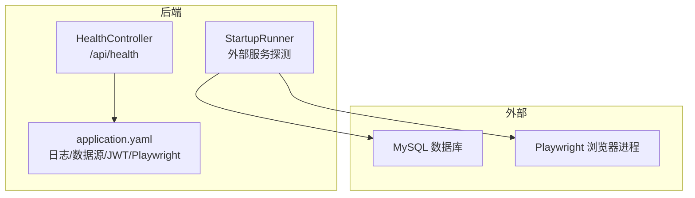
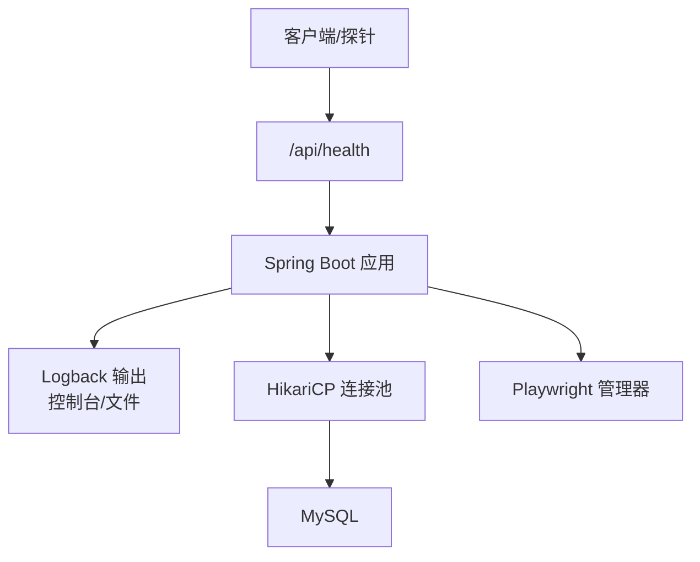
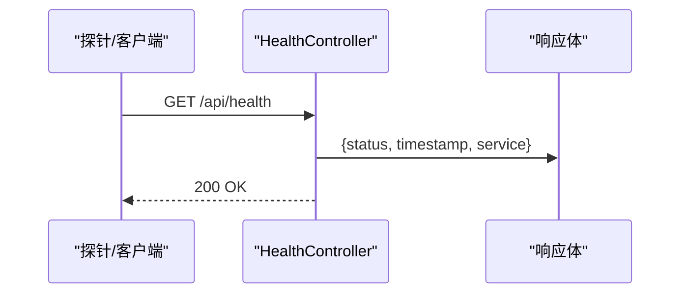
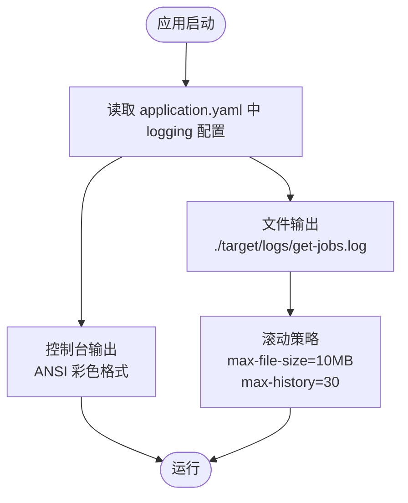
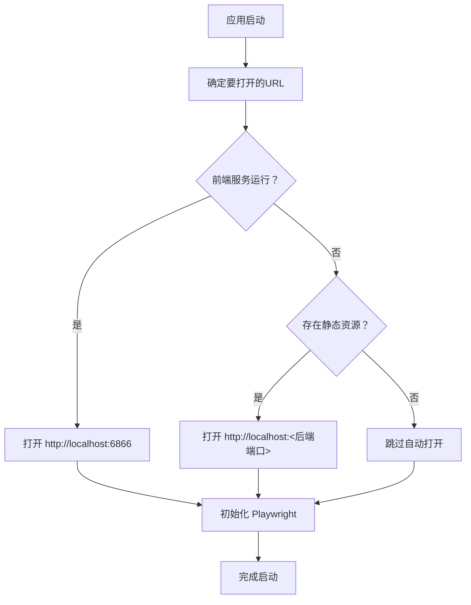
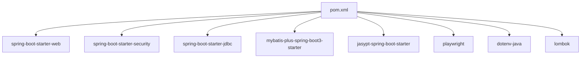

# 监控与日志

<cite>
**本文引用的文件**
- [HealthController.java](file://backend/src/main/java/com/getjobs/application/controller/HealthController.java)
- [application.yaml（主配置）](file://backend/src/main/resources/application.yaml)
- [StartupRunner.java](file://backend/src/main/java/com/getjobs/application/config/StartupRunner.java)
- [pom.xml](file://backend/pom.xml)
- [application.yaml.template（模板）](file://scripts/application.yaml.template)
</cite>

## 目录
1. [简介](#简介)
2. [项目结构](#项目结构)
3. [核心组件](#核心组件)
4. [架构总览](#架构总览)
5. [详细组件分析](#详细组件分析)
6. [依赖分析](#依赖分析)
7. [性能考虑](#性能考虑)
8. [故障排查指南](#故障排查指南)
9. [结论](#结论)
10. [附录](#附录)

## 简介
本文件面向 GetJobs 项目的监控与日志管理，聚焦以下目标：
- 应用健康检查接口的实现与使用方法：系统状态监控、数据库连接检查、外部服务可用性检测
- 日志配置与日志轮转策略：控制台输出格式、文件日志配置、日志级别管理
- 性能监控指标收集与展示方案：JVM 垃圾回收、线程池状态、数据库连接池监控
- 错误追踪与异常处理机制：APM 工具集成建议
- 日志分析工具与告警配置指南

## 项目结构
后端采用 Spring Boot 3 技术栈，健康检查接口位于控制器层；日志与数据源等关键配置集中在主配置文件中；启动阶段包含外部服务可用性探测逻辑。

图表来源
- [HealthController.java:1-33](file://backend/src/main/java/com/getjobs/application/controller/HealthController.java#L1-L33)
- [application.yaml（主配置）:41-53](file://backend/src/main/resources/application.yaml#L41-L53)
- [StartupRunner.java:31-104](file://backend/src/main/java/com/getjobs/application/config/StartupRunner.java#L31-L104)

章节来源
- [HealthController.java:1-33](file://backend/src/main/java/com/getjobs/application/controller/HealthController.java#L1-L33)
- [application.yaml（主配置）:13-26](file://backend/src/main/resources/application.yaml#L13-L26)
- [StartupRunner.java:31-104](file://backend/src/main/java/com/getjobs/application/config/StartupRunner.java#L31-L104)

## 核心组件
- 健康检查接口：提供基础系统健康状态，便于容器编排与负载均衡探活
- 日志系统：基于 Logback 的控制台与文件输出，支持 ANSI 彩色输出与按大小滚动
- 数据库连接池：HikariCP，内置连接测试查询与生命周期控制
- 外部服务可用性检测：启动阶段对前端与静态资源进行探测，并初始化 Playwright

章节来源
- [HealthController.java:24-31](file://backend/src/main/java/com/getjobs/application/controller/HealthController.java#L24-L31)
- [application.yaml（主配置）:41-53](file://backend/src/main/resources/application.yaml#L41-L53)
- [application.yaml（主配置）:19-24](file://backend/src/main/resources/application.yaml#L19-L24)
- [StartupRunner.java:31-104](file://backend/src/main/java/com/getjobs/application/config/StartupRunner.java#L31-L104)

## 架构总览
下图展示了健康检查与日志配置在系统中的位置及交互关系。

图表来源
- [HealthController.java:24-31](file://backend/src/main/java/com/getjobs/application/controller/HealthController.java#L24-L31)
- [application.yaml（主配置）:41-53](file://backend/src/main/resources/application.yaml#L41-L53)
- [application.yaml（主配置）:19-24](file://backend/src/main/resources/application.yaml#L19-L24)

## 详细组件分析

### 健康检查接口
- 接口路径：/api/health
- 返回内容：包含服务名、状态（UP）、时间戳
- 用途：Kubernetes readiness/liveness 探针、负载均衡健康检查
- 扩展建议：增加数据库连通性检查、外部服务可用性检查

图表来源
- [HealthController.java:24-31](file://backend/src/main/java/com/getjobs/application/controller/HealthController.java#L24-L31)

章节来源
- [HealthController.java:24-31](file://backend/src/main/java/com/getjobs/application/controller/HealthController.java#L24-L31)

### 日志配置与轮转策略
- 控制台输出：ANSI 彩色格式，包含时间、线程、级别、Logger 名称与消息
- 文件输出：日志文件名、按大小滚动（单文件最大 10MB）、保留历史 30 天
- 日志级别：根级别 INFO，可按包细化
- 建议：生产环境开启异步 Appender，结合日志分析平台集中采集

图表来源
- [application.yaml（主配置）:41-53](file://backend/src/main/resources/application.yaml#L41-L53)

章节来源
- [application.yaml（主配置）:41-53](file://backend/src/main/resources/application.yaml#L41-L53)

### 数据库连接池与外部服务可用性
- 数据库连接池：HikariCP，最大池大小、空闲超时、最大生命周期、连接测试查询
- 外部服务探测：启动阶段探测前端服务端口与后端静态资源，决定是否自动打开浏览器
- Playwright 初始化：在探测完成后进行，确保“先打开管理页，再实例化”

图表来源
- [StartupRunner.java:31-104](file://backend/src/main/java/com/getjobs/application/config/StartupRunner.java#L31-L104)

章节来源
- [application.yaml（主配置）:19-24](file://backend/src/main/resources/application.yaml#L19-L24)
- [StartupRunner.java:31-104](file://backend/src/main/java/com/getjobs/application/config/StartupRunner.java#L31-L104)

### 配置模板与部署要点
- 配置模板提供标准字段与注释，便于复制为实际部署配置
- 关键项：数据库连接、Jasypt 加密密钥、日志路径与滚动策略、MyBatis Plus 配置

章节来源
- [application.yaml.template（模板）:14-35](file://scripts/application.yaml.template#L14-L35)
- [application.yaml.template（模板）:70-88](file://scripts/application.yaml.template#L70-L88)

## 依赖分析
- Spring Boot Starter：Web、Security、JDBC、MyBatis Plus、Jasypt
- 第三方组件：Playwright、Apache HttpClient5、Dotenv、Lombok
- 构建插件：Spring Boot、Compiler、Surefire、ProGuard

图表来源
- [pom.xml:47-168](file://backend/pom.xml#L47-L168)

章节来源
- [pom.xml:47-168](file://backend/pom.xml#L47-L168)

## 性能考虑
- JVM 垃圾回收：建议接入 APM（如 Micrometer + Prometheus + Grafana）以采集 GC 指标并可视化
- 线程池状态：对业务线程池暴露指标，结合队列长度与拒绝次数进行容量评估
- 数据库连接池：关注活跃连接数、等待获取连接的线程数、连接泄漏与超时情况
- 日志性能：生产环境建议使用异步 Appender，避免阻塞请求线程

## 故障排查指南
- 健康检查失败
  - 检查 /api/health 返回状态与服务名
  - 若需扩展检查项，可在控制器中增加数据库与外部服务检查
- 数据库连接问题
  - 核对 application.yaml 中数据源配置与 HikariCP 参数
  - 关注连接池指标与慢查询日志
- 外部服务不可达
  - 启动阶段会探测前端与静态资源，若均不可用则跳过自动打开
  - Playwright 初始化失败会记录错误日志，检查浏览器驱动与权限
- 日志问题
  - 确认日志文件路径与滚动策略
  - 生产环境建议集中采集并设置告警阈值

章节来源
- [HealthController.java:24-31](file://backend/src/main/java/com/getjobs/application/controller/HealthController.java#L24-L31)
- [application.yaml（主配置）:13-26](file://backend/src/main/resources/application.yaml#L13-L26)
- [StartupRunner.java:41-46](file://backend/src/main/java/com/getjobs/application/config/StartupRunner.java#L41-L46)
- [application.yaml（主配置）:41-53](file://backend/src/main/resources/application.yaml#L41-L53)

## 结论
当前实现提供了基础的健康检查与日志配置，建议在生产环境中补充数据库与外部服务的深度健康检查、接入 APM 进行 JVM 与连接池指标采集，并完善日志分析与告警体系，以提升可观测性与运维效率。

## 附录
- 健康检查接口：/api/health
- 日志输出：控制台 ANSI 彩色 + 文件滚动（单文件 10MB，保留 30 天）
- 数据库连接池：HikariCP（最大池大小、空闲超时、最大生命周期、连接测试查询）
- 外部服务探测：前端服务端口与静态资源检测，随后初始化 Playwright