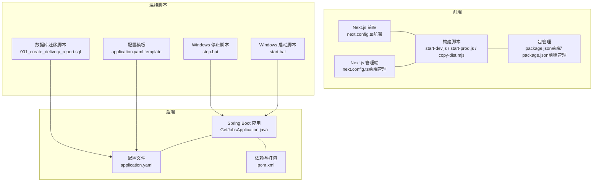
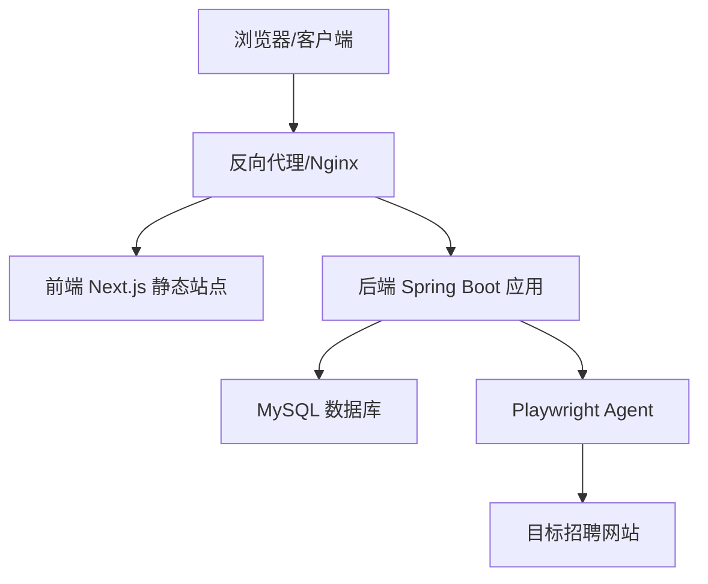
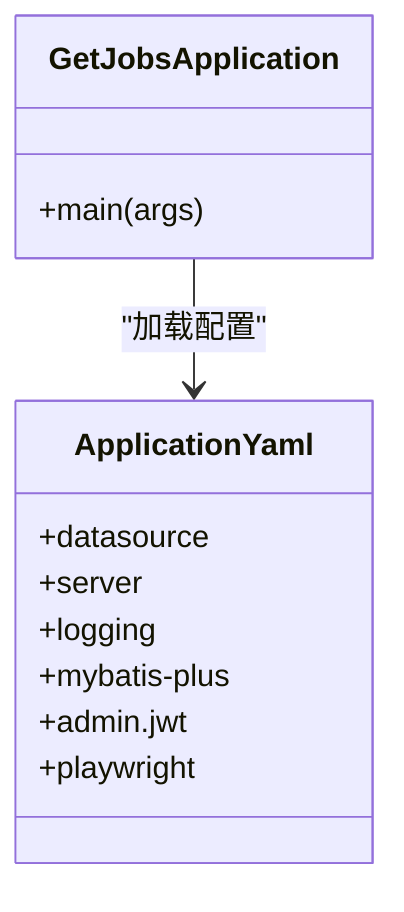
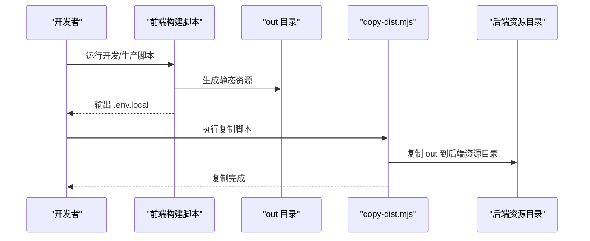
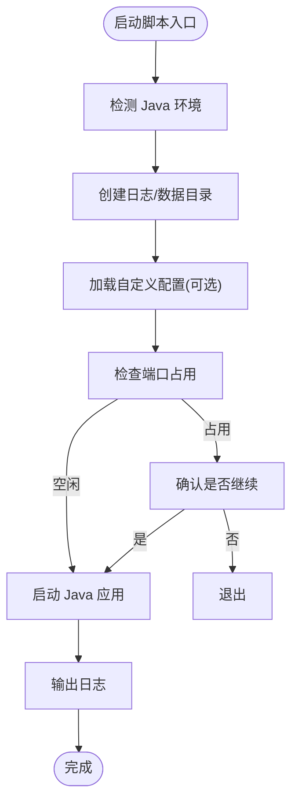
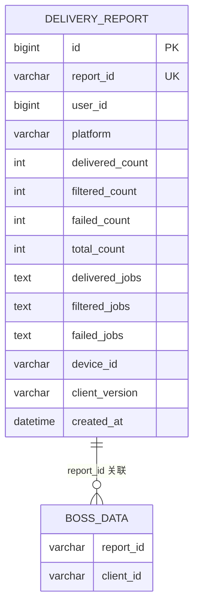
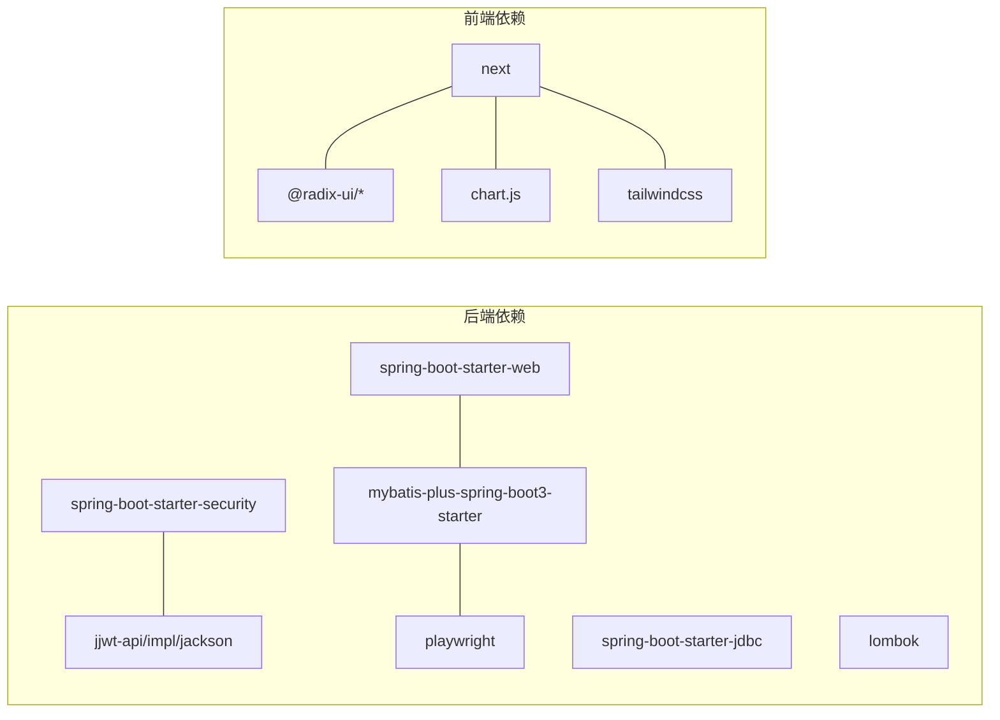

# 部署运维

<cite>
**本文引用的文件**
- [application.yaml](file://backend/src/main/resources/application.yaml)
- [pom.xml](file://backend/pom.xml)
- [GetJobsApplication.java](file://backend/src/main/java/com/getjobs/GetJobsApplication.java)
- [start.bat](file://scripts/windows/start.bat)
- [stop.bat](file://scripts/windows/stop.bat)
- [application.yaml.template](file://scripts/application.yaml.template)
- [001_create_delivery_report.sql](file://scripts/migration/001_create_delivery_report.sql)
- [start-dev.js](file://front/scripts/start-dev.js)
- [start-prod.js](file://front/scripts/start-prod.js)
- [copy-dist.mjs](file://front/scripts/copy-dist.mjs)
- [next.config.ts（前端）](file://front/next.config.ts)
- [next.config.ts（前端管理）](file://front-admin/next.config.ts)
- [package.json（前端）](file://front/package.json)
- [package.json（前端管理）](file://front-admin/package.json)
</cite>

## 目录
1. [简介](#简介)
2. [项目结构](#项目结构)
3. [核心组件](#核心组件)
4. [架构总览](#架构总览)
5. [详细组件分析](#详细组件分析)
6. [依赖分析](#依赖分析)
7. [性能考虑](#性能考虑)
8. [故障排除指南](#故障排除指南)
9. [结论](#结论)
10. [附录](#附录)

## 简介
本文件面向 DevOps 工程师与系统管理员，提供 GetJobs 项目的全栈部署与运维指南。内容覆盖开发与生产环境搭建、Docker 容器化、Kubernetes 部署策略、传统服务器部署方法；涵盖监控指标、日志收集与性能分析；提供备份与灾难恢复、高可用配置建议；并给出安全加固、防火墙与访问控制最佳实践；解释负载均衡、缓存与数据库优化方案；最后包含运维自动化脚本与故障排除手册。

## 项目结构
GetJobs 采用前后端分离架构：
- 后端：基于 Spring Boot 的 Java 应用，负责业务逻辑、数据持久化与定时/异步任务调度。
- 前端：Next.js 应用（含管理端），支持静态导出，便于反向代理或 CDN 分发。
- 运维脚本：Windows 批处理脚本用于本地开发与演示环境启动/停止；前端构建脚本负责将静态资源注入后端 classpath 资源目录。

图表来源
- [GetJobsApplication.java:1-22](file://backend/src/main/java/com/getjobs/GetJobsApplication.java#L1-L22)
- [application.yaml:1-91](file://backend/src/main/resources/application.yaml#L1-L91)
- [pom.xml:1-263](file://backend/pom.xml#L1-L263)
- [next.config.ts（前端）:1-23](file://front/next.config.ts#L1-L23)
- [next.config.ts（前端管理）:1-12](file://front-admin/next.config.ts#L1-L12)
- [start-dev.js:1-42](file://front/scripts/start-dev.js#L1-L42)
- [start-prod.js:1-39](file://front/scripts/start-prod.js#L1-L39)
- [copy-dist.mjs:1-79](file://front/scripts/copy-dist.mjs#L1-L79)
- [start.bat:1-98](file://scripts/windows/start.bat#L1-L98)
- [stop.bat:1-31](file://scripts/windows/stop.bat#L1-L31)
- [application.yaml.template:1-90](file://scripts/application.yaml.template#L1-L90)
- [001_create_delivery_report.sql:1-29](file://scripts/migration/001_create_delivery_report.sql#L1-L29)

章节来源
- [GetJobsApplication.java:1-22](file://backend/src/main/java/com/getjobs/GetJobsApplication.java#L1-L22)
- [application.yaml:1-91](file://backend/src/main/resources/application.yaml#L1-L91)
- [pom.xml:1-263](file://backend/pom.xml#L1-L263)
- [next.config.ts（前端）:1-23](file://front/next.config.ts#L1-L23)
- [next.config.ts（前端管理）:1-12](file://front-admin/next.config.ts#L1-L12)
- [start-dev.js:1-42](file://front/scripts/start-dev.js#L1-L42)
- [start-prod.js:1-39](file://front/scripts/start-prod.js#L1-L39)
- [copy-dist.mjs:1-79](file://front/scripts/copy-dist.mjs#L1-L79)
- [start.bat:1-98](file://scripts/windows/start.bat#L1-L98)
- [stop.bat:1-31](file://scripts/windows/stop.bat#L1-L31)
- [application.yaml.template:1-90](file://scripts/application.yaml.template#L1-L90)
- [001_create_delivery_report.sql:1-29](file://scripts/migration/001_create_delivery_report.sql#L1-L29)

## 核心组件
- 后端应用
  - 启动入口：Spring Boot 应用入口类，启用定时与异步任务。
  - 配置中心：application.yaml 提供数据库、日志、MyBatis-Plus、Playwright Agent、JWT 等配置。
  - 依赖与打包：pom.xml 管理 Java 21、Spring Boot 3、MyBatis-Plus、Playwright、JWT 等依赖，并通过 Spring Boot Maven 插件打包。
- 前端应用
  - Next.js 配置：静态导出与禁用图片优化，便于部署至反向代理或 CDN。
  - 构建脚本：根据 server.config.js 动态生成 .env.local，区分开发/生产模式。
  - 资源注入：构建完成后将静态产物复制到后端 classpath 资源目录，使后端可直接提供静态页面。
- 运维脚本
  - Windows 启停：start.bat/stop.bat 检测 Java、端口占用、日志与数据目录，支持自定义配置加载与 JVM 参数传入。
  - 配置模板：application.yaml.template 提供标准配置项与注释，便于按环境定制。
  - 数据库迁移：001_create_delivery_report.sql 定义投递报告表及关联字段，支持初始化与演进。

章节来源
- [GetJobsApplication.java:1-22](file://backend/src/main/java/com/getjobs/GetJobsApplication.java#L1-L22)
- [application.yaml:1-91](file://backend/src/main/resources/application.yaml#L1-L91)
- [pom.xml:1-263](file://backend/pom.xml#L1-L263)
- [next.config.ts（前端）:1-23](file://front/next.config.ts#L1-L23)
- [next.config.ts（前端管理）:1-12](file://front-admin/next.config.ts#L1-L12)
- [start-dev.js:1-42](file://front/scripts/start-dev.js#L1-L42)
- [start-prod.js:1-39](file://front/scripts/start-prod.js#L1-L39)
- [copy-dist.mjs:1-79](file://front/scripts/copy-dist.mjs#L1-L79)
- [start.bat:1-98](file://scripts/windows/start.bat#L1-L98)
- [stop.bat:1-31](file://scripts/windows/stop.bat#L1-L31)
- [application.yaml.template:1-90](file://scripts/application.yaml.template#L1-L90)
- [001_create_delivery_report.sql:1-29](file://scripts/migration/001_create_delivery_report.sql#L1-L29)

## 架构总览
后端通过 Spring MVC 对外提供 REST 接口，前端 Next.js 作为静态站点，通过反向代理或直接由后端提供静态资源。Playwright Agent 负责自动化抓取与登录稳定性控制，数据库采用 MySQL（Hikari 连接池）。定时与异步任务用于后台统计与数据同步。

图表来源
- [application.yaml:13-22](file://backend/src/main/resources/application.yaml#L13-L22)
- [application.yaml:60-91](file://backend/src/main/resources/application.yaml#L60-L91)
- [next.config.ts（前端）:14-20](file://front/next.config.ts#L14-L20)

## 详细组件分析

### 后端应用与配置
- 启动与调度
  - 入口类启用定时与异步任务，适配后台统计与周期性任务。
- 数据库与连接池
  - HikariCP 最大连接数、空闲超时、最大生命周期等参数可按容量调整。
  - 驱动与字符集、时区、SSL 等参数需与目标 MySQL 一致。
- 日志与滚动策略
  - 控制台与文件日志格式、滚动策略（历史天数、单文件大小）。
- MyBatis-Plus
  - 开启下划线转驼峰、Mapper XML 位置、全局 Banner 与 ID 策略。
- JWT 与 Playwright Agent
  - 管理端 JWT 密钥、过期时间、签发者；Agent 超时、重试、页面池、Cookie 刷新等参数。
- 端口
  - 固定端口 18888，便于反向代理与容器端口映射。

图表来源
- [GetJobsApplication.java:1-22](file://backend/src/main/java/com/getjobs/GetJobsApplication.java#L1-L22)
- [application.yaml:1-91](file://backend/src/main/resources/application.yaml#L1-L91)

章节来源
- [GetJobsApplication.java:1-22](file://backend/src/main/java/com/getjobs/GetJobsApplication.java#L1-L22)
- [application.yaml:13-91](file://backend/src/main/resources/application.yaml#L13-L91)

### 前端构建与资源注入
- 静态导出
  - 前端与管理端均采用静态导出，便于部署至反向代理或 CDN。
- 环境变量生成
  - 开发/生产模式分别由 start-dev.js 与 start-prod.js 生成 .env.local，注入端口、主机名与 API 地址。
- 资源注入后端
  - 构建完成后 copy-dist.mjs 将 out 目录复制到后端 classpath 资源目录，使后端可直接提供静态页面。

图表来源
- [start-dev.js:1-42](file://front/scripts/start-dev.js#L1-L42)
- [start-prod.js:1-39](file://front/scripts/start-prod.js#L1-L39)
- [copy-dist.mjs:1-79](file://front/scripts/copy-dist.mjs#L1-L79)
- [next.config.ts（前端）:14-20](file://front/next.config.ts#L14-L20)

章节来源
- [next.config.ts（前端）:1-23](file://front/next.config.ts#L1-L23)
- [next.config.ts（前端管理）:1-12](file://front-admin/next.config.ts#L1-L12)
- [start-dev.js:1-42](file://front/scripts/start-dev.js#L1-L42)
- [start-prod.js:1-39](file://front/scripts/start-prod.js#L1-L39)
- [copy-dist.mjs:1-79](file://front/scripts/copy-dist.mjs#L1-L79)

### 运维脚本与本地启动
- Windows 启动脚本
  - 检测 Java 环境、创建日志/数据目录、校验端口占用、加载自定义配置、设置 JVM 参数并启动应用。
- Windows 停止脚本
  - 通过端口定位进程并强制终止，便于快速回收资源。
- 配置模板
  - application.yaml.template 提供数据源、Banner、日志、服务器端口、MyBatis-Plus 等标准配置项，便于按环境替换。

图表来源
- [start.bat:15-98](file://scripts/windows/start.bat#L15-L98)
- [stop.bat:12-31](file://scripts/windows/stop.bat#L12-L31)
- [application.yaml.template:1-90](file://scripts/application.yaml.template#L1-L90)

章节来源
- [start.bat:1-98](file://scripts/windows/start.bat#L1-L98)
- [stop.bat:1-31](file://scripts/windows/stop.bat#L1-L31)
- [application.yaml.template:1-90](file://scripts/application.yaml.template#L1-L90)

### 数据库迁移与初始化
- 投递报告表
  - 定义 report_id、用户与平台维度、成功/过滤/失败计数与 JSON 详情、设备与版本、时间戳等字段。
- 关联字段
  - 为目标平台数据表新增 report_id 与 client_id 字段，便于追踪客户端行为。
- 初始化策略
  - application.yaml.template 中提供 SQL 初始化模式、脚本位置与失败继续策略，便于开发/测试环境快速就绪。

图表来源
- [001_create_delivery_report.sql:4-29](file://scripts/migration/001_create_delivery_report.sql#L4-L29)

章节来源
- [001_create_delivery_report.sql:1-29](file://scripts/migration/001_create_delivery_report.sql#L1-L29)
- [application.yaml.template:33-42](file://scripts/application.yaml.template#L33-L42)

## 依赖分析
- 后端依赖
  - Spring Boot Web、Security、JDBC、Jackson YAML、HttpClient5、MyBatis-Plus、SQLite JDBC、Playwright、JWT、Lombok 等。
- 前端依赖
  - Next.js、Radix UI、Chart.js、TailwindCSS、TypeScript 等。
- 构建与测试
  - Maven 编译插件、Surefire 插件、Spring Boot Maven 插件（打包与 build-info）。

图表来源
- [pom.xml:47-170](file://backend/pom.xml#L47-L170)
- [package.json（前端）:12-29](file://front/package.json#L12-L29)
- [package.json（前端管理）:11-28](file://front-admin/package.json#L11-L28)

章节来源
- [pom.xml:1-263](file://backend/pom.xml#L1-L263)
- [package.json（前端）:1-43](file://front/package.json#L1-L43)
- [package.json（前端管理）:1-41](file://front-admin/package.json#L1-L41)

## 性能考虑
- 数据库连接池
  - HikariCP 最大连接数、空闲超时、最大生命周期应结合并发与慢查询情况调优。
- 日志滚动
  - 控制单文件大小与保留天数，避免磁盘膨胀；生产环境建议落盘至独立挂载点。
- Playwright Agent
  - 页面池大小、空闲回收时间、请求拦截与资源阻断策略影响内存与网络；根据平台差异超时与重试次数需平衡稳定性与吞吐。
- 前端静态导出
  - 静态导出减少后端压力，配合 CDN 与缓存头可显著降低带宽与延迟。
- 定时与异步
  - 合理拆分任务粒度，避免长时间阻塞；对耗时操作使用队列或外部消息中间件。

## 故障排除指南
- 启动失败（Windows）
  - 检查 Java 版本与 PATH；确认端口 18888 未被占用；查看日志目录下的控制台与应用日志。
- 配置问题
  - application.yaml 与 application.yaml.template 的差异；确认数据库连接字符串、用户名、密码与时区正确。
- 前端无法访问
  - 确认 copy-dist.mjs 已执行并将静态资源复制到后端资源目录；检查反向代理或后端静态资源提供路径。
- 数据库初始化
  - application.yaml.template 中 SQL 初始化模式与脚本位置；如初始化失败，检查 schema 与权限。
- 进程回收
  - 使用 stop.bat 停止占用端口的进程；若失败，检查进程 PID 与权限。

章节来源
- [start.bat:15-98](file://scripts/windows/start.bat#L15-L98)
- [stop.bat:12-31](file://scripts/windows/stop.bat#L12-L31)
- [application.yaml.template:33-42](file://scripts/application.yaml.template#L33-L42)
- [copy-dist.mjs:56-79](file://front/scripts/copy-dist.mjs#L56-L79)

## 结论
本部署运维文档提供了从开发到生产的全链路指导，涵盖容器化、Kubernetes、传统服务器部署与运维自动化；明确了监控、日志、备份与高可用策略；给出了安全加固与访问控制建议；并解释了负载均衡、缓存与数据库优化方案。建议在生产环境中结合实际流量与硬件资源进行参数微调，并建立完善的 CI/CD 与变更审计流程。

## 附录

### 开发环境搭建步骤
- 后端
  - 安装 Java 21；克隆仓库；导入 Maven 项目；运行 Spring Boot 应用入口类。
  - 准备 MySQL 实例，执行数据库迁移脚本；在 application.yaml 中配置数据源。
- 前端
  - 安装 Node.js 与包管理工具；安装依赖；运行开发脚本生成 .env.local 并启动 Next.js。
  - 构建生产版本并执行 copy-dist.mjs 将静态资源注入后端。

章节来源
- [GetJobsApplication.java:1-22](file://backend/src/main/java/com/getjobs/GetJobsApplication.java#L1-L22)
- [application.yaml:13-22](file://backend/src/main/resources/application.yaml#L13-L22)
- [001_create_delivery_report.sql:1-29](file://scripts/migration/001_create_delivery_report.sql#L1-L29)
- [start-dev.js:1-42](file://front/scripts/start-dev.js#L1-L42)
- [copy-dist.mjs:1-79](file://front/scripts/copy-dist.mjs#L1-L79)

### 生产环境搭建步骤
- 基础设施
  - 准备 Linux 服务器（推荐 CentOS/Ubuntu）、MySQL、反向代理（Nginx/Traefik）。
  - 为后端与前端分别准备独立部署目录与日志目录。
- 部署后端
  - 打包 Spring Boot 应用；准备 application.yaml（使用模板进行环境变量替换）；使用 systemd 或 Docker 运行。
  - 配置反向代理将 /api 前缀转发至后端固定端口。
- 部署前端
  - 在前端构建完成后，将静态资源复制到后端资源目录；或通过反向代理直接提供静态导出产物。
- 监控与日志
  - 配置日志滚动与集中采集；设置健康检查端点；建立告警阈值。

章节来源
- [application.yaml:28-43](file://backend/src/main/resources/application.yaml#L28-L43)
- [next.config.ts（前端）:14-20](file://front/next.config.ts#L14-L20)
- [copy-dist.mjs:1-79](file://front/scripts/copy-dist.mjs#L1-L79)

### Docker 容器化部署方案
- 镜像构建
  - 使用多阶段构建：编译阶段使用 Maven 构建 Spring Boot 可执行 JAR；运行阶段使用精简基础镜像（如 OpenJDK Alpine）。
  - 将前端静态资源在构建阶段复制到后端资源目录，或在运行阶段挂载卷。
- 容器运行
  - 暴露后端固定端口；挂载日志与数据卷；通过环境变量注入数据库凭据与 JWT 密钥。
  - 使用 Docker Compose 编排后端、MySQL 与反向代理。

章节来源
- [pom.xml:194-221](file://backend/pom.xml#L194-L221)
- [application.yaml:13-22](file://backend/src/main/resources/application.yaml#L13-L22)
- [application.yaml.template:14-31](file://scripts/application.yaml.template#L14-L31)

### Kubernetes 部署策略
- 资源对象
  - Deployment：后端应用副本数、探针、环境变量与挂载卷。
  - Service：ClusterIP 暴露后端；Ingress 暴露前端静态资源与 API。
  - ConfigMap：存放 application.yaml（或拆分为多个键值）。
  - Secret：数据库凭据、JWT 密钥、Cookie 种子等敏感信息。
- 存储
  - 使用 PVC 挂载日志与数据目录；MySQL 使用持久化存储。
- 网络
  - Ingress 控制器统一入口；TLS 证书；限流与 WAF 建议在 Ingress 层配置。
- 可观测性
  - Prometheus/Grafana 指标采集；ELK/EFK 日志采集；Sentry 错误监控。

章节来源
- [application.yaml:13-22](file://backend/src/main/resources/application.yaml#L13-L22)
- [application.yaml.template:14-31](file://scripts/application.yaml.template#L14-L31)

### 传统服务器部署方法
- 服务化
  - 使用 systemd 管理后端进程；设置工作目录、环境变量、日志重定向与自动重启。
  - 使用 Nginx 提供静态资源与反向代理；配置 gzip、缓存头与健康检查。
- 监控与日志
  - rsyslog/Logrotate 管理日志滚动；Prometheus Node Exporter 采集主机指标。
- 备份与回滚
  - 数据库定时快照；应用包与配置文件版本化；蓝绿/金丝雀发布策略。

章节来源
- [start.bat:73-98](file://scripts/windows/start.bat#L73-L98)
- [stop.bat:12-31](file://scripts/windows/stop.bat#L12-L31)
- [application.yaml:31-43](file://backend/src/main/resources/application.yaml#L31-L43)

### 监控指标、日志收集与性能分析
- 指标
  - 应用层：JVM 堆内存、GC 次数与耗时、线程数、HTTP 请求速率与响应时间。
  - 数据库层：连接数、慢查询、锁等待、缓冲池命中率。
  - 前端层：静态资源加载时间、首屏渲染时间、错误率。
- 日志
  - 控制台与文件双通道；按天滚动；保留 30 天；敏感字段脱敏。
- 性能分析
  - 使用 APM（如 SkyWalking/Jaeger）追踪链路；数据库慢查询分析；前端性能监控。

章节来源
- [application.yaml:31-43](file://backend/src/main/resources/application.yaml#L31-L43)
- [application.yaml:44-51](file://backend/src/main/resources/application.yaml#L44-L51)

### 备份策略、灾难恢复与高可用
- 备份
  - 数据库全量+增量备份；应用包与配置文件版本化；日志定期归档。
- 灾难恢复
  - RTO/RPO 指标明确；演练恢复流程；异地容灾。
- 高可用
  - 多副本部署；自动扩缩容；健康检查与故障转移；读写分离与只读副本。

章节来源
- [application.yaml:18-22](file://backend/src/main/resources/application.yaml#L18-L22)

### 安全加固、防火墙与访问控制
- 网络
  - 仅开放必要端口；内网访问数据库；反向代理层做 WAF 与限流。
- 认证与授权
  - JWT 签发者与密钥管理；接口级鉴权；管理端访问白名单。
- 配置
  - 敏感配置放入 Secret；禁止明文存储；最小权限原则。

章节来源
- [application.yaml:53-58](file://backend/src/main/resources/application.yaml#L53-L58)
- [application.yaml.template:14-31](file://scripts/application.yaml.template#L14-L31)

### 负载均衡、缓存策略与数据库优化
- 负载均衡
  - Nginx/Traefik 健康检查；会话保持（如需要）；连接上限与超时设置。
- 缓存
  - Redis 缓存热点数据；前端静态资源强缓存；CDN 加速。
- 数据库优化
  - 索引设计（投递报告表已有索引示例）；慢查询分析；连接池参数；只读事务分离。

章节来源
- [001_create_delivery_report.sql:19-24](file://scripts/migration/001_create_delivery_report.sql#L19-L24)
- [application.yaml:18-22](file://backend/src/main/resources/application.yaml#L18-L22)

### 运维自动化脚本与故障排除手册
- 自动化
  - Jenkins/GitLab CI：构建后端 JAR 与前端静态资源；推送镜像；部署到目标集群或服务器。
  - Ansible/Shell：一键部署、配置更新与回滚。
- 故障排除
  - 启动失败：检查 Java、端口、配置与日志；逐步缩小范围。
  - 数据库异常：连接字符串、权限、字符集与时区；慢查询与锁。
  - 前端异常：静态资源路径、缓存头、跨域与 CSP。

章节来源
- [start.bat:15-98](file://scripts/windows/start.bat#L15-L98)
- [stop.bat:12-31](file://scripts/windows/stop.bat#L12-L31)
- [copy-dist.mjs:56-79](file://front/scripts/copy-dist.mjs#L56-L79)