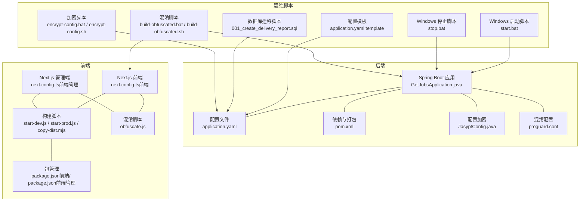
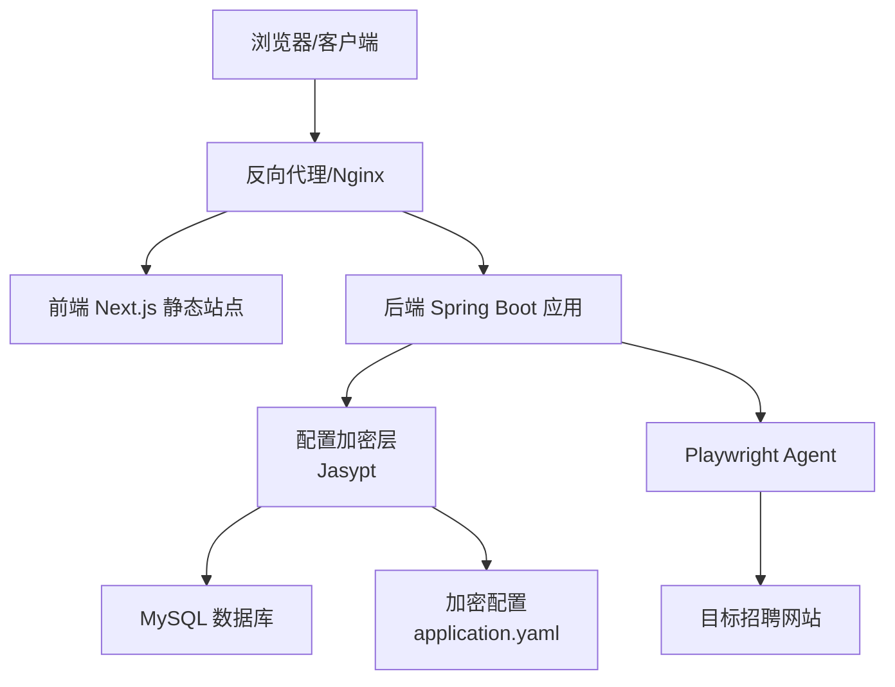
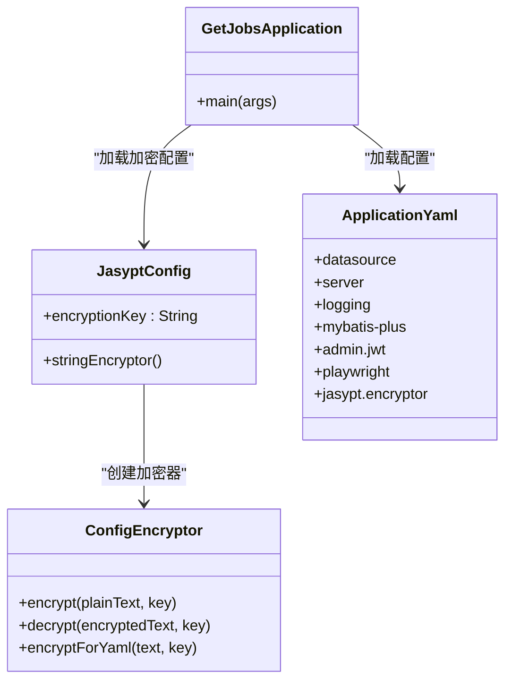
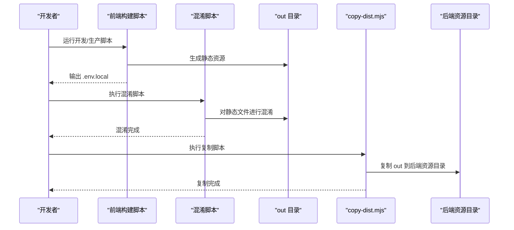
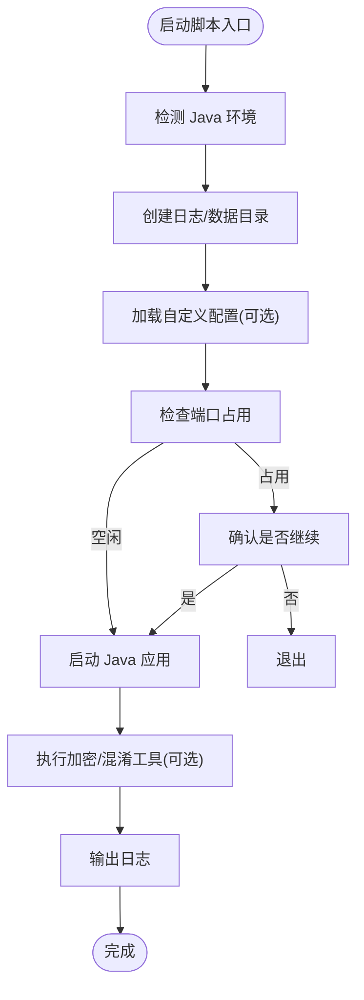
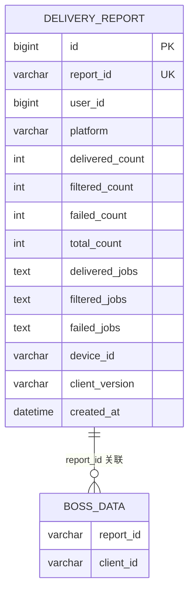
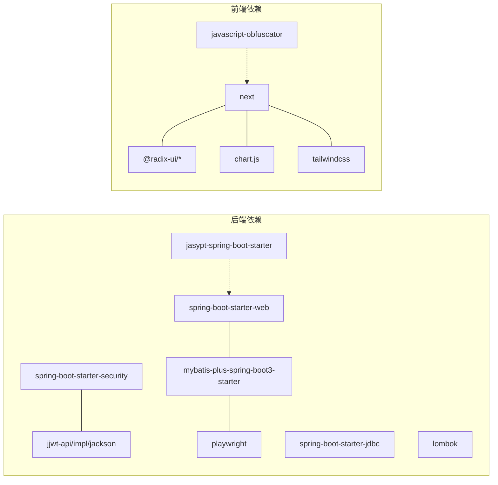

# 部署运维

<cite>
**本文引用的文件**
- [application.yaml](file://backend/src/main/resources/application.yaml)
- [pom.xml](file://backend/pom.xml)
- [GetJobsApplication.java](file://backend/src/main/java/com/getjobs/GetJobsApplication.java)
- [start.bat](file://scripts/windows/start.bat)
- [stop.bat](file://scripts/windows/stop.bat)
- [application.yaml.template](file://scripts/application.yaml.template)
- [001_create_delivery_report.sql](file://scripts/migration/001_create_delivery_report.sql)
- [start-dev.js](file://front/scripts/start-dev.js)
- [start-prod.js](file://front/scripts/start-prod.js)
- [copy-dist.mjs](file://front/scripts/copy-dist.mjs)
- [next.config.ts（前端）](file://front/next.config.ts)
- [next.config.ts（前端管理）](file://front-admin/next.config.ts)
- [package.json（前端）](file://front/package.json)
- [package.json（前端管理）](file://front-admin/package.json)
- [ENCRYPTION_GUIDE.md](file://ENCRYPTION_GUIDE.md)
- [OBFUSCATION_GUIDE.md](file://OBFUSCATION_GUIDE.md)
- [RELEASE_GUIDE.md](file://RELEASE_GUIDE.md)
- [build-obfuscated.bat](file://build-obfuscated.bat)
- [build-obfuscated.sh](file://build-obfuscated.sh)
- [encrypt-config.bat](file://encrypt-config.bat)
- [encrypt-config.sh](file://encrypt-config.sh)
- [JasyptConfig.java](file://backend/src/main/java/com/getjobs/application/config/JasyptConfig.java)
- [ConfigEncryptor.java](file://backend/src/main/java/com/getjobs/common/util/ConfigEncryptor.java)
- [EncryptionTool.java](file://backend/src/main/java/com/getjobs/common/util/EncryptionTool.java)
- [proguard.conf](file://backend/proguard.conf)
- [obfuscate.js](file://front/scripts/obfuscate.js)
</cite>

## 更新摘要
**所做变更**
- 新增配置加密使用指南章节，涵盖 Jasypt 配置加密框架的完整使用流程
- 新增代码混淆构建指南章节，详细介绍前后端代码混淆的实施方法
- 新增发布管理流程章节，提供完整的版本发布和自动化构建指导
- 更新运维脚本章节，增加加密和混淆相关的自动化工具
- 新增安全加固章节，重点介绍配置加密和代码混淆的安全价值

## 目录
1. [简介](#简介)
2. [项目结构](#项目结构)
3. [核心组件](#核心组件)
4. [架构总览](#架构总览)
5. [详细组件分析](#详细组件分析)
6. [配置加密与安全加固](#配置加密与安全加固)
7. [代码混淆与发布管理](#代码混淆与发布管理)
8. [依赖分析](#依赖分析)
9. [性能考虑](#性能考虑)
10. [故障排除指南](#故障排除指南)
11. [结论](#结论)
12. [附录](#附录)

## 简介
本文件面向 DevOps 工程师与系统管理员，提供 GetJobs 项目的全栈部署与运维指南。内容覆盖开发与生产环境搭建、Docker 容器化、Kubernetes 部署策略、传统服务器部署方法；涵盖监控指标、日志收集与性能分析；提供备份与灾难恢复、高可用配置建议；并给出安全加固、防火墙与访问控制最佳实践；解释负载均衡、缓存与数据库优化方案；最后包含运维自动化脚本与故障排除手册。

**更新** 新增配置加密、代码混淆和发布管理等高级运维功能，提升系统的安全性与可维护性。

## 项目结构
GetJobs 采用前后端分离架构：
- 后端：基于 Spring Boot 的 Java 应用，负责业务逻辑、数据持久化与定时/异步任务调度，现已集成配置加密和代码混淆功能。
- 前端：Next.js 应用（含管理端），支持静态导出，便于反向代理或 CDN 分发，具备代码混淆保护。
- 运维脚本：Windows 批处理脚本用于本地开发与演示环境启动/停止；前端构建脚本负责将静态资源注入后端 classpath 资源目录；新增加密和混淆自动化工具。



**图表来源**
- [GetJobsApplication.java:1-22](file://backend/src/main/java/com/getjobs/GetJobsApplication.java#L1-L22)
- [application.yaml:1-91](file://backend/src/main/resources/application.yaml#L1-L91)
- [pom.xml:1-327](file://backend/pom.xml#L1-L327)
- [JasyptConfig.java:1-47](file://backend/src/main/java/com/getjobs/application/config/JasyptConfig.java#L1-L47)
- [proguard.conf:1-118](file://backend/proguard.conf#L1-L118)
- [obfuscate.js:1-141](file://front/scripts/obfuscate.js#L1-L141)
- [encrypt-config.bat:1-64](file://encrypt-config.bat#L1-L64)
- [build-obfuscated.bat:1-125](file://build-obfuscated.bat#L1-L125)

**章节来源**
- [GetJobsApplication.java:1-22](file://backend/src/main/java/com/getjobs/GetJobsApplication.java#L1-L22)
- [application.yaml:1-91](file://backend/src/main/resources/application.yaml#L1-L91)
- [pom.xml:1-327](file://backend/pom.xml#L1-L327)
- [JasyptConfig.java:1-47](file://backend/src/main/java/com/getjobs/application/config/JasyptConfig.java#L1-L47)
- [proguard.conf:1-118](file://backend/proguard.conf#L1-L118)
- [obfuscate.js:1-141](file://front/scripts/obfuscate.js#L1-L141)
- [encrypt-config.bat:1-64](file://encrypt-config.bat#L1-L64)
- [build-obfuscated.bat:1-125](file://build-obfuscated.bat#L1-L125)

## 核心组件
- 后端应用
  - 启动入口：Spring Boot 应用入口类，启用定时与异步任务。
  - 配置中心：application.yaml 提供数据库、日志、MyBatis-Plus、Playwright Agent、JWT 等配置。
  - 依赖与打包：pom.xml 管理 Java 21、Spring Boot 3、MyBatis-Plus、Playwright、JWT 等依赖，并通过 Spring Boot Maven 插件打包。
  - **新增** 配置加密：集成 Jasypt 框架，支持敏感配置的加密存储和解密。
  - **新增** 代码混淆：使用 ProGuard 和 JavaScript Obfuscator 实现前后端代码混淆。
- 前端应用
  - Next.js 配置：静态导出与禁用图片优化，便于部署至反向代理或 CDN。
  - 构建脚本：根据 server.config.js 动态生成 .env.local，区分开发/生产模式。
  - 资源注入：构建完成后将静态产物复制到后端 classpath 资源目录，使后端可直接提供静态页面。
  - **新增** 代码混淆：通过 obfuscate.js 脚本对静态资源进行混淆处理。
- 运维脚本
  - Windows 启停：start.bat/stop.bat 检测 Java、端口占用、日志与数据目录，支持自定义配置加载与 JVM 参数传入。
  - 配置模板：application.yaml.template 提供标准配置项与注释，便于按环境定制。
  - 数据库迁移：001_create_delivery_report.sql 定义投递报告表及关联字段，支持初始化与演进。
  - **新增** 加密工具：encrypt-config.bat/sh 脚本提供配置加密功能。
  - **新增** 混淆工具：build-obfuscated.bat/sh 脚本提供一键混淆构建功能。

**章节来源**
- [GetJobsApplication.java:1-22](file://backend/src/main/java/com/getjobs/GetJobsApplication.java#L1-L22)
- [application.yaml:1-91](file://backend/src/main/resources/application.yaml#L1-L91)
- [pom.xml:1-327](file://backend/pom.xml#L1-L327)
- [JasyptConfig.java:1-47](file://backend/src/main/java/com/getjobs/application/config/JasyptConfig.java#L1-L47)
- [proguard.conf:1-118](file://backend/proguard.conf#L1-L118)
- [obfuscate.js:1-141](file://front/scripts/obfuscate.js#L1-L141)
- [encrypt-config.bat:1-64](file://encrypt-config.bat#L1-L64)
- [build-obfuscated.bat:1-125](file://build-obfuscated.bat#L1-L125)

## 架构总览
后端通过 Spring MVC 对外提供 REST 接口，前端 Next.js 作为静态站点，通过反向代理或直接由后端提供静态资源。Playwright Agent 负责自动化抓取与登录稳定性控制，数据库采用 MySQL（Hikari 连接池）。定时与异步任务用于后台统计与数据同步。**新增** 配置加密层确保敏感信息的安全存储，代码混淆层提升源码保护能力。



**图表来源**
- [application.yaml:13-22](file://backend/src/main/resources/application.yaml#L13-L22)
- [application.yaml:60-91](file://backend/src/main/resources/application.yaml#L60-L91)
- [next.config.ts（前端）:14-20](file://front/next.config.ts#L14-L20)
- [JasyptConfig.java:26](file://backend/src/main/java/com/getjobs/application/config/JasyptConfig.java#L26)

## 详细组件分析

### 后端应用与配置
- 启动与调度
  - 入口类启用定时与异步任务，适配后台统计与周期性任务。
- 数据库与连接池
  - HikariCP 最大连接数、空闲超时、最大生命周期等参数可按容量调整。
  - 驱动与字符集、时区、SSL 等参数需与目标 MySQL 一致。
- 日志与滚动策略
  - 控制台与文件日志格式、滚动策略（历史天数、单文件大小）。
- MyBatis-Plus
  - 开启下划线转驼峰、Mapper XML 位置、全局 Banner 与 ID 策略。
- JWT 与 Playwright Agent
  - 管理端 JWT 密钥、过期时间、签发者；Agent 超时、重试、页面池、Cookie 刷新等参数。
- 端口
  - 固定端口 18888，便于反向代理与容器端口映射。
- **新增** 配置加密
  - JasyptConfig 类配置加密器，支持环境变量、JVM 参数和配置文件三种密钥来源。
  - ConfigEncryptor 工具类提供加密/解密 API。
  - EncryptionTool 命令行工具支持批量加密配置。



**图表来源**
- [GetJobsApplication.java:1-22](file://backend/src/main/java/com/getjobs/GetJobsApplication.java#L1-L22)
- [JasyptConfig.java:17-46](file://backend/src/main/java/com/getjobs/application/config/JasyptConfig.java#L17-L46)
- [ConfigEncryptor.java:15-92](file://backend/src/main/java/com/getjobs/common/util/ConfigEncryptor.java#L15-L92)
- [application.yaml:1-91](file://backend/src/main/resources/application.yaml#L1-L91)

**章节来源**
- [GetJobsApplication.java:1-22](file://backend/src/main/java/com/getjobs/GetJobsApplication.java#L1-L22)
- [application.yaml:13-91](file://backend/src/main/resources/application.yaml#L13-L91)
- [JasyptConfig.java:1-47](file://backend/src/main/java/com/getjobs/application/config/JasyptConfig.java#L1-L47)
- [ConfigEncryptor.java:1-93](file://backend/src/main/java/com/getjobs/common/util/ConfigEncryptor.java#L1-L93)
- [EncryptionTool.java:1-89](file://backend/src/main/java/com/getjobs/common/util/EncryptionTool.java#L1-L89)

### 前端构建与资源注入
- 静态导出
  - 前端与管理端均采用静态导出，便于部署至反向代理或 CDN。
- 环境变量生成
  - 开发/生产模式分别由 start-dev.js 与 start-prod.js 生成 .env.local，注入端口、主机名与 API 地址。
- 资源注入后端
  - 构建完成后 copy-dist.mjs 将 out 目录复制到后端 classpath 资源目录，使后端可直接提供静态页面。
- **新增** 代码混淆
  - obfuscate.js 脚本对静态资源进行混淆处理，包括控制流扁平化、死代码注入、字符串数组编码等技术。
  - 支持保留 Next.js 关键标识符，确保框架正常运行。



**图表来源**
- [start-dev.js:1-42](file://front/scripts/start-dev.js#L1-L42)
- [start-prod.js:1-39](file://front/scripts/start-prod.js#L1-L39)
- [obfuscate.js:10-64](file://front/scripts/obfuscate.js#L10-L64)
- [copy-dist.mjs:1-79](file://front/scripts/copy-dist.mjs#L1-L79)
- [next.config.ts（前端）:14-20](file://front/next.config.ts#L14-L20)

**章节来源**
- [next.config.ts（前端）:1-23](file://front/next.config.ts#L1-L23)
- [next.config.ts（前端管理）:1-12](file://front-admin/next.config.ts#L1-L12)
- [start-dev.js:1-42](file://front/scripts/start-dev.js#L1-L42)
- [start-prod.js:1-39](file://front/scripts/start-prod.js#L1-L39)
- [obfuscate.js:1-141](file://front/scripts/obfuscate.js#L1-L141)
- [copy-dist.mjs:1-79](file://front/scripts/copy-dist.mjs#L1-L79)

### 运维脚本与本地启动
- Windows 启动脚本
  - 检测 Java 环境、创建日志/数据目录、校验端口占用、加载自定义配置、设置 JVM 参数并启动应用。
- Windows 停止脚本
  - 通过端口定位进程并强制终止，便于快速回收资源。
- 配置模板
  - application.yaml.template 提供数据源、Banner、日志、服务器端口、MyBatis-Plus 等标准配置项，便于按环境替换。
- **新增** 加密脚本
  - encrypt-config.bat/sh 支持 Windows 和 Unix 系统的配置加密，支持自定义密钥和默认密钥。
  - 自动调用 EncryptionTool 工具生成 ENC(...) 格式的加密字符串。
- **新增** 混淆脚本
  - build-obfuscated.bat/sh 支持 Windows 和 Unix 系统的一键混淆构建。
  - 可选择仅构建后端、仅构建前端或全量构建。



**图表来源**
- [start.bat:15-98](file://scripts/windows/start.bat#L15-L98)
- [stop.bat:12-31](file://scripts/windows/stop.bat#L12-L31)
- [application.yaml.template:1-90](file://scripts/application.yaml.template#L1-L90)
- [encrypt-config.bat:12-59](file://encrypt-config.bat#L12-L59)
- [build-obfuscated.bat:12-121](file://build-obfuscated.bat#L12-L121)

**章节来源**
- [start.bat:1-98](file://scripts/windows/start.bat#L1-L98)
- [stop.bat:1-31](file://scripts/windows/stop.bat#L1-L31)
- [application.yaml.template:1-90](file://scripts/application.yaml.template#L1-L90)
- [encrypt-config.bat:1-64](file://encrypt-config.bat#L1-L64)
- [build-obfuscated.bat:1-125](file://build-obfuscated.bat#L1-L125)

### 数据库迁移与初始化
- 投递报告表
  - 定义 report_id、用户与平台维度、成功/过滤/失败计数与 JSON 详情、设备与版本、时间戳等字段。
- 关联字段
  - 为目标平台数据表新增 report_id 与 client_id 字段，便于追踪客户端行为。
- 初始化策略
  - application.yaml.template 中提供 SQL 初始化模式、脚本位置与失败继续策略，便于开发/测试环境快速就绪。



**图表来源**
- [001_create_delivery_report.sql:4-29](file://scripts/migration/001_create_delivery_report.sql#L4-L29)

**章节来源**
- [001_create_delivery_report.sql:1-29](file://scripts/migration/001_create_delivery_report.sql#L1-L29)
- [application.yaml.template:33-42](file://scripts/application.yaml.template#L33-L42)

## 配置加密与安全加固

### Jasypt 配置加密框架
项目已集成 Jasypt (Java Simplified Encryption) 配置加密框架，对敏感配置（如数据库密码）进行加密存储，防止明文泄露。

**加密效果对比**
- 加密前（明文）
```yaml
spring:
  datasource:
    username: app_user
    password: 7hxUKgrA7x6D!FZwHLFz  # ❌ 明文密码
```

- 加密后（密文）
```yaml
spring:
  datasource:
    username: app_user
    password: ENC(tmoqXZMC+8WPanVy6m1ZmBfr1toBiLHMuRxupskKRZg=)  # ✅ 加密密码
```

### 加密密钥管理
- **密钥优先级**（从高到低）
  1. 环境变量 `JASYPT_ENCRYPTOR_PASSWORD`（最高优先级）
  2. JVM 参数 `-Djasypt.encryptor.password=xxx`
  3. 配置文件 `application.yaml` 中的默认值（仅开发环境）

- **生成强密钥**
```bash
# Linux/Mac
openssl rand -base64 32

# PowerShell
[System.Convert]::ToBase64String((1..32 | ForEach-Object { Get-Random -Minimum 0 -Maximum 256 }))
```

### 加密工具类与命令行工具
- **ConfigEncryptor** - Java API
```java
import com.getjobs.common.util.ConfigEncryptor;

// 加密
String encrypted = ConfigEncryptor.encryptForYaml("my_password", "encryption-key");
// 输出: ENC(xxxxxx)

// 解密
String decrypted = ConfigEncryptor.decrypt("encrypted_string", "encryption-key");
```

- **EncryptionTool** - 命令行工具
```bash
cd backend

# 编译
mvn compile

# 运行加密工具
mvn exec:java \
    -Dexec.mainClass="com.getjobs.common.util.EncryptionTool" \
    -Dexec.args="your_password" \
    -Djasypt.encryptor.password="your-key"
```

### 生产环境部署流程
```bash
# 1. 设置环境变量（不要硬编码）
export JASYPT_ENCRYPTOR_PASSWORD="production-secret-key-2026"

# 2. 使用加密后的配置
# application.yaml 中:
# password: ENC(encrypted_value)

# 3. 启动应用
java -jar get_jobs.jar
```

### 安全建议
- ✅ **推荐做法**
  1. 生产环境使用自定义密钥
  2. 不要将加密密钥提交到 Git
  3. 使用环境变量管理服务（AWS Parameter Store、HashiCorp Vault、Kubernetes Secrets、Docker Secrets）
  4. 定期更换加密密钥

- ❌ **避免做法**
  1. 不要使用默认密钥生产环境
  2. 不要在代码中硬编码密钥
  3. 不要将密钥写在配置文件中

**章节来源**
- [ENCRYPTION_GUIDE.md:1-319](file://ENCRYPTION_GUIDE.md#L1-L319)
- [JasyptConfig.java:26](file://backend/src/main/java/com/getjobs/application/config/JasyptConfig.java#L26)
- [ConfigEncryptor.java:88-91](file://backend/src/main/java/com/getjobs/common/util/ConfigEncryptor.java#L88-L91)
- [EncryptionTool.java:22-36](file://backend/src/main/java/com/getjobs/common/util/EncryptionTool.java#L22-L36)

## 代码混淆与发布管理

### 前后端代码混淆机制
项目已集成前后端代码混淆机制，用于保护源码安全：

- **后端 (Java)**: 使用 ProGuard 进行字节码混淆
- **前端 (JavaScript)**: 使用 javascript-obfuscator 进行代码混淆

### 快速开始
- **Windows 用户**
```bash
# 构建前后端（含混淆）
.\build-obfuscated.bat

# 仅构建后端
.\build-obfuscated.bat backend

# 仅构建前端
.\build-obfuscated.bat front
```

- **Linux/Mac 用户**
```bash
# 添加执行权限
chmod +x build-obfuscated.sh

# 构建前后端（含混淆）
./build-obfuscated.sh

# 仅构建后端
./build-obfuscated.sh backend

# 仅构建前端
./build-obfuscated.sh front
```

### 后端混淆配置
配置文件: `backend/proguard.conf`

**保留的规则:**
- ✅ Spring Boot 启动类和注解
- ✅ Controller 方法和路由
- ✅ MyBatis-Plus 实体类和 Mapper
- ✅ JSON 序列化 getter/setter
- ✅ Playwright 相关类
- ✅ 数据库驱动

**混淆的内容:**
- 🔒 业务逻辑类名和方法名
- 🔒 变量名
- 🔒 字符串常量（部分）
- 🔒 控制流（扁平化）

### 前端混淆配置
配置文件: `front/scripts/obfuscate.js`

**混淆选项:**
- 🔒 控制流扁平化 (75%)
- 🔒 死代码注入 (40%)
- 🔒 字符串数组编码 (Base64)
- 🔒 十六进制标识符
- 🔒 对象键转换

**保留的标识符:**
- ✅ Next.js 框架变量 (__NEXT_DATA__, props, query 等)
- ✅ 全局 API 对象

### 性能影响
- **构建时间**
  - 后端: 增加约 30-60 秒（ProGuard 混淆阶段）
  - 前端: 增加约 10-30 秒（取决于项目大小）

- **运行性能**
  - 后端: 无影响（JVM 会优化字节码）
  - 前端: 轻微影响（控制流扁平化可能增加 5-10% 执行时间）

- **文件大小**
  - 后端: 减少约 10-20%（ProGuard 会移除未使用代码）
  - 前端: 增加约 20-40%（死代码注入和字符串编码）

### 发布管理流程
项目提供完整的发布管理流程，支持多种发布方式：

**发布前检查清单**
1. 更新版本号（遵循语义化版本）
2. 更新更新日志
3. 测试构建
4. 验证安装包

**发布方式**
- **方式一：使用 Git Tag（推荐）**
```bash
# 1. 提交所有更改
git add .
git commit -m "🔖 发布 v1.0.0"

# 2. 创建标签
git tag -a v1.0.0 -m "发布版本 1.0.0"

# 3. 推送标签（触发 GitHub Actions 自动发布）
git push origin main
git push origin v1.0.0
```

- **方式二：手动触发工作流**
  1. 访问 GitHub Actions 页面
  2. 点击 "Run workflow"
  3. 输入版本号
  4. 点击 "Run workflow"

**发布后验证**
1. 检查 GitHub Release
2. 测试自动更新
3. 下载测试各平台安装包

### 故障排除
- **后端构建失败**
  - 问题: ProGuard 报错找不到类
  - 解决: 在 `proguard.conf` 中添加保留规则

- **前端构建失败**
  - 问题: 混淆后页面白屏
  - 解决: 检查 `reservedNames` 配置，确保 Next.js 关键变量未被混淆

- **配置加密问题**
  - 问题: 启动时报解密错误
  - 解决: 检查是否正确设置密钥，重新加密密码

**章节来源**
- [OBFUSCATION_GUIDE.md:1-285](file://OBFUSCATION_GUIDE.md#L1-L285)
- [RELEASE_GUIDE.md:1-211](file://RELEASE_GUIDE.md#L1-L211)
- [build-obfuscated.bat:1-125](file://build-obfuscated.bat#L1-L125)
- [build-obfuscated.sh:1-112](file://build-obfuscated.sh#L1-L112)
- [encrypt-config.bat:1-64](file://encrypt-config.bat#L1-L64)
- [encrypt-config.sh:1-63](file://encrypt-config.sh#L1-L63)

## 依赖分析
- 后端依赖
  - Spring Boot Web、Security、JDBC、Jackson YAML、HttpClient5、MyBatis-Plus、SQLite JDBC、Playwright、JWT、Lombok 等。
  - **新增** Jasypt Spring Boot Starter（配置加密支持）。
- 前端依赖
  - Next.js、Radix UI、Chart.js、TailwindCSS、TypeScript 等。
  - **新增** javascript-obfuscator（代码混淆支持）。
- 构建与测试
  - Maven 编译插件、Surefire 插件、Spring Boot Maven 插件（打包与 build-info）。
  - **新增** ClassFinal Maven 插件（字节码混淆）。



**图表来源**
- [pom.xml:47-170](file://backend/pom.xml#L47-L170)
- [pom.xml:163-168](file://backend/pom.xml#L163-L168)
- [package.json（前端）:12-46](file://front/package.json#L12-L46)
- [package.json（前端管理）:11-28](file://front-admin/package.json#L11-L28)

**章节来源**
- [pom.xml:1-327](file://backend/pom.xml#L1-L327)
- [package.json（前端）:1-48](file://front/package.json#L1-L48)
- [package.json（前端管理）:1-41](file://front-admin/package.json#L1-L41)

## 性能考虑
- 数据库连接池
  - HikariCP 最大连接数、空闲超时、最大生命周期应结合并发与慢查询情况调优。
- 日志滚动
  - 控制单文件大小与保留天数，避免磁盘膨胀；生产环境建议落盘至独立挂载点。
- Playwright Agent
  - 页面池大小、空闲回收时间、请求拦截与资源阻断策略影响内存与网络；根据平台差异超时与重试次数需平衡稳定性与吞吐。
- 前端静态导出
  - 静态导出减少后端压力，配合 CDN 与缓存头可显著降低带宽与延迟。
- 定时与异步
  - 合理拆分任务粒度，避免长时间阻塞；对耗时操作使用队列或外部消息中间件。
- **新增** 配置加密性能
  - 解密开销：每次应用启动时解密，运行时缓存
  - 启动延迟：约增加 100-200ms
  - 运行性能：无影响
- **新增** 代码混淆性能
  - 构建时间：后端增加 30-60 秒，前端增加 10-30 秒
  - 运行性能：后端无影响，前端轻微影响（5-10% 执行时间）
  - 文件大小：后端减少 10-20%，前端增加 20-40%

## 故障排除指南
- 启动失败（Windows）
  - 检查 Java 版本与 PATH；确认端口 18888 未被占用；查看日志目录下的控制台与应用日志。
- 配置问题
  - application.yaml 与 application.yaml.template 的差异；确认数据库连接字符串、用户名、密码与时区正确。
- 前端无法访问
  - 确认 copy-dist.mjs 已执行并将静态资源复制到后端资源目录；检查反向代理或后端静态资源提供路径。
- 数据库初始化
  - application.yaml.template 中 SQL 初始化模式与脚本位置；如初始化失败，检查 schema 与权限。
- 进程回收
  - 使用 stop.bat 停止占用端口的进程；若失败，检查进程 PID 与权限。
- **新增** 配置加密问题
  - 启动时报解密错误：检查加密密钥设置
  - ENC() 格式错误：确认括号匹配和格式正确
  - 环境变量未生效：检查 JASYPT_ENCRYPTOR_PASSWORD 设置
- **新增** 代码混淆问题
  - 后端构建失败：检查 ProGuard 保留规则
  - 前端构建失败：检查 reservedNames 配置
  - 混淆时间过长：降低混淆强度配置

**章节来源**
- [start.bat:15-98](file://scripts/windows/start.bat#L15-L98)
- [stop.bat:12-31](file://scripts/windows/stop.bat#L12-L31)
- [application.yaml.template:33-42](file://scripts/application.yaml.template#L33-L42)
- [copy-dist.mjs:56-79](file://front/scripts/copy-dist.mjs#L56-L79)
- [ENCRYPTION_GUIDE.md:215-261](file://ENCRYPTION_GUIDE.md#L215-L261)
- [OBFUSCATION_GUIDE.md:207-234](file://OBFUSCATION_GUIDE.md#L207-L234)

## 结论
本部署运维文档提供了从开发到生产的全链路指导，涵盖容器化、Kubernetes、传统服务器部署与运维自动化；明确了监控、日志、备份与高可用策略；给出了安全加固与访问控制建议；并解释了负载均衡、缓存与数据库优化方案。

**更新** 新增的配置加密、代码混淆和发布管理功能显著提升了系统的安全性与可维护性。建议在生产环境中结合实际流量与硬件资源进行参数微调，并建立完善的 CI/CD 与变更审计流程。

## 附录

### 开发环境搭建步骤
- 后端
  - 安装 Java 21；克隆仓库；导入 Maven 项目；运行 Spring Boot 应用入口类。
  - 准备 MySQL 实例，执行数据库迁移脚本；在 application.yaml 中配置数据源。
  - **新增** 如需加密配置，使用 encrypt-config.bat/sh 生成 ENC(...) 格式的加密字符串。
- 前端
  - 安装 Node.js 与包管理工具；安装依赖；运行开发脚本生成 .env.local 并启动 Next.js。
  - 构建生产版本并执行 copy-dist.mjs 将静态资源注入后端。
  - **新增** 如需混淆前端代码，使用 pnpm run build:obfuscate 或 pnpm run build:prod:obfuscate。

**章节来源**
- [GetJobsApplication.java:1-22](file://backend/src/main/java/com/getjobs/GetJobsApplication.java#L1-L22)
- [application.yaml:13-22](file://backend/src/main/resources/application.yaml#L13-L22)
- [001_create_delivery_report.sql:1-29](file://scripts/migration/001_create_delivery_report.sql#L1-L29)
- [start-dev.js:1-42](file://front/scripts/start-dev.js#L1-L42)
- [copy-dist.mjs:1-79](file://front/scripts/copy-dist.mjs#L1-L79)
- [encrypt-config.bat:1-64](file://encrypt-config.bat#L1-L64)
- [build-obfuscated.bat:1-125](file://build-obfuscated.bat#L1-L125)

### 生产环境搭建步骤
- 基础设施
  - 准备 Linux 服务器（推荐 CentOS/Ubuntu）、MySQL、反向代理（Nginx/Traefik）。
  - 为后端与前端分别准备独立部署目录与日志目录。
- 部署后端
  - 打包 Spring Boot 应用；准备 application.yaml（使用模板进行环境变量替换）；使用 systemd 或 Docker 运行。
  - 配置反向代理将 /api 前缀转发至后端固定端口。
  - **新增** 设置 JASYPT_ENCRYPTOR_PASSWORD 环境变量，确保配置加密正常工作。
- 部署前端
  - 在前端构建完成后，将静态资源复制到后端资源目录；或通过反向代理直接提供静态导出产物。
  - **新增** 如使用混淆版本，确保混淆后的静态资源正确部署。
- 监控与日志
  - 配置日志滚动与集中采集；设置健康检查端点；建立告警阈值。

**章节来源**
- [application.yaml:28-43](file://backend/src/main/resources/application.yaml#L28-L43)
- [next.config.ts（前端）:14-20](file://front/next.config.ts#L14-L20)
- [copy-dist.mjs:1-79](file://front/scripts/copy-dist.mjs#L1-L79)
- [JasyptConfig.java:26](file://backend/src/main/java/com/getjobs/application/config/JasyptConfig.java#L26)

### Docker 容器化部署方案
- 镜像构建
  - 使用多阶段构建：编译阶段使用 Maven 构建 Spring Boot 可执行 JAR；运行阶段使用精简基础镜像（如 OpenJDK Alpine）。
  - 将前端静态资源在构建阶段复制到后端资源目录，或在运行阶段挂载卷。
  - **新增** 在构建阶段集成混淆步骤，确保生产环境使用混淆版本。
- 容器运行
  - 暴露后端固定端口；挂载日志与数据卷；通过环境变量注入数据库凭据与 JWT 密钥。
  - **新增** 通过环境变量注入 JASYPT_ENCRYPTOR_PASSWORD，实现配置加密。
  - 使用 Docker Compose 编排后端、MySQL 与反向代理。

**章节来源**
- [pom.xml:194-221](file://backend/pom.xml#L194-L221)
- [application.yaml:13-22](file://backend/src/main/resources/application.yaml#L13-L22)
- [application.yaml.template:14-31](file://scripts/application.yaml.template#L14-L31)
- [build-obfuscated.bat:37-64](file://build-obfuscated.bat#L37-L64)

### Kubernetes 部署策略
- 资源对象
  - Deployment：后端应用副本数、探针、环境变量与挂载卷。
  - Service：ClusterIP 暴露后端；Ingress 暴露前端静态资源与 API。
  - ConfigMap：存放 application.yaml（或拆分为多个键值）。
  - Secret：数据库凭据、JWT 密钥、Cookie 种子等敏感信息。
  - **新增** Secret 中包含 JASYPT_ENCRYPTOR_PASSWORD 等加密密钥。
- 存储
  - 使用 PVC 挂载日志与数据目录；MySQL 使用持久化存储。
- 网络
  - Ingress 控制器统一入口；TLS 证书；限流与 WAF 建议在 Ingress 层配置。
- 可观测性
  - Prometheus/Grafana 指标采集；ELK/EFK 日志采集；Sentry 错误监控。

**章节来源**
- [application.yaml:13-22](file://backend/src/main/resources/application.yaml#L13-L22)
- [application.yaml.template:14-31](file://scripts/application.yaml.template#L14-L31)

### 传统服务器部署方法
- 服务化
  - 使用 systemd 管理后端进程；设置工作目录、环境变量、日志重定向与自动重启。
  - 使用 Nginx 提供静态资源与反向代理；配置 gzip、缓存头与健康检查。
  - **新增** 在 systemd 服务中设置 JASYPT_ENCRYPTOR_PASSWORD 环境变量。
- 监控与日志
  - rsyslog/Logrotate 管理日志滚动；Prometheus Node Exporter 采集主机指标。
- 备份与回滚
  - 数据库定时快照；应用包与配置文件版本化；蓝绿/金丝雀发布策略。

**章节来源**
- [start.bat:73-98](file://scripts/windows/start.bat#L73-L98)
- [stop.bat:12-31](file://scripts/windows/stop.bat#L12-L31)
- [application.yaml:31-43](file://backend/src/main/resources/application.yaml#L31-L43)

### 监控指标、日志收集与性能分析
- 指标
  - 应用层：JVM 堆内存、GC 次数与耗时、线程数、HTTP 请求速率与响应时间。
  - 数据库层：连接数、慢查询、锁等待、缓冲池命中率。
  - 前端层：静态资源加载时间、首屏渲染时间、错误率。
- 日志
  - 控制台与文件双通道；按天滚动；保留 30 天；敏感字段脱敏。
- 性能分析
  - 使用 APM（如 SkyWalking/Jaeger）追踪链路；数据库慢查询分析；前端性能监控。

**章节来源**
- [application.yaml:31-43](file://backend/src/main/resources/application.yaml#L31-L43)
- [application.yaml:44-51](file://backend/src/main/resources/application.yaml#L44-L51)

### 备份策略、灾难恢复与高可用
- 备份
  - 数据库全量+增量备份；应用包与配置文件版本化；日志定期归档。
- 灾难恢复
  - RTO/RPO 指标明确；演练恢复流程；异地容灾。
- 高可用
  - 多副本部署；自动扩缩容；健康检查与故障转移；读写分离与只读副本。

**章节来源**
- [application.yaml:18-22](file://backend/src/main/resources/application.yaml#L18-L22)

### 安全加固、防火墙与访问控制
- 网络
  - 仅开放必要端口；内网访问数据库；反向代理层做 WAF 与限流。
- 认证与授权
  - JWT 签发者与密钥管理；接口级鉴权；管理端访问白名单。
- 配置
  - 敏感配置放入 Secret；禁止明文存储；最小权限原则。
  - **新增** 使用 Jasypt 对敏感配置进行加密存储。
- 代码保护
  - **新增** 前后端代码混淆，提升源码保护能力。

**章节来源**
- [application.yaml:53-58](file://backend/src/main/resources/application.yaml#L53-L58)
- [application.yaml.template:14-31](file://scripts/application.yaml.template#L14-L31)
- [ENCRYPTION_GUIDE.md:165-214](file://ENCRYPTION_GUIDE.md#L165-L214)

### 负载均衡、缓存策略与数据库优化
- 负载均衡
  - Nginx/Traefik 健康检查；会话保持（如需要）；连接上限与超时设置。
- 缓存
  - Redis 缓存热点数据；前端静态资源强缓存；CDN 加速。
- 数据库优化
  - 索引设计（投递报告表已有索引示例）；慢查询分析；连接池参数；只读事务分离。

**章节来源**
- [001_create_delivery_report.sql:19-24](file://scripts/migration/001_create_delivery_report.sql#L19-L24)
- [application.yaml:18-22](file://backend/src/main/resources/application.yaml#L18-L22)

### 运维自动化脚本与故障排除手册
- 自动化
  - Jenkins/GitLab CI：构建后端 JAR 与前端静态资源；推送镜像；部署到目标集群或服务器。
  - Ansible/Shell：一键部署、配置更新与回滚。
  - **新增** 集成配置加密和代码混淆的自动化流程。
- 故障排除
  - 启动失败：检查 Java、端口、配置与日志；逐步缩小范围。
  - 数据库异常：连接字符串、权限、字符集与时区；慢查询与锁。
  - 前端异常：静态资源路径、缓存头、跨域与 CSP。
  - **新增** 配置加密异常：检查密钥设置、ENC() 格式、环境变量。
  - **新增** 代码混淆异常：检查保留规则、混淆强度、构建日志。

**章节来源**
- [start.bat:15-98](file://scripts/windows/start.bat#L15-L98)
- [stop.bat:12-31](file://scripts/windows/stop.bat#L12-L31)
- [copy-dist.mjs:56-79](file://front/scripts/copy-dist.mjs#L56-L79)
- [ENCRYPTION_GUIDE.md:215-261](file://ENCRYPTION_GUIDE.md#L215-L261)
- [OBFUSCATION_GUIDE.md:207-234](file://OBFUSCATION_GUIDE.md#L207-L234)