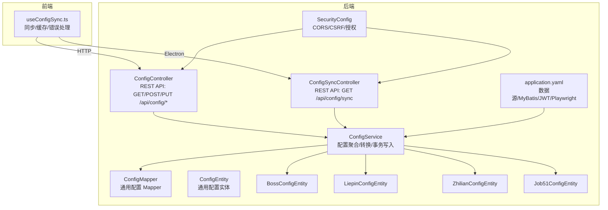
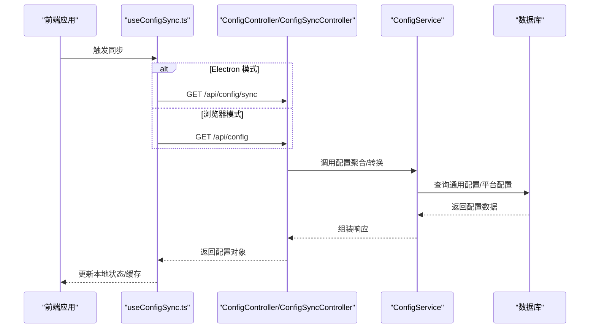
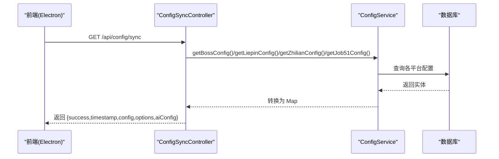
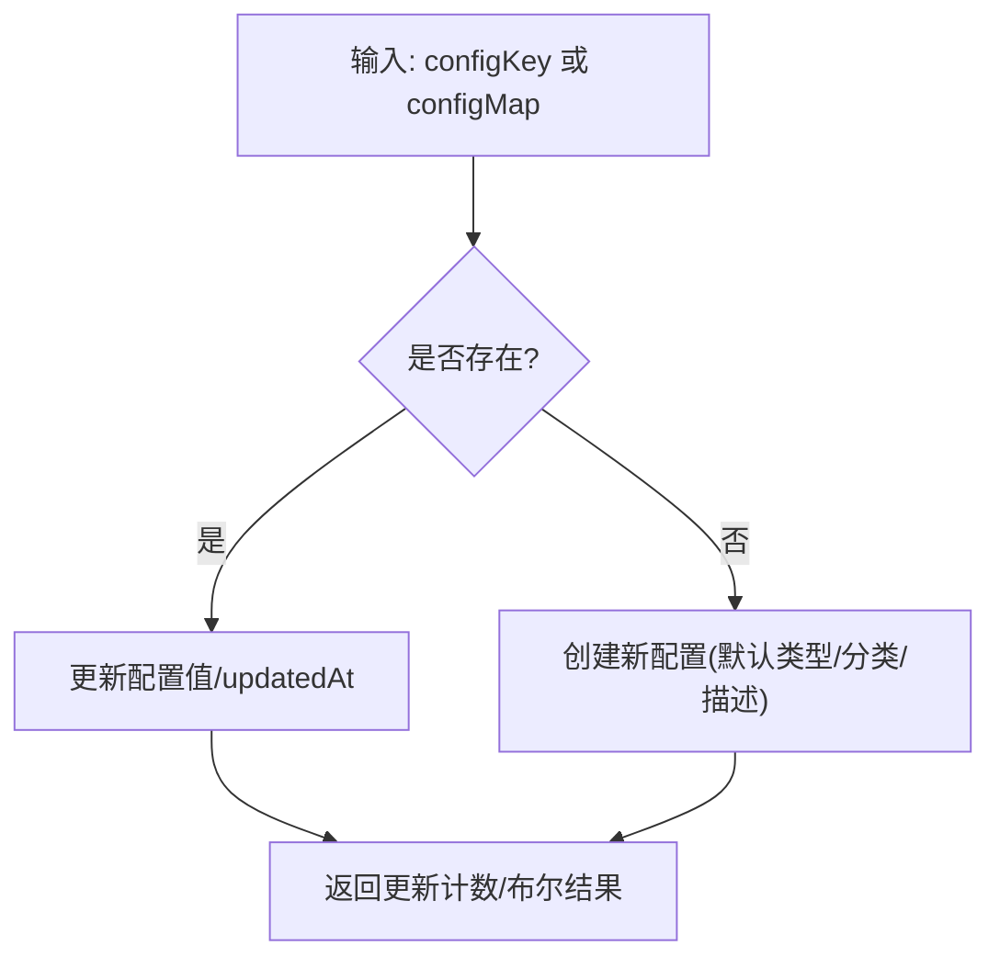
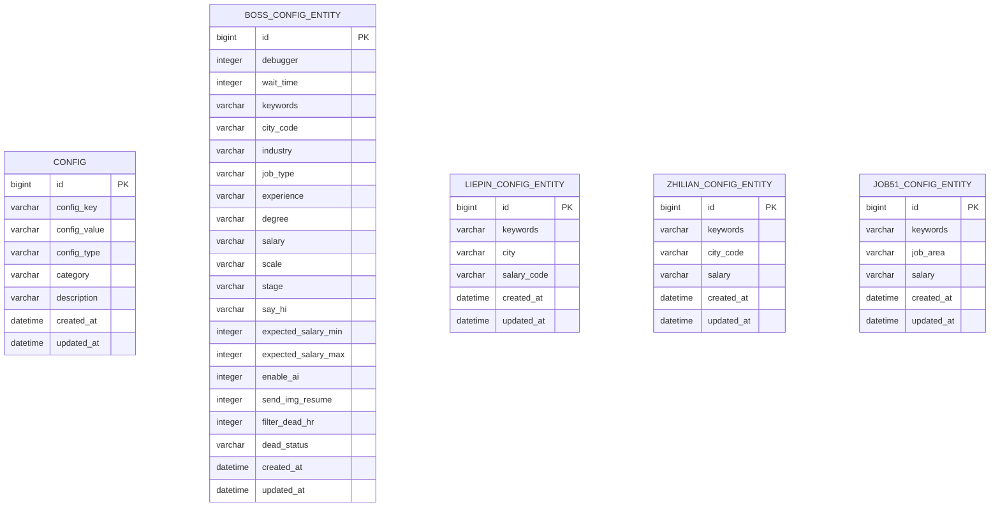
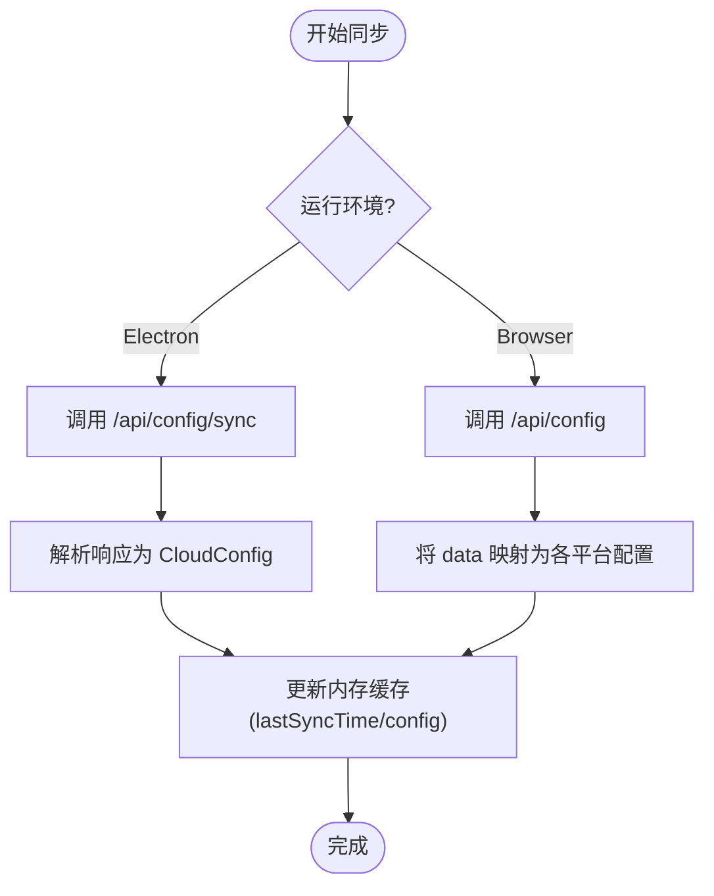
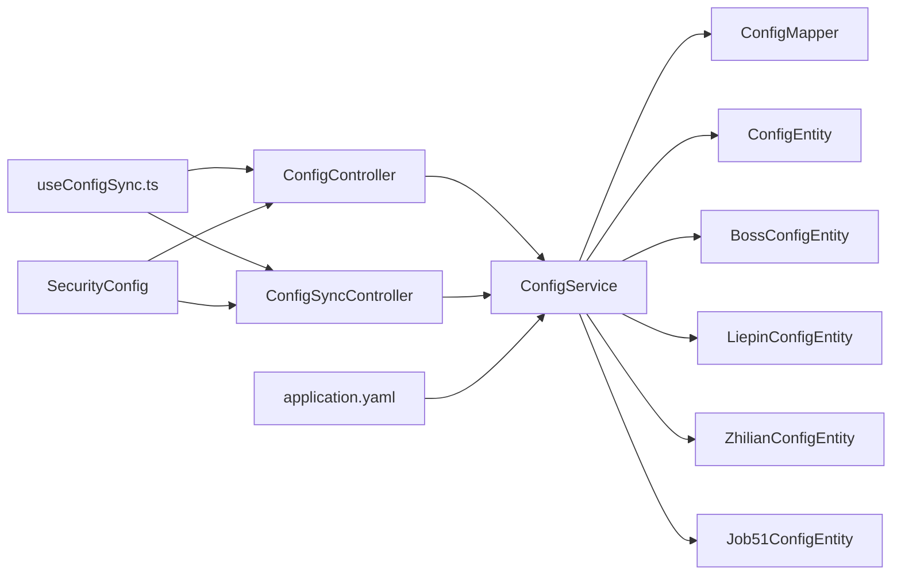

# 动态配置管理

<cite>
**本文引用的文件**   
- [ConfigController.java](file://backend/src/main/java/com/getjobs/application/controller/ConfigController.java)
- [ConfigSyncController.java](file://backend/src/main/java/com/getjobs/application/controller/ConfigSyncController.java)
- [ConfigService.java](file://backend/src/main/java/com/getjobs/application/service/ConfigService.java)
- [ConfigEntity.java](file://backend/src/main/java/com/getjobs/application/entity/ConfigEntity.java)
- [ConfigMapper.java](file://backend/src/main/java/com/getjobs/application/mapper/ConfigMapper.java)
- [BossConfigEntity.java](file://backend/src/main/java/com/getjobs/application/entity/BossConfigEntity.java)
- [LiepinConfigEntity.java](file://backend/src/main/java/com/getjobs/application/entity/LiepinConfigEntity.java)
- [ZhilianConfigEntity.java](file://backend/src/main/java/com/getjobs/application/entity/ZhilianConfigEntity.java)
- [Job51ConfigEntity.java](file://backend/src/main/java/com/getjobs/application/entity/Job51ConfigEntity.java)
- [SecurityConfig.java](file://backend/src/main/java/com/getjobs/application/config/SecurityConfig.java)
- [application.yaml](file://backend/src/main/resources/application.yaml)
- [useConfigSync.ts](file://front/hooks/useConfigSync.ts)
</cite>

## 目录
1. [简介](#简介)
2. [项目结构](#项目结构)
3. [核心组件](#核心组件)
4. [架构总览](#架构总览)
5. [组件详解](#组件详解)
6. [依赖关系分析](#依赖关系分析)
7. [性能考量](#性能考量)
8. [故障排查指南](#故障排查指南)
9. [结论](#结论)
10. [附录](#附录)

## 简介
本技术文档围绕 GetJobs 动态配置管理系统，系统化阐述运行时配置的获取、更新与同步机制，重点覆盖以下方面：
- 控制器层：ConfigController 与 ConfigSyncController 的职责边界、API 设计与行为特征
- 服务层：ConfigService 的配置聚合、转换与事务性写入策略
- 数据模型：通用配置表与平台专用配置实体的设计与映射
- 客户端同步：前端 React Hook useConfigSync 的同步流程与缓存策略
- 安全与权限：基于 Spring Security 的跨域与访问控制策略
- 版本与回滚：当前实现未内置版本与回滚机制，建议的扩展路径
- 热更新与最佳实践：如何在不中断业务的情况下安全地进行配置变更
- 监控与优化：日志、连接池与超时参数的配置要点

## 项目结构
后端采用 Spring Boot + MyBatis-Plus 架构，配置相关模块主要分布在 application.controller、application.service、application.entity、application.mapper 以及 resources 下的配置文件中。前端通过 React Hook 与后端 API 或 Electron 客户端进行配置同步。



图表来源
- [ConfigController.java:16-171](file://backend/src/main/java/com/getjobs/application/controller/ConfigController.java#L16-L171)
- [ConfigSyncController.java:18-111](file://backend/src/main/java/com/getjobs/application/controller/ConfigSyncController.java#L18-L111)
- [ConfigService.java:24-288](file://backend/src/main/java/com/getjobs/application/service/ConfigService.java#L24-L288)
- [ConfigMapper.java:10-13](file://backend/src/main/java/com/getjobs/application/mapper/ConfigMapper.java#L10-L13)
- [ConfigEntity.java:14-66](file://backend/src/main/java/com/getjobs/application/entity/ConfigEntity.java#L14-L66)
- [BossConfigEntity.java:10-57](file://backend/src/main/java/com/getjobs/application/entity/BossConfigEntity.java#L10-L57)
- [LiepinConfigEntity.java:10-32](file://backend/src/main/java/com/getjobs/application/entity/LiepinConfigEntity.java#L10-L32)
- [ZhilianConfigEntity.java:10-31](file://backend/src/main/java/com/getjobs/application/entity/ZhilianConfigEntity.java#L10-L31)
- [Job51ConfigEntity.java:10-31](file://backend/src/main/java/com/getjobs/application/entity/Job51ConfigEntity.java#L10-L31)
- [SecurityConfig.java:20-68](file://backend/src/main/java/com/getjobs/application/config/SecurityConfig.java#L20-L68)
- [application.yaml:13-91](file://backend/src/main/resources/application.yaml#L13-L91)
- [useConfigSync.ts:16-98](file://front/hooks/useConfigSync.ts#L16-L98)

章节来源
- [ConfigController.java:16-171](file://backend/src/main/java/com/getjobs/application/controller/ConfigController.java#L16-L171)
- [ConfigSyncController.java:18-111](file://backend/src/main/java/com/getjobs/application/controller/ConfigSyncController.java#L18-L111)
- [ConfigService.java:24-288](file://backend/src/main/java/com/getjobs/application/service/ConfigService.java#L24-L288)
- [ConfigEntity.java:14-66](file://backend/src/main/java/com/getjobs/application/entity/ConfigEntity.java#L14-L66)
- [ConfigMapper.java:10-13](file://backend/src/main/java/com/getjobs/application/mapper/ConfigMapper.java#L10-L13)
- [BossConfigEntity.java:10-57](file://backend/src/main/java/com/getjobs/application/entity/BossConfigEntity.java#L10-L57)
- [LiepinConfigEntity.java:10-32](file://backend/src/main/java/com/getjobs/application/entity/LiepinConfigEntity.java#L10-L32)
- [ZhilianConfigEntity.java:10-31](file://backend/src/main/java/com/getjobs/application/entity/ZhilianConfigEntity.java#L10-L31)
- [Job51ConfigEntity.java:10-31](file://backend/src/main/java/com/getjobs/application/entity/Job51ConfigEntity.java#L10-L31)
- [SecurityConfig.java:20-68](file://backend/src/main/java/com/getjobs/application/config/SecurityConfig.java#L20-L68)
- [application.yaml:13-91](file://backend/src/main/resources/application.yaml#L13-L91)
- [useConfigSync.ts:16-98](file://front/hooks/useConfigSync.ts#L16-L98)

## 核心组件
- ConfigController：提供通用配置的查询、批量更新与单键更新能力，并包含健康检查接口。
- ConfigSyncController：面向 Electron 客户端的统一配置同步接口，聚合各平台配置与 AI 配置。
- ConfigService：封装配置读取、聚合与转换逻辑，负责事务性写入与平台配置对象构建。
- ConfigMapper/ConfigEntity：通用配置表的持久化映射与实体定义。
- 平台配置实体：Boss/Liepin/Zhilian/Job51 的专用配置实体，用于 Worker 层消费。
- SecurityConfig：禁用 CSRF 与表单登录，启用 CORS，授权策略为“任何请求放行”，配合自定义 JWT 过滤器使用。
- application.yaml：数据源、MyBatis-Plus、JWT、Playwright 等关键配置项。
- useConfigSync.ts：前端同步钩子，支持浏览器与 Electron 两种模式，具备基础错误处理与本地缓存读取能力。

章节来源
- [ConfigController.java:25-171](file://backend/src/main/java/com/getjobs/application/controller/ConfigController.java#L25-L171)
- [ConfigSyncController.java:28-111](file://backend/src/main/java/com/getjobs/application/controller/ConfigSyncController.java#L28-L111)
- [ConfigService.java:34-288](file://backend/src/main/java/com/getjobs/application/service/ConfigService.java#L34-L288)
- [ConfigEntity.java:14-66](file://backend/src/main/java/com/getjobs/application/entity/ConfigEntity.java#L14-L66)
- [ConfigMapper.java:10-13](file://backend/src/main/java/com/getjobs/application/mapper/ConfigMapper.java#L10-L13)
- [SecurityConfig.java:24-68](file://backend/src/main/java/com/getjobs/application/config/SecurityConfig.java#L24-L68)
- [application.yaml:13-91](file://backend/src/main/resources/application.yaml#L13-L91)
- [useConfigSync.ts:16-98](file://front/hooks/useConfigSync.ts#L16-L98)

## 架构总览
后端通过控制器暴露 REST API，服务层负责业务编排与数据转换，持久层通过 MyBatis-Plus 访问数据库。前端通过 useConfigSync.ts 在不同运行环境下选择合适的同步路径。



图表来源
- [useConfigSync.ts:22-70](file://front/hooks/useConfigSync.ts#L22-L70)
- [ConfigController.java:29-48](file://backend/src/main/java/com/getjobs/application/controller/ConfigController.java#L29-L48)
- [ConfigSyncController.java:33-86](file://backend/src/main/java/com/getjobs/application/controller/ConfigSyncController.java#L33-L86)
- [ConfigService.java:38-87](file://backend/src/main/java/com/getjobs/application/service/ConfigService.java#L38-L87)

## 组件详解

### ConfigController：通用配置管理
- GET /api/config：返回所有配置键值对，便于前端一次性加载。
- GET /api/config/{key}：按键获取单个配置，不存在时返回 404。
- POST /api/config：批量更新配置，若键不存在则自动创建，返回更新条数。
- PUT /api/config/{key}：更新单个配置，校验请求体中的 value。
- GET /api/config/health：健康检查，返回服务状态与时间戳。
- 异常处理：捕获异常并返回统一格式的错误响应，状态码覆盖 2xx/4xx/5xx 场景。

```mermaid
flowchart TD
Start(["进入 ConfigController"]) --> Op{"请求方法"}
Op --> |GET /api/config| GetAll["查询所有配置"]
Op --> |GET /api/config/{key}| GetByKey["按键查询配置"]
Op --> |POST /api/config| BatchUpdate["批量更新配置"]
Op --> |PUT /api/config/{key}| UpdateOne["更新单个配置"]
Op --> |GET /api/config/health| Health["健康检查"]
GetAll --> RespOK["返回 {success:true,data}"]
GetByKey --> Exists{"配置存在?"}
Exists --> |是| RespOK2["返回 {success:true,data}"]
Exists --> |否| Resp404["返回 404"]
BatchUpdate --> RespOK3["返回 {success:true,message,updateCount}"]
UpdateOne --> Updated{"更新成功?"}
Updated --> |是| RespOK4["返回 {success:true,message}"]
Updated --> |否| Resp400["返回 {success:false,message}"]
Health --> RespOK5["返回 {success:true,service,status,timestamp}"]
RespOK & RespOK2 & RespOK3 & RespOK4 & RespOK5 --> End(["结束"])
Resp404 & Resp400 --> End
```

图表来源
- [ConfigController.java:29-171](file://backend/src/main/java/com/getjobs/application/controller/ConfigController.java#L29-L171)

章节来源
- [ConfigController.java:25-171](file://backend/src/main/java/com/getjobs/application/controller/ConfigController.java#L25-L171)

### ConfigSyncController：统一配置同步
- GET /api/config/sync：聚合各平台配置与 AI 配置，返回统一结构，包含时间戳。
- 平台配置来源：通过 ConfigService 读取各平台专用配置实体并转换为 Map。
- 选项配置：预留各平台选项配置的读取方法（当前返回空 Map，可扩展）。
- 错误处理：异常时返回统一错误响应。



图表来源
- [ConfigSyncController.java:33-86](file://backend/src/main/java/com/getjobs/application/controller/ConfigSyncController.java#L33-L86)
- [ConfigService.java:213-286](file://backend/src/main/java/com/getjobs/application/service/ConfigService.java#L213-L286)

章节来源
- [ConfigSyncController.java:28-111](file://backend/src/main/java/com/getjobs/application/controller/ConfigSyncController.java#L28-L111)
- [ConfigService.java:213-286](file://backend/src/main/java/com/getjobs/application/service/ConfigService.java#L213-L286)

### ConfigService：配置聚合与转换
- 通用配置读取：getAllConfigsAsMap、getConfigByKey、getConfigsByCategory、getConfigValue、requireConfigValue。
- AI 配置：getAiConfigs，要求 BASE_URL/API_KEY/MODEL，缺失时返回空字符串并告警。
- 写入策略：batchUpdateConfigs 与 updateConfig 均在事务内执行，不存在的键自动创建。
- 平台配置转换：
  - Liepin：关键词解析支持逗号、中文逗号与方括号列表；城市编码支持中文名映射；薪资代码支持中文名映射。
  - Boss/Zhilian/Job51：通过对应 Service 加载配置对象。
- 平台配置对象构建：返回 Worker 可直接使用的配置对象（如 BossConfig、ZhilianConfig、Job51Config）。



图表来源
- [ConfigService.java:131-191](file://backend/src/main/java/com/getjobs/application/service/ConfigService.java#L131-L191)

章节来源
- [ConfigService.java:34-288](file://backend/src/main/java/com/getjobs/application/service/ConfigService.java#L34-L288)

### 数据模型与映射
- ConfigEntity：通用配置表字段（主键、键、值、类型、分类、描述、创建/更新时间）。
- 平台配置实体：Boss/Liepin/Zhilian/Job51 各自专用表，包含搜索关键词、城市/区域、薪资范围等字段。
- ConfigMapper：继承 MyBatis-Plus BaseMapper，提供通用 CRUD 能力。



图表来源
- [ConfigEntity.java:14-66](file://backend/src/main/java/com/getjobs/application/entity/ConfigEntity.java#L14-L66)
- [BossConfigEntity.java:10-57](file://backend/src/main/java/com/getjobs/application/entity/BossConfigEntity.java#L10-L57)
- [LiepinConfigEntity.java:10-32](file://backend/src/main/java/com/getjobs/application/entity/LiepinConfigEntity.java#L10-L32)
- [ZhilianConfigEntity.java:10-31](file://backend/src/main/java/com/getjobs/application/entity/ZhilianConfigEntity.java#L10-L31)
- [Job51ConfigEntity.java:10-31](file://backend/src/main/java/com/getjobs/application/entity/Job51ConfigEntity.java#L10-L31)

章节来源
- [ConfigEntity.java:14-66](file://backend/src/main/java/com/getjobs/application/entity/ConfigEntity.java#L14-L66)
- [BossConfigEntity.java:10-57](file://backend/src/main/java/com/getjobs/application/entity/BossConfigEntity.java#L10-L57)
- [LiepinConfigEntity.java:10-32](file://backend/src/main/java/com/getjobs/application/entity/LiepinConfigEntity.java#L10-L32)
- [ZhilianConfigEntity.java:10-31](file://backend/src/main/java/com/getjobs/application/entity/ZhilianConfigEntity.java#L10-L31)
- [Job51ConfigEntity.java:10-31](file://backend/src/main/java/com/getjobs/application/entity/Job51ConfigEntity.java#L10-L31)
- [ConfigMapper.java:10-13](file://backend/src/main/java/com/getjobs/application/mapper/ConfigMapper.java#L10-L13)

### 客户端同步机制与缓存策略
- Electron 模式：通过 Electron 渲染进程调用本地 API，调用 ConfigSyncController 的 /sync 接口，返回统一配置对象。
- 浏览器模式：直接调用 ConfigController 的 /api/config 接口，将返回的键值对映射到各平台配置结构。
- 缓存策略：前端在内存中维护最近一次同步的时间戳与配置对象；本地缓存可通过 Electron API 的本地存储能力扩展。
- 错误处理：统一设置错误状态并在 finally 中重置同步状态，便于 UI 展示与重试。



图表来源
- [useConfigSync.ts:22-70](file://front/hooks/useConfigSync.ts#L22-L70)

章节来源
- [useConfigSync.ts:16-98](file://front/hooks/useConfigSync.ts#L16-L98)

### 权限控制与安全验证
- CORS：允许任意来源、任意方法与请求头，预检缓存 1 小时。
- CSRF：显式禁用，配合 JWT 自定义过滤器使用。
- 授权：当前策略为“任何请求放行”，建议在生产环境结合自定义 JWT 过滤器与路径级授权策略。
- 注意：由于授权策略为放行，建议在网关或反向代理层增加访问控制与速率限制。

章节来源
- [SecurityConfig.java:24-68](file://backend/src/main/java/com/getjobs/application/config/SecurityConfig.java#L24-L68)

### 配置版本控制、回滚与冲突处理
- 当前实现未内置配置版本表与回滚机制。
- 建议方案：
  - 引入配置历史表，记录每次变更的版本号、变更人、变更原因与回滚点。
  - 在 ConfigService 层增加版本比较与冲突检测，支持基于版本号的回滚。
  - 对于并发更新，采用乐观锁或分布式锁保证一致性。
  - 对关键配置（如 BASE_URL、API_KEY、MODEL）增加校验与灰度发布策略。

章节来源
- [ConfigService.java:107-124](file://backend/src/main/java/com/getjobs/application/service/ConfigService.java#L107-L124)
- [ConfigController.java:86-112](file://backend/src/main/java/com/getjobs/application/controller/ConfigController.java#L86-L112)

### 配置热更新实现细节与最佳实践
- 写入策略：批量更新与单键更新均在事务内执行，避免部分更新导致的数据不一致。
- 平台配置转换：在服务层完成数据清洗与映射（如 Liepin 关键词解析、城市/薪资代码映射），Worker 层无需关心数据格式差异。
- 前端缓存：前端在内存中维护最新配置，减少重复请求；Electron 模式可扩展本地持久化缓存。
- 最佳实践：
  - 对关键配置变更采用灰度发布与回滚预案。
  - 在 ConfigController 层增加请求体校验与长度限制。
  - 对高频读取的配置建立本地缓存与失效策略（如 TTL）。
  - 结合监控指标（响应时间、错误率、数据库连接池使用率）进行容量规划。

章节来源
- [ConfigService.java:131-191](file://backend/src/main/java/com/getjobs/application/service/ConfigService.java#L131-L191)
- [useConfigSync.ts:16-98](file://front/hooks/useConfigSync.ts#L16-L98)

## 依赖关系分析
- 控制器依赖服务层；服务层依赖 Mapper 与平台 Service；平台 Service 负责加载专用配置实体。
- 安全配置影响控制器的访问控制策略；application.yaml 影响数据库连接与 MyBatis-Plus 行为。
- 前端 Hook 依赖后端 API；在 Electron 模式下依赖本地 Electron API。



图表来源
- [useConfigSync.ts:16-98](file://front/hooks/useConfigSync.ts#L16-L98)
- [ConfigController.java:16-171](file://backend/src/main/java/com/getjobs/application/controller/ConfigController.java#L16-L171)
- [ConfigSyncController.java:18-111](file://backend/src/main/java/com/getjobs/application/controller/ConfigSyncController.java#L18-L111)
- [ConfigService.java:24-288](file://backend/src/main/java/com/getjobs/application/service/ConfigService.java#L24-L288)
- [ConfigMapper.java:10-13](file://backend/src/main/java/com/getjobs/application/mapper/ConfigMapper.java#L10-L13)
- [ConfigEntity.java:14-66](file://backend/src/main/java/com/getjobs/application/entity/ConfigEntity.java#L14-L66)
- [BossConfigEntity.java:10-57](file://backend/src/main/java/com/getjobs/application/entity/BossConfigEntity.java#L10-L57)
- [LiepinConfigEntity.java:10-32](file://backend/src/main/java/com/getjobs/application/entity/LiepinConfigEntity.java#L10-L32)
- [ZhilianConfigEntity.java:10-31](file://backend/src/main/java/com/getjobs/application/entity/ZhilianConfigEntity.java#L10-L31)
- [Job51ConfigEntity.java:10-31](file://backend/src/main/java/com/getjobs/application/entity/Job51ConfigEntity.java#L10-L31)
- [SecurityConfig.java:20-68](file://backend/src/main/java/com/getjobs/application/config/SecurityConfig.java#L20-L68)
- [application.yaml:13-91](file://backend/src/main/resources/application.yaml#L13-L91)

章节来源
- [ConfigController.java:16-171](file://backend/src/main/java/com/getjobs/application/controller/ConfigController.java#L16-L171)
- [ConfigSyncController.java:18-111](file://backend/src/main/java/com/getjobs/application/controller/ConfigSyncController.java#L18-L111)
- [ConfigService.java:24-288](file://backend/src/main/java/com/getjobs/application/service/ConfigService.java#L24-L288)
- [ConfigMapper.java:10-13](file://backend/src/main/java/com/getjobs/application/mapper/ConfigMapper.java#L10-L13)
- [SecurityConfig.java:20-68](file://backend/src/main/java/com/getjobs/application/config/SecurityConfig.java#L20-L68)
- [application.yaml:13-91](file://backend/src/main/resources/application.yaml#L13-L91)
- [useConfigSync.ts:16-98](file://front/hooks/useConfigSync.ts#L16-L98)

## 性能考量
- 数据库连接池：HikariCP 最大池大小为 10，空闲与最大生存时间合理，适合中小规模并发。
- MyBatis-Plus：开启驼峰映射与自动 ID 类型，提升开发效率与兼容性。
- Playwright 参数：慢动作、导航超时、重试策略与页面资源管理参数已内嵌配置，有助于稳定性与性能平衡。
- 建议：
  - 对高频读取的配置建立本地缓存与失效策略。
  - 在高并发场景下评估数据库连接池与线程池配置。
  - 对批量更新接口增加幂等性与去重策略，避免重复写入。

章节来源
- [application.yaml:13-91](file://backend/src/main/resources/application.yaml#L13-L91)

## 故障排查指南
- 常见问题与定位：
  - 获取配置失败：检查 ConfigController 的异常分支与日志输出。
  - 更新配置失败：确认请求体格式、键是否存在、事务是否提交成功。
  - 同步接口异常：检查 ConfigSyncController 的异常处理与平台配置实体读取。
  - 前端同步失败：区分 Electron 与浏览器模式，核对 API 路径与响应结构。
- 建议：
  - 在 ConfigController 与 ConfigSyncController 中增加更详细的日志与追踪 ID。
  - 对关键配置变更增加审计日志与回滚点标记。
  - 在生产环境启用健康检查端点与监控告警。

章节来源
- [ConfigController.java:42-47](file://backend/src/main/java/com/getjobs/application/controller/ConfigController.java#L42-L47)
- [ConfigSyncController.java:80-85](file://backend/src/main/java/com/getjobs/application/controller/ConfigSyncController.java#L80-L85)
- [useConfigSync.ts:64-69](file://front/hooks/useConfigSync.ts#L64-L69)

## 结论
GetJobs 动态配置管理通过清晰的分层设计实现了配置的集中管理与高效同步。控制器层提供简洁的 API，服务层承担配置聚合与转换，前端 Hook 支持多运行环境下的同步与缓存。当前实现未包含版本与回滚机制，建议在不影响现有功能的前提下引入版本历史与冲突检测，以满足生产环境对配置变更的可控性与可追溯性需求。

## 附录
- API 列表概览（基于控制器）
  - GET /api/config：获取所有配置
  - GET /api/config/{key}：按键获取配置
  - POST /api/config：批量更新配置
  - PUT /api/config/{key}：更新单个配置
  - GET /api/config/health：健康检查
  - GET /api/config/sync：统一配置同步（Electron）

章节来源
- [ConfigController.java:29-171](file://backend/src/main/java/com/getjobs/application/controller/ConfigController.java#L29-L171)
- [ConfigSyncController.java:33-86](file://backend/src/main/java/com/getjobs/application/controller/ConfigSyncController.java#L33-L86)