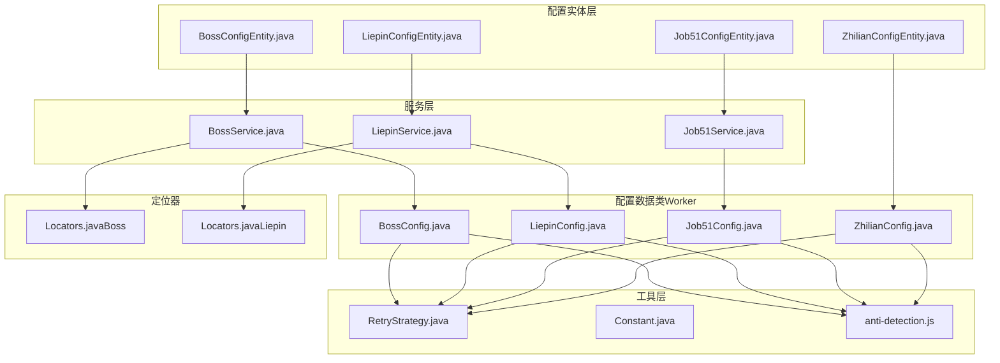
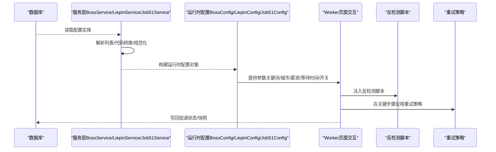
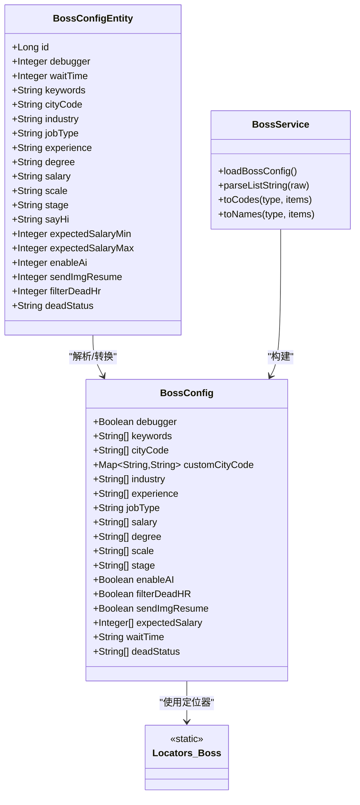
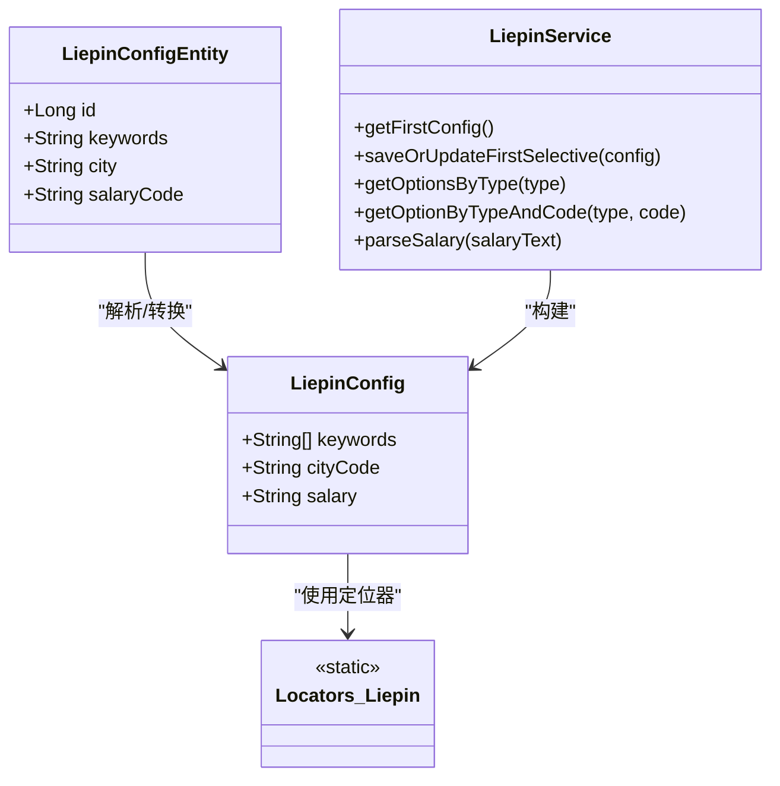
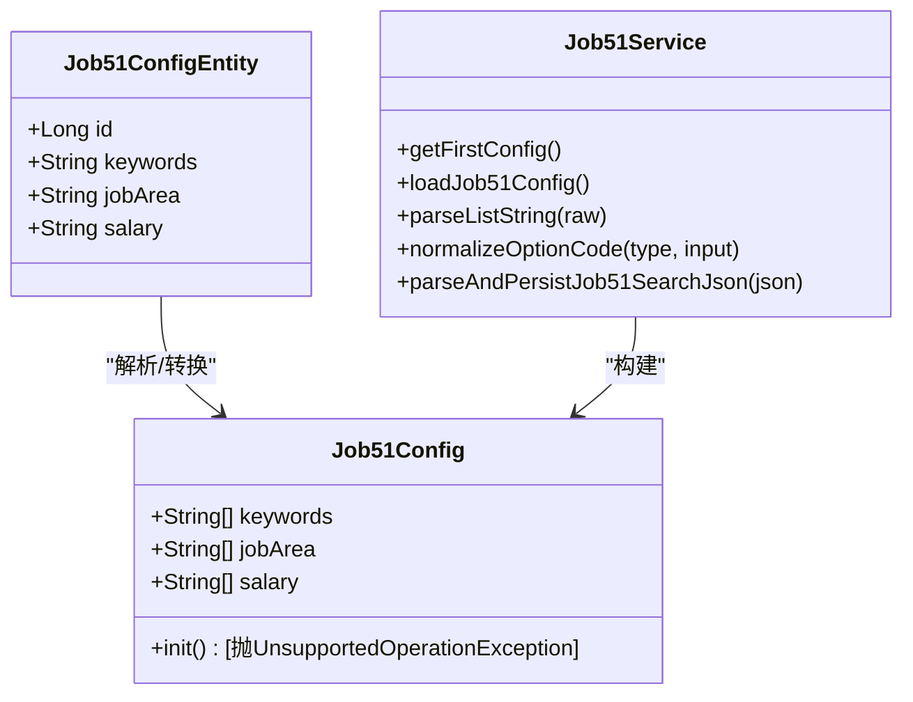
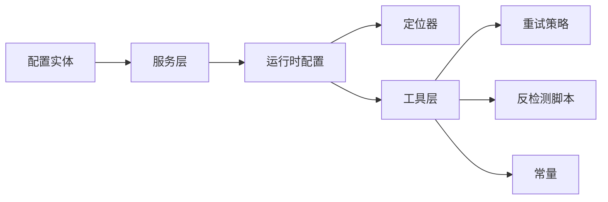

# 平台配置参数

<cite>
**本文引用的文件**
- [BossConfig.java](file://backend/src/main/java/com/getjobs/worker/boss/BossConfig.java)
- [BossConfigEntity.java](file://backend/src/main/java/com/getjobs/application/entity/BossConfigEntity.java)
- [BossService.java](file://backend/src/main/java/com/getjobs/application/service/BossService.java)
- [Locators.java（Boss）](file://backend/src/main/java/com/getjobs/worker/boss/Locators.java)
- [LiepinConfig.java](file://backend/src/main/java/com/getjobs/worker/liepin/LiepinConfig.java)
- [LiepinConfigEntity.java](file://backend/src/main/java/com/getjobs/application/entity/LiepinConfigEntity.java)
- [LiepinService.java](file://backend/src/main/java/com/getjobs/application/service/LiepinService.java)
- [Locators.java（Liepin）](file://backend/src/main/java/com/getjobs/worker/liepin/Locators.java)
- [Job51Config.java](file://backend/src/main/java/com/getjobs/worker/job51/Job51Config.java)
- [Job51ConfigEntity.java](file://backend/src/main/java/com/getjobs/application/entity/Job51ConfigEntity.java)
- [Job51Service.java](file://backend/src/main/java/com/getjobs/application/service/Job51Service.java)
- [ZhilianConfig.java](file://backend/src/main/java/com/getjobs/worker/zhilian/ZhilianConfig.java)
- [ZhilianConfigEntity.java](file://backend/src/main/java/com/getjobs/application/entity/ZhilianConfigEntity.java)
- [RetryStrategy.java](file://backend/src/main/java/com/getjobs/worker/utils/RetryStrategy.java)
- [Constant.java](file://backend/src/main/java/com/getjobs/worker/utils/Constant.java)
- [anti-detection.js](file://backend/src/main/resources/anti-detection.js)
</cite>

## 目录
1. [简介](#简介)
2. [项目结构](#项目结构)
3. [核心组件](#核心组件)
4. [架构总览](#架构总览)
5. [详细组件分析](#详细组件分析)
6. [依赖分析](#依赖分析)
7. [性能考量](#性能考量)
8. [故障排除指南](#故障排除指南)
9. [结论](#结论)
10. [附录](#附录)

## 简介
本文件面向 GetJobs 项目中各招聘平台（Boss 直聘、猎聘、51job、智联招聘）的配置参数，系统化梳理其参数含义、作用、平台差异化实现、反检测与行为模拟、请求头与超时重试策略、参数调优与最佳实践、监控指标与故障排除方法。目标是帮助开发者与运维人员快速理解并正确配置各平台参数，提升自动化成功率与稳定性。

## 项目结构
围绕平台配置的关键模块包括：
- 配置实体层：各平台配置实体（数据库持久化）
- 配置数据类：Worker 层使用的运行时配置对象
- 服务层：负责从数据库加载、解析、规范化配置
- 定位器：集中管理页面元素选择器（定位策略）
- 工具层：重试策略、常量、反检测脚本

图示来源
- [BossConfigEntity.java:1-57](file://backend/src/main/java/com/getjobs/application/entity/BossConfigEntity.java#L1-L57)
- [BossConfig.java:1-107](file://backend/src/main/java/com/getjobs/worker/boss/BossConfig.java#L1-L107)
- [BossService.java:304-366](file://backend/src/main/java/com/getjobs/application/service/BossService.java#L304-L366)
- [Locators.java（Boss）:1-63](file://backend/src/main/java/com/getjobs/worker/boss/Locators.java#L1-L63)
- [LiepinConfigEntity.java:1-32](file://backend/src/main/java/com/getjobs/application/entity/LiepinConfigEntity.java#L1-L32)
- [LiepinConfig.java:1-29](file://backend/src/main/java/com/getjobs/worker/liepin/LiepinConfig.java#L1-L29)
- [LiepinService.java:209-256](file://backend/src/main/java/com/getjobs/application/service/LiepinService.java#L209-L256)
- [Locators.java（Liepin）:1-20](file://backend/src/main/java/com/getjobs/worker/liepin/Locators.java#L1-L20)
- [Job51ConfigEntity.java:1-31](file://backend/src/main/java/com/getjobs/application/entity/Job51ConfigEntity.java#L1-L31)
- [Job51Config.java:1-41](file://backend/src/main/java/com/getjobs/worker/job51/Job51Config.java#L1-L41)
- [Job51Service.java:63-99](file://backend/src/main/java/com/getjobs/application/service/Job51Service.java#L63-L99)
- [ZhilianConfigEntity.java:1-31](file://backend/src/main/java/com/getjobs/application/entity/ZhilianConfigEntity.java#L1-L31)
- [ZhilianConfig.java:1-38](file://backend/src/main/java/com/getjobs/worker/zhilian/ZhilianConfig.java#L1-L38)
- [RetryStrategy.java:1-169](file://backend/src/main/java/com/getjobs/worker/utils/RetryStrategy.java#L1-L169)
- [Constant.java:1-10](file://backend/src/main/java/com/getjobs/worker/utils/Constant.java#L1-L10)
- [anti-detection.js:1-109](file://backend/src/main/resources/anti-detection.js#L1-L109)

章节来源
- [BossConfig.java:1-107](file://backend/src/main/java/com/getjobs/worker/boss/BossConfig.java#L1-L107)
- [BossConfigEntity.java:1-57](file://backend/src/main/java/com/getjobs/application/entity/BossConfigEntity.java#L1-L57)
- [BossService.java:304-366](file://backend/src/main/java/com/getjobs/application/service/BossService.java#L304-L366)
- [Locators.java（Boss）:1-63](file://backend/src/main/java/com/getjobs/worker/boss/Locators.java#L1-L63)
- [LiepinConfig.java:1-29](file://backend/src/main/java/com/getjobs/worker/liepin/LiepinConfig.java#L1-L29)
- [LiepinConfigEntity.java:1-32](file://backend/src/main/java/com/getjobs/application/entity/LiepinConfigEntity.java#L1-L32)
- [LiepinService.java:209-256](file://backend/src/main/java/com/getjobs/application/service/LiepinService.java#L209-L256)
- [Locators.java（Liepin）:1-20](file://backend/src/main/java/com/getjobs/worker/liepin/Locators.java#L1-L20)
- [Job51Config.java:1-41](file://backend/src/main/java/com/getjobs/worker/job51/Job51Config.java#L1-L41)
- [Job51ConfigEntity.java:1-31](file://backend/src/main/java/com/getjobs/application/entity/Job51ConfigEntity.java#L1-L31)
- [Job51Service.java:63-99](file://backend/src/main/java/com/getjobs/application/service/Job51Service.java#L63-L99)
- [ZhilianConfig.java:1-38](file://backend/src/main/java/com/getjobs/worker/zhilian/ZhilianConfig.java#L1-L38)
- [ZhilianConfigEntity.java:1-31](file://backend/src/main/java/com/getjobs/application/entity/ZhilianConfigEntity.java#L1-L31)
- [RetryStrategy.java:1-169](file://backend/src/main/java/com/getjobs/worker/utils/RetryStrategy.java#L1-L169)
- [Constant.java:1-10](file://backend/src/main/java/com/getjobs/worker/utils/Constant.java#L1-L10)
- [anti-detection.js:1-109](file://backend/src/main/resources/anti-detection.js#L1-L109)

## 核心组件
- 配置实体：承载数据库中的配置项，包含关键词、城市/区域、薪资、经验、学历、规模、融资阶段、打招呼语、期望薪资、是否启用 AI、是否发送图片简历、是否过滤不在线 HR、HR 不在线状态等。
- 配置数据类：Worker 层运行时配置对象，包含关键词列表、城市/区域列表、薪资范围、期望薪资、等待时间、是否启用 AI、是否过滤不在线 HR、是否发送图片简历、调试模式、HR 不在线状态等。
- 服务层：负责从数据库加载配置，解析列表字符串，将中文名/代码统一转换为代码，提供选择性更新与保存。
- 定位器：集中管理页面元素选择器，用于不同平台的页面交互定位。
- 工具层：重试策略（指数退避+抖动）、常量（如“不限”代码）、反检测脚本（劫持 toString、伪装控制台输出等）。

章节来源
- [BossConfig.java:16-106](file://backend/src/main/java/com/getjobs/worker/boss/BossConfig.java#L16-L106)
- [BossConfigEntity.java:12-55](file://backend/src/main/java/com/getjobs/application/entity/BossConfigEntity.java#L12-L55)
- [BossService.java:304-366](file://backend/src/main/java/com/getjobs/application/service/BossService.java#L304-L366)
- [Locators.java（Boss）:7-62](file://backend/src/main/java/com/getjobs/worker/boss/Locators.java#L7-L62)
- [RetryStrategy.java:22-125](file://backend/src/main/java/com/getjobs/worker/utils/RetryStrategy.java#L22-L125)
- [Constant.java:7-9](file://backend/src/main/java/com/getjobs/worker/utils/Constant.java#L7-L9)
- [anti-detection.js:1-109](file://backend/src/main/resources/anti-detection.js#L1-L109)

## 架构总览
平台配置在系统中的流转路径如下：
- 数据库配置实体被服务层加载并解析为运行时配置对象
- Worker 层使用配置对象驱动页面交互（定位器、超时、重试、反检测）
- 反检测脚本注入浏览器上下文，降低被检测风险
- 重试策略贯穿导航、元素点击、Cookie 加载等关键步骤

图示来源
- [BossService.java:304-366](file://backend/src/main/java/com/getjobs/application/service/BossService.java#L304-L366)
- [LiepinService.java:209-256](file://backend/src/main/java/com/getjobs/application/service/LiepinService.java#L209-L256)
- [Job51Service.java:63-99](file://backend/src/main/java/com/getjobs/application/service/Job51Service.java#L63-L99)
- [BossConfig.java:16-106](file://backend/src/main/java/com/getjobs/worker/boss/BossConfig.java#L16-L106)
- [LiepinConfig.java:12-28](file://backend/src/main/java/com/getjobs/worker/liepin/LiepinConfig.java#L12-L28)
- [Job51Config.java:14-39](file://backend/src/main/java/com/getjobs/worker/job51/Job51Config.java#L14-L39)
- [RetryStrategy.java:49-94](file://backend/src/main/java/com/getjobs/worker/utils/RetryStrategy.java#L49-L94)
- [anti-detection.js:1-109](file://backend/src/main/resources/anti-detection.js#L1-L109)

## 详细组件分析

### Boss 直聘配置参数
- 参数类别与含义
  - 调试模式：开启后便于开发调试
  - 页面等待时间：控制页面元素等待时长
  - 关键词：支持逗号或方括号列表，最终解析为列表
  - 城市/行业/经验/学历/薪资/规模/融资阶段：支持中文名或代码，统一转换为代码列表
  - 职位类型：支持中文名或代码，若为空使用“不限”代码
  - 打招呼语：默认语句，AI 为空时使用
  - 期望薪资：最小/最大值，用于筛选
  - AI 开关：是否启用 AI 生成打招呼
  - 发送图片简历：是否发送图片简历
  - 过滤不在线 HR：是否过滤 HR 不在线
  - HR 不在线状态：不在线状态列表
- 平台差异化
  - 定位器集中管理页面元素，如登录、搜索结果、岗位卡片、聊天窗口、消息列表等
  - 服务层提供列表解析与代码转换，确保 Worker 使用统一的代码体系
- 反检测与行为模拟
  - 注入反检测脚本，伪装 toString、控制台输出，降低被检测概率
- 请求头与超时重试
  - 超时与重试策略通过通用重试工具实现（指数退避+抖动）
- 参数调优建议
  - 关键词与筛选条件应尽量精确，减少无效页面加载
  - 调试模式仅在开发环境开启，生产环境关闭
  - 期望薪资与实际薪资分布匹配，避免极端值导致误判
- 监控指标
  - 成功/失败/已过滤/未投递计数、平均中位数 K、按城市/行业/公司/经验/学历/日趋势/HR 活跃度、薪资桶分布

图示来源
- [BossConfigEntity.java:12-55](file://backend/src/main/java/com/getjobs/application/entity/BossConfigEntity.java#L12-L55)
- [BossConfig.java:16-106](file://backend/src/main/java/com/getjobs/worker/boss/BossConfig.java#L16-L106)
- [BossService.java:304-366](file://backend/src/main/java/com/getjobs/application/service/BossService.java#L304-L366)
- [Locators.java（Boss）:7-62](file://backend/src/main/java/com/getjobs/worker/boss/Locators.java#L7-L62)

章节来源
- [BossConfigEntity.java:12-55](file://backend/src/main/java/com/getjobs/application/entity/BossConfigEntity.java#L12-L55)
- [BossConfig.java:16-106](file://backend/src/main/java/com/getjobs/worker/boss/BossConfig.java#L16-L106)
- [BossService.java:304-366](file://backend/src/main/java/com/getjobs/application/service/BossService.java#L304-L366)
- [Locators.java（Boss）:7-62](file://backend/src/main/java/com/getjobs/worker/boss/Locators.java#L7-L62)
- [anti-detection.js:1-109](file://backend/src/main/resources/anti-detection.js#L1-L109)
- [RetryStrategy.java:22-125](file://backend/src/main/java/com/getjobs/worker/utils/RetryStrategy.java#L22-L125)

### 猎聘配置参数
- 参数类别与含义
  - 关键词：搜索关键词
  - 城市：支持中文名或代码
  - 薪资代码或范围：支持中文名或代码
- 平台差异化
  - 定位器集中管理分页、下一页、订阅弹窗关闭、岗位卡片容器、聊天窗口等元素
  - 服务层提供选项列表、代码/名称互转、薪资解析（支持“面议”“X-Yk·N薪”等）
- 反检测与行为模拟
  - 注入反检测脚本，伪装 toString、控制台输出
- 请求头与超时重试
  - 采用通用重试策略（指数退避+抖动）

图示来源
- [LiepinConfigEntity.java:12-31](file://backend/src/main/java/com/getjobs/application/entity/LiepinConfigEntity.java#L12-L31)
- [LiepinConfig.java:12-28](file://backend/src/main/java/com/getjobs/worker/liepin/LiepinConfig.java#L12-L28)
- [LiepinService.java:209-256](file://backend/src/main/java/com/getjobs/application/service/LiepinService.java#L209-L256)
- [Locators.java（Liepin）:7-20](file://backend/src/main/java/com/getjobs/worker/liepin/Locators.java#L7-L20)

章节来源
- [LiepinConfigEntity.java:12-31](file://backend/src/main/java/com/getjobs/application/entity/LiepinConfigEntity.java#L12-L31)
- [LiepinConfig.java:12-28](file://backend/src/main/java/com/getjobs/worker/liepin/LiepinConfig.java#L12-L28)
- [LiepinService.java:209-256](file://backend/src/main/java/com/getjobs/application/service/LiepinService.java#L209-L256)
- [Locators.java（Liepin）:7-20](file://backend/src/main/java/com/getjobs/worker/liepin/Locators.java#L7-L20)
- [anti-detection.js:1-109](file://backend/src/main/resources/anti-detection.js#L1-L109)
- [RetryStrategy.java:22-125](file://backend/src/main/java/com/getjobs/worker/utils/RetryStrategy.java#L22-L125)

### 51job 配置参数
- 参数类别与含义
  - 关键词：支持逗号或方括号列表，最终解析为列表
  - 城市区域：中文名或代码列表，统一转换为代码列表
  - 薪资范围：中文名或代码列表，统一转换为代码列表
- 平台差异化
  - 服务层提供列表解析（兼容 JSON 数组）、选项代码归一化、薪资解析（支持小数、单位换算）
  - 配置初始化逻辑已迁移至数据库维护，保留静态方法以兼容旧调用
- 反检测与行为模拟
  - 注入反检测脚本，伪装 toString、控制台输出
- 请求头与超时重试
  - 采用通用重试策略（指数退避+抖动）

图示来源
- [Job51ConfigEntity.java:12-31](file://backend/src/main/java/com/getjobs/application/entity/Job51ConfigEntity.java#L12-L31)
- [Job51Config.java:14-39](file://backend/src/main/java/com/getjobs/worker/job51/Job51Config.java#L14-L39)
- [Job51Service.java:63-99](file://backend/src/main/java/com/getjobs/application/service/Job51Service.java#L63-L99)

章节来源
- [Job51ConfigEntity.java:12-31](file://backend/src/main/java/com/getjobs/application/entity/Job51ConfigEntity.java#L12-L31)
- [Job51Config.java:14-39](file://backend/src/main/java/com/getjobs/worker/job51/Job51Config.java#L14-L39)
- [Job51Service.java:63-99](file://backend/src/main/java/com/getjobs/application/service/Job51Service.java#L63-L99)
- [anti-detection.js:1-109](file://backend/src/main/resources/anti-detection.js#L1-L109)
- [RetryStrategy.java:22-125](file://backend/src/main/java/com/getjobs/worker/utils/RetryStrategy.java#L22-L125)

### 智联招聘配置参数
- 参数类别与含义
  - 关键词：支持逗号或方括号列表，最终解析为列表
  - 城市：中文名或代码，单值
  - 薪资范围：中文名或代码，单值
- 平台差异化
  - 配置初始化逻辑已迁移至数据库维护，保留静态方法以兼容旧调用
- 反检测与行为模拟
  - 注入反检测脚本，伪装 toString、控制台输出
- 请求头与超时重试
  - 采用通用重试策略（指数退避+抖动）

章节来源
- [ZhilianConfigEntity.java:12-31](file://backend/src/main/java/com/getjobs/application/entity/ZhilianConfigEntity.java#L12-L31)
- [ZhilianConfig.java:13-36](file://backend/src/main/java/com/getjobs/worker/zhilian/ZhilianConfig.java#L13-L36)
- [anti-detection.js:1-109](file://backend/src/main/resources/anti-detection.js#L1-L109)
- [RetryStrategy.java:22-125](file://backend/src/main/java/com/getjobs/worker/utils/RetryStrategy.java#L22-L125)

## 依赖分析
- 配置实体与运行时配置的映射关系清晰，服务层承担解析与规范化职责
- 定位器集中管理页面元素，降低平台差异带来的维护成本
- 重试策略与反检测脚本作为横切关注点，被各平台共享
- 常量（如“不限”代码）统一规范，避免平台间差异

图示来源
- [BossService.java:304-366](file://backend/src/main/java/com/getjobs/application/service/BossService.java#L304-L366)
- [LiepinService.java:209-256](file://backend/src/main/java/com/getjobs/application/service/LiepinService.java#L209-L256)
- [Job51Service.java:63-99](file://backend/src/main/java/com/getjobs/application/service/Job51Service.java#L63-L99)
- [RetryStrategy.java:22-125](file://backend/src/main/java/com/getjobs/worker/utils/RetryStrategy.java#L22-L125)
- [Constant.java:7-9](file://backend/src/main/java/com/getjobs/worker/utils/Constant.java#L7-L9)
- [anti-detection.js:1-109](file://backend/src/main/resources/anti-detection.js#L1-L109)

章节来源
- [BossService.java:304-366](file://backend/src/main/java/com/getjobs/application/service/BossService.java#L304-L366)
- [LiepinService.java:209-256](file://backend/src/main/java/com/getjobs/application/service/LiepinService.java#L209-L256)
- [Job51Service.java:63-99](file://backend/src/main/java/com/getjobs/application/service/Job51Service.java#L63-L99)
- [RetryStrategy.java:22-125](file://backend/src/main/java/com/getjobs/worker/utils/RetryStrategy.java#L22-L125)
- [Constant.java:7-9](file://backend/src/main/java/com/getjobs/worker/utils/Constant.java#L7-L9)
- [anti-detection.js:1-109](file://backend/src/main/resources/anti-detection.js#L1-L109)

## 性能考量
- 列表解析与代码转换
  - 使用服务层统一解析与转换，避免重复逻辑，提高一致性与性能
- 重试策略
  - 指数退避+抖动可有效缓解瞬时网络波动与平台反爬机制，建议根据平台稳定性调整最大重试次数与最大延迟
- 反检测脚本
  - 降低被检测概率，减少页面拦截与验证码出现频率，间接提升成功率
- 监控与指标
  - 建议采集成功率、平均响应时间、重试次数、被拦截率、投递状态分布等指标，结合日志进行 A/B 对比

[本节为通用指导，无需列出具体文件来源]

## 故障排除指南
- 列表解析问题
  - 确认配置中关键词/城市/薪资等字段是否为方括号列表或逗号分隔，服务层会进行解析与去引号处理
- 代码与名称不一致
  - 使用服务层提供的 toCodes/toNames 方法进行统一转换，避免混用导致筛选失效
- “不限”选项缺失
  - 服务层会在 city/industry 类型下确保“不限”选项存在并置顶显示，检查数据库中对应类型是否正确
- 重试失败
  - 查看重试日志与异常堆栈，确认最大重试次数与最大延迟设置是否合理；必要时增加等待时间或放宽筛选条件
- 反检测无效
  - 确认反检测脚本已注入浏览器上下文；检查浏览器版本与 Playwright 配置是否兼容
- 页面定位失败
  - 检查定位器是否与平台页面结构一致；必要时更新定位器或增加等待策略

章节来源
- [BossService.java:372-385](file://backend/src/main/java/com/getjobs/application/service/BossService.java#L372-L385)
- [BossService.java:414-426](file://backend/src/main/java/com/getjobs/application/service/BossService.java#L414-L426)
- [BossService.java:100-130](file://backend/src/main/java/com/getjobs/application/service/BossService.java#L100-L130)
- [RetryStrategy.java:49-94](file://backend/src/main/java/com/getjobs/worker/utils/RetryStrategy.java#L49-L94)
- [anti-detection.js:1-109](file://backend/src/main/resources/anti-detection.js#L1-L109)
- [Locators.java（Boss）:7-62](file://backend/src/main/java/com/getjobs/worker/boss/Locators.java#L7-L62)
- [Locators.java（Liepin）:7-20](file://backend/src/main/java/com/getjobs/worker/liepin/Locators.java#L7-L20)

## 结论
通过对各平台配置参数的系统化梳理，可以实现：
- 统一的配置解析与代码转换流程，降低平台差异带来的维护成本
- 明确的定位器与反检测策略，提升页面交互稳定性与成功率
- 可调优的重试策略与监控指标，保障自动化流程的可靠性与可观测性
建议在生产环境中严格区分调试与生产配置，持续优化筛选条件与重试参数，结合监控指标进行迭代改进。

[本节为总结性内容，无需列出具体文件来源]

## 附录
- 参数调优清单
  - 关键词与筛选条件：尽量精确，减少无效页面加载
  - 等待时间：根据平台响应速度适当调整
  - 重试策略：根据失败类型与平台稳定性调整最大重试次数与最大延迟
  - 反检测：确保脚本注入成功且与浏览器版本兼容
  - 监控：建立成功率、重试次数、被拦截率、投递状态分布等指标
- 平台特定建议
  - Boss：利用“不限”代码与 HR 不在线过滤，提升命中质量
  - 猎聘：关注分页与弹窗关闭，避免干扰投递流程
  - 51job：注意薪资单位换算与小数处理，确保筛选准确
  - 智联：保持关键词与城市/薪资的简洁性，避免过度筛选

[本节为通用指导，无需列出具体文件来源]