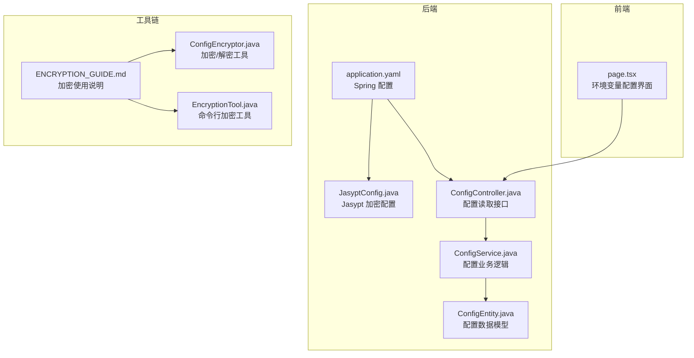
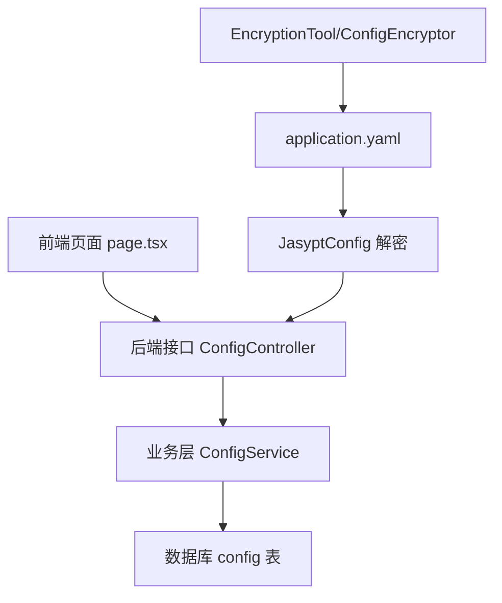
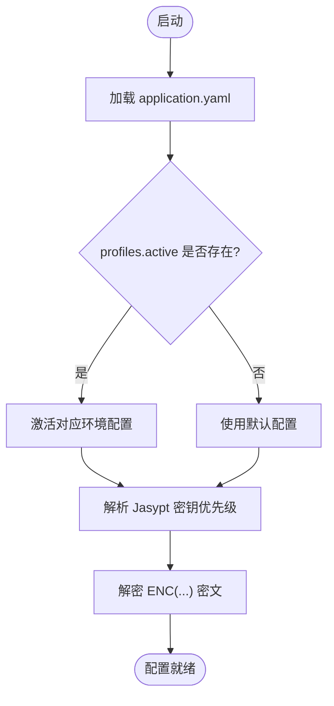
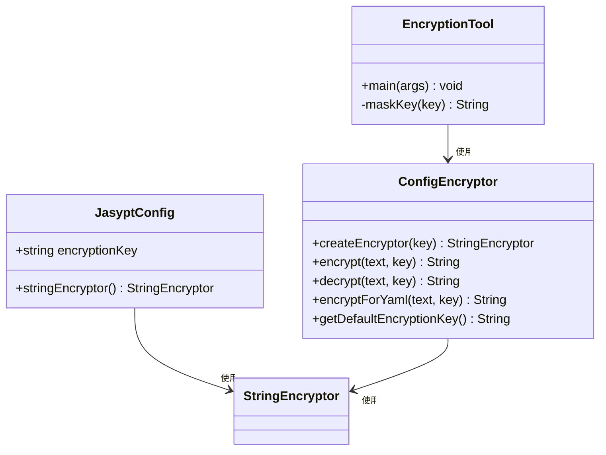
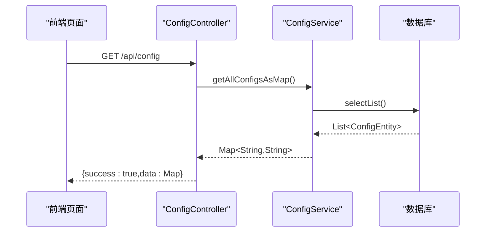
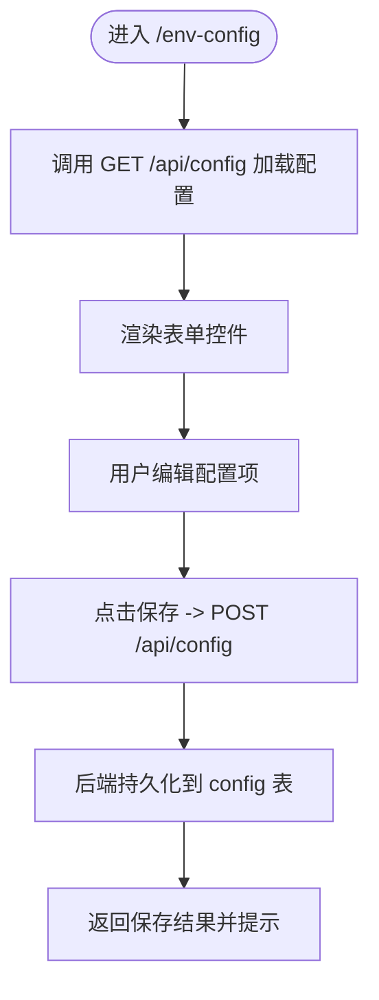
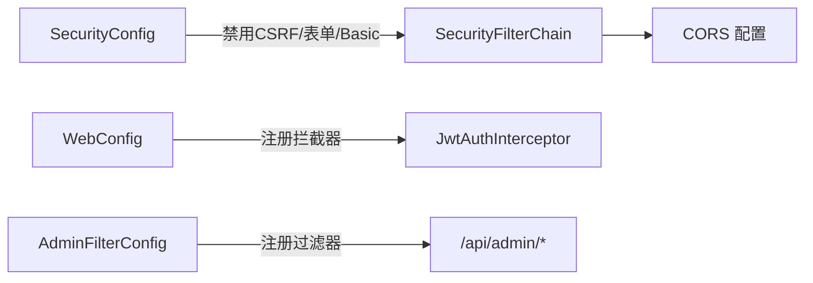
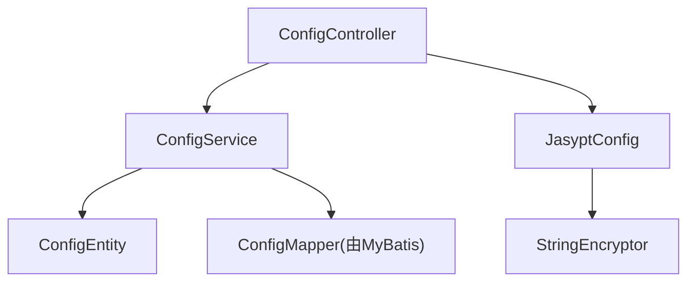

# 环境配置管理

<cite>
**本文引用的文件**
- [application.yaml](file://backend/src/main/resources/application.yaml)
- [application.yaml.template](file://scripts/application.yaml.template)
- [ENCRYPTION_GUIDE.md](file://ENCRYPTION_GUIDE.md)
- [JasyptConfig.java](file://backend/src/main/java/com/getjobs/application/config/JasyptConfig.java)
- [ConfigEncryptor.java](file://backend/src/main/java/com/getjobs/common/util/ConfigEncryptor.java)
- [EncryptionTool.java](file://backend/src/main/java/com/getjobs/common/util/EncryptionTool.java)
- [ConfigController.java](file://backend/src/main/java/com/getjobs/application/controller/ConfigController.java)
- [ConfigService.java](file://backend/src/main/java/com/getjobs/application/service/ConfigService.java)
- [ConfigEntity.java](file://backend/src/main/java/com/getjobs/application/entity/ConfigEntity.java)
- [page.tsx](file://front/app/env-config/page.tsx)
- [SecurityConfig.java](file://backend/src/main/java/com/getjobs/application/config/SecurityConfig.java)
- [WebConfig.java](file://backend/src/main/java/com/getjobs/application/config/WebConfig.java)
- [AdminFilterConfig.java](file://backend/src/main/java/com/getjobs/application/config/AdminFilterConfig.java)
</cite>

## 目录
1. [简介](#简介)
2. [项目结构](#项目结构)
3. [核心组件](#核心组件)
4. [架构总览](#架构总览)
5. [详细组件分析](#详细组件分析)
6. [依赖分析](#依赖分析)
7. [性能考虑](#性能考虑)
8. [故障排查指南](#故障排查指南)
9. [结论](#结论)
10. [附录](#附录)

## 简介
本技术文档围绕 GetJobs 的环境配置管理系统，系统化阐述多环境配置的组织结构、切换机制与优先级规则；详解开发、测试、生产环境的配置差异与最佳实践；说明环境变量管理、配置覆盖与优先级；覆盖 Docker/Kubernetes/云平台集成要点；提供配置加密存储、密钥管理与安全传输策略；并给出自动化部署、CI/CD 集成与环境一致性保障方案，以及配置监控、审计与合规检查机制。

## 项目结构
GetJobs 的配置管理由“后端 Spring Boot 配置 + 前端环境变量配置界面 + 加密工具链”三部分组成：
- 后端配置文件：application.yaml 作为主配置，支持 profiles 切换与 Jasypt 加密。
- 前端页面：提供可视化环境变量配置界面，读取/保存后端配置接口。
- 加密工具链：JasyptConfig + ConfigEncryptor + EncryptionTool，实现配置加密与密钥管理。

**图表来源**
- [application.yaml:1-101](file://backend/src/main/resources/application.yaml#L1-L101)
- [JasyptConfig.java:1-46](file://backend/src/main/java/com/getjobs/application/config/JasyptConfig.java#L1-L46)
- [ConfigController.java:1-48](file://backend/src/main/java/com/getjobs/application/controller/ConfigController.java#L1-L48)
- [ConfigService.java:42-87](file://backend/src/main/java/com/getjobs/application/service/ConfigService.java#L42-L87)
- [ConfigEntity.java:1-65](file://backend/src/main/java/com/getjobs/application/entity/ConfigEntity.java#L1-L65)
- [page.tsx:1-338](file://front/app/env-config/page.tsx#L1-L338)
- [ENCRYPTION_GUIDE.md:1-247](file://ENCRYPTION_GUIDE.md#L1-L247)

**章节来源**
- [application.yaml:1-101](file://backend/src/main/resources/application.yaml#L1-L101)
- [application.yaml.template:1-102](file://scripts/application.yaml.template#L1-L102)
- [page.tsx:1-338](file://front/app/env-config/page.tsx#L1-L338)

## 核心组件
- 配置文件与覆盖优先级
  - application.yaml 为主配置，支持 profiles.active 切换不同环境；Jasypt 密钥优先级：环境变量 > JVM 参数 > 配置文件默认值。
- 加密与密钥管理
  - JasyptConfig 基于 Jasypt 的 PBEWithMD5AndDES 算法，通过环境变量或 JVM 参数注入密钥，自动解密 ENC(...) 内容。
  - ConfigEncryptor 提供静态加密/解密与 ENC(...) 包装能力；EncryptionTool 支持命令行加密与密钥掩码展示。
- 配置读取与持久化
  - ConfigController 提供 GET /api/config 返回所有配置键值；ConfigService 查询数据库配置；ConfigEntity 映射 config 表。
- 前端配置界面
  - page.tsx 提供企业微信/钉钉 Webhook、API 地址与模型、API Key 等配置项的可视化编辑与保存。

**章节来源**
- [JasyptConfig.java:1-46](file://backend/src/main/java/com/getjobs/application/config/JasyptConfig.java#L1-L46)
- [ConfigEncryptor.java:1-92](file://backend/src/main/java/com/getjobs/common/util/ConfigEncryptor.java#L1-L92)
- [EncryptionTool.java:1-88](file://backend/src/main/java/com/getjobs/common/util/EncryptionTool.java#L1-L88)
- [ConfigController.java:1-48](file://backend/src/main/java/com/getjobs/application/controller/ConfigController.java#L1-L48)
- [ConfigService.java:42-87](file://backend/src/main/java/com/getjobs/application/service/ConfigService.java#L42-L87)
- [ConfigEntity.java:1-65](file://backend/src/main/java/com/getjobs/application/entity/ConfigEntity.java#L1-L65)
- [page.tsx:1-338](file://front/app/env-config/page.tsx#L1-L338)

## 架构总览
整体架构分为三层：前端可视化层、后端配置服务层、数据库持久化层；同时通过 Jasypt 实现配置加密与密钥注入。

**图表来源**
- [page.tsx:1-338](file://front/app/env-config/page.tsx#L1-L338)
- [ConfigController.java:1-48](file://backend/src/main/java/com/getjobs/application/controller/ConfigController.java#L1-L48)
- [ConfigService.java:42-87](file://backend/src/main/java/com/getjobs/application/service/ConfigService.java#L42-L87)
- [ConfigEntity.java:1-65](file://backend/src/main/java/com/getjobs/application/entity/ConfigEntity.java#L1-L65)
- [application.yaml:1-101](file://backend/src/main/resources/application.yaml#L1-L101)
- [JasyptConfig.java:1-46](file://backend/src/main/java/com/getjobs/application/config/JasyptConfig.java#L1-L46)
- [EncryptionTool.java:1-88](file://backend/src/main/java/com/getjobs/common/util/EncryptionTool.java#L1-L88)
- [ConfigEncryptor.java:1-92](file://backend/src/main/java/com/getjobs/common/util/ConfigEncryptor.java#L1-L92)

## 详细组件分析

### 配置文件与环境切换
- profiles.active 控制当前激活环境；开发环境默认 dev。
- Jasypt 密钥优先级：环境变量 JASYPT_ENCRYPTOR_PASSWORD > JVM 参数 -Djasypt.encryptor.password > application.yaml 默认值。
- application.yaml.template 提供标准模板与注释，便于复制与定制。

**图表来源**
- [application.yaml:1-101](file://backend/src/main/resources/application.yaml#L1-L101)
- [application.yaml.template:1-102](file://scripts/application.yaml.template#L1-L102)
- [JasyptConfig.java:1-46](file://backend/src/main/java/com/getjobs/application/config/JasyptConfig.java#L1-L46)

**章节来源**
- [application.yaml:1-101](file://backend/src/main/resources/application.yaml#L1-L101)
- [application.yaml.template:1-102](file://scripts/application.yaml.template#L1-L102)
- [JasyptConfig.java:1-46](file://backend/src/main/java/com/getjobs/application/config/JasyptConfig.java#L1-L46)

### 加密与密钥管理
- JasyptConfig 动态注入密钥，创建 StringEncryptor，支持 ENC(...) 格式密文解密。
- ConfigEncryptor 提供静态工具方法，便于在工具类或测试中使用。
- EncryptionTool 支持命令行加密、密钥掩码显示与使用提示。

**图表来源**
- [JasyptConfig.java:1-46](file://backend/src/main/java/com/getjobs/application/config/JasyptConfig.java#L1-L46)
- [ConfigEncryptor.java:1-92](file://backend/src/main/java/com/getjobs/common/util/ConfigEncryptor.java#L1-L92)
- [EncryptionTool.java:1-88](file://backend/src/main/java/com/getjobs/common/util/EncryptionTool.java#L1-L88)

**章节来源**
- [JasyptConfig.java:1-46](file://backend/src/main/java/com/getjobs/application/config/JasyptConfig.java#L1-L46)
- [ConfigEncryptor.java:1-92](file://backend/src/main/java/com/getjobs/common/util/ConfigEncryptor.java#L1-L92)
- [EncryptionTool.java:1-88](file://backend/src/main/java/com/getjobs/common/util/EncryptionTool.java#L1-L88)
- [ENCRYPTION_GUIDE.md:1-247](file://ENCRYPTION_GUIDE.md#L1-L247)

### 配置读取与持久化流程
- 前端通过 GET /api/config 获取配置映射。
- 后端 ConfigController 调用 ConfigService 获取 Map；ConfigService 查询数据库并返回键值对。
- ConfigEntity 映射 config 表字段，支持按分类查询与按键查询。

**图表来源**
- [ConfigController.java:1-48](file://backend/src/main/java/com/getjobs/application/controller/ConfigController.java#L1-L48)
- [ConfigService.java:42-87](file://backend/src/main/java/com/getjobs/application/service/ConfigService.java#L42-L87)
- [ConfigEntity.java:1-65](file://backend/src/main/java/com/getjobs/application/entity/ConfigEntity.java#L1-L65)

**章节来源**
- [ConfigController.java:1-48](file://backend/src/main/java/com/getjobs/application/controller/ConfigController.java#L1-L48)
- [ConfigService.java:42-87](file://backend/src/main/java/com/getjobs/application/service/ConfigService.java#L42-L87)
- [ConfigEntity.java:1-65](file://backend/src/main/java/com/getjobs/application/entity/ConfigEntity.java#L1-L65)

### 前端环境变量配置界面
- 页面提供企业微信/钉钉 Webhook、API Base URL、AI 模型、API Key 等配置项。
- 支持开关控制是否发送机器人消息；支持显示/隐藏 API Key。
- 保存时将表单映射为 Map 发送到 /api/config，后端持久化到数据库。

**图表来源**
- [page.tsx:1-338](file://front/app/env-config/page.tsx#L1-L338)
- [ConfigController.java:1-48](file://backend/src/main/java/com/getjobs/application/controller/ConfigController.java#L1-L48)
- [ConfigService.java:42-87](file://backend/src/main/java/com/getjobs/application/service/ConfigService.java#L42-L87)

**章节来源**
- [page.tsx:1-338](file://front/app/env-config/page.tsx#L1-L338)

### 安全与访问控制
- Spring Security 关闭 CSRF、禁用表单登录与 HTTP Basic，统一通过 JWT 过滤器进行认证。
- WebConfig 注册拦截器，排除健康检查、登录注册与 actuator 等路径。
- AdminFilterConfig 为后台管理路径添加 JWT 过滤器。

**图表来源**
- [SecurityConfig.java:1-68](file://backend/src/main/java/com/getjobs/application/config/SecurityConfig.java#L1-L68)
- [WebConfig.java:1-37](file://backend/src/main/java/com/getjobs/application/config/WebConfig.java#L1-L37)
- [AdminFilterConfig.java:1-28](file://backend/src/main/java/com/getjobs/application/config/AdminFilterConfig.java#L1-L28)

**章节来源**
- [SecurityConfig.java:1-68](file://backend/src/main/java/com/getjobs/application/config/SecurityConfig.java#L1-L68)
- [WebConfig.java:1-37](file://backend/src/main/java/com/getjobs/application/config/WebConfig.java#L1-L37)
- [AdminFilterConfig.java:1-28](file://backend/src/main/java/com/getjobs/application/config/AdminFilterConfig.java#L1-L28)

## 依赖分析
- 组件耦合
  - ConfigController 依赖 ConfigService；ConfigService 依赖 ConfigMapper 与数据库；JasyptConfig 依赖 Spring 容器注入密钥。
- 外部依赖
  - Jasypt 加密框架；MySQL 数据源；MyBatis Plus；Spring Security/CORS；前端 Next.js。

**图表来源**
- [ConfigController.java:1-48](file://backend/src/main/java/com/getjobs/application/controller/ConfigController.java#L1-L48)
- [ConfigService.java:42-87](file://backend/src/main/java/com/getjobs/application/service/ConfigService.java#L42-L87)
- [ConfigEntity.java:1-65](file://backend/src/main/java/com/getjobs/application/entity/ConfigEntity.java#L1-L65)
- [JasyptConfig.java:1-46](file://backend/src/main/java/com/getjobs/application/config/JasyptConfig.java#L1-L46)

**章节来源**
- [ConfigController.java:1-48](file://backend/src/main/java/com/getjobs/application/controller/ConfigController.java#L1-L48)
- [ConfigService.java:42-87](file://backend/src/main/java/com/getjobs/application/service/ConfigService.java#L42-L87)
- [JasyptConfig.java:1-46](file://backend/src/main/java/com/getjobs/application/config/JasyptConfig.java#L1-L46)

## 性能考虑
- 数据库连接池参数已在 application.yaml 中优化，包括最大连接数、空闲超时与最大生命周期。
- Playwright Agent 的超时与重试策略可按平台差异化配置，避免页面加载阻塞。
- 日志滚动策略限制单文件大小与保留天数，降低磁盘占用。

**章节来源**
- [application.yaml:13-24](file://backend/src/main/resources/application.yaml#L13-L24)
- [application.yaml:70-98](file://backend/src/main/resources/application.yaml#L70-L98)

## 故障排查指南
- 启动时报解密错误
  - 检查 JASYPT_ENCRYPTOR_PASSWORD 环境变量或 JVM 参数是否正确设置；确认 ENC() 格式完整且括号匹配。
- 配置无法保存
  - 检查 /api/config 接口是否可达；确认前端网络状态与后端日志；核对数据库连接与表结构。
- 密钥安全
  - 生产环境务必使用强随机密钥并通过环境变量注入；避免将密钥写入配置文件或代码仓库。

**章节来源**
- [ENCRYPTION_GUIDE.md:215-247](file://ENCRYPTION_GUIDE.md#L215-L247)
- [ConfigController.java:1-48](file://backend/src/main/java/com/getjobs/application/controller/ConfigController.java#L1-L48)

## 结论
GetJobs 的环境配置管理以 Spring Boot 配置体系为核心，结合 Jasypt 加密与前端可视化界面，实现了从开发到生产的全链路配置管理。通过明确的覆盖优先级、严格的密钥管理与安全传输策略，配合 CI/CD 与容器编排，可有效保障多环境一致性与合规性。

## 附录

### 开发/测试/生产环境最佳实践
- 开发环境
  - 使用 application.yaml 默认密钥与本地数据库；开启调试日志；禁用生产级安全加固。
- 测试环境
  - 使用独立数据库与测试密钥；启用必要的审计日志；模拟生产流量与超时策略。
- 生产环境
  - 通过环境变量注入密钥与敏感配置；启用 HTTPS 与严格 CORS；限制日志输出与磁盘空间；定期轮换密钥并重新加密配置。

**章节来源**
- [application.yaml:1-101](file://backend/src/main/resources/application.yaml#L1-L101)
- [ENCRYPTION_GUIDE.md:165-214](file://ENCRYPTION_GUIDE.md#L165-L214)

### Docker/Kubernetes/云平台集成要点
- Docker
  - 通过环境变量注入 JASYPT_ENCRYPTOR_PASSWORD 与数据库凭据；挂载日志目录；暴露固定端口。
- Kubernetes
  - 使用 Secret 管理密钥与敏感配置；通过 ConfigMap 管理非敏感配置；使用 Pod 环境变量覆盖默认值。
- 云平台
  - 使用平台提供的密钥管理服务（如 AWS Secrets Manager/Vault）动态注入密钥；启用审计与合规扫描。

**章节来源**
- [application.yaml:28-36](file://backend/src/main/resources/application.yaml#L28-L36)
- [ENCRYPTION_GUIDE.md:181-185](file://ENCRYPTION_GUIDE.md#L181-L185)

### 配置监控、审计与合规
- 监控
  - 启用 actuator 指标端点；记录关键配置变更事件；观察数据库连接池与日志滚动。
- 审计
  - 记录配置变更操作（谁在何时修改了哪些键）；对敏感键变更进行二次校验。
- 合规
  - 确保密钥不落盘、不入版本库；定期轮换密钥并重新加密配置；遵循最小权限原则。

**章节来源**
- [SecurityConfig.java:1-68](file://backend/src/main/java/com/getjobs/application/config/SecurityConfig.java#L1-L68)
- [WebConfig.java:1-37](file://backend/src/main/java/com/getjobs/application/config/WebConfig.java#L1-L37)
- [ENCRYPTION_GUIDE.md:165-214](file://ENCRYPTION_GUIDE.md#L165-L214)