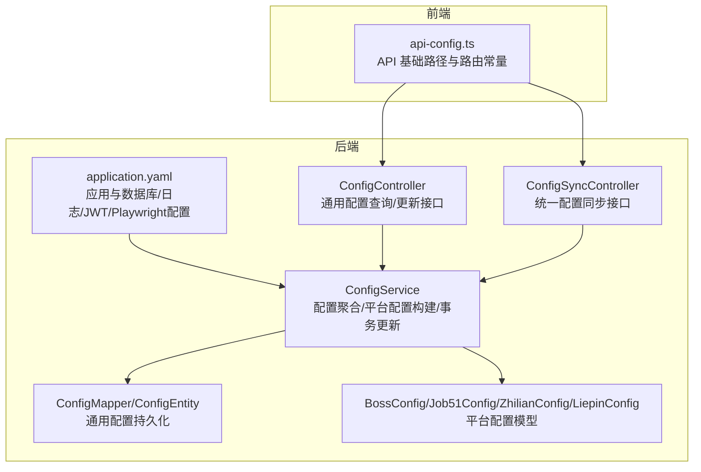
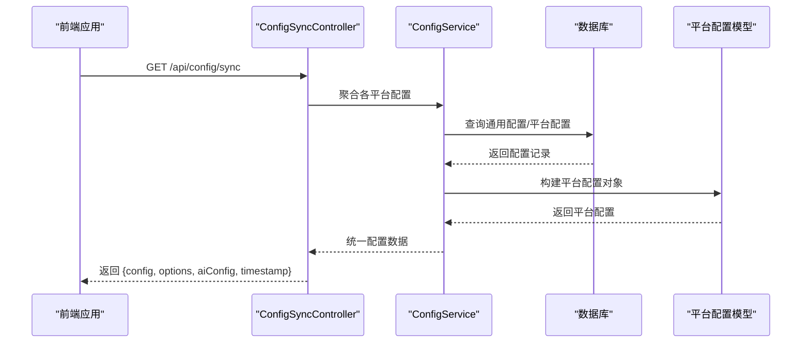
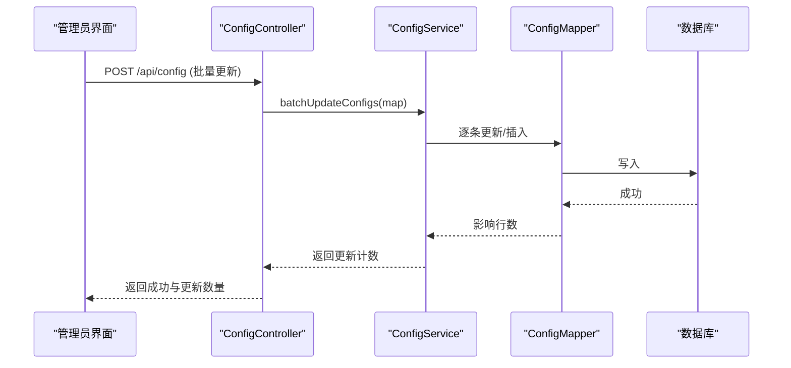
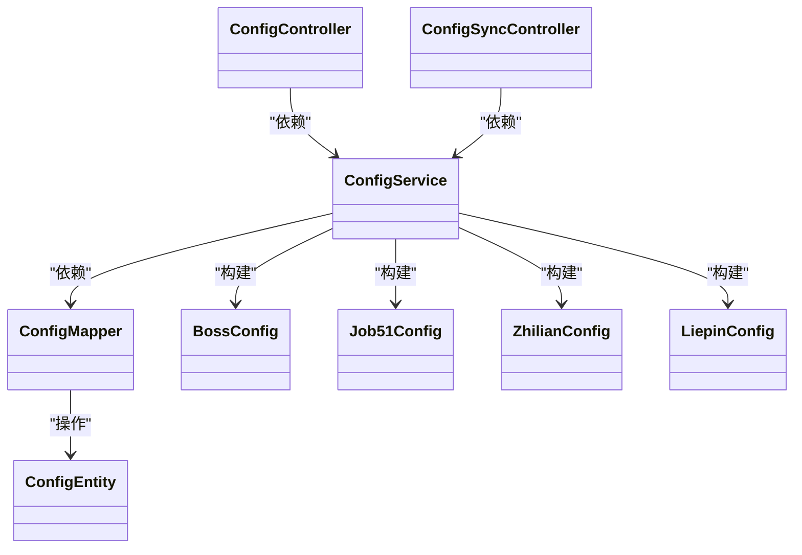

# 配置管理

<cite>
**本文引用的文件**
- [application.yaml](file://backend/src/main/resources/application.yaml)
- [ConfigController.java](file://backend/src/main/java/com/getjobs/application/controller/ConfigController.java)
- [ConfigSyncController.java](file://backend/src/main/java/com/getjobs/application/controller/ConfigSyncController.java)
- [ConfigService.java](file://backend/src/main/java/com/getjobs/application/service/ConfigService.java)
- [ConfigEntity.java](file://backend/src/main/java/com/getjobs/application/entity/ConfigEntity.java)
- [ConfigMapper.java](file://backend/src/main/java/com/getjobs/application/mapper/ConfigMapper.java)
- [BossConfig.java](file://backend/src/main/java/com/getjobs/worker/boss/BossConfig.java)
- [Job51Config.java](file://backend/src/main/java/com/getjobs/worker/job51/Job51Config.java)
- [ZhilianConfig.java](file://backend/src/main/java/com/getjobs/worker/zhilian/ZhilianConfig.java)
- [LiepinConfig.java](file://backend/src/main/java/com/getjobs/worker/liepin/LiepinConfig.java)
- [api-config.ts](file://front/lib/api-config.ts)
- [application.yaml.template](file://scripts/application.yaml.template)
</cite>

## 目录
1. [简介](#简介)
2. [项目结构](#项目结构)
3. [核心组件](#核心组件)
4. [架构总览](#架构总览)
5. [详细组件分析](#详细组件分析)
6. [依赖分析](#依赖分析)
7. [性能考虑](#性能考虑)
8. [故障排除指南](#故障排除指南)
9. [结论](#结论)
10. [附录](#附录)

## 简介
本文件面向系统管理员与运维工程师，系统化梳理 GetJobs 配置管理系统的结构与实现，覆盖以下主题：
- YAML 配置文件的结构与参数说明
- 环境变量注入与安全策略
- 动态配置同步与热更新机制
- 各招聘平台配置项的含义与最佳实践
- 配置模板使用、扩展与版本控制
- 配置校验、错误处理与回滚策略
- 生产环境配置最佳实践与故障排除

## 项目结构
GetJobs 的配置体系由后端 Spring Boot 应用的 YAML 配置、数据库配置表、平台专用配置类以及前端 API 路由构成。整体采用“集中式配置 + 平台解耦”的设计，既保证了统一管理，又便于扩展。

图表来源
- [application.yaml:1-91](file://backend/src/main/resources/application.yaml#L1-L91)
- [ConfigController.java:1-171](file://backend/src/main/java/com/getjobs/application/controller/ConfigController.java#L1-L171)
- [ConfigSyncController.java:1-111](file://backend/src/main/java/com/getjobs/application/controller/ConfigSyncController.java#L1-L111)
- [ConfigService.java:1-288](file://backend/src/main/java/com/getjobs/application/service/ConfigService.java#L1-L288)
- [ConfigEntity.java:1-66](file://backend/src/main/java/com/getjobs/application/entity/ConfigEntity.java#L1-L66)
- [BossConfig.java:1-107](file://backend/src/main/java/com/getjobs/worker/boss/BossConfig.java#L1-L107)
- [Job51Config.java:1-41](file://backend/src/main/java/com/getjobs/worker/job51/Job51Config.java#L1-L41)
- [ZhilianConfig.java:1-38](file://backend/src/main/java/com/getjobs/worker/zhilian/ZhilianConfig.java#L1-L38)
- [LiepinConfig.java:1-29](file://backend/src/main/java/com/getjobs/worker/liepin/LiepinConfig.java#L1-L29)
- [api-config.ts:1-99](file://front/lib/api-config.ts#L1-L99)

章节来源
- [application.yaml:1-91](file://backend/src/main/resources/application.yaml#L1-L91)
- [ConfigController.java:1-171](file://backend/src/main/java/com/getjobs/application/controller/ConfigController.java#L1-L171)
- [ConfigSyncController.java:1-111](file://backend/src/main/java/com/getjobs/application/controller/ConfigSyncController.java#L1-L111)
- [ConfigService.java:1-288](file://backend/src/main/java/com/getjobs/application/service/ConfigService.java#L1-L288)
- [ConfigEntity.java:1-66](file://backend/src/main/java/com/getjobs/application/entity/ConfigEntity.java#L1-L66)
- [BossConfig.java:1-107](file://backend/src/main/java/com/getjobs/worker/boss/BossConfig.java#L1-L107)
- [Job51Config.java:1-41](file://backend/src/main/java/com/getjobs/worker/job51/Job51Config.java#L1-L41)
- [ZhilianConfig.java:1-38](file://backend/src/main/java/com/getjobs/worker/zhilian/ZhilianConfig.java#L1-L38)
- [LiepinConfig.java:1-29](file://backend/src/main/java/com/getjobs/worker/liepin/LiepinConfig.java#L1-L29)
- [api-config.ts:1-99](file://front/lib/api-config.ts#L1-L99)

## 核心组件
- 配置存储层
  - 通用配置表：键值型配置，支持分类与描述，用于通用开关、令牌、基础参数等。
  - 平台配置表：各平台独立配置表，由 ConfigService 统一读取并转换为平台配置对象。
- 配置服务层
  - 提供通用配置查询、批量更新、必填校验、AI 配置聚合。
  - 提供平台配置构建：将数据库配置解析为平台专用对象（关键词、城市编码、薪资编码等）。
- 控制器层
  - 通用配置接口：查询全部、按键查询、批量更新、单键更新、健康检查。
  - 配置同步接口：向 Electron 客户端统一推送各平台配置与选项。
- 前端集成
  - API 常量集中管理，基于环境变量可替换后端地址，确保部署灵活性。

章节来源
- [ConfigEntity.java:1-66](file://backend/src/main/java/com/getjobs/application/entity/ConfigEntity.java#L1-L66)
- [ConfigMapper.java:1-13](file://backend/src/main/java/com/getjobs/application/mapper/ConfigMapper.java#L1-L13)
- [ConfigService.java:1-288](file://backend/src/main/java/com/getjobs/application/service/ConfigService.java#L1-L288)
- [ConfigController.java:1-171](file://backend/src/main/java/com/getjobs/application/controller/ConfigController.java#L1-L171)
- [ConfigSyncController.java:1-111](file://backend/src/main/java/com/getjobs/application/controller/ConfigSyncController.java#L1-L111)
- [api-config.ts:1-99](file://front/lib/api-config.ts#L1-L99)

## 架构总览
下图展示配置从存储到消费的全链路：YAML 初始化、数据库配置、服务聚合、控制器暴露、前端消费。

图表来源
- [ConfigSyncController.java:33-86](file://backend/src/main/java/com/getjobs/application/controller/ConfigSyncController.java#L33-L86)
- [ConfigService.java:38-87](file://backend/src/main/java/com/getjobs/application/service/ConfigService.java#L38-L87)
- [BossConfig.java:16-106](file://backend/src/main/java/com/getjobs/worker/boss/BossConfig.java#L16-L106)
- [Job51Config.java:14-40](file://backend/src/main/java/com/getjobs/worker/job51/Job51Config.java#L14-L40)
- [ZhilianConfig.java:13-37](file://backend/src/main/java/com/getjobs/worker/zhilian/ZhilianConfig.java#L13-L37)
- [LiepinConfig.java:12-28](file://backend/src/main/java/com/getjobs/worker/liepin/LiepinConfig.java#L12-L28)

## 详细组件分析

### YAML 配置文件结构与参数说明
- 应用与环境
  - spring.application.name：应用名称
  - spring.profiles.active：当前激活的 Profile
  - spring.info.app.*：应用元信息
  - spring.banner.*：启动横幅
- 数据源与连接池
  - spring.datasource.url/driver-class-name/username/password：数据库连接信息
  - spring.datasource.hikari.*：连接池参数（最大池大小、测试 SQL、空闲超时、最大生存时间）
- 输出与日志
  - spring.output.ansi.enabled：ANSI 输出控制
  - logging.level.root/pattern.console/file/logback.*：日志级别、控制台格式、文件输出与滚动策略
- 服务器
  - server.port：后端 API 固定端口
- MyBatis-Plus
  - mybatis-plus.configuration.*：命名策略与 Banner
  - mybatis-plus.global-config.db-config.id-type：主键策略
  - mybatis-plus.mapper-locations：Mapper XML 位置
- 后台管理 JWT
  - admin.jwt.secret（支持环境变量注入）：密钥（默认值仅示例）
  - admin.jwt.expiration/issuer：过期时间与签发者
- Playwright Agent
  - playwright.slow-mo、navigation-timeout、login-check-interval：性能与稳定性参数
  - playwright.platforms.*.navigation-timeout：平台差异化超时
  - playwright.max-retries、retry-base-delay、retry-max-delay：重试策略
  - playwright.health-check-interval：浏览器健康检查
  - playwright.max-pages、idle-page-timeout：资源管理
  - playwright.resource-blocking-enabled：请求拦截开关
  - playwright.cookie-refresh-before-expiry：Cookie 刷新阈值

章节来源
- [application.yaml:1-91](file://backend/src/main/resources/application.yaml#L1-L91)

### 环境变量配置与安全管理
- 环境变量注入点
  - ADMIN_JWT_SECRET：后台管理 JWT 密钥（优先于 YAML 默认值）
- 安全建议
  - 将敏感参数（数据库密码、JWT 密钥、第三方 API Key）置于环境变量，避免硬编码入仓库
  - 使用只读权限的数据库账号，限制连接数与访问范围
  - 对日志输出进行脱敏，避免打印敏感字段
  - 在 CI/CD 中使用受控的密钥管理服务注入环境变量

章节来源
- [application.yaml:54-58](file://backend/src/main/resources/application.yaml#L54-L58)

### 动态配置同步机制与热更新
- 同步接口
  - ConfigSyncController 提供统一配置同步端点，返回各平台配置、选项与 AI 配置，并附带时间戳
- 热更新流程
  - ConfigController 支持批量更新与单键更新，均在事务内执行，更新后立即生效
  - ConfigService 在构建平台配置时直接读取最新数据库记录，无需重启即可热更新
- 前端集成
  - api-config.ts 通过环境变量 API_BASE_URL 指向后端，便于在不同环境切换

图表来源
- [ConfigController.java:86-112](file://backend/src/main/java/com/getjobs/application/controller/ConfigController.java#L86-L112)
- [ConfigService.java:131-165](file://backend/src/main/java/com/getjobs/application/service/ConfigService.java#L131-L165)
- [ConfigMapper.java:1-13](file://backend/src/main/java/com/getjobs/application/mapper/ConfigMapper.java#L1-L13)

章节来源
- [ConfigSyncController.java:33-86](file://backend/src/main/java/com/getjobs/application/controller/ConfigSyncController.java#L33-L86)
- [ConfigController.java:86-112](file://backend/src/main/java/com/getjobs/application/controller/ConfigController.java#L86-L112)
- [ConfigService.java:131-165](file://backend/src/main/java/com/getjobs/application/service/ConfigService.java#L131-L165)
- [api-config.ts:4-5](file://front/lib/api-config.ts#L4-L5)

### 各招聘平台配置项含义与最佳实践
- Boss 直聘
  - 关键词、城市编码、行业、经验、工作类型、薪资、学历、公司规模/融资阶段、是否启用 AI、是否过滤不活跃 HR、是否发送图片简历、目标薪资、等待时间、HR 不在线状态等
  - 最佳实践：关键词建议使用精确短语；城市编码优先使用标准代码；薪资与学历按目标岗位设定合理区间
- 前程无忧
  - 关键词、工作地区、薪资范围
  - 最佳实践：地区与薪资建议结合市场行情；关键词避免过于宽泛导致无效投递
- 智联招聘
  - 关键词、城市编码、薪资范围
  - 最佳实践：城市编码优先使用官方代码；薪资范围建议与期望一致
- 猎聘
  - 关键词、城市编码、薪资范围
  - 最佳实践：高潜岗位建议缩小地区与薪资范围；关键词聚焦核心技能

章节来源
- [BossConfig.java:16-106](file://backend/src/main/java/com/getjobs/worker/boss/BossConfig.java#L16-L106)
- [Job51Config.java:14-40](file://backend/src/main/java/com/getjobs/worker/job51/Job51Config.java#L14-L40)
- [ZhilianConfig.java:13-37](file://backend/src/main/java/com/getjobs/worker/zhilian/ZhilianConfig.java#L13-L37)
- [LiepinConfig.java:12-28](file://backend/src/main/java/com/getjobs/worker/liepin/LiepinConfig.java#L12-L28)

### 配置模板使用与扩展指南
- 模板文件
  - scripts/application.yaml.template：提供标准化的 YAML 模板，便于复制与定制
- 使用步骤
  - 复制模板为 application.yaml
  - 根据部署环境填写数据库、JWT 密钥、日志路径等
  - 通过环境变量覆盖敏感参数
- 扩展建议
  - 新增通用配置键时，建议同时维护分类与描述字段，便于审计与检索
  - 平台新增配置项时，在对应平台配置类中添加字段，并在 ConfigService 中补充解析逻辑

章节来源
- [application.yaml.template](file://scripts/application.yaml.template)
- [application.yaml:1-91](file://backend/src/main/resources/application.yaml#L1-L91)
- [ConfigService.java:217-265](file://backend/src/main/java/com/getjobs/application/service/ConfigService.java#L217-L265)

### 配置验证、错误处理与回滚机制
- 必填校验
  - requireConfigValue：当配置缺失或空白时抛出异常，调用方可据此降级或提示
- AI 配置聚合
  - getAiConfigs：聚合 BASE_URL/API_KEY/MODEL，缺失时返回空字符串并记录告警
- 批量更新
  - batchUpdateConfigs：逐条更新或自动创建，事务内执行，失败不影响已成功项
- 单键更新
  - updateConfig：存在即更新，不存在返回失败，便于前端提示
- 建议的回滚策略
  - 在批量更新前记录快照键集合，失败时根据集合回滚至上次成功状态
  - 对关键配置（如 JWT 密钥、数据库凭据）变更采用灰度发布与双写校验

章节来源
- [ConfigService.java:95-124](file://backend/src/main/java/com/getjobs/application/service/ConfigService.java#L95-L124)
- [ConfigService.java:131-191](file://backend/src/main/java/com/getjobs/application/service/ConfigService.java#L131-L191)

### 生产环境配置最佳实践
- 环境隔离
  - 使用 profiles 区分 dev/staging/prod，生产环境严格禁用调试与过宽的日志级别
- 数据库与连接池
  - 合理设置最大连接数与超时，开启连接测试 SQL，监控连接池健康
- 日志与监控
  - 控制台输出精简，文件输出按天滚动，保留历史天数适中
- 安全加固
  - 敏感参数全部来自环境变量；对 API 接口增加鉴权与限流
- 配置热更新
  - 通过统一接口进行批量更新，避免直接改数据库；更新后验证关键功能可用性

章节来源
- [application.yaml:1-91](file://backend/src/main/resources/application.yaml#L1-L91)
- [ConfigController.java:86-112](file://backend/src/main/java/com/getjobs/application/controller/ConfigController.java#L86-L112)

## 依赖分析
- 组件耦合
  - ConfigController/ConfigSyncController 依赖 ConfigService
  - ConfigService 依赖 ConfigMapper 与各平台服务，负责跨表聚合
  - 平台配置类为纯数据模型，被 ConfigService 构建
- 外部依赖
  - Spring Boot、MyBatis-Plus、MySQL/HikariCP、Logback
- 潜在风险
  - 平台配置解析依赖数据库字典（如城市/薪资映射），需确保字典表完整性
  - 批量更新事务边界明确，避免部分失败造成状态不一致

图表来源
- [ConfigController.java:1-171](file://backend/src/main/java/com/getjobs/application/controller/ConfigController.java#L1-L171)
- [ConfigSyncController.java:1-111](file://backend/src/main/java/com/getjobs/application/controller/ConfigSyncController.java#L1-L111)
- [ConfigService.java:1-288](file://backend/src/main/java/com/getjobs/application/service/ConfigService.java#L1-L288)
- [ConfigMapper.java:1-13](file://backend/src/main/java/com/getjobs/application/mapper/ConfigMapper.java#L1-L13)
- [ConfigEntity.java:1-66](file://backend/src/main/java/com/getjobs/application/entity/ConfigEntity.java#L1-L66)
- [BossConfig.java:1-107](file://backend/src/main/java/com/getjobs/worker/boss/BossConfig.java#L1-L107)
- [Job51Config.java:1-41](file://backend/src/main/java/com/getjobs/worker/job51/Job51Config.java#L1-L41)
- [ZhilianConfig.java:1-38](file://backend/src/main/java/com/getjobs/worker/zhilian/ZhilianConfig.java#L1-L38)
- [LiepinConfig.java:1-29](file://backend/src/main/java/com/getjobs/worker/liepin/LiepinConfig.java#L1-L29)

## 性能考虑
- 连接池与超时
  - 合理设置最大连接数与空闲/最大生存时间，避免连接抖动
  - 导航超时按平台差异配置，兼顾稳定性与效率
- 重试与健康检查
  - 适度的重试次数与退避策略，避免雪崩
  - 定期健康检查与空闲页面回收，降低资源占用
- 日志滚动
  - 控制单文件大小与历史天数，平衡磁盘占用与排查成本

章节来源
- [application.yaml:18-22](file://backend/src/main/resources/application.yaml#L18-L22)
- [application.yaml:63-87](file://backend/src/main/resources/application.yaml#L63-L87)

## 故障排除指南
- 无法获取配置
  - 检查 ConfigController/ConfigSyncController 健康端点与数据库连通性
  - 查看 ConfigService 的 requireConfigValue 抛错定位缺失项
- 更新失败
  - 确认请求体格式与键名正确；查看批量更新返回的更新计数
  - 若出现部分失败，按回滚策略恢复
- 平台配置异常
  - 校验城市/薪资编码映射是否有效；确认数据库字典表完整
- 日志与性能
  - 检查日志滚动策略与文件权限；关注连接池指标与超时统计

章节来源
- [ConfigController.java:160-169](file://backend/src/main/java/com/getjobs/application/controller/ConfigController.java#L160-L169)
- [ConfigSyncController.java:80-85](file://backend/src/main/java/com/getjobs/application/controller/ConfigSyncController.java#L80-L85)
- [ConfigService.java:95-101](file://backend/src/main/java/com/getjobs/application/service/ConfigService.java#L95-L101)
- [application.yaml:38-42](file://backend/src/main/resources/application.yaml#L38-L42)

## 结论
GetJobs 的配置管理体系以 YAML 为基础、数据库为载体、服务层为中枢、控制器为出口、前端为入口，实现了统一、可扩展、可热更新的配置能力。通过严格的环境变量注入与最小权限原则，配合完善的校验与回滚策略，可在生产环境中稳定运行并快速迭代。

## 附录
- 前端 API 基础路径
  - 基于环境变量 API_BASE_URL，默认 http://localhost:18888
  - 通用配置与同步接口路径在 api-config.ts 中集中定义

章节来源
- [api-config.ts:4-99](file://front/lib/api-config.ts#L4-L99)