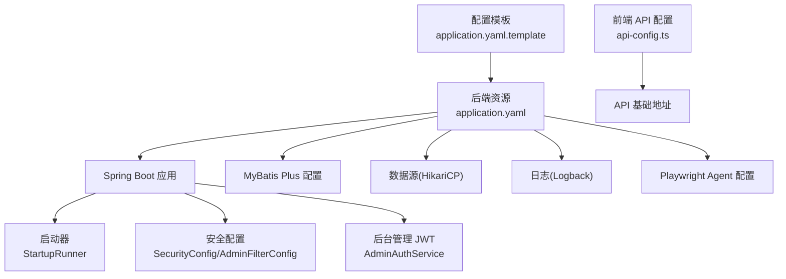
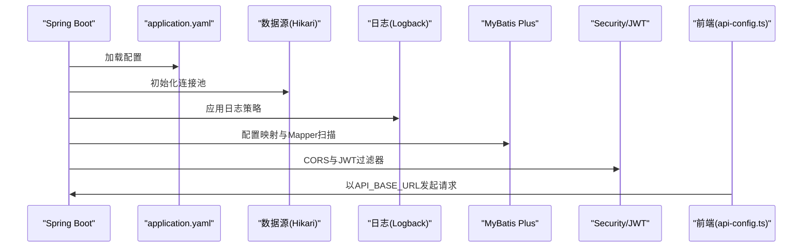
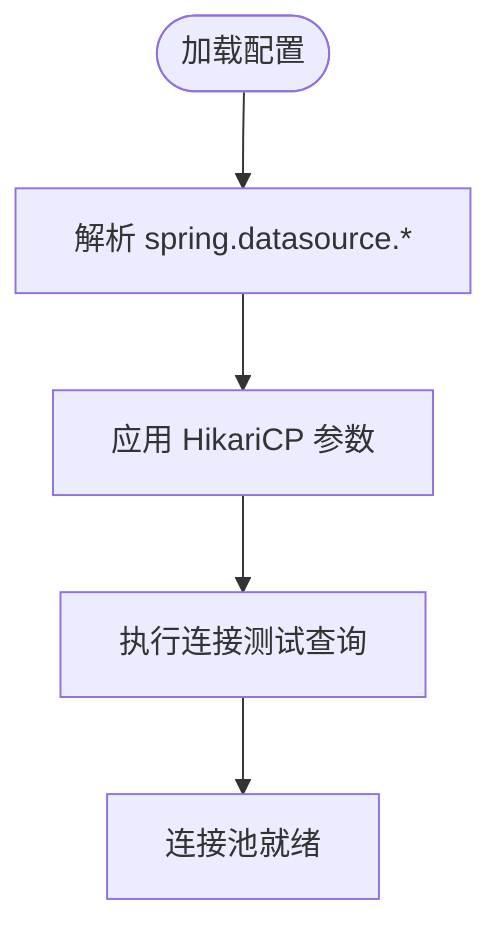
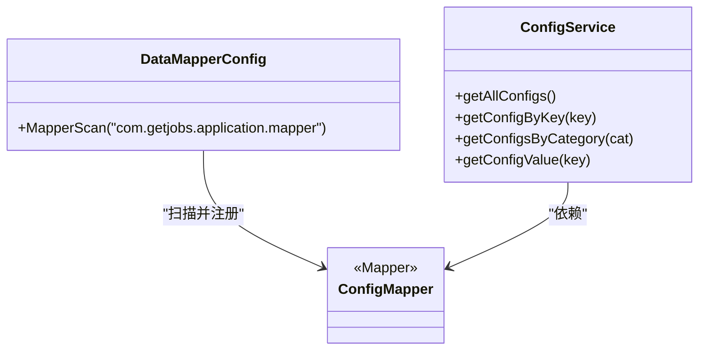
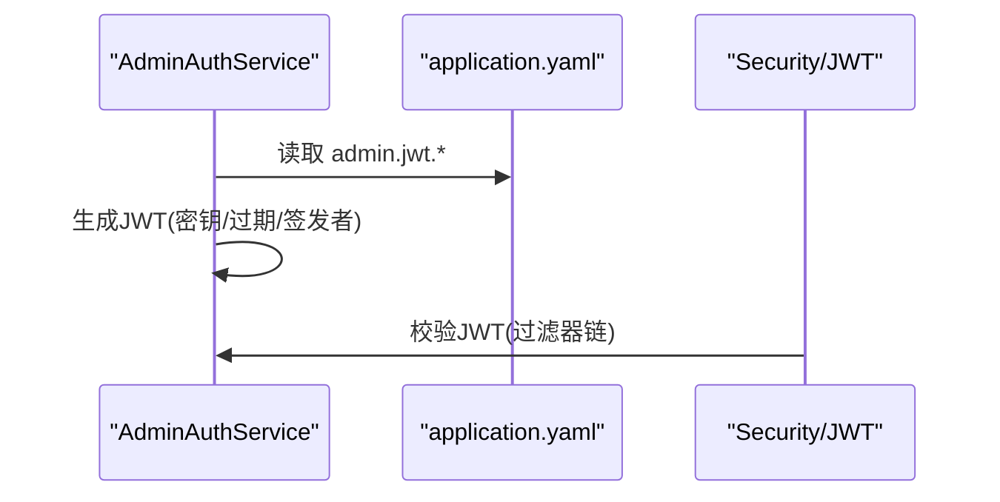
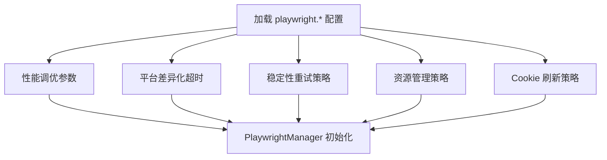
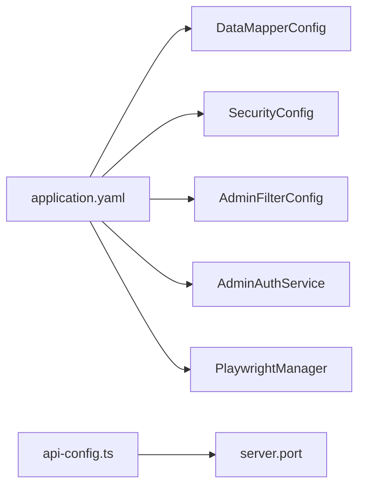

# 静态配置文件

<cite>
**本文引用的文件**
- [application.yaml](file://backend/src/main/resources/application.yaml)
- [application.yaml.template](file://scripts/application.yaml.template)
- [DataMapperConfig.java](file://backend/src/main/java/com/getjobs/application/config/DataMapperConfig.java)
- [SecurityConfig.java](file://backend/src/main/java/com/getjobs/application/config/SecurityConfig.java)
- [AdminFilterConfig.java](file://backend/src/main/java/com/getjobs/application/config/AdminFilterConfig.java)
- [AdminAuthService.java](file://backend/src/main/java/com/getjobs/application/service/AdminAuthService.java)
- [ConfigService.java](file://backend/src/main/java/com/getjobs/application/service/ConfigService.java)
- [ConfigMapper.java](file://backend/src/main/java/com/getjobs/application/mapper/ConfigMapper.java)
- [StartupRunner.java](file://backend/src/main/java/com/getjobs/application/config/StartupRunner.java)
- [PlaywrightManager.java](file://backend/src/main/java/com/getjobs/worker/manager/PlaywrightManager.java)
- [PlaywrightUtil.java](file://backend/src/main/java/com/getjobs/worker/utils/PlaywrightUtil.java)
- [api-config.ts](file://front/lib/api-config.ts)
</cite>

## 目录
1. [简介](#简介)
2. [项目结构](#项目结构)
3. [核心组件](#核心组件)
4. [架构总览](#架构总览)
5. [详细组件分析](#详细组件分析)
6. [依赖关系分析](#依赖关系分析)
7. [性能考量](#性能考量)
8. [故障排查指南](#故障排查指南)
9. [结论](#结论)
10. [附录](#附录)

## 简介
本文件系统围绕 GetJobs 的静态配置文件 application.yaml 展开，全面解析其整体结构与各配置模块的作用，重点覆盖数据库连接、服务器、日志、MyBatis Plus、后台管理 JWT、Playwright Agent 等核心配置项。同时阐述环境变量的使用方式与占位符替换机制，给出配置模板的使用方法与多环境配置示例，并解释配置验证规则与错误处理机制，最后提供配置版本管理与变更追踪建议。

## 项目结构
静态配置文件位于后端资源目录，配合前端 API 配置与模板文件共同构成完整的配置体系：
- 后端资源：application.yaml（运行时配置）、banner.txt（启动横幅）
- 配置模板：scripts/application.yaml.template（标准化模板）
- 前端 API 配置：front/lib/api-config.ts（基于环境变量的 API 基础地址）
- 启动辅助：StartupRunner.java（应用启动后自动打开管理页面）

**图表来源**
- [application.yaml:1-91](file://backend/src/main/resources/application.yaml#L1-L91)
- [application.yaml.template:1-90](file://scripts/application.yaml.template#L1-L90)
- [api-config.ts:1-99](file://front/lib/api-config.ts#L1-L99)
- [StartupRunner.java:1-155](file://backend/src/main/java/com/getjobs/application/config/StartupRunner.java#L1-L155)

**章节来源**
- [application.yaml:1-91](file://backend/src/main/resources/application.yaml#L1-L91)
- [application.yaml.template:1-90](file://scripts/application.yaml.template#L1-L90)
- [api-config.ts:1-99](file://front/lib/api-config.ts#L1-L99)
- [StartupRunner.java:1-155](file://backend/src/main/java/com/getjobs/application/config/StartupRunner.java#L1-L155)

## 核心组件
- 数据源与连接池：通过 spring.datasource 与 hikari 子配置定义 JDBC URL、驱动、用户名、密码以及连接池参数（最大连接数、空闲超时、最大生命周期、连接测试语句）。
- 服务器配置：server.port 定义后端 API 监听端口。
- 日志配置：logging.level、pattern.console、file.name、logback.rollingpolicy 控制日志级别、控制台格式、文件路径与滚动策略。
- MyBatis Plus：mybatis-plus.configuration、global-config、mapper-locations 定义驼峰映射、Banner 开关、主键策略与 Mapper XML 位置。
- 后台管理 JWT：admin.jwt.* 定义密钥、过期时间与签发者。
- Playwright Agent：playwright.* 提供性能调优、平台差异化超时、稳定性重试、资源管理与 Cookie 管理等配置。

**章节来源**
- [application.yaml:13-91](file://backend/src/main/resources/application.yaml#L13-L91)

## 架构总览
静态配置文件作为 Spring Boot 的外部化配置入口，贯穿以下关键链路：
- 启动阶段：Spring Boot 加载 application.yaml，解析数据源、日志、MyBatis Plus、Playwright 等配置。
- 运行阶段：SecurityConfig/AdminFilterConfig 配置 CORS 与 JWT 过滤；AdminAuthService 读取 admin.jwt.*；ConfigService/ConfigMapper 读取数据库配置。
- 前端交互：api-config.ts 从环境变量读取 API 基础地址，统一拼装后端 API 路由。

**图表来源**
- [application.yaml:1-91](file://backend/src/main/resources/application.yaml#L1-L91)
- [SecurityConfig.java:1-68](file://backend/src/main/java/com/getjobs/application/config/SecurityConfig.java#L1-L68)
- [AdminFilterConfig.java:1-28](file://backend/src/main/java/com/getjobs/application/config/AdminFilterConfig.java#L1-L28)
- [AdminAuthService.java:1-44](file://backend/src/main/java/com/getjobs/application/service/AdminAuthService.java#L1-L44)
- [DataMapperConfig.java:1-13](file://backend/src/main/java/com/getjobs/application/config/DataMapperConfig.java#L1-L13)
- [api-config.ts:1-99](file://front/lib/api-config.ts#L1-L99)

## 详细组件分析

### 数据库连接与 HikariCP
- 关键点
  - JDBC URL、驱动类名、用户名、密码
  - 连接池参数：maximum-pool-size、idle-timeout、max-lifetime、connection-test-query
- 影响范围
  - 影响 MyBatis Plus 的数据访问性能与稳定性
  - 影响应用启动与运行时的数据库并发能力

**图表来源**
- [application.yaml:13-22](file://backend/src/main/resources/application.yaml#L13-L22)

**章节来源**
- [application.yaml:13-22](file://backend/src/main/resources/application.yaml#L13-L22)

### 服务器与端口
- 关键点
  - server.port 固定后端 API 端口
- 影响范围
  - 前端 api-config.ts 以该端口拼接 API 基础地址
  - 启动器 StartupRunner 依据该端口判断后端静态资源访问

**章节来源**
- [application.yaml:28-29](file://backend/src/main/resources/application.yaml#L28-L29)
- [api-config.ts:4-4](file://front/lib/api-config.ts#L4-L4)
- [StartupRunner.java:23-27](file://backend/src/main/java/com/getjobs/application/config/StartupRunner.java#L23-L27)

### 日志与滚动策略
- 关键点
  - logging.level.root 控制根日志级别
  - pattern.console 控制控制台输出格式
  - file.name 指定日志文件路径
  - logback.rollingpolicy.max-history、max-file-size 控制日志滚动
- 影响范围
  - 影响运维可观测性与磁盘占用

**章节来源**
- [application.yaml:32-42](file://backend/src/main/resources/application.yaml#L32-L42)

### MyBatis Plus 配置
- 关键点
  - configuration.map-underscore-to-camel-case：开启下划线到驼峰映射
  - global-config.banner：启用启动 Banner
  - global-config.db-config.id-type：主键策略
  - mapper-locations：Mapper XML 扫描路径
- 影响范围
  - 影响实体与数据库字段映射一致性与 SQL 映射加载

**图表来源**
- [DataMapperConfig.java:1-13](file://backend/src/main/java/com/getjobs/application/config/DataMapperConfig.java#L1-L13)
- [ConfigMapper.java:1-12](file://backend/src/main/java/com/getjobs/application/mapper/ConfigMapper.java#L1-L12)
- [ConfigService.java:42-87](file://backend/src/main/java/com/getjobs/application/service/ConfigService.java#L42-L87)

**章节来源**
- [application.yaml:44-51](file://backend/src/main/resources/application.yaml#L44-L51)
- [DataMapperConfig.java:1-13](file://backend/src/main/java/com/getjobs/application/config/DataMapperConfig.java#L1-L13)
- [ConfigService.java:42-87](file://backend/src/main/java/com/getjobs/application/service/ConfigService.java#L42-L87)
- [ConfigMapper.java:1-12](file://backend/src/main/java/com/getjobs/application/mapper/ConfigMapper.java#L1-L12)

### 后台管理 JWT 配置
- 关键点
  - admin.jwt.secret：JWT 密钥（支持环境变量占位符）
  - admin.jwt.expiration：过期时间（毫秒）
  - admin.jwt.issuer：签发者
- 影响范围
  - AdminAuthService 读取上述配置生成与校验令牌

**图表来源**
- [AdminAuthService.java:29-36](file://backend/src/main/java/com/getjobs/application/service/AdminAuthService.java#L29-L36)
- [application.yaml:54-58](file://backend/src/main/resources/application.yaml#L54-L58)
- [SecurityConfig.java:24-44](file://backend/src/main/java/com/getjobs/application/config/SecurityConfig.java#L24-L44)
- [AdminFilterConfig.java:18-26](file://backend/src/main/java/com/getjobs/application/config/AdminFilterConfig.java#L18-L26)

**章节来源**
- [application.yaml:54-58](file://backend/src/main/resources/application.yaml#L54-L58)
- [AdminAuthService.java:29-36](file://backend/src/main/java/com/getjobs/application/service/AdminAuthService.java#L29-L36)
- [SecurityConfig.java:24-44](file://backend/src/main/java/com/getjobs/application/config/SecurityConfig.java#L24-L44)
- [AdminFilterConfig.java:18-26](file://backend/src/main/java/com/getjobs/application/config/AdminFilterConfig.java#L18-L26)

### Playwright Agent 配置
- 关键点
  - 性能调优：slow-mo、navigation-timeout、login-check-interval
  - 平台差异化：各平台 navigation-timeout 差异
  - 稳定性：max-retries、retry-base-delay、retry-max-delay、health-check-interval
  - 资源管理：max-pages、idle-page-timeout、resource-blocking-enabled
  - Cookie 管理：cookie-refresh-before-expiry
- 影响范围
  - PlaywrightManager/PlaywrightUtil 依据配置初始化浏览器与页面池，影响自动化稳定性与资源占用

**图表来源**
- [application.yaml:60-91](file://backend/src/main/resources/application.yaml#L60-L91)
- [PlaywrightManager.java:114-1694](file://backend/src/main/java/com/getjobs/worker/manager/PlaywrightManager.java#L114-L1694)
- [PlaywrightUtil.java:44-70](file://backend/src/main/java/com/getjobs/worker/utils/PlaywrightUtil.java#L44-L70)

**章节来源**
- [application.yaml:60-91](file://backend/src/main/resources/application.yaml#L60-L91)
- [PlaywrightManager.java:114-1694](file://backend/src/main/java/com/getjobs/worker/manager/PlaywrightManager.java#L114-L1694)
- [PlaywrightUtil.java:44-70](file://backend/src/main/java/com/getjobs/worker/utils/PlaywrightUtil.java#L44-L70)

### 配置模板与多环境实践
- application.yaml.template 提供标准化注释与默认值，建议复制为 application.yaml 并按环境修改
- 建议的多环境划分
  - 开发(dev)：本地数据库、较低日志级别、调试友好参数
  - 测试(test)：独立测试库、适度日志、稳定超时
  - 生产(prod)：生产数据库、严格日志级别、稳健超时与资源限制
- 环境隔离策略
  - 使用环境变量覆盖敏感配置（如 admin.jwt.secret）
  - 不同环境放置不同的 application.yaml 或通过 Spring Profiles 切换

**章节来源**
- [application.yaml.template:1-90](file://scripts/application.yaml.template#L1-L90)
- [application.yaml:4-5](file://backend/src/main/resources/application.yaml#L4-L5)

### 环境变量与占位符替换机制
- 占位符语法：${ENV_VAR:defaultValue}
- 典型用法
  - admin.jwt.secret: ${ADMIN_JWT_SECRET:默认密钥}
- 注意事项
  - 确保敏感信息不硬编码在仓库中
  - 在 CI/CD 中注入环境变量，确保不同环境一致生效

**章节来源**
- [application.yaml:56-56](file://backend/src/main/resources/application.yaml#L56-L56)

### 配置验证规则与错误处理
- 配置验证
  - 数据库连接：通过 connection-test-query 验证连接有效性
  - 日志配置：检查 file.name 与滚动策略，避免磁盘耗尽
  - MyBatis Plus：mapper-locations 必须指向有效 XML 路径
  - Playwright：Chromium 路径与启动参数需正确
- 错误处理
  - StartupRunner 在 Playwright 初始化失败时记录错误并抛出异常
  - SecurityConfig 禁用 CSRF 与表单登录，使用自定义 JWT 过滤器

**章节来源**
- [application.yaml:18-22](file://backend/src/main/resources/application.yaml#L18-L22)
- [StartupRunner.java:42-46](file://backend/src/main/java/com/getjobs/application/config/StartupRunner.java#L42-L46)
- [SecurityConfig.java:24-44](file://backend/src/main/java/com/getjobs/application/config/SecurityConfig.java#L24-L44)

### 配置安全管理与敏感信息保护
- 敏感信息保护
  - 使用环境变量覆盖 admin.jwt.secret 等敏感字段
  - 不将 application.yaml 提交至版本控制
- 环境隔离
  - 不同环境使用独立的 application.yaml 或 Profiles
  - 在容器/CI/CD 中注入环境变量

**章节来源**
- [application.yaml:56-56](file://backend/src/main/resources/application.yaml#L56-L56)

### 配置模板使用方法与示例
- 使用步骤
  - 复制 application.yaml.template 为 application.yaml
  - 修改数据库连接、日志、MyBatis Plus、Playwright 等配置
  - 放置于后端资源目录或通过 Spring Boot 的配置搜索路径
- 示例要点
  - 数据库：JDBC URL、用户名、密码、连接池参数
  - 日志：文件路径、保留天数、单文件大小
  - MyBatis Plus：Mapper XML 位置、主键策略
  - Playwright：导航超时、重试策略、页面池大小

**章节来源**
- [application.yaml.template:1-90](file://scripts/application.yaml.template#L1-L90)

### 配置版本管理与变更追踪
- 版本管理建议
  - 使用 Git 管理 application.yaml 的演进，每个重要变更提交一次
  - 对敏感配置使用 .gitignore 或外部密钥管理
- 变更追踪
  - 在提交信息中明确描述配置变更内容与影响范围
  - 通过分支策略区分 dev/test/prod 的配置差异

[本节为通用实践建议，无需特定文件引用]

## 依赖关系分析
- 配置对组件的耦合
  - application.yaml 直接驱动 DataMapperConfig、SecurityConfig、AdminFilterConfig、AdminAuthService、PlaywrightManager 等
  - api-config.ts 依赖 server.port 与环境变量
- 外部依赖
  - HikariCP、Logback、MyBatis Plus、Playwright、Spring Security

**图表来源**
- [application.yaml:1-91](file://backend/src/main/resources/application.yaml#L1-L91)
- [DataMapperConfig.java:1-13](file://backend/src/main/java/com/getjobs/application/config/DataMapperConfig.java#L1-L13)
- [SecurityConfig.java:1-68](file://backend/src/main/java/com/getjobs/application/config/SecurityConfig.java#L1-L68)
- [AdminFilterConfig.java:1-28](file://backend/src/main/java/com/getjobs/application/config/AdminFilterConfig.java#L1-L28)
- [AdminAuthService.java:1-44](file://backend/src/main/java/com/getjobs/application/service/AdminAuthService.java#L1-L44)
- [PlaywrightManager.java:114-1694](file://backend/src/main/java/com/getjobs/worker/manager/PlaywrightManager.java#L114-L1694)
- [api-config.ts:1-99](file://front/lib/api-config.ts#L1-L99)

**章节来源**
- [application.yaml:1-91](file://backend/src/main/resources/application.yaml#L1-L91)
- [api-config.ts:1-99](file://front/lib/api-config.ts#L1-L99)

## 性能考量
- 数据库连接池
  - 合理设置 maximum-pool-size，避免过高导致数据库压力过大
  - idle-timeout 与 max-lifetime 控制连接生命周期，平衡资源占用与创建成本
- 日志
  - 控制文件大小与保留天数，避免磁盘 IO 抖动
- MyBatis Plus
  - 启用驼峰映射提升开发体验，但注意字段命名规范
- Playwright
  - slow-mo 与 navigation-timeout 影响自动化效率与稳定性
  - max-pages 与 idle-page-timeout 控制页面池规模与内存占用

[本节为通用性能建议，无需特定文件引用]

## 故障排查指南
- 启动失败
  - 检查数据库连接参数与网络连通性
  - 查看日志文件与滚动策略是否正常
- JWT 认证失败
  - 核对 admin.jwt.secret、expiration、issuer 配置
  - 确认前端与后端密钥一致
- Playwright 初始化失败
  - 检查 Chromium 路径与安装状态
  - 关注 StartupRunner 的错误日志

**章节来源**
- [StartupRunner.java:42-46](file://backend/src/main/java/com/getjobs/application/config/StartupRunner.java#L42-L46)
- [PlaywrightManager.java:122-135](file://backend/src/main/java/com/getjobs/worker/manager/PlaywrightManager.java#L122-L135)

## 结论
application.yaml 是 GetJobs 配置体系的核心，涵盖数据源、服务器、日志、MyBatis Plus、JWT 与 Playwright Agent 等关键模块。通过合理的多环境配置、环境变量占位符与严格的敏感信息保护策略，可以实现安全、稳定、可维护的部署。建议结合模板文件与版本管理流程，持续优化配置并完善变更追踪。

## 附录
- 前端 API 基础地址来源：process.env.API_BASE_URL，默认指向后端 server.port
- 启动器逻辑：优先打开前端服务，其次打开后端静态资源，最后初始化 Playwright

**章节来源**
- [api-config.ts:4-4](file://front/lib/api-config.ts#L4-L4)
- [StartupRunner.java:32-68](file://backend/src/main/java/com/getjobs/application/config/StartupRunner.java#L32-L68)
- [PlaywrightManager.java:114-1694](file://backend/src/main/java/com/getjobs/worker/manager/PlaywrightManager.java#L114-L1694)