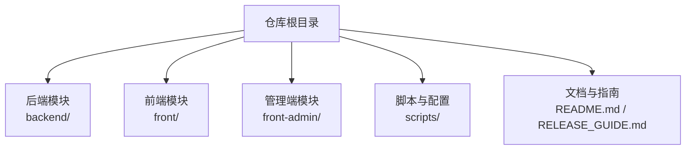
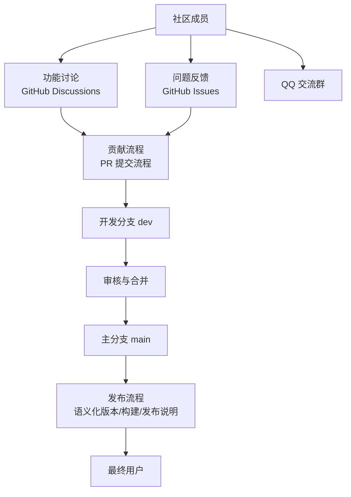
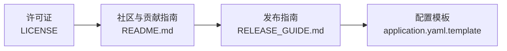
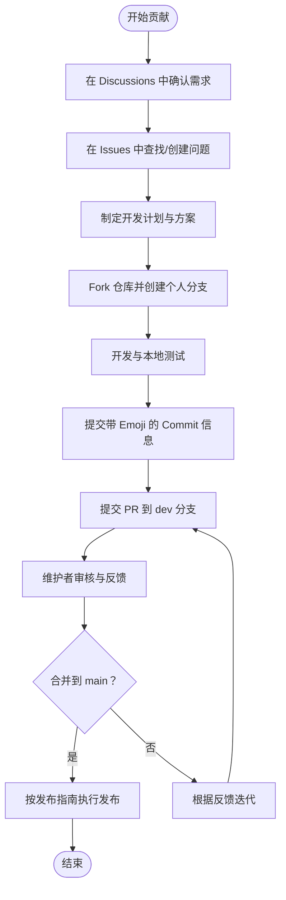

# 开源协议与社区

<cite>
**本文引用的文件**
- [LICENSE](file://LICENSE)
- [README.md](file://README.md)
- [RELEASE_GUIDE.md](file://RELEASE_GUIDE.md)
- [backend/README.md](file://backend/README.md)
- [scripts/application.yaml.template](file://scripts/application.yaml.template)
</cite>

## 目录
1. [简介](#简介)
2. [项目结构](#项目结构)
3. [核心组件](#核心组件)
4. [架构总览](#架构总览)
5. [详细组件分析](#详细组件分析)
6. [依赖关系分析](#依赖关系分析)
7. [性能考量](#性能考量)
8. [故障排查指南](#故障排查指南)
9. [结论](#结论)
10. [附录](#附录)

## 简介
本指南面向 GetJobs 项目的开源协议与社区参与，重点说明以下内容：
- 项目采用的非商业许可条款与商业化限制范围
- 社区建设与沟通渠道（QQ 群、GitHub Discussions、问题反馈）
- 贡献流程与规范（Issue 提交、PR 提交流程、代码风格、测试标准）
- 治理结构与决策机制（功能讨论、投票方式）
- 里程碑与版本发布策略、更新日志维护
- 社区行为准则与沟通礼仪
- 致谢与贡献者认可方式

## 项目结构
- 本仓库包含后端（Spring Boot）、前端（Next.js）、管理端（Next.js）、脚本与配置等模块。社区与协议相关内容主要集中在根目录的 README 与 LICENSE 文件，以及发布与配置模板文件。

图表来源
- [README.md](file://README.md)
- [RELEASE_GUIDE.md](file://RELEASE_GUIDE.md)

章节来源
- [README.md](file://README.md)
- [RELEASE_GUIDE.md](file://RELEASE_GUIDE.md)

## 核心组件
- 开源协议与许可：项目采用非商业许可（GETJOBS-NC-1.0），明确禁止商业用途，保留作者独占商业权利，并要求在再分发时保留版权与署名。
- 社区与沟通：提供 QQ 群、GitHub Issues/Discussions、问题反馈渠道；强调贡献前需沟通，避免未经沟通的 PR。
- 贡献与发布：提供 PR 提交流程（fork → dev 分支 → 带 Emoji 的提交信息 → 审核合并），并提供发布指南（语义化版本、构建测试、自动发布、发布说明模板、发布后验证）。

章节来源
- [LICENSE](file://LICENSE)
- [README.md](file://README.md)
- [RELEASE_GUIDE.md](file://RELEASE_GUIDE.md)

## 架构总览
本节以概念性视角展示社区与治理的交互关系，帮助理解贡献流程与发布策略的衔接。

## 详细组件分析

### 组件一：开源协议与商业化限制
- 许可类型：非商业许可（GETJOBS-NC-1.0）
- 禁止商业用途范围（示例性列举，具体以许可证为准）：
  - 销售、出租、作为付费服务托管
  - 将软件集成到商业产品中
  - 提供付费的专业或咨询服务
- 商业权利归属：作者保留独占商业权利，仅作者可授权他人用于商业目的
- 归属要求：再分发时必须保留版权与署名
- 法律合规：使用时应遵守适用的本地、国家与国际法律法规
- 违规后果（概念性说明）：若违反非商业许可条款，可能承担相应法律与许可责任

章节来源
- [LICENSE](file://LICENSE)
- [backend/README.md](file://backend/README.md)

### 组件二：社区建设与沟通渠道
- QQ 交流群：提供加群入口与群内行为警示，强调群内信息与项目相关性
- GitHub Issues/Discussions：用于问题反馈与功能讨论
- 问题反馈渠道：README 中提供 Issues 链接与相关说明
- 贡献前沟通：强调未经沟通的 PR 将被拒绝，需在 Issue 与 Discussions 中确认可开发内容并与维护者沟通

章节来源
- [README.md](file://README.md)
- [backend/README.md](file://backend/README.md)

### 组件三：贡献指南与 PR 流程
- PR 提交流程（重要）：
  1) Fork 仓库
  2) 从 main 分支新建个人开发分支
  3) 开发完成后，提交 Pull Request 到 loks666/get_jobs 的 dev 分支（注意：不是 main，是 dev）
  4) 提交 Commit 时，使用带 Emoji 的信息（参考 Emoji 网站）
  5) 等待管理员审核，验证无误后合并到 main 分支
- Issue 提交规范（基于 README 的社区要求）：
  - 在提交 Issue 前，先查阅现有 Issue 与 Discussions，避免重复
  - 描述清晰、可复现、包含必要上下文（环境、步骤、预期/实际结果）
  - 对于功能请求，建议先在 Discussions 中讨论可行性与优先级
- 代码风格与测试标准（基于 README 的社区要求）：
  - 遵循项目现有风格与约定
  - 提交前确保本地构建与测试通过
  - 保持简洁、可读、可维护的代码
- 治理与决策机制（基于 README 的社区要求）：
  - 功能讨论与需求确认以 Discussions 为主
  - 维护者负责审核与合并 PR
  - 重大变更建议在 Discussions 中形成共识后再实施

章节来源
- [README.md](file://README.md)
- [backend/README.md](file://backend/README.md)

### 组件四：版本发布策略与更新日志
- 版本号策略：遵循语义化版本（SemVer）
  - 主版本号：不兼容的 API 修改
  - 次版本号：向下兼容的功能新增
  - 修订号：向下兼容的问题修正
- 发布前检查清单：
  - 更新版本号（package.json）
  - 更新更新日志（ELECTRON_README.md 或新增 CHANGELOG.md）
  - 本地测试构建（electron:build 或 dist:win/mac/linux）
  - 验证安装包（安装、启动、后端、基本功能、自动更新）
- 发布方式：
  - Git Tag（推荐）：提交更改 → 创建标签 → 推送标签触发 GitHub Actions 自动发布
  - 手动触发工作流：访问 Actions 页面手动运行
  - 本地手动发布：构建后手动创建 GitHub Release 并上传产物
- 发布说明模板：README 中提供发布说明模板，包含新功能、修复、安装包、系统要求与相关链接
- 发布后验证：检查 Release 是否创建、安装包是否齐全、版本号正确、测试自动更新与下载安装
- 常见问题：Actions 构建失败、自动更新不工作、某平台构建失败的排查要点
- 版本管理策略：开发阶段使用 0.x.x，正式发布从 1.0.0 开始；更新频率建议为 Patch 每周/按需、Minor 每月、Major 每季度或重要更新时
- 最佳实践：测试先行、详细记录变更、严格遵循 SemVer、自动化构建、保留旧版本安装包、在 Release 中说明重要变更

章节来源
- [RELEASE_GUIDE.md](file://RELEASE_GUIDE.md)
- [README.md](file://README.md)

### 组件五：配置与运行模板（辅助贡献与部署）
- application.yaml 模板：包含数据源、Banner、日志、MyBatis Plus 等配置项，便于贡献者快速搭建本地运行环境
- 建议：贡献前先基于模板完成本地配置与验证，确保 PR 不因环境问题被拒

章节来源
- [scripts/application.yaml.template](file://scripts/application.yaml.template)

### 组件六：社区行为准则与沟通礼仪
- 群内行为：强调与项目无关的信息（如广告）不可传播，一经发现将移出群聊
- 提问礼仪：保持礼貌、清晰描述问题、提供必要上下文
- 贡献礼仪：先沟通、再开发、按流程提交 PR，尊重维护者的审核意见

章节来源
- [README.md](file://README.md)
- [backend/README.md](file://backend/README.md)

### 组件七：致谢与贡献者认可
- 致谢机制：README 中提供 Star 历史可视化，体现社区参与度
- 贡献者认可：通过 PR 合并、贡献统计与社区互动表达感谢
- 建议：维护者可在发布说明中列出主要贡献者，或在 README 中维护贡献者列表

章节来源
- [README.md](file://README.md)

## 依赖关系分析
- 协议与社区：LICENSE 与 README 共同构成社区贡献与使用边界
- 发布与贡献：RELEASE_GUIDE 与 README 的 PR 流程共同约束发布质量与贡献节奏
- 配置与运行：scripts/application.yaml.template 为贡献者提供一致的本地运行环境

图表来源
- [LICENSE](file://LICENSE)
- [README.md](file://README.md)
- [RELEASE_GUIDE.md](file://RELEASE_GUIDE.md)
- [scripts/application.yaml.template](file://scripts/application.yaml.template)

章节来源
- [LICENSE](file://LICENSE)
- [README.md](file://README.md)
- [RELEASE_GUIDE.md](file://RELEASE_GUIDE.md)
- [scripts/application.yaml.template](file://scripts/application.yaml.template)

## 性能考量
- 本节提供通用建议，不直接分析具体文件：
  - 贡献前先在本地完成构建与测试，减少 CI/CD 压力
  - 使用语义化版本与最小可行变更，降低回归风险
  - 发布前进行多平台验证，确保安装包与自动更新正常

## 故障排查指南
- 常见问题与处理思路（基于发布指南）：
  - GitHub Actions 构建失败：检查 Actions 日志、依赖配置、图标文件、package.json 格式
  - 自动更新不工作：检查 publish 配置、Token 权限、Release 状态、应用日志
  - 某平台构建失败：检查 NSIS/代码签名/依赖/权限等平台特定配置
- 发布后验证清单：确认 Release 创建、安装包齐全、版本号正确、测试自动更新与下载安装

章节来源
- [RELEASE_GUIDE.md](file://RELEASE_GUIDE.md)

## 结论
- GetJobs 采用非商业许可，明确禁止商业用途并要求归属与合规
- 社区通过 QQ 群、GitHub Issues/Discussions 与问题反馈渠道协同运作
- 贡献流程强调沟通与规范，PR 提交至 dev 分支并遵循语义化版本与发布指南
- 建议维护者在发布说明中认可贡献者，营造友好、高效、可持续的开源氛围

## 附录
- 关键流程图（概念性）

