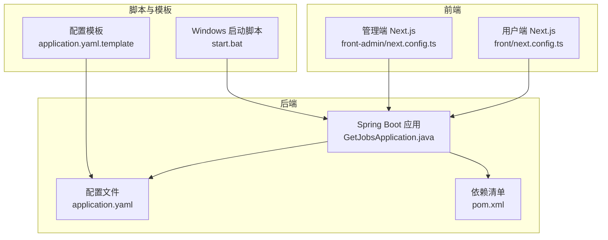
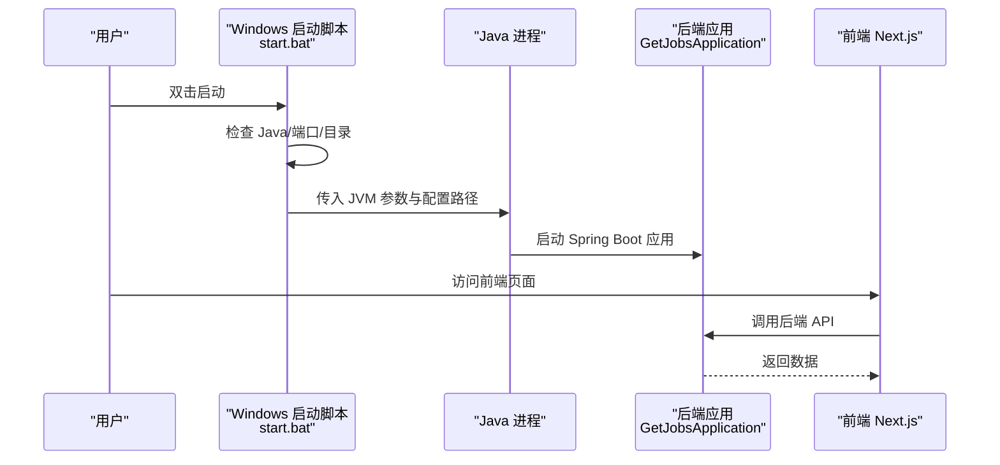
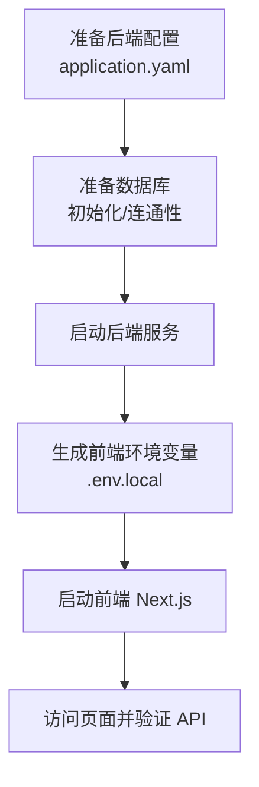
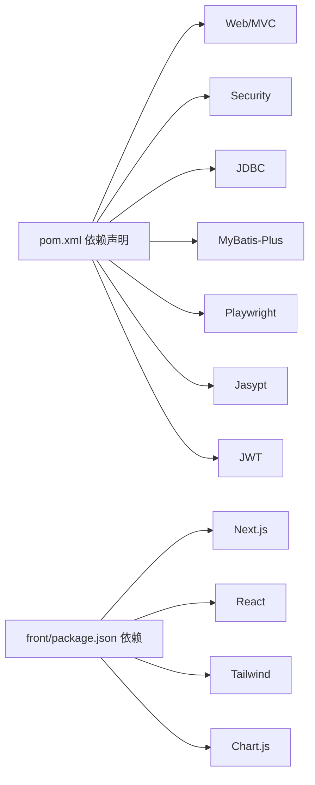

# 快速开始

<cite>
**本文引用的文件**
- [README.md](file://README.md)
- [application.yaml](file://backend/src/main/resources/application.yaml)
- [application.yaml.template](file://scripts/application.yaml.template)
- [pom.xml](file://backend/pom.xml)
- [GetJobsApplication.java](file://backend/src/main/java/com/getjobs/GetJobsApplication.java)
- [start.bat](file://scripts/windows/start.bat)
- [stop.bat](file://scripts/windows/stop.bat)
- [start-dev.js](file://front/scripts/start-dev.js)
- [start-prod.js](file://front/scripts/start-prod.js)
- [next.config.ts（front）](file://front/next.config.ts)
- [next.config.ts（front-admin）](file://front-admin/next.config.ts)
- [package.json（front）](file://front/package.json)
</cite>

## 目录
1. [简介](#简介)
2. [项目结构](#项目结构)
3. [核心组件](#核心组件)
4. [架构总览](#架构总览)
5. [详细组件分析](#详细组件分析)
6. [依赖关系分析](#依赖关系分析)
7. [性能与资源建议](#性能与资源建议)
8. [故障排查指南](#故障排查指南)
9. [结论](#结论)
10. [附录](#附录)

## 简介
本指南面向首次接触 GetJobs 项目的用户，提供从零开始的安装、配置与首次运行全流程，涵盖环境准备（JDK 21、Gradle、Node.js）、代码获取、依赖安装、数据库初始化、配置文件设置、跨平台差异与常见问题处理，帮助你在最短时间内成功运行系统并完成基本操作。

## 项目结构
GetJobs 是一个前后端分离的求职自动化平台，包含：
- 后端（Spring Boot 3 + MyBatis-Plus）：负责业务逻辑、定时任务、爬虫与平台对接
- 前端（Next.js 16）：用户管理端与后台管理端，分别导出静态站点
- 脚本与模板：Windows 启动脚本、配置模板、数据库迁移脚本等

图表来源
- [GetJobsApplication.java:1-22](file://backend/src/main/java/com/getjobs/GetJobsApplication.java#L1-L22)
- [application.yaml:1-101](file://backend/src/main/resources/application.yaml#L1-L101)
- [pom.xml:1-309](file://backend/pom.xml#L1-L309)
- [next.config.ts（front）:1-23](file://front/next.config.ts#L1-L23)
- [next.config.ts（front-admin）:1-12](file://front-admin/next.config.ts#L1-L12)
- [start.bat:1-98](file://scripts/windows/start.bat#L1-L98)
- [application.yaml.template:1-102](file://scripts/application.yaml.template#L1-L102)

章节来源
- [README.md:64-80](file://README.md#L64-L80)
- [pom.xml:24-40](file://backend/pom.xml#L24-L40)

## 核心组件
- 后端启动类：负责应用引导与调度
- 配置中心：application.yaml 提供数据库、日志、MyBatis-Plus、Playwright、JWT 等核心配置
- 前端配置：Next.js 配置导出静态站点，读取 server.config.js 动态注入环境变量
- Windows 启动脚本：自动检查 Java、端口占用、创建目录、启动与日志输出

章节来源
- [GetJobsApplication.java:15-21](file://backend/src/main/java/com/getjobs/GetJobsApplication.java#L15-L21)
- [application.yaml:13-101](file://backend/src/main/resources/application.yaml#L13-L101)
- [next.config.ts（front）:6-20](file://front/next.config.ts#L6-L20)
- [start.bat:15-93](file://scripts/windows/start.bat#L15-L93)

## 架构总览
后端通过 Spring Boot 启动，前端通过 Next.js 提供静态页面，二者通过 API 基础地址交互。Windows 提供一键启动脚本，自动定位配置与日志目录。

图表来源
- [start.bat:50-84](file://scripts/windows/start.bat#L50-L84)
- [GetJobsApplication.java:19-21](file://backend/src/main/java/com/getjobs/GetJobsApplication.java#L19-L21)
- [next.config.ts（front）:8-12](file://front/next.config.ts#L8-L12)

## 详细组件分析

### 1. 环境准备与安装
- JDK 21：后端基于 Java 21 构建，确保安装并配置 JAVA_HOME
- Gradle：用于后端构建；前端使用 Node.js 生态
- Node.js：前端开发与构建依赖
- Git：克隆仓库

章节来源
- [pom.xml:25-26](file://backend/pom.xml#L25-L26)
- [README.md:67-77](file://README.md#L67-L77)

### 2. 代码获取与依赖安装
- 克隆仓库并进入根目录
- 后端使用 Maven 构建（包含打包与混淆插件）
- 前端使用 pnpm 安装依赖（package.json 中声明）

章节来源
- [README.md:66-71](file://README.md#L66-L71)
- [pom.xml:198-306](file://backend/pom.xml#L198-L306)
- [package.json（front）:15-46](file://front/package.json#L15-L46)

### 3. 配置文件设置
- application.yaml（后端主配置）
  - 数据源：MySQL 连接、用户名、密码（支持 Jasypt 加密）
  - 日志：控制台与文件输出、滚动策略
  - MyBatis-Plus：映射规则、Mapper 位置
  - Playwright：性能与稳定性参数、平台差异化超时
  - JWT：后台管理密钥与过期时间
- application.yaml.template（配置模板）
  - 提供复制与修改指引，包含数据库初始化、Banner、日志、服务器端口、MyBatis-Plus 等常用项
- .env 与 .env.local（前端）
  - 由启动脚本根据 server.config.js 生成 .env.local，包含 API 基础地址、应用名称与版本等

章节来源
- [application.yaml:13-101](file://backend/src/main/resources/application.yaml#L13-L101)
- [application.yaml.template:14-101](file://scripts/application.yaml.template#L14-L101)
- [start-dev.js:8-22](file://front/scripts/start-dev.js#L8-L22)
- [start-prod.js:8-22](file://front/scripts/start-prod.js#L8-L22)
- [next.config.ts（front）:8-12](file://front/next.config.ts#L8-L12)

### 4. 数据库初始化
- application.yaml.template 提供 SQL 初始化模式与脚本位置
- 建议在本地 MySQL 准备数据库与用户，按模板配置连接信息
- 若使用默认模板，确保 schema.sql 存在于 classpath:schema.sql

章节来源
- [application.yaml.template:36-44](file://scripts/application.yaml.template#L36-L44)

### 5. 跨平台安装差异与注意事项
- Windows
  - 使用 start.bat 自动检查 Java、端口占用、创建日志与数据目录
  - 通过 JVM 参数指定配置目录与日志文件
  - 停止脚本 stop.bat 可查找并终止占用 18888 端口的进程
- macOS/Linux
  - 无内置启动脚本，可参考 start.bat 的逻辑自行编写
  - 确保端口 18888 未被占用，日志与数据目录存在
  - 前端通过 next.config.ts 导出静态站点，无需 Node 服务常驻

章节来源
- [start.bat:15-93](file://scripts/windows/start.bat#L15-L93)
- [stop.bat:12-25](file://scripts/windows/stop.bat#L12-L25)
- [next.config.ts（front）:14-19](file://front/next.config.ts#L14-L19)

### 6. 首次运行完整流程
- 后端
  - 准备 application.yaml（或复制 template 并修改）
  - 确认数据库连通与初始化完成
  - 运行启动脚本（Windows）或手动启动 Spring Boot 应用
- 前端
  - 生成 .env.local（由启动脚本自动完成）
  - 启动开发或生产模式（Next.js）
- 验证
  - 访问前端页面，确认 API 基础地址正确
  - 后端日志输出正常，无连接或加密异常

图表来源
- [application.yaml:13-101](file://backend/src/main/resources/application.yaml#L13-L101)
- [application.yaml.template:14-101](file://scripts/application.yaml.template#L14-L101)
- [start-dev.js:8-22](file://front/scripts/start-dev.js#L8-L22)
- [next.config.ts（front）:8-12](file://front/next.config.ts#L8-L12)

## 依赖关系分析
- 后端依赖
  - Spring Boot Web、Security、JDBC、MyBatis-Plus、Playwright、Jasypt、JWT 等
  - 构建阶段包含混淆插件与测试插件
- 前端依赖
  - Next.js 16、React 19、Tailwind、Chart.js 等生态库

图表来源
- [pom.xml:43-194](file://backend/pom.xml#L43-L194)
- [package.json（front）:15-46](file://front/package.json#L15-L46)

章节来源
- [pom.xml:43-194](file://backend/pom.xml#L43-L194)
- [package.json（front）:15-46](file://front/package.json#L15-L46)

## 性能与资源建议
- JVM 内存：启动脚本默认最小/最大堆为 256m/1024m，可根据机器与并发需求调整
- 日志轮转：日志文件最大 10MB，保留 30 天，建议定期清理
- Playwright：页面最大并发与空闲回收时间可按实际环境调优
- 前端导出：静态导出减少运行时依赖，适合轻量部署

章节来源
- [start.bat:50-55](file://scripts/windows/start.bat#L50-L55)
- [application.yaml:47-52](file://backend/src/main/resources/application.yaml#L47-L52)
- [next.config.ts（front）:14-19](file://front/next.config.ts#L14-L19)

## 故障排查指南
- 端口占用
  - Windows：启动前检查 18888 端口，必要时使用 stop.bat 终止进程
- Java 环境
  - 未安装或版本不符：按提示安装 JDK 21
- 数据库连接
  - 连接串、用户名、密码与初始化脚本需与模板一致
- 加密配置
  - Jasypt 密钥优先级：环境变量 > JVM 参数 > 配置文件默认值
- 前端无法访问后端
  - 确认 .env.local 中 API 基础地址指向后端服务
- 系统代理与网络
  - 项目针对国内平台，建议关闭墙外代理以提升页面加载速度

章节来源
- [start.bat:64-71](file://scripts/windows/start.bat#L64-L71)
- [stop.bat:12-25](file://scripts/windows/stop.bat#L12-L25)
- [application.yaml:28-35](file://backend/src/main/resources/application.yaml#L28-L35)
- [start-dev.js:13-19](file://front/scripts/start-dev.js#L13-L19)
- [README.md:52-57](file://README.md#L52-L57)

## 结论
按照本指南完成环境准备、配置与依赖安装后，你可以在 Windows 上通过启动脚本快速运行 GetJobs，并在前后端均完成基础验证。若遇到网络或平台兼容问题，可参考故障排查章节或加入社区获取支持。

## 附录
- 快速命令摘要
  - 克隆仓库与进入目录
  - Maven 构建后端
  - pnpm 安装前端依赖
  - Windows：双击 start.bat 启动
  - 前端：执行开发或生产启动脚本
- 参考文件路径
  - 后端主配置：backend/src/main/resources/application.yaml
  - 配置模板：scripts/application.yaml.template
  - 启动脚本：scripts/windows/start.bat
  - 停止脚本：scripts/windows/stop.bat
  - 前端配置：front/next.config.ts、front/scripts/start-dev.js、front/scripts/start-prod.js