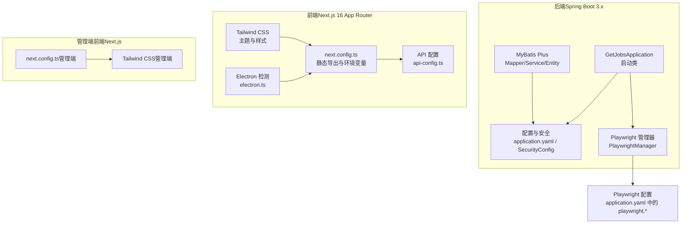
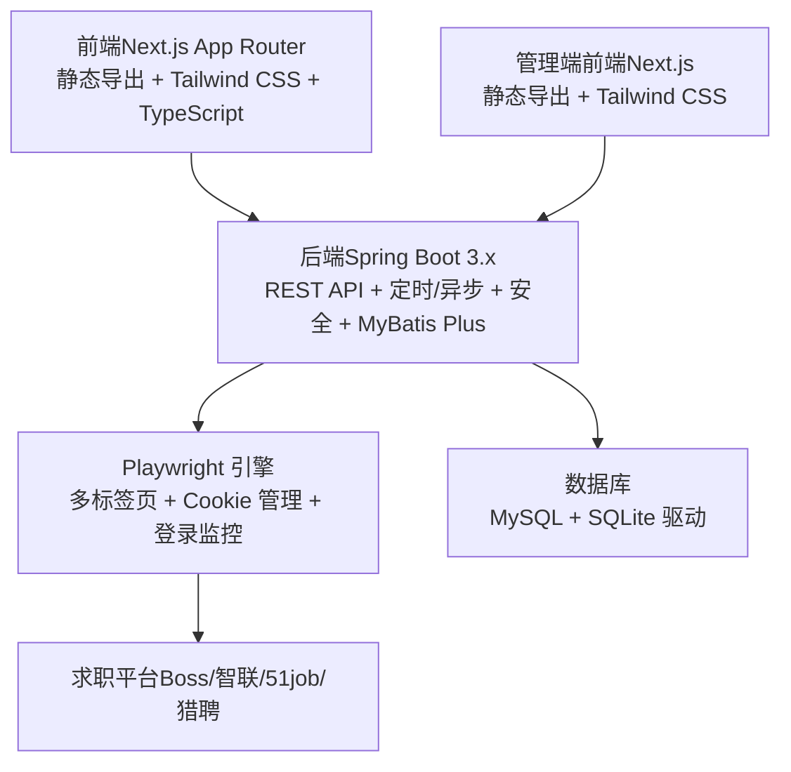
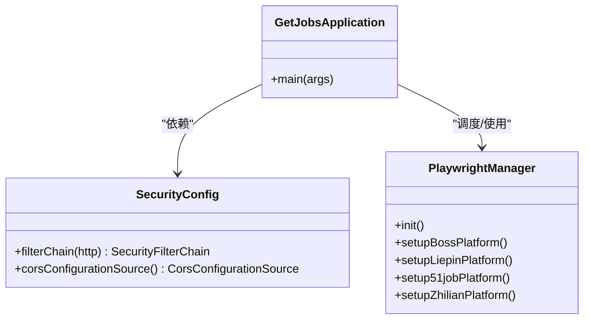
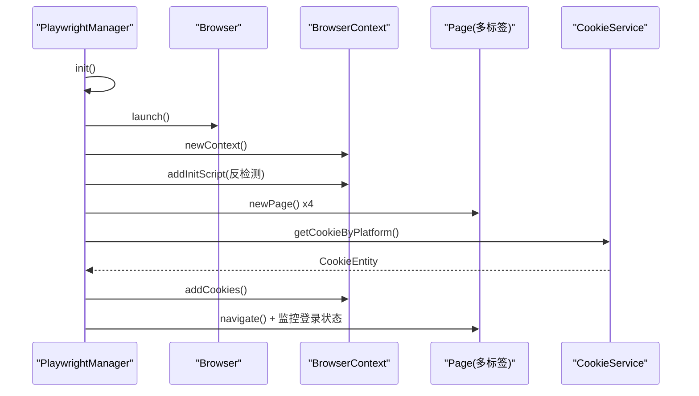
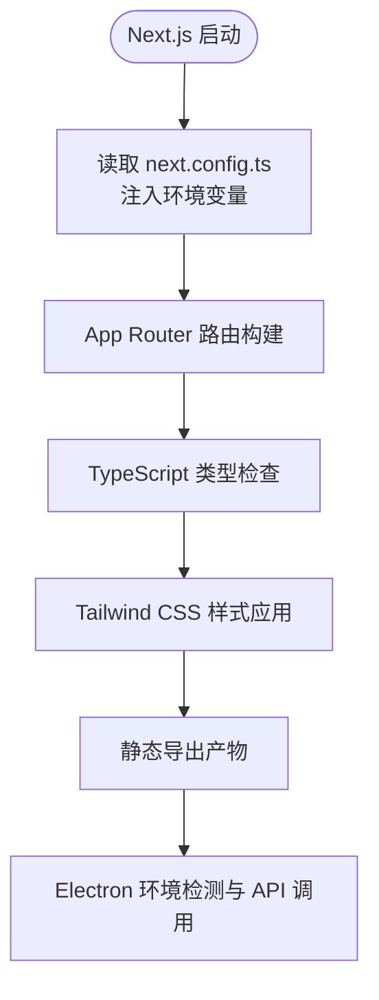
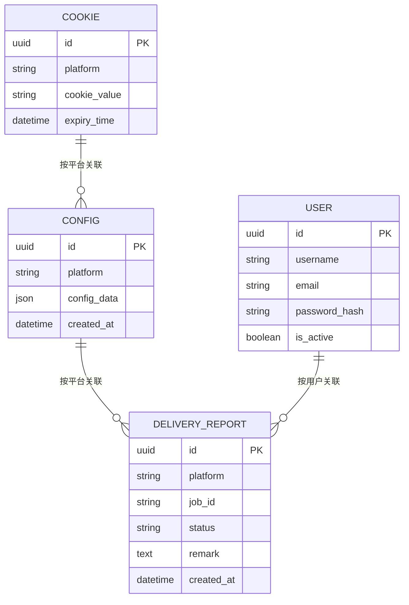
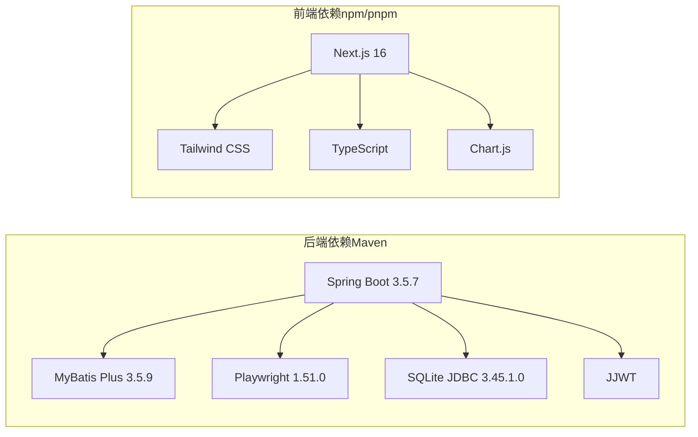

# 技术栈说明

<cite>
**本文引用的文件**   
- [GetJobsApplication.java](file://backend/src/main/java/com/getjobs/GetJobsApplication.java)
- [application.yaml](file://backend/src/main/resources/application.yaml)
- [pom.xml](file://backend/pom.xml)
- [SecurityConfig.java](file://backend/src/main/java/com/getjobs/application/config/SecurityConfig.java)
- [PlaywrightManager.java](file://backend/src/main/java/com/getjobs/worker/manager/PlaywrightManager.java)
- [package.json（前端）](file://front/package.json)
- [package.json（管理端）](file://front-admin/package.json)
- [next.config.ts（前端）](file://front/next.config.ts)
- [next.config.ts（管理端）](file://front-admin/next.config.ts)
- [tailwind.config.ts（前端）](file://front/tailwind.config.ts)
- [tailwind.config.ts（管理端）](file://front-admin/tailwind.config.ts)
- [electron.ts](file://front/lib/electron.ts)
- [api-config.ts](file://front/lib/api-config.ts)
- [README.md](file://README.md)
</cite>

## 目录
1. [引言](#引言)
2. [项目结构](#项目结构)
3. [核心组件](#核心组件)
4. [架构总览](#架构总览)
5. [详细组件分析](#详细组件分析)
6. [依赖关系分析](#依赖关系分析)
7. [性能考量](#性能考量)
8. [故障排查指南](#故障排查指南)
9. [结论](#结论)
10. [附录](#附录)

## 引言
本文件面向 GetJobs 项目的技术栈说明，围绕“Spring Boot + Next.js + Playwright”的全栈架构展开，系统阐述后端现代化能力（Spring Boot 3.x、MyBatis Plus、JWT）、前端现代化能力（Next.js App Router、TypeScript、Tailwind CSS、Electron 集成）、以及 Playwright 在求职自动化中的应用价值。文档还提供组件协作关系、数据流转、性能与稳定性策略、替代方案对比与权衡，帮助开发者快速理解并高效迭代。

## 项目结构
项目采用前后端分离与多模块组织方式：
- 后端模块（backend）：Spring Boot 应用，提供 REST API、定时/异步调度、Playwright 自动化、数据库访问与安全控制。
- 前端模块（front）：Next.js 16 App Router 应用，静态导出，结合 Tailwind CSS 与 TypeScript，支持 Electron 环境检测与调用。
- 管理端前端（front-admin）：Next.js 16 应用，静态导出，用于后台管理。
- 脚本与资源：数据库迁移脚本、启动批处理、Playwright 配置与反检测脚本等。

**图示来源**
- [GetJobsApplication.java:15-22](file://backend/src/main/java/com/getjobs/GetJobsApplication.java#L15-L22)
- [application.yaml:13-91](file://backend/src/main/resources/application.yaml#L13-L91)
- [PlaywrightManager.java:114-221](file://backend/src/main/java/com/getjobs/worker/manager/PlaywrightManager.java#L114-L221)
- [next.config.ts（前端）:6-20](file://front/next.config.ts#L6-L20)
- [tailwind.config.ts（前端）:1-138](file://front/tailwind.config.ts#L1-L138)
- [api-config.ts:1-99](file://front/lib/api-config.ts#L1-L99)
- [electron.ts:1-49](file://front/lib/electron.ts#L1-L49)
- [next.config.ts（管理端）:1-12](file://front-admin/next.config.ts#L1-L12)
- [tailwind.config.ts（管理端）:1-54](file://front-admin/tailwind.config.ts#L1-L54)

**章节来源**
- [GetJobsApplication.java:15-22](file://backend/src/main/java/com/getjobs/GetJobsApplication.java#L15-L22)
- [application.yaml:1-91](file://backend/src/main/resources/application.yaml#L1-L91)
- [pom.xml:8-40](file://backend/pom.xml#L8-L40)
- [next.config.ts（前端）:1-23](file://front/next.config.ts#L1-L23)
- [next.config.ts（管理端）:1-12](file://front-admin/next.config.ts#L1-L12)

## 核心组件
- 后端核心
  - Spring Boot 3.x：启用调度与异步，扫描基础包，提供 REST 接口与自动化服务。
  - MyBatis Plus：ORM 映射、驼峰命名、全局配置、Mapper 扫描。
  - 数据库：MySQL 主库 + SQLite 驱动（用于特定场景或离线导出）。
  - 安全与认证：禁用表单/CSRF/HTTP Basic，启用 CORS，使用 JWT 过滤器链。
  - 自动化引擎：Playwright 管理器，统一 BrowserContext、多标签页、Cookie 管理、登录状态监控、超时与重试策略。
- 前端核心
  - Next.js 16 App Router：静态导出、环境变量注入、TypeScript 类型安全。
  - 样式框架：Tailwind CSS，暗色模式、品牌色阶、阴影系统。
  - Electron 集成：环境检测、API 调用封装，便于桌面应用集成。
- 管理端前端
  - Next.js 静态导出，Tailwind CSS 主题，用于后台管理界面。

**章节来源**
- [GetJobsApplication.java:15-22](file://backend/src/main/java/com/getjobs/GetJobsApplication.java#L15-L22)
- [application.yaml:44-51](file://backend/src/main/resources/application.yaml#L44-L51)
- [pom.xml:82-101](file://backend/pom.xml#L82-L101)
- [SecurityConfig.java:24-66](file://backend/src/main/java/com/getjobs/application/config/SecurityConfig.java#L24-L66)
- [PlaywrightManager.java:114-221](file://backend/src/main/java/com/getjobs/worker/manager/PlaywrightManager.java#L114-L221)
- [package.json（前端）:15-46](file://front/package.json#L15-L46)
- [tailwind.config.ts（前端）:1-138](file://front/tailwind.config.ts#L1-L138)
- [electron.ts:1-49](file://front/lib/electron.ts#L1-L49)
- [next.config.ts（前端）:1-23](file://front/next.config.ts#L1-L23)
- [next.config.ts（管理端）:1-12](file://front-admin/next.config.ts#L1-L12)
- [tailwind.config.ts（管理端）:1-54](file://front-admin/tailwind.config.ts#L1-L54)

## 架构总览
整体架构以 Spring Boot 为核心，提供 API 与自动化服务；前端通过 Next.js 提供用户界面与管理界面；Playwright 负责与各大求职平台交互，实现登录状态持久化与投递自动化；数据库负责配置、日志、统计与用户数据存储。

**图示来源**
- [GetJobsApplication.java:15-22](file://backend/src/main/java/com/getjobs/GetJobsApplication.java#L15-L22)
- [application.yaml:13-91](file://backend/src/main/resources/application.yaml#L13-L91)
- [PlaywrightManager.java:114-221](file://backend/src/main/java/com/getjobs/worker/manager/PlaywrightManager.java#L114-L221)
- [next.config.ts（前端）:6-20](file://front/next.config.ts#L6-L20)
- [next.config.ts（管理端）:1-12](file://front-admin/next.config.ts#L1-L12)

## 详细组件分析

### 后端：Spring Boot 3.x 与安全配置
- 启动与调度
  - 启动类启用调度与异步，扫描基础包，作为应用入口。
- 安全与认证
  - 禁用表单登录、CSRF、HTTP Basic，使用自定义 JWT 过滤器链。
  - CORS 允许任意来源、方法与头，支持凭证缓存。
- 数据库与 ORM
  - MySQL 连接池与 Hikari 配置；MyBatis Plus 开启下划线转驼峰、自动 ID、Banner 与 Mapper 扫描。
- 配置与环境
  - 端口、日志、Banner、MyBatis Plus、JWT 密钥与过期、Playwright 参数等集中于 application.yaml。

**图示来源**
- [GetJobsApplication.java:15-22](file://backend/src/main/java/com/getjobs/GetJobsApplication.java#L15-L22)
- [SecurityConfig.java:24-66](file://backend/src/main/java/com/getjobs/application/config/SecurityConfig.java#L24-L66)
- [PlaywrightManager.java:114-221](file://backend/src/main/java/com/getjobs/worker/manager/PlaywrightManager.java#L114-L221)

**章节来源**
- [GetJobsApplication.java:15-22](file://backend/src/main/java/com/getjobs/GetJobsApplication.java#L15-L22)
- [SecurityConfig.java:24-66](file://backend/src/main/java/com/getjobs/application/config/SecurityConfig.java#L24-L66)
- [application.yaml:13-91](file://backend/src/main/resources/application.yaml#L13-L91)

### 后端：Playwright 自动化与平台适配
- 统一上下文与多标签页
  - 共享 BrowserContext，四个平台在同窗体多标签页运行，降低资源占用。
- 初始化流程
  - 延迟初始化 Playwright，校验 Chromium 路径，创建浏览器与上下文，注入反检测脚本。
- Cookie 管理与登录状态
  - 从数据库加载 Cookie 并注入上下文；并发初始化各平台页面；设置登录状态监控与回调。
- 平台差异化配置
  - 不同平台设置差异化导航超时、资源拦截开关、Cookie 刷新策略等，集中于 application.yaml。
- 超时与重试
  - 导航超时、最大重试次数、重试基延迟与最大延迟、健康检查间隔、空闲回收等。

**图示来源**
- [PlaywrightManager.java:114-221](file://backend/src/main/java/com/getjobs/worker/manager/PlaywrightManager.java#L114-L221)
- [application.yaml:60-91](file://backend/src/main/resources/application.yaml#L60-L91)

**章节来源**
- [PlaywrightManager.java:114-221](file://backend/src/main/java/com/getjobs/worker/manager/PlaywrightManager.java#L114-L221)
- [application.yaml:60-91](file://backend/src/main/resources/application.yaml#L60-L91)

### 前端：Next.js 16 App Router 与类型安全
- 静态导出与环境变量
  - 输出模式为静态导出，禁用图片优化；通过 next.config.ts 暴露 API 基础地址与应用元信息。
- 类型安全与模块化
  - TypeScript 提供强类型约束；API 路径集中于 api-config.ts，便于维护与重构。
- 样式体系
  - Tailwind CSS 主题扩展品牌色、圆角、阴影与自定义间距，支持暗色模式。
- Electron 集成
  - electron.ts 提供环境检测与安全调用封装，便于桌面应用集成。

**图示来源**
- [next.config.ts（前端）:6-20](file://front/next.config.ts#L6-L20)
- [tailwind.config.ts（前端）:1-138](file://front/tailwind.config.ts#L1-L138)
- [api-config.ts:1-99](file://front/lib/api-config.ts#L1-L99)
- [electron.ts:1-49](file://front/lib/electron.ts#L1-L49)

**章节来源**
- [next.config.ts（前端）:1-23](file://front/next.config.ts#L1-L23)
- [tailwind.config.ts（前端）:1-138](file://front/tailwind.config.ts#L1-L138)
- [api-config.ts:1-99](file://front/lib/api-config.ts#L1-L99)
- [electron.ts:1-49](file://front/lib/electron.ts#L1-L49)

### 管理端前端：Next.js 与 Tailwind
- 静态导出与尾随斜杠
  - 管理端同样采用静态导出，tailwind.config.ts 与前端一致的主题扩展。
- 路由与布局
  - App Router 布局与页面组织，便于后台管理功能扩展。

**章节来源**
- [next.config.ts（管理端）:1-12](file://front-admin/next.config.ts#L1-L12)
- [tailwind.config.ts（管理端）:1-54](file://front-admin/tailwind.config.ts#L1-L54)

### 数据模型与实体概览（概念示意）
以下为概念性 ER 图，展示后端常见实体与关系（具体字段以实体类为准）：

## 依赖关系分析
- 后端依赖
  - Spring Boot 3.5.7（starter-web、security、jdbc）
  - MyBatis Plus 3.5.9 与代码生成器
  - Playwright 1.51.0
  - MySQL Connector/J 8.0.28
  - SQLite JDBC 3.45.1.0
  - Jackson YAML、Apache HttpClient5、JJWT、Jasypt 等
- 前端依赖
  - Next.js 16、React 19、Tailwind CSS、Chart.js、Lucide React 等
  - TypeScript、ESLint、PostCSS、Terser、JavaScript Obfuscator（构建与混淆）

**图示来源**
- [pom.xml:43-177](file://backend/pom.xml#L43-L177)
- [package.json（前端）:15-46](file://front/package.json#L15-L46)
- [package.json（管理端）:11-28](file://front-admin/package.json#L11-L28)

**章节来源**
- [pom.xml:43-177](file://backend/pom.xml#L43-L177)
- [package.json（前端）:15-46](file://front/package.json#L15-L46)
- [package.json（管理端）:11-28](file://front-admin/package.json#L11-L28)

## 性能考量
- 后端
  - Hikari 连接池参数（最大池大小、空闲超时、最大生命周期）与 MyBatis Plus 驼峰映射、Mapper 扫描提升数据库访问效率。
  - Playwright 资源拦截开关、空闲页面回收、导航超时与重试策略平衡稳定性与性能。
- 前端
  - 静态导出减少运行时开销；Tailwind 动态样式在构建期确定，有利于首屏性能。
- 数据库
  - MySQL 主库 + SQLite 驱动，满足在线与离线/导出场景。

**章节来源**
- [application.yaml:13-22](file://backend/src/main/resources/application.yaml#L13-L22)
- [application.yaml:44-51](file://backend/src/main/resources/application.yaml#L44-L51)
- [application.yaml:60-91](file://backend/src/main/resources/application.yaml#L60-L91)
- [next.config.ts（前端）:14-20](file://front/next.config.ts#L14-L20)

## 故障排查指南
- Playwright 初始化失败
  - 检查 Chromium 路径是否存在，必要时执行 Playwright 安装命令；确认 slow-mo、导航超时与资源拦截配置。
- 登录状态异常
  - 平台登录状态监控与回调需关注页面导航事件与登录入口识别；必要时调整定位器与超时。
- CORS 与认证
  - 确认 CORS 配置允许来源与方法；JWT 过滤器链生效；前端 API 基础地址正确。
- 静态导出与图片优化
  - 静态导出需禁用图片优化；Electron 环境检测与 API 调用需在可用时才执行。

**章节来源**
- [PlaywrightManager.java:114-221](file://backend/src/main/java/com/getjobs/worker/manager/PlaywrightManager.java#L114-L221)
- [SecurityConfig.java:24-66](file://backend/src/main/java/com/getjobs/application/config/SecurityConfig.java#L24-L66)
- [next.config.ts（前端）:14-20](file://front/next.config.ts#L14-L20)
- [electron.ts:1-49](file://front/lib/electron.ts#L1-L49)

## 结论
本项目采用 Spring Boot 3.x + Next.js 16 + Playwright 的现代化全栈组合：后端以 Spring Boot 3.x 为核心，配合 MyBatis Plus 与 Playwright 实现稳定高效的自动化求职流程；前端以 Next.js App Router 与 Tailwind CSS 提供一致的开发体验与良好性能；Playwright 在求职自动化中承担关键角色，通过统一上下文、Cookie 管理与登录监控保障跨平台稳定性。整体架构兼顾易用性、可维护性与可扩展性，适合持续演进与团队协作。

## 附录
- 技术选型权衡与替代方案
  - Spring Boot 3.x vs 2.x：获得更好的性能与新特性，但需升级依赖与 JDK 21。
  - MyBatis Plus vs MyBatis：前者提供代码生成与便捷配置，后者更灵活但需手工映射。
  - Playwright vs Selenium：Playwright 在现代浏览器自动化方面更成熟，稳定性更高。
  - Next.js App Router vs Pages：App Router 提供更好的路由与数据流控制，静态导出适合前端独立部署。
  - Tailwind CSS vs 其他样式框架：Tailwind 适合快速原型与主题定制，但需注意样式体积与构建优化。
- 运行与部署提示
  - 后端端口固定为 18888；前端静态导出产物可直接部署；管理端前端独立端口 6867；Playwright 需要网络与浏览器驱动支持。

**章节来源**
- [README.md:64-174](file://README.md#L64-L174)
- [application.yaml:28-29](file://backend/src/main/resources/application.yaml#L28-L29)
- [next.config.ts（前端）:1-23](file://front/next.config.ts#L1-L23)
- [next.config.ts（管理端）:1-12](file://front-admin/next.config.ts#L1-L12)