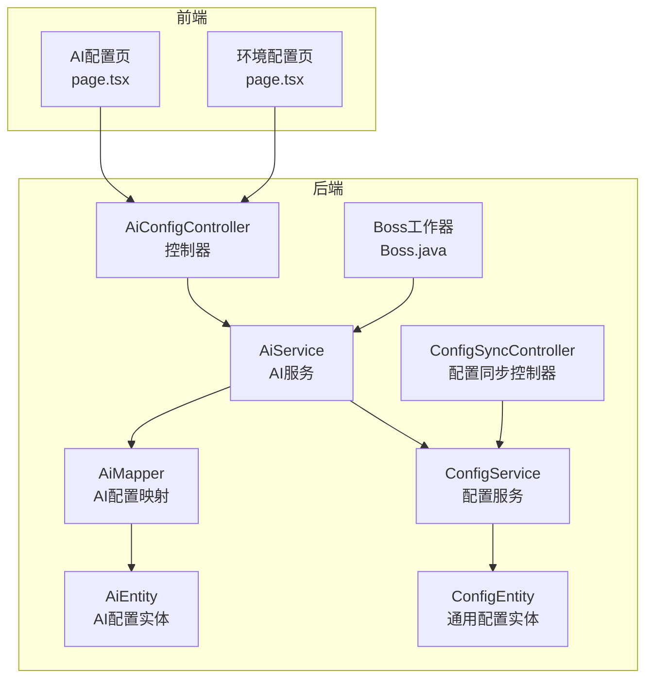
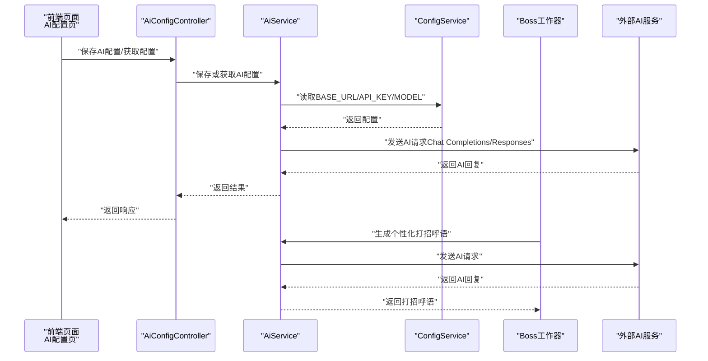
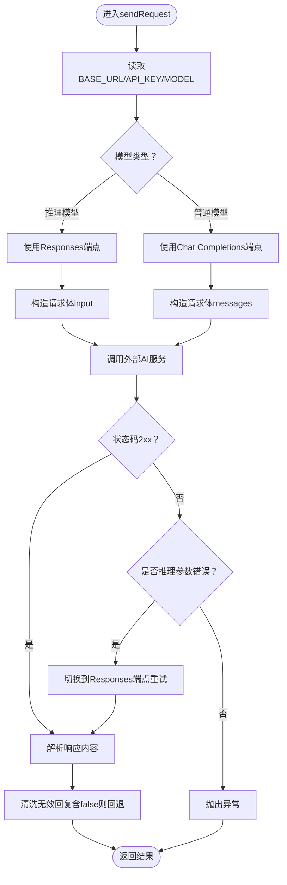
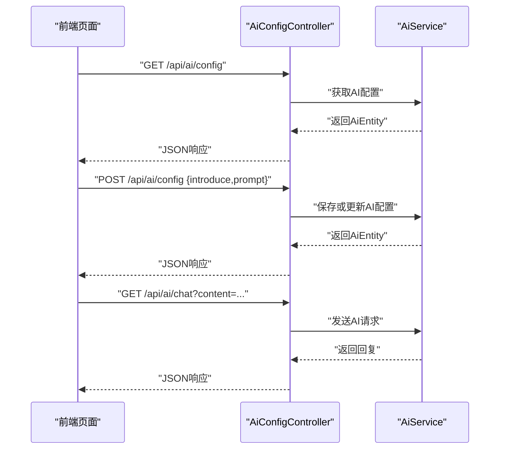
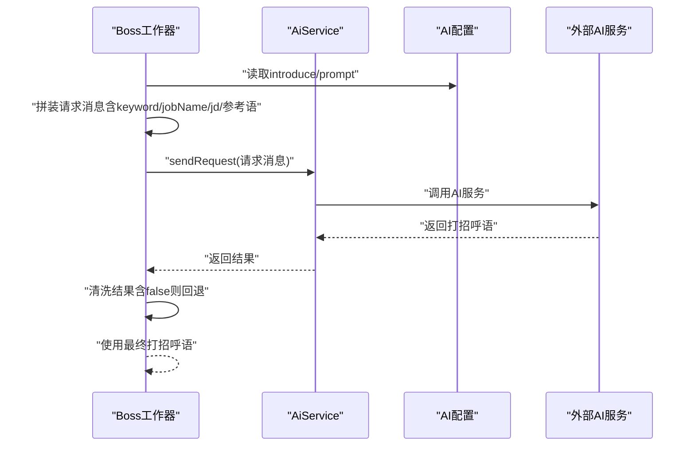
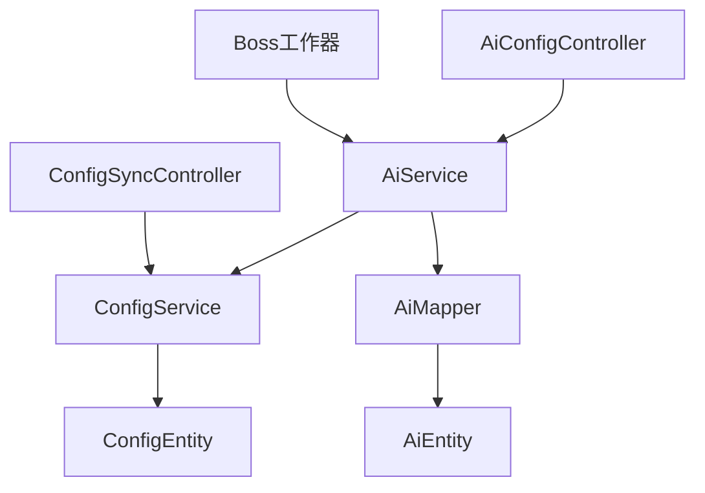

# AI智能匹配

<cite>
**本文引用的文件**
- [AiService.java](file://backend/src/main/java/com/getjobs/application/service/AiService.java)
- [AiConfigController.java](file://backend/src/main/java/com/getjobs/application/controller/AiConfigController.java)
- [AiEntity.java](file://backend/src/main/java/com/getjobs/application/entity/AiEntity.java)
- [AiMapper.java](file://backend/src/main/java/com/getjobs/application/mapper/AiMapper.java)
- [ConfigService.java](file://backend/src/main/java/com/getjobs/application/service/ConfigService.java)
- [Boss.java](file://backend/src/main/java/com/getjobs/worker/boss/Boss.java)
- [ConfigSyncController.java](file://backend/src/main/java/com/getjobs/application/controller/ConfigSyncController.java)
- [page.tsx（AI配置页）](file://front/app/ai-config/page.tsx)
- [page.tsx（环境配置页）](file://front/app/env-config/page.tsx)
- [application.yaml](file://backend/src/main/resources/application.yaml)
- [application.yaml.template](file://scripts/application.yaml.template)
- [ConfigEntity.java](file://backend/src/main/java/com/getjobs/application/entity/ConfigEntity.java)
- [Job.java](file://backend/src/main/java/com/getjobs/worker/utils/Job.java)
- [electron.d.ts](file://front/types/electron.d.ts)
</cite>

## 目录
1. [简介](#简介)
2. [项目结构](#项目结构)
3. [核心组件](#核心组件)
4. [架构总览](#架构总览)
5. [详细组件分析](#详细组件分析)
6. [依赖分析](#依赖分析)
7. [性能考虑](#性能考虑)
8. [故障排查指南](#故障排查指南)
9. [结论](#结论)
10. [附录](#附录)

## 简介
本技术文档围绕“AI智能匹配”功能展开，系统性阐述了AI匹配算法的工作原理、AI服务的实现机制、配置方法、个性化打招呼语生成流程，以及与Boss直聘平台、通知系统等模块的集成方式。读者无需深厚的编程背景，也能通过本文件理解AI如何分析职位描述（JD）、提取关键词、匹配候选人技能与经验，并最终生成高质量的个性化求职沟通内容。

## 项目结构
AI智能匹配功能横跨后端服务层与前端配置界面，涉及以下关键目录与文件：
- 后端服务层：应用服务、控制器、实体与映射、配置服务、平台工作器
- 前端配置页：AI配置页、环境配置页
- 配置模板与运行配置：application.yaml与模板文件

图表来源
- [AiConfigController.java:17-129](file://backend/src/main/java/com/getjobs/application/controller/AiConfigController.java#L17-L129)
- [AiService.java:26-187](file://backend/src/main/java/com/getjobs/application/service/AiService.java#L26-L187)
- [ConfigService.java:24-200](file://backend/src/main/java/com/getjobs/application/service/ConfigService.java#L24-L200)
- [AiMapper.java:1-13](file://backend/src/main/java/com/getjobs/application/mapper/AiMapper.java#L1-L13)
- [AiEntity.java:11-48](file://backend/src/main/java/com/getjobs/application/entity/AiEntity.java#L11-L48)
- [ConfigEntity.java:11-66](file://backend/src/main/java/com/getjobs/application/entity/ConfigEntity.java#L11-L66)
- [Boss.java:1074-1102](file://backend/src/main/java/com/getjobs/worker/boss/Boss.java#L1074-L1102)
- [ConfigSyncController.java:47-78](file://backend/src/main/java/com/getjobs/application/controller/ConfigSyncController.java#L47-L78)
- [page.tsx（AI配置页）:12-245](file://front/app/ai-config/page.tsx#L12-L245)
- [page.tsx（环境配置页）:253-266](file://front/app/env-config/page.tsx#L253-L266)

章节来源
- [AiConfigController.java:17-129](file://backend/src/main/java/com/getjobs/application/controller/AiConfigController.java#L17-L129)
- [AiService.java:26-187](file://backend/src/main/java/com/getjobs/application/service/AiService.java#L26-L187)
- [ConfigService.java:24-200](file://backend/src/main/java/com/getjobs/application/service/ConfigService.java#L24-L200)
- [AiMapper.java:1-13](file://backend/src/main/java/com/getjobs/application/mapper/AiMapper.java#L1-L13)
- [AiEntity.java:11-48](file://backend/src/main/java/com/getjobs/application/entity/AiEntity.java#L11-L48)
- [ConfigEntity.java:11-66](file://backend/src/main/java/com/getjobs/application/entity/ConfigEntity.java#L11-L66)
- [Boss.java:1074-1102](file://backend/src/main/java/com/getjobs/worker/boss/Boss.java#L1074-L1102)
- [ConfigSyncController.java:47-78](file://backend/src/main/java/com/getjobs/application/controller/ConfigSyncController.java#L47-L78)
- [page.tsx（AI配置页）:12-245](file://front/app/ai-config/page.tsx#L12-L245)
- [page.tsx（环境配置页）:253-266](file://front/app/env-config/page.tsx#L253-L266)

## 核心组件
- AI服务（AiService）：负责从配置中心读取BASE_URL、API_KEY、MODEL，构建请求体，调用外部AI服务，并根据模型类型自动选择Chat Completions或Responses端点，同时具备错误处理与自动降级能力。
- AI配置控制器（AiConfigController）：提供获取与保存AI配置的REST接口，以及AI聊天测试接口，便于前端与运维调试。
- 配置服务（ConfigService）：统一管理通用配置，提供AI所需的关键配置项（BASE_URL、API_KEY、MODEL），并在缺失时返回空值以便上层处理。
- AI配置实体与映射（AiEntity、AiMapper）：持久化存储技能介绍与提示词模板；MyBatis-Plus映射DAO。
- Boss工作器（Boss.java）：在Boss直聘平台自动投递流程中，基于AI生成个性化打招呼语，作为候选人的“第一印象”内容。
- 配置同步控制器（ConfigSyncController）：将各平台配置与AI配置打包下发至前端，支撑云同步与本地配置一致性。
- 前端AI配置页（page.tsx）：提供技能介绍与提示词编辑、AI开关切换、保存与测试能力。
- 环境配置页（page.tsx）：提供AI模型名称等环境参数的编辑入口。

章节来源
- [AiService.java:26-187](file://backend/src/main/java/com/getjobs/application/service/AiService.java#L26-L187)
- [AiConfigController.java:17-129](file://backend/src/main/java/com/getjobs/application/controller/AiConfigController.java#L17-L129)
- [ConfigService.java:103-124](file://backend/src/main/java/com/getjobs/application/service/ConfigService.java#L103-L124)
- [AiEntity.java:11-48](file://backend/src/main/java/com/getjobs/application/entity/AiEntity.java#L11-L48)
- [AiMapper.java:1-13](file://backend/src/main/java/com/getjobs/application/mapper/AiMapper.java#L1-L13)
- [Boss.java:1074-1102](file://backend/src/main/java/com/getjobs/worker/boss/Boss.java#L1074-L1102)
- [ConfigSyncController.java:47-78](file://backend/src/main/java/com/getjobs/application/controller/ConfigSyncController.java#L47-L78)
- [page.tsx（AI配置页）:12-245](file://front/app/ai-config/page.tsx#L12-L245)
- [page.tsx（环境配置页）:253-266](file://front/app/env-config/page.tsx#L253-L266)

## 架构总览
AI智能匹配的整体流程如下：
- 前端编辑AI配置（技能介绍、提示词模板、AI开关）
- 后端控制器接收请求，调用AI服务与配置服务
- AI服务读取BASE_URL/API_KEY/MODEL，构造请求体，调用外部AI服务
- 平台工作器（如Boss）在投递前调用AI服务生成个性化打招呼语
- 配置同步控制器将AI配置下发至前端，确保前后端一致

图表来源
- [AiConfigController.java:30-85](file://backend/src/main/java/com/getjobs/application/controller/AiConfigController.java#L30-L85)
- [AiService.java:38-147](file://backend/src/main/java/com/getjobs/application/service/AiService.java#L38-L147)
- [ConfigService.java:103-124](file://backend/src/main/java/com/getjobs/application/service/ConfigService.java#L103-L124)
- [Boss.java:1074-1102](file://backend/src/main/java/com/getjobs/worker/boss/Boss.java#L1074-L1102)

## 详细组件分析

### AI服务（AiService）
- 功能职责
  - 从配置中心读取BASE_URL、API_KEY、MODEL
  - 根据模型类型自动选择Chat Completions或Responses端点
  - 构造请求体（支持messages或input字段）
  - 调用外部AI服务并解析响应
  - 错误处理与自动降级（如推理模型误用Chat Completions时自动切换）
- 关键实现要点
  - 端点构造逻辑：避免重复拼接/v1，兼容不同基础URL形态
  - 推理模型识别：对o1/o3/o4、4.1、reasoner、4o-mini、gpt-4o-mini等模型走Responses API
  - 请求体差异：Responses API使用input字段，其他模型使用messages数组
  - 超时与异常：统一超时控制与异常包装，便于上层捕获
- 性能与可靠性
  - 连接超时与请求超时控制
  - 对推理模型的参数错误进行自动重试与端点切换
  - 返回内容清洗：过滤包含“false”的无效回复，回退到默认招呼语

图表来源
- [AiService.java:38-147](file://backend/src/main/java/com/getjobs/application/service/AiService.java#L38-L147)

章节来源
- [AiService.java:26-187](file://backend/src/main/java/com/getjobs/application/service/AiService.java#L26-L187)

### AI配置控制器（AiConfigController）
- 功能职责
  - 提供获取与保存AI配置的REST接口
  - 提供AI聊天测试接口，便于快速验证提示词与模型
  - 健康检查接口，便于监控
- 关键实现要点
  - 参数校验：introduce与prompt不能为空
  - 异常处理：统一返回success/message/data结构
  - 测试接口：支持GET参数content，直接调用AI服务生成回复

图表来源
- [AiConfigController.java:30-127](file://backend/src/main/java/com/getjobs/application/controller/AiConfigController.java#L30-L127)

章节来源
- [AiConfigController.java:17-129](file://backend/src/main/java/com/getjobs/application/controller/AiConfigController.java#L17-L129)

### 配置服务（ConfigService）
- 功能职责
  - 统一管理通用配置，提供AI所需的BASE_URL、API_KEY、MODEL
  - 缺失配置时返回空值，避免阻断业务流程
- 关键实现要点
  - requireConfigValue：缺失或空白时抛出异常，便于显式处理
  - getAiConfigs：封装AI配置读取，保证调用方健壮性

章节来源
- [ConfigService.java:103-124](file://backend/src/main/java/com/getjobs/application/service/ConfigService.java#L103-L124)

### AI配置实体与映射（AiEntity、AiMapper）
- 功能职责
  - 持久化存储技能介绍与提示词模板
  - MyBatis-Plus映射DAO，支持增删改查
- 关键实现要点
  - 实体字段：introduce、prompt、createdAt、updatedAt
  - 映射接口：继承BaseMapper，提供标准CRUD能力

章节来源
- [AiEntity.java:11-48](file://backend/src/main/java/com/getjobs/application/entity/AiEntity.java#L11-L48)
- [AiMapper.java:1-13](file://backend/src/main/java/com/getjobs/application/mapper/AiMapper.java#L1-L13)

### Boss平台集成（Boss工作器）
- 功能职责
  - 在Boss直聘平台自动投递流程中，基于AI生成个性化打招呼语
  - 若AI请求失败或返回无效内容，则回退到默认招呼语
- 关键实现要点
  - 生成打招呼语：从AI配置读取introduce与prompt，拼接keyword、jobName、jd与参考语
  - 默认提示词：当未配置prompt时，使用内置默认模板
  - 容错回退：AI返回null或包含“false”时，回退到config.getSayHi()

图表来源
- [Boss.java:1074-1102](file://backend/src/main/java/com/getjobs/worker/boss/Boss.java#L1074-L1102)
- [AiService.java:38-147](file://backend/src/main/java/com/getjobs/application/service/AiService.java#L38-L147)

章节来源
- [Boss.java:1074-1102](file://backend/src/main/java/com/getjobs/worker/boss/Boss.java#L1074-L1102)

### 配置同步（ConfigSyncController）
- 功能职责
  - 将Boss/Liepin/Zhilian/51Job等平台配置与AI配置打包下发至前端
  - 支持云同步场景下的配置一致性保障
- 关键实现要点
  - 从ConfigService读取各平台配置与AI配置
  - 组装响应体，包含config、options与aiConfig字段

章节来源
- [ConfigSyncController.java:47-78](file://backend/src/main/java/com/getjobs/application/controller/ConfigSyncController.java#L47-L78)

### 前端AI配置页（page.tsx）
- 功能职责
  - 提供技能介绍与提示词编辑
  - 切换AI开关（映射boss_config.enable_ai）
  - 保存配置并进行简单校验
- 关键实现要点
  - GET /api/ai/config：加载当前AI配置
  - POST /api/ai/config：保存AI配置
  - GET /api/ai/chat：测试AI回复
  - 切换AI开关：PUT boss.config，支持1/true/on等真值

章节来源
- [page.tsx（AI配置页）:12-245](file://front/app/ai-config/page.tsx#L12-L245)

### 环境配置页（page.tsx）
- 功能职责
  - 提供AI模型名称等环境参数的编辑入口
  - 与后端配置项（如MODEL）对应，便于统一管理

章节来源
- [page.tsx（环境配置页）:253-266](file://front/app/env-config/page.tsx#L253-L266)

## 依赖分析
- 组件耦合
  - AiConfigController依赖AiService；AiService依赖ConfigService与AiMapper
  - Boss工作器依赖AiService与配置项（如sayHi）
  - ConfigSyncController依赖ConfigService，向前端下发AI配置
- 外部依赖
  - 外部AI服务：根据模型类型选择Chat Completions或Responses端点
  - 数据库：MyBatis-Plus持久化AI配置与通用配置
- 潜在风险
  - AI服务不可用或网络异常：需依赖回退策略（默认招呼语）
  - 配置缺失：ConfigService返回空值，调用方可选择降级

图表来源
- [AiConfigController.java:23-24](file://backend/src/main/java/com/getjobs/application/controller/AiConfigController.java#L23-L24)
- [AiService.java:30-31](file://backend/src/main/java/com/getjobs/application/service/AiService.java#L30-L31)
- [ConfigService.java:28-32](file://backend/src/main/java/com/getjobs/application/service/ConfigService.java#L28-L32)
- [AiMapper.java:10-12](file://backend/src/main/java/com/getjobs/application/mapper/AiMapper.java#L10-L12)
- [AiEntity.java:14-47](file://backend/src/main/java/com/getjobs/application/entity/AiEntity.java#L14-L47)
- [ConfigEntity.java:14-65](file://backend/src/main/java/com/getjobs/application/entity/ConfigEntity.java#L14-L65)
- [Boss.java:1074-1102](file://backend/src/main/java/com/getjobs/worker/boss/Boss.java#L1074-L1102)
- [ConfigSyncController.java:55-76](file://backend/src/main/java/com/getjobs/application/controller/ConfigSyncController.java#L55-L76)

章节来源
- [AiService.java:26-187](file://backend/src/main/java/com/getjobs/application/service/AiService.java#L26-L187)
- [AiConfigController.java:17-129](file://backend/src/main/java/com/getjobs/application/controller/AiConfigController.java#L17-L129)
- [ConfigService.java:24-200](file://backend/src/main/java/com/getjobs/application/service/ConfigService.java#L24-L200)
- [AiMapper.java:1-13](file://backend/src/main/java/com/getjobs/application/mapper/AiMapper.java#L1-L13)
- [AiEntity.java:11-48](file://backend/src/main/java/com/getjobs/application/entity/AiEntity.java#L11-L48)
- [ConfigEntity.java:11-66](file://backend/src/main/java/com/getjobs/application/entity/ConfigEntity.java#L11-L66)
- [Boss.java:1074-1102](file://backend/src/main/java/com/getjobs/worker/boss/Boss.java#L1074-L1102)
- [ConfigSyncController.java:47-78](file://backend/src/main/java/com/getjobs/application/controller/ConfigSyncController.java#L47-L78)

## 性能考虑
- 超时控制：AI请求统一设置连接与请求超时，避免阻塞线程
- 自动降级：在推理模型误用Chat Completions时自动切换到Responses端点，减少失败率
- 内容清洗：过滤无效回复，降低后续处理成本
- 端点选择：根据模型类型选择最优端点，提升兼容性与稳定性

## 故障排查指南
- AI请求失败
  - 检查BASE_URL、API_KEY、MODEL是否正确配置
  - 观察日志中“AI请求失败”的状态码与响应体，定位具体错误
  - 若为推理模型误用Chat Completions，系统会自动切换到Responses端点重试
- 回退行为
  - 若AI返回null或包含“false”，将回退到默认招呼语（config.getSayHi）
- 前端无法保存配置
  - 确认后端服务正常，检查AiConfigController返回的success/message
  - 检查前端网络请求与CORS配置

章节来源
- [AiService.java:131-146](file://backend/src/main/java/com/getjobs/application/service/AiService.java#L131-L146)
- [AiConfigController.java:43-84](file://backend/src/main/java/com/getjobs/application/controller/AiConfigController.java#L43-L84)
- [Boss.java:1083-1092](file://backend/src/main/java/com/getjobs/worker/boss/Boss.java#L1083-L1092)

## 结论
AI智能匹配功能通过“配置驱动 + 平台集成 + 容错回退”的设计，在Boss直聘等平台上实现了高可用的个性化打招呼语生成。其核心在于：
- 清晰的配置体系（BASE_URL/API_KEY/MODEL与技能介绍/提示词模板）
- 灵活的AI服务封装（自动端点选择、错误处理与回退）
- 与平台工作器的无缝衔接（投递前生成高质量沟通内容）

建议持续优化提示词模板与技能介绍，结合平台反馈迭代，进一步提升匹配质量与转化效果。

## 附录

### AI配置方法（后端）
- 配置项
  - BASE_URL：AI服务基础URL
  - API_KEY：AI服务鉴权密钥
  - MODEL：使用的AI模型名称
- 配置来源
  - ConfigService统一读取，AiService在调用前校验并使用
- 配置模板
  - application.yaml.template提供了完整的配置模板与注释说明

章节来源
- [ConfigService.java:103-124](file://backend/src/main/java/com/getjobs/application/service/ConfigService.java#L103-L124)
- [application.yaml.template:10-102](file://scripts/application.yaml.template#L10-L102)

### AI配置方法（前端）
- 页面入口
  - AI配置页：编辑技能介绍与提示词模板，保存并测试
  - 环境配置页：编辑AI模型名称等环境参数
- 交互要点
  - 保存AI配置：POST /api/ai/config
  - 获取AI配置：GET /api/ai/config
  - 测试AI：GET /api/ai/chat?content=...

章节来源
- [page.tsx（AI配置页）:12-245](file://front/app/ai-config/page.tsx#L12-L245)
- [page.tsx（环境配置页）:253-266](file://front/app/env-config/page.tsx#L253-L266)

### 个性化打招呼语生成示例（概念性说明）
- 输入要素
  - 技能介绍：候选人的技术栈、经验背景
  - 提示词模板：支持占位符（如%s）动态注入内容
  - 关键词：职位搜索关键词
  - 职位名称：目标岗位名称
  - 职位描述：JD摘要
  - 参考语：默认招呼语
- 输出要求
  - 中文、简洁友好、不超过60字
  - 若AI不可用或返回无效内容，则回退到参考语

章节来源
- [Boss.java:1095-1102](file://backend/src/main/java/com/getjobs/worker/boss/Boss.java#L1095-L1102)
- [AiService.java:131-146](file://backend/src/main/java/com/getjobs/application/service/AiService.java#L131-L146)

### 与其他功能模块的集成
- 与Boss直聘平台对接
  - Boss工作器在投递前调用AI服务生成个性化打招呼语
  - AI开关映射到boss_config.enable_ai，支持前端切换
- 与通知系统联动
  - 通过配置同步控制器将AI配置下发至前端，确保前后端一致
  - 前端展示AI打招呼次数等指标，便于用户感知

章节来源
- [Boss.java:1074-1102](file://backend/src/main/java/com/getjobs/worker/boss/Boss.java#L1074-L1102)
- [ConfigSyncController.java:47-78](file://backend/src/main/java/com/getjobs/application/controller/ConfigSyncController.java#L47-L78)
- [page.tsx（AI配置页）:19-101](file://front/app/ai-config/page.tsx#L19-L101)
- [electron.d.ts:90-118](file://front/types/electron.d.ts#L90-L118)