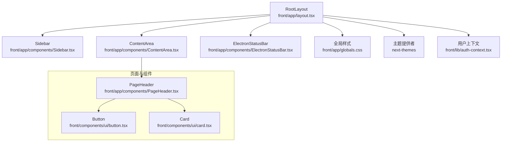
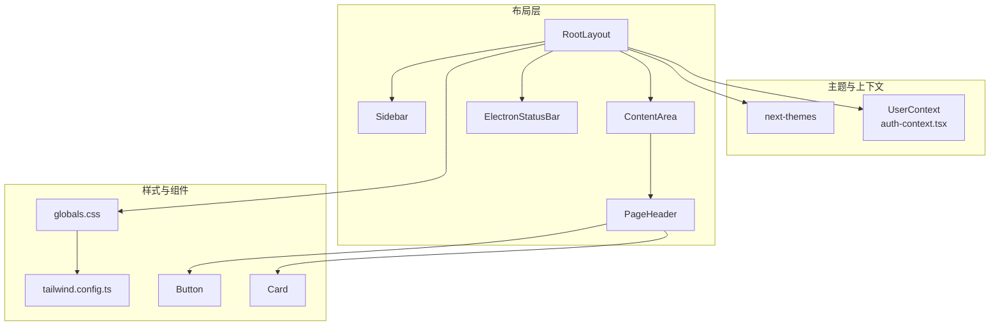
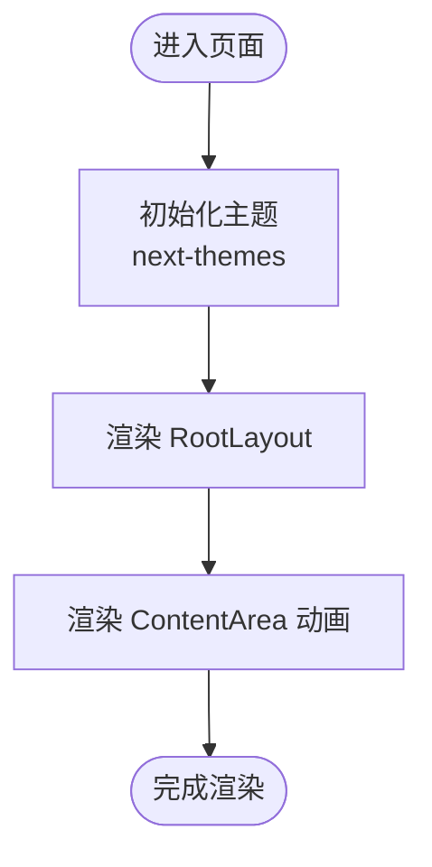
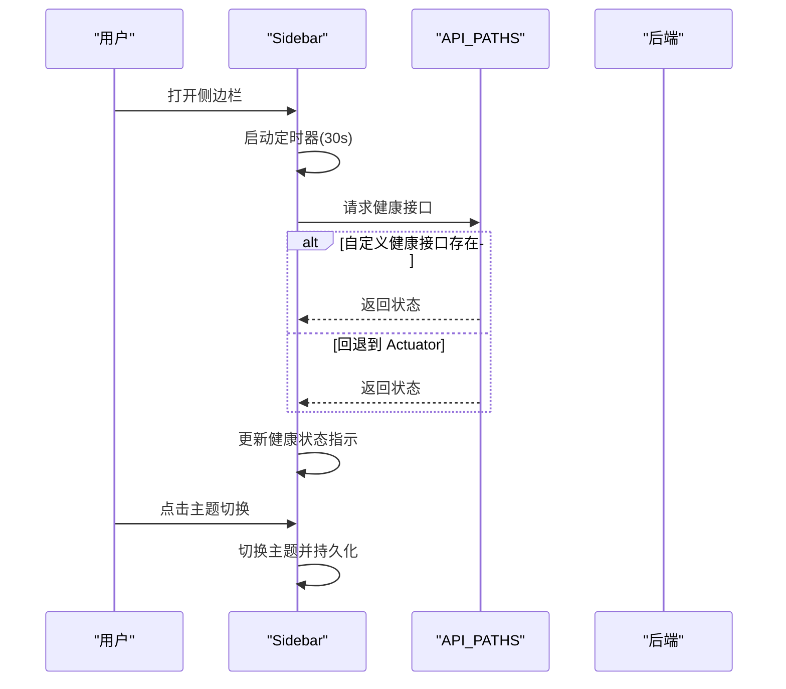
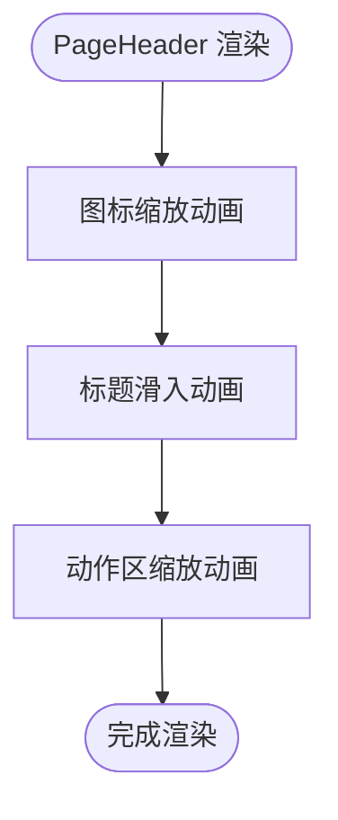
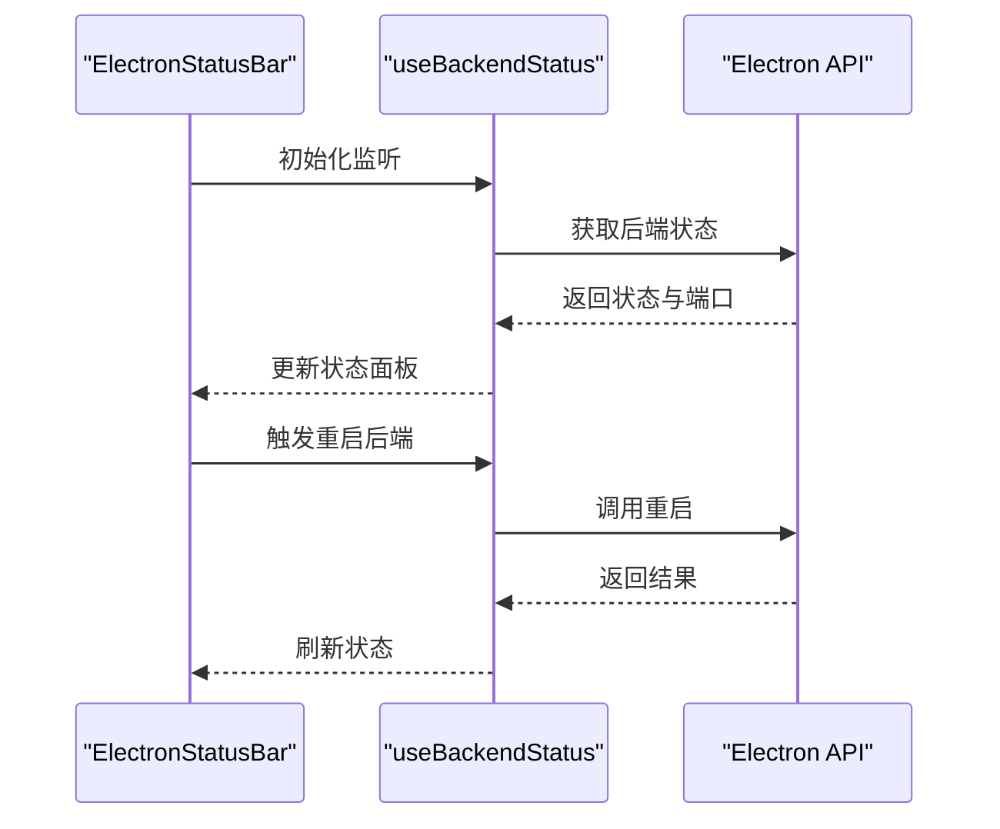
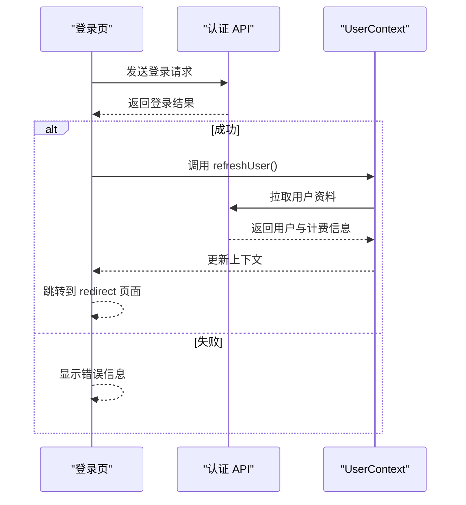
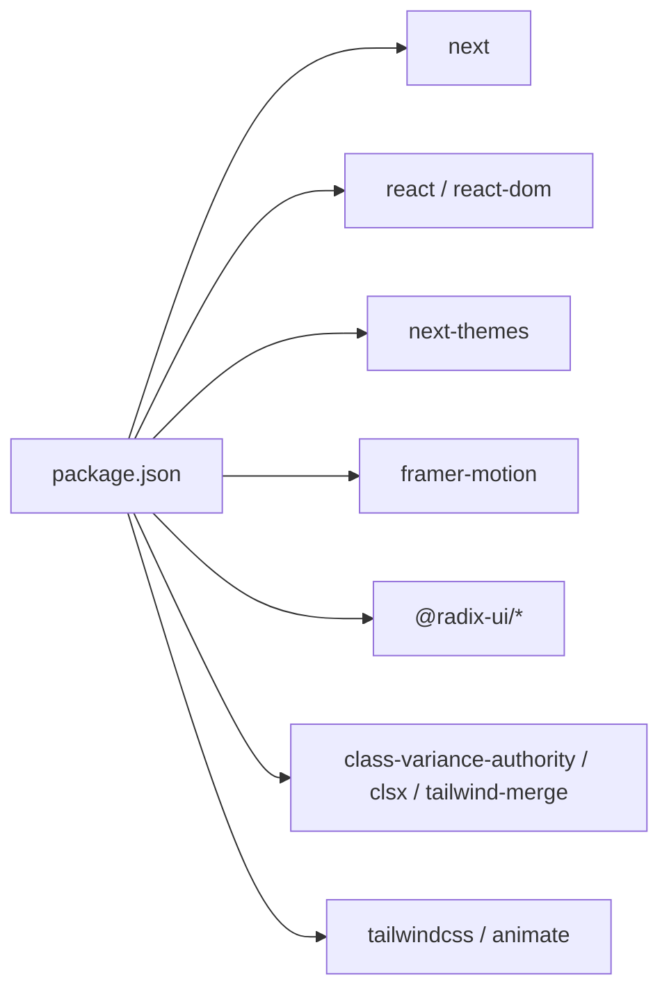

# 图形化界面

<cite>
**本文引用的文件**
- [front\app\layout.tsx](file://front/app/layout.tsx)
- [front\app\globals.css](file://front/app/globals.css)
- [front\app\components\Sidebar.tsx](file://front/app/components/Sidebar.tsx)
- [front\app\components\PageHeader.tsx](file://front/app/components/PageHeader.tsx)
- [front\app\components\ContentArea.tsx](file://front/app/components/ContentArea.tsx)
- [front\app\components\ElectronStatusBar.tsx](file://front/app/components/ElectronStatusBar.tsx)
- [front\lib\auth-context.tsx](file://front/lib/auth-context.tsx)
- [front\lib\api-config.ts](file://front/lib/api-config.ts)
- [front\hooks\useBackendStatus.ts](file://front/hooks/useBackendStatus.ts)
- [front\lib\electron.ts](file://front/lib/electron.ts)
- [front\tailwind.config.ts](file://front/tailwind.config.ts)
- [front\package.json](file://front/package.json)
- [front\app\auth\login\page.tsx](file://front/app/auth/login/page.tsx)
- [front\components\ui\button.tsx](file://front/components/ui/button.tsx)
- [front\components\ui\card.tsx](file://front/components/ui/card.tsx)
</cite>

## 目录
1. [简介](#简介)
2. [项目结构](#项目结构)
3. [核心组件](#核心组件)
4. [架构总览](#架构总览)
5. [详细组件分析](#详细组件分析)
6. [依赖关系分析](#依赖关系分析)
7. [性能考虑](#性能考虑)
8. [故障排查指南](#故障排查指南)
9. [结论](#结论)
10. [附录](#附录)

## 简介
本技术文档面向图形化界面功能，系统性阐述网页管理界面的设计理念、用户交互流程与技术实现。文档聚焦前端组件架构（布局系统、侧边栏导航、页面头部组件等）、响应式设计与主题切换、国际化支持现状与扩展建议、界面定制化配置方法（颜色主题、布局选项、用户偏好设置），并提供界面截图与使用示例，帮助用户快速上手与配置。

## 项目结构
前端采用 Next.js App Router 架构，根布局负责全局主题、用户上下文与 Electron 状态栏集成；侧边栏承担导航与健康检查；内容区域承载页面级路由；页面头部组件提供统一的标题与动作区；UI 组件库基于 Radix 和 shadcn/ui 风格，TailwindCSS 提供原子化样式与暗色模式支持。

**图表来源**
- [front/app/layout.tsx:16-52](file://front/app/layout.tsx#L16-L52)
- [front/app/components/Sidebar.tsx:13-307](file://front/app/components/Sidebar.tsx#L13-L307)
- [front/app/components/ContentArea.tsx:6-23](file://front/app/components/ContentArea.tsx#L6-L23)
- [front/app/components/ElectronStatusBar.tsx:8-158](file://front/app/components/ElectronStatusBar.tsx#L8-L158)
- [front/app/globals.css:1-158](file://front/app/globals.css#L1-L158)
- [front/lib/auth-context.tsx:35-109](file://front/lib/auth-context.tsx#L35-L109)

**章节来源**
- [front/app/layout.tsx:16-52](file://front/app/layout.tsx#L16-L52)
- [front/app/globals.css:1-158](file://front/app/globals.css#L1-L158)
- [front\tailwind.config.ts:1-138](file://front/tailwind.config.ts#L1-L138)

## 核心组件
- 根布局 RootLayout：统一注入主题、用户上下文、动态 Electron 状态栏，定义页面容器与全局样式。
- 侧边栏 Sidebar：导航菜单、健康检查指示、主题切换、用户信息与计费展示。
- 内容区域 ContentArea：页面级动画过渡、容器与内边距。
- 页面头部 PageHeader：标题、副标题、图标与操作区，统一视觉风格。
- Electron 状态栏 ElectronStatusBar：后端状态监控、日志打开、更新检查与重启控制。
- 用户上下文 UserContext：登录状态、用户资料与计费信息拉取与缓存。
- API 配置 API_PATHS：集中管理后端 API 地址，支持环境变量覆盖。
- UI 组件 Button、Card：遵循 Bento 风格阴影与圆角，提供变体与尺寸。

**章节来源**
- [front/app/layout.tsx:16-52](file://front/app/layout.tsx#L16-L52)
- [front/app/components/Sidebar.tsx:13-307](file://front/app/components/Sidebar.tsx#L13-L307)
- [front/app/components/ContentArea.tsx:6-23](file://front/app/components/ContentArea.tsx#L6-L23)
- [front/app/components/PageHeader.tsx:5-63](file://front/app/components/PageHeader.tsx#L5-L63)
- [front/app/components/ElectronStatusBar.tsx:8-158](file://front/app/components/ElectronStatusBar.tsx#L8-L158)
- [front/lib/auth-context.tsx:35-109](file://front/lib/auth-context.tsx#L35-L109)
- [front/lib/api-config.ts:1-99](file://front/lib/api-config.ts#L1-L99)
- [front/components/ui/button.tsx:7-57](file://front/components/ui/button.tsx#L7-L57)
- [front/components/ui/card.tsx:5-79](file://front/components/ui/card.tsx#L5-L79)

## 架构总览
图形化界面以“布局-导航-内容-状态栏”四层结构组织，配合用户上下文与主题系统，形成可扩展的管理界面骨架。侧边栏通过健康检查与主题切换增强用户体验；内容区域通过路径键驱动的动画提升页面切换流畅度；Electron 状态栏在桌面端提供后端状态可视化与运维能力。

**图表来源**
- [front/app/layout.tsx:33-48](file://front/app/layout.tsx#L33-L48)
- [front/lib/auth-context.tsx:35-109](file://front/lib/auth-context.tsx#L35-L109)
- [front/app/components/Sidebar.tsx:13-307](file://front/app/components/Sidebar.tsx#L13-L307)
- [front/app/components/ContentArea.tsx:6-23](file://front/app/components/ContentArea.tsx#L6-L23)
- [front/app/components/PageHeader.tsx:5-63](file://front/app/components/PageHeader.tsx#L5-L63)
- [front/app/components/ElectronStatusBar.tsx:8-158](file://front/app/components/ElectronStatusBar.tsx#L8-L158)
- [front/app/globals.css:1-158](file://front/app/globals.css#L1-L158)
- [front\tailwind.config.ts:1-138](file://front/tailwind.config.ts#L1-L138)

## 详细组件分析

### 布局系统与主题切换
- RootLayout 使用 next-themes 将主题切换绑定到 HTML class 属性，默认浅色，禁用系统跟随，确保一致性。
- 全局样式通过 Tailwind 基础层与暗色变量覆盖，提供丰富的语义化颜色与阴影系统。
- ContentArea 以路径键作为动画 key，保证页面切换时的过渡效果与状态隔离。

**图表来源**
- [front/app/layout.tsx:33-48](file://front/app/layout.tsx#L33-L48)
- [front/app/globals.css:5-72](file://front/app/globals.css#L5-L72)
- [front/app/components/ContentArea.tsx:10-17](file://front/app/components/ContentArea.tsx#L10-L17)

**章节来源**
- [front/app/layout.tsx:33-48](file://front/app/layout.tsx#L33-L48)
- [front/app/globals.css:5-72](file://front/app/globals.css#L5-L72)
- [front\tailwind.config.ts:20-102](file://front/tailwind.config.ts#L20-L102)

### 侧边栏导航与健康检查
- 导航分组：环境配置与平台配置两大模块，每个条目包含图标、标签与高亮态。
- 健康检查：每 30 秒轮询后端健康接口，优先使用自定义健康端点，回退至 Spring Boot Actuator；状态以脉冲点与文案呈现。
- 主题切换：按钮在挂载后根据当前主题显示对应图标与文案。
- 用户态：未登录显示提示，已登录展示用户名、计费次数与 VIP 标识；底部提供用户管理与充值入口。

**图表来源**
- [front/app/components/Sidebar.tsx:23-66](file://front/app/components/Sidebar.tsx#L23-L66)
- [front/lib/api-config.ts:8-10](file://front/lib/api-config.ts#L8-L10)

**章节来源**
- [front/app/components/Sidebar.tsx:68-241](file://front/app/components/Sidebar.tsx#L68-L241)
- [front/lib/api-config.ts:1-99](file://front/lib/api-config.ts#L1-L99)

### 页面头部组件与动作区
- PageHeader 支持图标、标题、副标题与动作区，提供多阶段入场动画，强调视觉层次。
- 动作区可传入任意节点，便于在不同页面插入“保存”、“新建”、“导出”等操作。

**图表来源**
- [front/app/components/PageHeader.tsx:21-61](file://front/app/components/PageHeader.tsx#L21-L61)

**章节来源**
- [front/app/components/PageHeader.tsx:5-63](file://front/app/components/PageHeader.tsx#L5-L63)

### Electron 状态栏与后端运维
- ElectronStatusBar 仅在 Electron 环境中渲染，提供后端状态指示、重启后端、打开日志与检查更新功能。
- useBackendStatus 提供状态轮询、日志监听与重启控制，结合 Electron API 实现本地化运维体验。

**图表来源**
- [front/app/components/ElectronStatusBar.tsx:8-158](file://front/app/components/ElectronStatusBar.tsx#L8-L158)
- [front/hooks\useBackendStatus.ts:11-99](file://front/hooks/useBackendStatus.ts#L11-L99)
- [front\lib\electron.ts:6-48](file://front/lib/electron.ts#L6-L48)

**章节来源**
- [front/app/components/ElectronStatusBar.tsx:8-158](file://front/app/components/ElectronStatusBar.tsx#L8-L158)
- [front/hooks\useBackendStatus.ts:11-99](file://front/hooks/useBackendStatus.ts#L11-L99)
- [front\lib\electron.ts:6-48](file://front/lib/electron.ts#L6-L48)

### 用户上下文与认证流程
- UserContext 在初始化时读取本地 Token 与用户信息，若后端用户资料接口不可用则回退到本地存储。
- 登录页支持多种账号输入方式，提交后刷新用户信息并按 redirect 参数跳转。

**图表来源**
- [front\app\auth\login\page.tsx:21-47](file://front/app/auth/login/page.tsx#L21-L47)
- [front\lib\auth-context.tsx:71-94](file://front/lib/auth-context.tsx#L71-L94)

**章节来源**
- [front\lib\auth-context.tsx:35-109](file://front/lib/auth-context.tsx#L35-L109)
- [front\app\auth\login\page.tsx:9-117](file://front/app/auth/login/page.tsx#L9-L117)

### 响应式设计与主题系统
- Tailwind 配置启用暗色模式 class，全局样式通过 CSS 变量定义明/暗两套配色，确保组件在不同主题下保持一致的对比度与可读性。
- 页面容器最大宽度与内边距适配多屏设备，组件阴影与圆角遵循 Bento 风格，提升卡片与对话框的层级感。

**章节来源**
- [front\tailwind.config.ts:4-102](file://front/tailwind.config.ts#L4-L102)
- [front\app\globals.css:5-72](file://front/app/globals.css#L5-L72)

### 国际化支持现状与扩展建议
- 当前界面文本以中文为主，未发现内置 i18n 框架或语言切换逻辑。
- 建议引入 next-i18next 或 react-intl，在根布局注入语言切换器，并为关键文案建立翻译键值对，逐步迁移页面与组件中的硬编码文本。

[本节为概念性建议，不直接分析具体文件，故无“章节来源”]

## 依赖关系分析
- 核心依赖：Next.js 16、React 19、next-themes、framer-motion、lucide-react、tailwindcss-animate。
- UI 组件库：Radix Slots、class-variance-authority、clsx、tailwind-merge。
- 样式系统：TailwindCSS + 自定义 CSS 变量与阴影扩展。

**图表来源**
- [front\package.json:15-31](file://front/package.json#L15-L31)

**章节来源**
- [front\package.json:15-31](file://front/package.json#L15-L31)

## 性能考虑
- 动画与过渡：Framer Motion 的入场动画与 ContentArea 的路径键过渡，建议避免在长列表或大量子树中重复触发，必要时使用 React.memo 或懒加载。
- 主题切换：next-themes 通过 class 切换，避免不必要的重排；建议减少全局样式的动态变更频率。
- 健康检查：侧边栏健康轮询间隔为 30 秒，属于低频操作；如页面较多可合并为单一轮询源。
- Electron 状态栏：状态轮询与日志监听在主进程开启时才生效，避免在浏览器环境中产生无效调用。

[本节提供通用指导，不直接分析具体文件，故无“章节来源”]

## 故障排查指南
- 无法切换主题：确认 next-themes 的默认主题与系统跟随设置；检查 HTML class 是否正确切换。
- 侧边栏健康状态异常：检查 API_PATHS 中健康接口地址与网络连通性；确认后端是否返回标准状态字段。
- 登录后页面未刷新用户信息：检查 UserContext 的 refreshUser 流程与后端用户资料接口；确认 Token 与本地存储的一致性。
- Electron 状态栏不显示：确认 isElectron 判断与 window.electronAPI 注入；检查后端状态轮询与事件监听是否注册成功。

**章节来源**
- [front\lib\api-config.ts:4-10](file://front/lib/api-config.ts#L4-L10)
- [front\lib\auth-context.tsx:47-94](file://front/lib/auth-context.tsx#L47-L94)
- [front\lib\electron.ts:6-48](file://front/lib/electron.ts#L6-L48)
- [front\hooks\useBackendStatus.ts:11-61](file://front/hooks/useBackendStatus.ts#L11-L61)

## 结论
该图形化界面以清晰的布局分层、稳定的主题与上下文体系、可扩展的 UI 组件库为基础，结合健康检查与 Electron 运维能力，提供了良好的管理体验。建议后续完善国际化支持、优化动画性能与资源加载，并持续沉淀组件与样式规范，以提升可维护性与一致性。

[本节为总结性内容，不直接分析具体文件，故无“章节来源”]

## 附录

### 界面截图与使用示例
- 登录页：提供用户名/邮箱/手机号与密码输入，支持错误提示与加载状态。
- 侧边栏：导航分组、健康状态指示、主题切换、用户信息与计费展示。
- 页面头部：标题、副标题与动作区，适用于各配置页面。
- Electron 状态栏：后端状态、重启后端、打开日志、检查更新。

**章节来源**
- [front\app\auth\login\page.tsx:49-117](file://front/app/auth/login/page.tsx#L49-L117)
- [front\app\components\Sidebar.tsx:88-304](file://front/app/components/Sidebar.tsx#L88-L304)
- [front\app\components\PageHeader.tsx:20-63](file://front/app/components/PageHeader.tsx#L20-L63)
- [front\app\components\ElectronStatusBar.tsx:91-157](file://front/app/components/ElectronStatusBar.tsx#L91-L157)

### 界面定制化配置方法
- 颜色主题：通过 next-themes 的主题切换按钮在浅色/深色之间切换；可在初始化时调整默认主题与系统跟随策略。
- 布局选项：ContentArea 的容器与内边距已适配多屏；如需调整最大宽度，可在 Tailwind 配置中修改容器 screens。
- 用户偏好设置：UserContext 提供用户与计费信息，可在登录页或用户管理页扩展更多偏好项（如语言、时区等）。

**章节来源**
- [front\app\layout.tsx:33-37](file://front/app/layout.tsx#L33-L37)
- [front\tailwind.config.ts:13-19](file://front/tailwind.config.ts#L13-L19)
- [front\lib\auth-context.tsx:24-31](file://front/lib/auth-context.tsx#L24-L31)