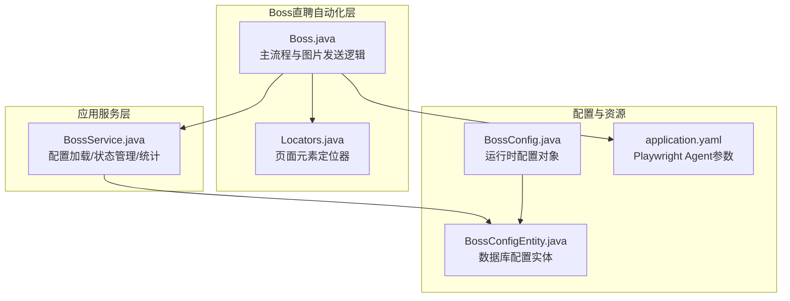
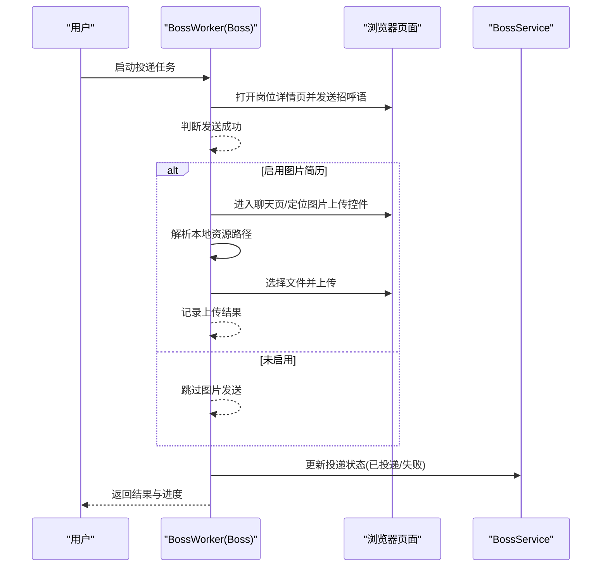
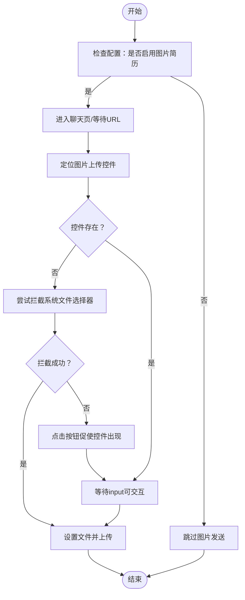
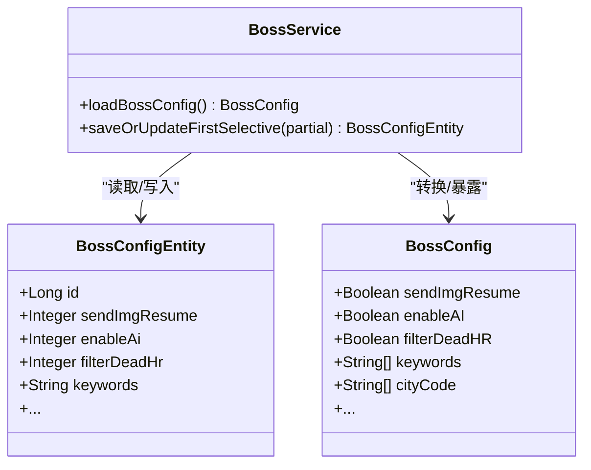
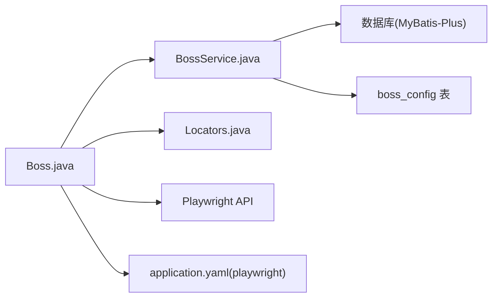

# 图片简历发送

<cite>
**本文引用的文件**
- [Boss.java](file://backend/src/main/java/com/getjobs/worker/boss/Boss.java)
- [BossConfig.java](file://backend/src/main/java/com/getjobs/worker/boss/BossConfig.java)
- [BossConfigEntity.java](file://backend/src/main/java/com/getjobs/application/entity/BossConfigEntity.java)
- [BossService.java](file://backend/src/main/java/com/getjobs/application/service/BossService.java)
- [Locators.java](file://backend/src/main/java/com/getjobs/worker/boss/Locators.java)
- [application.yaml](file://backend/src/main/resources/application.yaml)
- [README.md](file://README.md)
- [backend/README.md](file://backend/README.md)
</cite>

## 目录
1. [简介](#简介)
2. [项目结构](#项目结构)
3. [核心组件](#核心组件)
4. [架构总览](#架构总览)
5. [详细组件分析](#详细组件分析)
6. [依赖分析](#依赖分析)
7. [性能考虑](#性能考虑)
8. [故障排查指南](#故障排查指南)
9. [结论](#结论)
10. [附录](#附录)

## 简介
本功能面向Boss直聘平台，提供“图片简历”自动发送能力：在成功发送招呼语后，自动定位聊天页面的图片上传控件，将本地预置的图片简历文件上传至HR，从而提升HR查看意愿与回复率。该功能与AI智能匹配、黑名单过滤、投递状态管理等模块协同工作，形成完整的自动化投递闭环。

## 项目结构
与图片简历发送直接相关的后端模块位于 worker/boss 与 application/service 层，配置来源于数据库表 boss_config，UI配置入口位于前端页面，运行参数由 Playwright Agent 控制。

**图示来源**
- [Boss.java:1-1173](file://backend/src/main/java/com/getjobs/worker/boss/Boss.java#L1-L1173)
- [Locators.java:1-63](file://backend/src/main/java/com/getjobs/worker/boss/Locators.java#L1-L63)
- [BossService.java:1-1129](file://backend/src/main/java/com/getjobs/application/service/BossService.java#L1-L1129)
- [BossConfig.java:1-107](file://backend/src/main/java/com/getjobs/worker/boss/BossConfig.java#L1-L107)
- [BossConfigEntity.java:1-57](file://backend/src/main/java/com/getjobs/application/entity/BossConfigEntity.java#L1-L57)
- [application.yaml:70-101](file://backend/src/main/resources/application.yaml#L70-L101)

**章节来源**
- [Boss.java:1-1173](file://backend/src/main/java/com/getjobs/worker/boss/Boss.java#L1-L1173)
- [BossService.java:1-1129](file://backend/src/main/java/com/getjobs/application/service/BossService.java#L1-L1129)
- [application.yaml:70-101](file://backend/src/main/resources/application.yaml#L70-L101)

## 核心组件
- Boss.java：负责投递全流程，包含发送招呼语、进入聊天、定位图片上传控件、选择文件并上传等步骤；提供 sendImageResume 与 resumeSubmission 两个关键方法。
- BossConfig.java：运行时配置对象，包含是否启用图片简历开关、AI开关、过滤开关等。
- BossConfigEntity.java：数据库配置实体，对应 boss_config 表字段，支持保存/更新/加载。
- BossService.java：配置加载与持久化、投递状态更新、统计数据计算等。
- Locators.java：集中管理页面元素定位表达式，保证图片上传控件定位稳定。
- application.yaml：Playwright Agent 的超时、重试、页面池等参数，影响图片上传稳定性。

**章节来源**
- [Boss.java:612-777](file://backend/src/main/java/com/getjobs/worker/boss/Boss.java#L612-L777)
- [Boss.java:860-934](file://backend/src/main/java/com/getjobs/worker/boss/Boss.java#L860-L934)
- [BossConfig.java:87-90](file://backend/src/main/java/com/getjobs/worker/boss/BossConfig.java#L87-L90)
- [BossConfigEntity.java:44-47](file://backend/src/main/java/com/getjobs/application/entity/BossConfigEntity.java#L44-L47)
- [BossService.java:304-366](file://backend/src/main/java/com/getjobs/application/service/BossService.java#L304-L366)
- [Locators.java:42-49](file://backend/src/main/java/com/getjobs/worker/boss/Locators.java#L42-L49)
- [application.yaml:70-101](file://backend/src/main/resources/application.yaml#L70-L101)

## 架构总览
图片简历发送在“发送招呼语成功”的前提下触发，流程如下：

**图示来源**
- [Boss.java:612-777](file://backend/src/main/java/com/getjobs/worker/boss/Boss.java#L612-L777)
- [Boss.java:860-934](file://backend/src/main/java/com/getjobs/worker/boss/Boss.java#L860-L934)
- [BossService.java:664-677](file://backend/src/main/java/com/getjobs/application/service/BossService.java#L664-L677)

## 详细组件分析

### 图片简历发送流程（核心逻辑）
- 触发条件：发送招呼语成功后，且配置启用 sendImgResume。
- 定位策略：优先使用 aria-label 或 accept 属性精确定位图片输入控件；若未渲染，拦截系统文件选择器；若仍失败，通过点击按钮促使控件出现。
- 文件选择：从类路径或临时文件读取 /resume.jpg；若资源缺失，记录错误并跳过。
- 上传执行：设置文件路径并等待控件可用，随后 setInputFiles 触发上传。

**图示来源**
- [Boss.java:860-934](file://backend/src/main/java/com/getjobs/worker/boss/Boss.java#L860-L934)
- [Locators.java:42-49](file://backend/src/main/java/com/getjobs/worker/boss/Locators.java#L42-L49)

**章节来源**
- [Boss.java:860-934](file://backend/src/main/java/com/getjobs/worker/boss/Boss.java#L860-L934)
- [Locators.java:42-49](file://backend/src/main/java/com/getjobs/worker/boss/Locators.java#L42-L49)

### 配置加载与持久化
- 数据库配置：boss_config 表中的 sendImgResume 字段控制是否发送图片简历。
- 运行时配置：BossService.loadBossConfig 将数据库配置转换为 BossConfig 对象，布尔字段统一解析为 true/false。
- 保存/更新：支持选择性更新，仅覆盖非空字段，避免误清空配置。

**图示来源**
- [BossConfigEntity.java:44-47](file://backend/src/main/java/com/getjobs/application/entity/BossConfigEntity.java#L44-L47)
- [BossConfig.java:87-90](file://backend/src/main/java/com/getjobs/worker/boss/BossConfig.java#L87-L90)
- [BossService.java:304-366](file://backend/src/main/java/com/getjobs/application/service/BossService.java#L304-L366)

**章节来源**
- [BossConfigEntity.java:1-57](file://backend/src/main/java/com/getjobs/application/entity/BossConfigEntity.java#L1-L57)
- [BossConfig.java:1-107](file://backend/src/main/java/com/getjobs/worker/boss/BossConfig.java#L1-L107)
- [BossService.java:304-366](file://backend/src/main/java/com/getjobs/application/service/BossService.java#L304-L366)

### 与AI智能匹配的配合
- 当启用 AI 时，会基于JD生成个性化招呼语；图片简历发送在AI生成之后进行，二者共同提升HR互动概率。
- 若AI请求失败或返回无效内容，将回退到默认招呼语，不影响图片发送流程。

**章节来源**
- [Boss.java:695-703](file://backend/src/main/java/com/getjobs/worker/boss/Boss.java#L695-L703)
- [Boss.java:1074-1093](file://backend/src/main/java/com/getjobs/worker/boss/Boss.java#L1074-L1093)

### 与黑名单功能的协调
- 投递前会基于黑名单过滤岗位，命中黑名单的岗位不会进入发送流程；图片简历发送仅作用于已通过过滤并成功发送招呼语的岗位。
- 黑名单来源包括：聊天记录识别、数据库配置、公共黑名单表等。

**章节来源**
- [Boss.java:380-408](file://backend/src/main/java/com/getjobs/worker/boss/Boss.java#L380-L408)
- [BossService.java:449-511](file://backend/src/main/java/com/getjobs/application/service/BossService.java#L449-L511)

### 与投递状态管理的集成
- 发送成功后，根据详情页URL提取 encrypt_id/encrypt_user_id，更新 boss_data 表的 delivery_status 为“已投递”；失败则更新为“投递失败”。
- 结果列表中记录成功投递的岗位，便于统计与导出。

**章节来源**
- [Boss.java:747-777](file://backend/src/main/java/com/getjobs/worker/boss/Boss.java#L747-L777)
- [BossService.java:664-677](file://backend/src/main/java/com/getjobs/application/service/BossService.java#L664-L677)

## 依赖分析
- 组件耦合
  - Boss.java 依赖 BossService 进行配置加载与状态更新；依赖 Locators 提升页面元素定位稳定性；依赖 Playwright API 完成文件上传。
  - BossService 依赖数据库访问层（MyBatis-Plus）与 DataSource，负责配置与数据的持久化。
- 外部依赖
  - Playwright Agent：通过 application.yaml 的 playwright.* 参数控制导航超时、重试、页面池大小等，直接影响图片上传的稳定性。
  - 资源文件：/resume.jpg 必须存在于类路径或打包产物中，否则跳过图片发送。

**图示来源**
- [Boss.java:1-1173](file://backend/src/main/java/com/getjobs/worker/boss/Boss.java#L1-L1173)
- [BossService.java:1-1129](file://backend/src/main/java/com/getjobs/application/service/BossService.java#L1-L1129)
- [application.yaml:70-101](file://backend/src/main/resources/application.yaml#L70-L101)

**章节来源**
- [Boss.java:1-1173](file://backend/src/main/java/com/getjobs/worker/boss/Boss.java#L1-L1173)
- [BossService.java:1-1129](file://backend/src/main/java/com/getjobs/application/service/BossService.java#L1-L1129)
- [application.yaml:70-101](file://backend/src/main/resources/application.yaml#L70-L101)

## 性能考虑
- 页面等待与重试
  - 导航超时与重试次数在 application.yaml 中配置，建议根据网络状况适当放宽，避免因页面加载慢导致上传失败。
  - 图片上传前等待 input 可交互，超时阈值为10秒，确保控件渲染完成后再执行 setInputFiles。
- 资源文件
  - 若 /resume.jpg 位于JAR外部或类路径不可见，将创建临时文件拷贝，建议将图片置于 src/main/resources 并确保打包包含。
- 并发与页面池
  - Playwright 最大页面数限制为4，投递并发过高时应降低并发或增加页面池上限，避免页面回收导致上传中断。

**章节来源**
- [application.yaml:70-101](file://backend/src/main/resources/application.yaml#L70-L101)
- [Boss.java:906-911](file://backend/src/main/java/com/getjobs/worker/boss/Boss.java#L906-L911)
- [Boss.java:918-934](file://backend/src/main/java/com/getjobs/worker/boss/Boss.java#L918-L934)

## 故障排查指南
- 未找到“继续沟通/立即沟通”按钮
  - 现象：日志提示未找到按钮，跳过图片发送。
  - 排查：确认岗位详情页是否加载成功、聊天按钮是否可见；检查 Locators 中的定位表达式是否适配当前页面结构。
- 未找到图片上传控件
  - 现象：控件不存在或未渲染。
  - 排查：尝试拦截系统文件选择器；若仍失败，点击按钮促使控件出现；确认 accept 属性与 aria-label 是否匹配。
- 资源文件不存在
  - 现象：抛出资源文件未找到异常，跳过图片发送。
  - 排查：将 /resume.jpg 放置于 src/main/resources 目录并重新打包；或确保运行时类路径可见。
- 上传失败
  - 现象：捕获异常并记录错误日志。
  - 排查：检查文件路径是否正确、input 是否可交互、网络是否稳定；适当增大导航超时与重试次数。

**章节来源**
- [Boss.java:860-934](file://backend/src/main/java/com/getjobs/worker/boss/Boss.java#L860-L934)
- [Boss.java:912-915](file://backend/src/main/java/com/getjobs/worker/boss/Boss.java#L912-L915)

## 结论
图片简历发送功能在Boss直聘投递流程中扮演“加速HR查看”的角色：在AI智能匹配与黑名单过滤的基础上，通过稳定的页面元素定位与健壮的上传流程，进一步提升简历回复率。合理配置 Playwright Agent 参数、确保 /resume.jpg 资源可用、以及与AI/黑名单模块的协同，是实现高成功率的关键。

## 附录

### 配置方法与要求
- 简历文件准备
  - 将图片简历命名为 resume.jpg，放置于 src/main/resources 目录并重新打包；确保运行时类路径可见。
- 发送开关设置
  - 在 boss_config 表中设置 sendImgResume 字段为启用（1）；或通过前端配置入口勾选相应开关。
- 格式要求
  - 建议使用JPG格式，尺寸与比例适配HR阅读习惯；文件体积不宜过大，避免上传超时。
- 运行参数优化
  - 在 application.yaml 中根据网络状况适当提高 playwright.navigation-timeout 与 max-retries，确保页面与上传稳定。

**章节来源**
- [BossConfigEntity.java:44-47](file://backend/src/main/java/com/getjobs/application/entity/BossConfigEntity.java#L44-L47)
- [application.yaml:70-101](file://backend/src/main/resources/application.yaml#L70-L101)
- [README.md:44-46](file://README.md#L44-L46)
- [backend/README.md:44-46](file://backend/README.md#L44-L46)

### 实际使用效果与最佳实践
- 使用效果
  - 在发送招呼语后自动上传图片简历，显著缩短HR索要简历的时间，提升回复率。
- 发送策略优化
  - 与AI智能匹配结合：先生成个性化招呼语，再发送图片简历，增强HR兴趣。
  - 与黑名单协调：仅对未命中黑名单的岗位发送图片简历，避免无效投递。
  - 与投递状态联动：成功/失败均更新数据库状态，便于统计与复盘。

**章节来源**
- [Boss.java:695-703](file://backend/src/main/java/com/getjobs/worker/boss/Boss.java#L695-L703)
- [Boss.java:747-777](file://backend/src/main/java/com/getjobs/worker/boss/Boss.java#L747-L777)
- [BossService.java:664-677](file://backend/src/main/java/com/getjobs/application/service/BossService.java#L664-L677)