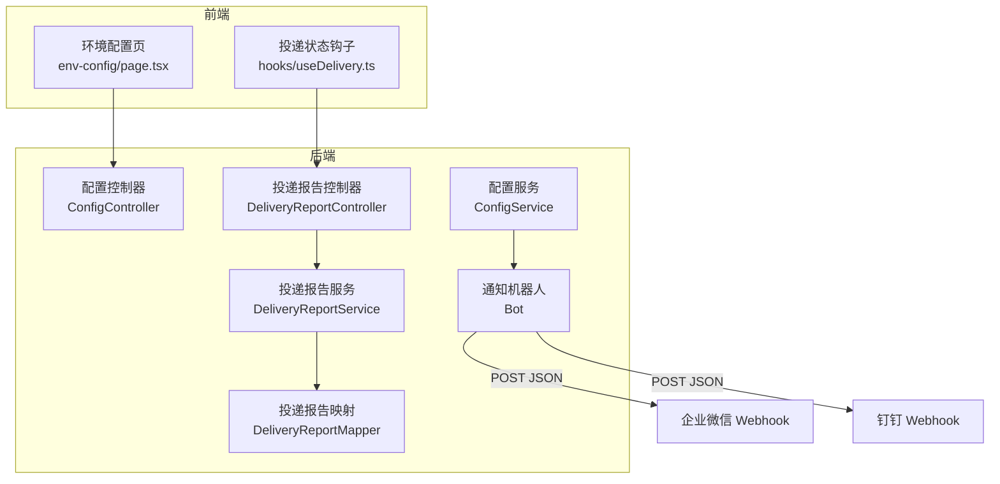
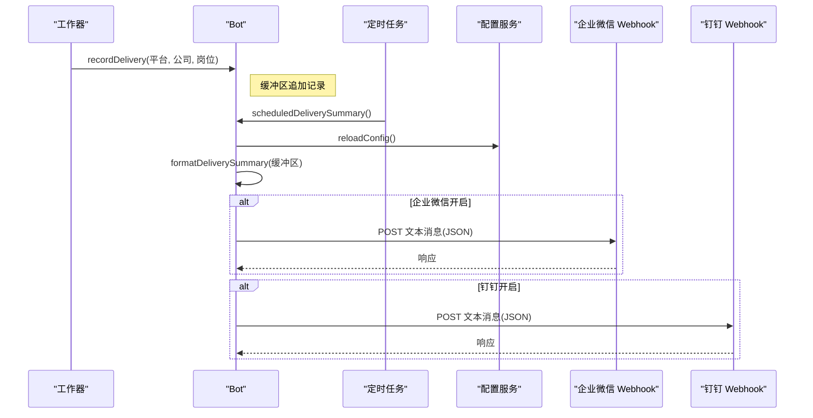
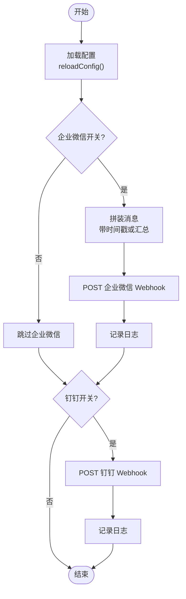
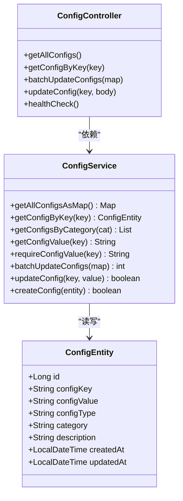
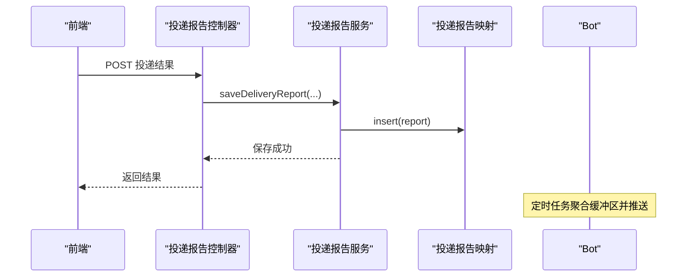
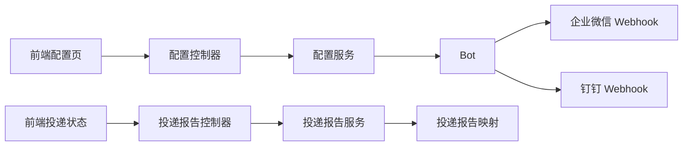

# 实时通知

<cite>
**本文引用的文件**
- [Bot.java](file://backend/src/main/java/com/getjobs/worker/utils/Bot.java)
- [ConfigService.java](file://backend/src/main/java/com/getjobs/application/service/ConfigService.java)
- [ConfigEntity.java](file://backend/src/main/java/com/getjobs/application/entity/ConfigEntity.java)
- [ConfigController.java](file://backend/src/main/java/com/getjobs/application/controller/ConfigController.java)
- [application.yaml](file://backend/src/main/resources/application.yaml)
- [page.tsx](file://front/app/env-config/page.tsx)
- [useDelivery.ts](file://front/hooks/useDelivery.ts)
- [DeliveryReportService.java](file://backend/src/main/java/com/getjobs/application/service/DeliveryReportService.java)
- [DeliveryReportController.java](file://backend/src/main/java/com/getjobs/application/controller/DeliveryReportController.java)
- [DeliveryReportMapper.java](file://backend/src/main/java/com/getjobs/application/mapper/DeliveryReportMapper.java)
</cite>

## 目录
1. [简介](#简介)
2. [项目结构](#项目结构)
3. [核心组件](#核心组件)
4. [架构总览](#架构总览)
5. [详细组件分析](#详细组件分析)
6. [依赖关系分析](#依赖关系分析)
7. [性能考虑](#性能考虑)
8. [故障排查指南](#故障排查指南)
9. [结论](#结论)
10. [附录](#附录)

## 简介
本文件面向“实时通知”功能，系统性阐述企业微信机器人推送的实现机制，涵盖消息格式、推送时机、错误处理、通知内容生成逻辑、配置方法、使用示例以及与投递报告、黑名单等模块的联动方式。目标是帮助开发者与运营人员快速理解并正确配置与使用该通知体系。

## 项目结构
通知功能横跨后端与前端两部分：
- 后端负责配置管理、定时聚合推送、企业微信/钉钉 Webhook 推送、投递报告持久化。
- 前端负责配置界面展示与开关控制、投递进度订阅与展示。

图表来源
- [page.tsx:149-214](file://front/app/env-config/page.tsx#L149-L214)
- [useDelivery.ts:85-186](file://front/hooks/useDelivery.ts#L85-L186)
- [ConfigController.java:1-170](file://backend/src/main/java/com/getjobs/application/controller/ConfigController.java#L1-L170)
- [ConfigService.java:1-288](file://backend/src/main/java/com/getjobs/application/service/ConfigService.java#L1-L288)
- [Bot.java:1-229](file://backend/src/main/java/com/getjobs/worker/utils/Bot.java#L1-L229)
- [DeliveryReportService.java:49-72](file://backend/src/main/java/com/getjobs/application/service/DeliveryReportService.java#L49-L72)
- [DeliveryReportController.java:42-62](file://backend/src/main/java/com/getjobs/application/controller/DeliveryReportController.java#L42-L62)
- [DeliveryReportMapper.java:1-12](file://backend/src/main/java/com/getjobs/application/mapper/DeliveryReportMapper.java#L1-L12)

章节来源
- [page.tsx:149-214](file://front/app/env-config/page.tsx#L149-L214)
- [useDelivery.ts:85-186](file://front/hooks/useDelivery.ts#L85-L186)
- [ConfigController.java:1-170](file://backend/src/main/java/com/getjobs/application/controller/ConfigController.java#L1-L170)
- [ConfigService.java:1-288](file://backend/src/main/java/com/getjobs/application/service/ConfigService.java#L1-L288)
- [Bot.java:1-229](file://backend/src/main/java/com/getjobs/worker/utils/Bot.java#L1-L229)
- [DeliveryReportService.java:49-72](file://backend/src/main/java/com/getjobs/application/service/DeliveryReportService.java#L49-L72)
- [DeliveryReportController.java:42-62](file://backend/src/main/java/com/getjobs/application/controller/DeliveryReportController.java#L42-L62)
- [DeliveryReportMapper.java:1-12](file://backend/src/main/java/com/getjobs/application/mapper/DeliveryReportMapper.java#L1-L12)

## 核心组件
- 通知机器人 Bot：负责从配置中心加载企业微信/钉钉配置，定时聚合投递记录并推送，支持带时间戳的消息格式化。
- 配置服务与控制器：提供配置的增删改查与批量更新能力，支撑 Bot 的动态配置加载。
- 投递报告服务与控制器：负责投递结果的统计与持久化，便于后续通知内容生成与审计。
- 前端配置页与钩子：提供 Webhook 开关与 URL 配置入口，以及投递进度订阅与展示。

章节来源
- [Bot.java:1-229](file://backend/src/main/java/com/getjobs/worker/utils/Bot.java#L1-L229)
- [ConfigService.java:1-288](file://backend/src/main/java/com/getjobs/application/service/ConfigService.java#L1-L288)
- [ConfigController.java:1-170](file://backend/src/main/java/com/getjobs/application/controller/ConfigController.java#L1-L170)
- [DeliveryReportService.java:49-72](file://backend/src/main/java/com/getjobs/application/service/DeliveryReportService.java#L49-L72)
- [DeliveryReportController.java:42-62](file://backend/src/main/java/com/getjobs/application/controller/DeliveryReportController.java#L42-L62)
- [page.tsx:149-214](file://front/app/env-config/page.tsx#L149-L214)
- [useDelivery.ts:85-186](file://front/hooks/useDelivery.ts#L85-L186)

## 架构总览
通知系统采用“配置驱动 + 定时聚合 + 即时推送”的模式：
- 配置层：通过配置表存储 HOOK_URL、BOT_IS_SEND、DINGTALK_HOOK_URL、DINGTALK_IS_SEND 等键值，Bot 启动与定时任务会重新加载。
- 采集层：工作器在投递过程中调用静态方法记录投递信息到内存缓冲区。
- 聚合层：定时任务每 5 分钟聚合一次，生成汇总消息。
- 推送层：根据开关状态向企业微信与/或钉钉推送文本消息。

图表来源
- [Bot.java:67-75](file://backend/src/main/java/com/getjobs/worker/utils/Bot.java#L67-L75)
- [Bot.java:169-186](file://backend/src/main/java/com/getjobs/worker/utils/Bot.java#L169-L186)
- [Bot.java:84-114](file://backend/src/main/java/com/getjobs/worker/utils/Bot.java#L84-L114)
- [Bot.java:125-163](file://backend/src/main/java/com/getjobs/worker/utils/Bot.java#L125-L163)

## 详细组件分析

### 通知机器人 Bot
- 配置加载
  - 从配置服务读取 HOOK_URL、BOT_IS_SEND、DINGTALK_HOOK_URL、DINGTALK_IS_SEND。
  - 若关键配置缺失，将自动关闭对应推送通道并记录告警日志。
- 消息格式
  - 企业微信与钉钉均使用 JSON 文本消息，字段包含 msgtype 与 text.content。
- 推送时机
  - 即时推送：sendMessageInstance(message) 支持直接推送。
  - 时间戳推送：sendMessageByTimeInstance(message) 自动附加当前时间。
  - 定时推送：scheduledDeliverySummary() 每 5 分钟聚合一次投递记录并推送。
- 投递汇总格式
  - 包含“最近5分钟投递总数”与按平台分组的明细列表。

图表来源
- [Bot.java:84-114](file://backend/src/main/java/com/getjobs/worker/utils/Bot.java#L84-L114)
- [Bot.java:116-163](file://backend/src/main/java/com/getjobs/worker/utils/Bot.java#L116-L163)
- [Bot.java:169-186](file://backend/src/main/java/com/getjobs/worker/utils/Bot.java#L169-L186)
- [Bot.java:194-211](file://backend/src/main/java/com/getjobs/worker/utils/Bot.java#L194-L211)

章节来源
- [Bot.java:1-229](file://backend/src/main/java/com/getjobs/worker/utils/Bot.java#L1-L229)

### 配置服务与控制器
- 配置服务
  - 提供批量更新、单个更新、按键获取、按分类获取、获取全部等能力。
  - 对 AI 基础配置提供容错处理，缺失时返回空串并记录告警。
- 配置控制器
  - 提供获取全部配置、按键获取、批量更新、单个更新、健康检查等接口。
  - 返回统一的响应结构，包含 success、data/message 等字段。

图表来源
- [ConfigService.java:1-288](file://backend/src/main/java/com/getjobs/application/service/ConfigService.java#L1-L288)
- [ConfigController.java:1-170](file://backend/src/main/java/com/getjobs/application/controller/ConfigController.java#L1-L170)
- [ConfigEntity.java:1-66](file://backend/src/main/java/com/getjobs/application/entity/ConfigEntity.java#L1-L66)

章节来源
- [ConfigService.java:1-288](file://backend/src/main/java/com/getjobs/application/service/ConfigService.java#L1-L288)
- [ConfigController.java:1-170](file://backend/src/main/java/com/getjobs/application/controller/ConfigController.java#L1-L170)
- [ConfigEntity.java:1-66](file://backend/src/main/java/com/getjobs/application/entity/ConfigEntity.java#L1-L66)

### 投递报告与通知联动
- 投递报告服务
  - 生成唯一报告 ID，统计 delivered、filtered、failed、total 数量，序列化相关映射并持久化。
- 投递报告控制器
  - 接收前端上报的投递结果，调用服务保存并记录日志。
- 通知联动
  - 投递过程中的记录通过 Bot 缓冲区聚合，形成“投递汇总”消息，作为通知内容的一部分。
  - 报告数据可用于更详细的统计与审计，但通知侧重于“近 5 分钟”的高频聚合消息。

图表来源
- [DeliveryReportService.java:49-72](file://backend/src/main/java/com/getjobs/application/service/DeliveryReportService.java#L49-L72)
- [DeliveryReportController.java:42-62](file://backend/src/main/java/com/getjobs/application/controller/DeliveryReportController.java#L42-L62)
- [DeliveryReportMapper.java:1-12](file://backend/src/main/java/com/getjobs/application/mapper/DeliveryReportMapper.java#L1-L12)
- [Bot.java:169-186](file://backend/src/main/java/com/getjobs/worker/utils/Bot.java#L169-L186)

章节来源
- [DeliveryReportService.java:49-72](file://backend/src/main/java/com/getjobs/application/service/DeliveryReportService.java#L49-L72)
- [DeliveryReportController.java:42-62](file://backend/src/main/java/com/getjobs/application/controller/DeliveryReportController.java#L42-L62)
- [DeliveryReportMapper.java:1-12](file://backend/src/main/java/com/getjobs/application/mapper/DeliveryReportMapper.java#L1-L12)
- [Bot.java:169-186](file://backend/src/main/java/com/getjobs/worker/utils/Bot.java#L169-L186)

### 前端配置与使用
- 环境配置页
  - 提供企业微信与钉钉 Webhook 的开关与 URL 输入，支持即时保存与切换。
- 投递状态钩子
  - 在 Electron 模式下订阅进度事件，将消息类型为 success/error 的事件视为投递完成，自动停止投递状态。

章节来源
- [page.tsx:149-214](file://front/app/env-config/page.tsx#L149-L214)
- [useDelivery.ts:85-186](file://front/hooks/useDelivery.ts#L85-L186)

## 依赖关系分析
- Bot 依赖 ConfigService 动态加载配置，避免硬编码。
- 前端通过配置控制器与投递报告控制器与后端交互。
- 投递报告服务依赖映射层进行持久化。

图表来源
- [page.tsx:149-214](file://front/app/env-config/page.tsx#L149-L214)
- [useDelivery.ts:85-186](file://front/hooks/useDelivery.ts#L85-L186)
- [ConfigController.java:1-170](file://backend/src/main/java/com/getjobs/application/controller/ConfigController.java#L1-L170)
- [ConfigService.java:1-288](file://backend/src/main/java/com/getjobs/application/service/ConfigService.java#L1-L288)
- [Bot.java:1-229](file://backend/src/main/java/com/getjobs/worker/utils/Bot.java#L1-L229)
- [DeliveryReportController.java:42-62](file://backend/src/main/java/com/getjobs/application/controller/DeliveryReportController.java#L42-L62)
- [DeliveryReportService.java:49-72](file://backend/src/main/java/com/getjobs/application/service/DeliveryReportService.java#L49-L72)
- [DeliveryReportMapper.java:1-12](file://backend/src/main/java/com/getjobs/application/mapper/DeliveryReportMapper.java#L1-L12)

## 性能考虑
- 内存缓冲区：使用并发安全列表缓存投递记录，降低频繁 IO 压力。
- 定时聚合：固定周期聚合可减少网络请求频率，平衡实时性与资源消耗。
- 配置热加载：Bot 在每次推送前可重新加载配置，避免重启生效。
- 异常隔离：网络异常不影响主流程，日志记录便于追踪。

## 故障排查指南
- 企业微信/钉钉未推送
  - 检查开关与 URL 是否配置正确，确认 Bot 已完成配置加载。
  - 查看后端日志中关于“未设置 HOOK_URL/未设置 DINGTALK_HOOK_URL”的告警。
- 推送失败
  - 查看后端日志中的错误堆栈，确认网络连通性与 Webhook 地址有效性。
- 配置未生效
  - 确认配置键名称与值正确，必要时通过配置控制器批量更新。
- 投递汇总为空
  - 检查工作器是否调用了记录方法，确认缓冲区在定时任务前有数据。

章节来源
- [Bot.java:84-114](file://backend/src/main/java/com/getjobs/worker/utils/Bot.java#L84-L114)
- [Bot.java:125-163](file://backend/src/main/java/com/getjobs/worker/utils/Bot.java#L125-L163)
- [ConfigController.java:86-112](file://backend/src/main/java/com/getjobs/application/controller/ConfigController.java#L86-L112)

## 结论
通知系统通过“配置驱动 + 定时聚合 + 即时推送”的设计，在保证低侵入的同时提供了高可用的实时通知能力。结合投递报告与前端进度订阅，可形成从“过程可观测”到“结果可追溯”的闭环体验。

## 附录

### 配置方法
- 企业微信 Webhook
  - 在前端环境配置页启用开关并填写 Webhook URL。
  - 后端通过配置键 HOOK_URL 与 BOT_IS_SEND 控制推送行为。
- 钉钉 Webhook
  - 在前端环境配置页启用开关并填写 Webhook URL。
  - 后端通过配置键 DINGTALK_HOOK_URL 与 DINGTALK_IS_SEND 控制推送行为。
- 配置持久化
  - 通过配置控制器提供的接口进行批量更新或单个更新。

章节来源
- [page.tsx:149-214](file://front/app/env-config/page.tsx#L149-L214)
- [ConfigController.java:86-112](file://backend/src/main/java/com/getjobs/application/controller/ConfigController.java#L86-L112)
- [ConfigService.java:131-175](file://backend/src/main/java/com/getjobs/application/service/ConfigService.java#L131-L175)

### 推送规则与消息格式
- 触发条件
  - 即时推送：调用发送方法。
  - 定时推送：每 5 分钟聚合一次投递记录。
- 消息格式
  - JSON 文本消息，包含 msgtype 与 text.content 字段。
- 时间戳
  - 可选的时间戳前缀，便于定位推送时间。

章节来源
- [Bot.java:116-163](file://backend/src/main/java/com/getjobs/worker/utils/Bot.java#L116-L163)
- [Bot.java:169-186](file://backend/src/main/java/com/getjobs/worker/utils/Bot.java#L169-L186)

### 通知内容生成逻辑
- 投递汇总
  - 统计总数与按平台分组的明细，形成结构化文本。
- 投递结果与状态
  - 投递报告服务负责统计 delivered/filtered/failed/total 并持久化。
  - 前端通过钩子订阅进度事件，区分 success/error 以判断投递完成。

章节来源
- [Bot.java:194-211](file://backend/src/main/java/com/getjobs/worker/utils/Bot.java#L194-L211)
- [DeliveryReportService.java:49-72](file://backend/src/main/java/com/getjobs/application/service/DeliveryReportService.java#L49-L72)
- [useDelivery.ts:150-169](file://front/hooks/useDelivery.ts#L150-L169)

### 与其他功能模块的集成
- 与投递报告联动
  - 投递过程中的记录进入 Bot 缓冲区，定时生成“投递汇总”通知；报告服务负责长期统计与持久化。
- 与黑名单功能配合
  - 黑名单过滤后的岗位不会进入投递汇总，从而减少无效通知。
- 与前端进度订阅配合
  - Electron 模式下，进度事件触发时自动停止投递状态，提升用户体验。

章节来源
- [Bot.java:67-75](file://backend/src/main/java/com/getjobs/worker/utils/Bot.java#L67-L75)
- [useDelivery.ts:150-169](file://front/hooks/useDelivery.ts#L150-L169)