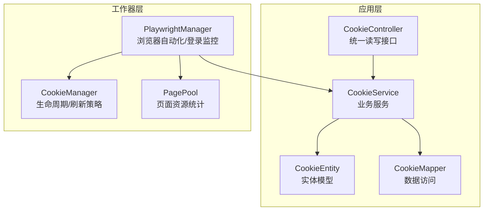
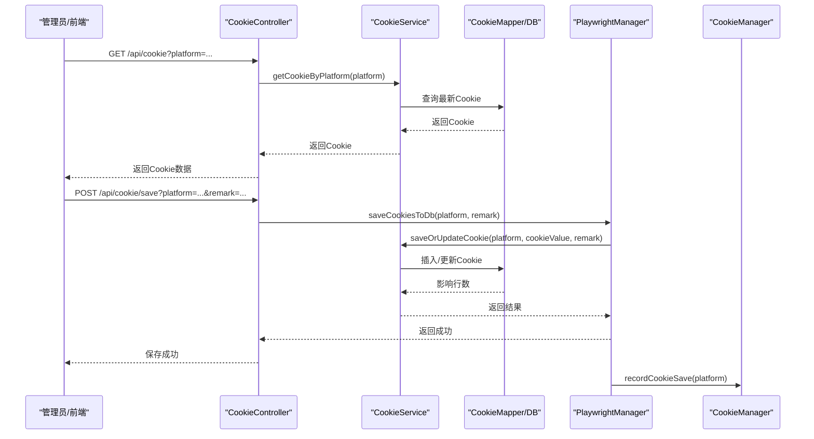
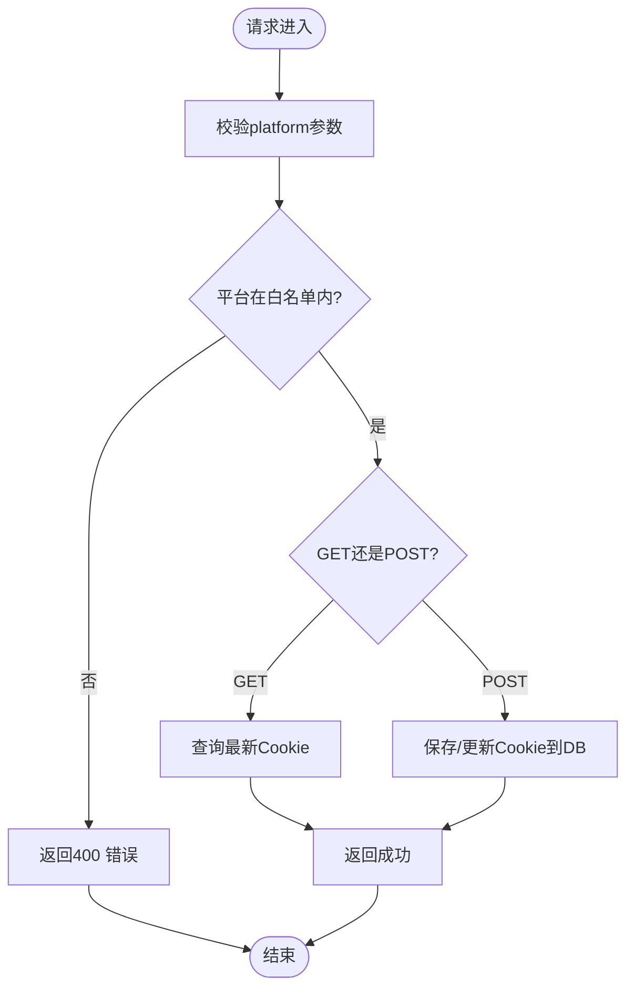
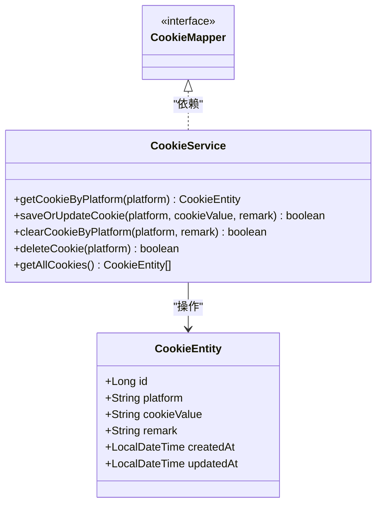
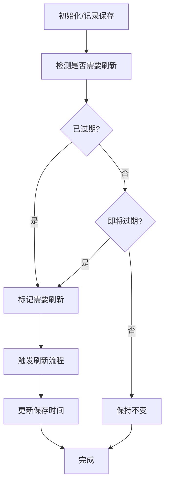
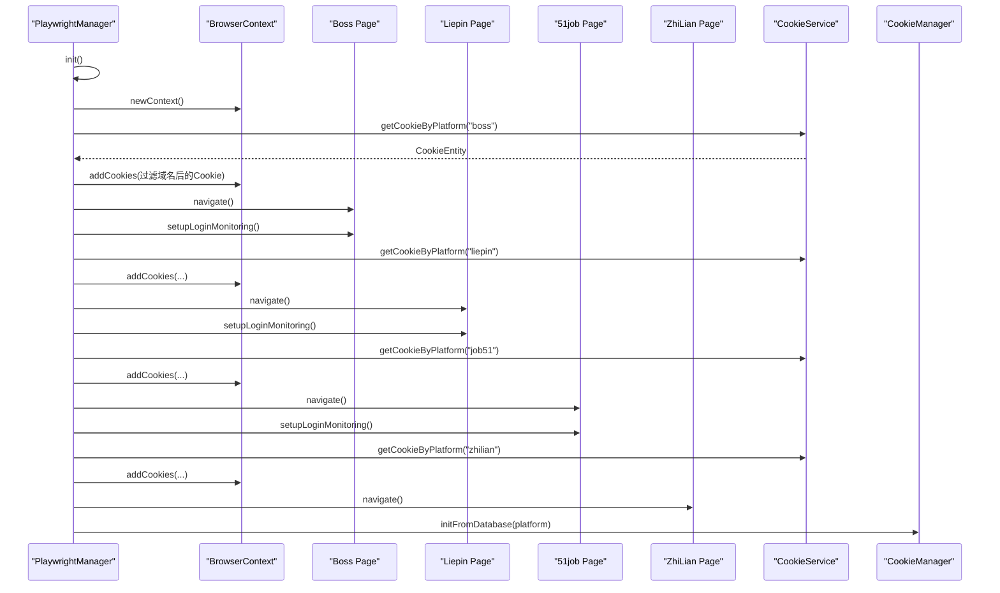
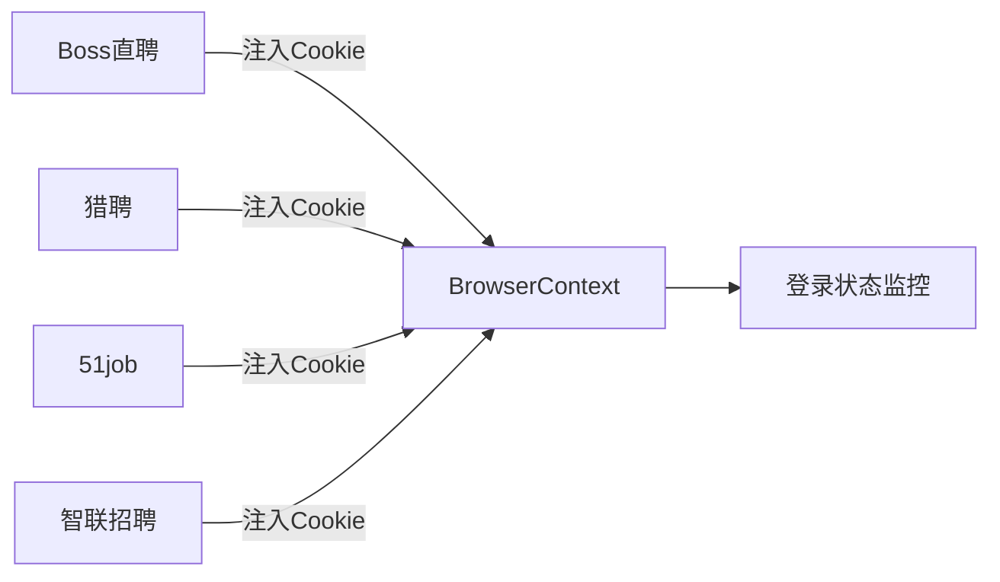
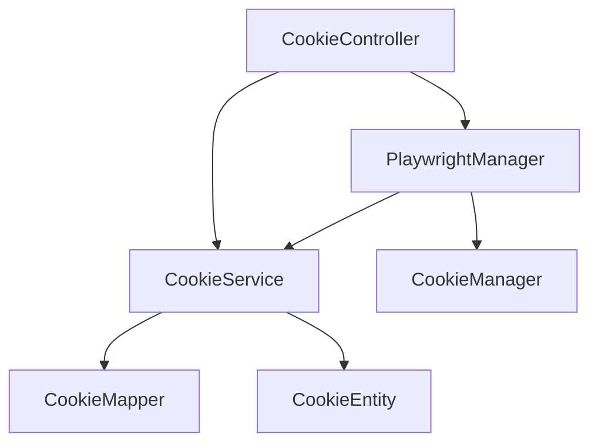

# 持久登录

<cite>
**本文引用的文件**
- [CookieController.java](file://backend/src/main/java/com/getjobs/application/controller/CookieController.java)
- [CookieService.java](file://backend/src/main/java/com/getjobs/application/service/CookieService.java)
- [CookieEntity.java](file://backend/src/main/java/com/getjobs/application/entity/CookieEntity.java)
- [CookieMapper.java](file://backend/src/main/java/com/getjobs/application/mapper/CookieMapper.java)
- [CookieManager.java](file://backend/src/main/java/com/getjobs/worker/utils/CookieManager.java)
- [PlaywrightManager.java](file://backend/src/main/java/com/getjobs/worker/manager/PlaywrightManager.java)
- [CookieSeedInitializer.java](file://backend/src/main/java/com/getjobs/application/init/CookieSeedInitializer.java)
- [application.yaml](file://backend/src/main/resources/application.yaml)
- [PagePool.java](file://backend/src/main/java/com/getjobs/worker/utils/PagePool.java)
- [Boss.java](file://backend/src/main/java/com/getjobs/worker/boss/Boss.java)
- [Liepin.java](file://backend/src/main/java/com/getjobs/worker/liepin/Liepin.java)
- [Job51.java](file://backend/src/main/java/com/getjobs/worker/job51/Job51.java)
- [ZhiLian.java](file://backend/src/main/java/com/getjobs/worker/zhilian/ZhiLian.java)
</cite>

## 目录
1. [简介](#简介)
2. [项目结构](#项目结构)
3. [核心组件](#核心组件)
4. [架构总览](#架构总览)
5. [详细组件分析](#详细组件分析)
6. [依赖分析](#依赖分析)
7. [性能考虑](#性能考虑)
8. [故障排查指南](#故障排查指南)
9. [结论](#结论)
10. [附录](#附录)

## 简介
本技术文档围绕“持久登录”能力，系统阐述Cookie管理机制、跨平台登录适配、Cookie配置方法、登录状态监控与维护、以及安全考虑。系统通过统一的Cookie读写接口与生命周期管理器，结合Playwright自动化引擎，实现Boss直聘、猎聘、51job、智联招聘等平台的登录状态持久化与自动续期，确保在长时间任务执行中维持稳定的登录状态。

## 项目结构
后端采用Spring Boot + MyBatis-Plus架构，Cookie相关逻辑集中在应用层与工作器(worker)层：
- 应用层：控制器、服务、实体与Mapper负责Cookie的读写与持久化
- 工作器层：PlaywrightManager负责浏览器自动化与登录状态监控；CookieManager负责Cookie生命周期与刷新策略；PagePool负责页面资源统计与观察

图表来源
- [CookieController.java:15-95](file://backend/src/main/java/com/getjobs/application/controller/CookieController.java#L15-L95)
- [CookieService.java:13-97](file://backend/src/main/java/com/getjobs/application/service/CookieService.java#L13-L97)
- [CookieEntity.java:11-54](file://backend/src/main/java/com/getjobs/application/entity/CookieEntity.java#L11-L54)
- [CookieMapper.java:6-11](file://backend/src/main/java/com/getjobs/application/mapper/CookieMapper.java#L6-L11)
- [PlaywrightManager.java:30-221](file://backend/src/main/java/com/getjobs/worker/manager/PlaywrightManager.java#L30-L221)
- [CookieManager.java:15-259](file://backend/src/main/java/com/getjobs/worker/utils/CookieManager.java#L15-L259)
- [PagePool.java:11-278](file://backend/src/main/java/com/getjobs/worker/utils/PagePool.java#L11-L278)

章节来源
- [CookieController.java:15-95](file://backend/src/main/java/com/getjobs/application/controller/CookieController.java#L15-L95)
- [CookieService.java:13-97](file://backend/src/main/java/com/getjobs/application/service/CookieService.java#L13-L97)
- [PlaywrightManager.java:30-221](file://backend/src/main/java/com/getjobs/worker/manager/PlaywrightManager.java#L30-L221)

## 核心组件
- CookieController：提供统一的Cookie读取与保存接口，支持平台参数校验与错误处理
- CookieService：封装Cookie的查询、新增/更新、清空与删除等业务逻辑
- CookieEntity/CookieMapper：定义Cookie数据模型与MyBatis-Plus数据访问
- CookieManager：记录Cookie保存时间戳、计算剩余有效期、判断即将过期/已过期、触发刷新
- PlaywrightManager：初始化浏览器上下文、加载Cookie到上下文、导航各平台、监控登录状态变化
- CookieSeedInitializer：应用启动时为各平台创建“种子记录”，保证后续更新操作可用
- application.yaml：配置Playwright参数、Cookie刷新阈值、资源拦截等

章节来源
- [CookieController.java:15-95](file://backend/src/main/java/com/getjobs/application/controller/CookieController.java#L15-L95)
- [CookieService.java:13-97](file://backend/src/main/java/com/getjobs/application/service/CookieService.java#L13-L97)
- [CookieEntity.java:11-54](file://backend/src/main/java/com/getjobs/application/entity/CookieEntity.java#L11-L54)
- [CookieMapper.java:6-11](file://backend/src/main/java/com/getjobs/application/mapper/CookieMapper.java#L6-L11)
- [CookieManager.java:15-259](file://backend/src/main/java/com/getjobs/worker/utils/CookieManager.java#L15-L259)
- [PlaywrightManager.java:30-221](file://backend/src/main/java/com/getjobs/worker/manager/PlaywrightManager.java#L30-L221)
- [CookieSeedInitializer.java:12-47](file://backend/src/main/java/com/getjobs/application/init/CookieSeedInitializer.java#L12-L47)
- [application.yaml:70-101](file://backend/src/main/resources/application.yaml#L70-L101)

## 架构总览
持久登录的整体流程：
- 应用启动时，CookieSeedInitializer为各平台创建种子记录
- PlaywrightManager初始化浏览器上下文，从数据库加载对应平台Cookie并注入
- 各平台页面初始化后，设置登录状态监控，检测URL变化与登录特征
- CookieManager记录Cookie保存时间，按平台预期有效期与刷新阈值判断是否需要刷新
- 用户可通过CookieController主动保存当前上下文Cookie到数据库

图表来源
- [CookieController.java:32-94](file://backend/src/main/java/com/getjobs/application/controller/CookieController.java#L32-L94)
- [CookieService.java:22-61](file://backend/src/main/java/com/getjobs/application/service/CookieService.java#L22-L61)
- [PlaywrightManager.java:769-787](file://backend/src/main/java/com/getjobs/worker/manager/PlaywrightManager.java#L769-L787)
- [CookieManager.java:62-66](file://backend/src/main/java/com/getjobs/worker/utils/CookieManager.java#L62-L66)

## 详细组件分析

### Cookie统一读写接口
- GET /api/cookie：按平台查询最新Cookie，返回id、platform、cookie_value、remark、时间戳等
- POST /api/cookie/save：主动保存当前上下文Cookie到数据库，支持remark备注
- 平台白名单限制：仅允许boss、liepin、51job、zhilian

图表来源
- [CookieController.java:32-94](file://backend/src/main/java/com/getjobs/application/controller/CookieController.java#L32-L94)

章节来源
- [CookieController.java:15-95](file://backend/src/main/java/com/getjobs/application/controller/CookieController.java#L15-L95)

### Cookie服务与数据模型
- CookieService提供查询、保存/更新、清空、删除、全量查询等方法
- CookieEntity定义字段：id、platform、cookie_value、remark、created_at、updated_at
- CookieMapper继承BaseMapper，由MyBatis-Plus自动生成CRUD

图表来源
- [CookieEntity.java:11-54](file://backend/src/main/java/com/getjobs/application/entity/CookieEntity.java#L11-L54)
- [CookieMapper.java:6-11](file://backend/src/main/java/com/getjobs/application/mapper/CookieMapper.java#L6-L11)
- [CookieService.java:13-97](file://backend/src/main/java/com/getjobs/application/service/CookieService.java#L13-L97)

章节来源
- [CookieService.java:13-97](file://backend/src/main/java/com/getjobs/application/service/CookieService.java#L13-L97)
- [CookieEntity.java:11-54](file://backend/src/main/java/com/getjobs/application/entity/CookieEntity.java#L11-L54)
- [CookieMapper.java:6-11](file://backend/src/main/java/com/getjobs/application/mapper/CookieMapper.java#L6-L11)

### Cookie生命周期管理器
- 记录Cookie保存时间戳与预期有效期（天），默认刷新阈值为1小时
- 提供即将过期/已过期检测、剩余时间查询、触发刷新、状态摘要等能力
- 支持从数据库初始化记录，避免无记录导致的误判

图表来源
- [CookieManager.java:74-153](file://backend/src/main/java/com/getjobs/worker/utils/CookieManager.java#L74-L153)

章节来源
- [CookieManager.java:15-259](file://backend/src/main/java/com/getjobs/worker/utils/CookieManager.java#L15-L259)

### Playwright自动化与登录监控
- 初始化浏览器上下文与共享Page池，按平台注入Cookie
- 各平台页面初始化后设置导航事件监听，检测登录状态变化
- 51job平台在登录成功后异步保存Cookie到数据库
- CookieManager在初始化时从数据库加载记录，建立生命周期基线

图表来源
- [PlaywrightManager.java:202-214](file://backend/src/main/java/com/getjobs/worker/manager/PlaywrightManager.java#L202-L214)
- [PlaywrightManager.java:254-331](file://backend/src/main/java/com/getjobs/worker/manager/PlaywrightManager.java#L254-L331)
- [PlaywrightManager.java:393-465](file://backend/src/main/java/com/getjobs/worker/manager/PlaywrightManager.java#L393-L465)
- [PlaywrightManager.java:584-686](file://backend/src/main/java/com/getjobs/worker/manager/PlaywrightManager.java#L584-L686)
- [PlaywrightManager.java:759-767](file://backend/src/main/java/com/getjobs/worker/manager/PlaywrightManager.java#L759-L767)

章节来源
- [PlaywrightManager.java:30-221](file://backend/src/main/java/com/getjobs/worker/manager/PlaywrightManager.java#L30-L221)
- [CookieManager.java:204-214](file://backend/src/main/java/com/getjobs/worker/utils/CookieManager.java#L204-L214)

### 跨平台登录适配
- Boss直聘：注入Cookie后导航首页，设置登录状态监控
- 猎聘：注入Cookie后导航首页，检测登录入口与二维码登录流程
- 51job：注入Cookie后导航首页，检测登录状态并在登录成功后保存Cookie
- 智联招聘：注入Cookie后导航首页，检测登录状态与投递上限

图表来源
- [PlaywrightManager.java:254-331](file://backend/src/main/java/com/getjobs/worker/manager/PlaywrightManager.java#L254-L331)
- [PlaywrightManager.java:393-465](file://backend/src/main/java/com/getjobs/worker/manager/PlaywrightManager.java#L393-L465)
- [PlaywrightManager.java:584-686](file://backend/src/main/java/com/getjobs/worker/manager/PlaywrightManager.java#L584-L686)
- [PlaywrightManager.java:759-767](file://backend/src/main/java/com/getjobs/worker/manager/PlaywrightManager.java#L759-L767)

章节来源
- [Boss.java:112-125](file://backend/src/main/java/com/getjobs/worker/boss/Boss.java#L112-L125)
- [Liepin.java:105-130](file://backend/src/main/java/com/getjobs/worker/liepin/Liepin.java#L105-L130)
- [Job51.java:68-107](file://backend/src/main/java/com/getjobs/worker/job51/Job51.java#L68-L107)
- [ZhiLian.java:62-97](file://backend/src/main/java/com/getjobs/worker/zhilian/ZhiLian.java#L62-L97)

### Cookie配置方法
- 手动设置：通过CookieController的POST接口主动保存当前上下文Cookie
- 自动获取：各平台登录成功后自动保存Cookie（如51job）
- 轮换策略：CookieManager根据平台预期有效期与刷新阈值触发刷新，避免过期

章节来源
- [CookieController.java:67-94](file://backend/src/main/java/com/getjobs/application/controller/CookieController.java#L67-L94)
- [PlaywrightManager.java:759-767](file://backend/src/main/java/com/getjobs/worker/manager/PlaywrightManager.java#L759-L767)
- [CookieManager.java:122-129](file://backend/src/main/java/com/getjobs/worker/utils/CookieManager.java#L122-L129)

### 登录状态监控与维护
- 监控机制：监听页面导航事件，检测URL变化与登录特征
- 维护策略：CookieManager定期评估是否需要刷新；PagePool统计页面资源使用情况
- 异常恢复：平台初始化失败或导航异常时进行重试与降级处理

章节来源
- [PlaywrightManager.java:376-388](file://backend/src/main/java/com/getjobs/worker/manager/PlaywrightManager.java#L376-L388)
- [PlaywrightManager.java:568-579](file://backend/src/main/java/com/getjobs/worker/manager/PlaywrightManager.java#L568-L579)
- [PlaywrightManager.java:724-735](file://backend/src/main/java/com/getjobs/worker/manager/PlaywrightManager.java#L724-L735)
- [PagePool.java:116-134](file://backend/src/main/java/com/getjobs/worker/utils/PagePool.java#L116-L134)

### 安全考虑
- Cookie加密：数据库连接密码使用Jasypt加密，密钥可通过环境变量注入
- 访问控制：CookieController开放跨域，生产环境建议限制来源
- 风险防范：CookieManager记录保存时间并提供状态摘要，便于审计与异常排查

章节来源
- [application.yaml:28-36](file://backend/src/main/resources/application.yaml#L28-L36)
- [application.yaml:70-101](file://backend/src/main/resources/application.yaml#L70-L101)
- [CookieController.java:24-24](file://backend/src/main/java/com/getjobs/application/controller/CookieController.java#L24-L24)
- [CookieManager.java:175-197](file://backend/src/main/java/com/getjobs/worker/utils/CookieManager.java#L175-L197)

## 依赖分析
- CookieController依赖CookieService与PlaywrightManager
- CookieService依赖CookieMapper与CookieEntity
- PlaywrightManager依赖CookieService与CookieManager
- CookieManager依赖CookieService

图表来源
- [CookieController.java:28-30](file://backend/src/main/java/com/getjobs/application/controller/CookieController.java#L28-L30)
- [CookieService.java:19-20](file://backend/src/main/java/com/getjobs/application/service/CookieService.java#L19-L20)
- [PlaywrightManager.java:90-91](file://backend/src/main/java/com/getjobs/worker/manager/PlaywrightManager.java#L90-L91)
- [CookieManager.java:49-50](file://backend/src/main/java/com/getjobs/worker/utils/CookieManager.java#L49-L50)

章节来源
- [CookieController.java:28-30](file://backend/src/main/java/com/getjobs/application/controller/CookieController.java#L28-L30)
- [CookieService.java:19-20](file://backend/src/main/java/com/getjobs/application/service/CookieService.java#L19-L20)
- [PlaywrightManager.java:90-91](file://backend/src/main/java/com/getjobs/worker/manager/PlaywrightManager.java#L90-L91)
- [CookieManager.java:49-50](file://backend/src/main/java/com/getjobs/worker/utils/CookieManager.java#L49-L50)

## 性能考虑
- 页面资源池：PagePool统计活跃页面数量与空闲时间，便于资源观察与未来回收
- 导航超时与重试：各平台差异化导航超时配置，降低页面加载失败的影响
- 资源拦截：可选的资源拦截策略，降低内存占用与网络压力

章节来源
- [PagePool.java:116-134](file://backend/src/main/java/com/getjobs/worker/utils/PagePool.java#L116-L134)
- [application.yaml:77-92](file://backend/src/main/resources/application.yaml#L77-L92)
- [application.yaml:94-98](file://backend/src/main/resources/application.yaml#L94-L98)

## 故障排查指南
- Cookie读取失败：检查平台参数是否在白名单内，确认数据库中是否存在对应平台的Cookie记录
- Cookie保存失败：查看保存接口返回的错误信息，确认平台合法性与数据库写入权限
- 登录状态异常：检查PlaywrightManager的登录监控是否启用，确认各平台登录特征检测逻辑
- Cookie过期频繁：调整CookieManager的刷新阈值配置，或优化平台登录流程以延长会话有效期

章节来源
- [CookieController.java:32-65](file://backend/src/main/java/com/getjobs/application/controller/CookieController.java#L32-L65)
- [CookieController.java:67-94](file://backend/src/main/java/com/getjobs/application/controller/CookieController.java#L67-L94)
- [PlaywrightManager.java:376-388](file://backend/src/main/java/com/getjobs/worker/manager/PlaywrightManager.java#L376-L388)
- [CookieManager.java:74-98](file://backend/src/main/java/com/getjobs/worker/utils/CookieManager.java#L74-L98)

## 结论
本持久登录方案通过统一的Cookie读写接口、生命周期管理与浏览器自动化监控，实现了多平台登录状态的稳定维持。配合种子记录与自动刷新策略，能够在长时间任务中持续保持登录有效性；同时通过配置化参数与安全加固，兼顾了易用性与安全性。

## 附录
- 应用启动时的Cookie种子初始化：为boss、liepin、51job、zhilian平台创建初始记录，确保后续更新可用
- 配置项参考：Playwright性能参数、导航超时、Cookie刷新阈值、资源拦截等

章节来源
- [CookieSeedInitializer.java:12-47](file://backend/src/main/java/com/getjobs/application/init/CookieSeedInitializer.java#L12-L47)
- [application.yaml:70-101](file://backend/src/main/resources/application.yaml#L70-L101)