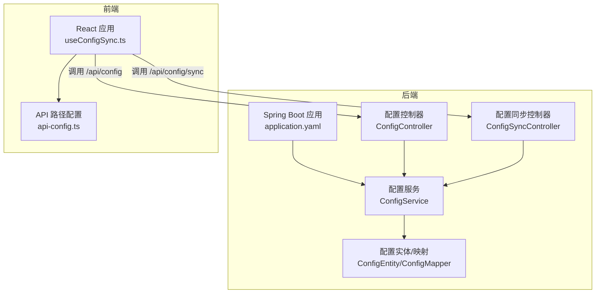
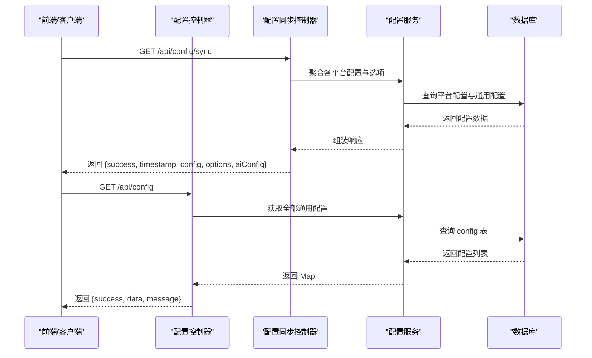
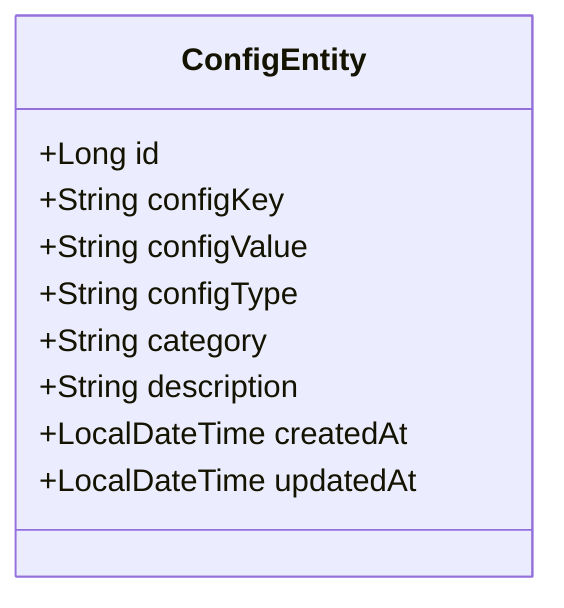
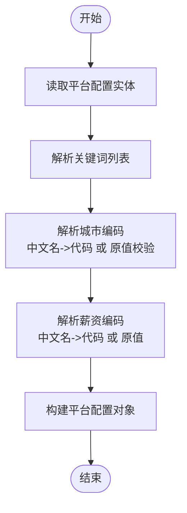
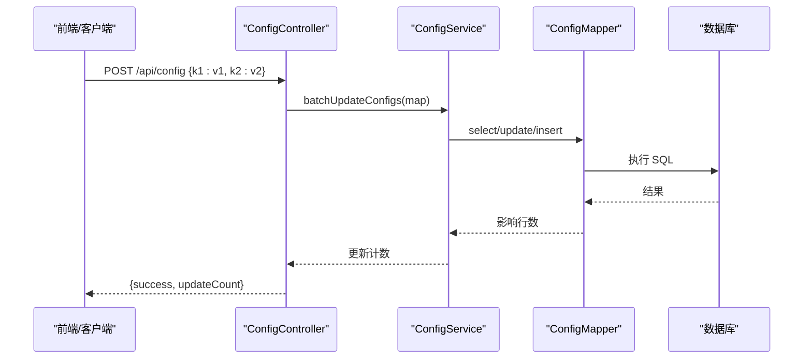
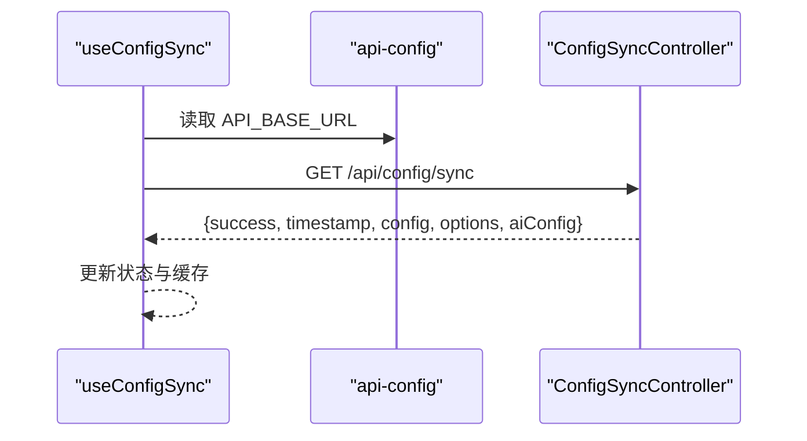
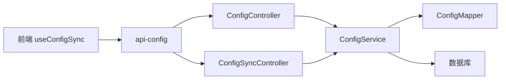

# 易于配置

<cite>
**本文引用的文件**
- [application.yaml](file://backend/src/main/resources/application.yaml)
- [application.yaml.template](file://scripts/application.yaml.template)
- [ConfigController.java](file://backend/src/main/java/com/getjobs/application/controller/ConfigController.java)
- [ConfigSyncController.java](file://backend/src/main/java/com/getjobs/application/controller/ConfigSyncController.java)
- [ConfigService.java](file://backend/src/main/java/com/getjobs/application/service/ConfigService.java)
- [ConfigEntity.java](file://backend/src/main/java/com/getjobs/application/entity/ConfigEntity.java)
- [ConfigMapper.java](file://backend/src/main/java/com/getjobs/application/mapper/ConfigMapper.java)
- [useConfigSync.ts](file://front/hooks/useConfigSync.ts)
- [api-config.ts](file://front/lib/api-config.ts)
- [StartupRunner.java](file://backend/src/main/java/com/getjobs/application/config/StartupRunner.java)
- [001_create_delivery_report.sql](file://scripts/migration/001_create_delivery_report.sql)
</cite>

## 目录
1. [简介](#简介)
2. [项目结构](#项目结构)
3. [核心组件](#核心组件)
4. [架构总览](#架构总览)
5. [详细组件分析](#详细组件分析)
6. [依赖分析](#依赖分析)
7. [性能考量](#性能考量)
8. [故障排查指南](#故障排查指南)
9. [结论](#结论)
10. [附录](#附录)

## 简介
本文件围绕“易于配置”的目标，系统化阐述本项目的集中化配置体系：从配置文件结构、参数分类、默认值与安全策略，到运行时配置更新、多节点同步与验证机制，并提供完整的配置指南、示例与最佳实践，帮助用户快速完成系统配置与运维。

## 项目结构
本项目采用前后端分离架构，配置能力主要集中在后端 Spring Boot 应用与前端 React 应用之间通过统一 API 协作完成。后端负责集中存储与分发配置，前端负责拉取与缓存，Electron 客户端可直接通过本地 API 获取配置。

图表来源
- [application.yaml:1-101](file://backend/src/main/resources/application.yaml#L1-L101)
- [ConfigController.java:1-171](file://backend/src/main/java/com/getjobs/application/controller/ConfigController.java#L1-L171)
- [ConfigSyncController.java:1-111](file://backend/src/main/java/com/getjobs/application/controller/ConfigSyncController.java#L1-L111)
- [ConfigService.java:1-288](file://backend/src/main/java/com/getjobs/application/service/ConfigService.java#L1-L288)
- [ConfigEntity.java:1-66](file://backend/src/main/java/com/getjobs/application/entity/ConfigEntity.java#L1-L66)
- [useConfigSync.ts:1-98](file://front/hooks/useConfigSync.ts#L1-L98)
- [api-config.ts:1-99](file://front/lib/api-config.ts#L1-L99)

章节来源
- [application.yaml:1-101](file://backend/src/main/resources/application.yaml#L1-L101)
- [application.yaml.template:1-102](file://scripts/application.yaml.template#L1-L102)
- [ConfigController.java:1-171](file://backend/src/main/java/com/getjobs/application/controller/ConfigController.java#L1-L171)
- [ConfigSyncController.java:1-111](file://backend/src/main/java/com/getjobs/application/controller/ConfigSyncController.java#L1-L111)
- [ConfigService.java:1-288](file://backend/src/main/java/com/getjobs/application/service/ConfigService.java#L1-L288)
- [ConfigEntity.java:1-66](file://backend/src/main/java/com/getjobs/application/entity/ConfigEntity.java#L1-L66)
- [useConfigSync.ts:1-98](file://front/hooks/useConfigSync.ts#L1-L98)
- [api-config.ts:1-99](file://front/lib/api-config.ts#L1-L99)

## 核心组件
- 集中式配置存储：基于数据库表 config 存储键值对配置，支持分类与描述，便于检索与治理。
- 配置服务层：提供统一的读取、批量更新、新增、校验与平台专用配置转换能力。
- 配置控制器：对外暴露 REST API，支持获取全部配置、按键获取、批量更新、单键更新与健康检查。
- 配置同步控制器：面向 Electron 客户端的统一配置同步接口，聚合各平台配置与选项。
- 前端配置钩子：封装云端配置同步逻辑，兼容 Electron 与后端 API 两种模式，支持本地缓存读取。
- 启动引导器：应用启动后自动打开管理页面，确保配置界面可访问。

章节来源
- [ConfigEntity.java:1-66](file://backend/src/main/java/com/getjobs/application/entity/ConfigEntity.java#L1-L66)
- [ConfigMapper.java:1-13](file://backend/src/main/java/com/getjobs/application/mapper/ConfigMapper.java#L1-L13)
- [ConfigService.java:1-288](file://backend/src/main/java/com/getjobs/application/service/ConfigService.java#L1-L288)
- [ConfigController.java:1-171](file://backend/src/main/java/com/getjobs/application/controller/ConfigController.java#L1-L171)
- [ConfigSyncController.java:1-111](file://backend/src/main/java/com/getjobs/application/controller/ConfigSyncController.java#L1-L111)
- [useConfigSync.ts:1-98](file://front/hooks/useConfigSync.ts#L1-L98)
- [StartupRunner.java:1-155](file://backend/src/main/java/com/getjobs/application/config/StartupRunner.java#L1-L155)

## 架构总览
集中化配置系统通过“配置服务 + 控制器 + 前端钩子”的协作实现：

图表来源
- [ConfigSyncController.java:33-86](file://backend/src/main/java/com/getjobs/application/controller/ConfigSyncController.java#L33-L86)
- [ConfigController.java:29-48](file://backend/src/main/java/com/getjobs/application/controller/ConfigController.java#L29-L48)
- [ConfigService.java:38-55](file://backend/src/main/java/com/getjobs/application/service/ConfigService.java#L38-L55)
- [ConfigEntity.java:14-66](file://backend/src/main/java/com/getjobs/application/entity/ConfigEntity.java#L14-L66)

## 详细组件分析

### 配置文件结构与参数分类
- 配置文件位置与模板
  - 运行时配置文件：application.yaml（位于 resources 目录）
  - 配置模板：scripts/application.yaml.template（用于生成与部署）
- 参数分类
  - Spring 应用与环境：spring.application、spring.profiles、spring.info、spring.banner、spring.output
  - 数据源与连接池：spring.datasource.url/driver/username/password、spring.datasource.hikari.*
  - 数据库初始化：spring.sql.init.mode、spring.sql.init.schema-locations、spring.sql.init.continue-on-error
  - 日志与输出：logging.level.root、logging.pattern.console、logging.file.name、logback 策略
  - MyBatis-Plus：mybatis-plus.configuration、mybatis-plus.global-config、mybatis-plus.mapper-locations
  - 加解密：jasypt.encryptor.password（支持环境变量覆盖）
  - 服务器：server.port
  - 管理后台 JWT：admin.jwt.secret、admin.jwt.expiration、admin.jwt.issuer
  - Playwright Agent：playwright.*（性能、稳定性、资源管理、Cookie 管理）

章节来源
- [application.yaml:1-101](file://backend/src/main/resources/application.yaml#L1-L101)
- [application.yaml.template:10-102](file://scripts/application.yaml.template#L10-L102)

### 配置实体与数据模型
配置实体包含主键、键、值、类型、分类、描述及时间戳字段，支持按分类查询与全量导出。

图表来源
- [ConfigEntity.java:14-66](file://backend/src/main/java/com/getjobs/application/entity/ConfigEntity.java#L14-L66)

章节来源
- [ConfigEntity.java:1-66](file://backend/src/main/java/com/getjobs/application/entity/ConfigEntity.java#L1-L66)
- [ConfigMapper.java:1-13](file://backend/src/main/java/com/getjobs/application/mapper/ConfigMapper.java#L1-L13)

### 配置服务与运行时更新
- 读取能力
  - 获取全部配置（Map）、按键获取、按分类获取、必填配置校验
  - AI 配置聚合（BASE_URL/API_KEY/MODEL），缺失时返回空串并告警
- 更新能力
  - 批量更新：不存在即创建，存在即更新，事务保证一致性
  - 单键更新：存在即更新，不存在返回失败
  - 平台专用配置转换：从各平台配置表读取并转换为 Worker 可用对象
- 平台配置解析
  - 关键词解析：支持英文逗号、中文逗号与数组格式
  - 城市编码：中文名映射为代码，否则回退为原始值并做校验
  - 薪资代码：中文名映射为代码，否则回退为原始值

图表来源
- [ConfigService.java:217-265](file://backend/src/main/java/com/getjobs/application/service/ConfigService.java#L217-L265)

章节来源
- [ConfigService.java:38-287](file://backend/src/main/java/com/getjobs/application/service/ConfigService.java#L38-L287)

### 配置控制器与同步控制器
- 配置控制器
  - GET /api/config：返回全部配置 Map
  - GET /api/config/{key}：按键返回配置
  - POST /api/config：批量更新（不存在即创建）
  - PUT /api/config/{key}：单键更新
  - GET /api/config/health：健康检查
- 配置同步控制器
  - GET /api/config/sync：聚合 boss/liepin/zhilian/job51 配置与选项、AI 配置，返回统一结构
  - 选项暂未从数据库加载，预留扩展点

图表来源
- [ConfigController.java:86-112](file://backend/src/main/java/com/getjobs/application/controller/ConfigController.java#L86-L112)
- [ConfigService.java:131-165](file://backend/src/main/java/com/getjobs/application/service/ConfigService.java#L131-L165)
- [ConfigMapper.java:1-13](file://backend/src/main/java/com/getjobs/application/mapper/ConfigMapper.java#L1-L13)

章节来源
- [ConfigController.java:29-171](file://backend/src/main/java/com/getjobs/application/controller/ConfigController.java#L29-L171)
- [ConfigSyncController.java:33-86](file://backend/src/main/java/com/getjobs/application/controller/ConfigSyncController.java#L33-L86)
- [ConfigService.java:38-287](file://backend/src/main/java/com/getjobs/application/service/ConfigService.java#L38-L287)

### 前端配置同步与使用
- useConfigSync 钩子
  - Electron 模式：通过 Electron API 调用 config.sync()/config.get()
  - 后端 API 模式：直接调用 /api/config
  - 支持错误处理与最后同步时间记录
- API 路径配置
  - 统一管理后端 API 基础地址与各模块路径，便于替换与调试

图表来源
- [useConfigSync.ts:23-70](file://front/hooks/useConfigSync.ts#L23-L70)
- [api-config.ts:4-99](file://front/lib/api-config.ts#L4-L99)
- [ConfigSyncController.java:33-86](file://backend/src/main/java/com/getjobs/application/controller/ConfigSyncController.java#L33-L86)

章节来源
- [useConfigSync.ts:1-98](file://front/hooks/useConfigSync.ts#L1-L98)
- [api-config.ts:1-99](file://front/lib/api-config.ts#L1-L99)

### 启动与访问
- StartupRunner 在应用启动后尝试打开管理页面，优先前端服务，其次后端静态资源，最后失败降级。
- PlaywrightManager 在打开管理页面后再进行初始化，确保先有界面再实例化。

章节来源
- [StartupRunner.java:31-47](file://backend/src/main/java/com/getjobs/application/config/StartupRunner.java#L31-L47)

## 依赖分析
- 组件耦合
  - ConfigController/ConfigSyncController 依赖 ConfigService
  - ConfigService 依赖 ConfigMapper 与各平台服务（Boss/Liepin/Zhilian/Job51）
  - 前端 useConfigSync 依赖 api-config 与后端 API
- 外部依赖
  - 数据库：MySQL/HikariCP
  - 日志：Logback
  - 加解密：Jasypt（通过环境变量或 JVM 参数注入密钥）
  - Playwright：浏览器自动化与稳定性控制

图表来源
- [ConfigController.java:22-23](file://backend/src/main/java/com/getjobs/application/controller/ConfigController.java#L22-L23)
- [ConfigSyncController.java:25-26](file://backend/src/main/java/com/getjobs/application/controller/ConfigSyncController.java#L25-L26)
- [ConfigService.java:28-32](file://backend/src/main/java/com/getjobs/application/service/ConfigService.java#L28-L32)
- [ConfigMapper.java:10-12](file://backend/src/main/java/com/getjobs/application/mapper/ConfigMapper.java#L10-L12)
- [useConfigSync.ts:4-5](file://front/hooks/useConfigSync.ts#L4-L5)
- [api-config.ts:4-99](file://front/lib/api-config.ts#L4-L99)

章节来源
- [ConfigController.java:1-171](file://backend/src/main/java/com/getjobs/application/controller/ConfigController.java#L1-L171)
- [ConfigSyncController.java:1-111](file://backend/src/main/java/com/getjobs/application/controller/ConfigSyncController.java#L1-L111)
- [ConfigService.java:1-288](file://backend/src/main/java/com/getjobs/application/service/ConfigService.java#L1-L288)
- [ConfigMapper.java:1-13](file://backend/src/main/java/com/getjobs/application/mapper/ConfigMapper.java#L1-L13)
- [useConfigSync.ts:1-98](file://front/hooks/useConfigSync.ts#L1-L98)
- [api-config.ts:1-99](file://front/lib/api-config.ts#L1-L99)

## 性能考量
- 连接池与超时
  - HikariCP 最大连接数、空闲超时、最大生命周期等参数可按并发与资源情况调整
  - Playwright 导航超时、重试策略、页面最大数量与空闲回收时间影响整体吞吐
- 日志滚动策略
  - 控制日志文件大小与保留天数，避免磁盘压力
- 数据库索引
  - delivery_report 表包含多字段索引，有助于统计与报表查询

章节来源
- [application.yaml:19-24](file://backend/src/main/resources/application.yaml#L19-L24)
- [application.yaml:70-98](file://backend/src/main/resources/application.yaml#L70-L98)
- [001_create_delivery_report.sql:4-24](file://scripts/migration/001_create_delivery_report.sql#L4-L24)

## 故障排查指南
- 健康检查
  - /api/config/health：确认配置服务可用
  - /api/health：后端服务健康
- 常见问题
  - 配置键不存在：PUT /api/config/{key} 返回失败，检查键名与大小写
  - 批量更新为空：POST /api/config 返回请求体为空的错误提示
  - 必填配置缺失：getAiConfigs() 返回空串并告警，补齐 BASE_URL/API_KEY/MODEL
  - 城市编码/薪资编码解析失败：平台配置转换阶段会抛出参数异常，检查输入格式与字典映射
- 日志定位
  - 查看后端日志文件与级别，结合接口返回 message 字段定位问题

章节来源
- [ConfigController.java:160-169](file://backend/src/main/java/com/getjobs/application/controller/ConfigController.java#L160-L169)
- [ConfigService.java:107-124](file://backend/src/main/java/com/getjobs/application/service/ConfigService.java#L107-L124)
- [ConfigService.java:244-245](file://backend/src/main/java/com/getjobs/application/service/ConfigService.java#L244-L245)

## 结论
本集中化配置体系通过“数据库存储 + 服务编排 + 统一 API + 前端钩子”的组合，实现了配置的可读、可写、可同步与可治理。配合 Playwright 与日志、加解密等能力，既满足开发调试需求，也具备生产级的可维护性与安全性。

## 附录

### 完整配置指南
- 通用配置参数
  - spring.datasource：数据库连接与连接池参数
  - logging：日志级别、控制台格式、文件路径与滚动策略
  - mybatis-plus：驼峰映射、Banner、主键策略、Mapper 位置
  - jasypt.encryptor.password：加密密钥（优先环境变量，其次 JVM 参数，最后配置文件）
  - server.port：服务端口
  - admin.jwt：管理后台 JWT 密钥、过期时间、签发者
  - playwright.*：性能、稳定性、资源管理、Cookie 刷新策略
- 平台配置参数
  - 关键词解析：支持英文逗号、中文逗号与数组格式
  - 城市编码：中文名映射为代码，否则回退为原始值并校验
  - 薪资编码：中文名映射为代码，否则回退为原始值
- 推荐设置
  - 生产环境启用 Jasypt 并通过环境变量注入密钥
  - 合理设置 HikariCP 与 Playwright 超时，平衡性能与稳定性
  - 开启日志滚动策略，定期清理历史日志
- 最佳实践
  - 使用批量更新接口进行配置变更，减少事务次数
  - 对外暴露的配置键应明确分类与描述，便于治理
  - 平台配置转换逻辑集中于 ConfigService，便于扩展与测试

章节来源
- [application.yaml:13-101](file://backend/src/main/resources/application.yaml#L13-L101)
- [application.yaml.template:14-102](file://scripts/application.yaml.template#L14-L102)
- [ConfigService.java:217-265](file://backend/src/main/java/com/getjobs/application/service/ConfigService.java#L217-L265)

### 配置文件示例与使用场景
- 示例文件
  - 运行时配置：application.yaml（位于 resources 目录）
  - 模板配置：scripts/application.yaml.template（用于生成与部署）
- 使用场景
  - 开发环境：使用模板复制为 application.yaml，修改数据库与端口
  - 生产环境：通过环境变量注入 Jasypt 密钥与 JWT 密钥，避免明文写入配置文件
  - 多节点部署：共享数据库即可实现配置同步，无需节点间拷贝

章节来源
- [application.yaml:1-101](file://backend/src/main/resources/application.yaml#L1-L101)
- [application.yaml.template:1-102](file://scripts/application.yaml.template#L1-L102)

### 安全性考虑
- 敏感信息保护
  - 数据库密码建议使用 ENC(...) 包裹并通过 Jasypt 解密
  - 加密密钥优先从环境变量注入，其次 JVM 参数，最后配置文件（开发环境）
- 权限控制
  - 管理后台 JWT 密钥与过期时间需妥善保管
  - 建议限制 /api/config 的访问来源，结合网关或中间件进行鉴权
- 日志与审计
  - 避免在日志中打印敏感配置
  - 对配置变更操作进行审计（可在 ConfigService 层增加审计日志）

章节来源
- [application.yaml:17-18](file://backend/src/main/resources/application.yaml#L17-L18)
- [application.yaml:33-35](file://backend/src/main/resources/application.yaml#L33-L35)
- [application.yaml:64-68](file://backend/src/main/resources/application.yaml#L64-L68)
- [ConfigService.java:131-165](file://backend/src/main/java/com/getjobs/application/service/ConfigService.java#L131-L165)