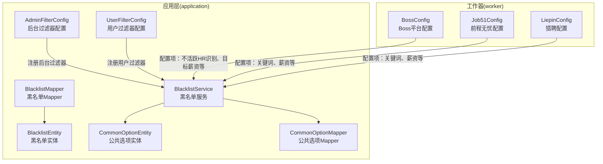
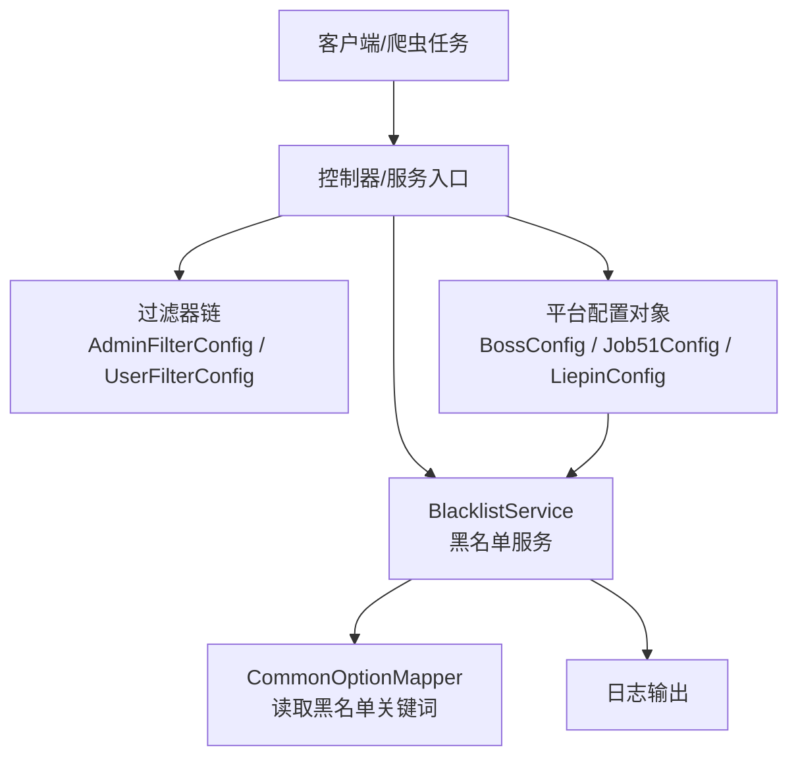
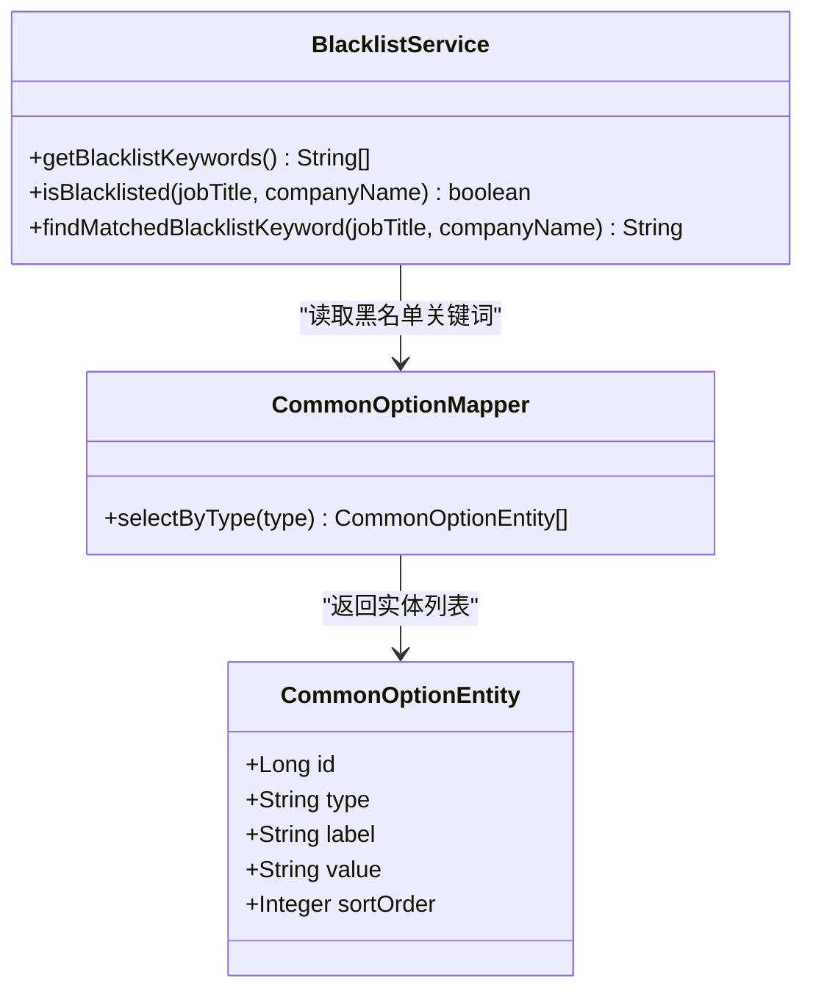
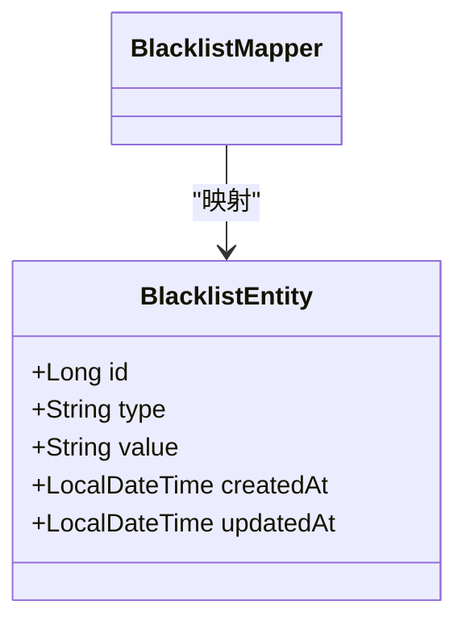
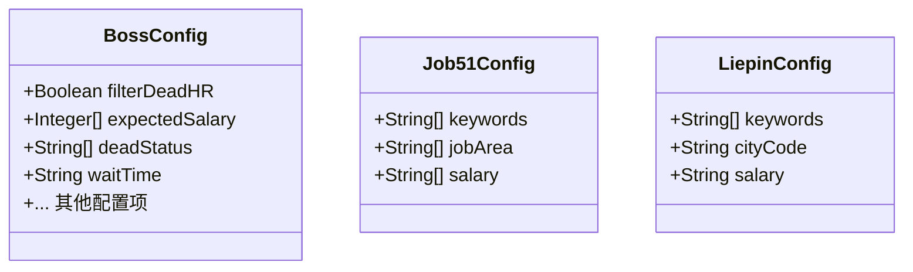
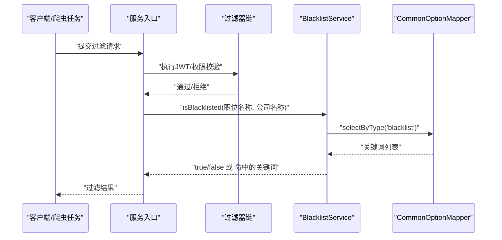
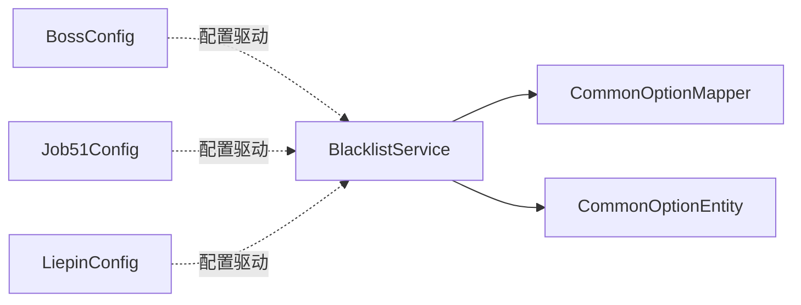

# 智能过滤

<cite>
**本文引用的文件**
- [BlacklistService.java](file://backend/src/main/java/com/getjobs/application/service/BlacklistService.java)
- [BlacklistEntity.java](file://backend/src/main/java/com/getjobs/application/entity/BlacklistEntity.java)
- [BlacklistMapper.java](file://backend/src/main/java/com/getjobs/application/mapper/BlacklistMapper.java)
- [CommonOptionEntity.java](file://backend/src/main/java/com/getjobs/application/entity/CommonOptionEntity.java)
- [CommonOptionMapper.java](file://backend/src/main/java/com/getjobs/application/mapper/CommonOptionMapper.java)
- [AdminFilterConfig.java](file://backend/src/main/java/com/getjobs/application/config/AdminFilterConfig.java)
- [UserFilterConfig.java](file://backend/src/main/java/com/getjobs/application/config/UserFilterConfig.java)
- [BossConfig.java](file://backend/src/main/java/com/getjobs/worker/boss/BossConfig.java)
- [Job51Config.java](file://backend/src/main/java/com/getjobs/worker/job51/Job51Config.java)
- [LiepinConfig.java](file://backend/src/main/java/com/getjobs/worker/liepin/LiepinConfig.java)
</cite>

## 目录
1. [简介](#简介)
2. [项目结构](#项目结构)
3. [核心组件](#核心组件)
4. [架构总览](#架构总览)
5. [详细组件分析](#详细组件分析)
6. [依赖分析](#依赖分析)
7. [性能考虑](#性能考虑)
8. [故障排查指南](#故障排查指南)
9. [结论](#结论)
10. [附录](#附录)

## 简介
本技术文档围绕“智能过滤”能力展开，重点覆盖以下方面：
- 过滤机制工作原理：包括不活跃HR识别、猎头岗位检测、目标薪资匹配等算法实现思路与落地方式
- 黑名单功能：黑名单企业的自动更新、过滤规则配置、动态调整机制
- 过滤配置方法：过滤条件设置、阈值调整、规则定制
- 过滤效果与统计：如何评估过滤准确性
- 平台适配：与Boss直聘、前程无忧、猎聘等招聘平台的差异、过滤精度与性能优化

说明：当前仓库中“智能过滤”的核心实现主要集中在“黑名单服务”和“平台配置对象”中；不活跃HR识别、猎头岗位检测、目标薪资匹配等功能在现有代码中以配置项形式存在，具体算法实现需结合业务策略与数据来源进一步扩展。

## 项目结构
后端采用Spring Boot工程，过滤相关的代码主要分布在以下模块：
- 应用层（application）：服务、实体、Mapper、配置
- 工作器（worker）：平台配置对象（BossConfig、Job51Config、LiepinConfig）

图表来源
- [BlacklistService.java:1-100](file://backend/src/main/java/com/getjobs/application/service/BlacklistService.java#L1-L100)
- [BlacklistEntity.java:1-43](file://backend/src/main/java/com/getjobs/application/entity/BlacklistEntity.java#L1-L43)
- [BlacklistMapper.java:1-13](file://backend/src/main/java/com/getjobs/application/mapper/BlacklistMapper.java#L1-L13)
- [CommonOptionEntity.java:1-29](file://backend/src/main/java/com/getjobs/application/entity/CommonOptionEntity.java#L1-L29)
- [CommonOptionMapper.java:1-23](file://backend/src/main/java/com/getjobs/application/mapper/CommonOptionMapper.java#L1-L23)
- [AdminFilterConfig.java:1-28](file://backend/src/main/java/com/getjobs/application/config/AdminFilterConfig.java#L1-L28)
- [UserFilterConfig.java:1-28](file://backend/src/main/java/com/getjobs/application/config/UserFilterConfig.java#L1-L28)
- [BossConfig.java:1-107](file://backend/src/main/java/com/getjobs/worker/boss/BossConfig.java#L1-L107)
- [Job51Config.java:1-41](file://backend/src/main/java/com/getjobs/worker/job51/Job51Config.java#L1-L41)
- [LiepinConfig.java:1-29](file://backend/src/main/java/com/getjobs/worker/liepin/LiepinConfig.java#L1-L29)

章节来源
- [BlacklistService.java:1-100](file://backend/src/main/java/com/getjobs/application/service/BlacklistService.java#L1-L100)
- [BossConfig.java:1-107](file://backend/src/main/java/com/getjobs/worker/boss/BossConfig.java#L1-L107)
- [Job51Config.java:1-41](file://backend/src/main/java/com/getjobs/worker/job51/Job51Config.java#L1-L41)
- [LiepinConfig.java:1-29](file://backend/src/main/java/com/getjobs/worker/liepin/LiepinConfig.java#L1-L29)

## 核心组件
- 黑名单服务（BlacklistService）
  - 职责：从公共选项表读取黑名单关键词，对职位名称与公司名称进行模糊匹配，判断是否命中黑名单
  - 关键点：大小写不敏感、支持返回命中的关键词、日志记录命中详情
- 黑名单实体与Mapper
  - BlacklistEntity：定义“boss_blacklist”表结构（类型、值、时间戳）
  - BlacklistMapper：MyBatis接口，负责黑名单表的CRUD
- 公共选项实体与Mapper
  - CommonOptionEntity：定义“common_option”表结构（type、label、value、sort_order）
  - CommonOptionMapper：按type查询选项列表（按sort_order升序）
- 平台配置对象
  - BossConfig：包含“不活跃HR识别”“目标薪资”等开关与参数
  - Job51Config、LiepinConfig：包含关键词、城市/地区、薪资等配置项

章节来源
- [BlacklistService.java:1-100](file://backend/src/main/java/com/getjobs/application/service/BlacklistService.java#L1-L100)
- [BlacklistEntity.java:1-43](file://backend/src/main/java/com/getjobs/application/entity/BlacklistEntity.java#L1-L43)
- [BlacklistMapper.java:1-13](file://backend/src/main/java/com/getjobs/application/mapper/BlacklistMapper.java#L1-L13)
- [CommonOptionEntity.java:1-29](file://backend/src/main/java/com/getjobs/application/entity/CommonOptionEntity.java#L1-L29)
- [CommonOptionMapper.java:1-23](file://backend/src/main/java/com/getjobs/application/mapper/CommonOptionMapper.java#L1-L23)
- [BossConfig.java:1-107](file://backend/src/main/java/com/getjobs/worker/boss/BossConfig.java#L1-L107)
- [Job51Config.java:1-41](file://backend/src/main/java/com/getjobs/worker/job51/Job51Config.java#L1-L41)
- [LiepinConfig.java:1-29](file://backend/src/main/java/com/getjobs/worker/liepin/LiepinConfig.java#L1-L29)

## 架构总览
智能过滤在系统中的位置与交互如下：

图表来源
- [AdminFilterConfig.java:1-28](file://backend/src/main/java/com/getjobs/application/config/AdminFilterConfig.java#L1-L28)
- [UserFilterConfig.java:1-28](file://backend/src/main/java/com/getjobs/application/config/UserFilterConfig.java#L1-L28)
- [BlacklistService.java:1-100](file://backend/src/main/java/com/getjobs/application/service/BlacklistService.java#L1-L100)
- [CommonOptionMapper.java:1-23](file://backend/src/main/java/com/getjobs/application/mapper/CommonOptionMapper.java#L1-L23)
- [BossConfig.java:1-107](file://backend/src/main/java/com/getjobs/worker/boss/BossConfig.java#L1-L107)
- [Job51Config.java:1-41](file://backend/src/main/java/com/getjobs/worker/job51/Job51Config.java#L1-L41)
- [LiepinConfig.java:1-29](file://backend/src/main/java/com/getjobs/worker/liepin/LiepinConfig.java#L1-L29)

## 详细组件分析

### 黑名单服务（BlacklistService）
- 数据来源
  - 从“common_option”表按type='blacklist'读取关键词列表，按sort_order升序排列
- 匹配策略
  - 忽略大小写，对职位名称与公司名称执行包含匹配（模糊匹配）
  - 支持返回首个命中的关键词，便于定位与审计
- 性能与可维护性
  - 关键词列表在内存中缓存（每次调用重新拉取），适合中小规模关键词集
  - 建议后续引入缓存层与增量更新策略

图表来源
- [BlacklistService.java:1-100](file://backend/src/main/java/com/getjobs/application/service/BlacklistService.java#L1-L100)
- [CommonOptionMapper.java:1-23](file://backend/src/main/java/com/getjobs/application/mapper/CommonOptionMapper.java#L1-L23)
- [CommonOptionEntity.java:1-29](file://backend/src/main/java/com/getjobs/application/entity/CommonOptionEntity.java#L1-L29)

章节来源
- [BlacklistService.java:1-100](file://backend/src/main/java/com/getjobs/application/service/BlacklistService.java#L1-L100)
- [CommonOptionMapper.java:1-23](file://backend/src/main/java/com/getjobs/application/mapper/CommonOptionMapper.java#L1-L23)
- [CommonOptionEntity.java:1-29](file://backend/src/main/java/com/getjobs/application/entity/CommonOptionEntity.java#L1-L29)

### 黑名单实体与Mapper
- BlacklistEntity
  - 字段：id、type（company/recruiter/job）、value、createdAt、updatedAt
  - 用途：存储Boss平台黑名单条目（企业、招聘者、职位）
- BlacklistMapper
  - MyBatis接口，继承BaseMapper，提供通用CRUD能力

图表来源
- [BlacklistEntity.java:1-43](file://backend/src/main/java/com/getjobs/application/entity/BlacklistEntity.java#L1-L43)
- [BlacklistMapper.java:1-13](file://backend/src/main/java/com/getjobs/application/mapper/BlacklistMapper.java#L1-L13)

章节来源
- [BlacklistEntity.java:1-43](file://backend/src/main/java/com/getjobs/application/entity/BlacklistEntity.java#L1-L43)
- [BlacklistMapper.java:1-13](file://backend/src/main/java/com/getjobs/application/mapper/BlacklistMapper.java#L1-L13)

### 平台配置对象与过滤策略
- BossConfig
  - 关键字段：filterDeadHR（是否过滤不活跃HR）、expectedSalary（目标薪资列表）、deadStatus（HR未上线状态集合）、waitTime（等待时间）等
  - 作用：为Boss平台的“不活跃HR识别”“目标薪资匹配”等策略提供参数
- Job51Config、LiepinConfig
  - 关键字段：keywords（关键词）、jobArea/salary（地区/薪资）等
  - 作用：为对应平台的搜索与过滤提供参数

图表来源
- [BossConfig.java:1-107](file://backend/src/main/java/com/getjobs/worker/boss/BossConfig.java#L1-L107)
- [Job51Config.java:1-41](file://backend/src/main/java/com/getjobs/worker/job51/Job51Config.java#L1-L41)
- [LiepinConfig.java:1-29](file://backend/src/main/java/com/getjobs/worker/liepin/LiepinConfig.java#L1-L29)

章节来源
- [BossConfig.java:1-107](file://backend/src/main/java/com/getjobs/worker/boss/BossConfig.java#L1-L107)
- [Job51Config.java:1-41](file://backend/src/main/java/com/getjobs/worker/job51/Job51Config.java#L1-L41)
- [LiepinConfig.java:1-29](file://backend/src/main/java/com/getjobs/worker/liepin/LiepinConfig.java#L1-L29)

### 过滤流程时序（以黑名单为例）

图表来源
- [AdminFilterConfig.java:1-28](file://backend/src/main/java/com/getjobs/application/config/AdminFilterConfig.java#L1-L28)
- [UserFilterConfig.java:1-28](file://backend/src/main/java/com/getjobs/application/config/UserFilterConfig.java#L1-L28)
- [BlacklistService.java:1-100](file://backend/src/main/java/com/getjobs/application/service/BlacklistService.java#L1-L100)
- [CommonOptionMapper.java:1-23](file://backend/src/main/java/com/getjobs/application/mapper/CommonOptionMapper.java#L1-L23)

## 依赖分析
- 组件耦合
  - BlacklistService依赖CommonOptionMapper读取黑名单关键词，耦合度低，职责清晰
  - 平台配置对象（Boss/Job51/Liepin）独立于黑名单服务，通过配置驱动过滤策略
- 外部依赖
  - MyBatis用于数据库访问
  - Spring Boot过滤器链用于权限控制

图表来源
- [BlacklistService.java:1-100](file://backend/src/main/java/com/getjobs/application/service/BlacklistService.java#L1-L100)
- [CommonOptionMapper.java:1-23](file://backend/src/main/java/com/getjobs/application/mapper/CommonOptionMapper.java#L1-L23)
- [BossConfig.java:1-107](file://backend/src/main/java/com/getjobs/worker/boss/BossConfig.java#L1-L107)
- [Job51Config.java:1-41](file://backend/src/main/java/com/getjobs/worker/job51/Job51Config.java#L1-L41)
- [LiepinConfig.java:1-29](file://backend/src/main/java/com/getjobs/worker/liepin/LiepinConfig.java#L1-L29)

章节来源
- [BlacklistService.java:1-100](file://backend/src/main/java/com/getjobs/application/service/BlacklistService.java#L1-L100)
- [CommonOptionMapper.java:1-23](file://backend/src/main/java/com/getjobs/application/mapper/CommonOptionMapper.java#L1-L23)
- [BossConfig.java:1-107](file://backend/src/main/java/com/getjobs/worker/boss/BossConfig.java#L1-L107)
- [Job51Config.java:1-41](file://backend/src/main/java/com/getjobs/worker/job51/Job51Config.java#L1-L41)
- [LiepinConfig.java:1-29](file://backend/src/main/java/com/getjobs/worker/liepin/LiepinConfig.java#L1-L29)

## 性能考虑
- 黑名单关键词读取
  - 当前每次调用都会从数据库读取，建议引入缓存（如Redis）与定时刷新，降低数据库压力
- 匹配复杂度
  - 当前为线性扫描，时间复杂度O(N*M)，N为职位/公司数量，M为关键词数量；建议对关键词建立索引或分词缓存
- 平台配置
  - 平台配置对象为内存对象，读取成本低；建议集中管理与热更新

## 故障排查指南
- 黑名单未生效
  - 检查“common_option”表中type='blacklist'的记录是否存在且非空
  - 确认关键词大小写与输入内容一致（服务已做忽略大小写处理）
- 命中关键词无法定位
  - 使用“findMatchedBlacklistKeyword”接口获取命中关键词，结合日志定位
- 权限过滤器导致请求被拒
  - 检查AdminFilterConfig与UserFilterConfig的URL路径与顺序，确认过滤器是否正确注册

章节来源
- [BlacklistService.java:1-100](file://backend/src/main/java/com/getjobs/application/service/BlacklistService.java#L1-L100)
- [AdminFilterConfig.java:1-28](file://backend/src/main/java/com/getjobs/application/config/AdminFilterConfig.java#L1-L28)
- [UserFilterConfig.java:1-28](file://backend/src/main/java/com/getjobs/application/config/UserFilterConfig.java#L1-L28)

## 结论
- 黑名单过滤已具备基础能力：从公共选项表读取关键词，对职位与公司名称进行模糊匹配
- 不活跃HR识别、猎头岗位检测、目标薪资匹配等策略以配置项形式存在，建议在服务层补充相应算法与数据源
- 建议引入缓存与增量更新机制，提升黑名单匹配性能；完善日志与审计，便于问题定位

## 附录

### 过滤配置方法
- 黑名单关键词配置
  - 在“common_option”表中新增type='blacklist'的记录，value为关键词，sort_order决定优先级
- 平台过滤参数配置
  - Boss平台：通过BossConfig设置filterDeadHR、expectedSalary、deadStatus、waitTime等
  - 前程无忧/猎聘：通过Job51Config、LiepinConfig设置关键词、地区/薪资等

章节来源
- [CommonOptionMapper.java:1-23](file://backend/src/main/java/com/getjobs/application/mapper/CommonOptionMapper.java#L1-L23)
- [BossConfig.java:1-107](file://backend/src/main/java/com/getjobs/worker/boss/BossConfig.java#L1-L107)
- [Job51Config.java:1-41](file://backend/src/main/java/com/getjobs/worker/job51/Job51Config.java#L1-L41)
- [LiepinConfig.java:1-29](file://backend/src/main/java/com/getjobs/worker/liepin/LiepinConfig.java#L1-L29)

### 过滤效果与统计
- 建议在服务层增加过滤命中计数与命中关键词统计，结合日志输出形成报表
- 可通过“findMatchedBlacklistKeyword”接口返回的关键词进行分类统计，评估过滤准确性

章节来源
- [BlacklistService.java:1-100](file://backend/src/main/java/com/getjobs/application/service/BlacklistService.java#L1-L100)

### 与各招聘平台的适配
- Boss直聘
  - 支持“不活跃HR识别”“目标薪资匹配”等配置项
- 前程无忧
  - 支持关键词、地区、薪资等配置项
- 猎聘
  - 支持关键词、城市、薪资等配置项

章节来源
- [BossConfig.java:1-107](file://backend/src/main/java/com/getjobs/worker/boss/BossConfig.java#L1-L107)
- [Job51Config.java:1-41](file://backend/src/main/java/com/getjobs/worker/job51/Job51Config.java#L1-L41)
- [LiepinConfig.java:1-29](file://backend/src/main/java/com/getjobs/worker/liepin/LiepinConfig.java#L1-L29)