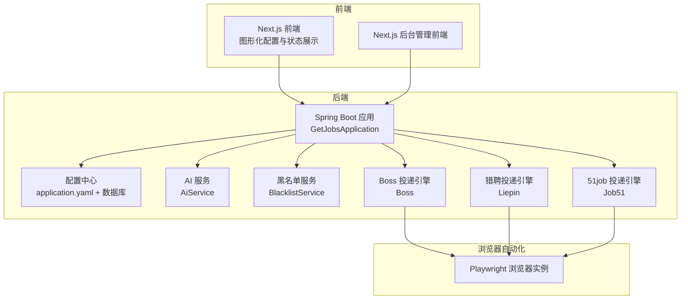
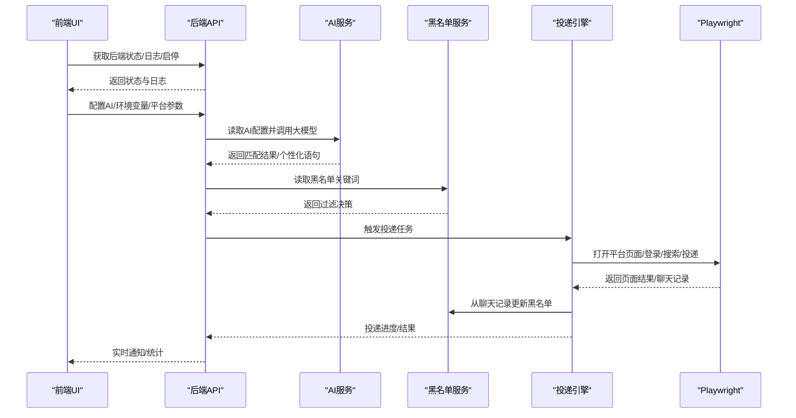
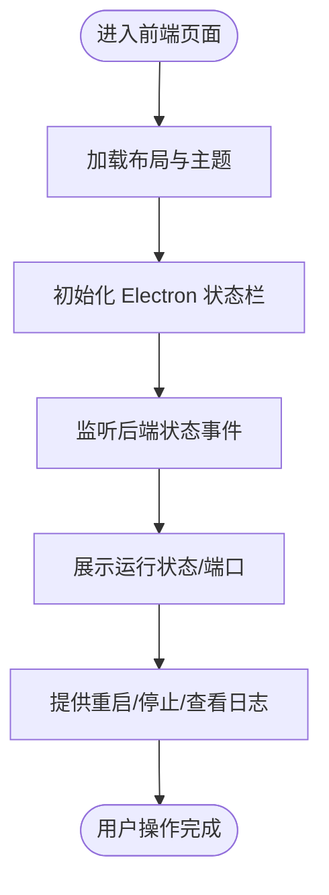
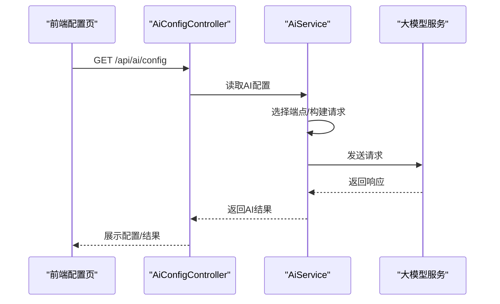
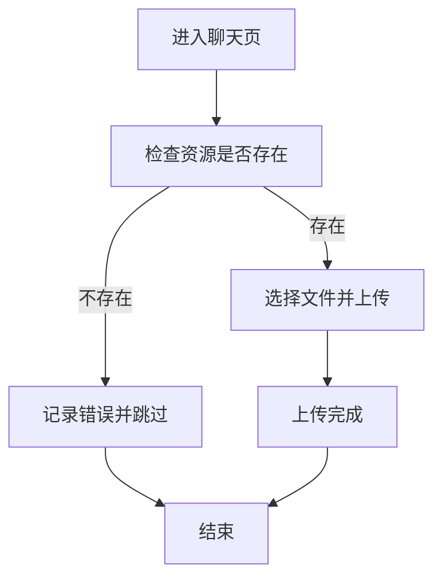
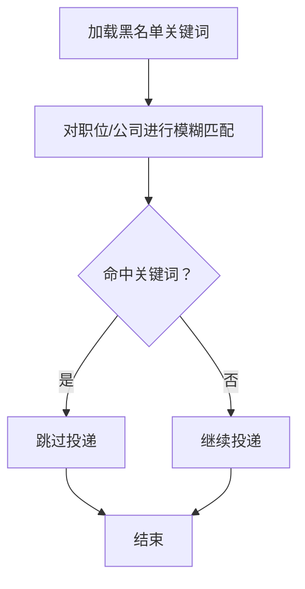
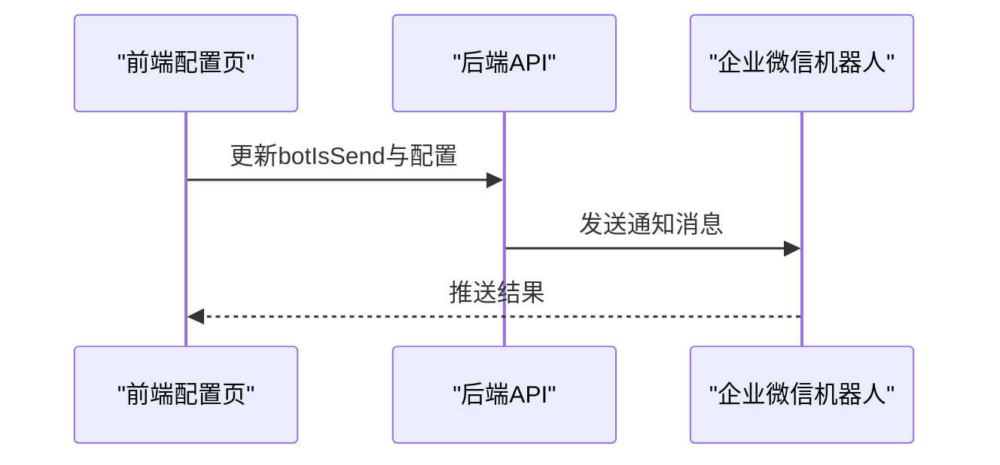
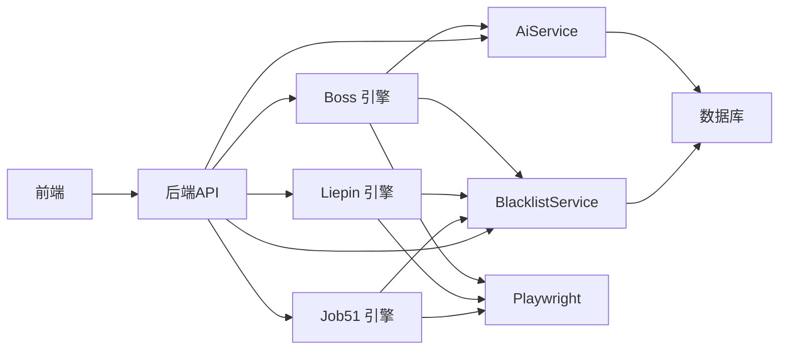

# 核心功能特性

<cite>
**本文引用的文件**   
- [GetJobsApplication.java](file://backend/src/main/java/com/getjobs/GetJobsApplication.java)
- [application.yaml](file://backend/src/main/resources/application.yaml)
- [README.md](file://README.md)
- [layout.tsx](file://front/app/layout.tsx)
- [layout.tsx](file://front-admin/app/layout.tsx)
- [useBackendStatus.ts](file://front/hooks/useBackendStatus.ts)
- [server.config.js](file://front/server.config.js)
- [ElectronStatusBar.tsx](file://front/app/components/ElectronStatusBar.tsx)
- [AiConfigController.java](file://backend/src/main/java/com/getjobs/application/controller/AiConfigController.java)
- [AiService.java](file://backend/src/main/java/com/getjobs/application/service/AiService.java)
- [Boss.java](file://backend/src/main/java/com/getjobs/worker/boss/Boss.java)
- [BlacklistService.java](file://backend/src/main/java/com/getjobs/application/service/BlacklistService.java)
- [Liepin.java](file://backend/src/main/java/com/getjobs/worker/liepin/Liepin.java)
- [Job51.java](file://backend/src/main/java/com/getjobs/worker/job51/Job51.java)
- [env-config/page.tsx](file://front/app/env-config/page.tsx)
</cite>

## 目录
1. [引言](#引言)
2. [项目结构](#项目结构)
3. [核心组件](#核心组件)
4. [架构总览](#架构总览)
5. [详细组件分析](#详细组件分析)
6. [依赖分析](#依赖分析)
7. [性能考量](#性能考量)
8. [故障排查指南](#故障排查指南)
9. [结论](#结论)
10. [附录](#附录)

## 引言
本文件面向 GetJobs 系统使用者与维护者，系统性阐述图形化界面、AI 智能匹配、图片简历发送、智能过滤、实时通知、黑名单功能、易于配置、持久登录等八大核心特性。文档不仅解释技术实现原理与使用场景，还提供配置方法、实际效果说明、各招聘平台（Boss 直聘、猎聘、51job、智联招聘）的特定功能与限制，并给出最佳实践建议，帮助用户最大化系统价值。

## 项目结构
GetJobs 采用前后端分离架构：前端 Next.js 应用负责图形化配置与运行状态展示；后端 Spring Boot 应用提供 REST API、调度与自动化逻辑；Playwright 控制真实浏览器完成各平台投递动作；配置由 application.yaml 与数据库共同承载；Electron 状态栏在桌面环境下提供后端启停与日志查看能力。

**图表来源**
- [GetJobsApplication.java:15-21](file://backend/src/main/java/com/getjobs/GetJobsApplication.java#L15-L21)
- [application.yaml:13-91](file://backend/src/main/resources/application.yaml#L13-L91)
- [layout.tsx:16-52](file://front/app/layout.tsx#L16-L52)
- [layout.tsx:13-25](file://front-admin/app/layout.tsx#L13-L25)

**章节来源**
- [GetJobsApplication.java:15-21](file://backend/src/main/java/com/getjobs/GetJobsApplication.java#L15-L21)
- [application.yaml:13-91](file://backend/src/main/resources/application.yaml#L13-L91)
- [layout.tsx:16-52](file://front/app/layout.tsx#L16-L52)
- [layout.tsx:13-25](file://front-admin/app/layout.tsx#L13-L25)

## 核心组件
- 图形化界面与运行控制：前端 Next.js 应用提供侧边栏、内容区、主题切换、Electron 状态栏；通过 Electron API 获取后端状态、日志与控制启停。
- AI 智能匹配：后端 AiService 读取数据库中的 AI 配置（BASE_URL、API_KEY、MODEL），向外部大模型服务发起请求，支持 Responses API 与 Chat Completions API，自动降级与兼容处理。
- 图片简历发送：Boss 引擎在发送打招呼语后自动进入聊天页并上传 resume.jpg，提升 HR 主动索要简历的概率。
- 智能过滤：BlacklistService 从数据库 common_option 表读取黑名单关键词，对职位名称与公司名称进行模糊匹配过滤。
- 实时通知：前端 env-config 页面提供企业微信 Webhook 开关与配置，结合后端通知通道实现投递状态推送。
- 黑名单功能：Boss 与通用黑名单服务联动，从聊天记录中识别不合适公司并自动入库，避免重复投递。
- 易于配置：application.yaml 集中管理数据库、日志、Playwright 参数与 JWT 等全局配置；前端页面提供平台配置与环境变量配置入口。
- 持久登录：Playwright 配置包含 Cookie 刷新策略与页面池管理，减少频繁扫码与登录成本。

**章节来源**
- [layout.tsx:16-52](file://front/app/layout.tsx#L16-L52)
- [useBackendStatus.ts:11-100](file://front/hooks/useBackendStatus.ts#L11-L100)
- [ElectronStatusBar.tsx:91-121](file://front/app/components/ElectronStatusBar.tsx#L91-L121)
- [AiService.java:38-147](file://backend/src/main/java/com/getjobs/application/service/AiService.java#L38-L147)
- [Boss.java:860-916](file://backend/src/main/java/com/getjobs/worker/boss/Boss.java#L860-L916)
- [BlacklistService.java:30-98](file://backend/src/main/java/com/getjobs/application/service/BlacklistService.java#L30-L98)
- [env-config/page.tsx:149-173](file://front/app/env-config/page.tsx#L149-L173)
- [application.yaml:13-91](file://backend/src/main/resources/application.yaml#L13-L91)

## 架构总览
系统通过前端 Electron 状态栏与后端 Spring Boot 应用交互，后端通过 Playwright 控制浏览器访问各招聘平台，结合 AI 与黑名单服务实现智能化投递与过滤。

**图表来源**
- [useBackendStatus.ts:20-61](file://front/hooks/useBackendStatus.ts#L20-L61)
- [AiService.java:38-147](file://backend/src/main/java/com/getjobs/application/service/AiService.java#L38-L147)
- [BlacklistService.java:30-98](file://backend/src/main/java/com/getjobs/application/service/BlacklistService.java#L30-L98)
- [Boss.java:137-200](file://backend/src/main/java/com/getjobs/worker/boss/Boss.java#L137-L200)
- [Liepin.java:105-130](file://backend/src/main/java/com/getjobs/worker/liepin/Liepin.java#L105-L130)
- [Job51.java:68-107](file://backend/src/main/java/com/getjobs/worker/job51/Job51.java#L68-L107)

## 详细组件分析

### 图形化界面与运行控制
- 前端布局采用侧边栏 + 内容区 + 主题切换，动态导入 Electron 状态栏组件，仅在 Electron 环境渲染。
- Electron 状态栏显示后端运行状态、端口、重启按钮与日志查看按钮；前端通过 Electron API 获取后端状态与日志流，定时刷新并支持手动重启/停止。
- 前端 server.config.js 固定后端 API 地址为 18888 端口，便于前后端通信。

**图表来源**
- [layout.tsx:16-52](file://front/app/layout.tsx#L16-L52)
- [ElectronStatusBar.tsx:91-121](file://front/app/components/ElectronStatusBar.tsx#L91-L121)
- [useBackendStatus.ts:20-61](file://front/hooks/useBackendStatus.ts#L20-L61)
- [server.config.js:29-31](file://front/server.config.js#L29-L31)

**章节来源**
- [layout.tsx:16-52](file://front/app/layout.tsx#L16-L52)
- [ElectronStatusBar.tsx:91-121](file://front/app/components/ElectronStatusBar.tsx#L91-L121)
- [useBackendStatus.ts:11-100](file://front/hooks/useBackendStatus.ts#L11-L100)
- [server.config.js:29-31](file://front/server.config.js#L29-L31)

### AI 智能匹配（Boss 直聘）
- AI 配置管理：后端 AiConfigController 提供获取 AI 配置的 REST 接口；AiService 从数据库读取 BASE_URL、API_KEY、MODEL，并自动选择 Responses API 或 Chat Completions 端点。
- 请求兼容与降级：AiService 对推理模型与参数错误具备自动降级能力，兼容多种代理/服务端响应结构，保证稳定性。
- 业务集成：Boss 引擎在发送打招呼语前调用 AI 服务生成个性化语句，显著提升回复率。

**图表来源**
- [AiConfigController.java:30-49](file://backend/src/main/java/com/getjobs/application/controller/AiConfigController.java#L30-L49)
- [AiService.java:38-147](file://backend/src/main/java/com/getjobs/application/service/AiService.java#L38-L147)

**章节来源**
- [AiConfigController.java:30-49](file://backend/src/main/java/com/getjobs/application/controller/AiConfigController.java#L30-L49)
- [AiService.java:38-147](file://backend/src/main/java/com/getjobs/application/service/AiService.java#L38-L147)
- [README.md:44-104](file://README.md#L44-L104)

### 图片简历发送（Boss 直聘）
- 上传流程：Boss 引擎在聊天页自动上传 resume.jpg，支持从类路径或临时文件读取图片，确保资源可用性。
- 错误处理：若资源缺失或页面元素不可见，记录错误并跳过发送，避免阻塞投递流程。

**图表来源**
- [Boss.java:860-916](file://backend/src/main/java/com/getjobs/worker/boss/Boss.java#L860-L916)

**章节来源**
- [Boss.java:860-916](file://backend/src/main/java/com/getjobs/worker/boss/Boss.java#L860-L916)
- [README.md:111-115](file://README.md#L111-L115)

### 智能过滤与黑名单功能
- 黑名单来源：BlacklistService 从数据库 common_option 表读取 type='blacklist' 的关键词，统一转小写进行模糊匹配。
- 过滤策略：对职位名称与公司名称进行包含匹配，命中即跳过投递。
- 动态更新：Boss 从聊天记录中识别不合适公司并入库，持续优化过滤效果。

**图表来源**
- [BlacklistService.java:30-98](file://backend/src/main/java/com/getjobs/application/service/BlacklistService.java#L30-L98)
- [Boss.java:137-200](file://backend/src/main/java/com/getjobs/worker/boss/Boss.java#L137-L200)

**章节来源**
- [BlacklistService.java:30-98](file://backend/src/main/java/com/getjobs/application/service/BlacklistService.java#L30-L98)
- [Boss.java:137-200](file://backend/src/main/java/com/getjobs/worker/boss/Boss.java#L137-L200)
- [README.md:47-48](file://README.md#L47-L48)

### 实时通知（企业微信 Webhook）
- 前端 env-config 页面提供企业微信 Webhook 开关与配置入口，支持启用/禁用通知。
- 通知内容：结合投递进度与结果，通过 Webhook 推送到企业微信群，便于团队协作与追踪。

**图表来源**
- [env-config/page.tsx:149-173](file://front/app/env-config/page.tsx#L149-L173)

**章节来源**
- [env-config/page.tsx:149-173](file://front/app/env-config/page.tsx#L149-L173)
- [README.md:47](file://README.md#L47)

### 易于配置
- 集中式配置：application.yaml 管理数据库连接、日志、Playwright 性能与稳定性参数、JWT 等。
- 平台差异化：Playwright 针对 Boss、猎聘、51job、智联招聘设置不同导航超时，兼顾稳定性与效率。
- 前端配置入口：提供平台配置页与环境变量配置页，降低上手成本。

**章节来源**
- [application.yaml:13-91](file://backend/src/main/resources/application.yaml#L13-L91)
- [README.md:79-101](file://README.md#L79-L101)

### 持久登录
- Cookie 管理：Playwright 配置包含 Cookie 刷新策略（过期前刷新）、页面池与空闲回收，减少重复扫码。
- 登录检测：统一登录检测间隔，平衡稳定性与性能。

**章节来源**
- [application.yaml:89-91](file://backend/src/main/resources/application.yaml#L89-L91)
- [application.yaml:60-87](file://backend/src/main/resources/application.yaml#L60-L87)

### 各招聘平台特性与限制

#### Boss 直聘
- 优势：支持 AI 生成个性化打招呼语；可自动发送图片简历；每日打招呼上限调整为 150 次；聊天记录可用于更新黑名单。
- 限制：Boss 新增检测机制，投递过程中可能出现页面回退，需关注社区反馈与解决方案。
- 使用建议：配置好打招呼语与图片简历，启用 AI 匹配与黑名单过滤，提高回复率与精准度。

**章节来源**
- [README.md:105-110](file://README.md#L105-L110)
- [README.md:44-46](file://README.md#L44-L46)
- [Boss.java:137-200](file://backend/src/main/java/com/getjobs/worker/boss/Boss.java#L137-L200)

#### 猎聘
- 优势：默认打招呼无上限，适合量大策略；需在猎聘 App 设置打招呼语，避免主动发消息被限制。
- 限制：需要微信扫码登录并绑定微信账号；主动发消息有上限，成功率相对较低。
- 使用建议：优先使用“打招呼”策略，避免主动消息；确保 App 已设置默认打招呼语。

**章节来源**
- [README.md:116-121](file://README.md#L116-L121)
- [Liepin.java:105-130](file://backend/src/main/java/com/getjobs/worker/liepin/Liepin.java#L105-L130)

#### 51job
- 限制：投递存在上限，搜索到的岗位数量有限，平台质量不佳，不建议使用。
- 使用建议：如必须使用，建议每页投递后短暂暂停以规避限流。

**章节来源**
- [README.md:122-127](file://README.md#L122-L127)
- [Job51.java:68-107](file://backend/src/main/java/com/getjobs/worker/job51/Job51.java#L68-L107)

#### 智联招聘
- 限制：投递上限约 100 次，平台质量不佳，不建议使用；需指定默认投递简历类型。
- 使用建议：谨慎使用，优先其他平台。

**章节来源**
- [README.md:128-132](file://README.md#L128-L132)

## 依赖分析
- 组件耦合：Boss、Liepin、Job51 引擎均依赖 BlacklistService 与 Playwright；Boss 引擎额外依赖 AiService。
- 外部依赖：MySQL 数据库存储配置与运行数据；企业微信 Webhook 用于通知；大模型服务（通过 AiService）用于智能匹配。
- 配置依赖：application.yaml 为全局配置中心，前端 server.config.js 固定后端 API 地址。

**图表来源**
- [AiService.java:30-334](file://backend/src/main/java/com/getjobs/application/service/AiService.java#L30-L334)
- [BlacklistService.java:17-99](file://backend/src/main/java/com/getjobs/application/service/BlacklistService.java#L17-L99)
- [Boss.java:47-63](file://backend/src/main/java/com/getjobs/worker/boss/Boss.java#L47-L63)
- [Liepin.java:54-58](file://backend/src/main/java/com/getjobs/worker/liepin/Liepin.java#L54-L58)
- [Job51.java:36-51](file://backend/src/main/java/com/getjobs/worker/job51/Job51.java#L36-L51)
- [application.yaml:13-91](file://backend/src/main/resources/application.yaml#L13-L91)

**章节来源**
- [AiService.java:30-334](file://backend/src/main/java/com/getjobs/application/service/AiService.java#L30-L334)
- [BlacklistService.java:17-99](file://backend/src/main/java/com/getjobs/application/service/BlacklistService.java#L17-L99)
- [Boss.java:47-63](file://backend/src/main/java/com/getjobs/worker/boss/Boss.java#L47-L63)
- [Liepin.java:54-58](file://backend/src/main/java/com/getjobs/worker/liepin/Liepin.java#L54-L58)
- [Job51.java:36-51](file://backend/src/main/java/com/getjobs/worker/job51/Job51.java#L36-L51)
- [application.yaml:13-91](file://backend/src/main/resources/application.yaml#L13-L91)

## 性能考量
- Playwright 调优：慢动作、导航超时、重试策略、页面池大小与空闲回收时间直接影响稳定性与吞吐；针对不同平台设置差异化超时。
- 网络拦截与解析：51job 通过拦截搜索接口解析 JSON 并批量入库，减少页面读取开销；需注意请求去重与 Content-Type 判断。
- 日志与监控：统一日志级别与滚动策略，便于定位问题；前端 Electron 状态栏提供运行状态可视化。

**章节来源**
- [application.yaml:60-87](file://backend/src/main/resources/application.yaml#L60-L87)
- [Job51.java:117-179](file://backend/src/main/java/com/getjobs/worker/job51/Job51.java#L117-L179)

## 故障排查指南
- 后端状态与日志：通过 Electron 状态栏查看后端运行状态、端口与日志；定时刷新与手动重启有助于恢复异常。
- AI 请求失败：检查 BASE_URL、API_KEY、MODEL 配置；关注 Responses/Chat Completions 端点选择与自动降级日志。
- 黑名单误伤：调整关键词或清空数据库中黑名单记录；确认模糊匹配规则与大小写处理。
- 平台异常：Boss 检测机制导致页面回退；51job 与智联招聘存在投递上限与平台限制，建议切换至猎聘或 Boss。

**章节来源**
- [useBackendStatus.ts:20-61](file://front/hooks/useBackendStatus.ts#L20-L61)
- [AiService.java:132-147](file://backend/src/main/java/com/getjobs/application/service/AiService.java#L132-L147)
- [BlacklistService.java:46-98](file://backend/src/main/java/com/getjobs/application/service/BlacklistService.java#L46-L98)
- [README.md:24-30](file://README.md#L24-L30)

## 结论
GetJobs 通过图形化界面、AI 智能匹配、图片简历发送、智能过滤、实时通知、黑名单功能、易于配置与持久登录等特性，形成一套完整的自动化求职投递体系。Boss 直聘在 AI 与图片简历方面具备突出优势，猎聘适合量大策略，而 51job 与智联招聘受限较多。建议用户结合自身目标与平台特性，合理配置并遵循最佳实践，以获得更高的投递成功率与体验。

## 附录
- 快速上手步骤：克隆仓库 → 配置环境 → 修改前端配置并保存 → 启动后端 GetJobsApplication → 通过前端 Electron 状态栏查看与控制。
- 环境要求：JDK 21、Gradle、网络可访问各招聘平台与大模型服务；关闭墙外代理以保证页面加载速度。

**章节来源**
- [README.md:64-136](file://README.md#L64-L136)
- [GetJobsApplication.java:19-21](file://backend/src/main/java/com/getjobs/GetJobsApplication.java#L19-L21)