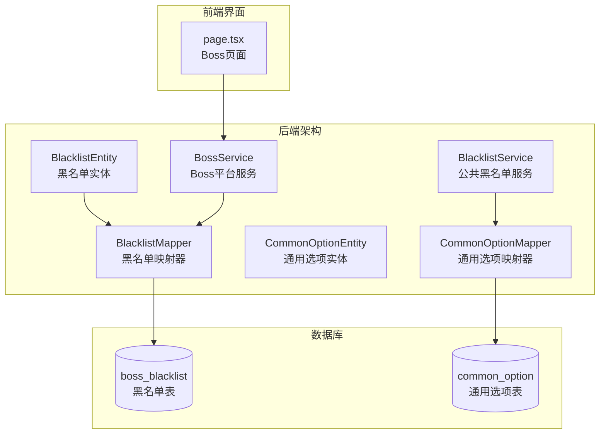
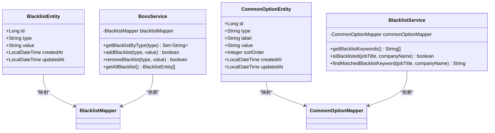
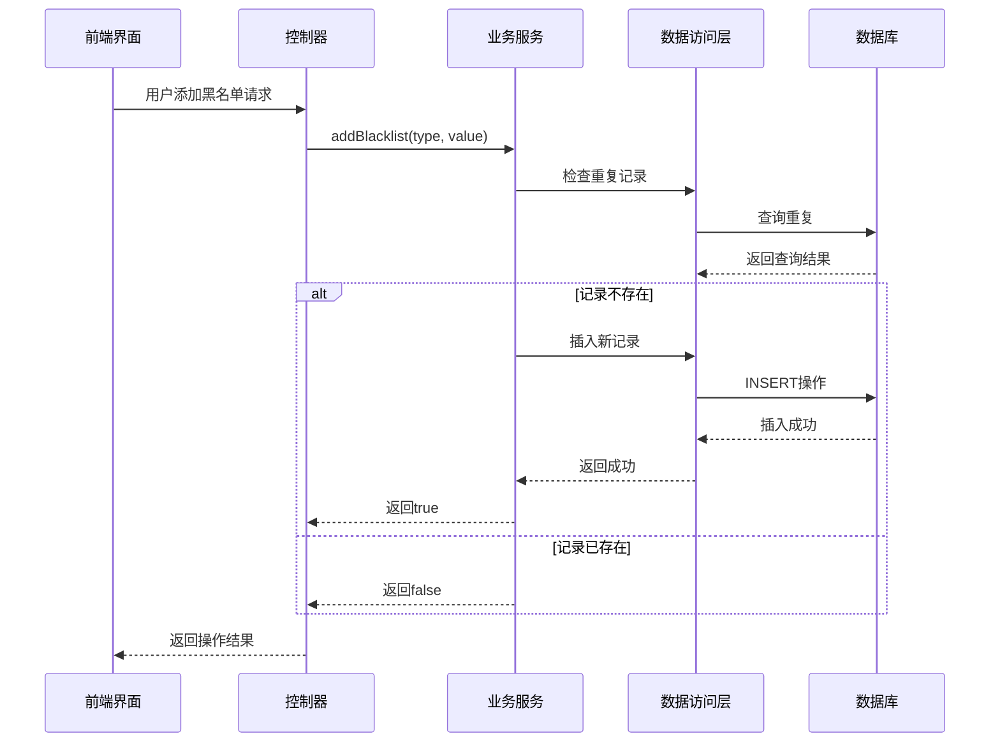
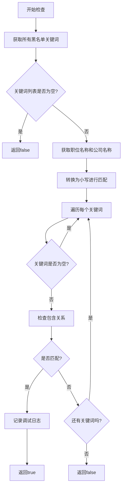
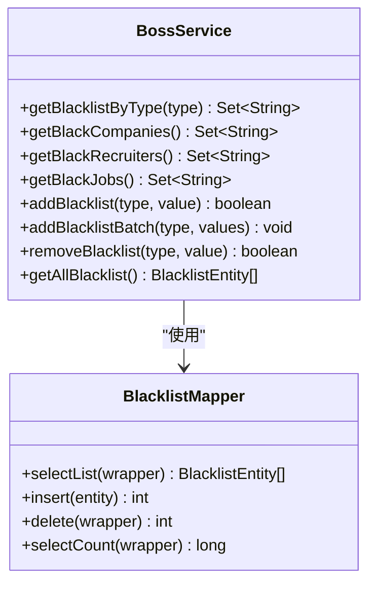
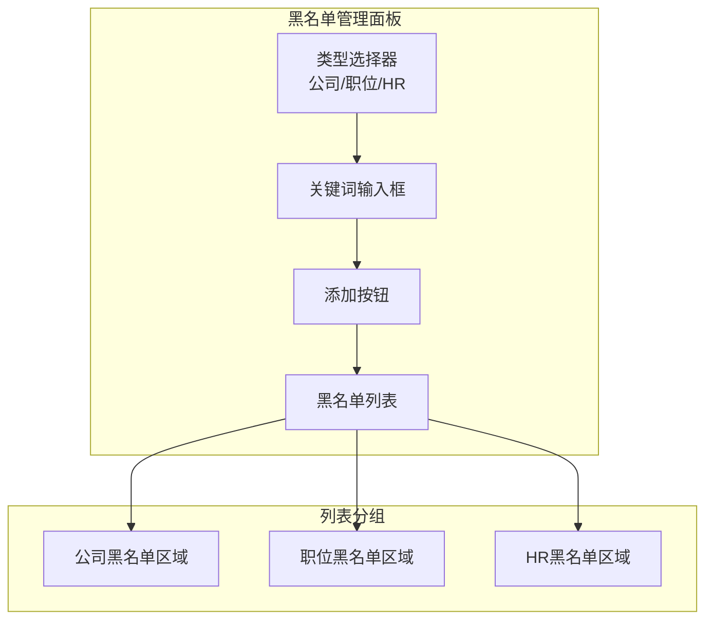
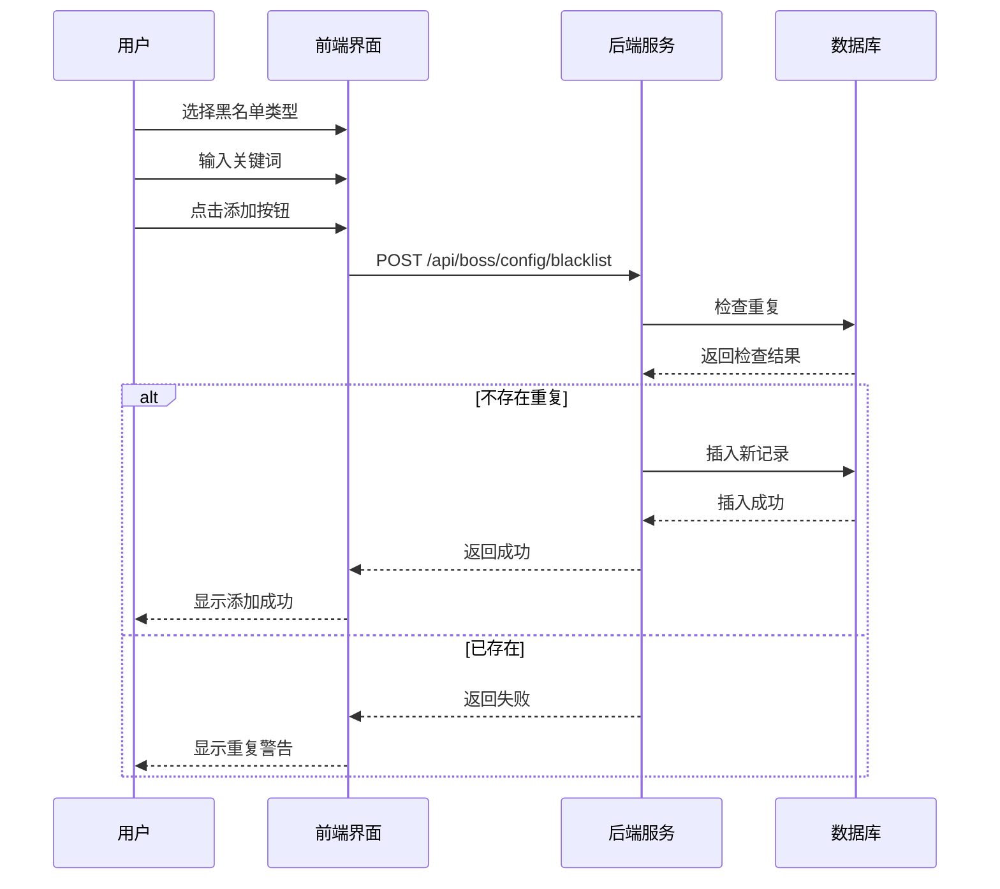
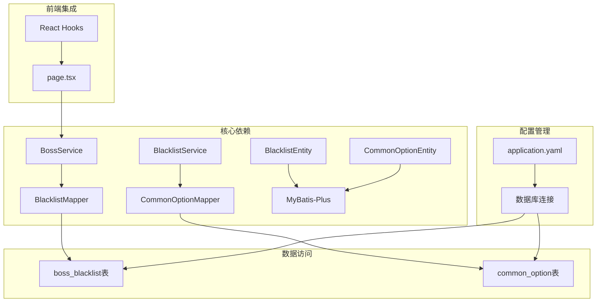

# 黑名单功能

<cite>
**本文档引用的文件**
- [BlacklistEntity.java](file://backend/src/main/java/com/getjobs/application/entity/BlacklistEntity.java)
- [BlacklistMapper.java](file://backend/src/main/java/com/getjobs/application/mapper/BlacklistMapper.java)
- [BlacklistService.java](file://backend/src/main/java/com/getjobs/application/service/BlacklistService.java)
- [CommonOptionEntity.java](file://backend/src/main/java/com/getjobs/application/entity/CommonOptionEntity.java)
- [CommonOptionMapper.java](file://backend/src/main/java/com/getjobs/application/mapper/CommonOptionMapper.java)
- [BossService.java](file://backend/src/main/java/com/getjobs/application/service/BossService.java)
- [page.tsx](file://front/app/boss/page.tsx)
</cite>

## 目录
1. [简介](#简介)
2. [项目结构](#项目结构)
3. [核心组件](#核心组件)
4. [架构概览](#架构概览)
5. [详细组件分析](#详细组件分析)
6. [依赖关系分析](#依赖关系分析)
7. [性能考虑](#性能考虑)
8. [故障排除指南](#故障排除指南)
9. [结论](#结论)
10. [附录](#附录)

## 简介

黑名单功能是求职自动化系统中的重要安全控制机制，用于防止系统对特定企业、职位或HR进行不当操作。该功能通过两种不同的机制实现：

1. **公共关键词黑名单**：基于通用关键词的模糊匹配过滤
2. **平台特定黑名单**：针对Boss直聘平台的企业、职位和HR进行精确匹配

黑名单功能不仅保护用户免受不良企业的骚扰，还能提高求职效率，让用户专注于优质职位。

## 项目结构

黑名单功能在项目中的组织结构如下：

**图表来源**
- [BlacklistEntity.java:1-43](file://backend/src/main/java/com/getjobs/application/entity/BlacklistEntity.java#L1-L43)
- [BlacklistMapper.java:1-13](file://backend/src/main/java/com/getjobs/application/mapper/BlacklistMapper.java#L1-L13)
- [BlacklistService.java:1-100](file://backend/src/main/java/com/getjobs/application/service/BlacklistService.java#L1-L100)
- [CommonOptionEntity.java:1-29](file://backend/src/main/java/com/getjobs/application/entity/CommonOptionEntity.java#L1-L29)
- [CommonOptionMapper.java:1-23](file://backend/src/main/java/com/getjobs/application/mapper/CommonOptionMapper.java#L1-L23)

**章节来源**
- [BlacklistEntity.java:1-43](file://backend/src/main/java/com/getjobs/application/entity/BlacklistEntity.java#L1-L43)
- [BlacklistMapper.java:1-13](file://backend/src/main/java/com/getjobs/application/mapper/BlacklistMapper.java#L1-L13)
- [BlacklistService.java:1-100](file://backend/src/main/java/com/getjobs/application/service/BlacklistService.java#L1-L100)
- [CommonOptionEntity.java:1-29](file://backend/src/main/java/com/getjobs/application/entity/CommonOptionEntity.java#L1-L29)
- [CommonOptionMapper.java:1-23](file://backend/src/main/java/com/getjobs/application/mapper/CommonOptionMapper.java#L1-L23)

## 核心组件

### 数据模型设计

黑名单功能采用双层架构设计，确保灵活性和可扩展性：

**图表来源**
- [BlacklistEntity.java:10-42](file://backend/src/main/java/com/getjobs/application/entity/BlacklistEntity.java#L10-L42)
- [CommonOptionEntity.java:10-28](file://backend/src/main/java/com/getjobs/application/entity/CommonOptionEntity.java#L10-L28)
- [BlacklistService.java:20-99](file://backend/src/main/java/com/getjobs/application/service/BlacklistService.java#L20-L99)
- [BossService.java:34-536](file://backend/src/main/java/com/getjobs/application/service/BossService.java#L34-L536)

### 黑名单类型分类

系统支持三种类型的黑名单：

1. **公司黑名单** (`company`)：阻止对特定公司的所有职位操作
2. **职位黑名单** (`job`)：阻止特定职位关键词的匹配
3. **HR黑名单** (`recruiter`)：阻止与特定HR的交互

**章节来源**
- [BlacklistEntity.java:23-31](file://backend/src/main/java/com/getjobs/application/entity/BlacklistEntity.java#L23-L31)
- [BossService.java:449-477](file://backend/src/main/java/com/getjobs/application/service/BossService.java#L449-L477)

## 架构概览

黑名单功能的整体架构分为三层：

**图表来源**
- [BossService.java:486-501](file://backend/src/main/java/com/getjobs/application/service/BossService.java#L486-L501)
- [BlacklistMapper.java:10-12](file://backend/src/main/java/com/getjobs/application/mapper/BlacklistMapper.java#L10-L12)

**章节来源**
- [BossService.java:428-536](file://backend/src/main/java/com/getjobs/application/service/BossService.java#L428-L536)

## 详细组件分析

### 公共黑名单服务 (BlacklistService)

公共黑名单服务负责处理基于关键词的模糊匹配过滤：

**图表来源**
- [BlacklistService.java:30-69](file://backend/src/main/java/com/getjobs/application/service/BlacklistService.java#L30-L69)

#### 关键特性

1. **模糊匹配算法**：使用包含关系进行文本匹配
2. **大小写不敏感**：自动转换为小写进行比较
3. **实时加载**：每次检查时重新加载关键词列表
4. **调试支持**：详细的匹配日志记录

**章节来源**
- [BlacklistService.java:12-99](file://backend/src/main/java/com/getjobs/application/service/BlacklistService.java#L12-L99)

### Boss平台黑名单服务 (BossService)

Boss平台专门的黑名单管理提供了更精细的控制：

#### 黑名单管理方法

**图表来源**
- [BossService.java:449-536](file://backend/src/main/java/com/getjobs/application/service/BossService.java#L449-L536)
- [BlacklistMapper.java:10-12](file://backend/src/main/java/com/getjobs/application/mapper/BlacklistMapper.java#L10-L12)

#### 批量管理功能

系统支持高效的批量黑名单管理：

1. **批量添加**：支持一次性添加多个黑名单项
2. **重复检测**：自动避免重复添加相同的黑名单项
3. **原子操作**：每个添加操作都是独立的事务

**章节来源**
- [BossService.java:486-511](file://backend/src/main/java/com/getjobs/application/service/BossService.java#L486-L511)

### 前端用户界面

前端Boss页面提供了直观的黑名单管理界面：

#### 界面组件结构

**图表来源**
- [page.tsx:804-828](file://front/app/boss/page.tsx#L804-L828)
- [page.tsx:832-926](file://front/app/boss/page.tsx#L832-L926)

#### 用户交互流程

**图表来源**
- [page.tsx:814-827](file://front/app/boss/page.tsx#L814-L827)
- [BossService.java:486-501](file://backend/src/main/java/com/getjobs/application/service/BossService.java#L486-L501)

**章节来源**
- [page.tsx:800-999](file://front/app/boss/page.tsx#L800-L999)

## 依赖关系分析

黑名单功能的依赖关系图：

**图表来源**
- [BlacklistService.java:22](file://backend/src/main/java/com/getjobs/application/service/BlacklistService.java#L22)
- [BossService.java:34](file://backend/src/main/java/com/getjobs/application/service/BossService.java#L34)
- [BlacklistEntity.java:14](file://backend/src/main/java/com/getjobs/application/entity/BlacklistEntity.java#L14)
- [CommonOptionEntity.java:11](file://backend/src/main/java/com/getjobs/application/entity/CommonOptionEntity.java#L11)

### 外部依赖

1. **MyBatis-Plus**：提供ORM映射和数据库访问
2. **Spring Boot**：依赖注入和事务管理
3. **SQLite/MySQL**：底层数据库存储
4. **React**：前端用户界面

**章节来源**
- [BlacklistMapper.java:3-5](file://backend/src/main/java/com/getjobs/application/mapper/BlacklistMapper.java#L3-L5)
- [CommonOptionMapper.java:3-7](file://backend/src/main/java/com/getjobs/application/mapper/CommonOptionMapper.java#L3-L7)

## 性能考虑

### 查询优化策略

1. **索引设计**：建议在 `boss_blacklist` 表的 `type` 和 `value` 字段上建立复合索引
2. **缓存机制**：可以考虑在内存中缓存黑名单关键词，减少数据库查询
3. **批量操作**：批量添加时使用事务批量提交

### 内存使用优化

1. **流式处理**：使用Stream API进行内存友好的数据处理
2. **延迟加载**：黑名单关键词按需加载，避免不必要的初始化
3. **对象复用**：重用字符串对象，减少内存分配

### 并发安全

1. **重复检查**：在添加黑名单前进行重复性检查
2. **事务隔离**：使用数据库事务确保数据一致性
3. **锁机制**：在高并发场景下考虑适当的锁策略

## 故障排除指南

### 常见问题及解决方案

#### 1. 黑名单添加失败

**症状**：添加黑名单时返回false

**原因分析**：
- 黑名单项已存在
- 数据库连接异常
- 参数验证失败

**解决步骤**：
1. 检查数据库中是否已存在相同的黑名单项
2. 验证数据库连接状态
3. 确认传入的参数格式正确

#### 2. 黑名单匹配不生效

**症状**：设置了黑名单但仍然匹配到相关内容

**排查步骤**：
1. 验证黑名单关键词是否正确存储
2. 检查模糊匹配逻辑是否正常工作
3. 确认大小写转换是否按预期执行

#### 3. 前端界面显示异常

**症状**：黑名单列表不显示或显示错误

**解决方法**：
1. 检查网络请求是否成功
2. 验证API响应数据格式
3. 确认React组件状态更新正常

**章节来源**
- [BossService.java:486-501](file://backend/src/main/java/com/getjobs/application/service/BossService.java#L486-L501)
- [BlacklistService.java:46-69](file://backend/src/main/java/com/getjobs/application/service/BlacklistService.java#L46-L69)

## 结论

黑名单功能通过其双层架构设计，为求职自动化系统提供了全面的安全保障。该功能具有以下优势：

1. **灵活的匹配机制**：支持关键词模糊匹配和精确匹配
2. **直观的用户界面**：提供友好的黑名单管理体验
3. **高效的数据处理**：优化的查询和缓存策略
4. **完善的错误处理**：全面的异常处理和故障恢复机制

通过合理配置和使用黑名单功能，用户可以显著提升求职体验，避免与不良企业或HR的接触，专注于高质量的职位机会。

## 附录

### 配置方法

#### 添加黑名单规则

1. 在Boss页面的黑名单管理区域选择类型
2. 输入相应的关键词
3. 点击添加按钮完成配置

#### 更新频率设置

系统支持实时更新，任何修改都会立即生效。

#### 清理策略

1. 定期审查黑名单列表的有效性
2. 移除不再需要的黑名单项
3. 建立定期清理机制

### 使用最佳实践

1. **分类管理**：按照公司、职位、HR类型分别管理
2. **定期维护**：定期更新和清理黑名单列表
3. **监控效果**：跟踪黑名单的过滤效果
4. **备份策略**：定期备份黑名单配置