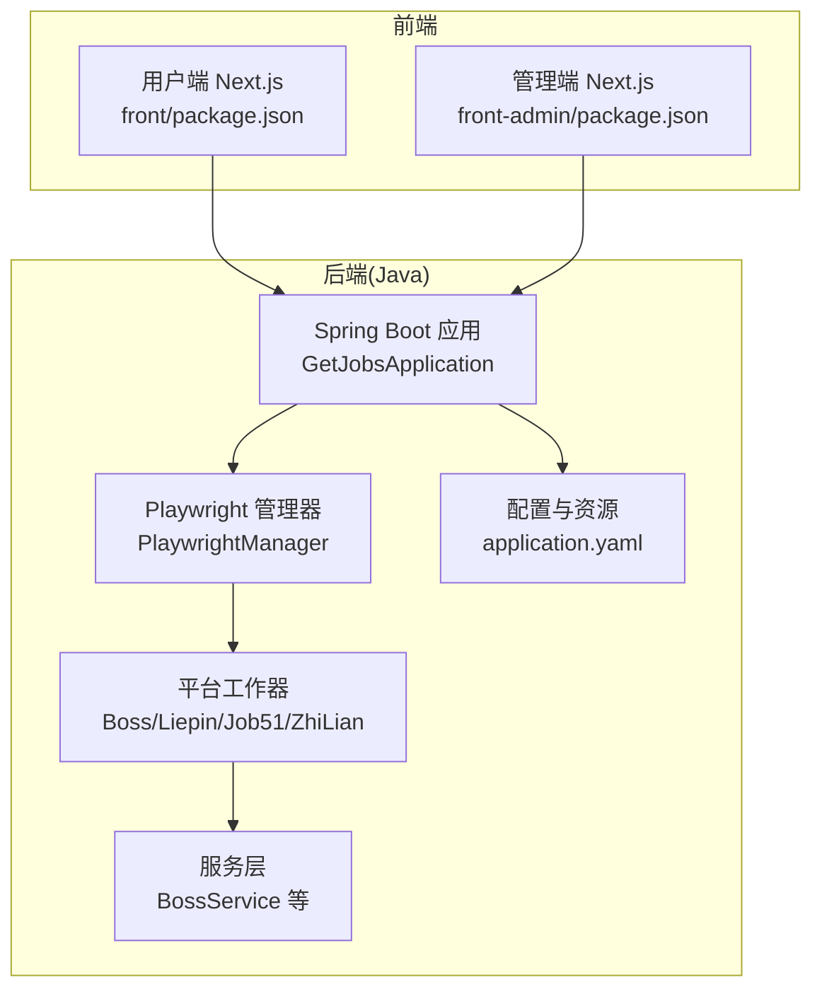
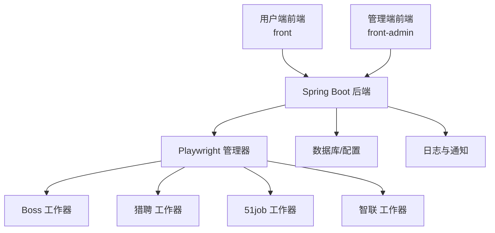
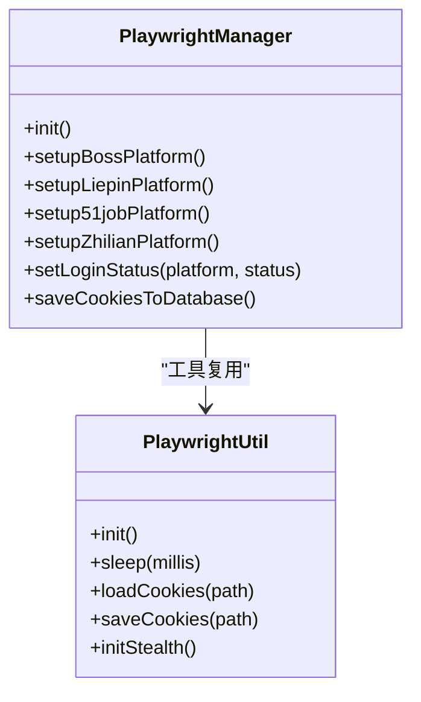
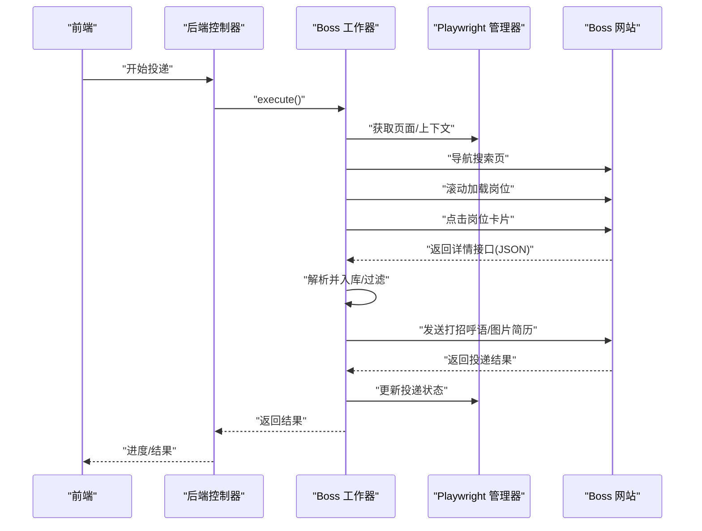
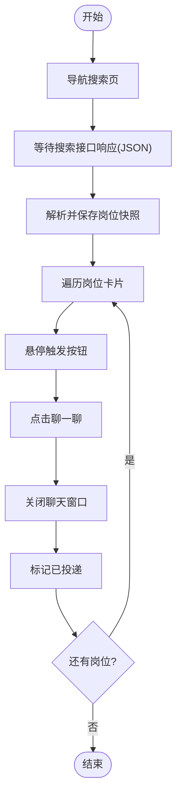
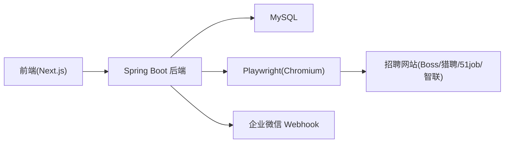

# 系统介绍

<cite>
**本文引用的文件**
- [README.md](file://README.md)
- [GetJobsApplication.java](file://backend/src/main/java/com/getjobs/GetJobsApplication.java)
- [application.yaml](file://backend/src/main/resources/application.yaml)
- [Boss.java](file://backend/src/main/java/com/getjobs/worker/boss/Boss.java)
- [Liepin.java](file://backend/src/main/java/com/getjobs/worker/liepin/Liepin.java)
- [ZhiLian.java](file://backend/src/main/java/com/getjobs/worker/zhilian/ZhiLian.java)
- [Job51.java](file://backend/src/main/java/com/getjobs/worker/job51/Job51.java)
- [PlaywrightUtil.java](file://backend/src/main/java/com/getjobs/worker/utils/PlaywrightUtil.java)
- [PlaywrightManager.java](file://backend/src/main/java/com/getjobs/worker/manager/PlaywrightManager.java)
- [BossService.java](file://backend/src/main/java/com/getjobs/application/service/BossService.java)
- [package.json(front)](file://front/package.json)
- [package.json(front-admin)](file://front-admin/package.json)
</cite>

## 目录
1. [简介](#简介)
2. [项目结构](#项目结构)
3. [核心组件](#核心组件)
4. [架构总览](#架构总览)
5. [详细组件分析](#详细组件分析)
6. [依赖关系分析](#依赖关系分析)
7. [性能考量](#性能考量)
8. [故障排查指南](#故障排查指南)
9. [结论](#结论)
10. [附录](#附录)

## 简介
GetJobs 求职助手是一个面向中国主流招聘平台的自动化求职辅助系统，旨在帮助求职者显著提升简历投递效率与成功率。系统通过图形化界面与后端自动化引擎结合，提供智能简历投递、实时通知、黑名单过滤、持久登录、AI智能匹配等能力，覆盖 Boss 直聘、猎聘、前程无忧、智联招聘等平台。

- 核心价值主张
  - 提升投递效率：自动浏览、筛选、投递，减少重复手工操作。
  - 提高成功率：智能过滤无效/低质量岗位，AI生成个性化打招呼语，图片简历直发。
  - 降低门槛：集中化配置与图形化界面，新手也能快速上手。
  - 透明可控：投递进度与结果可视化，支持调试模式与停止控制。

- 解决的关键痛点
  - 简历投递效率低：传统手动投递耗时耗力，系统通过自动化批量投递缩短周期。
  - HR 响应率低：通过 AI 智能匹配与个性化打招呼语，提升 HR 注意度。
  - 岗位筛选困难：多维度黑名单与规则过滤，精准命中合适岗位。
  - 平台风控与登录维护：持久登录与 Cookie 管理，降低重复扫码成本。

- 技术定位与应用场景
  - 技术定位：基于 Playwright 的浏览器自动化 + Spring Boot 后端 + React 前端的全栈系统。
  - 应用场景：应届毕业生、职场转型者、海归人才等需要高效求职的用户群体。
  - 开源免费：完全开源，遵循 MIT 协议，禁止商业化，适合个人与小团队使用。

- 适用人群与价值
  - 应届毕业生：批量投递、进度跟踪、AI 助手提升命中率。
  - 职场转型者：定向筛选、黑名单过滤、避免无效投递。
  - 海归人才：多平台覆盖、持久登录、稳定投递体验。

**章节来源**
- [README.md:1-240](file://README.md#L1-L240)

## 项目结构
系统采用前后端分离与模块化设计，后端以 Spring Boot 为核心，前端分为用户端与管理端，Playwright 管理器负责跨平台浏览器自动化。

**图表来源**
- [GetJobsApplication.java:1-22](file://backend/src/main/java/com/getjobs/GetJobsApplication.java#L1-L22)
- [PlaywrightManager.java:1-120](file://backend/src/main/java/com/getjobs/worker/manager/PlaywrightManager.java#L1-L120)
- [Boss.java:1-120](file://backend/src/main/java/com/getjobs/worker/boss/Boss.java#L1-L120)
- [application.yaml:1-91](file://backend/src/main/resources/application.yaml#L1-L91)
- [package.json(front):1-43](file://front/package.json#L1-L43)
- [package.json(front-admin):1-41](file://front-admin/package.json#L1-L41)

**章节来源**
- [GetJobsApplication.java:1-22](file://backend/src/main/java/com/getjobs/GetJobsApplication.java#L1-L22)
- [application.yaml:1-91](file://backend/src/main/resources/application.yaml#L1-L91)
- [package.json(front):1-43](file://front/package.json#L1-L43)
- [package.json(front-admin):1-41](file://front-admin/package.json#L1-L41)

## 核心组件
- Playwright 管理器（PlaywrightManager）
  - 统一初始化 Chromium，创建共享 BrowserContext 与多页面（Boss、猎聘、51job、智联）。
  - 支持资源拦截、反检测脚本注入、Cookie 管理与登录状态监控。
  - 提供页面池化与超时配置，保障稳定性与性能。

- 平台工作器（Boss/Liepin/Job51/ZhiLian）
  - 各平台专用的自动化流程：搜索、加载、解析、过滤、投递、状态更新。
  - 支持黑名单过滤、AI 智能匹配、图片简历发送、进度回调与停止控制。

- 服务层（BossService 等）
  - 数据访问与配置管理：选项加载、配置保存/更新、黑名单管理、投递状态统计。
  - 提供投递分析图表数据与 KPI 统计。

- 前端（用户端与管理端）
  - 用户端：配置编辑、投递控制、数据分析与通知。
  - 管理端：用户管理、充值与后台统计。

**章节来源**
- [PlaywrightManager.java:1-220](file://backend/src/main/java/com/getjobs/worker/manager/PlaywrightManager.java#L1-L220)
- [Boss.java:1-120](file://backend/src/main/java/com/getjobs/worker/boss/Boss.java#L1-L120)
- [Liepin.java:1-120](file://backend/src/main/java/com/getjobs/worker/liepin/Liepin.java#L1-L120)
- [Job51.java:1-120](file://backend/src/main/java/com/getjobs/worker/job51/Job51.java#L1-L120)
- [ZhiLian.java:1-120](file://backend/src/main/java/com/getjobs/worker/zhilian/ZhiLian.java#L1-L120)
- [BossService.java:1-120](file://backend/src/main/java/com/getjobs/application/service/BossService.java#L1-L120)
- [package.json(front):1-43](file://front/package.json#L1-L43)
- [package.json(front-admin):1-41](file://front-admin/package.json#L1-L41)

## 架构总览
系统采用“前端 + 后端 + 自动化引擎”的三层架构。前端通过 HTTP/SSE 与后端交互，后端通过 PlaywrightManager 统一调度各平台工作器，完成页面自动化与数据持久化。

**图表来源**
- [PlaywrightManager.java:114-221](file://backend/src/main/java/com/getjobs/worker/manager/PlaywrightManager.java#L114-L221)
- [Boss.java:112-125](file://backend/src/main/java/com/getjobs/worker/boss/Boss.java#L112-L125)
- [Liepin.java:105-130](file://backend/src/main/java/com/getjobs/worker/liepin/Liepin.java#L105-L130)
- [Job51.java:68-107](file://backend/src/main/java/com/getjobs/worker/job51/Job51.java#L68-L107)
- [ZhiLian.java:62-97](file://backend/src/main/java/com/getjobs/worker/zhilian/ZhiLian.java#L62-L97)
- [application.yaml:27-43](file://backend/src/main/resources/application.yaml#L27-L43)

**章节来源**
- [application.yaml:27-43](file://backend/src/main/resources/application.yaml#L27-L43)
- [PlaywrightManager.java:114-221](file://backend/src/main/java/com/getjobs/worker/manager/PlaywrightManager.java#L114-L221)

## 详细组件分析

### Playwright 管理器（跨平台自动化中枢）
- 职责
  - 初始化浏览器与上下文，注入反检测脚本，启用资源拦截。
  - 管理多页面生命周期，统一超时与慢动作配置。
  - 监控登录状态变化，触发回调并保存 Cookie。

- 关键特性
  - 页面池化：限制最大页面数，空闲回收，降低资源占用。
  - 平台差异化：为不同平台设置独立导航超时与行为。
  - Cookie 管理：从数据库加载 Cookie，自动刷新与持久化。

**图表来源**
- [PlaywrightManager.java:114-221](file://backend/src/main/java/com/getjobs/worker/manager/PlaywrightManager.java#L114-L221)
- [PlaywrightUtil.java:44-118](file://backend/src/main/java/com/getjobs/worker/utils/PlaywrightUtil.java#L44-L118)

**章节来源**
- [PlaywrightManager.java:114-221](file://backend/src/main/java/com/getjobs/worker/manager/PlaywrightManager.java#L114-L221)
- [PlaywrightUtil.java:44-118](file://backend/src/main/java/com/getjobs/worker/utils/PlaywrightUtil.java#L44-L118)

### Boss 直聘工作器（智能投递与黑名单）
- 职责
  - 构建搜索 URL，加载岗位列表，解析详情并入库。
  - 基于黑名单与规则过滤无效岗位，AI 生成打招呼语，发送图片简历。
  - 更新投递状态，记录成功/失败结果。

- 关键流程
  - 搜索与加载：滚动触底、懒加载、详情接口拦截解析。
  - 过滤与投递：黑名单匹配、HR 活跃度、打招呼与图片简历。
  - 状态更新：根据 encrypt_id/encrypt_user_id 更新投递状态。

**图表来源**
- [Boss.java:112-125](file://backend/src/main/java/com/getjobs/worker/boss/Boss.java#L112-L125)
- [Boss.java:228-434](file://backend/src/main/java/com/getjobs/worker/boss/Boss.java#L228-L434)
- [PlaywrightManager.java:167-200](file://backend/src/main/java/com/getjobs/worker/manager/PlaywrightManager.java#L167-L200)

**章节来源**
- [Boss.java:112-125](file://backend/src/main/java/com/getjobs/worker/boss/Boss.java#L112-L125)
- [Boss.java:228-434](file://backend/src/main/java/com/getjobs/worker/boss/Boss.java#L228-L434)

### 猎聘工作器（消息发送与批量处理）
- 职责
  - 监听搜索接口响应，解析并批量保存岗位快照。
  - 通过悬停/点击“聊一聊”按钮完成投递，支持“继续聊”识别。
  - 标记投递状态并记录成功岗位。

- 关键流程
  - 接口拦截：精确匹配 PC 搜索接口，解析 JSON。
  - 投递执行：定位按钮、悬停触发、点击与关闭窗口。
  - 状态更新：按 jobId 标记已投递。

**图表来源**
- [Liepin.java:64-103](file://backend/src/main/java/com/getjobs/worker/liepin/Liepin.java#L64-L103)
- [Liepin.java:133-188](file://backend/src/main/java/com/getjobs/worker/liepin/Liepin.java#L133-L188)
- [Liepin.java:327-598](file://backend/src/main/java/com/getjobs/worker/liepin/Liepin.java#L327-L598)

**章节来源**
- [Liepin.java:64-103](file://backend/src/main/java/com/getjobs/worker/liepin/Liepin.java#L64-L103)
- [Liepin.java:327-598](file://backend/src/main/java/com/getjobs/worker/liepin/Liepin.java#L327-L598)

### 前程无忧工作器（批量投递与弹窗处理）
- 职责
  - 监听搜索接口，采集 jobId 列表，批量勾选并投递。
  - 处理投递成功/失败弹窗，关闭下载 App 弹窗与遮罩层。
  - 检测日投递上限并及时停止。

- 关键流程
  - 采集与去重：从接口 JSON 提取 jobId，去重后缓存。
  - 批量投递：勾选岗位、点击批量投递、处理弹窗。
  - 上限检测：点击后快速轮询提示，避免超限。

**章节来源**
- [Job51.java:116-179](file://backend/src/main/java/com/getjobs/worker/job51/Job51.java#L116-L179)
- [Job51.java:253-322](file://backend/src/main/java/com/getjobs/worker/job51/Job51.java#L253-L322)
- [Job51.java:366-490](file://backend/src/main/java/com/getjobs/worker/job51/Job51.java#L366-L490)

### 智联招聘工作器（页面驱动与上限控制）
- 职责
  - 搜索关键词、翻页、采集岗位并入库。
  - 点击“立即投递”按钮，处理相似职位弹窗与关闭。
  - 检测投递上限并停止投递。

- 关键流程
  - 搜索与翻页：构建 URL、等待列表、点击下一页。
  - 投递执行：注册页面监听器统一关闭弹窗，标记投递状态。
  - 上限控制：检测“达到上限”提示，及时终止。

**章节来源**
- [ZhiLian.java:102-191](file://backend/src/main/java/com/getjobs/worker/zhilian/ZhiLian.java#L102-L191)
- [ZhiLian.java:197-351](file://backend/src/main/java/com/getjobs/worker/zhilian/ZhiLian.java#L197-L351)
- [ZhiLian.java:474-490](file://backend/src/main/java/com/getjobs/worker/zhilian/ZhiLian.java#L474-L490)

### 服务层（数据与配置）
- 职责
  - 配置加载与保存：解析列表、代码/名称互转、保存/更新配置。
  - 黑名单管理：按类型加载、添加/删除、批量操作。
  - 统计分析：投递 KPI、按状态/城市/行业等维度统计、薪资分桶与趋势。

**章节来源**
- [BossService.java:304-366](file://backend/src/main/java/com/getjobs/application/service/BossService.java#L304-L366)
- [BossService.java:449-526](file://backend/src/main/java/com/getjobs/application/service/BossService.java#L449-L526)
- [BossService.java:682-794](file://backend/src/main/java/com/getjobs/application/service/BossService.java#L682-L794)

## 依赖关系分析
- 组件耦合
  - PlaywrightManager 作为中枢，被各平台工作器依赖，解耦浏览器细节。
  - 工作器通过服务层访问数据库与配置，职责清晰。
  - 前端通过 HTTP 与 SSE 与后端交互，无直接耦合。

- 外部依赖
  - Playwright（Chromium）、MySQL（配置与数据）、Redis（可选）、企业微信 Webhook（通知）。
  - 前端依赖 Next.js、React、TailwindCSS、Chart.js 等。

**图表来源**
- [application.yaml:13-22](file://backend/src/main/resources/application.yaml#L13-L22)
- [PlaywrightManager.java:138-149](file://backend/src/main/java/com/getjobs/worker/manager/PlaywrightManager.java#L138-L149)
- [package.json(front):12-28](file://front/package.json#L12-L28)
- [package.json(front-admin):11-27](file://front-admin/package.json#L11-L27)

**章节来源**
- [application.yaml:13-22](file://backend/src/main/resources/application.yaml#L13-L22)
- [PlaywrightManager.java:138-149](file://backend/src/main/java/com/getjobs/worker/manager/PlaywrightManager.java#L138-L149)
- [package.json(front):12-28](file://front/package.json#L12-L28)
- [package.json(front-admin):11-27](file://front-admin/package.json#L11-L27)

## 性能考量
- 浏览器与资源优化
  - 启用资源拦截与反检测脚本，降低页面加载与检测成本。
  - 页面池化与空闲回收，限制最大页面数，避免内存膨胀。
  - 平台差异化超时与慢动作配置，平衡稳定性与速度。

- 数据与网络
  - 接口拦截解析，减少 DOM 解析压力，提升数据采集效率。
  - 批量保存与去重，降低数据库写入压力。

- 前端体验
  - SSE 实时进度推送，降低轮询开销。
  - 图表与统计按需加载，避免一次性渲染大量数据。

**章节来源**
- [PlaywrightManager.java:160-166](file://backend/src/main/java/com/getjobs/worker/manager/PlaywrightManager.java#L160-L166)
- [PlaywrightManager.java:185-190](file://backend/src/main/java/com/getjobs/worker/manager/PlaywrightManager.java#L185-L190)
- [Job51.java:157-169](file://backend/src/main/java/com/getjobs/worker/job51/Job51.java#L157-L169)

## 故障排查指南
- 常见问题
  - 平台风控与验证码：51job/智联招聘可能出现访问验证或投递上限，系统提供检测与停止逻辑。
  - 登录状态异常：通过登录状态监控与 Cookie 管理恢复，必要时重新扫码登录。
  - 页面元素不稳定：使用等待、重试与元素可见性判断，避免误操作。

- 排查步骤
  - 检查浏览器调试端口与日志，确认页面导航与元素定位。
  - 核对 Cookie 是否正确注入与刷新，避免未登录导致的失败。
  - 关注接口拦截与 JSON 解析，确保采集与投递链路完整。

**章节来源**
- [Job51.java:673-686](file://backend/src/main/java/com/getjobs/worker/job51/Job51.java#L673-L686)
- [PlaywrightManager.java:376-388](file://backend/src/main/java/com/getjobs/worker/manager/PlaywrightManager.java#L376-L388)
- [PlaywrightUtil.java:136-157](file://backend/src/main/java/com/getjobs/worker/utils/PlaywrightUtil.java#L136-L157)

## 结论
GetJobs 求职助手通过“前端配置 + 后端调度 + Playwright 自动化”的组合，实现了对主流招聘平台的高效投递与智能管理。系统具备稳定的跨平台自动化能力、完善的黑名单与过滤机制、可扩展的配置体系与可视化界面，能够显著提升求职者的投递效率与成功率。其开源免费的定位，使其成为个人与小团队的理想求职辅助工具。

## 附录
- 快速启动
  - 后端：启动 Spring Boot 应用，确保数据库与 Playwright 依赖可用。
  - 前端：分别启动用户端与管理端，访问对应端口。
- 配置要点
  - application.yaml 中的数据库、日志、Playwright 参数与端口。
  - 各平台 Cookie 与 AI 代理配置（如需）。

**章节来源**
- [application.yaml:1-91](file://backend/src/main/resources/application.yaml#L1-L91)
- [package.json(front):5-11](file://front/package.json#L5-L11)
- [package.json(front-admin):5-10](file://front-admin/package.json#L5-L10)