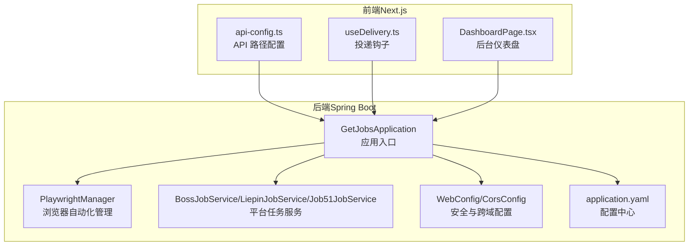
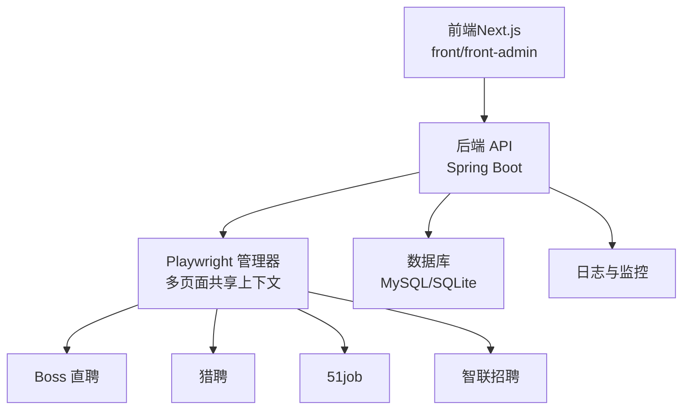
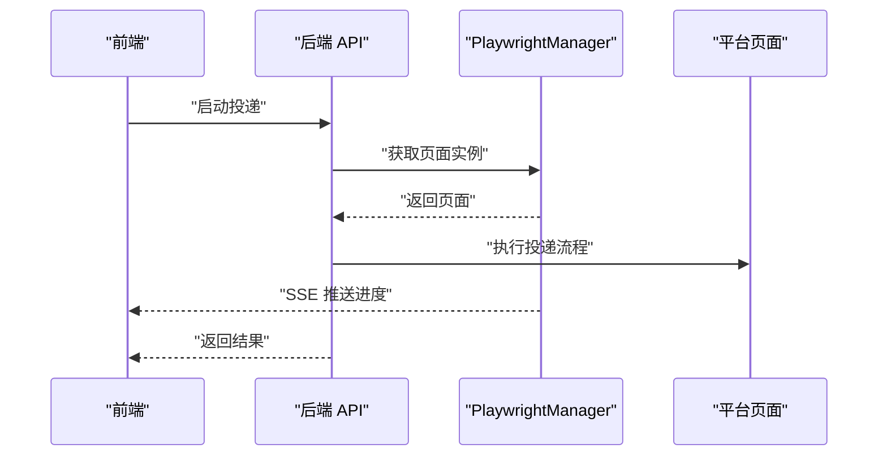
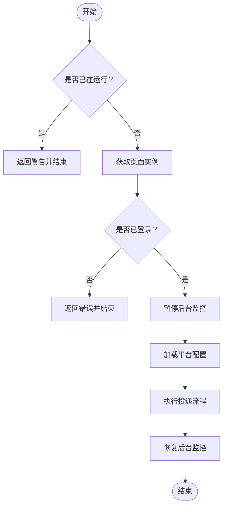
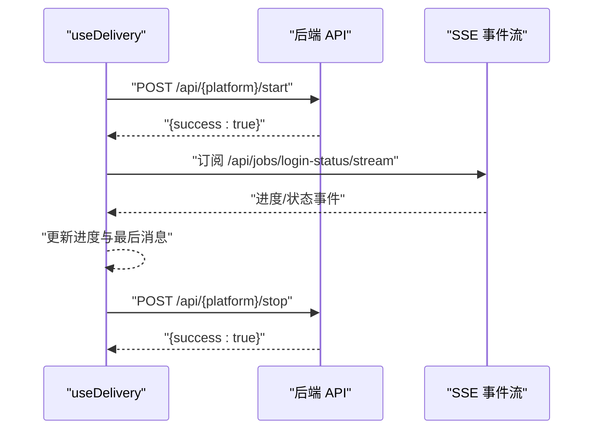
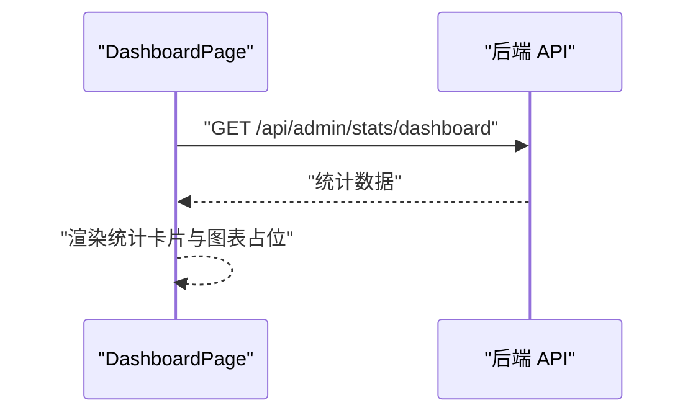
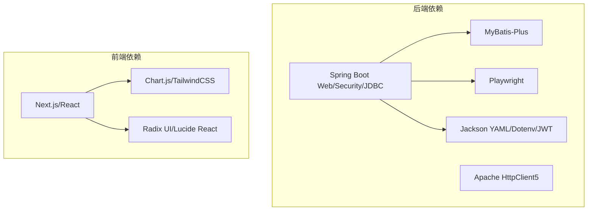

# 项目概述

<cite>
**本文引用的文件**
- [README.md](file://README.md)
- [RELEASE_GUIDE.md](file://RELEASE_GUIDE.md)
- [GetJobsApplication.java](file://backend/src/main/java/com/getjobs/GetJobsApplication.java)
- [pom.xml](file://backend/pom.xml)
- [application.yaml](file://backend/src/main/resources/application.yaml)
- [PlaywrightManager.java](file://backend/src/main/java/com/getjobs/worker/manager/PlaywrightManager.java)
- [BossJobService.java](file://backend/src/main/java/com/getjobs/worker/service/BossJobService.java)
- [LiepinJobService.java](file://backend/src/main/java/com/getjobs/worker/service/LiepinJobService.java)
- [Job51JobService.java](file://backend/src/main/java/com/getjobs/worker/service/Job51JobService.java)
- [WebConfig.java](file://backend/src/main/java/com/getjobs/application/config/WebConfig.java)
- [CorsConfig.java](file://backend/src/main/java/com/getjobs/application/config/CorsConfig.java)
- [api-config.ts](file://front/lib/api-config.ts)
- [useDelivery.ts](file://front/hooks/useDelivery.ts)
- [package.json（前端）](file://front/package.json)
- [package.json（后台管理前端）](file://front-admin/package.json)
- [DashboardPage.tsx](file://front-admin/app/dashboard/page.tsx)
</cite>

## 目录
1. [引言](#引言)
2. [项目结构](#项目结构)
3. [核心组件](#核心组件)
4. [架构总览](#架构总览)
5. [详细组件分析](#详细组件分析)
6. [依赖关系分析](#依赖关系分析)
7. [性能考量](#性能考量)
8. [故障排查指南](#故障排查指南)
9. [结论](#结论)
10. [附录](#附录)

## 引言
GetJobs 求职助手是一个面向国内主流招聘平台的自动化求职辅助系统，旨在帮助求职者高效地进行简历投递、智能筛选岗位、实时跟踪投递结果，并提供图形化界面与后台管理能力。系统通过 Spring Boot + Next.js + Playwright 的全栈组合，实现了稳定的浏览器自动化、灵活的前后端交互与可扩展的业务模块。

- 核心价值主张
  - 自动化投递：在 Boss 直聘、猎聘、51job、智联招聘等平台自动执行投递动作，减少重复劳动。
  - 智能匹配与过滤：基于关键词、薪资、行业等维度进行智能过滤，提升命中率。
  - 实时通知：通过企业微信等渠道推送投递状态，及时掌握进展。
  - 黑名单与持久登录：自动维护黑名单，减少无效投递；支持长期 Cookie 登录，降低重复扫码成本。
  - 图形化界面：提供用户端与后台管理端的可视化配置与监控面板，降低上手难度。

- 主要功能特性
  - 图形化界面与集中配置
  - AI 智能匹配与打招呼语生成（Boss 直聘）
  - 图片简历自动发送（Boss 直聘）
  - 智能过滤（不活跃 HR、猎头、目标薪资）
  - 实时通知与投递统计
  - 黑名单与持久登录
  - 易于配置的筛选规则与平台差异化的超时策略

- 技术架构优势
  - Spring Boot：稳定的企业级后端框架，提供自动配置、安全、调度与数据库集成能力。
  - Next.js：现代化前端框架，支持服务端渲染、类型安全与模块化组件。
  - Playwright：跨平台浏览器自动化，支持多标签页共享上下文、反检测脚本注入与资源拦截优化。
  - SSE 与 REST：前后端通过 SSE 实时推送登录状态与任务进度，REST API 提供配置与控制接口。
  - 数据持久化：MyBatis-Plus + MySQL/SQLite，支持配置、Cookie、投递报告等数据存储。

- 项目发展历程与开源协议
  - 项目处于持续迭代中，近期针对 Boss 直聘与智联招聘的检测机制进行了适配与优化。
  - 采用 MIT 开源协议，明确禁止商业化使用，鼓励社区贡献与协作。
  - 提供 GUI 版本与 Electron 集成能力，便于非技术用户使用。

- 社区贡献指南
  - 请在提交 PR 前先在 Issue 或 Discussions 中沟通，避免未经沟通的 PR 被拒绝。
  - PR 流程：Fork → 新建 dev 分支 → 提交 → 合并到 dev 分支 → 管理员审核。

- 快速开始
  - 环境要求：JDK 21、Gradle、Node.js（Next.js）、Playwright 浏览器驱动。
  - 启动后端：运行 Spring Boot 应用主类。
  - 启动前端：在 front 与 front-admin 目录分别安装依赖并启动开发服务器。
  - 配置平台 Cookie 与筛选规则，启动投递任务。

**章节来源**
- [README.md:1-240](file://README.md#L1-L240)

## 项目结构
系统采用前后端分离与多模块组织方式：
- backend：Spring Boot 后端，包含控制器、服务、实体、配置与 Playwright 自动化管理器。
- front：用户端 Next.js 应用，提供配置、投递控制与进度展示。
- front-admin：后台管理端 Next.js 应用，提供用户与运营数据概览。
- scripts：迁移脚本与启动批处理。
- 脚本与配置：application.yaml、pom.xml 等。

**图示来源**
- [GetJobsApplication.java:1-22](file://backend/src/main/java/com/getjobs/GetJobsApplication.java#L1-L22)
- [PlaywrightManager.java:1-120](file://backend/src/main/java/com/getjobs/worker/manager/PlaywrightManager.java#L1-L120)
- [BossJobService.java:1-60](file://backend/src/main/java/com/getjobs/worker/service/BossJobService.java#L1-L60)
- [LiepinJobService.java:1-60](file://backend/src/main/java/com/getjobs/worker/service/LiepinJobService.java#L1-L60)
- [Job51JobService.java:1-60](file://backend/src/main/java/com/getjobs/worker/service/Job51JobService.java#L1-L60)
- [WebConfig.java:1-37](file://backend/src/main/java/com/getjobs/application/config/WebConfig.java#L1-L37)
- [CorsConfig.java:1-40](file://backend/src/main/java/com/getjobs/application/config/CorsConfig.java#L1-L40)
- [application.yaml:1-91](file://backend/src/main/resources/application.yaml#L1-L91)
- [api-config.ts:1-99](file://front/lib/api-config.ts#L1-L99)
- [useDelivery.ts:1-187](file://front/hooks/useDelivery.ts#L1-L187)
- [DashboardPage.tsx:1-183](file://front-admin/app/dashboard/page.tsx#L1-L183)

**章节来源**
- [pom.xml:1-263](file://backend/pom.xml#L1-L263)
- [package.json（前端）:1-43](file://front/package.json#L1-L43)
- [package.json（后台管理前端）:1-41](file://front-admin/package.json#L1-L41)

## 核心组件
- 应用入口与配置
  - Spring Boot 应用入口类启用调度与异步能力，统一扫描 com.getjobs 包。
  - application.yaml 集中管理数据库、日志、MyBatis-Plus、JWT 与 Playwright 参数。
- 浏览器自动化管理器
  - PlaywrightManager 负责启动浏览器、创建共享上下文与多页面、注入反检测脚本、监控登录状态与 Cookie 管理。
- 平台任务服务
  - BossJobService、LiepinJobService、Job51JobService 分别封装各平台投递流程，提供启动/停止与状态查询。
- 前端 API 与 Hook
  - api-config.ts 统一管理后端 API 路径；useDelivery.ts 提供投递状态订阅与进度回调。
- 安全与跨域
  - WebConfig 注册 JWT 拦截器；CorsConfig 支持跨域与凭证传递。

**章节来源**
- [GetJobsApplication.java:15-22](file://backend/src/main/java/com/getjobs/GetJobsApplication.java#L15-L22)
- [application.yaml:13-91](file://backend/src/main/resources/application.yaml#L13-L91)
- [PlaywrightManager.java:114-221](file://backend/src/main/java/com/getjobs/worker/manager/PlaywrightManager.java#L114-L221)
- [BossJobService.java:37-102](file://backend/src/main/java/com/getjobs/worker/service/BossJobService.java#L37-L102)
- [LiepinJobService.java:39-99](file://backend/src/main/java/com/getjobs/worker/service/LiepinJobService.java#L39-L99)
- [Job51JobService.java:37-109](file://backend/src/main/java/com/getjobs/worker/service/Job51JobService.java#L37-L109)
- [api-config.ts:7-95](file://front/lib/api-config.ts#L7-L95)
- [useDelivery.ts:26-186](file://front/hooks/useDelivery.ts#L26-L186)
- [WebConfig.java:26-35](file://backend/src/main/java/com/getjobs/application/config/WebConfig.java#L26-L35)
- [CorsConfig.java:15-38](file://backend/src/main/java/com/getjobs/application/config/CorsConfig.java#L15-L38)

## 架构总览
系统采用“后端 API + 前端 UI + 浏览器自动化”的三层架构：
- 前端（Next.js）：用户配置、任务控制、进度展示与后台管理。
- 后端（Spring Boot）：提供 REST API、SSE 事件流、安全认证、定时任务与 Playwright 管理。
- 浏览器自动化（Playwright）：在共享上下文中多标签页并行模拟用户行为，实现投递与状态监控。

**图示来源**
- [PlaywrightManager.java:152-217](file://backend/src/main/java/com/getjobs/worker/manager/PlaywrightManager.java#L152-L217)
- [application.yaml:13-51](file://backend/src/main/resources/application.yaml#L13-L51)
- [api-config.ts:8-95](file://front/lib/api-config.ts#L8-L95)

## 详细组件分析

### 组件 A：浏览器自动化与登录监控（PlaywrightManager）
- 设计要点
  - 单例管理器，延迟初始化 Playwright、Browser、BrowserContext。
  - 多页面共享上下文，按平台差异化超时与资源拦截策略。
  - 注入反检测脚本，监控登录状态并通过回调通知前端。
- 关键流程
  - 初始化浏览器与页面 → 加载 Cookie → 导航到平台首页 → 登录状态检测与监控 → 任务执行时暂停监控避免并发冲突。
- 性能与稳定性
  - 通过慢动作、重试、空闲回收与资源拦截降低内存占用与网络压力。
  - 平台差异化超时配置应对不同站点的加载差异。

**图示来源**
- [PlaywrightManager.java:114-221](file://backend/src/main/java/com/getjobs/worker/manager/PlaywrightManager.java#L114-L221)
- [BossJobService.java:45-101](file://backend/src/main/java/com/getjobs/worker/service/BossJobService.java#L45-L101)
- [useDelivery.ts:38-83](file://front/hooks/useDelivery.ts#L38-L83)

**章节来源**
- [PlaywrightManager.java:114-221](file://backend/src/main/java/com/getjobs/worker/manager/PlaywrightManager.java#L114-L221)
- [PlaywrightManager.java:254-331](file://backend/src/main/java/com/getjobs/worker/manager/PlaywrightManager.java#L254-L331)
- [PlaywrightManager.java:393-465](file://backend/src/main/java/com/getjobs/worker/manager/PlaywrightManager.java#L393-L465)
- [PlaywrightManager.java:584-686](file://backend/src/main/java/com/getjobs/worker/manager/PlaywrightManager.java#L584-L686)

### 组件 B：平台任务服务（BossJobService / LiepinJobService / Job51JobService）
- 设计要点
  - 统一接口 JobPlatformService，封装启动、停止与状态查询。
  - 执行前校验登录状态与页面可用性，暂停后台监控避免并发冲突。
  - 通过 ProgressCallback 将进度与状态上报给前端。
- 关键流程
  - 加载平台配置 → 准备页面与回调 → 执行投递 → 恢复监控 → 返回结果。

**图示来源**
- [BossJobService.java:37-102](file://backend/src/main/java/com/getjobs/worker/service/BossJobService.java#L37-L102)
- [LiepinJobService.java:39-99](file://backend/src/main/java/com/getjobs/worker/service/LiepinJobService.java#L39-L99)
- [Job51JobService.java:37-109](file://backend/src/main/java/com/getjobs/worker/service/Job51JobService.java#L37-L109)

**章节来源**
- [BossJobService.java:37-102](file://backend/src/main/java/com/getjobs/worker/service/BossJobService.java#L37-L102)
- [LiepinJobService.java:39-99](file://backend/src/main/java/com/getjobs/worker/service/LiepinJobService.java#L39-L99)
- [Job51JobService.java:37-109](file://backend/src/main/java/com/getjobs/worker/service/Job51JobService.java#L37-L109)

### 组件 C：前端投递控制与进度订阅（useDelivery）
- 设计要点
  - 统一封装 start/stop/getStatus，支持 Electron 与后端 API 两种模式。
  - 通过 onProgress 订阅进度事件，限制历史消息数量，避免内存膨胀。
- 关键流程
  - startDelivery → fetch API 或调用 Electron delivery → 订阅进度 → 成功/失败提示 → 清理进度。

**图示来源**
- [useDelivery.ts:38-130](file://front/hooks/useDelivery.ts#L38-L130)
- [api-config.ts:12-13](file://front/lib/api-config.ts#L12-L13)

**章节来源**
- [useDelivery.ts:26-186](file://front/hooks/useDelivery.ts#L26-L186)
- [api-config.ts:7-95](file://front/lib/api-config.ts#L7-L95)

### 组件 D：后台管理前端（DashboardPage）
- 设计要点
  - 仪表盘展示用户与充值码统计，提供加载状态与占位图表区域。
  - 通过 apiRequest 调用后端 /api/admin/stats/dashboard 获取数据。
- 关键流程
  - 组件挂载 → fetchStats → 设置状态 → 渲染卡片与图表占位。

**图示来源**
- [DashboardPage.tsx:16-29](file://front-admin/app/dashboard/page.tsx#L16-L29)

**章节来源**
- [DashboardPage.tsx:1-183](file://front-admin/app/dashboard/page.tsx#L1-L183)

## 依赖关系分析
- 后端依赖
  - Spring Boot Starter Web、Security、JDBC、MyBatis-Plus、Playwright、Apache HttpClient5、Jackson YAML、Dotenv Java、JWT 等。
- 前端依赖
  - Next.js、React、Chart.js、TailwindCSS、Radix UI、Lucide React 等。
- 配置与构建
  - application.yaml 集中管理数据库、日志、MyBatis-Plus、JWT 与 Playwright 参数；pom.xml 管理后端依赖与插件。

**图示来源**
- [pom.xml:43-188](file://backend/pom.xml#L43-L188)
- [package.json（前端）:12-29](file://front/package.json#L12-L29)
- [package.json（后台管理前端）:11-28](file://front-admin/package.json#L11-L28)

**章节来源**
- [pom.xml:1-263](file://backend/pom.xml#L1-L263)
- [package.json（前端）:1-43](file://front/package.json#L1-L43)
- [package.json（后台管理前端）:1-41](file://front-admin/package.json#L1-L41)

## 性能考量
- 浏览器自动化优化
  - 慢动作与重试策略降低平台检测敏感度；空闲页面回收与资源拦截减少内存占用。
  - 平台差异化超时配置提升稳定性。
- 前后端交互
  - SSE 实时推送登录状态与任务进度，减少轮询开销。
  - REST API 统一路径配置，便于前端缓存与调试。
- 数据库与日志
  - Hikari 连接池与 MyBatis-Plus 自动映射，结合日志滚动策略，保障生产环境稳定性。

**章节来源**
- [application.yaml:60-91](file://backend/src/main/resources/application.yaml#L60-L91)
- [api-config.ts:7-95](file://front/lib/api-config.ts#L7-L95)

## 故障排查指南
- 常见问题
  - Boss 直聘检测机制导致投递过程频繁刷新；智联招聘投递异常。
  - 服务器部署不支持，部分站点识别为服务器 IP。
  - 需关闭墙外代理以保证国内站点加载速度。
- 解决建议
  - 在群内沟通或查看文档，关注项目更新日志与讨论贴。
  - 确认 Playwright 浏览器驱动安装与 Chromium 路径正确。
  - 检查 Cookie 注入与登录状态监控是否正常。
- 贡献与反馈
  - 提交 PR 前先在 Issue/ Discussions 中沟通，遵循 PR 流程。

**章节来源**
- [README.md:24-31](file://README.md#L24-L31)
- [README.md:165-174](file://README.md#L165-L174)

## 结论
GetJobs 求职助手通过 Spring Boot + Next.js + Playwright 的技术组合，构建了一个稳定、可扩展且易用的求职自动化平台。它不仅提升了求职者的投递效率，还提供了可视化的配置与监控能力。随着平台适配与社区贡献的持续推进，系统将逐步完善对各招聘平台的支持与稳定性。

## 附录
- 快速开始
  - 环境：JDK 21、Gradle、Node.js、Playwright。
  - 后端：运行 Spring Boot 主类。
  - 前端：在 front 与 front-admin 目录安装依赖并启动开发服务器。
  - 配置：设置平台 Cookie、筛选规则与通知渠道。
- 发布指南
  - 版本号遵循语义化版本；发布前检查清单、测试构建与验证安装包。
  - 推荐使用 Git Tag 触发自动化发布，或手动触发工作流。

**章节来源**
- [README.md:64-136](file://README.md#L64-L136)
- [RELEASE_GUIDE.md:3-45](file://RELEASE_GUIDE.md#L3-L45)
- [RELEASE_GUIDE.md:46-90](file://RELEASE_GUIDE.md#L46-L90)